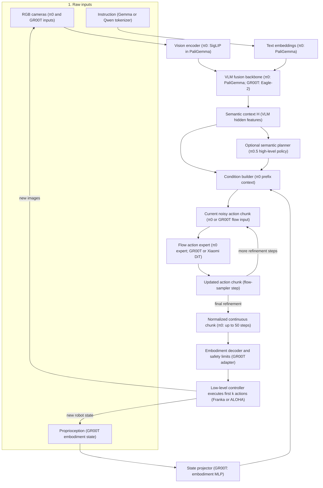

# The Core Pipeline of Modern Vision-Language-Action Models

## 1. The short version

A modern VLA usually has two main halves:

1. A **VLM backbone** turns images and language into a shared understanding of the situation.
2. An **action generator** combines that understanding with the robot's current body state and produces a short sequence of continuous robot commands.

An explicit planner is useful for long tasks, but it is **not required in every VLA**. Planning may be:

- implicit inside the VLM features;
- explicit as a textual subtask;
- performed by a separate planner.



[100.89.98.89:7861/api/videos/download-zip?batch=0&amp;size=500](http://100.89.98.89:7861/api/videos/download-zip?batch=0&size=500)Read the diagram as two connected loops:

- The **inner generation loop** repeatedly changes a noisy action tensor into a coherent action chunk.
- The **outer control loop** executes only part of that chunk, captures a new observation, and runs the VLA again.

The instruction usually stays fixed during one task, so it can be cached. Images and proprioception change after execution and must be refreshed.

This is the recent mainstream pattern. Models such as **π0**, **π0.5**, **GR00T N1**, **Xiaomi-Robotics-0**, and **DeMaVLA** use a pretrained VLM together with a robot-oriented action module. Recent 2026 models still largely follow this division rather than making the language model directly spell out every motor value.

## 2. The modules

| Module                                      | What enters                                         | What it does                                                       | What leaves                                 | Example models                                                                         |
| ------------------------------------------- | --------------------------------------------------- | ------------------------------------------------------------------ | ------------------------------------------- | -------------------------------------------------------------------------------------- |
| **Input builder**                     | Images, instruction, robot state, sometimes history | Arranges all current information for the model                     | A multimodal input sample                   | π0, GR00T N1, Xiaomi-Robotics-0                                                       |
| **Vision encoder**                    | Camera images                                       | Converts image patches into vectors                                | Visual tokens                               | OpenVLA, GR00T N1, DeMaVLA                                                             |
| **Language encoder**                  | Instruction text                                    | Converts words into vectors                                        | Text tokens                                 | All VLM-based VLAs                                                                     |
| **VLM backbone**                      | Visual and text tokens                              | Fuses scene information with task meaning                          | Context features                            | PaliGemma in π0/π0.5; Eagle-2 in GR00T N1; Qwen3-VL in Xiaomi-Robotics-0 and DeMaVLA |
| **Planner / reasoner** *(optional)* | VLM context and overall task                        | Chooses the next semantic subtask or plan                          | Textual or hidden plan                      | π0.5; GR00T N1 System 2; legacy SayCan and VoxPoser                                   |
| **State / embodiment adapter**        | Joint positions, end-effector pose, gripper state   | Maps robot-specific numbers into the model's internal vector size  | Robot-state features                        | π0, GR00T N1, DeMaVLA                                                                 |
| **Action generator**                  | VLM context, robot state, optional subtask          | Produces one action or an action chunk                             | Continuous values or discrete action tokens | π0 action expert; GR00T N1 DiT; OpenVLA-OFT; FAST                                     |
| **Action decoder and controller**     | Model action output                                 | Converts normalized predictions into commands for the actual robot | Joint or end-effector commands              | Present in every deployed VLA                                                          |
| **Feedback loop**                     | New camera image and robot state                    | Runs the pipeline again after execution                            | Corrected next action                       | Closed-loop VLAs generally                                                             |

## 3. From text and images to shared context

### 3.1 Images become visual tokens

Each camera image is divided into patches and processed by a vision encoder, just as in a ViT. The result is a sequence of visual vectors. Multiple cameras produce multiple groups of visual tokens.

The visual encoder does not directly output “cup,” “handle,” or a movement command. It produces features from which the following Transformer can recover objects, spatial relationships, and task-relevant details.

Examples:

- **OpenVLA** combines SigLIP and DINOv2 visual features before passing them to its language backbone.
- **GR00T N1** uses the vision component of Eagle-2 and extracts VLM features for its action module.
- **DeMaVLA** uses Qwen3-VL to process several camera views.

### 3.2 The instruction becomes text tokens

The instruction is tokenized normally:

```text
"put the red mug on the tray"
    ↓
[put] [the] [red] [mug] [on] [the] [tray]
    ↓
text embeddings
```

Language supplies the task goal and selects which visual information matters. The same image should produce different actions for “pick up the mug,” “move around the mug,” and “point at the mug.”

### 3.3 The VLM fuses both modalities

The visual and text embeddings enter the VLM Transformer. Through attention, the instruction can attend to relevant image regions and visual tokens can be interpreted in the context of the request.

The important output is usually not a natural-language response. It is a sequence of **context features** containing information such as:

- which object satisfies “red mug”;
- where it is relative to the robot;
- what kind of interaction the instruction requests;
- which obstacles or destination areas are relevant.

Modern action generators condition on these features. For example, GR00T N1 passes VLM outputs, robot state, and action encodings to its diffusion Transformer. Xiaomi-Robotics-0 conditions its action-generating DiT on the VLM's cached features and proprioception. [GR00T N1 paper](https://arxiv.org/abs/2503.14734), [Xiaomi-Robotics-0 paper](https://arxiv.org/abs/2602.12684)

## 4. Planner and reasoning: required or optional?

### 4.1 Implicit planning

For short tasks, many end-to-end VLAs pass the VLM context directly to the action generator:

```text
image + "pick up the cup" → shared context → action chunk
```

There is no visible list of steps. Any task decomposition is stored implicitly in the hidden features and learned behavior. **π0**, standard **OpenVLA-OFT**, and **Xiaomi-Robotics-0** can be understood this way for their normal low-level inference.

Advantages: fast, simple, and jointly trainable.

Limitation: for a long task, it can forget progress, repeat a subtask, or choose locally reasonable movements that do not complete the overall goal.

### 4.2 Explicit semantic planning

For long-horizon tasks, a high-level module may first predict a short semantic action:

```text
overall task: "clean the kitchen"
current scene: dirty plate on counter
next semantic subtask: "pick up the dirty plate"
```

The low-level action generator then acts under that subtask until the planner is called again.

**π0.5** is a clear recent example. The same model first predicts a textual subtask and then conditions its action expert on that subtask. The high-level prediction runs less frequently than low-level control. This is closer to hierarchical control than to printing a long chain of thought. [π0.5 paper](https://arxiv.org/abs/2504.16054)

**GR00T N1** calls its VLM component “System 2” and its fast action module “System 1.” System 2 supplies semantic context while System 1 generates high-frequency movement. However, “reasoning module” does not necessarily mean that the model prints a human-readable plan on every step.

### 4.3 Separate modular planning: the legacy route

Earlier systems made the boundaries much more explicit:

- **SayCan** used an LLM to propose high-level skills and learned value functions to prefer actions feasible for the current robot and scene.
- **VoxPoser** used language and vision models to construct 3D interaction maps, then a motion planner converted those maps into trajectories.

These systems are interpretable and can reuse existing controllers, but errors can accumulate between modules. They also depend heavily on the predefined skill library, interfaces, and planner assumptions. [SayCan paper](https://arxiv.org/abs/2204.01691), [VoxPoser paper](https://arxiv.org/abs/2307.05973)

### 4.4 Reasoning is not always chain of thought

In VLA papers, “reasoning” may refer to three different things:

| Meaning                                    | Visible to a person? | Example                                             |
| ------------------------------------------ | -------------------: | --------------------------------------------------- |
| Semantic understanding inside VLM features |                   No | Recognizing that a sponge is appropriate for wiping |
| Explicit subtask prediction                |                  Yes | “Pick up the sponge” in π0.5                     |
| Textual chain of thought before acting     |                  Yes | Reasoning-enhanced RT-2 variants                    |

A visible explanation is not automatically a better controller. The most important requirement is that task understanding changes the generated physical action correctly.

## 5. How the action is generated

### Important clarification: “action token” has two meanings

The attached survey uses **action token** broadly for any action-related output or intermediate representation: text plans, target points, trajectories, goal images, hidden vectors, or raw actions.

In implementation papers, **action token** often means a narrow technical object: a discrete integer in the language model vocabulary that later decodes into a motor value.

Depending on the model, an action token may represent one action dimension, one complete action, part of a compressed action chunk, or an entire short behavior. A sequence of action tokens may also jointly represent an action chunk.

Modern flow-based VLAs often generate continuous action vectors rather than literal vocabulary tokens. They still fit the survey's broad action-token framework, but saying that they “predict action tokens like words” would be misleading.

### 5.1 Recent mainstream: a continuous action expert (policy)

The common recent design is:

```text
VLM context + robot state + noisy candidate actions
                         ↓
             diffusion/flow Transformer
                         ↓
            smooth continuous action chunk
```

The process is:

1. Reserve a short future window, such as the next 8, 16, or 50 control steps.
2. Begin with a noisy candidate action chunk.
3. Give the action module the VLM context, robot state, and noisy chunk.
4. The action module predicts how the chunk should change to resemble a successful robot trajectory.
5. Repeat the update several times.
6. Obtain a continuous action chunk and execute part of it.

This approach is called **diffusion** or **flow matching**, depending on the exact training and generation formulation. It is useful because robot movement is continuous and several movements may be valid in the same situation.

Similar to **Diffusion** in image: a noisy action chunk -> denoise and generate -> readable action chunk (Hence **Diffusion** in the name)

Representative models:

- **π0:** PaliGemma VLM backbone plus a smaller flow-matching action expert; predicts high-frequency action chunks. [π0 paper](https://arxiv.org/abs/2410.24164)
- **π0.5:** adds hybrid pretraining and high-level semantic subtask inference before continuous low-level generation.
- **GR00T N1:** Eagle-2 VLM plus a DiT flow-matching policy with embodiment-specific state and action adapters.
- **Xiaomi-Robotics-0:** Qwen3-VL plus a DiT conditioned on VLM features and robot state; emphasizes asynchronous, smooth real-time execution.
- **DeMaVLA:** Qwen3-VL plus a robot-specific flow action expert for bimanual deformable-object manipulation. [DeMaVLA paper](https://arxiv.org/abs/2605.31286)

### 5.2 Parallel continuous regression

An action head can also predict all values in the chunk directly in one forward pass:

An **end - to - end** direct action generator.

```text
context → [action t, action t+1, ..., action t+H] 
```

**OpenVLA-OFT** showed that parallel decoding, continuous action values, action chunking, and a simple regression loss can be both fast and strong. It avoids iterative flow sampling, though it may represent complex multi-choice action distributions less naturally. [OpenVLA-OFT paper](https://arxiv.org/abs/2502.19645)

### 5.3 Discrete autoregressive action tokens

The historically important approach makes motor values look like language tokens:

```text
continuous action → numeric bins → token IDs → next-token prediction
predicted token IDs → numeric bins → continuous action
```

- **RT-2** established the “actions as another language” formulation.
- **OpenVLA** mapped each action dimension into one of 256 bins and trained the language model to predict those action tokens.

This reuses the standard LLM training objective and architecture, but token-by-token decoding can be slow and simple binning can be poor for smooth, high-frequency movement. [RT-2 paper](https://arxiv.org/abs/2307.15818), [OpenVLA paper](https://arxiv.org/abs/2406.09246)

**FAST** is the modern improvement to this branch. Instead of independently tokenizing every value at every timestep, it first compresses the action sequence using a frequency transform and then tokenizes the compressed representation. This reduces repeated information and makes autoregressive action generation competitive on dexterous tasks. [FAST paper](https://arxiv.org/abs/2501.09747)

## 6. State adapters and embodiment

Images and language describe the task, but they do not fully tell the model where its own body currently is. The action module therefore also receives proprioception, such as:

```text
joint angles
joint velocities
end-effector position and rotation
gripper opening
mobile-base velocity
```

A small projection converts these numbers into model features. Cross-embodiment models may have separate input and output adapters for each robot because different robots have different numbers of joints and different command formats.

GR00T N1, for example, uses embodiment-specific state and action encoders/decoders around a shared action model. This lets semantic knowledge and behavior patterns be shared while respecting each robot's physical interface.

## 7. Decoding, execution, and feedback

The raw model output is usually normalized. Before execution, the system must:

1. convert it back to physical units;
2. select the correct robot-specific dimensions;
3. apply safety limits and workspace constraints;
4. send commands to the low-level controller.

The robot normally executes only part of the predicted chunk before observing again. This is **receding-horizon closed-loop control**:

```text
predict 16 actions → execute first few → observe again → predict a replacement chunk
```

Recent work increasingly treats chunk timing as a core architectural problem. If inference is slow, the next chunk may be based on an old image. Xiaomi-Robotics-0 specifically trains and deploys for asynchronous execution so that consecutive chunks remain smooth while computation and robot motion overlap.

## 8. How the pipeline evolved

| Period / style                   | Main idea                                                                            | Representative models                               |
| -------------------------------- | ------------------------------------------------------------------------------------ | --------------------------------------------------- |
| Modular planning                 | LLM/VLM chooses symbolic skills or spatial targets; conventional controller executes | SayCan, VoxPoser                                    |
| Early end-to-end VLA             | Turn each motor dimension into a discrete token and use next-token prediction        | RT-2, OpenVLA                                       |
| Modern continuous VLA            | VLM builds semantic context; a specialized action module generates continuous chunks | π0, GR00T N1, Xiaomi-Robotics-0, DeMaVLA           |
| Modern hierarchical VLA          | Slow semantic subtask prediction guides fast continuous control                      | π0.5; conceptually GR00T's System 2/System 1 split |
| Efficient autoregressive revival | Compress trajectories before predicting discrete action tokens                       | FAST / π0-FAST                                     |

The dominant recent lesson is not that one representation has won permanently. It is that **semantic understanding and precise motor generation benefit from different computation**, even when both parts are trained together.

## Sources

The common action-token framework comes from the attached *A Survey on Vision-Language-Action Models: An Action Tokenization Perspective*. Current architecture details were checked against the original papers linked throughout the report, with recent examples current through July 2026.

## 9. Full example: raw input to robot output

The following numbers are illustrative rather than copied from one specific model.

### Task and raw inputs

```text
Instruction:
"Put the red mug on the tray."

Images:
I_front = front camera RGB image
I_wrist = wrist camera RGB image

Robot state:
s_t = [joint angles, joint velocities, gripper opening]
```

### Step 1: encode text and images

```text
"Put the red mug on the tray"
    → text token IDs
    → text embeddings L = [l1, l2, ..., ln]

I_front, I_wrist
    → image patches
    → visual embeddings V = [v1, v2, ..., vm]
```

### Step 2: build visual-language context

```text
[V ; L]
    → VLM Transformer
    → context H

H contains information corresponding to:
- the red mug is left of the gripper;
- the tray is farther to the right;
- the requested object is the mug, not the nearby bowl;
- the immediate interaction should begin with reaching and grasping.
```

### Step 3: optional high-level prediction

A π0.5-style hierarchical model may produce:

```text
z_high = "pick up the red mug"
```

A direct end-to-end model skips this visible text and carries the relevant intention inside `H`.

### Step 4: encode the robot body state

```text
s_t
    → state projection
    → state feature S
```

### Step 5: generate an action chunk

For a modern flow-based model:

```text
initial noisy action chunk A_noise
condition = [H, S, optional z_high]

(A_noise, condition)
    → repeated action-expert updates
    → normalized continuous chunk A
```

Assume each action is a 7-value end-effector command:

```text
[Δx, Δy, Δz, Δroll, Δpitch, Δyaw, gripper]
```

An 8-step prediction might begin as follows:

```text
a_t   = [+0.012, -0.004, +0.006,  0.000, +0.010, -0.020, 1.0]
a_t+1 = [+0.011, -0.003, +0.005,  0.000, +0.008, -0.018, 1.0]
a_t+2 = [+0.009, -0.002, +0.003,  0.000, +0.005, -0.012, 1.0]
...
```

Here, the hand moves toward the mug while keeping the gripper open. Later chunks close the gripper, lift the mug, move toward the tray, and release it.

### Step 6: convert and execute

```text
normalized action values
    → de-normalize to metres, radians, and gripper command
    → enforce robot limits
    → send first few commands to controller
    → robot moves
```

### Step 7: close the loop

```text
new images + new robot state
    → run the entire pipeline again
    → replace the remaining old actions with a corrected chunk
```

The complete transformation is therefore:

```text
pixels + words + body numbers
    → visual, text, and state embeddings
    → shared task-aware VLM context
    → optional semantic subtask
    → continuous or discrete action representation
    → physical robot commands
    → new pixels and body numbers
```
