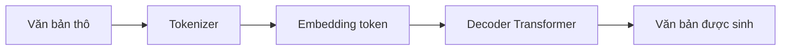
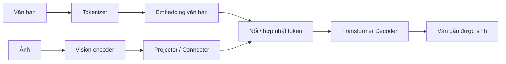
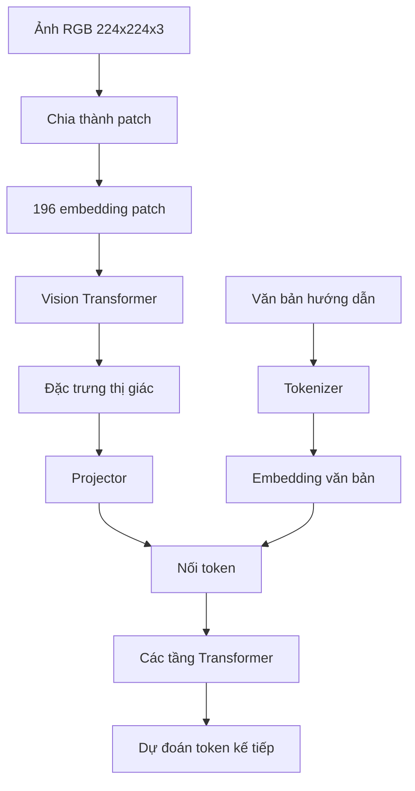
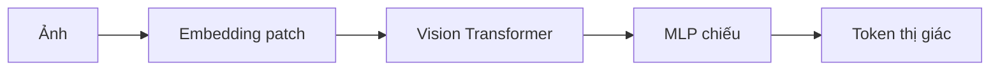
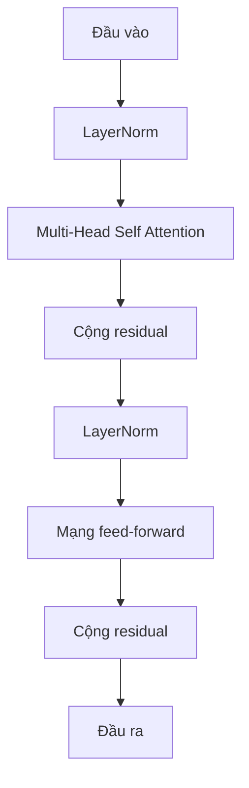
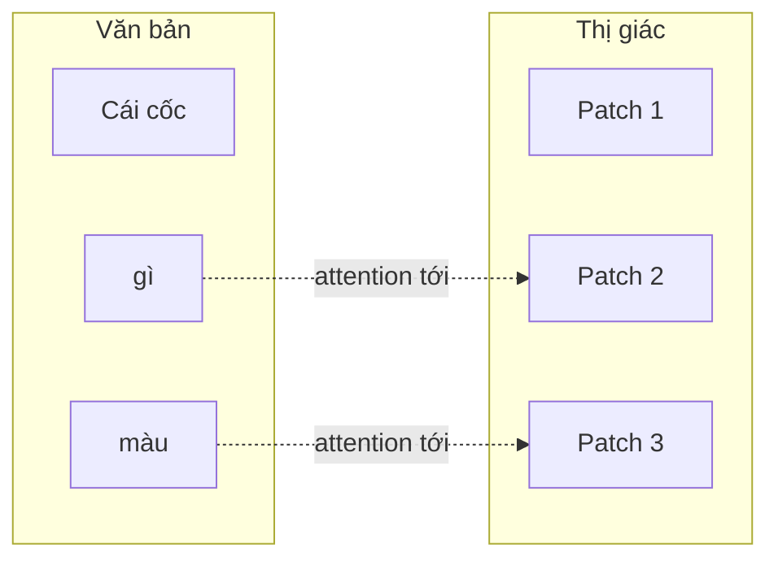
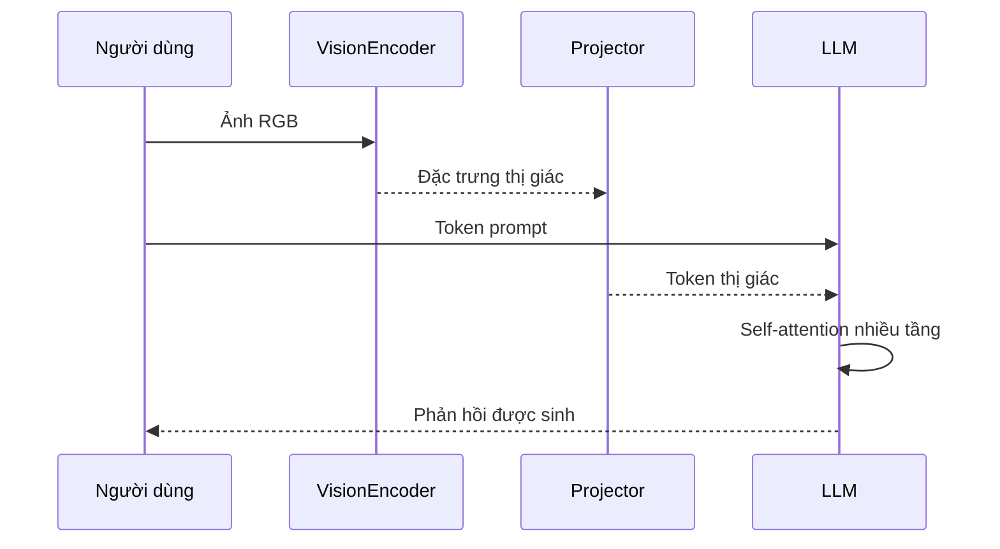

# So sánh sâu kiến trúc LLM và VLM

> Phiên bản này sử dụng sơ đồ Mermaid, bảng Markdown và bố cục có cấu trúc để
> dễ đọc.

## 1. Kiến trúc cấp cao





## 2. So sánh kiến trúc

  Thành phần             LLM              VLM

---

  Đầu vào                Văn bản          Văn bản + ảnh / video
  Tokenizer              Tokenizer văn bản Tokenizer văn bản + embedding patch ảnh
  Vision encoder         ✗                ✓
  Connector đa phương thức ✗              ✓
  Backbone Transformer   Chỉ decoder      Thường là cùng loại decoder
  Đầu ra                 Văn bản          Thường là văn bản, đôi khi là hành động hoặc hộp giới hạn

## 3. Luồng dữ liệu đầu cuối



## 4. Pipeline LLM

  Giai đoạn             Đầu ra

---

  Token hóa             ID số nguyên
  Embedding             Vector ẩn (ví dụ 4096 chiều)
  Mã hóa vị trí         Thông tin trình tự
  Các khối Transformer  Biểu diễn theo ngữ cảnh
  LM head               Logit trên bộ từ vựng
  Softmax               Xác suất token kế tiếp

## 5. Pipeline bổ sung của VLM



Ví dụ điển hình:

  Bước                         Shape

---

  Ảnh đầu vào               224×224×3
  Kích thước patch              16×16
  Số patch                        196
  Kích thước ẩn ViT              1024
  Kích thước ẩn LLM              4096
  Kích thước token sau chiếu     4096

## 6. Khối Transformer dùng chung



### Các phương trình attention

```text
Q = XW_Q
K = XW_K
V = XW_V

Attention(Q,K,V) = softmax(QKᵀ / √d) V
```

## 7. Cách ảnh và văn bản tương tác



## 8. Shape tensor xuyên suốt mạng

  Giai đoạn           Shape ví dụ

---

  Ảnh                 (224,224,3)
  Embedding patch     (196,768)
  Đầu ra ViT          (196,1024)
  Đầu ra projector    (196,4096)
  Embedding văn bản   (18,4096)
  Chuỗi kết hợp       (214,4096)
  Đầu ra decoder      (214,4096)
  Logit bộ từ vựng    (214,VocabSize)

## 9. Luồng suy luận hoàn chỉnh



## 10. Các họ kiến trúc chính

---

  Mô hình        Mô-đun thị giác Connector     Backbone LLM   Cách hợp nhất

---

  LLaVA          ViT            Tuyến tính / MLP Llama        Nối token

  BLIP-2         ViT            Q-Former       LLM đóng băng  Cross-attention

  Flamingo       ViT            Perceiver      LLM đóng băng  Cross-attention
                                Resampler                     xen kẽ

  InternVL       InternViT      MLP            InternLM       Nối token

  Qwen2.5-VL /   ViT            Connector      Qwen           Đa phương thức
  Qwen3.x-VL                    bản địa                       bản địa

  GPT-4o /       Độc quyền      Bản địa        Độc quyền      Đa phương thức
  Gemini                                                      đầu cuối
------------------------------------------------------------------------

## 11. Tóm tắt

---

  Khía cạnh               LLM                     VLM

---

  Cơ chế suy luận cốt lõi Transformer             Cùng loại Transformer
                                                  trong phần lớn mô hình

  Mô-đun mới              Không có                Vision encoder +
                                                  connector

  Trọng tâm nghiên cứu    Mở rộng quy mô và       Căn chỉnh thị giác-ngôn ngữ,
  lớn nhất                suy luận                 hiệu quả token và hợp nhất
                                                  đa phương thức

  Cốt lõi toán học        Self-attention          Cùng cơ chế self-attention;
                                                  chỉ khác đầu vào
--------------------------------------------------------------------

Về mặt khái niệm:

```text
VLM = Vision Encoder + Multimodal Connector + LLM
```
