# Các họ LLM hiện đại: Kiến trúc, huấn luyện, hành vi với prompt và luồng dữ liệu đầu-cuối

**Các họ được so sánh:** OpenAI GPT, Anthropic Claude, Google Gemini, Alibaba Qwen và Meta Llama
**Ngày nghiên cứu:** 2026-07-20
**Đối tượng độc giả:** Kỹ sư phần mềm, kỹ sư ML và nhà nghiên cứu AI

---

## 1. Kết luận tổng quan

Các họ mô hình lớn mới nhất **giống nhau ở cấp độ neural block hơn nhiều so với những gì hành vi sản phẩm của chúng thể hiện**.

Phần lớn vẫn dựa vào backbone tự hồi quy kiểu Transformer và tái sử dụng một tập hợp tương đối nhỏ các thành phần đã được kiểm chứng:

- positional encoding dạng rotary hoặc dẫn xuất từ rotary;
- attention key/value theo nhóm hoặc dùng chung;
- các lớp feed-forward có cổng;
- pre-normalization;
- các lớp Mixture-of-Experts dense hoặc sparse;
- KV caching và các attention kernel được tối ưu;
- sinh token tiếp theo theo kiểu tự hồi quy.

Các khác biệt quan trọng ngày càng xuất hiện ở những nơi khác:

1. **Dữ liệu và curriculum pretraining**
2. **Chiến lược pretraining đa phương thức**
3. **Mục tiêu post-training**
4. **Chính sách reasoning và test-time compute**
5. **Huấn luyện sử dụng công cụ và agent**
6. **Tối ưu an toàn và preference**
7. **định tuyến sản phẩm, bộ nhớ, truy xuất và điều phối**
8. **Cấu hình serving và giá trị decoding mặc định**

Điều này giải thích một quan sát phổ biến:

> Hai mô hình có thể có các thành phần Transformer nhìn chung tương tự nhau nhưng phản ứng rất khác nhau với cùng một prompt.

Neural backbone quyết định năng lực biểu diễn và tính toán cơ bản của mô hình. Pretraining quyết định các pattern và tri thức mà mô hình tiếp thu. Post-training quyết định cách mô hình hành xử như một trợ lý. Runtime quyết định khi nào mô hình reasoning, tìm kiếm, gọi công cụ, đặt câu hỏi, từ chối hoặc tiếp tục một cách tự chủ.

Một cách phân rã khái niệm hữu ích là:

```text
Hành vi mô hình quan sát được
=
kiến trúc cơ sở
+ phân phối pretraining
+ huấn luyện đa phương thức
+ mục tiêu post-training
+ chính sách reasoning
+ runtime công cụ
+ system prompt
+ cấu hình decoding
+ các lớp an toàn
+ bộ nhớ/truy xuất của sản phẩm
```

Đối với các trợ lý frontier hiện đại, tám hạng tử cuối thường giải thích nhiều khác biệt quan sát được hơn so với việc block sử dụng RoPE thông thường, partial RoPE, GQA hay một MoE router cụ thể.

---

## 2. Phạm vi và snapshot các mô hình mới nhất

Tài liệu công khai không đồng đều. Qwen và Llama công khai weight mô hình cùng nhiều tham số kiến trúc. OpenAI, Anthropic và Google công bố nhiều hơn đáng kể về năng lực, triển khai, các hạng mục huấn luyện và an toàn so với phần nội bộ chính xác ở cấp độ block.

| Họ | Snapshot thực tiễn mới nhất được ưu tiên tại đây | Những gì có thể kiểm tra công khai |
| ---------------- | -------------------------------------------------------------------------------------------------------------------------------- | ---------------------------------------------------------------------------------------------------------------------------------------------------------------------- |
| **GPT** | GPT-5.6 Sol, Terra và Luna | định tuyến sản phẩm, điều khiển reasoning, công cụ, giới hạn context, các hạng mục dữ liệu huấn luyện, reasoning RL, safety stack; phần nội bộ chính xác của Transformer vẫn chưa được công bố |
| **Claude** | Claude Sonnet 5 và Claude Fable 5 | Hành vi adaptive thinking, thay đổi tokenizer, hành vi với prompt, các hạng mục dữ liệu huấn luyện, alignment bằng Constitutional AI; kiến trúc block chính xác vẫn chưa được công bố |
| **Gemini** | Gemini 3.5 Flash, Gemini 3.1 Pro và Deep Think | Đa phương thức native, thinking level, giao diện công cụ, giới hạn context, các phương pháp safety/post-training tổng quát; phần nội bộ chi tiết của block hiện tại phần lớn vẫn chưa được công bố |
| **Qwen** | Qwen3.7-Max là mô hình agent hosted mới nhất; Qwen3.6-35B-A3B và Qwen3.6-27B là các open weight mới nhất có thể kiểm tra về mặt kỹ thuật | Cấu hình chi tiết, hybrid attention, định tuyến MoE, vision tower, context, chế độ reasoning, sampling, triển khai |
| **Llama** | Llama 4 Maverick và Scout | Trọng số mô hình, quy mô MoE, early multimodal fusion, context, ước tính token huấn luyện, chuỗi post-training, họ tokenizer |

### Chú giải mức độ công bố

- **Đã công bố:** được nêu trong tài liệu hoặc cấu hình chính thức của mô hình.
- **Cấp độ họ:** được ghi nhận cho một thế hệ trước hoặc thế hệ nền tảng, nhưng không đảm bảo là không thay đổi.
- **Không nêu rõ:** không được công khai trong tài liệu.
- **Suy luận:** diễn giải kỹ thuật hợp lý, không phải tuyên bố chính thức.

---

## 3. Nền tảng chung tóm lược

Một mô hình tự hồi quy hiện đại được đơn giản hóa vẫn có dạng:

```mermaid
flowchart LR
    A[Văn bản đầu vào và media tùy chọn] --> B[Tokenization và các modality encoder]
    B --> C[Chuỗi embedding hợp nhất]
    C --> D[Các model block lặp lại]
    D --> E[Normalization cuối]
    E --> F[Language-model head]
    F --> G[Phân phối token tiếp theo]
    G --> H[Sampling hoặc constrained decoding]
    H --> I[Phản hồi được sinh hoặc lệnh gọi công cụ]
```

Một block thông thường có dạng gần đúng:

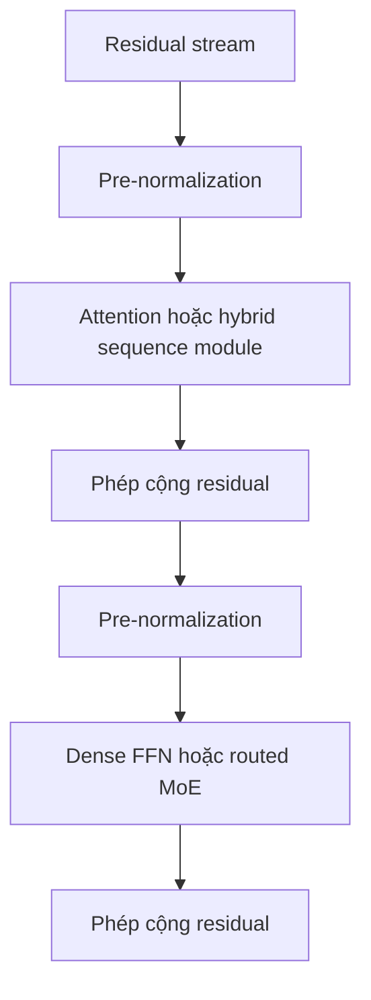

Chi tiết triển khai khác nhau, nhưng pattern này vẫn có thể nhận ra ở nhiều họ.

---

# Phần I — So sánh kiến trúc

## 4. So sánh kiến trúc ở mức tổng quan

| Phân hệ | GPT-5.6 | Claude 5 | Gemini 3.x | Qwen3.6 | Llama 4 |
| --------------------- | ------------------------------------------------------------ | ----------------------------------------------------- | ------------------------------------------------------------------------- | ---------------------------------------------------------------------------------------------------------------- | --------------------------------------------------------------------- |
| Kiểu sinh cốt lõi | Hệ thống reasoning tự hồi quy; không nêu rõ các block nội bộ | Trợ lý tự hồi quy; không nêu rõ các block nội bộ | Mô hình reasoning đa phương thức native; không nêu rõ loại block chính xác hiện tại | Mô hình đa phương thức native tự hồi quy | Mô hình đa phương thức native tự hồi quy |
| Dense so với MoE | Không nêu rõ | Không nêu rõ | Không nêu rõ đối với Gemini 3.x hiện tại | Các biến thể dense 27B và sparse 35B-A3B | Sparse MoE |
| Attention | Không nêu rõ | Không nêu rõ | Không nêu rõ | Hybrid sequence stack: ba lớp linear attention, sau đó là một lớp full attention; GQA trong full attention | Attention kết hợp MoE; Scout sử dụng thiết kế long-context liên quan đến iRoPE |
| Positional encoding | Không nêu rõ | Không nêu rõ | Không nêu rõ | Partial multimodal RoPE, các phân đoạn đa phương thức xen kẽ, RoPE base lớn | Họ RoPE/iRoPE |
| Activation của FFN | Không nêu rõ | Không nêu rõ | Không nêu rõ | Expert path có cổng SiLU; vision tower sử dụng biến thể GELU | Chưa được nêu đầy đủ trong tài liệu ra mắt công khai hiện tại |
| Normalization | Không nêu rõ | Không nêu rõ | Không nêu rõ | RMSNorm | Chưa được nêu đầy đủ công khai cho lần ra mắt Llama 4 |
| Multimodal fusion | Sản phẩm hỗ trợ đầu vào ảnh/file; không nêu rõ phần nội bộ | Đầu vào ảnh và tài liệu; không nêu rõ phần nội bộ | Xử lý text-image-audio-video native | Checkpoint vision-language native với vision tower và multimodal RoPE tường minh | Early fusion của biểu diễn hình ảnh và văn bản vào một backbone dùng chung |
| Sử dụng công cụ | Công cụ tích hợp sẵn và công cụ tùy chỉnh là thành phần hạng nhất | Công cụ hạng nhất và hệ sinh thái MCP | Function call, tìm kiếm, thực thi code, sử dụng máy tính | Mô hình và hệ sinh thái Qwen-Agent/Qwen-Code | Thường do deployment runtime hoặc Llama Stack cung cấp |
| Điều khiển reasoning | Các reasoning level và hành vi hệ thống được định tuyến | Adaptive thinking và các effort level | Thinking level và Deep Think | Thinking bật mặc định; có thể tắt qua tham số serving | Không có một bộ điều khiển reasoning cấp sản phẩm phổ quát duy nhất trong raw weight |
| Open weight | Không | Không | Không đối với Gemini | Có, Apache 2.0 cho các biến thể mở | Có, theo Llama Community License |

Thay đổi kiến trúc mạnh nhất trong số các mô hình mới nhất có thể kiểm tra là việc Qwen3.6 chuyển từ stack full attention tiêu chuẩn ở mọi lớp sang **stack hybrid recurrent/linear attention và full attention**. Về mặt cấu trúc, điều này đáng kể hơn việc chỉ chuyển từ MHA sang GQA.

---

## 5. GPT-5.6: kiến trúc hệ thống quan sát được công khai

OpenAI không công bố GPT-5.6 sử dụng mạng dense, MoE, GQA, MLA, RoPE hay một tổ hợp nội bộ nào khác.

Kiến trúc công khai được hiểu rõ hơn ở **cấp độ hệ thống**:

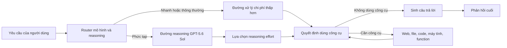

### Các đặc điểm đáng chú ý về mặt kiến trúc

- Sản phẩm được triển khai hoạt động như một **hệ thống các lựa chọn mô hình và reasoning level**, không đơn thuần là một forward pass cố định.
- Reasoning effort làm thay đổi lượng suy xét ẩn và thường cả mức độ sẵn sàng sử dụng công cụ.
- API cung cấp khả năng kiểm soát tường minh đối với reasoning và độ dài đầu ra.
- Các lệnh gọi công cụ có thể chạy tuần tự hoặc song song.
- Prompt caching và xử lý long-context là một phần của kiến trúc hiệu dụng dù chúng không phải neural layer.

### Hàm ý thiết kế

Đối với GPT, bề mặt tối ưu hóa chính thường là:

```text
router + ngân sách reasoning + công cụ + prompt cache + điều phối agent
```

thay vì truy cập trực tiếp vào cấu hình attention hoặc MoE.

---

## 6. Claude Sonnet 5 và Fable 5: kiến trúc lấy hành vi làm trung tâm

Anthropic cũng không công bố thiết kế Transformer block chính xác của các mô hình Claude hiện tại.

Hệ thống có thể quan sát công khai chủ yếu được định hình bởi:

- adaptive thinking;
- các effort level;
- xử lý tài liệu long-context;
- sử dụng công cụ;
- workflow agent bền vững;
- hành vi được định hình bởi Constitutional AI;
- định tuyến an toàn cho các yêu cầu rủi ro cao.

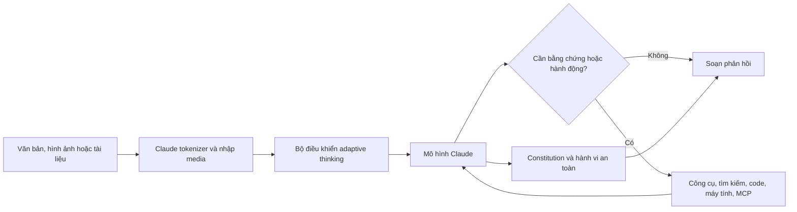

### Hành vi với prompt riêng của Sonnet 5

Anthropic ghi nhận một số thay đổi về hành vi:

- Độ dài phản hồi thích ứng với độ phức tạp của tác vụ.
- Chỉ dẫn được diễn giải sát nghĩa hơn.
- Effort level thấp giới hạn mạnh mức độ mô hình đi xa hơn yêu cầu tường minh.
- Adaptive thinking được bật mặc định.
- Effort cao hơn làm tăng việc sử dụng công cụ và tự kiểm chứng.
- Tùy nội dung, tokenizer mới có thể tạo nhiều hơn khoảng 30% token so với Sonnet 4.6 cho văn bản tương đương.
- Sonnet 5 không chấp nhận các điều khiển temperature, top-p và top-k khác mặc định; nên kiểm soát style qua chỉ dẫn.

### Hàm ý thiết kế

Hành vi thực tiễn của Claude chịu ảnh hưởng lớn bởi:

```text
effort level
+ phạm vi tác vụ tường minh
+ ví dụ tích cực
+ cấu trúc context
+ alignment theo hiến pháp
```

Một chỉ dẫn mơ hồ như "hãy thận trọng" có thể được tuân theo sát nghĩa hơn dự kiến.

---

## 7. Gemini 3.5 Flash và Gemini 3.1 Pro

Google mô tả Gemini là một **họ reasoning đa phương thức native**. Các mô hình hiện tại có thể tiếp nhận tổ hợp của:

- văn bản;
- hình ảnh;
- video;
- âm thanh;
- PDF;
- repository code lớn.

Tài liệu sản phẩm công khai mới nhất không cung cấp đầy đủ chi tiết về thiết kế attention, MoE, FFN hoặc positional encoding hiện tại.

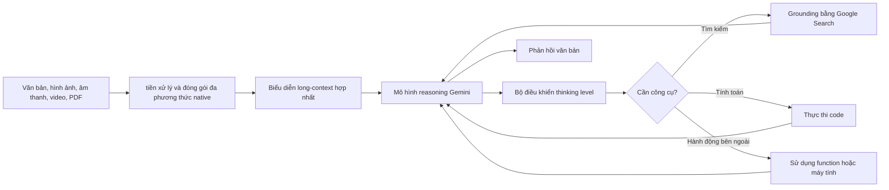

### Các đặc điểm đáng chú ý về mặt kiến trúc

- Đa phương thức không được trình bày dưới dạng adapter tùy chọn được thêm vào sau khi huấn luyện văn bản; nó là một thiết kế thiết kế trung tâm ở cấp độ họ.
- Gemini 3.5 Flash dựa trên nền tảng reasoning và thể hiện thinking level.
- runtime của mô hình tích hợp chặt chẽ tìm kiếm, code execution, structured output và computer use.
- deployment của Google được tối ưu hóa dựa trên cơ sở hạ tầng TPU, JAX và ML Pathways.
- Hành vi của mô hình Gemini bị điều chỉnh mạnh mẽ bởi thứ tự context: Google khuyên bạn nên đặt context lớn trước và tác vụ cuối cùng ở cuối.

### Hàm ý prompt

Các mô hình Gemini 3 thường thích:

- hướng dẫn ngắn gọn;
- những hạn chế rõ ràng;
- mặc định ổn định sampling;
- context lớn trước câu hỏi;
- yêu cầu rõ ràng về độ chi tiết.

Scaffolding kỹ thuật prompt rất phức tạp có thể gây ra sự phân tích quá mức không cần thiết.

---

## 8. Qwen3.6: kiến trúc dễ kiểm tra nhất hiện nay

Các mô hình Qwen3.6 mở mới nhất có multimodal native và hiển thị cấu hình chi tiết.

### 8.1 Qwen3.6-35B-A3B

Các giá trị cấu hình chính thức quan trọng bao gồm:

| Thuộc tính | Giá trị |
| ---------------------------------- | -------------------------------: |
| Tổng tham số | Khoảng 35B |
| Tham số hoạt động | Khoảng 3B |
| Lớp ẩn | 40 |
| chuyên gia | 256 |
| Các chuyên gia được chọn theo token | 8 |
| Chu kỳ full attention | Mỗi lớp thứ tư |
| Số Q head của full attention | 16 |
| Đầu KV | 2 |
| Kích thước attention head | 256 |
| Số position embedding native tối đa | 262,144 |
| Từ vựng | 248,320 |
| Độ sâu Vision tower | 27 |
| Kích thước vision patch | 16 |
| Kích thước temporal patch | 2 |
| dtype native | BF16 |
| Đầu dự đoán bổ sung | Một lớp dự đoán đa token |

Lịch các lớp có dạng gần đúng:

```text
Linear/recurrent attention
Linear/recurrent attention
Linear/recurrent attention
Full GQA attention
(lặp lại)
```

Mô hình kết hợp:

- xử lý chuỗi tuyến tính/recurrent có cổng cho hầu hết các lớp;
- full attention định kỳ cho tương tác toàn cục;
- định tuyến sparse expert;
- multimodal RoPE;
- vision encoder native;
- Hỗ trợ multi-token prediction.

```mermaid
flowchart LR
    T[Văn bản] --> Tok[248k-từ vựng tokenizer]
    Img[Hình ảnh hoặc video] --> ViT[vision tower 27 lớp]
    Tok --> Pack[Chuỗi multimodal xen kẽ]
    ViT --> Pack
    Pack --> L1[Linear attention]
    L1 --> L2[Linear attention]
    L2 --> L3[Linear attention]
    L3 --> FA[Full grouped-query attention]
    FA --> Router[MoE router]
    Router --> E[8 trong số 256 chuyên gia cộng với đường dẫn expert được chia sẻ]
    E --> Next[Lặp lại mô hình khối hybrid]
    Next --> Think[Thinking hoặc chính sách phản hồi trực tiếp]
    Think --> Out[Token cuộc gọi văn bản hoặc công cụ]
```

### Tại sao điều này lại quan trọng

So với attention Transformer đầy đủ tiêu chuẩn:

- recurrent hoặc các lớp tuyến tính giảm chi phí long-context;
- full attention định kỳ khôi phục tương tác token toàn cầu;
- Các chuyên gia sparse tăng dung lượng tham số mà không cần kích hoạt tất cả các weight;
- số lượng đầu KV thấp làm giảm cache;
- multimodal RoPE mã hóa trục thời gian và không gian;
- multi-token prediction có thể cải thiện hiệu quả huấn luyện và hỗ trợ decoding.

### Hành vi với prompt của Qwen3.6

- Thinking được bật theo mặc định.
- Chế độ Non-thinking được chọn bằng cách sử dụng các tham số serving hoặc chat template.
- Qwen3.6 không còn dựa vào soft switch `/think` và `/no_think` của Qwen3 nữa.
- Dấu vết reasoning lịch sử có thể được lưu giữ tùy ý cho các agent nhiều lượt.
- Qwen xuất bản các cài đặt sampling được đề xuất khác nhau cho reasoning chung, coding chính xác và phản hồi non-thinking.
- greedy decoding thường không được khuyến khích đối với các biến thể reasoning vì nó có thể tạo ra hành vi lặp lại hoặc xuống cấp.

Điều này làm cho Qwen minh bạch một cách bất thường về mối liên hệ giữa kiến trúc, decoding và hành vi quan sát được.

---

## 9. Llama 4 Maverick và Scout

Llama 4 là họ multimodal MoE có weight mở.

| Biến thể | Tham số hoạt động | Tổng tham số | chuyên gia | Context |
| -------- | ----------------: | ---------------: | ------: | ------: |
| Scout | 17B | 109B | 16 | 10M |
| Maverick | 17B | 400B | 128 | 1M |

### Đặc điểm thiết kế chính

- sinh tự hồi quy;
- định tuyến MoE;
- early fusion giữa hình ảnh và văn bản;
- Xử lý vision dựa trên MetaCLIP;
- context lớn;
- tokenizer có nguồn gốc từ họ TikToken;
- thiết kế long-context liên quan đến iRoPE trong Scout.

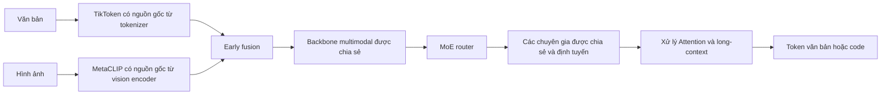

### Sự khác biệt thực tế quan trọng

Llama là một sản phẩm phát hành weight chứ không phải một sản phẩm trợ lý cố định. Vì vậy, "hành vi của Llama" phụ thuộc rất nhiều vào:

- checkpoint chính xác;
- chat template;
- system prompt;
- quantization;
- inference engine;
- tool wrapper;
- safety model;
- fine-tune hoặc adapter;
- retrieval system;
- Tham số decoding.

Dịch vụ Llama được lưu trữ và Llama checkpoint cục bộ có thể giống như những trợ lý khác nhau ngay cả khi chúng có cùng weight cơ bản.

---

# Phần II-Tại sao cùng một prompt lại cho cảm giác khác biệt

## 10. So sánh hành vi mức tổng quan

Đây là những xu hướng được ghi nhận và hàm ý kỹ thuật, không phải là nhãn tính cách phổ quát.

| Khía cạnh | GPT-5.6 | Claude Sonnet 5 | Gemini 3.x | Qwen3.6 | Llama 4 |
| ----------------------- | ------------------------------------------------------------------------ | -------------------------------------------------------------- | ------------------------------------------------------------- | ----------------------------------------------------------------- | -------------------------------------------------------------------------------------- |
| Tương tác mặc định | Có tính định hướng cao, được sản phẩm hóa, thường chủ động trong các tác vụ agent | Sát nghĩa, nhạy cảm với phạm vi, độ sâu thích ứng | Trực tiếp và ngắn gọn; được tối ưu hóa cho các tác vụ multimodal có cấu trúc | Reasoning-đầu tiên theo mặc định | Phụ thuộc nhiều vào deployment |
| Điều khiển Reasoning | Reasoning level rõ ràng | Adaptive thinking cộng với effort | Thinking level/Deep Think | Bật hoặc tắt thinking trong cấu hình serving | Thường được triển khai bởi prompt hoặc runtime bên ngoài |
| Độ dài | Kiểm soát điều khiển verbosity tường minh và hướng dẫn prompt | Điều chỉnh độ dài theo độ phức tạp; prompt cho kiểu cố định | Ngắn gọn theo mặc định; yêu cầu chi tiết một cách rõ ràng | Có thể trở nên dài vì reasoning được bật | Phụ thuộc nhiều vào sampling và fine-tune |
| Hành vi công cụ | Điều phối công cụ tích hợp mạnh mẽ | Sử dụng nhiều công cụ hơn ở effort cao hơn; xu hướng tự xác minh | Các công cụ tìm kiếm/mã/function được tích hợp chặt chẽ | Định hướng coding/agent mạnh mẽ; phụ thuộc vào framework | runtime bên ngoài thường điều khiển các công cụ |
| Sát nghĩa của hướng dẫn | Tuân theo hướng dẫn mạnh mẽ nhưng có thể chủ động hoàn thành các tác vụ rộng hơn | Đặc biệt sát nghĩa; phạm vi phải rõ ràng | Thích hướng dẫn trực tiếp, rõ ràng | Thường đáp ứng tốt nhất với chế độ rõ ràng và cấu hình sampling | Thay đổi theo fine-tune |
| Prompt context dài | Có thể sử dụng tìm kiếm file, cache và native context dài | Quy trình làm việc tài liệu mạnh mẽ; trích dẫn đầu tiên có thể cải thiện grounding | Đặt context lên hàng đầu và tác vụ cuối cùng | Cấu hình mở Native 262K; vấn đề chi phí bộ nhớ cục bộ | Scout quảng cáo context cực lớn; chất lượng retrieval thực tế phụ thuộc vào serving và tác vụ |
| Hành vi an toàn | Safe completion và các bộ giám sát phân lớp | Rủi ro ở cấp độ hội thoại và reasoning rủi ro ở cấp hội thoại theo hiến pháp | Chính sách có điều kiện với các bộ lọc sản phẩm | Phụ thuộc vào guardrail checkpoint và deployment chính thức | An toàn thường là lớp Llama Guard/runtime riêng biệt |
| Độ tái lập | Điều khiển API ổn định nhưng cập nhật độc quyền | Giao diện effort ổn định; không có sampling tùy chỉnh trên Sonnet 5 | Mặc định được đề xuất; thay đổi sampling có thể làm giảm chất lượng reasoning | Kiểm soát weight cao và decoding | Kiểm soát cao nhất nhưng cũng có sự khác biệt về hành vi cao nhất |

---

## 11. Người dùng nhận thấy điều gì với cùng một prompt

### Ví dụ prompt

```text
Xem lại repository này.

Tìm tất cả các lỗi có thể gây ra hành vi không chính xác, lỗi kiểm thử,
vấn đề bảo mật, đầu ra sai lệch hoặc rủi ro về khả năng bảo trì.

Chưa sửa đổi file.

Đối với mỗi vấn đề cung cấp:
- file và dòng
- mức độ nghiêm trọng
- độ tin cậy
- lời giải thích
- bản sửa tối thiểu

Sử dụng các công cụ khi hữu ích. Xác minh các tuyên bố không chắc chắn.
```

### Xu hướng GPT-5.6

Cấu hình GPT reasoning cao có khả năng:

1. tạo một kế hoạch ngắn;
2. kiểm tra cấu trúc repository;
3. tìm kiếm nhiều file;
4. chạy kiểm thử hoặc kiểm tra tĩnh khi có sẵn công cụ;
5. báo cáo kết quả trong cấu trúc được yêu cầu;
6. đôi khi tiếp tục chủ động cho đến khi kho được bao phủ rộng rãi.

prompt phải nêu rõ liệu mô hình có thể chạy lệnh, cài đặt các dependency hay dừng sau một số lần phát hiện cố định hay không. Mặt khác, huấn luyện agent của GPT có thể khuyến khích việc hoàn thành tự chủ rộng rãi hơn.

### Xu hướng Claude Sonnet 5

Claude có khả năng diễn giải từng bộ lọc sát nghĩa.

Nếu prompt chỉ nói "báo cáo các vấn đề nghiêm trọng", Claude có thể điều tra các vấn đề ở mức độ nghiêm trọng thấp hơn nhưng loại bỏ chúng khỏi phản hồi cuối cùng. Phiên bản cải tiến ở trên xác định rõ ràng những gì được tính và yêu cầu mọi phát hiện đều nghiêm túc và đáng tin cậy.

Ở mức effort thấp, Claude có thể có phạm vi hẹp. Ở mức cao hoặc xhigh effort, nó có nhiều khả năng sử dụng các công cụ, xác minh các phát hiện và kiểm tra repository nhiều hơn.

### Xu hướng Gemini 3

Gemini thường được hưởng lợi từ prompt trực tiếp với repository context đầu tiên và tác vụ cuối cùng là cuối cùng.

Nó thường đưa ra câu trả lời ngắn gọn, có cấu trúc trừ khi người dùng yêu cầu giải thích chi tiết. Một prompt kiểu cũ phức tạp chứa ngôn ngữ động lực lặp đi lặp lại, nhiều quy tắc lập kế hoạch dư thừa và nhiều tính cách xung đột có thể gây ra tình trạng phân tích quá mức.

Đối với các codebase dài, cách sắp xếp ưu tiên là:

```text
[repository hoặc context được truy xuất]

Dựa trên repository ở trên, hãy thực hiện đánh giá sau:
[yêu cầu chính xác]
```

### Xu hướng Qwen3.6

Qwen3.6 thường sẽ suy luận trước khi trả lời trừ khi thinking bị tắt.

Một cục bộ hoặc API deployment có thể hiển thị khối reasoning, phân tích cú pháp riêng biệt hoặc ẩn nó. Công việc ở cấp repository được hưởng lợi từ việc bảo toàn reasoning qua các lượt, nhưng điều này làm tăng mức sử dụng context và có thể giữ lại các lỗi trước đó.

Cấu hình Sampling quan trọng hơn rõ ràng so với các API đóng được quản lý chặt chẽ. sampling không chính xác có thể tạo ra sự lặp lại, lệnh gọi công cụ không đúng định dạng hoặc reasoning không cần thiết.

### Xu hướng Llama 4

Không có câu trả lời duy nhất nào có thể mô tả Llama 4 mà không chỉ định runtime.

Maverick checkpoint được triển khai cẩn thận với:

- chat template đúng;
- các ràng buộc structured output xác định;
- vòng lặp agent;
- retrieval;
- Llama Guard;
- điều chỉnh sampling;

có thể hoạt động giống như một trợ lý coding tinh tế.

Các weight tương tự với chat template không chính xác hoặc quantization quá mạnh có thể hiển thị hướng dẫn sau yếu hơn, lệnh gọi công cụ không đúng định dạng hoặc kiểu phản hồi không nhất quán.

---

## 12. Ma trận thích ứng Prompt

| Mục tiêu | GPT | Claude | Gemini | Qwen | Llama |
| ------------------------------ | --------------------------------------------------------- | -------------------------------------------------------- | -------------------------------------------------------- | --------------------------------------------------- | ---------------------------------------------------------------- |
| Thêm reasoning | Tăng reasoning effort | Nâng effort lên high/ xhigh/max | Tăng cấp độ thinking hoặc sử dụng Deep Think | Kích hoạt thinking; sử dụng reasoning sampling được đề xuất | Thêm vòng lặp reasoning bên ngoài hoặc sử dụng reasoning fine-tune |
| Độ trễ ít hơn | Giảm reasoning và verbosity | Hạ effort hoặc tắt thinking | Mức thinking thấp hơn; sử dụng Flash | Vô hiệu hóa thinking; sử dụng non-thinking sampling | Sử dụng weight nhỏ hơn/đã quantize và generation ngắn hơn |
| Đánh giá toàn diện hơn | Yêu cầu nó không dừng lại sớm và xác định mức độ bao phủ | Yêu cầu rõ ràng mọi vấn đề, kể cả mức độ tin cậy thấp | Xác định danh mục đầy đủ và yêu cầu đầu ra chi tiết | Kích hoạt thinking và xác định tiêu chí dừng | Sử dụng scaffolding agent nhiều lượt |
| Tài liệu dài tốt hơn grounding | Sử dụng tìm kiếm/trích dẫn file và các ràng buộc nguồn rõ ràng | Yêu cầu trích dẫn hỗ trợ trước khi tổng hợp | Đặt context trước, câu hỏi cuối cùng; sử dụng grounding | Cắt nhỏ hoặc sử dụng context dài có trích xuất bằng chứng | RAG bên ngoài thường an toàn hơn việc chỉ dựa vào context danh nghĩa |
| JSON ổn định | Sử dụng structured output/schema | Đưa ra schema và ví dụ | Sử dụng structured output API | Ràng buộc grammar/schema trong công cụ serving | Sử dụng decoding bị ràng buộc về grammar |
| Văn xuôi sáng tạo | Nâng cao độ chi tiết và xác định giọng văn | Đưa ra ví dụ về phong cách tích cực | Yêu cầu rõ ràng mức độ đàm thoại/chi tiết | Sử dụng non-thinking hoặc sampling được điều khiển để điều khiển phong cách | Fine-tune /system- prompt và điều chỉnh sampling |

---

## 13. Tại sao hành vi lại khác ngay cả khi backbone giống nhau

### 13.1 Các mục tiêu ưu tiên khác nhau

Post-training tối ưu hóa các ý tưởng khác nhau về một "câu trả lời hay":

- chính xác và có định hướng hành động;
- ngắn gọn và hiệu quả;
- thận trọng và tuân thủ Constitutional AI;
- toàn diện và có định hướng nghiên cứu;
- sử dụng công cụ và tự chủ;
- đàm thoại và được hiệu chỉnh về cảm xúc.

Những mục tiêu này có thể xung đột.

Ví dụ:

```text
mức độ hữu ích tối đa
so với
số tuyên bố không có căn cứ ở mức tối thiểu
so với
độ trễ tối thiểu
so với
mức độ hoàn thành tác vụ tối đa
so với
rủi ro an toàn tối thiểu
```

Một mô hình được huấn luyện để tối đa hóa khả năng hoàn thành tác vụ có thể chủ động thực hiện nhiều bước hơn. Một mô hình được huấn luyện để tuân thủ sát nghĩa có thể tránh làm bất cứ điều gì không được yêu cầu rõ ràng.

### 13.2 Các chính sách reasoning khác nhau

Mô hình cơ sở không tự động quyết định chi phí reasoning theo cách giống nhau giữa các sản phẩm.

- GPT hiển thị các cấp độ reasoning và định tuyến mô hình.
- Claude sử dụng adaptive thinking và effort.
- Gemini sử dụng thinking level và Deep Think chuyên dụng.
- Qwen có thể phát ra reasoning trace theo mặc định.
- Llama dựa trên checkpoint và runtime đã chọn.

### 13.3 Chính sách công cụ khác nhau

Mô hình có thể đã học được:

- khi nào cần tìm kiếm;
- khi nào cần tính toán;
- khi nào nên gọi code execution;
- có bao nhiêu công cụ để gọi;
- có xác minh đầu ra của công cụ hay không;
- có nên tiếp tục sau khi thành công một phần hay không;
- cách khắc phục lỗi công cụ.

Đây là các thuộc tính post-training cũng như các thuộc tính kiến trúc.

### 13.4 Mục tiêu an toàn khác nhau

Huấn luyện an toàn thay đổi nhiều hơn là từ chối. Nó có thể ảnh hưởng đến:

- ngôn ngữ không chắc chắn;
- số lượng giải thích;
- liệu có bao gồm thông tin liền kề lành tính hay không;
- sẵn sàng suy luận ý định của người dùng;
- theo dõi rủi ro ở cấp độ cuộc trò chuyện;
- yêu cầu xác nhận trước khi hành động bên ngoài.

### 13.5 Prompt sản phẩm khác nhau

Trợ lý thương mại thường nhận được các system prompt và developer instruction ẩn xác định:

- giọng điệu;
- sử dụng công cụ;
- nhận biết ngày tháng;
- quy tắc trích dẫn;
- sự an toàn;
- bộ nhớ;
- định dạng;
- browsing;
- xác nhận trước hành động.

Vì vậy, việc so sánh mô hình thô và sản phẩm chat là không tương đương.

---

# Phần III-So sánh Pretraining

## 14. pretraining điều khiển những gì

Pretraining chủ yếu xác định:

- kiến thức rộng;
- sự lưu loát về ngôn ngữ;
- độ bao phủ đa ngôn ngữ;
- mức độ quen thuộc với code;
- nhận diện pattern toán học và khoa học;
- biểu diễn multimodal;
- in-context learning;
- Hành vi long-context;
- những khả năng tiềm ẩn mà post-training sau này có thể khơi gợi ra.

Một pipeline pretraining đơn giản hóa là:

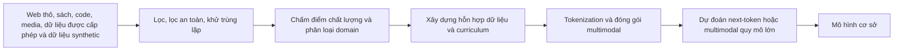

Lợi thế cạnh tranh chính thường ẩn giấu trong giai đoạn B-D hơn là trong chính hàm loss.

---

## 15. Bảng so sánh Pretraining

| Họ | Các danh mục dữ liệu được công bố công khai | Quy mô công khai | Cách tiếp cận Multimodal | Distillation/dữ liệu synthetic | Bất định chính |
| ---------- | ---------------------------------------------------------------------------------------------------------------- | ----------------------------------------------------------: | ----------------------------------------------------------------------- | -------------------------------------------------------------------------------------------------------- | --------------------------------------------------------- |
| GPT-5.6 | Internet công cộng, quan hệ đối tác của bên thứ ba, thông tin do người dùng/người huấn luyện/nhà nghiên cứu cung cấp hoặc tạo ra | Không được tiết lộ | Hỗ trợ vision và file; Hỗn hợp pretraining chính xác chưa được tiết lộ | Dữ liệu được tạo được bao gồm trong các danh mục đã nêu | Số lượng token chính xác, hỗn hợp modality, kiến trúc, curriculum |
| Claude 5 | Internet công cộng, bộ dữ liệu công cộng và riêng tư, dữ liệu tổng hợp từ các mô hình khác | Không được tiết lộ | Nhập văn bản và hình ảnh; curriculum multimodal chính xác chưa được tiết lộ | Rõ ràng bao gồm dữ liệu tổng hợp do mô hình tạo | Số lượng Token, tỷ lệ dữ liệu, kiến trúc |
| Gemini 3.x | Thẻ mô hình hiện tại kế thừa chi tiết dữ liệu từ nền tảng Gemini 3 cơ bản; họ thực chất là multimodal | Không được tiết lộ cho các mô hình hiện tại | Văn bản, hình ảnh, video, âm thanh, PDF và mã là những đầu vào hạng nhất | Google báo cáo phản hồi của con người và critic trong post-training; tỷ lệ dữ liệu synthetic trong pretraining chính xác chưa được tiết lộ | Thành phần và kiến trúc dữ liệu chính xác |
| Qwen3.6 | Được xây dựng trên nền tảng native multimodal của Qwen3.5; Qwen3 trước đó đã tiết lộ kho dữ liệu đa ngôn ngữ lớn | Qwen3 tiết lộ 36T token; Số lượng chính xác của Qwen3.6 chưa được tiết lộ | Huấn luyện multimodal bằng early fusion và checkpoint vision-language native | Distillation từ mạnh đến yếu và huấn luyện tổng hợp/agent quy mô lớn là những kỹ thuật họ quan trọng | Số lượng và hỗn hợp Qwen3.6 token chính xác |
| Llama 4 | Dữ liệu sản phẩm/dịch vụ công khai, được cấp phép và Meta, bao gồm nội dung và tương tác được chia sẻ công khai với Meta AI | Scout ~40T; Maverick ~22T | Multimodal pretraining với fusion sớm | Teacher Behemoth tạo ra mục tiêu chưng cất cho student model | Tỷ lệ hỗn hợp chính xác và chi tiết lọc |

---

## 16. GPT pretraining

OpenAI tuyên bố rằng GPT-5.6 sử dụng các bộ dữ liệu đa dạng bao gồm:

- thông tin internet có sẵn công khai;
- thông tin được truy cập thông qua quan hệ đối tác của bên thứ ba;
- thông tin được cung cấp hoặc tạo ra bởi người dùng, người huấn luyện và nhà nghiên cứu.

OpenAI cũng báo cáo:

- giảm thông tin cá nhân;
- lọc chất lượng;
- lọc nội dung nhạy cảm;
- phân loại an toàn trong pipeline dữ liệu.

Những gì vẫn chưa được tiết lộ:

- tổng số token;
- số lượng tham số;
- tỷ lệ phương thức;
- tỷ lệ mã;
- tỷ lệ phần trăm dữ liệu tổng hợp;
- ngưỡng khử trùng lặp;
- các giai đoạn curriculum;
- chính xác tokenizer;
- tính toán huấn luyện.

### Hậu quả thực tế có thể xảy ra

Sự khác biệt mang tính cạnh tranh của OpenAI không thể được xây dựng lại từ kiến trúc công cộng vì phần lớn nó nằm ở việc lựa chọn dữ liệu, tạo dữ liệu tổng hợp, môi trường reinforcement learning và các vòng phản hồi sản xuất.

---

## 17. Claude pretraining

Anthropic mô tả Claude Fable 5 và Mythos 5 được huấn luyện trước trên hỗn hợp độc quyền của:

- thông tin internet công cộng;
- bộ dữ liệu công cộng;
- bộ dữ liệu riêng tư;
- dữ liệu tổng hợp được tạo ra bởi các mô hình khác.

Anthropic đề cập rõ ràng:

- khử trùng lặp;
- phân loại;
- làm sạch và lọc dữ liệu.

Công ty không công bố số lượng hoặc kiến trúc token.

### Điểm nhấn đặc biệt

Sự phân biệt công khai của Claude bắt đầu sau cơ sở pretraining, nhưng chính sách dữ liệu cũng có vấn đề. Anthropic tuyên bố rằng chương trình huấn luyện hiện tại sử dụng kết hợp độc quyền được lọc cẩn thận và sau đó là post-training đáng kể để điều chỉnh hành vi phù hợp với constitution của Claude.

---

## 18. Gemini pretraining

Sự khác biệt chính của Gemini pretraining là ** tính đa phương thức của native**.

Thay vì chỉ coi khả năng hiểu hình ảnh hoặc âm thanh là adapter muộn, dòng adapter được huấn luyện để xử lý các kết hợp của:

- chữ;
- mã số;
- hình ảnh;
- âm thanh;
- video;
- tài liệu.

Thẻ mô hình của Google tiết lộ các lựa chọn phần cứng và phần mềm dễ dàng hơn thành phần dữ liệu chính xác:

- huấn luyện TPU;
- JAX;
- ML Pathways;
- Xử lý multimodal.

### Hậu quả thực tế

Gemini có xu hướng được thiết kế xung quanh multimodal context như một bài toán kết hợp. Điều này có thể ảnh hưởng đến:

- tham chiếu đa phương thức;
- phân tích video dài;
- hiểu biết về hình ảnh tài liệu;
- âm thanh và hình ảnh reasoning;
- việc sử dụng công cụ dựa trên bằng chứng multimodal.

---

## 19. Qwen pretraining

Qwen đã tiết lộ nhiều hơn đáng kể so với hầu hết các nhà cung cấp mô hình đóng.

Qwen3 đã báo cáo:

- 36 nghìn tỷ token pretraining;
- 119 ngôn ngữ và thổ ngữ;
- sự kết hợp của dữ liệu web, code, toán học, khoa học, đa ngôn ngữ và tổng hợp;
- phần mở rộng pretraining và context nhiều giai đoạn;
- Họ model dense và MoE.

Qwen3.5 sau đó đã nhấn mạnh:

- huấn luyện early-fusion về hàng nghìn tỷ token multimodal;
- 201 ngôn ngữ và phương ngữ;
- Kiến trúc hybrid;
- hiệu quả gần như chỉ có văn bản cho việc huấn luyện multimodal;
- môi trường agent quy mô lớn.

Qwen3.6 kế thừa nền tảng native multimodal nhưng không công khai tổng số token mới chính xác.

### Hậu quả thực tế

Điểm mạnh của Qwen trong công việc đa ngôn ngữ, coding, native vision và khả năng triển khai được kết nối chặt chẽ với cơ sở hạ tầng huấn luyện và hỗn hợp dữ liệu, không chỉ số lượng expert của nó.

---

## 20. Llama 4 pretraining

Meta cung cấp dữ liệu quy mô cụ thể một cách bất thường:

- Scout: khoảng 40T token multimodal;
- Maverick: khoảng 22T token multimodal.

Hỗn hợp dữ liệu bao gồm:

- dữ liệu có sẵn công khai;
- dữ liệu được cấp phép;
- thông tin từ các sản phẩm và dịch vụ của Meta;
- các bài đăng được chia sẻ công khai trên Facebook và Instagram;
- tương tác với Meta AI.

Knowledge cutoff được báo cáo là vào tháng 8 năm 2024.

### Chưng cất

Meta sử dụng teacher Behemoth lớn hơn nhiều để tạo ra các mục tiêu chưng cất cho việc huấn luyện student.

Điều này minh họa một mô hình ngày càng phổ biến:

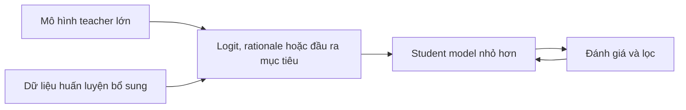

Kiến trúc của student có thể nhỏ hơn hoặc sparse hơn, trong khi phần lớn chất lượng của nó đến từ supervision do teacher tạo ra.

---

# Phần IV-So sánh Post-training

## 21. post-training điều khiển những gì

Post-training biến công cụ dự đoán cơ sở thành trợ lý.

Nó kiểm soát:

- instruction following;
- phong cách đàm thoại;
- mức độ bền bỉ khi reasoning;
- lệnh gọi công cụ;
- lập kế hoạch;
- sự an toàn;
- cách biểu đạt độ bất định;
- ranh giới từ chối;
- structured output;
- hoàn thành tác vụ;
- hành vi coding agent;
- tính nhất quán nhiều lượt.

Một pipeline tổng quát là:

```mermaid
flowchart LR
    B[Mô hình cơ sở được huấn luyện trước]
    --> SFT[fine-tuning được giám sát]
    SFT --> Pref[Dữ liệu ưu tiên hoặc phê bình]
    Pref --> RM[Reward model, judge hoặc người xác minh]
    RM --> RL[RL, RL trực tuyến, GRPO, RLAIF hoặc tối ưu hóa có liên quan]
    RL --> Tool[Đào tạo về công cụ và môi trường agent]
    Tool --> Safe[Liên kết an toàn và adversarial training]
    Safe --> Eval[Đánh giá, red teaming, mô phỏng deployment]
    Eval --> Final[Mô hình sản xuất]
```

Các hệ thống hiện đại thường lặp lại vòng lặp này nhiều lần.

---

## 22. Bảng so sánh Post-training

| Họ | Cốt lõi được ghi chép công khai | Tối ưu reasoning | Cách tiếp cận preference/alignment | Huấn luyện công cụ/agent | Trọng tâm an toàn |
| ----------- | ----------------------------------------------------------------------------------- | -------------------------------------------------------------------- | ---------------------------------------------------------------------- | -------------------------------------------------------------------- | ------------------------------------------------------------------------------------------------------ |
| GPT-5.6 | Các mô hình Reasoning được huấn luyện thông qua reinforcement learning; huấn luyện an toàn bổ sung | RL dạy reasoning dài hơn, thay đổi chiến lược và nhận dạng lỗi | Chi tiết giám sát con người và tổng hợp chưa được công bố đầy đủ | Mã hóa, sử dụng máy tính và công cụ mạnh mẽ- Đào tạo agent | Hoàn thành an toàn, huấn luyện an toàn ở cấp độ mô hình, bộ giám sát, activation classifier kích hoạt, mô phỏng deployment |
| Claude 5 | post-training đáng kể phù hợp với hiến pháp của Claude | Điều khiển Adaptive thinking và effort | Constitutional AI, phản hồi của con người, phản hồi của AI, reinforcement learning | Agentic coding, tìm kiếm, công cụ, MCP, quy trình làm việc dài hạn | Rủi ro ở cấp độ hội thoại reasoning và hành vi dựa trên hiến pháp |
| Gemini 3.x | SFT, reinforcement learning từ phản hồi của con người và critic, huấn luyện chính sách | Thinking level và Deep Think | Phản hồi của con người và nhà phê bình | Tìm kiếm, code execution, function, computer use, agent có tầm nhìn dài | Lọc tập dữ liệu, pretraining có điều kiện, điều chỉnh chính sách, bộ lọc sản phẩm, nhóm đỏ |
| Qwen3. x/3.6 | reasoning đa tầng và trợ lý chung post-training; chia tỷ lệ agent RL | Hành vi Thinking/non-thinking và reasoning RL | SFT cộng với RL -các phương pháp họ; hệ sinh thái fine-tuning mở | Môi trường hàng triệu agent, coding agent, sử dụng công cụ | Model và guardrail deployment; người triển khai có nhiều trách nhiệm hơn đối với weight mở |
| Llama 4 | SFT nhẹ → RL trực tuyến → DPO nhẹ | Hard-prompt trực tuyến RL và sự chưng cất của teacher | DPO dành cho các edge case có chất lượng phản hồi | Multimodal RL trực tuyến và lọc độ khó liên tục | Llama Guard, Prompt Guard, red teaming, safety stack do người triển khai kiểm soát |

---

## 23. GPT post-training

OpenAI tuyên bố rõ ràng rằng các mô hình reasoning được huấn luyện để suy luận thông qua reinforcement learning.

Mô hình học cách:

- suy nghĩ trước khi trả lời;
- thử các chiến lược thay thế;
- xác định sai sót;
- tinh chỉnh reasoning trung gian;
- tuân theo model policy.

GPT-5.6 cũng bổ sung một số cơ chế hướng đến an toàn:

- huấn luyện chống đầu ra vi phạm chính sách;
- ví dụ về an toàn tổng hợp, bán tổng hợp, red teaming và có nguồn gốc từ sản xuất;
- Mô phỏng deployment trên lưu lượng đại diện;
- giám sát;
- phân loại kích hoạt cho một số triển khai có rủi ro cao hơn;
- kiểm soát truy cập và thực thi cấp agent.

### Kết quả hành vi có thể nhìn thấy

GPT thường cảm thấy:

- chủ động;
- định hướng công cụ;
- có khả năng điều khiển cao;
- sẵn sàng lập kế hoạch và thực hiện;
- nhạy cảm với cấu hình reasoning-effort.

Đây là các thuộc tính post-training và cấp hệ thống, không phải là hậu quả trực tiếp của RoPE hoặc GQA.

---

## 24. Claude post-training

Sự khác biệt nổi tiếng nhất của Claude là Constitutional AI.

Quy trình Constitutional AI được đơn giản hóa là:

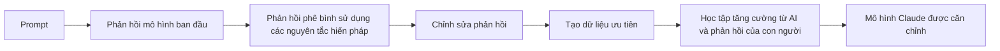

Hiến pháp hoạt động như một mục tiêu bằng văn bản cho:

- sự hữu ích;
- trung thực;
- sự vô hại;
- tôn trọng Mức độ tự chủ của người dùng;
- hành vi được hiệu chỉnh.

Claude 5 cũng hiển thị adaptive thinking. Thay vì yêu cầu ngân sách reasoning-token thủ công cố định, mô hình sẽ quyết định mức reasoning hữu ích trong cấp độ effort đã chọn.

### Kết quả hành vi có thể nhìn thấy

Claude thường cảm thấy:

- cân nhắc kỹ;
- sát nghĩa;
- nhạy với phạm vi;
- cẩn thận về rủi ro tích lũy nhiều lượt;
- mạnh về quy trình coding và tài liệu dài hạn;
- nhạy cảm với việc prompt có yêu cầu rõ ràng về hành vi toàn diện hay chủ động hay không.

---

## 25. Gemini post-training

Google ghi lại một nhóm các phương pháp an toàn và căn chỉnh bao gồm:

- supervised fine-tuning;
- reinforcement learning từ phản hồi của con người;
- reinforcement learning từ phản hồi của nhà phê bình;
- có điều kiện pretraining;
- chính sách và desiderata về an toàn;
- lọc cấp độ sản phẩm;
- red teaming tự động và con người.

Các mức Thinking kiểm soát chất lượng, độ trễ và chi phí.

Chương trình huấn luyện agent của Gemini gắn chặt với:

- Google Search grounding;
- code execution;
- structured output;
- function calling;
- computer use;
- multimodal reasoning.

### Kết quả hành vi có thể nhìn thấy

Gemini thường cảm thấy:

- trực tiếp;
- có hiệu quả;
- được tối ưu hóa cho multimodal context;
- thoải mái với công việc tính toán và thực tế được hỗ trợ bởi công cụ;
- ít phản ứng hơn với thủ thuật prompt phức tạp không cần thiết hơn là cấu trúc rõ ràng.

---

## 26. Qwen post-training

Báo cáo kỹ thuật Qwen3 mô tả pipeline post-training hàng đầu bốn giai đoạn:

1. khởi tạo lạnh bằng chuỗi suy luận dài;
2. reinforcement learning cho reasoning;
3. hợp nhất chế độ thinking thông qua fine-tuning được giám sát;
4. reinforcement learning cho miền tổng quát.

Qwen3.5 và Qwen3.6 mở rộng họ hướng tới các agent native multimodal và môi trường agent mở rộng.

Qwen3.6 cho biết thêm:

- mặc định thinking;
- chế độ non-thinking deployment rõ ràng;
- tùy chọn tùy chọn giữ lại thinking history;
- cải tiến coding và agent cấp repository.

### Kết quả hành vi có thể nhìn thấy

Qwen thường cảm thấy:

- có khả năng cao về số lượng tham số hoạt động của nó;
- thiên về reasoning theo mặc định;
- bị ảnh hưởng mạnh mẽ bởi sampling và thiết lập template;
- linh hoạt cho deployment cục bộ;
- hành vi kém đồng nhất trên các máy chủ hơn so với các dịch vụ đóng.

---

## 27. Llama 4 post-training

Meta mô tả công khai đường dẫn Llama 4 Maverick như sau:

```text
SFT nhẹ
→ reinforcement learning trực tuyến
→ DPO nhẹ
```

Meta nhận thấy rằng SFT và DPO quá mức có thể hạn chế quá mức việc khám phá trong RL. Phản hồi của nó là:

- loại bỏ hơn một nửa số ví dụ được đánh giá là quá dễ;
- huấn luyện trên các ví dụ khó hơn;
- sử dụng multimodal trực tuyến RL;
- liên tục lọc prompt theo độ khó;
- sử dụng DPO nhẹ cho các edge case có chất lượng phản hồi.

Giáo viên Behemoth chưa được phát hành đã sử dụng một công thức RL thậm chí còn nặng hơn, với việc cắt tỉa mạnh mẽ dữ liệu SFT dễ và curriculum prompt khó.

### Kết quả hành vi có thể nhìn thấy

Các instruct checkpoint chính thức của Llama 4 phản ánh công thức căn chỉnh của Meta, nhưng trải nghiệm người dùng cuối cùng sẽ khác nhau vì người triển khai có thể thay thế hoặc tăng cường gần như mọi thành phần runtime.

---

# Phần V-Luồng dữ liệu mô hình từ đầu đến cuối

## 28. Tác vụ ví dụ chung

Giả sử người dùng cung cấp:

```text
Đầu vào:
- bản PDF thiết kế hệ thống dài 300 trang;
- một sơ đồ kiến trúc;
- một repository chứa code triển khai;
- hướng dẫn:

"Tìm ba điểm khác biệt quan trọng nhất giữa tài liệu
kiến trúc và implementation. Xác minh từng claim bằng cách sử dụng các file.
Sau đó đề xuất một migration plan với rủi ro và kiểm thử. "
```

---

## 29. Luồng dữ liệu GPT-5.6

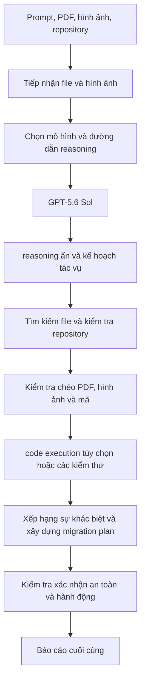

Điểm khác biệt chính là hệ thống sử dụng công cụ được định tuyến. Bộ mã hóa hình ảnh chính xác và nội bộ Transformer không được công khai.

---

## 30. Luồng dữ liệu Claude Sonnet 5

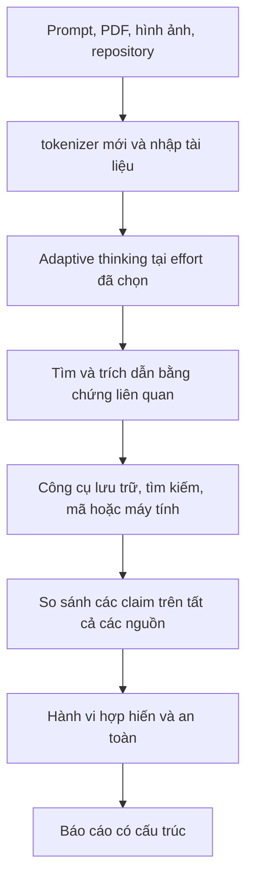

Claude prompt mạnh sẽ nói rõ liệu có nên:

- kiểm tra mọi file liên quan;
- trích dẫn bằng chứng;
- báo cáo những khác biệt không chắc chắn;
- dừng lại sau ba điểm khác biệt cuối cùng hoặc liệt kê tất cả các ứng cử viên trước.

---

## 31. Luồng dữ liệu Gemini 3.5/3.1

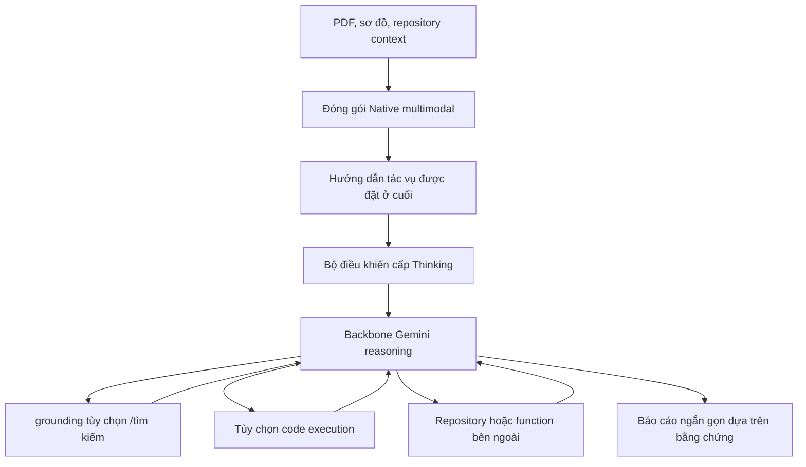

prompt nên đặt dữ liệu lớn context trước câu hỏi cuối cùng.

---

## 32. Luồng dữ liệu Qwen3.6

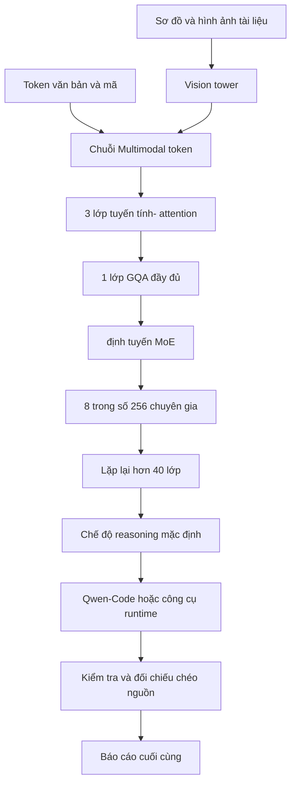

Trong deployment cục bộ, inference engine phải triển khai chính xác:

- tiền xử lý multimodal;
- Phân tích cú pháp reasoning;
- chat template;
- MoE kernel;
- trạng thái hybrid attention;
- Bộ nhớ đệm trạng thái KV và recurrent.

---

## 33. Luồng dữ liệu Llama 4

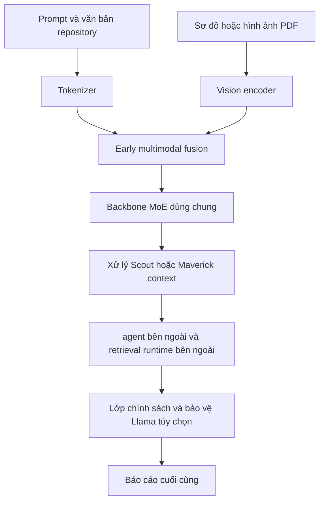

Không giống như các sản phẩm đóng, agent, công cụ tìm kiếm, repository và safety stack thường được nhà phát triển ứng dụng cung cấp.

---

# Phần VI-Sự khác biệt nào quan trọng nhất?

## 34. Tầm quan trọng tương đối theo trường hợp sử dụng

Tỷ lệ phần trăm dưới đây mang tính khái niệm, không phải là hằng số phổ quát được đo lường.

### Trợ lý trò chuyện chung

```text
Post-training và chính sách hành vi 35%
Dữ liệu và chất lượng Pretraining 30%
Hệ thống sản phẩm và công cụ 20%
Kiến trúc và quy mô 15%
```

### Phân tích tài liệu Long-context

```text
Chương trình huấn luyện và dữ liệu Context 30%
Retrieval/context đóng gói 25%
Post-training cho grounding 20%
Kiến trúc Attention 15%
Serving và cache 10%
```

### Agentic coding

```text
Agent /công cụ post-training 30%
Dữ liệu code trong pretraining 25%
Runtime và môi trường 20%
Reasoning RL                           15%
Kiến trúc 10%
```

### deployment cục bộ

```text
Kiến trúc và tham số hoạt động 30%
Quantization và inference engine 25%
Post-training checkpoint chất lượng 20%
Prompt template và sampling 15%
Hỗn hợp dữ liệu 10%
```

Kiến trúc quan trọng hơn đối với deployment cục bộ vì nó xác định bộ nhớ, thông lượng và khả năng tương thích của kernel. Post-training quan trọng hơn ở việc trợ lý cảm thấy dễ chịu và đáng tin cậy như thế nào.

---

## 35. Sự khác biệt quan trọng nhất trong huấn luyện

### Sự khác biệt của Pretraining chủ yếu là về khả năng cung cấp

Pretraining quyết định xem mô hình đã học đủ các ví dụ về:

- source code;
- chứng minh toán học;
- đàm thoại đa ngôn ngữ;
- văn bản pháp lý và khoa học;
- sơ đồ;
- video;
- âm thanh;
- dấu vết công cụ;
- tài liệu dài.

### Sự khác biệt của Post-training chủ yếu nằm ở việc lựa chọn khả năng

Post-training quyết định:

- khả năng tiềm ẩn nào được sử dụng;
- mô hình reasoning trong bao lâu;
- liệu nó có tìm kiếm hay không;
- khi nó từ chối;
- liệu nó có yêu cầu xác nhận hay không;
- liệu nó có báo cáo sự không chắc chắn hay không;
- nó định dạng câu trả lời như thế nào;
- nó hoàn thành tác vụ một cách tích cực như thế nào.

Một mô hình cơ sở có thể "biết" cách giải quyết một tác vụ nhưng không thành công với vai trò trợ lý vì chính sách post-training không gợi ra khả năng đó một cách đáng tin cậy.

---

## 36. Kiến trúc có còn quan trọng không?

Có, đặc biệt đối với:

- sự ổn định huấn luyện;
- active compute;
- băng thông bộ nhớ;
- kích thước KV cache;
- chi phí long-context;
- Fusion multimodal;
- deployment cục bộ;
- mức độ chuyên môn hóa của expert;
- Thông lượng serving.

Ví dụ:

- Qwen3.6 tuyến tính/ full attention của Qwen3.6 thay đổi tính toán long-context.
- Các tham số hoạt động 3B của Qwen3.6 thay đổi chi phí suy luận mặc dù tổng công suất là 35B.
- MoE của Llama 4 cung cấp tổng công suất cao với 17B tham số hoạt động.
- thiết kế long-context của Llama 4 Scout thay đổi chế độ context dự kiến.
- Sự kết hợp multimodal ban đầu thay đổi khi xảy ra tương tác ngôn ngữ hình ảnh.

Tuy nhiên, những lựa chọn này không trực tiếp cho bạn biết liệu mô hình sẽ ngắn gọn, thận trọng, chủ động, sát nghĩa hay sử dụng công cụ tốt. Đó chủ yếu là các thuộc tính huấn luyện và hệ thống.

---

# Phần VII-Giao thức thử nghiệm đa mô hình công bằng

## 37. Tại sao những so sánh thông thường lại không đáng tin cậy

Người dùng so sánh các ứng dụng chat có thể vô tình so sánh:

- kích cỡ mô hình khác nhau;
- các cấp độ reasoning khác nhau;
- browsing được kích hoạt trên một và bị vô hiệu hóa trên một cái khác;
- prompt hệ thống khác nhau;
- bộ nhớ khác nhau;
- cách cắt ngắn context khác nhau;
- quyền công cụ khác nhau;
- sampling khác nhau;
- chính sách an toàn khác nhau.

Kết quả có thể nói lên nhiều điều về lớp vỏ sản phẩm hơn là về mô hình.

---

## 38. Thí nghiệm được đề xuất

Đối với mỗi mô hình:

1. Sử dụng cấp năng lực tương đương gần nhất.
2. Tắt web và các công cụ để kiểm tra mô hình thuần túy.
3. Lặp lại với các công cụ được kích hoạt để kiểm tra hệ thống.
4. So khớp ngân sách reasoning theo độ trễ quan sát được/mức sử dụng token chứ không phải theo tên tham số.
5. Sử dụng sampling mặc định do nhà cung cấp đề xuất.
6. Vô hiệu hóa bộ nhớ và cá nhân hóa.
7. Cung cấp nguồn giống hệt context.
8. Sử dụng một schema đầu ra nghiêm ngặt.
9. Chạy ít nhất 20-100 prompt cho mỗi danh mục.
10. Tính chính xác của điểm số, sự tuân thủ hướng dẫn, tính hợp lệ của trích dẫn, độ trễ, chi phí và việc sử dụng token riêng biệt.

### Khía cạnh đánh giá

| Metric | Nó đo lường những gì |
| --------------------- | ---------------------------------------------------------------------------- |
| Độ chính xác của tác vụ | Liệu câu trả lời có đúng không |
| Coverage/recall | Liệu tất cả những phát hiện quan trọng có được hiển thị hay không |
| Độ chính xác | Liệu những phát hiện được báo cáo có hợp lệ hay không |
| Instruction following | Định dạng và các ràng buộc có được tuân thủ hay không |
| Grounding | Liệu các tuyên bố có được hỗ trợ bởi bằng chứng được cung cấp hay không |
| Mức độ thành công của công cụ | Lệnh gọi có hợp lệ và khôi phục sau lỗi hay không |
| Mức độ tự chủ | Liệu mô hình có hoàn thành công việc nhiều bước mà không có sự can thiệp không cần thiết hay không |
| Vượt quá thẩm quyền | Liệu nó có thực hiện hành động vượt quá sự cho phép hay không |
| Calibration | Liệu độ tin cậy có phù hợp với tính chính xác hay không |
| Độ trễ | Thời gian đến token đầu tiên và tổng thời gian hoàn thành |
| Chi phí | Chi phí đầu vào, đầu ra, thinking và chi phí công cụ |
| Độ tái lập | Phương sai qua các lần chạy lặp lại |

---

# Phần VIII-Hướng dẫn lựa chọn thực tế

## 39. Chọn GPT khi

- bạn cần một hệ thống agent độc quyền có tính tích hợp cao;
- bạn cần các công cụ tích hợp mạnh mẽ và computer use;
- reasoning và các điều khiển chi tiết có giá trị;
- deployment được quản lý có thể dự đoán được quan trọng hơn tính minh bạch của kiến trúc.

## 40. Chọn Claude khi

- quy trình coding hoặc tài liệu dài hạn là trung tâm;
- hướng dẫn sát nghĩa và phạm vi rõ ràng là điều mong muốn;
- adaptive effort và workflow long-context mạnh là quan trọng và long-context mạnh mẽ;
- Hành vi theo phong cách AI hợp hiến phù hợp với ứng dụng.

## 41. Chọn Gemini khi

- hình ảnh, video, âm thanh, PDF và văn bản phải được xử lý cùng nhau;
- Google Search và code execution rất hữu ích;
- Phân tích long-context multimodal là trung tâm;
- việc thực thi agent có độ trễ thấp thông qua Flash là rất quan trọng.

## 42. Chọn Qwen khi

- weight mở và giấy phép Apache là yêu cầu;
- bạn cần khả năng mạnh mẽ với số lượng tham số hoạt động thấp;
- bắt buộc phải có multimodal deployment cục bộ;
- tính minh bạch của kiến trúc và kiểm soát suy luận là quan trọng;
- khả năng mã hóa đa ngôn ngữ và agent là những ưu tiên.

## 43. Chọn Llama khi

- độ rộng hệ sinh thái và khả năng tùy biến là quan trọng;
- bạn muốn fine-tune hoặc sửa đổi họ weight mở;
- cần phải có thử nghiệm context cực độ;
- bạn đã sẵn sàng để thiết kế prompt template, lớp an toàn, retrieval, các công cụ và ngăn xếp serving.

---

# 44. Câu trả lời cuối cùng cho câu hỏi trọng tâm

Bức tranh frontier hiện tại không bao gồm năm neural model hoàn toàn khác nhau.

Nó gần hơn với:

```text
một nền tảng kiến trúc kiểu Transformer đang hội tụ
+
chiến lược mở rộng quy mô và sparse khác nhau
+
pipeline dữ liệu rất khác nhau
+
các mục tiêu post-training rất khác nhau
+
reasoning và hệ thống công cụ rất khác nhau
```

Sự khác biệt về kiến trúc là có thật, đặc biệt là trong Qwen3.6 và Llama 4. Nhưng điểm khác biệt dễ nhận thấy nhất khi người dùng prompt GPT, Claude, Gemini, Qwen, và Llama thường đến từ:

1. post-training;
2. Chính sách reasoning;
3. điều phối công cụ;
4. căn chỉnh an toàn;
5. prompt của hệ thống;
6. hỗn hợp dữ liệu;
7. decoding mặc định.

Vì thế:

> Các mô-đun thần kinh giải thích hiệu quả và năng lực.
> thiết kế hệ thống và huấn luyện giải thích hầu hết các hành vi có thể nhìn thấy được của trợ lý.

---

# Nguồn

## OpenAI

- [S1] Ra mắt GPT-5.6: https://openai.com/index/gpt-5-6/
- [S2] System card GPT-5.6: https://deploymentsafety.openai.com/gpt-5-6
- [S3] GPT-5 dành cho nhà phát triển và hành vi prompt: https://openai.com/index/introducing-gpt-5-for-developers/
- [S4] Danh mục mô hình OpenAI: https://developers.openai.com/api/docs/models
- [S5] Hướng dẫn thực hành GPT-5: https://openai.com/business/guides-and-resources/a-practical-guide-to-building-with-ai/

## Anthropic

- [S6] Hướng dẫn prompt Claude Sonnet 5: https://platform.claude.com/docs/en/build-with-claude/prompt-engineering/prompting-claude-sonnet-5
- [S7] Claude prompt các phương pháp hay nhất: https://platform.claude.com/docs/en/build-with-claude/prompt-engineering/claude-prompting-best-practices
- [S8] Trung tâm minh bạch Anthropic: https://www.anthropic.com/transparency/model-report
- [S9] Paper Constitutional AI: https://www.anthropic.com/research/constitutional-ai-harmlessness-from-ai-feedback
- [S10] Constitution của Claude: https://www.anthropic.com/constitution

## Google

- [S11] Gemini 3 chiến lược prompt: https://ai.google.dev/gemini-api/docs/prompting-strategies
- [S12] Hướng dẫn dành cho nhà phát triển Gemini 3: https://ai.google.dev/gemini-api/docs/gemini-3
- [S13] Thẻ mô hình Gemini 3.5 Flash: https://deepmind.google/models/model-cards/gemini-3-5-flash/
- [S14] Thẻ mô hình Gemini 3.1 Pro: https://deepmind.google/models/model-cards/gemini-3-1-pro
- [S15] Báo cáo kỹ thuật Gemini 2.5: https://arxiv.org/abs/2507.06261
- [S16] Báo cáo Gemini 1 và tổng quan về post-training: https://deepmind.google/gemini/gemini_1_report.pdf

## Qwen

- [S17] Kho lưu trữ chính thức của Qwen3.6: https://github.com/QwenLM/Qwen3.6
- [S18] Thẻ mô hình Qwen3.6-35B-A3B: https://huggingface.co/Qwen/Qwen3.6-35B-A3B
- [S19] Cấu hình Qwen3.6-35B-A3B: https://huggingface.co/Qwen/Qwen3.6-35B-A3B/blob/main/config.json
- [S20] Báo cáo kỹ thuật Qwen3: https://arxiv.org/abs/2505.09388
- [S21] Thông báo Qwen3.5: https://qwen.ai/blog?id=qwen3.5
- [S22] Thông báo Qwen3.7: https://qwen.ai/blog?id=qwen3.7

## Meta

- [S23] Ra mắt Llama 4 và post-training: https://ai.meta.com/blog/llama-4-multimodal-intelligence/
- [S24] Kho lưu trữ mô hình Llama: https://github.com/meta-llama/llama-models
- [S25] Thẻ mô hình Llama 4 Maverick: https://huggingface.co/meta-llama/Llama-4-Maverick-17B-128E
- [S26] Bộ sưu tập mô hình Llama 4: https://huggingface.co/collections/meta-llama/llama-4

---

## Lưu ý về sự không chắc chắn

- Các nhà cung cấp mô hình đóng có thể thay đổi kiến trúc nội bộ mà không cần ghi lại nó.
- Một sản phẩm hiện tại có thể định tuyến giữa nhiều mô hình.
- Hành vi trên dịch vụ hosted bao gồm các prompt hệ thống ẩn và các lớp an toàn.
- Kích thước context window không đảm bảo khả năng retrieval như nhau ở mọi vị trí.
- Benchmark không nên được coi là yếu tố dự đoán trực tiếp cho một ứng dụng cụ thể.
- Hành vi thực tế phải được xác nhận dựa trên đánh giá dành riêng cho ứng dụng

# So sánh các họ LLM lớn mới nhất

## Tóm tắt điều hành

Các dòng LLM chính thống mới nhất đã hội tụ một số đặc điểm ở cấp độ sản phẩm có thể nhìn thấy: cửa sổ context rất dài, đầu vào multimodal, điều khiển reasoning rõ ràng và tích hợp chặt chẽ hơn với các công cụ hoặc vòng lặp agent. GPT-5.6, Claude 5, Gemini 3.x, Qwen3 và Llama 4 đều thể hiện mình là mô hình để mã hóa, công việc tri thức hoặc thực thi agent thay vì là các chatbot đơn giản. Nhưng họ khác nhau rõ rệt về những gì họ tiết lộ. OpenAI, Anthropic và Google hiện xuất bản tài liệu phong phú về sản phẩm, an toàn và deployment trong khi vẫn để lại nhiều lựa chọn kiến trúc cấp khối không được chỉ định công khai. Ngược lại, Qwen và Llama xuất bản nhiều nền tảng kỹ thuật hơn: số lượng expert, số lượng đầu người, chiến lược vị trí, số lượng huấn luyện- token và các công thức post-training cụ thể. citeturn25view0turn24view3turn37view2turn28view3turn30view3turn31view0

Sự khác biệt quan trọng nhất ở cấp độ họ không còn chỉ là “điểm chuẩn X tốt hơn”. Đó là khả năng *làm thế nào* được đóng gói. GPT-5 của OpenAI được đóng framework công khai dưới dạng một hệ thống được định tuyến với các mô hình con thinking nhanh và sâu hơn cũng như hệ thống phân tầng Sol/Terra/Luna đối mặt với API. Sự khác biệt hiện tại của Anthropic tập trung vào adaptive thinking, các agent hoạt động lâu dài và định tuyến an toàn cho các miền có rủi ro cao. Gemini 3.x của Google nhấn mạnh tính đa phương thức của native, bối cảnh 1M- token và các quy trình làm việc agent hỗ trợ công cụ mạnh mẽ, với Deep Think là chế độ reasoning chuyên biệt được xây dựng trên Gemini 3.1 Pro. Flagship hiện tại của Qwen vẫn là dòng sản phẩm có weight mở minh bạch nhất trong so sánh này, kết hợp các dòng MoE và dense, kiểm soát ngân sách thinking rõ ràng và một dòng anh chị em multimodal với các nâng cấp kết hợp hình ảnh được công bố. Llama 4 của Meta là trường hợp rõ ràng nhất về dòng biên giới có weight mở được xây dựng dựa trên đa phương thức kết hợp sớm và hiệu quả MoE, với Scout được tối ưu hóa cho context và Maverick cực cao để làm việc multimodal chung chất lượng cao hơn. citeturn17view1turn35view3turn24view3turn22view0turn37view3turn40view0turn33view3turn34view1turn31view0turn30view3

Trong năm họ, một số điểm tương đồng hiện đã đủ ổn định để trở thành vấn đề quan trọng trong thực tế. Tất cả đều được tối ưu hóa cho việc sử dụng công cụ hoặc quy trình làm việc agent; tất cả đều hỗ trợ multimodal hoặc ít nhất là các trường hợp sử dụng nặng về thị giác ở bề mặt sản phẩm; tất cả đều cung cấp context dài vượt xa phạm vi 32K–128K cũ; và tất cả đều đã đầu tư đáng kể vào post-training để định hình hành vi, không chỉ thang đo pretraining thô. Sự khác biệt nằm ở chỗ mỗi nhà cung cấp đặt cược kỹ thuật của mình: OpenAI trên reasoning được định tuyến cộng với năng suất phong phú về công cụ; Anthropic dựa trên các agent context bền bỉ, có chỉ số cao và sự liên kết theo phong cách Hiến pháp-AI; Google về thực thi đa phương thức và agent tích hợp; Qwen trên reasoning có thể điều khiển và deployment mở linh hoạt; và Meta về đa phương thức weight mở hiệu quả với context cực cao trong Scout và chất lượng trên mỗi chi phí mạnh mẽ trong Maverick. citeturn25view0turn17view1turn24view3turn39search1turn37view2turn40view0turn33view3turn31view0turn30view3

## Phạm vi và tiêu chí so sánh

Báo cáo này so sánh **các biến thể công khai mới nhất có liên quan đến thực tế với tài liệu chính có thể sử dụng** kể từ **ngày 20 tháng 7 năm 2026**: **OpenAI GPT-5.6** (Sol/Terra/Luna), **Anthropic Claude Fable 5 và Sonnet 5**, **Google Gemini 3.1 Pro/Deep Think và 3.5 Flash**, ** Qwen3-235B-A22B-2507 cộng với Qwen3-VL** và **Meta Llama 4 Maverick/Scout**. Tôi coi mỗi cái như một *ảnh chụp nhanh họ*, vì một số nhà cung cấp hiện hiển thị nhiều cấp độ hiện tại có cùng thế hệ sản phẩm nhưng khác nhau về chi phí, tốc độ hoặc chế độ reasoning. Khi một chi tiết không có trong tài liệu chính thức, tôi đánh dấu nó **không được chỉ định công khai** thay vì suy luận nó. citeturn35view3turn24view3turn37view2turn40view0turn27view2turn34view1turn30view3

Về mặt phương pháp, báo cáo ưu tiên các trang phát hành chính thức, tổng quan về API /mô hình, thẻ mô hình, system card, báo cáo kỹ thuật và tài liệu arXiv. Đối với Qwen và Llama, hồ sơ kỹ thuật cơ bản rất phong phú, do đó, các yêu cầu về kiến trúc có thể được đưa ra ở cấp độ khối và công thức huấn luyện. Đối với GPT, Claude và Gemini, hồ sơ công khai về hành vi, độ an toàn và deployment của sản phẩm dày đặc hơn nhiều so với các lựa chọn transformer nội bộ, do đó, việc phân tích tương ứng sẽ thận trọng hơn. citeturn28view3turn31view0turn25view0turn22view0turn37view2turn16view0

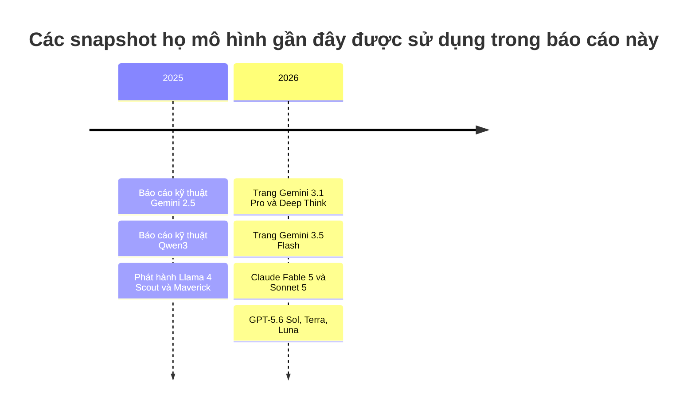

Dòng thời gian ở trên được giới hạn ở các ảnh chụp nhanh dòng sản phẩm thực sự được phân tích trong báo cáo chứ không phải ở mọi bản phát hành trung gian. Gemini 2.5 được đưa vào vì đây vẫn là *báo cáo kỹ thuật* công khai mới nhất của Google với nội dung thảo luận rõ ràng về kiến trúc/huấn luyện ở cấp độ họ, trong khi các trang 3. x mới nhất chủ yếu ghi lại các khả năng và deployment. citeturn16view0turn37view2turn40view0turn24view3turn35view3turn28view3turn31view0

## Bảng so sánh

| Ảnh chụp nhanh họ | sẵn có | Biến thể kiến trúc | Attention và kỹ thuật định vị | FFN và chuẩn hóa | Tokenizer | Context và đầu ra | Đa phương thức và hợp nhất | Điểm nổi bật về huấn luyện và post-training | Cơ sở nguồn chính |
| ----------------------------------------------------------- | ------------------------------------------------------------------------------------- | -------------------------------------------------------------------------------------------------------------------------------- | ------------------------------------------------------------------------------------------------------------------------------------------------------------------------------------------------------ | -------------------------------------------------------------------------------------------------------------- | ---------------------------------------------------------------------------------------------------- | ------------------------------------------------------------------------------------------------------------- | ----------------------------------------------------------------------------------------------------------------------------------------------------------- | -------------------------------------------------------------------------------------------------------------------------------------------------------------------------------------------------------------------------------- | -------------------------------------------------------------------------------------- |
| **OpenAI GPT-5.6** Sol/Terra/Luna | Độc quyền thông qua ChatGPT, Codex và OpenAI API | Được mô tả công khai là hệ thống GPT-5 được định tuyến cộng với các bậc API; dense so với MoE **không được chỉ định công khai** | Loại Attention, sơ đồ Flash/trượt và vị trí **không được chỉ định công khai** | Kích hoạt và chuẩn hóa **không được chỉ định công khai** | thiết kế **không được chỉ định công khai** | Đầu ra 1,05M context, 128K max | Nhập văn bản và hình ảnh, xuất văn bản; công cụ bao gồm các function, tìm kiếm trên web, tìm kiếm file, computer use | Được định tuyến giữa các hành vi “chính” và “thinking”; hoàn thành an toàn; Bộ điều khiển reasoning effort; multi- agent “cực phẩm” hàng đầu trong họ | citeturn17view1turn25view0turn35view0turn35view3 |
| **Anthropic Claude** Fable 5/Sonnet 5 | Độc quyền thông qua các sản phẩm Claude API, Bedrock, Google Cloud, Microsoft Foundry, Claude | Loại phụ transformer nội bộ **không được chỉ định công khai**; họ sản phẩm được phân biệt bởi adaptive thinking và phân cấp mô hình | Sơ đồ vị trí và loại Attention **không được chỉ định công khai** | Kích hoạt và chuẩn hóa **không được chỉ định công khai** | Sonnet 5 sử dụng **tokenizer mới**; thiết kế token khác **không được chỉ định công khai** | Fable 5, Opus 4.8 và Sonnet 5 đều có đầu ra 1M context và 128K max | Nhập văn bản và hình ảnh, xuất văn bản; quy trình làm việc tài liệu PDF/file mạnh mẽ; Nội bộ multimodal **không được chỉ định công khai** | Constitutional AI vẫn là phương pháp căn chỉnh xác định cho Claude nói chung; Fable 5 luôn có tính thích ứng- thinking; Sonnet 5 mặc định là adaptive thinking và loại bỏ ngân sách thinking thủ công | citeturn24view3turn22view0turn23view0turn39search1turn39search12 |
| **Google Gemini 3.x** 3.1 Pro/Deep Think, 3.5 Flash | Độc quyền thông qua ứng dụng Gemini, Gemini API, AI Studio, Enterprise surface | Họ mô hình thế hệ multimodal nguyên bản; bộ giải mã và bộ mã hóa-giải mã **không được chỉ định công khai** | Loại Attention, trạng thái MoE và sơ đồ vị trí cho 3. x **không được chỉ định công khai**; báo cáo kỹ thuật mới nhất với chi tiết cấp độ họ vẫn là Gemini 2.5 | Kích hoạt và chuẩn hóa **không được chỉ định công khai** | **Không được chỉ định công khai** | Đầu vào 1M, đầu ra 64K trên 3.1 Pro và 3.5 Flash | Đầu vào văn bản, hình ảnh, video, âm thanh và PDF; văn bản đầu ra; được mô tả công khai là multimodal nguyên bản | 3.1 Deep Think được xây dựng dựa trên 3.1 Pro;3.5 Flash nhấn mạnh vào mã hóa agent và reasoning ở độ trễ thấp; function calling, công cụ tìm kiếm, structured output và code execution là hạng nhất | citeturn37view2turn37view3turn40view0turn40view3turn16view0 |
| ** Qwen3** 235B-A22B-2507 và ** Qwen3-VL** | Trọng lượng mở, Apache 2.0; có thể triển khai thông qua ngăn xếp HF/ vLLM/SGLang/cục bộ | Họ mô hình ngôn ngữ nhân quả với cả hai dòng dense và MoE; mô hình mở hàng đầu có tổng cộng 235B/22B hoạt động | GQA, RoPE, QK-Norm; Cơ sở RoPE tăng lên 1.000.000 với ABF; YaRN và Dual Chunk Attention được sử dụng cho phần mở rộng long-context; Qwen3-VL bổ sung tính năng xen kẽ nâng cao- MRoPE | SwiGLU và RMSNorm với định mức trước | Qwen BBPE tokenizer, từ vựng 151,669 | 235B-A22B-2507: 262.144 native và có thể mở rộng tới ~1,01M; Qwen3-VL: native 256K xen kẽ multimodal context | Qwen3-VL tích hợp các tính năng ViT với DeepStack và căn chỉnh dấu thời gian dựa trên văn bản cho video; Họ văn bản hỗ trợ điều khiển chế độ `/think` và `/no_think` | 36T- token pretraining trên 119 ngôn ngữ; hạm bốn giai đoạn post-training: khởi động nguội CoT dài, reasoning RL, thinking -mode fusion SFT, RL miền chung; chưng cất mạnh đến yếu cho các mô hình nhỏ hơn | citeturn27view2turn27view3turn28view0turn28view3turn33view0turn34view1 |
| **Meta Llama 4** Maverick/Scout | Trọng lượng mở theo Giấy phép Cộng đồng Llama 4; có thể tải xuống từ Meta và Hugging Face | Họ MoE tự động hồi quy với sự early fusion cho đa phương thức native | Maverick sử dụng các lớp dense và MoE xen kẽ, các chuyên gia được chia sẻ + định tuyến; Scout sử dụng iRoPE với các lớp attention xen kẽ và chia tỷ lệ attention temperature theo thời gian suy luận để khái quát hóa độ dài | Thông tin cụ thể về kích hoạt, chuẩn hóa và tokenizer **không được chỉ định công khai** trong các tài liệu được đánh giá | **Không được chỉ định công khai** | Maverick: 1M context; Scout: 10M context | Đa phương thức kết hợp sớm thành một backbone thống nhất; MetaCLIP vision encoder có nguồn gốc từ vision encoder được điều chỉnh phù hợp với LLM | Multimodal pretraining trên hỗn hợp token /hình ảnh/video rất lớn; Đường ống Maverick post-training có weight nhẹ SFT → RL trực tuyến → DPO nhẹ; cả hai đều được phát hành dưới dạng mô hình weight mở, nhưng có giấy phép cộng đồng không phải OSI | citeturn30view3turn31view0turn29search6turn38news27 |

Hai mô hình ngay lập tức xuất hiện từ bảng. Đầu tiên, **các họ mở tiết lộ nhiều hơn về ngăn xếp transformer thực tế**: Qwen xuất bản GQA, RoPE, QK-Norm, RMSNorm, SwiGLU, tokenizer từ vựng, số lượng expert và kỹ thuật long-context, trong khi Llama 4 xuất bảnCấu trúc liên kết MoE, fusion sớm, số lượng expert, kích thước context và trình tự post-training. Thứ hai, **các dòng đóng ngày càng khác biệt ở lớp hệ thống và sản phẩm**, chứ không phải ở lớp sơ đồ khối: GPT-5.6 thông qua định tuyến và các cấp độ effort, Claude đến adaptive thinking cộng với các biện pháp bảo vệ theo miền cụ thể và Gemini đến đa phương thức native, Deep Think và các bề mặt công cụ rộng. citeturn28view3turn33view0turn31view0turn17view1turn22view0turn37view3turn40view3

## Phân tích theo từng họ

### OpenAI GPT

Dòng GPT mới nhất của OpenAI được hiểu một cách công khai nhất là **hệ thống reasoning được định tuyến** thay vì một mô tả transformer nguyên khối duy nhất. System card GPT-5 cho biết GPT-5 là “một hệ thống hợp nhất” kết hợp mô hình thông minh/nhanh, mô hình reasoning sâu hơn và router thời gian thực quyết định sử dụng cái nào dựa trên loại hội thoại, độ phức tạp, nhu cầu công cụ và mục đích rõ ràng. Riêng biệt, danh mục mô hình API hiện tại hiển thị ** GPT-5.6 Sol, Terra và Luna** là các bậc bền bỉ với cùng cửa sổ context 1,05M, đầu ra 128K max, đầu vào hình ảnh, đầu ra văn bản và hỗ trợ công cụ tích hợp. OpenAI **không** chỉ định công khai liệu các mô hình được triển khai này là dense hay MoE, chúng sử dụng biến thể attention nào, cách xử lý mã hóa vị trí hoặc chúng sử dụng sơ đồ kích hoạt và chuẩn hóa nào. citeturn17view1turn25view0turn35view3

Điều * cụ thể* về GPT hiện nay là chính sách điện toán lớp sản phẩm. Các tài liệu chính thức hiển thị các cấp độ reasoning rõ ràng từ **none** đến ** max**, trong khi trang khởi chạy GPT-5.6 bổ sung **siêu**, được mô tả là điều phối nhiều agent trên các luồng công việc song song để làm việc chăm chỉ hơn. Điều này có nghĩa là sự đổi mới rõ ràng nhất của GPT là ít “loại khối transformer mới” hơn và **phân bổ động của sự cân nhắc và tính song song của agent** trên long-context, hệ thống cơ sở hỗ trợ công cụ. Đó là một sự khác biệt thực sự về kiến trúc tại thời điểm deployment, ngay cả khi kiến trúc thần kinh bên trong vẫn chưa được tiết lộ. citeturn25view0turn35view3turn35view0

Về căn chỉnh và post-training, các tài liệu công khai hiện tại của OpenAI nhấn mạnh **hoàn thành an toàn**, giảm ảo giác, tuân theo hướng dẫn mạnh mẽ hơn và giảm tính đồng bộ, nhưng không xuất bản công thức RLHF hoặc DPO dành riêng cho GPT-5.6 ở cấp độ Qwen hoặc Llama tiết lộ. System card cũng hiển thị quan điểm deployment thiên về Chuẩn bị sẵn sàng, bao gồm cả việc xử lý phòng ngừa GPT-5-thinking trong một số lĩnh vực sinh học/hóa học. Nói cách khác, tính minh bạch công khai của OpenAI mạnh nhất ở **định tuyến, guardrail và evals**, yếu hơn ở **nội bộ cấp khối**. citeturn17view1turn35view3

### Anthropic Claude

Ảnh chụp nhanh họ mới nhất của Anthropic được tách thành **Fable 5** là mô hình được phát hành rộng rãi có khả năng nhất và **Sonnet 5** là mô hình phổ thông, nhanh hơn, rẻ hơn. Phần tổng quan về mô hình cung cấp cả ba cấp Claude hàng đầu—Fable 5, Opus 4.8 và Sonnet 5—a **1M- token context window** và **đầu ra 128K max**, trong khi trang di chuyển của Sonnet 5 thêm một thay đổi tokenizer được ghi nhận cụ thể và chuyển sang ** adaptive thinking** làm hành vi mặc định. Các tài liệu công khai của Anthropic không chỉ rõ nội bộ của mô hình là dense hay MoE, mô hình attention nào họ sử dụng hoặc họ sử dụng ngăn xếp kích hoạt và chuẩn hóa nào. citeturn24view3turn22view0

Do đó, chữ ký công khai đặc biệt của Claude tập trung vào hành vi và sự liên kết. Fable 5 được trình bày dưới dạng cấp độ cho **các tác vụ kéo dài nhiều ngày, chạy dài, không đồng bộ**, đặc biệt là công việc coding và chứa nhiều kiến thức về tài liệu. Nó cũng đi kèm với các biện pháp bảo vệ sinh học/mạng đặc biệt, với nhiều prompt có nguy cơ cao được tự động chuyển xuống Opus 4.8 thay vì được Fable 5 trả lời trực tiếp. Trong khi đó, Sonnet 5 được trình bày dưới dạng bản nâng cấp thả xuống có mặc định có tác dụng hơn: adaptive thinking được bật theo mặc định, ngân sách thinking thủ công bị xóa và các tham số sampling không mặc định bị từ chối. Điều đó là bất thường đối với các API biên giới và cho thấy Anthropic đang thúc đẩy người dùng hướng tới một hồ sơ hoạt động hẹp hơn, mang tính xác định hơn cho các mô hình sản xuất mới nhất của mình. citeturn23view0turn24view3turn22view0

Anthropic cũng vẫn là trường hợp rõ ràng nhất trong đó **bản thân triết lý liên kết đã là yếu tố tạo ra sự khác biệt trong họ**. Claude được liên kết rõ ràng với ** Constitutional AI**, mà Anthropic mô tả là học tập có giám sát cộng với reinforcement learning được hướng dẫn bởi một bộ nguyên tắc thay vì chỉ bởi các nhãn có hại từ con người. Các tài liệu minh bạch hiện tại của công ty vẫn mô tả Constitutional AI là trọng tâm trong cách Claude phù hợp với các giá trị con người trong quá trình reinforcement learning. Điều đó làm cho Claude trở thành dòng sản phẩm có triết lý post-training dễ đọc nhất một cách công khai, mặc dù kiến trúc transformer cơ bản thì không. citeturn39search1turn39search12turn39search2

### Google Gemini

Ảnh chụp nhanh Gemini công khai mới nhất của Google được chia thành hai nhánh: ** Gemini 3.1 Pro** vẫn là “tốt nhất cho các tác vụ phức tạp” và là cơ sở cho ** Gemini 3.1 Deep Think**, trong khi ** Gemini 3.5 Flash** là cấp biên giới nhanh mới hơn dành cho các agent và mã hóa. Các trang mô hình chính thức hiển thị cả 3.1 Pro và 3.5 Flash ở **đầu vào 1M/đầu ra 64K**, hỗ trợ đầu vào văn bản, hình ảnh, video, âm thanh và PDF, cùng với function calling, structured output, tìm kiếm dưới dạng công cụ và code execution. Deep Think được mô tả rõ ràng là chế độ reasoning chuyên dụng được xây dựng dựa trên Gemini 3.1 Pro. citeturn37view2turn37view3turn40view0

Về mặt kiến trúc, Google hiện kém minh bạch hơn Qwen hoặc Meta đối với dòng Gemini 3.x mới nhất. Các trang sản phẩm 3. x hiện tại không chỉ định công khai dense so với MoE, kiểu attention, mã hóa vị trí, thiết kế tokenizer, chuẩn hóa hoặc kích hoạt FFN. Báo cáo kỹ thuật chi tiết mới nhất trong hồ sơ công khai vẫn là ** Gemini 2.5**, mô tả dòng 2. x là **multimodal** ban đầu **, với** >1M- token đầu vào **, thinking và cách sử dụng công cụ. Hành vi bên ngoài của Gemini 3.x tiếp tục quỹ đạo đó một cách mạnh mẽ, nhưng một báo cáo nghiêm ngặt sẽ không thể khẳng định tính liên tục đối với các lựa chọn cấp khối không được tiết lộ. citeturn16view0turn37view2turn40view3

Do đó, điểm khác biệt rõ ràng nhất của Gemini là **đa phương thức tích hợp cộng với việc thực thi agent**. Gemini 3.5 Flash được định vị rõ ràng cho mã hóa agent biên giới, hiểu biết về multimodal, các tác vụ có tầm nhìn dài và giải quyết vấn đề nhiều bước, trong khi bảng điểm chuẩn trên trang của Google cho thấy nó có tính cạnh tranh hoặc dẫn đầu trong một số tác vụ agent và multimodal so với Gemini trước đó và một số mô hình đối thủ. Bài học thực tế rút ra là danh tính họ của Gemini không còn là “chat template có hỗ trợ hình ảnh” nữa; nó là “một nền tảng multimodal nguyên bản, sử dụng công cụ, long-context agent,” ngay cả khi ngăn xếp hợp nhất nội bộ chính xác không được chỉ định công khai cho 3. x. citeturn40view0turn40view3turn37view2

### Qwen

Qwen là họ trong bộ này có **công bố kỹ thuật công khai phong phú nhất**. Báo cáo kỹ thuật Qwen3 cho biết dòng dense tiếp tục ngăn xếp Qwen2.5 của ** GQA, SwiGLU, RoPE và RMSNorm với tính năng chuẩn hóa trước**, đồng thời thêm ** QK-Norm** và loại bỏ độ lệch QKV. Nó cũng xuất bản cấu trúc liên kết MoE: hàng đầu ** Qwen3-235B-A22B** có **128 chuyên gia với 8 chuyên gia được kích hoạt trên mỗi token** và dòng sử dụng **BPE cấp byte** với **151.669- token vốn từ vựng**. Các nguồn kỹ thuật công khai cũng tiết lộ rằng Qwen3 đã được huấn luyện trước trên **36T token trên 119 ngôn ngữ và phương ngữ**. citeturn28view0turn28view3turn33view2

Qwen cũng có độ chính xác bất thường về kỹ thuật long-context. Báo cáo kỹ thuật cho biết Qwen3 tăng tần số cơ sở RoPE từ 10.000 lên **1.000.000** bằng cách sử dụng **ABF** và giới thiệu ** YaRN** cộng với **Dual Chunk Attention** để tăng công suất chuỗi thời gian suy luận. Thẻ mô hình ** Qwen3-235B-A22B-2507** được cập nhật cung cấp hàng đầu có weight mở **262.144 native context**, có thể mở rộng tới khoảng **1,01 triệu token**, trong khi hướng dẫn long-context chỉ định cấu hình sparse-attention serving và thậm chí cả dung lượng bộ nhớ gần đúng chosử dụng đúng 1M- token. Điều này cụ thể hơn đáng kể so với những gì các nhà cung cấp đóng cửa ở biên giới công bố hiện nay. citeturn28view4turn27view2turn27view3

Post-training là một lĩnh vực khác mà Qwen tỏ ra rõ ràng một cách bất thường. Công thức hàng đầu của Qwen3 là một quy trình **bốn giai đoạn**: khởi động nguội CoT trong thời gian dài, reasoning RL, kết hợp chế độ thinking thông qua SFT và miền chung RL. Điểm khác biệt bất thường đối với người dùng của dòng này là nó hợp nhất ** thinking** và ** non-thinking** vào cùng một mô hình, hiển thị thông qua các điều khiển ** `/think`** và ** `/no_think`** và cơ chế ngân sách ** thinking**. Đối với các mô hình nhỏ hơn, Qwen mô tả lộ trình chưng cất từ mạnh đến yếu thay vì lặp lại toàn bộ quy trình chưng cất đắt tiền hàng đầu. citeturn33view0turn33view1turn33view3

Đối với đa phương thức, anh chị em Qwen mới nhất cần biết là ** Qwen3-VL**. Các tài liệu công khai và bản tóm tắt báo cáo kỹ thuật của nó mô tả **xen kẽ 256K multimodal context**, **xen kẽ nâng cao- MRoPE**, **tích hợp DeepStack** cho các tính năng ViT đa cấp và **căn chỉnh dấu thời gian dựa trên văn bản** để hiểu video. Điều đó làm cho Qwen được cho là dòng minh bạch nhất ở đây không chỉ đối với nội bộ LLM chỉ có văn bản mà còn đối với các tham số cụ thể của hợp nhất multimodal. citeturn34view0turn34view1

### Meta Llama

thiết kế công cộng của Llama 4 là rõ ràng nhất trong số các họ weight mở lớn của phương Tây. Thẻ mô hình và bản phát hành chính thức của Meta mô tả ** Llama 4 Scout** và ** Llama 4 Maverick** là **các mô hình MoE** tự động hồi quy ** với** kết hợp sớm ** cho đa phương thức native. Maverick được liệt kê ở mức** 17B hoạt động/tổng số 400B ** với** 128 chuyên gia **, trong khi Scout là** 17B hoạt động/tổng số 109B ** với** 16 chuyên gia **. Thẻ mô hình công khai cũng hiển thị context và sự bất đối xứng trong quy mô huấn luyện: Scout nhắm mục tiêu** 10 triệu context ** và khoảng** 40T token **, trong khi Maverick nhắm mục tiêu** 1 triệu context ** và khoảng** 22T token **. citeturn30view3turn31view0

Meta cũng tiết lộ nhiều hơn về cấu trúc liên kết serving so với hầu hết các nhà cung cấp độc quyền. Blog phát hành cho biết Maverick sử dụng **các lớp dense và MoE xen kẽ**, và mỗi lớp token được gửi đến **expert được chia sẻ** cộng với một expert được định tuyến trong số 128. Ngược lại, Scout là mô hình nghiên cứu long-context của dòng: Meta mô tả kiến trúc ** iRoPE** kết hợp **xen kẽCác lớp attention không có phần nhúng vị trí** trong một số lớp, RoPE trong hầu hết các lớp và attention temperature chia tỷ lệ theo thời gian suy luận để cải thiện khả năng khái quát hóa độ dài. Điều đó khiến Scout trở thành thử nghiệm kiến trúc long-context rõ ràng nhất trong toàn bộ cuộc so sánh này. citeturn31view0

Tiết lộ post-training của Llama 4 cũng tương đối mạnh mẽ. Meta cho biết Maverick đã được huấn luyện sau khi sử dụng **SFT nhẹ → RL trực tuyến → DPO nhẹ** và việc cân bằng các phương thức reasoning và chất lượng đàm thoại là vấn đề trọng tâm. Về đa phương thức, Meta nhấn mạnh **kết hợp sớm** cộng với ** MetaCLIP có nguồn gốc từ vision encoder** được huấn luyện để thích ứng với LLM, cũng như pretraining hình ảnh/video tĩnh để hỗ trợ reasoning hình ảnh rộng. Do đó, dòng này nổi bật là trường hợp được ghi chép rõ ràng nhất về ** đa phương thức native trong dòng biên giới có weight mở**. citeturn31view0turn30view3

Một sự thận trọng là giải thích điểm chuẩn. Blog chính thức của Meta đã nêu bật **biến thể trò chuyện thử nghiệm** của Maverick cho LMArena và báo cáo sau đó cho thấy biến thể bảng xếp hạng không giống với bản phát hành công khai, điều này làm phức tạp việc chuyển trực tiếp một số xác nhận điểm chuẩn tiêu đề sang mô hình có thể tải xuống. Điều đó không phủ nhận những đổi mới kỹ thuật của dòng sản phẩm này, nhưng điều đó có nghĩa là câu chuyện chuẩn công khai của Llama 4 xứng đáng được xem xét kỹ lưỡng hơn câu chuyện kiến trúc của nó. citeturn31view0turn38news28

## Hướng dẫn về luồng dữ liệu công khai

### Luồng dữ liệu dòng GPT

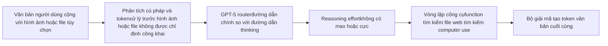

Sơ đồ này chỉ phản ánh những gì OpenAI nêu công khai: hệ thống GPT-5 được định tuyến, các điều khiển effort rõ ràng và các bề mặt công cụ tích hợp. OpenAI **không** ghi lại công khai đường dẫn bộ mã hóa hình ảnh, hạt nhân attention hoặc cơ chế hợp nhất multimodal nội bộ cho GPT-5.6. citeturn17view1turn25view0turn35view0

Một ví dụ về luồng dữ liệu công khai cụ thể là:

1. Người dùng gửi prompt dài kèm theo hình ảnh hoặc file.
2. OpenAI mã hóa văn bản và xử lý dữ liệu đầu vào khác thông qua đường dẫn **công khai không xác định**.
3. GPT-5 router quyết định xem ngã rẽ vẫn đi trên đường nhanh hay đường reasoning sâu hơn; mức reasoning đã chọn sẽ định hình mức độ cân nhắc bổ sung mà hệ thống sử dụng.
4. Nếu cần, mô hình sẽ nhập các vòng lặp công cụ thông qua các function, tìm kiếm trên web, tìm kiếm file hoặc computer use, sau đó trả về token văn bản cuối cùng. citeturn17view1turn25view0turn35view0

### Luồng dữ liệu dòng Claude

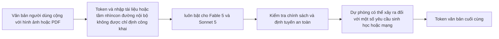

Luồng dữ liệu Claude được định hình công khai bởi ** adaptive thinking** và **định tuyến bảo vệ**, không phải bởi nội bộ cấp khối được tiết lộ. Anthropic cho biết Fable 5 và Sonnet 5 chạy với adaptive thinking và một số prompt về sinh học/mạng của Fable 5 có rủi ro cao được chuyển đến Opus 4.8. citeturn24view3turn22view0turn23view0

Một ví dụ về luồng dữ liệu công khai cụ thể là:

1. Người dùng tải lên bản PDF có biểu đồ và yêu cầu phân tích.
2. Claude nhập văn bản cùng với file hoặc hình ảnh thông qua đường dẫn nội bộ mà Anthropic không chỉ định công khai.
3. Mô hình chạy adaptive thinking để quyết định số lượng reasoning sẽ sử dụng, thay vì phụ thuộc vào ngân sách token thủ công.
4. Nếu yêu cầu chạm đến các biện pháp bảo vệ sinh học/mạng có rủi ro cao trong Fable 5, hệ thống có thể dự phòng; nếu không thì Claude trả về kết quả văn bản. citeturn23view0turn22view0turn24view3

### Luồng dữ liệu dòng Gemini

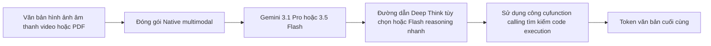

Google mô tả công khai Gemini là dòng **multimodal** vốn có context lâu dài và sử dụng công cụ hạng nhất. Việc tách bộ mã hóa/giải mã chính xác và ngăn hợp nhất bên trong cho Gemini 3.x không được chỉ định trên các trang mô hình đã xem xét, do đó sơ đồ vẫn ở cấp cơ chế sản phẩm. citeturn16view0turn37view2turn37view3turn40view0

Một ví dụ về luồng dữ liệu công khai cụ thể là:

1. Người dùng cung cấp một prompt dài, một bản PDF và ảnh chụp màn hình.
2. Gemini 3.x nhập văn bản cùng với đầu vào multimodal vào một cửa sổ context hợp nhất.
3. Yêu cầu được chuyển tới Gemini 3.5 Flash để thực thi agent nhanh hoặc tới Gemini 3.1 Pro/Deep Think khi reasoning sâu hơn phù hợp.
4. Mô hình có thể gọi các function, tìm kiếm hoặc code execution trước khi trả về đầu ra văn bản. citeturn37view2turn37view3turn40view0turn40view3

### Luồng dữ liệu dòng Qwen

```mermaid
flowchart LR
    I[Hình ảnh video và văn bản] --> V[Ngăn xếp tầm nhìn với DeepStack trong Qwen3-VL]
    I --> X[BBPE văn bản tokenizer]
    V --> F[Chuỗi multimodal xen kẽ với MRoPE nâng cao]
    X --> F
    F --> B[Bộ giải mã Dense hoặc MoEGQA RoPE QK-Norm RMSNorm SwiGLU]
    B --> C[Điều khiển Thinking/think /no_think và ngân sách]
    C --> O[Token văn bản cuối cùng]
```

Không giống như các họ khép kín, tài liệu công khai của Qwen cho phép chúng tôi khá cụ thể ở đây. Dòng văn bản tiết lộ token GQA, RoPE, RMSNorm, SwiGLU, QK-Norm và BBPE, trong khi Qwen3-VL tiết lộ tính năng xen kẽ nâng cao- MRoPE, DeepStack và căn chỉnh thời gian dựa trên văn bản cho video. citeturn28view3turn28view0turn34view0turn34view1

Một ví dụ về luồng dữ liệu công khai cụ thể là:

1. Người dùng gửi một hình ảnh và một câu hỏi hoặc một prompt dài đa ngôn ngữ.
2. Qwen mã hóa văn bản bằng BBPE tokenizer; Qwen3-VL mã hóa tín hiệu hình ảnh hoặc video và hợp nhất chúng thành chuỗi multimodal xen kẽ.
3. Bộ giải mã dense hoặc MoE xử lý trình tự đó với xử lý vị trí họ GQA, RoPE, RMSNorm và SwiGLU.
4. Người dùng hoặc chat template có thể buộc `/think` hoặc `/no_think` hoặc sử dụng ngân sách reasoning trước khi mô hình phát ra token cuối cùng. citeturn28view0turn28view3turn33view1turn34view1

### Luồng dữ liệu dòng Llama

```mermaid
flowchart LR
    I[Hình ảnh cộng với văn bản] --> V[MetaCLIP có nguồn gốc từ vision encoder]
    T[Token văn bản] --> F[Hợp nhất sớm thành backbone thống nhất]
    V --> F
    F --> M[Backbone MoEScout hoặc Maverick]
    M --> L[Scout iRoPE long-context đường dẫnhoặc các chuyên gia định tuyến cộng với chia sẻ Maverick]
    L --> O[Token văn bản hoặc code cuối cùng]
```

Bản phát hành công khai của Meta nêu rõ một cách bất thường rằng Llama 4 sử dụng **kết hợp sớm** cho văn bản và hình ảnh, một MetaCLIP có nguồn gốc từ vision encoder và backbone MoE. Scout và Maverick sau đó sẽ có những ưu tiên thiết kế định tuyến long-context và expert của họ. citeturn31view0turn30view3

Một ví dụ về luồng dữ liệu công khai cụ thể là:

1. Người dùng cung cấp một số hình ảnh và hướng dẫn bằng văn bản.
2. Hình ảnh được mã hóa bởi vision encoder và văn bản cùng với token hình ảnh được kết hợp sớm vào cùng một framework mô hình.
3. Nếu yêu cầu nhắm mục tiêu Scout, đường dẫn long-context sẽ được hưởng lợi từ chiến lược iRoPE; nếu nó nhắm mục tiêu vào Maverick, đường dẫn expert MoE được chia sẻ-cộng-định tuyến sẽ nhấn mạnh khả năng tổng thể cao hơn trên mỗi chi phí serving.
4. Mô hình trả về đầu ra văn bản hoặc code đa ngôn ngữ. citeturn31view0turn30view3

## Mẫu hiệu suất và trường hợp sử dụng

Kết luận rõ ràng nhất về hiệu suất không phải là một dòng thống trị mọi điểm chuẩn, mà là mỗi dòng hiện có **ngách deployment riêng biệt**. GPT-5.6 Sol được tối ưu hóa cho quy trình làm việc chuyên nghiệp kết hợp reasoning, browsing, sử dụng công cụ và sản xuất tạo tác; OpenAI nêu bật kết quả tốt về các điểm chuẩn trong Bài kiểm tra cuối cùng của Đại lý, DuyệtComp, OSWorld 2.0 và mã hóa- agent, trong khi các trang sản phẩm liên tục coi Sol là mô hình cho công việc chuyên môn phức tạp và Terra/Luna là các cấp thông lượng rẻ hơn. citeturn17view0turn25view0turn35view3

Nhóm mới nhất của Claude có vẻ mạnh nhất khi tác vụ yêu cầu **sự điều phối context cao, liên tục** thay vì các lượt trò chuyện ngắn, dồn dập. Tài liệu riêng của Anthropic coi Fable 5 là mô hình cho các agent kéo dài nhiều ngày, di chuyển lớn, triển khai phức tạp và phân tích nhiều tài liệu, trong khi Sonnet 5 là mặc định tiết kiệm chi phí kế thừa phần lớn hành vi agent đó thông qua adaptive thinking. Điều đó làm cho Claude đặc biệt hấp dẫn đối với quy trình làm việc dựa trên kiến thức và quy mô codebase, trong đó độ tin cậy qua nhiều bước cũng quan trọng như điểm chuẩn một lượt thô. citeturn23view0turn24view3turn22view0

Sự phân chia của Gemini giữa 3.1 Pro/ Deep Think và 3.5 Flash phù hợp với hai trường hợp sử dụng thực tế. ** Gemini 3.1 Pro** phù hợp hơn khi người dùng cần độ sâu multimodal tối đa, long-context reasoning hoặc công việc nặng về nghiên cứu; ** Gemini 3.5 Flash** phù hợp hơn khi vấn đề thực thi agent có độ trễ thấp. Bảng điểm chuẩn của Google nêu rõ rằng 3.5 Flash dẫn đầu trên nhiều điểm chuẩn agent so với các biến thể Gemini trước đó và một số đối thủ cạnh tranh, trong khi 3.1 Pro vẫn mạnh hơn trên một số số liệu reasoning và long-context khó hơn như MRCR và ARC-AGI-2. citeturn37view2turn40view3

Qwen vẫn là lựa chọn mạnh nhất khi yêu cầu là **deployment có weight mở cộng với reasoning có thể điều khiển trong suốt bất thường**. Qwen3-235B-A22B hàng đầu đăng các kết quả được công bố mạnh mẽ trên AIME, LiveCodeBench, CodeForces và BFCL, trong khi việc phân chia `/think` và `/no_think` và kiểm soát ngân sách của dòng này rõ ràng và thân thiện với nhà phát triển một cách khác thường. Sự đánh đổi là việc triển khai Qwen mở lớn nhất sẽ nhanh chóng sử dụng nhiều phần cứng, đặc biệt là ở mức 1 triệu context. citeturn33view2turn33view3turn27view3

Llama 4 mạnh nhất trong đó **tùy chỉnh weight mở, sự tự do của fine-tuning hoặc context cực dài** quan trọng hơn việc đánh bóng mô hình khép kín. Scout là ứng dụng nổi bật cho thử nghiệm siêu long-context với 10 triệu token, trong khi Maverick là ứng dụng đặc biệt multimodal có chất lượng thực tế cao hơn. Tuy nhiên, việc diễn giải điểm chuẩn cần thận trọng: một số tuyên bố về điểm chuẩn công khai trong thời kỳ ra mắt của Meta gắn liền với một biến thể trò chuyện thử nghiệm thay vì bản phát hành công khai chính xác, vì vậy cấu trúc và tính mở là điểm bán hàng mạnh mẽ hơn ở đây so với ảnh chụp nhanh bảng xếp hạng đơn lẻ. citeturn31view0turn30view3turn38news28

Nhìn chung, điểm tương đồng mới nhất ở cấp độ họ là **cả năm đều là mô hình agent đầu tiên và chat template thứ hai**. Sự khác biệt lâu dài là những yếu tố quyết định các quyết định thực sự về deployment: liệu bạn cần một hệ thống định tuyến độc quyền nhưng được đánh bóng với công cụ mạnh mẽ, agent chạy dài theo Hiến pháp, ngăn xếp multimodal nguyên bản của Google, mô hình mở có thể điều khiển reasoning được cấp phép của Apache hay mô hình multimodal weight mở kết hợp sớm mà bạn có thể tự chạy và fine-tune. citeturn25view0turn24view3turn37view2turn33view3turn31view0

## Nguồn ưu tiên

Các nguồn có thẩm quyền nhất cho sự so sánh này, theo thứ tự ưu tiên thực tế, là như sau:

**OpenAI**

- Trang khởi chạy GPT-5.6 dành cho việc xếp lớp, tính khả dụng, đa agent “siêu” và framework điểm chuẩn. citeturn35view3turn35view0
- Danh mục mô hình OpenAI API cho các cửa sổ, đầu ra, công cụ được hỗ trợ và bề mặt phương thức context hiện tại. citeturn25view0
- Trang system card GPT-5 mô tả công khai về GPT-5 như một hệ thống hợp nhất được định tuyến. citeturn17view1

**Anthropic**

- Tổng quan về các mô hình để so sánh dòng Claude hiện tại, cửa sổ context và tính khả dụng. citeturn24view3
- “Có gì mới trong Claude Sonnet 5 ” dành cho thay đổi và thích ứng tokenizer- mặc định thinking. citeturn22view0
- Trang Claude Fable 5 dành cho các trường hợp sử dụng agent trong thời gian dài và dự phòng biện pháp bảo vệ có rủi ro cao. citeturn23view0
- Tài liệu nghiên cứu Constitutional AI và Claude cho phương pháp căn chỉnh cấp độ họ. citeturn39search1turn39search2turn39search12

**Google**

- Các trang mô hình Flash Gemini 3.1 Pro và 3.5 cho các khả năng, công cụ 3. x hiện tại, các bề mặt context và deployment. citeturn37view2turn40view0
- Trang Gemini 3.1 Deep Think về mối quan hệ giữa Deep Think và 3.1 Pro. citeturn37view3
- Báo cáo kỹ thuật Gemini 2.5 dành cho báo cáo kỹ thuật công khai cấp độ họ mới nhất với nội dung thảo luận về kiến trúc/huấn luyện rõ ràng. citeturn16view0

**Qwen**

- Báo cáo kỹ thuật Qwen3 cho kiến trúc, thang đo pretraining, tokenizer và đường dẫn post-training. citeturn28view0turn28view3turn33view0
- Thẻ mô hình Qwen3-235B-A22B-2507 dành cho các thông tin chi tiết về deployment mở hàng đầu hiện tại và các ghi chú long-context serving. citeturn27view2turn27view3
- Qwen3-VL tài liệu và bản tóm tắt báo cáo kỹ thuật về các chi tiết cụ thể về fusion multimodal. citeturn34view0turn34view1

**Meta**

- Blog phát hành Llama 4 về cấu trúc MoE, fusion sớm, iRoPE, quy mô huấn luyện và trình tự post-training. citeturn31view0
- Thẻ mô hình Llama 4 dành cho kích thước mô hình, bối cảnh, phương thức, kết hợp dữ liệu huấn luyện và cấp phép chính thức. citeturn30view3turn29search6
- Báo cáo cảnh báo điểm chuẩn thứ cấp cho LMArena/bản phát hành công khai không khớp. citeturn38news28

Các tuyên bố so sánh có độ tin cậy cao nhất trong báo cáo này là các tuyên bố về ** kiến trúc Qwen và Llama**, **hành vi GPT/ Claude/Gemini deployment** và ** các bề mặt context /tool/ multimodal**. Các vùng có độ tin cậy thấp nhất chính xác là những vùng mà nhà cung cấp không ghi lại công khai cho các dòng đóng mới nhất: dense so với MoE, hạt nhân attention chi tiết, mã hóa vị trí, kích hoạt FFN và các lựa chọn chuẩn hóa cho GPT-5.6, Claude 5 và Gemini 3.x. Do đó, chúng được cân nhắc kỹ dán nhãn **không xác định công khai** xuyên suốt. citeturn28view3turn31view0turn25view0turn24view3turn37view

# So sánh các họ LLM lớn mới nhất

## Tóm tắt điều hành

Các dòng LLM chính thống mới nhất đã hội tụ một số đặc điểm ở cấp độ sản phẩm có thể nhìn thấy: cửa sổ context rất dài, đầu vào multimodal, điều khiển reasoning rõ ràng và tích hợp chặt chẽ hơn với các công cụ hoặc vòng lặp agent. GPT-5.6, Claude 5, Gemini 3.x, Qwen3 và Llama 4 đều thể hiện mình là mô hình để mã hóa, công việc tri thức hoặc thực thi agent thay vì là các chatbot đơn giản. Nhưng họ khác nhau rõ rệt về những gì họ tiết lộ. OpenAI, Anthropic và Google hiện xuất bản tài liệu phong phú về sản phẩm, an toàn và deployment trong khi vẫn để lại nhiều lựa chọn kiến trúc cấp khối không được chỉ định công khai. Ngược lại, Qwen và Llama xuất bản nhiều nền tảng kỹ thuật hơn: số lượng expert, số lượng đầu người, chiến lược vị trí, số lượng huấn luyện- token và các công thức post-training cụ thể. citeturn25view0turn24view3turn37view2turn28view3turn30view3turn31view0

Sự khác biệt quan trọng nhất ở cấp độ họ không còn chỉ là “điểm chuẩn X tốt hơn”. Đó là khả năng *làm thế nào* được đóng gói. GPT-5 của OpenAI được đóng framework công khai dưới dạng một hệ thống được định tuyến với các mô hình con thinking nhanh và sâu hơn cũng như hệ thống phân tầng Sol/Terra/Luna đối mặt với API. Sự khác biệt hiện tại của Anthropic tập trung vào adaptive thinking, các agent hoạt động lâu dài và định tuyến an toàn cho các miền có rủi ro cao. Gemini 3.x của Google nhấn mạnh tính đa phương thức của native, bối cảnh 1M- token và các quy trình làm việc agent hỗ trợ công cụ mạnh mẽ, với Deep Think là chế độ reasoning chuyên biệt được xây dựng trên Gemini 3.1 Pro. Flagship hiện tại của Qwen vẫn là dòng sản phẩm có weight mở minh bạch nhất trong so sánh này, kết hợp các dòng MoE và dense, kiểm soát ngân sách thinking rõ ràng và một dòng anh chị em multimodal với các nâng cấp kết hợp hình ảnh được công bố. Llama 4 của Meta là trường hợp rõ ràng nhất về dòng biên giới có weight mở được xây dựng dựa trên đa phương thức kết hợp sớm và hiệu quả MoE, với Scout được tối ưu hóa cho context và Maverick cực cao để làm việc multimodal chung chất lượng cao hơn. citeturn17view1turn35view3turn24view3turn22view0turn37view3turn40view0turn33view3turn34view1turn31view0turn30view3

Trong năm họ, một số điểm tương đồng hiện đã đủ ổn định để trở thành vấn đề quan trọng trong thực tế. Tất cả đều được tối ưu hóa cho việc sử dụng công cụ hoặc quy trình làm việc agent; tất cả đều hỗ trợ multimodal hoặc ít nhất là các trường hợp sử dụng nặng về thị giác ở bề mặt sản phẩm; tất cả đều cung cấp context dài vượt xa phạm vi 32K–128K cũ; và tất cả đều đã đầu tư đáng kể vào post-training để định hình hành vi, không chỉ thang đo pretraining thô. Sự khác biệt nằm ở chỗ mỗi nhà cung cấp đặt cược kỹ thuật của mình: OpenAI trên reasoning được định tuyến cộng với năng suất phong phú về công cụ; Anthropic dựa trên các agent context bền bỉ, có chỉ số cao và sự liên kết theo phong cách Hiến pháp-AI; Google về thực thi đa phương thức và agent tích hợp; Qwen trên reasoning có thể điều khiển và deployment mở linh hoạt; và Meta về đa phương thức weight mở hiệu quả với context cực cao trong Scout và chất lượng trên mỗi chi phí mạnh mẽ trong Maverick. citeturn25view0turn17view1turn24view3turn39search1turn37view2turn40view0turn33view3turn31view0turn30view3

## Phạm vi và tiêu chí so sánh

Báo cáo này so sánh **các biến thể công khai mới nhất có liên quan đến thực tế với tài liệu chính có thể sử dụng** kể từ **ngày 20 tháng 7 năm 2026**: **OpenAI GPT-5.6** (Sol/Terra/Luna), **Anthropic Claude Fable 5 và Sonnet 5**, **Google Gemini 3.1 Pro/Deep Think và 3.5 Flash**, ** Qwen3-235B-A22B-2507 cộng với Qwen3-VL** và **Meta Llama 4 Maverick/Scout**. Tôi coi mỗi cái như một *ảnh chụp nhanh họ*, vì một số nhà cung cấp hiện hiển thị nhiều cấp độ hiện tại có cùng thế hệ sản phẩm nhưng khác nhau về chi phí, tốc độ hoặc chế độ reasoning. Khi một chi tiết không có trong tài liệu chính thức, tôi đánh dấu nó **không được chỉ định công khai** thay vì suy luận nó. citeturn35view3turn24view3turn37view2turn40view0turn27view2turn34view1turn30view3

Về mặt phương pháp, báo cáo ưu tiên các trang phát hành chính thức, tổng quan về API /mô hình, thẻ mô hình, system card, báo cáo kỹ thuật và tài liệu arXiv. Đối với Qwen và Llama, hồ sơ kỹ thuật cơ bản rất phong phú, do đó, các yêu cầu về kiến trúc có thể được đưa ra ở cấp độ khối và công thức huấn luyện. Đối với GPT, Claude và Gemini, hồ sơ công khai về hành vi, độ an toàn và deployment của sản phẩm dày đặc hơn nhiều so với các lựa chọn transformer nội bộ, do đó, việc phân tích tương ứng sẽ thận trọng hơn. citeturn28view3turn31view0turn25view0turn22view0turn37view2turn16view0

```mermaid
timeline
    title Các snapshot họ mô hình gần đây được sử dụng trong báo cáo này
    2025 : Báo cáo kỹ thuật Gemini 2.5
         : Báo cáo kỹ thuật Qwen3
         : Phát hành Llama 4 Scout và Maverick
    2026 : Trang Gemini 3.1 Pro và Deep Think
         : Trang Gemini 3.5 Flash
         : Claude Fable 5 và Sonnet 5
         : GPT-5.6 Sol, Terra, Luna
```

Dòng thời gian ở trên được giới hạn ở các ảnh chụp nhanh dòng sản phẩm thực sự được phân tích trong báo cáo chứ không phải ở mọi bản phát hành trung gian. Gemini 2.5 được đưa vào vì đây vẫn là *báo cáo kỹ thuật* công khai mới nhất của Google với nội dung thảo luận rõ ràng về kiến trúc/huấn luyện ở cấp độ họ, trong khi các trang 3. x mới nhất chủ yếu ghi lại các khả năng và deployment. citeturn16view0turn37view2turn40view0turn24view3turn35view3turn28view3turn31view0

## Bảng so sánh

| Ảnh chụp nhanh họ | sẵn có | Biến thể kiến trúc | Attention và kỹ thuật định vị | FFN và chuẩn hóa | Tokenizer | Context và đầu ra | Đa phương thức và hợp nhất | Điểm nổi bật về huấn luyện và post-training | Cơ sở nguồn chính |
| ----------------------------------------------------------- | ------------------------------------------------------------------------------------- | -------------------------------------------------------------------------------------------------------------------------------- | ------------------------------------------------------------------------------------------------------------------------------------------------------------------------------------------------------ | -------------------------------------------------------------------------------------------------------------- | ---------------------------------------------------------------------------------------------------- | ------------------------------------------------------------------------------------------------------------- | ----------------------------------------------------------------------------------------------------------------------------------------------------------- | -------------------------------------------------------------------------------------------------------------------------------------------------------------------------------------------------------------------------------- | -------------------------------------------------------------------------------------- |
| **OpenAI GPT-5.6** Sol/Terra/Luna | Độc quyền thông qua ChatGPT, Codex và OpenAI API | Được mô tả công khai là hệ thống GPT-5 được định tuyến cộng với các bậc API; dense so với MoE **không được chỉ định công khai** | Loại Attention, sơ đồ Flash/trượt và vị trí **không được chỉ định công khai** | Kích hoạt và chuẩn hóa **không được chỉ định công khai** | thiết kế **không được chỉ định công khai** | Đầu ra 1,05M context, 128K max | Nhập văn bản và hình ảnh, xuất văn bản; công cụ bao gồm các function, tìm kiếm trên web, tìm kiếm file, computer use | Được định tuyến giữa các hành vi “chính” và “thinking”; hoàn thành an toàn; Bộ điều khiển reasoning effort; multi- agent “cực phẩm” hàng đầu trong họ | citeturn17view1turn25view0turn35view0turn35view3 |
| **Anthropic Claude** Fable 5/Sonnet 5 | Độc quyền thông qua các sản phẩm Claude API, Bedrock, Google Cloud, Microsoft Foundry, Claude | Loại phụ transformer nội bộ **không được chỉ định công khai**; họ sản phẩm được phân biệt bởi adaptive thinking và phân cấp mô hình | Sơ đồ vị trí và loại Attention **không được chỉ định công khai** | Kích hoạt và chuẩn hóa **không được chỉ định công khai** | Sonnet 5 sử dụng **tokenizer mới**; thiết kế token khác **không được chỉ định công khai** | Fable 5, Opus 4.8 và Sonnet 5 đều có đầu ra 1M context và 128K max | Nhập văn bản và hình ảnh, xuất văn bản; quy trình làm việc tài liệu PDF/file mạnh mẽ; Nội bộ multimodal **không được chỉ định công khai** | Constitutional AI vẫn là phương pháp căn chỉnh xác định cho Claude nói chung; Fable 5 luôn có tính thích ứng- thinking; Sonnet 5 mặc định là adaptive thinking và loại bỏ ngân sách thinking thủ công | citeturn24view3turn22view0turn23view0turn39search1turn39search12 |
| **Google Gemini 3.x** 3.1 Pro/Deep Think, 3.5 Flash | Độc quyền thông qua ứng dụng Gemini, Gemini API, AI Studio, Enterprise surface | Họ mô hình thế hệ multimodal nguyên bản; bộ giải mã và bộ mã hóa-giải mã **không được chỉ định công khai** | Loại Attention, trạng thái MoE và sơ đồ vị trí cho 3. x **không được chỉ định công khai**; báo cáo kỹ thuật mới nhất với chi tiết cấp độ họ vẫn là Gemini 2.5 | Kích hoạt và chuẩn hóa **không được chỉ định công khai** | **Không được chỉ định công khai** | Đầu vào 1M, đầu ra 64K trên 3.1 Pro và 3.5 Flash | Đầu vào văn bản, hình ảnh, video, âm thanh và PDF; văn bản đầu ra; được mô tả công khai là multimodal nguyên bản | 3.1 Deep Think được xây dựng dựa trên 3.1 Pro;3.5 Flash nhấn mạnh vào mã hóa agent và reasoning ở độ trễ thấp; function calling, công cụ tìm kiếm, structured output và code execution là hạng nhất | citeturn37view2turn37view3turn40view0turn40view3turn16view0 |
| ** Qwen3** 235B-A22B-2507 và ** Qwen3-VL** | Trọng lượng mở, Apache 2.0; có thể triển khai thông qua ngăn xếp HF/ vLLM/SGLang/cục bộ | Họ mô hình ngôn ngữ nhân quả với cả hai dòng dense và MoE; mô hình mở hàng đầu có tổng cộng 235B/22B hoạt động | GQA, RoPE, QK-Norm; Cơ sở RoPE tăng lên 1.000.000 với ABF; YaRN và Dual Chunk Attention được sử dụng cho phần mở rộng long-context; Qwen3-VL bổ sung tính năng xen kẽ nâng cao- MRoPE | SwiGLU và RMSNorm với định mức trước | Qwen BBPE tokenizer, từ vựng 151,669 | 235B-A22B-2507: 262.144 native và có thể mở rộng tới ~1,01M; Qwen3-VL: native 256K xen kẽ multimodal context | Qwen3-VL tích hợp các tính năng ViT với DeepStack và căn chỉnh dấu thời gian dựa trên văn bản cho video; Họ văn bản hỗ trợ điều khiển chế độ `/think` và `/no_think` | 36T- token pretraining trên 119 ngôn ngữ; hạm bốn giai đoạn post-training: khởi động nguội CoT dài, reasoning RL, thinking -mode fusion SFT, RL miền chung; chưng cất mạnh đến yếu cho các mô hình nhỏ hơn | citeturn27view2turn27view3turn28view0turn28view3turn33view0turn34view1 |
| **Meta Llama 4** Maverick/Scout | Trọng lượng mở theo Giấy phép Cộng đồng Llama 4; có thể tải xuống từ Meta và Hugging Face | Họ MoE tự động hồi quy với sự early fusion cho đa phương thức native | Maverick sử dụng các lớp dense và MoE xen kẽ, các chuyên gia được chia sẻ + định tuyến; Scout sử dụng iRoPE với các lớp attention xen kẽ và chia tỷ lệ attention temperature theo thời gian suy luận để khái quát hóa độ dài | Thông tin cụ thể về kích hoạt, chuẩn hóa và tokenizer **không được chỉ định công khai** trong các tài liệu được đánh giá | **Không được chỉ định công khai** | Maverick: 1M context; Scout: 10M context | Đa phương thức kết hợp sớm thành một backbone thống nhất; MetaCLIP vision encoder có nguồn gốc từ vision encoder được điều chỉnh phù hợp với LLM | Multimodal pretraining trên hỗn hợp token /hình ảnh/video rất lớn; Đường ống Maverick post-training có weight nhẹ SFT → RL trực tuyến → DPO nhẹ; cả hai đều được phát hành dưới dạng mô hình weight mở, nhưng có giấy phép cộng đồng không phải OSI | citeturn30view3turn31view0turn29search6turn38news27 |

Hai mô hình ngay lập tức xuất hiện từ bảng. Đầu tiên, **các họ mở tiết lộ nhiều hơn về ngăn xếp transformer thực tế**: Qwen xuất bản GQA, RoPE, QK-Norm, RMSNorm, SwiGLU, tokenizer từ vựng, số lượng expert và kỹ thuật long-context, trong khi Llama 4 xuất bảnCấu trúc liên kết MoE, fusion sớm, số lượng expert, kích thước context và trình tự post-training. Thứ hai, **các dòng đóng ngày càng khác biệt ở lớp hệ thống và sản phẩm**, chứ không phải ở lớp sơ đồ khối: GPT-5.6 thông qua định tuyến và các cấp độ effort, Claude đến adaptive thinking cộng với các biện pháp bảo vệ theo miền cụ thể và Gemini đến đa phương thức native, Deep Think và các bề mặt công cụ rộng. citeturn28view3turn33view0turn31view0turn17view1turn22view0turn37view3turn40view3

## Phân tích theo từng họ

### OpenAI GPT

Dòng GPT mới nhất của OpenAI được hiểu một cách công khai nhất là **hệ thống reasoning được định tuyến** thay vì một mô tả transformer nguyên khối duy nhất. System card GPT-5 cho biết GPT-5 là “một hệ thống hợp nhất” kết hợp mô hình thông minh/nhanh, mô hình reasoning sâu hơn và router thời gian thực quyết định sử dụng cái nào dựa trên loại hội thoại, độ phức tạp, nhu cầu công cụ và mục đích rõ ràng. Riêng biệt, danh mục mô hình API hiện tại hiển thị ** GPT-5.6 Sol, Terra và Luna** là các bậc bền bỉ với cùng cửa sổ context 1,05M, đầu ra 128K max, đầu vào hình ảnh, đầu ra văn bản và hỗ trợ công cụ tích hợp. OpenAI **không** chỉ định công khai liệu các mô hình được triển khai này là dense hay MoE, chúng sử dụng biến thể attention nào, cách xử lý mã hóa vị trí hoặc chúng sử dụng sơ đồ kích hoạt và chuẩn hóa nào. citeturn17view1turn25view0turn35view3

Điều * cụ thể* về GPT hiện nay là chính sách điện toán lớp sản phẩm. Các tài liệu chính thức hiển thị các cấp độ reasoning rõ ràng từ **none** đến ** max**, trong khi trang khởi chạy GPT-5.6 bổ sung **siêu**, được mô tả là điều phối nhiều agent trên các luồng công việc song song để làm việc chăm chỉ hơn. Điều này có nghĩa là sự đổi mới rõ ràng nhất của GPT là ít “loại khối transformer mới” hơn và **phân bổ động của sự cân nhắc và tính song song của agent** trên long-context, hệ thống cơ sở hỗ trợ công cụ. Đó là một sự khác biệt thực sự về kiến trúc tại thời điểm deployment, ngay cả khi kiến trúc thần kinh bên trong vẫn chưa được tiết lộ. citeturn25view0turn35view3turn35view0

Về căn chỉnh và post-training, các tài liệu công khai hiện tại của OpenAI nhấn mạnh **hoàn thành an toàn**, giảm ảo giác, tuân theo hướng dẫn mạnh mẽ hơn và giảm tính đồng bộ, nhưng không xuất bản công thức RLHF hoặc DPO dành riêng cho GPT-5.6 ở cấp độ Qwen hoặc Llama tiết lộ. System card cũng hiển thị quan điểm deployment thiên về Chuẩn bị sẵn sàng, bao gồm cả việc xử lý phòng ngừa GPT-5-thinking trong một số lĩnh vực sinh học/hóa học. Nói cách khác, tính minh bạch công khai của OpenAI mạnh nhất ở **định tuyến, guardrail và evals**, yếu hơn ở **nội bộ cấp khối**. citeturn17view1turn35view3

### Anthropic Claude

Ảnh chụp nhanh họ mới nhất của Anthropic được tách thành **Fable 5** là mô hình được phát hành rộng rãi có khả năng nhất và **Sonnet 5** là mô hình phổ thông, nhanh hơn, rẻ hơn. Phần tổng quan về mô hình cung cấp cả ba cấp Claude hàng đầu—Fable 5, Opus 4.8 và Sonnet 5—a **1M- token context window** và **đầu ra 128K max**, trong khi trang di chuyển của Sonnet 5 thêm một thay đổi tokenizer được ghi nhận cụ thể và chuyển sang ** adaptive thinking** làm hành vi mặc định. Các tài liệu công khai của Anthropic không chỉ rõ nội bộ của mô hình là dense hay MoE, mô hình attention nào họ sử dụng hoặc họ sử dụng ngăn xếp kích hoạt và chuẩn hóa nào. citeturn24view3turn22view0

Do đó, chữ ký công khai đặc biệt của Claude tập trung vào hành vi và sự liên kết. Fable 5 được trình bày dưới dạng cấp độ cho **các tác vụ kéo dài nhiều ngày, chạy dài, không đồng bộ**, đặc biệt là công việc coding và chứa nhiều kiến thức về tài liệu. Nó cũng đi kèm với các biện pháp bảo vệ sinh học/mạng đặc biệt, với nhiều prompt có nguy cơ cao được tự động chuyển xuống Opus 4.8 thay vì được Fable 5 trả lời trực tiếp. Trong khi đó, Sonnet 5 được trình bày dưới dạng bản nâng cấp thả xuống có mặc định có tác dụng hơn: adaptive thinking được bật theo mặc định, ngân sách thinking thủ công bị xóa và các tham số sampling không mặc định bị từ chối. Điều đó là bất thường đối với các API biên giới và cho thấy Anthropic đang thúc đẩy người dùng hướng tới một hồ sơ hoạt động hẹp hơn, mang tính xác định hơn cho các mô hình sản xuất mới nhất của mình. citeturn23view0turn24view3turn22view0

Anthropic cũng vẫn là trường hợp rõ ràng nhất trong đó **bản thân triết lý liên kết đã là yếu tố tạo ra sự khác biệt trong họ**. Claude được liên kết rõ ràng với ** Constitutional AI**, mà Anthropic mô tả là học tập có giám sát cộng với reinforcement learning được hướng dẫn bởi một bộ nguyên tắc thay vì chỉ bởi các nhãn có hại từ con người. Các tài liệu minh bạch hiện tại của công ty vẫn mô tả Constitutional AI là trọng tâm trong cách Claude phù hợp với các giá trị con người trong quá trình reinforcement learning. Điều đó làm cho Claude trở thành dòng sản phẩm có triết lý post-training dễ đọc nhất một cách công khai, mặc dù kiến trúc transformer cơ bản thì không. citeturn39search1turn39search12turn39search2

### Google Gemini

Ảnh chụp nhanh Gemini công khai mới nhất của Google được chia thành hai nhánh: ** Gemini 3.1 Pro** vẫn là “tốt nhất cho các tác vụ phức tạp” và là cơ sở cho ** Gemini 3.1 Deep Think**, trong khi ** Gemini 3.5 Flash** là cấp biên giới nhanh mới hơn dành cho các agent và mã hóa. Các trang mô hình chính thức hiển thị cả 3.1 Pro và 3.5 Flash ở **đầu vào 1M/đầu ra 64K**, hỗ trợ đầu vào văn bản, hình ảnh, video, âm thanh và PDF, cùng với function calling, structured output, tìm kiếm dưới dạng công cụ và code execution. Deep Think được mô tả rõ ràng là chế độ reasoning chuyên dụng được xây dựng dựa trên Gemini 3.1 Pro. citeturn37view2turn37view3turn40view0

Về mặt kiến trúc, Google hiện kém minh bạch hơn Qwen hoặc Meta đối với dòng Gemini 3.x mới nhất. Các trang sản phẩm 3. x hiện tại không chỉ định công khai dense so với MoE, kiểu attention, mã hóa vị trí, thiết kế tokenizer, chuẩn hóa hoặc kích hoạt FFN. Báo cáo kỹ thuật chi tiết mới nhất trong hồ sơ công khai vẫn là ** Gemini 2.5**, mô tả dòng 2. x là **multimodal** ban đầu **, với** >1M- token đầu vào **, thinking và cách sử dụng công cụ. Hành vi bên ngoài của Gemini 3.x tiếp tục quỹ đạo đó một cách mạnh mẽ, nhưng một báo cáo nghiêm ngặt sẽ không thể khẳng định tính liên tục đối với các lựa chọn cấp khối không được tiết lộ. citeturn16view0turn37view2turn40view3

Do đó, điểm khác biệt rõ ràng nhất của Gemini là **đa phương thức tích hợp cộng với việc thực thi agent**. Gemini 3.5 Flash được định vị rõ ràng cho mã hóa agent biên giới, hiểu biết về multimodal, các tác vụ có tầm nhìn dài và giải quyết vấn đề nhiều bước, trong khi bảng điểm chuẩn trên trang của Google cho thấy nó có tính cạnh tranh hoặc dẫn đầu trong một số tác vụ agent và multimodal so với Gemini trước đó và một số mô hình đối thủ. Bài học thực tế rút ra là danh tính họ của Gemini không còn là “chat template có hỗ trợ hình ảnh” nữa; nó là “một nền tảng multimodal nguyên bản, sử dụng công cụ, long-context agent,” ngay cả khi ngăn xếp hợp nhất nội bộ chính xác không được chỉ định công khai cho 3. x. citeturn40view0turn40view3turn37view2

### Qwen

Qwen là họ trong bộ này có **công bố kỹ thuật công khai phong phú nhất**. Báo cáo kỹ thuật Qwen3 cho biết dòng dense tiếp tục ngăn xếp Qwen2.5 của ** GQA, SwiGLU, RoPE và RMSNorm với tính năng chuẩn hóa trước**, đồng thời thêm ** QK-Norm** và loại bỏ độ lệch QKV. Nó cũng xuất bản cấu trúc liên kết MoE: hàng đầu ** Qwen3-235B-A22B** có **128 chuyên gia với 8 chuyên gia được kích hoạt trên mỗi token** và dòng sử dụng **BPE cấp byte** với **151.669- token vốn từ vựng**. Các nguồn kỹ thuật công khai cũng tiết lộ rằng Qwen3 đã được huấn luyện trước trên **36T token trên 119 ngôn ngữ và phương ngữ**. citeturn28view0turn28view3turn33view2

Qwen cũng có độ chính xác bất thường về kỹ thuật long-context. Báo cáo kỹ thuật cho biết Qwen3 tăng tần số cơ sở RoPE từ 10.000 lên **1.000.000** bằng cách sử dụng **ABF** và giới thiệu ** YaRN** cộng với **Dual Chunk Attention** để tăng công suất chuỗi thời gian suy luận. Thẻ mô hình ** Qwen3-235B-A22B-2507** được cập nhật cung cấp hàng đầu có weight mở **262.144 native context**, có thể mở rộng tới khoảng **1,01 triệu token**, trong khi hướng dẫn long-context chỉ định cấu hình sparse-attention serving và thậm chí cả dung lượng bộ nhớ gần đúng chosử dụng đúng 1M- token. Điều này cụ thể hơn đáng kể so với những gì các nhà cung cấp đóng cửa ở biên giới công bố hiện nay. citeturn28view4turn27view2turn27view3

Post-training là một lĩnh vực khác mà Qwen tỏ ra rõ ràng một cách bất thường. Công thức hàng đầu của Qwen3 là một quy trình **bốn giai đoạn**: khởi động nguội CoT trong thời gian dài, reasoning RL, kết hợp chế độ thinking thông qua SFT và miền chung RL. Điểm khác biệt bất thường đối với người dùng của dòng này là nó hợp nhất ** thinking** và ** non-thinking** vào cùng một mô hình, hiển thị thông qua các điều khiển ** `/think`** và ** `/no_think`** và cơ chế ngân sách ** thinking**. Đối với các mô hình nhỏ hơn, Qwen mô tả lộ trình chưng cất từ mạnh đến yếu thay vì lặp lại toàn bộ quy trình chưng cất đắt tiền hàng đầu. citeturn33view0turn33view1turn33view3

Đối với đa phương thức, anh chị em Qwen mới nhất cần biết là ** Qwen3-VL**. Các tài liệu công khai và bản tóm tắt báo cáo kỹ thuật của nó mô tả **xen kẽ 256K multimodal context**, **xen kẽ nâng cao- MRoPE**, **tích hợp DeepStack** cho các tính năng ViT đa cấp và **căn chỉnh dấu thời gian dựa trên văn bản** để hiểu video. Điều đó làm cho Qwen được cho là dòng minh bạch nhất ở đây không chỉ đối với nội bộ LLM chỉ có văn bản mà còn đối với các tham số cụ thể của hợp nhất multimodal. citeturn34view0turn34view1

### Meta Llama

thiết kế công cộng của Llama 4 là rõ ràng nhất trong số các họ weight mở lớn của phương Tây. Thẻ mô hình và bản phát hành chính thức của Meta mô tả ** Llama 4 Scout** và ** Llama 4 Maverick** là **các mô hình MoE** tự động hồi quy ** với** kết hợp sớm ** cho đa phương thức native. Maverick được liệt kê ở mức** 17B hoạt động/tổng số 400B ** với** 128 chuyên gia **, trong khi Scout là** 17B hoạt động/tổng số 109B ** với** 16 chuyên gia **. Thẻ mô hình công khai cũng hiển thị context và sự bất đối xứng trong quy mô huấn luyện: Scout nhắm mục tiêu** 10 triệu context ** và khoảng** 40T token **, trong khi Maverick nhắm mục tiêu** 1 triệu context ** và khoảng** 22T token **. citeturn30view3turn31view0

Meta cũng tiết lộ nhiều hơn về cấu trúc liên kết serving so với hầu hết các nhà cung cấp độc quyền. Blog phát hành cho biết Maverick sử dụng **các lớp dense và MoE xen kẽ**, và mỗi lớp token được gửi đến **expert được chia sẻ** cộng với một expert được định tuyến trong số 128. Ngược lại, Scout là mô hình nghiên cứu long-context của dòng: Meta mô tả kiến trúc ** iRoPE** kết hợp **xen kẽCác lớp attention không có phần nhúng vị trí** trong một số lớp, RoPE trong hầu hết các lớp và attention temperature chia tỷ lệ theo thời gian suy luận để cải thiện khả năng khái quát hóa độ dài. Điều đó khiến Scout trở thành thử nghiệm kiến trúc long-context rõ ràng nhất trong toàn bộ cuộc so sánh này. citeturn31view0

Tiết lộ post-training của Llama 4 cũng tương đối mạnh mẽ. Meta cho biết Maverick đã được huấn luyện sau khi sử dụng **SFT nhẹ → RL trực tuyến → DPO nhẹ** và việc cân bằng các phương thức reasoning và chất lượng đàm thoại là vấn đề trọng tâm. Về đa phương thức, Meta nhấn mạnh **kết hợp sớm** cộng với ** MetaCLIP có nguồn gốc từ vision encoder** được huấn luyện để thích ứng với LLM, cũng như pretraining hình ảnh/video tĩnh để hỗ trợ reasoning hình ảnh rộng. Do đó, dòng này nổi bật là trường hợp được ghi chép rõ ràng nhất về ** đa phương thức native trong dòng biên giới có weight mở**. citeturn31view0turn30view3

Một sự thận trọng là giải thích điểm chuẩn. Blog chính thức của Meta đã nêu bật **biến thể trò chuyện thử nghiệm** của Maverick cho LMArena và báo cáo sau đó cho thấy biến thể bảng xếp hạng không giống với bản phát hành công khai, điều này làm phức tạp việc chuyển trực tiếp một số xác nhận điểm chuẩn tiêu đề sang mô hình có thể tải xuống. Điều đó không phủ nhận những đổi mới kỹ thuật của dòng sản phẩm này, nhưng điều đó có nghĩa là câu chuyện chuẩn công khai của Llama 4 xứng đáng được xem xét kỹ lưỡng hơn câu chuyện kiến trúc của nó. citeturn31view0turn38news28

## Hướng dẫn về luồng dữ liệu công khai

### Luồng dữ liệu dòng GPT

```mermaid
flowchart LR
    U[Văn bản người dùng cộng với hình ảnh hoặc file tùy chọn] --> P[Phân tích cú pháp và tokenxử lý trước hình ảnh hoặc file không được chỉ định công khai]
    P --> R[GPT-5 routerđường dẫn chính so với đường dẫn thinking]
    R --> E[Reasoning effortkhông có max hoặc cực]
    E --> T[Vòng lặp công cụfunction tìm kiếm file web tìm kiếm computer use]
    T --> D[Bộ giải mã tạo token văn bản cuối cùng]
```

Sơ đồ này chỉ phản ánh những gì OpenAI nêu công khai: hệ thống GPT-5 được định tuyến, các điều khiển effort rõ ràng và các bề mặt công cụ tích hợp. OpenAI **không** ghi lại công khai đường dẫn bộ mã hóa hình ảnh, hạt nhân attention hoặc cơ chế hợp nhất multimodal nội bộ cho GPT-5.6. citeturn17view1turn25view0turn35view0

Một ví dụ về luồng dữ liệu công khai cụ thể là:

1. Người dùng gửi prompt dài kèm theo hình ảnh hoặc file.
2. OpenAI mã hóa văn bản và xử lý dữ liệu đầu vào khác thông qua đường dẫn **công khai không xác định**.
3. GPT-5 router quyết định xem ngã rẽ vẫn đi trên đường nhanh hay đường reasoning sâu hơn; mức reasoning đã chọn sẽ định hình mức độ cân nhắc bổ sung mà hệ thống sử dụng.
4. Nếu cần, mô hình sẽ nhập các vòng lặp công cụ thông qua các function, tìm kiếm trên web, tìm kiếm file hoặc computer use, sau đó trả về token văn bản cuối cùng. citeturn17view1turn25view0turn35view0

### Luồng dữ liệu dòng Claude

```mermaid
flowchart LR
    U[Văn bản người dùng cộng với hình ảnh hoặc PDF] --> P[Token và nhập tài liệu hoặc tầm nhìncon đường nội bộ không được chỉ định công khai]
    P --> A[luôn bật cho Fable 5 và Sonnet 5]
    A --> S[Kiểm tra chính sách và định tuyến an toàn]
    S --> F[Dự phòng có thể xảy ra đối với một số yêu cầu sinh học hoặc mạng]
    F --> O[Token văn bản cuối cùng]
```

Luồng dữ liệu Claude được định hình công khai bởi ** adaptive thinking** và **định tuyến bảo vệ**, không phải bởi nội bộ cấp khối được tiết lộ. Anthropic cho biết Fable 5 và Sonnet 5 chạy với adaptive thinking và một số prompt về sinh học/mạng của Fable 5 có rủi ro cao được chuyển đến Opus 4.8. citeturn24view3turn22view0turn23view0

Một ví dụ về luồng dữ liệu công khai cụ thể là:

1. Người dùng tải lên bản PDF có biểu đồ và yêu cầu phân tích.
2. Claude nhập văn bản cùng với file hoặc hình ảnh thông qua đường dẫn nội bộ mà Anthropic không chỉ định công khai.
3. Mô hình chạy adaptive thinking để quyết định số lượng reasoning sẽ sử dụng, thay vì phụ thuộc vào ngân sách token thủ công.
4. Nếu yêu cầu chạm đến các biện pháp bảo vệ sinh học/mạng có rủi ro cao trong Fable 5, hệ thống có thể dự phòng; nếu không thì Claude trả về kết quả văn bản. citeturn23view0turn22view0turn24view3

### Luồng dữ liệu dòng Gemini

```mermaid
flowchart LR
    U[Văn bản hình ảnh âm thanh video hoặc PDF] --> M[Đóng gói Native multimodal]
    M --> G[Gemini 3.1 Pro hoặc 3.5 Flash]
    G --> D[Đường dẫn Deep Think tùy chọn hoặc Flash reasoning nhanh]
    D --> T[Sử dụng công cụfunction calling tìm kiếm code execution]
    T --> O[Token văn bản cuối cùng]
```

Google mô tả công khai Gemini là dòng **multimodal** vốn có context lâu dài và sử dụng công cụ hạng nhất. Việc tách bộ mã hóa/giải mã chính xác và ngăn hợp nhất bên trong cho Gemini 3.x không được chỉ định trên các trang mô hình đã xem xét, do đó sơ đồ vẫn ở cấp cơ chế sản phẩm. citeturn16view0turn37view2turn37view3turn40view0

Một ví dụ về luồng dữ liệu công khai cụ thể là:

1. Người dùng cung cấp một prompt dài, một bản PDF và ảnh chụp màn hình.
2. Gemini 3.x nhập văn bản cùng với đầu vào multimodal vào một cửa sổ context hợp nhất.
3. Yêu cầu được chuyển tới Gemini 3.5 Flash để thực thi agent nhanh hoặc tới Gemini 3.1 Pro/Deep Think khi reasoning sâu hơn phù hợp.
4. Mô hình có thể gọi các function, tìm kiếm hoặc code execution trước khi trả về đầu ra văn bản. citeturn37view2turn37view3turn40view0turn40view3

### Luồng dữ liệu dòng Qwen

```mermaid
flowchart LR
    I[Hình ảnh video và văn bản] --> V[Ngăn xếp tầm nhìn với DeepStack trong Qwen3-VL]
    I --> X[BBPE văn bản tokenizer]
    V --> F[Chuỗi multimodal xen kẽ với MRoPE nâng cao]
    X --> F
    F --> B[Bộ giải mã Dense hoặc MoEGQA RoPE QK-Norm RMSNorm SwiGLU]
    B --> C[Điều khiển Thinking/think /no_think và ngân sách]
    C --> O[Token văn bản cuối cùng]
```

Không giống như các họ khép kín, tài liệu công khai của Qwen cho phép chúng tôi khá cụ thể ở đây. Dòng văn bản tiết lộ token GQA, RoPE, RMSNorm, SwiGLU, QK-Norm và BBPE, trong khi Qwen3-VL tiết lộ tính năng xen kẽ nâng cao- MRoPE, DeepStack và căn chỉnh thời gian dựa trên văn bản cho video. citeturn28view3turn28view0turn34view0turn34view1

Một ví dụ về luồng dữ liệu công khai cụ thể là:

1. Người dùng gửi một hình ảnh và một câu hỏi hoặc một prompt dài đa ngôn ngữ.
2. Qwen mã hóa văn bản bằng BBPE tokenizer; Qwen3-VL mã hóa tín hiệu hình ảnh hoặc video và hợp nhất chúng thành chuỗi multimodal xen kẽ.
3. Bộ giải mã dense hoặc MoE xử lý trình tự đó với xử lý vị trí họ GQA, RoPE, RMSNorm và SwiGLU.
4. Người dùng hoặc chat template có thể buộc `/think` hoặc `/no_think` hoặc sử dụng ngân sách reasoning trước khi mô hình phát ra token cuối cùng. citeturn28view0turn28view3turn33view1turn34view1

### Luồng dữ liệu dòng Llama

```mermaid
flowchart LR
    I[Hình ảnh cộng với văn bản] --> V[MetaCLIP có nguồn gốc từ vision encoder]
    T[Token văn bản] --> F[Hợp nhất sớm thành backbone thống nhất]
    V --> F
    F --> M[Backbone MoEScout hoặc Maverick]
    M --> L[Scout iRoPE long-context đường dẫnhoặc các chuyên gia định tuyến cộng với chia sẻ Maverick]
    L --> O[Token văn bản hoặc code cuối cùng]
```

Bản phát hành công khai của Meta nêu rõ một cách bất thường rằng Llama 4 sử dụng **kết hợp sớm** cho văn bản và hình ảnh, một MetaCLIP có nguồn gốc từ vision encoder và backbone MoE. Scout và Maverick sau đó sẽ có những ưu tiên thiết kế định tuyến long-context và expert của họ. citeturn31view0turn30view3

Một ví dụ về luồng dữ liệu công khai cụ thể là:

1. Người dùng cung cấp một số hình ảnh và hướng dẫn bằng văn bản.
2. Hình ảnh được mã hóa bởi vision encoder và văn bản cùng với token hình ảnh được kết hợp sớm vào cùng một framework mô hình.
3. Nếu yêu cầu nhắm mục tiêu Scout, đường dẫn long-context sẽ được hưởng lợi từ chiến lược iRoPE; nếu nó nhắm mục tiêu vào Maverick, đường dẫn expert MoE được chia sẻ-cộng-định tuyến sẽ nhấn mạnh khả năng tổng thể cao hơn trên mỗi chi phí serving.
4. Mô hình trả về đầu ra văn bản hoặc code đa ngôn ngữ. citeturn31view0turn30view3

## Mẫu hiệu suất và trường hợp sử dụng

Kết luận rõ ràng nhất về hiệu suất không phải là một dòng thống trị mọi điểm chuẩn, mà là mỗi dòng hiện có **ngách deployment riêng biệt**. GPT-5.6 Sol được tối ưu hóa cho quy trình làm việc chuyên nghiệp kết hợp reasoning, browsing, sử dụng công cụ và sản xuất tạo tác; OpenAI nêu bật kết quả tốt về các điểm chuẩn trong Bài kiểm tra cuối cùng của Đại lý, DuyệtComp, OSWorld 2.0 và mã hóa- agent, trong khi các trang sản phẩm liên tục coi Sol là mô hình cho công việc chuyên môn phức tạp và Terra/Luna là các cấp thông lượng rẻ hơn. citeturn17view0turn25view0turn35view3

Nhóm mới nhất của Claude có vẻ mạnh nhất khi tác vụ yêu cầu **sự điều phối context cao, liên tục** thay vì các lượt trò chuyện ngắn, dồn dập. Tài liệu riêng của Anthropic coi Fable 5 là mô hình cho các agent kéo dài nhiều ngày, di chuyển lớn, triển khai phức tạp và phân tích nhiều tài liệu, trong khi Sonnet 5 là mặc định tiết kiệm chi phí kế thừa phần lớn hành vi agent đó thông qua adaptive thinking. Điều đó làm cho Claude đặc biệt hấp dẫn đối với quy trình làm việc dựa trên kiến thức và quy mô codebase, trong đó độ tin cậy qua nhiều bước cũng quan trọng như điểm chuẩn một lượt thô. citeturn23view0turn24view3turn22view0

Sự phân chia của Gemini giữa 3.1 Pro/ Deep Think và 3.5 Flash phù hợp với hai trường hợp sử dụng thực tế. ** Gemini 3.1 Pro** phù hợp hơn khi người dùng cần độ sâu multimodal tối đa, long-context reasoning hoặc công việc nặng về nghiên cứu; ** Gemini 3.5 Flash** phù hợp hơn khi vấn đề thực thi agent có độ trễ thấp. Bảng điểm chuẩn của Google nêu rõ rằng 3.5 Flash dẫn đầu trên nhiều điểm chuẩn agent so với các biến thể Gemini trước đó và một số đối thủ cạnh tranh, trong khi 3.1 Pro vẫn mạnh hơn trên một số số liệu reasoning và long-context khó hơn như MRCR và ARC-AGI-2. citeturn37view2turn40view3

Qwen vẫn là lựa chọn mạnh nhất khi yêu cầu là **deployment có weight mở cộng với reasoning có thể điều khiển trong suốt bất thường**. Qwen3-235B-A22B hàng đầu đăng các kết quả được công bố mạnh mẽ trên AIME, LiveCodeBench, CodeForces và BFCL, trong khi việc phân chia `/think` và `/no_think` và kiểm soát ngân sách của dòng này rõ ràng và thân thiện với nhà phát triển một cách khác thường. Sự đánh đổi là việc triển khai Qwen mở lớn nhất sẽ nhanh chóng sử dụng nhiều phần cứng, đặc biệt là ở mức 1 triệu context. citeturn33view2turn33view3turn27view3

Llama 4 mạnh nhất trong đó **tùy chỉnh weight mở, sự tự do của fine-tuning hoặc context cực dài** quan trọng hơn việc đánh bóng mô hình khép kín. Scout là ứng dụng nổi bật cho thử nghiệm siêu long-context với 10 triệu token, trong khi Maverick là ứng dụng đặc biệt multimodal có chất lượng thực tế cao hơn. Tuy nhiên, việc diễn giải điểm chuẩn cần thận trọng: một số tuyên bố về điểm chuẩn công khai trong thời kỳ ra mắt của Meta gắn liền với một biến thể trò chuyện thử nghiệm thay vì bản phát hành công khai chính xác, vì vậy cấu trúc và tính mở là điểm bán hàng mạnh mẽ hơn ở đây so với ảnh chụp nhanh bảng xếp hạng đơn lẻ. citeturn31view0turn30view3turn38news28

Nhìn chung, điểm tương đồng mới nhất ở cấp độ họ là **cả năm đều là mô hình agent đầu tiên và chat template thứ hai**. Sự khác biệt lâu dài là những yếu tố quyết định các quyết định thực sự về deployment: liệu bạn cần một hệ thống định tuyến độc quyền nhưng được đánh bóng với công cụ mạnh mẽ, agent chạy dài theo Hiến pháp, ngăn xếp multimodal nguyên bản của Google, mô hình mở có thể điều khiển reasoning được cấp phép của Apache hay mô hình multimodal weight mở kết hợp sớm mà bạn có thể tự chạy và fine-tune. citeturn25view0turn24view3turn37view2turn33view3turn31view0

## Nguồn ưu tiên

Các nguồn có thẩm quyền nhất cho sự so sánh này, theo thứ tự ưu tiên thực tế, là như sau:

**OpenAI**

- Trang khởi chạy GPT-5.6 dành cho việc xếp lớp, tính khả dụng, đa agent “siêu” và framework điểm chuẩn. citeturn35view3turn35view0
- Danh mục mô hình OpenAI API cho các cửa sổ, đầu ra, công cụ được hỗ trợ và bề mặt phương thức context hiện tại. citeturn25view0
- Trang system card GPT-5 mô tả công khai về GPT-5 như một hệ thống hợp nhất được định tuyến. citeturn17view1

**Anthropic**

- Tổng quan về các mô hình để so sánh dòng Claude hiện tại, cửa sổ context và tính khả dụng. citeturn24view3
- “Có gì mới trong Claude Sonnet 5 ” dành cho thay đổi và thích ứng tokenizer- mặc định thinking. citeturn22view0
- Trang Claude Fable 5 dành cho các trường hợp sử dụng agent trong thời gian dài và dự phòng biện pháp bảo vệ có rủi ro cao. citeturn23view0
- Tài liệu nghiên cứu Constitutional AI và Claude cho phương pháp căn chỉnh cấp độ họ. citeturn39search1turn39search2turn39search12

**Google**

- Các trang mô hình Flash Gemini 3.1 Pro và 3.5 cho các khả năng, công cụ 3. x hiện tại, các bề mặt context và deployment. citeturn37view2turn40view0
- Trang Gemini 3.1 Deep Think về mối quan hệ giữa Deep Think và 3.1 Pro. citeturn37view3
- Báo cáo kỹ thuật Gemini 2.5 dành cho báo cáo kỹ thuật công khai cấp độ họ mới nhất với nội dung thảo luận về kiến trúc/huấn luyện rõ ràng. citeturn16view0

**Qwen**

- Báo cáo kỹ thuật Qwen3 cho kiến trúc, thang đo pretraining, tokenizer và đường dẫn post-training. citeturn28view0turn28view3turn33view0
- Thẻ mô hình Qwen3-235B-A22B-2507 dành cho các thông tin chi tiết về deployment mở hàng đầu hiện tại và các ghi chú long-context serving. citeturn27view2turn27view3
- Qwen3-VL tài liệu và bản tóm tắt báo cáo kỹ thuật về các chi tiết cụ thể về fusion multimodal. citeturn34view0turn34view1

**Meta**

- Blog phát hành Llama 4 về cấu trúc MoE, fusion sớm, iRoPE, quy mô huấn luyện và trình tự post-training. citeturn31view0
- Thẻ mô hình Llama 4 dành cho kích thước mô hình, bối cảnh, phương thức, kết hợp dữ liệu huấn luyện và cấp phép chính thức. citeturn30view3turn29search6
- Báo cáo cảnh báo điểm chuẩn thứ cấp cho LMArena/bản phát hành công khai không khớp. citeturn38news28

Các tuyên bố so sánh có độ tin cậy cao nhất trong báo cáo này là các tuyên bố về ** kiến trúc Qwen và Llama**, **hành vi GPT/ Claude/Gemini deployment** và ** các bề mặt context /tool/ multimodal**. Các vùng có độ tin cậy thấp nhất chính xác là những vùng mà nhà cung cấp không ghi lại công khai cho các dòng đóng mới nhất: dense so với MoE, hạt nhân attention chi tiết, mã hóa vị trí, kích hoạt FFN và các lựa chọn chuẩn hóa cho GPT-5.6, Claude 5 và Gemini 3.x. Do đó, chúng được cân nhắc kỹ dán nhãn **không xác định công khai** xuyên suốt. citeturn28view3turn31view0turn25view0turn24view3turn37view2
