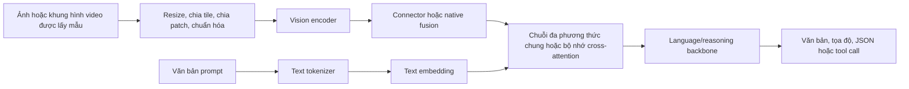
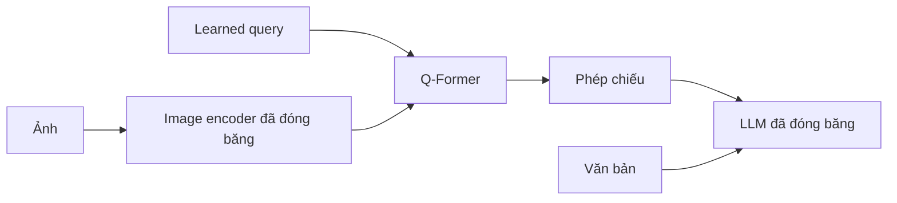
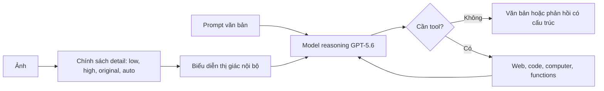
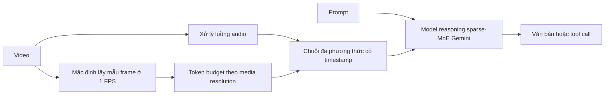
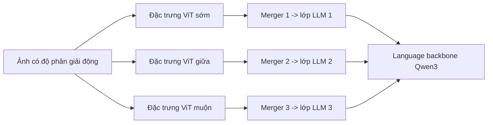
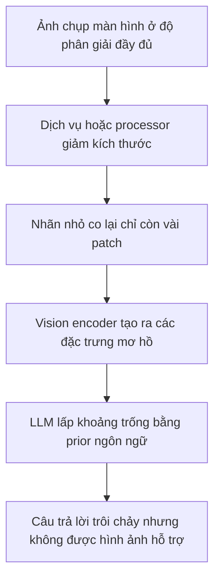
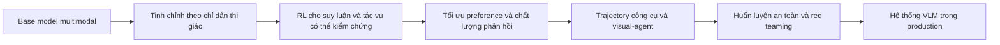
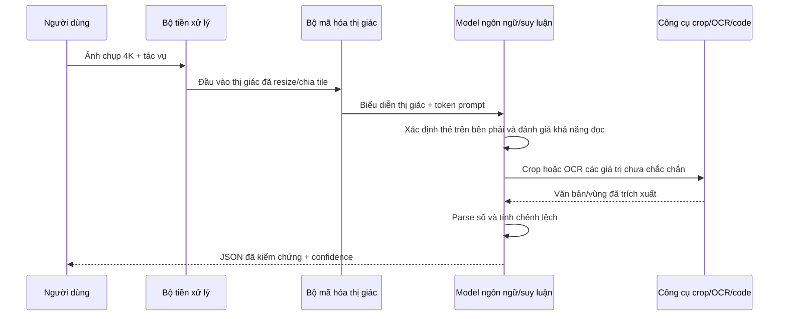

# Các mô hình Thị giác-Ngôn ngữ hiện đại: Kiến trúc, Huấn luyện, Hành vi prompt và Luồng dữ liệu đầu cuối

**Các họ được so sánh:** OpenAI GPT, Anthropic Claude, Google Gemini, Alibaba Qwen-VL và Meta Llama  
**Ngày nghiên cứu:** 2026-07-21  
**Đối tượng:** Kỹ sư phần mềm, kỹ sư ML và nhà nghiên cứu AI

---

## 1. Kết luận tổng quan

Một mô hình thị giác-ngôn ngữ hiện đại không đơn thuần là một LLM được đính kèm tệp ảnh. Đó là một hệ
thống phải chuyển pixel hoặc khung hình video thành một chuỗi hữu hạn các biểu diễn thị giác, căn chỉnh
các biểu diễn đó với ngôn ngữ, bảo toàn thông tin không gian và thời gian, rồi sinh hoặc hành động dựa
trên một kết quả được điều kiện hóa bởi ngôn ngữ.

Phép phân rã cấp cao hữu ích nhất là:

```text
Observed VLM behavior
=
vision preprocessing and sampling
+ visual encoder
+ connector or fusion strategy
+ language/reasoning backbone
+ multimodal pretraining mixture
+ visual instruction and preference post-training
+ tool runtime
+ prompt structure
+ decoding and safety layers
```

Các họ mới nhất đang hội tụ về năng lực sản phẩm nhưng không hội tụ về kiến trúc được công khai:

- **OpenAI GPT-5.6 và Claude 5** thể hiện năng lực hiểu ảnh mạnh cùng khả năng kiểm soát đầu vào chi
  tiết, nhưng không công bố vision encoder, connector, thiết kế attention hoặc topology tham số hiện tại.
- **Gemini 3.x** được xác định rõ là một họ Transformer sparse-MoE đa phương thức nguyên bản, nhưng
  Google vẫn không công bố phần lớn chi tiết ở cấp block và modality encoder.
- **Dòng Qwen** là họ hiện tại dễ khảo sát kỹ thuật nhất trong so sánh này. Qwen3.6 là snapshot VLM
  open-weight mới nhất đã phát hành; Qwen3-VL vẫn là báo cáo kỹ thuật đầy đủ mới nhất về vision stack,
  công bố SigLIP-2 encoder, MLP merger, DeepStack fusion, multimodal RoPE, timestamp video dạng văn bản
  và quy trình huấn luyện nhiều giai đoạn.
- **Llama 4** công bố thiết kế MoE đa phương thức nguyên bản dùng early fusion, vision encoder dựa trên
  MetaCLIP, quy mô huấn luyện và chuỗi post-training, nhưng giao diện được phát hành là image-and-text
  thay vì một native-video API tổng quát.

Khác biệt thực tế giữa các mô hình thường được quyết định trước khi block đầu tiên của language model chạy:

```text
raw pixels/video
-> resize, tile, patch, and sample
-> visual-token budget
-> cross-modal fusion
-> reasoning and tool policy
-> answer
```

Đây là lý do cùng một mô hình có thể thành công với biểu đồ độ phân giải cao đã được crop nhưng thất bại
với ảnh chụp toàn trang ban đầu, hoặc tóm tắt đúng một bài giảng diễn tiến chậm nhưng bỏ lỡ một sự kiện
kéo dài một giây trong video.

---

## 2. Phạm vi và các snapshot hiện tại

Báo cáo này tập trung vào **các VLM sinh nhận bằng chứng ảnh hoặc video và tạo văn bản hoặc tool
call**. Báo cáo không so sánh:

- các mô hình sinh ảnh/video như GPT Image, Gemini Image hoặc Veo;
- các mô hình contrastive embedding thuần túy chỉ dùng cho retrieval;
- các detector chuyên biệt theo tác vụ hoặc hệ thống OCR cổ điển;
- các mô hình vision-language-action trực tiếp xuất lệnh điều khiển robot.

Các hệ thống đó có thể dùng chung encoder hoặc dữ liệu huấn luyện với một VLM, nhưng output contract và
tiêu chí đánh giá của chúng khác nhau.

| Họ                         | Snapshot thực tế được dùng ở đây                                                 | Đầu vào thị giác được chấp nhận trong giao diện công khai đã dẫn nguồn                              | Thành phần nội bộ có thể khảo sát công khai                                                                             |
| -------------------------- | -------------------------------------------------------------------------------- | -------------------------------------------------------------------------------------------------- | ----------------------------------------------------------------------------------------------------------------------- |
| **OpenAI GPT**       | GPT-5.6 Sol/Terra/Luna                                                           | Ảnh; đầu ra văn bản. Các trang model API đánh dấu audio và video là không được hỗ trợ cho các checkpoint này | Kiểm soát resize/token đầu vào và hành vi sản phẩm; thành phần neural nội bộ hiện tại chưa được nêu rõ |
| **Anthropic Claude** | Claude Sonnet 5, với Fable 5/Opus 4.8 là các lựa chọn hiện tại có năng lực cao hơn | Ảnh và PDF; đầu ra văn bản                                                                         | Cách tính patch, các mức độ phân giải, loại dữ liệu huấn luyện, mục tiêu post-training; thành phần neural nội bộ hiện tại chưa được nêu rõ |
| **Google Gemini**    | Gemini 3.5 Flash cho throughput và Gemini 3.1 Pro cho suy luận khó hơn           | Ảnh, video, audio, tài liệu; đầu ra văn bản                                                        | Transformer sparse-MoE đa phương thức nguyên bản ở cấp họ Gemini 3; phần lớn chi tiết chính xác về encoder/router chưa được nêu rõ |
| **Alibaba Qwen**     | Qwen3.6-35B-A3B là open checkpoint mới nhất; Qwen3-VL là báo cáo kỹ thuật VL đầy đủ mới nhất | Ảnh, chuỗi nhiều ảnh, tài liệu và video; đầu ra hướng đến văn bản/tool | Weight và cấu hình LM hybrid của Qwen3.6; vision encoder, merger, fusion, chiến lược vị trí, quy trình huấn luyện và code của Qwen3-VL |
| **Meta Llama**       | Llama 4 Scout và Maverick                                                        | Ảnh và văn bản trong các checkpoint đã phát hành; hỗ trợ nhiều ảnh có giới hạn và cần được kiểm chứng | Weight, quy mô MoE, early fusion, họ vision encoder, ước lượng training token và chuỗi post-training |

Các thông tin sản phẩm hiện tại đến từ [danh mục model OpenAI](https://developers.openai.com/api/docs/models),
[tổng quan model Claude](https://platform.claude.com/docs/en/about-claude/models/overview),
[model card Gemini 3.5 Flash](https://deepmind.google/models/model-cards/gemini-3-5-flash/),
[model card Qwen3.6](https://huggingface.co/Qwen/Qwen3.6-35B-A3B) và
[báo cáo ra mắt Llama 4](https://ai.meta.com/blog/llama-4-multimodal-intelligence/).

Qwen3.7-Max và Meta Muse Spark là các dòng sản phẩm proprietary mới hơn, nhưng tài liệu công khai của
chúng không cung cấp đặc tả vision stack hiện tại có thể so sánh; báo cáo này giữ Qwen3.6/Qwen3-VL và
Llama 4 làm các đối tượng kỹ thuật có thể khảo sát.

### Nhãn mức độ công bố

- **Đã xác minh:** được ghi trực tiếp trong paper, model card, repository hoặc hướng dẫn API chính thức.
- **Cấp họ:** được ghi cho một thành viên trước đó hoặc nền tảng của họ, không đảm bảo là không
  thay đổi trong checkpoint mới nhất.
- **Suy luận:** diễn giải kỹ thuật hợp lý, không phải tuyên bố của nhà cung cấp.
- **Chưa rõ:** bằng chứng công khai chưa đủ.

---

# Part I — Nền tảng và kiến trúc chung

## 3. Điều gì khiến một mô hình trở thành VLM?

Một LLM autoregressive chỉ dùng văn bản ánh xạ token ID sang embedding và dự đoán token tiếp theo. Một
VLM sinh còn phải ánh xạ đầu vào thị giác thành các biểu diễn mà language backbone có thể dùng làm điều
kiện.



Thuật ngữ **visual token** mang nhiều nghĩa. Tùy hệ thống, nó có thể là:

1. một embedding patch ảnh thô;
2. một patch đã mã hóa sau vision Transformer;
3. đầu ra query hoặc resampler đã nén;
4. một vector đã chiếu được đặt trong chuỗi embedding của LLM;
5. một đơn vị tính phí không tương ứng một-một với neural token nội bộ.

Vì vậy, không nên coi công thức chi phí token của nhà cung cấp là sơ đồ kiến trúc.

## 4. Bốn mẫu fusion thường gặp

### 4.1 Chiếu đặc trưng thị giác vào không gian token của LLM

Công thức mở kinh điển là:

```text
ViT/CLIP features -> linear or MLP projector -> visual tokens -> decoder-only LLM
```

LLaVA cho thấy một phép chiếu đơn giản kết hợp visual instruction tuning có thể hiệu quả. LLaVA 1.5
thay linear connector đơn bằng một MLP, đồng thời dùng độ phân giải CLIP mạnh hơn và dữ liệu định hướng
tác vụ nhiều hơn. Xem [paper Visual Instruction Tuning](https://arxiv.org/abs/2304.08485) gốc và
[paper baseline LLaVA 1.5](https://arxiv.org/abs/2310.03744).

Thiết kế này đơn giản và dễ fine-tune, nhưng mỗi visual token được giữ lại đều tiêu tốn context và tài
nguyên tính toán attention.

### 4.2 Nén thông tin thị giác thông qua các learned query

BLIP-2 đóng băng image encoder và LLM, đồng thời huấn luyện một **Q-Former** gọn nhẹ theo hai giai
đoạn: học biểu diễn vision-language, sau đó học sinh vision-to-language. Phương pháp này hiệu quả về
tham số nhưng chủ động tạo ra một nút thắt thông tin. Xem
[paper BLIP-2](https://arxiv.org/abs/2301.12597).



### 4.3 Chèn gated cross-attention vào language model

Flamingo dùng resampler kiểu Perceiver và gated cross-attention để một language model đã pretrain có
thể attend vào ảnh, video và văn bản xen kẽ tùy ý. Cách này tránh việc chỉ nối toàn bộ đặc trưng patch
thô vào luồng văn bản và hỗ trợ các ví dụ few-shot đa phương thức. Xem
[paper Flamingo](https://arxiv.org/abs/2204.14198).

### 4.4 Native fusion hoặc early fusion

Trong thiết kế early fusion, biểu diễn văn bản và thị giác đi vào một backbone dùng chung trong quá
trình huấn luyện chung ở quy mô lớn. Điều này không có nghĩa pixel thô và ký tự văn bản dùng tokenizer
giống nhau; nó có nghĩa mô hình được tối ưu như một hệ thống đa phương thức duy nhất thay vì chỉ ghép
hai expert đã đóng băng ở cuối.

Meta mô tả rõ Llama 4 là early fusion, còn Google mô tả Gemini là đa phương thức nguyên bản. Qwen3-VL
có ranh giới encoder-merger-LLM dễ nhận biết nhưng mở đóng băng mọi module sau giai đoạn căn chỉnh ban
đầu, vì vậy quá trình pretraining về sau là đa phương thức đầu cuối.

## 5. So sánh kiến trúc

| Hệ thống con     | GPT-5.6                                                         | Claude 5                                                                         | Gemini 3.x                                                  | Qwen                                                                      | Llama 4                                                                                             |
| ---------------- | --------------------------------------------------------------- | -------------------------------------------------------------------------------- | ----------------------------------------------------------- | ------------------------------------------------------------------------- | --------------------------------------------------------------------------------------------------- |
| Bộ mã hóa thị giác | **Chưa rõ**                                             | **Chưa rõ**                                                                | **Chưa rõ** công khai đối với các model hiện tại      | Qwen3.6 xác nhận có vision encoder nhưng không mô tả cụ thể; Qwen3-VL dùng SigLIP-2 được huấn luyện liên tục | Encoder dựa trên MetaCLIP được huấn luyện cùng một Llama đóng băng trong quá trình thích nghi encoder |
| Bộ nối/fusion    | **Chưa rõ**                                               | **Chưa rõ**                                                                | Đa phương thức nguyên bản; fusion chính xác chưa được nêu rõ | Chi tiết Qwen3.6 chưa được ghi đầy đủ; Qwen3-VL dùng MLP merger hai lớp cùng DeepStack injection | Early fusion các token thị giác và văn bản vào backbone dùng chung |
| Lõi ngôn ngữ     | Topology block hiện tại **chưa rõ**                       | Topology block hiện tại **chưa rõ**                                         | Transformer sparse-MoE cho họ Gemini 3 Pro                  | Qwen3.6 kết hợp Gated DeltaNet/full attention với MoE; Qwen3-VL dùng decoder Qwen3 dense hoặc MoE | Transformer dense/MoE xen kẽ; Maverick có 17B tham số active, tổng cộng 400B tham số |
| Vị trí không gian | Kích thước đầu vào được công bố; phương pháp neural position **chưa rõ** | Cách tính visual patch 28x28 được công bố; phương pháp neural position **chưa rõ** | Phương pháp neural position **chưa rõ**               | Qwen3.6 công khai cấu hình MRoPE xen kẽ; Qwen3-VL ghi 2D RoPE cùng MRoPE temporal/height/width xen kẽ | Họ này dùng RoPE/iRoPE; đường đi vị trí thị giác chi tiết chưa được công bố đầy đủ |
| Xử lý video      | Checkpoint GPT-5.6 API không nhận video                         | Không có native video block trong hướng dẫn API đã dẫn; người dùng có thể cung cấp các frame được trích xuất | Lấy mẫu luồng thị giác và audio; File API mặc định 1 FPS | Lấy mẫu frame động cùng token timestamp dạng văn bản | Được huấn luyện trên ảnh và ảnh tĩnh từ video frame; giao diện phát hành là multi-image thay vì native video |
| Weight mở        | Không                                                           | Không                                                                            | Không đối với Gemini                                        | Có, Apache 2.0                                                          | Có, Llama Community License                                                                         |

Kết luận chính không phải là các model đóng có kiến trúc đơn giản hơn. Mà là **không thể so sánh ở
cấp kiến trúc từ bằng chứng công khai** đối với các phiên bản hiện tại của chúng.

---

## 6. Hệ thống thị giác OpenAI GPT-5.6

### Hành vi công khai đã được xác minh

Tất cả các tier GPT-5.6 hiện tại đều nhận đầu vào văn bản và ảnh, đồng thời tạo văn bản. Các model cung
cấp context window 1.05M và nhiều mức reasoning, trong khi các trang model hiện tại đánh dấu đầu vào
audio và video là không được hỗ trợ. Xem [danh mục model OpenAI](https://developers.openai.com/api/docs/models)
và [trang model GPT-5.6 Terra](https://developers.openai.com/api/docs/models/gpt-5.6-terra).

Pipeline ảnh cung cấp bốn thiết lập detail:

- `low`: biểu diễn độ phân giải thấp 512x512;
- `high`: xử lý độ trung thực cao tiêu chuẩn;
- `original`: bảo toàn kích thước đầu vào cho GPT-5.6 thay vì resize theo patch budget;
- `auto`: trên GPT-5.6 hiện hoạt động giống `original`.

Các quy tắc này và tác động của chúng đến chi phí được ghi trong
[hướng dẫn ảnh và thị giác của OpenAI](https://developers.openai.com/api/docs/guides/images-vision).



### Những gì chưa được công khai

OpenAI không cho biết GPT-5.6 có dùng một ViT riêng, resampler, các lớp cross-attention, early fusion,
MoE routing hay một multimodal positional encoding cụ thể hay không. GPT-4o từng được mô tả rõ là một
model được huấn luyện đầu cuối trên văn bản, thị giác và audio, nhưng tuyên bố năm 2024 đó là **bằng
chứng lịch sử của họ model, không phải bằng chứng về thành phần nội bộ của GPT-5.6**. Xem
[Hello GPT-4o](https://openai.com/index/hello-gpt-4o/).

### Hành vi prompt trong thực tế

- Chọn `original` cho tài liệu dày đặc, phần tử UI nhỏ, biểu đồ và localization khi độ chính xác xứng
  đáng với lượng token và độ trễ tăng thêm.
- Crop vùng liên quan khi ảnh đầy đủ chứa nhiều khu vực không liên quan.
- Yêu cầu bằng chứng gắn với các vùng nhìn thấy được trước khi yêu cầu kết luận.
- Không dựa vào tọa độ bằng ngôn ngữ tự nhiên để thay thế detector nếu chưa đánh giá ở cấp ứng dụng.

Trong hướng dẫn ảnh, OpenAI liệt kê rõ chữ nhỏ, xoay ảnh, localization không gian chính xác, đếm,
panorama và mô tả không chính xác trong số các hạn chế hiện tại.

---

## 7. Hệ thống thị giác Claude 5

### Hành vi công khai đã được xác minh

Tất cả model Claude hiện tại đều nhận đầu vào văn bản và ảnh, đồng thời trả về văn bản. Claude Sonnet 5
cung cấp context window 1M, mặc định dùng adaptive thinking và có giới hạn đầu ra đồng bộ 128K.
Anthropic không công bố vision encoder hoặc kiến trúc fusion hiện tại. Xem
[tổng quan model Claude](https://platform.claude.com/docs/en/about-claude/models/overview) và
[ghi chú chuyển đổi Sonnet 5](https://platform.claude.com/docs/en/about-claude/models/whats-new-sonnet-5).

Tài liệu API của Claude nêu rõ một cách khác thường về cách tính visual token:

```text
visual_tokens = ceil(width / 28) * ceil(height / 28)
```

Ảnh vượt quá giới hạn cạnh dài hoặc visual token của model sẽ bị downscale. Các model độ phân giải cao
hiện tại, bao gồm Sonnet 5, hỗ trợ cạnh dài tối đa 2.576 pixel và 4.784 visual token. Xem
[hướng dẫn thị giác Claude](https://platform.claude.com/docs/en/build-with-claude/vision).

### Hành vi prompt

Anthropic khuyến nghị đặt ảnh trước truy vấn văn bản. Với nhiều ảnh, hãy gắn nhãn rõ ràng (`Image 1`,
`Image 2`, v.v.) để các câu hỏi sau có tham chiếu ổn định. GIF động không được xử lý như video; chỉ
frame đầu tiên được dùng.

Sonnet 5 cũng thay đổi hành vi phi thị giác có liên quan đến workload VLM:

- adaptive thinking được bật mặc định;
- manual thinking-token budget bị loại bỏ;
- `temperature`, `top_p` và `top_k` khác mặc định bị từ chối;
- một text tokenizer mới tạo ra nhiều hơn khoảng 30% text token so với Sonnet 4.6 cho nội dung tương
  đương, tùy đầu vào.

### Huấn luyện và sử dụng tool

[System card Claude Sonnet 5](https://www.anthropic.com/system-cards) cho biết quá trình huấn luyện dùng
một hỗn hợp proprietary gồm thông tin internet công khai, các dataset công khai và riêng tư cùng dữ
liệu synthetic, tiếp theo là post-training được căn chỉnh theo hiến pháp của Claude. Tài liệu không
công bố tỷ lệ modality hoặc kiến trúc neural.

System card này cũng báo cáo mức cải thiện lớn nhờ môi trường Python và tool crop ảnh trên các đánh giá
tài liệu, biểu đồ và CAD. Điều này củng cố một kết luận hệ thống quan trọng: vòng lặp crop/tool độ phân
giải cao có thể quan trọng hơn một forward pass bổ sung trên ảnh chưa chỉnh sửa.

---

## 8. Gemini 3.x: đa phương thức nguyên bản cùng khả năng kiểm soát media rõ ràng

### Kiến trúc và các modality

Gemini 3.5 Flash nhận văn bản, ảnh, audio và video với context window 1M token, đồng thời trả về tối đa
64K text token. Gemini 3.1 Pro cung cấp cùng các modality đầu vào cho tác vụ reasoning khó hơn. Model
card của chúng kế thừa các chi tiết cốt lõi từ Gemini 3 Flash/Pro.

[Model card Gemini 3 Pro](https://storage.googleapis.com/deepmind-media/Model-Cards/Gemini-3-Pro-Model-Card.pdf)
nền tảng mô tả một **Transformer sparse mixture-of-experts hỗ trợ đa phương thức nguyên bản**. Tài liệu
công bố lớp kiến trúc nhưng không công bố số lượng expert, vision/audio encoder, kích thước head hoặc
các lớp fusion.

### Tiền xử lý ảnh

[Hướng dẫn hiểu ảnh Gemini](https://ai.google.dev/gemini-api/docs/image-understanding) hiện tại cho biết:

- ảnh có cả hai chiều không lớn hơn 384 pixel tốn 258 token;
- ảnh lớn hơn được chia thành các vùng 768x768, mỗi vùng tốn 258 token;
- Gemini 3 cung cấp `media_resolution` để đánh đổi chi tiết nhỏ lấy token và độ trễ;
- với một ảnh duy nhất, đặt prompt văn bản trước ảnh trong mảng đầu vào Interactions API;
- xoay ảnh đúng chiều và tránh ảnh mờ.

### Tiền xử lý video

Quy trình xử lý File API hiện tại của Gemini đủ cụ thể để phân tích các failure mode:

- lấy mẫu thị giác mặc định: 1 frame mỗi giây;
- chi phí thị giác mặc định: 258 token trên mỗi frame được lấy mẫu, hoặc 66 ở media resolution thấp;
- audio: khoảng 32 token mỗi giây;
- tổng cộng: xấp xỉ 300 token/giây ở độ phân giải mặc định hoặc 100 token/giây ở độ phân giải thấp;
- model có context window 1M hỗ trợ khoảng một giờ ở độ phân giải mặc định hoặc ba giờ ở độ phân giải
  thấp.

Google cảnh báo rằng 1 FPS có thể bỏ lỡ hành động nhanh và khuyến nghị đặt video trước prompt văn bản.
Xem [hướng dẫn hiểu video Gemini](https://ai.google.dev/gemini-api/docs/video-understanding).



### Huấn luyện

Model card Gemini 3 Pro liệt kê tài liệu web công khai, văn bản, code, ảnh, audio, video, dữ liệu được
cấp phép, dữ liệu người dùng được cho phép và dữ liệu synthetic trong pretraining. Post-training gồm
instruction tuning, dữ liệu reinforcement learning, dữ liệu human preference và dữ liệu
reasoning/problem-solving nhiều bước. Quy trình lọc gồm deduplication, xử lý `robots.txt`, lọc an toàn
và lọc chất lượng.

Tỷ lệ modality, số lượng token, cấu hình routing và curriculum chính xác vẫn unknown.

---

## 9. Qwen3.6 và Qwen3-VL: checkpoint hiện tại so với báo cáo thị giác đầy đủ

Qwen3.6-35B-A3B là checkpoint Qwen open-weight mới nhất đã phát hành và được xác minh trong nghiên cứu
này. Model card chính thức mô tả một causal language model có vision encoder, tổng cộng 35B tham số với
3B tham số active, 40 lớp và một bố cục language backbone lặp lại:

```text
3 x (Gated DeltaNet -> MoE)
-> 1 x (gated full attention -> MoE)
(repeat 10 times)
```

Model có 256 expert, kích hoạt tám routed expert cùng một shared expert, hỗ trợ context nguyên bản
262.144 token, nhận đầu vào ảnh và video, đồng thời mặc định bật thinking. Model card đã công bố không
cung cấp mô tả đầy đủ tương đương cho vision tower và đường fusion. Xem
[model card Qwen3.6-35B-A3B](https://huggingface.co/Qwen/Qwen3.6-35B-A3B).

Đối với chi tiết vision stack còn thiếu đó, Qwen3-VL là báo cáo kỹ thuật đầy đủ mới nhất và là nguồn
phù hợp cho kiến trúc cùng curriculum bên dưới. Không được ngầm khẳng định rằng các chi tiết này không
thay đổi trong Qwen3.6.

Qwen3-VL dùng ba module chính:

```text
SigLIP-2 vision encoder
-> two-layer MLP vision-language merger
-> Qwen3 dense or MoE language backbone
```

Flagship Qwen3-VL-235B-A22B có tổng cộng 235B tham số và 22B tham số active trên mỗi token. Các biến thể
dense 2B, 4B, 8B và 32B cùng biến thể MoE 30B-A3B cung cấp các điểm triển khai nhỏ hơn. Weight được cấp
phép theo Apache-2.0. Xem [báo cáo kỹ thuật Qwen3-VL](https://arxiv.org/abs/2511.21631) và
[repository chính thức](https://github.com/QwenLM/Qwen3-VL).

### 9.1 Vision encoder và merger

- Vision encoder khởi đầu từ SigLIP-2 và được huấn luyện liên tục ở các độ phân giải nguyên bản động.
- Nó dùng 2D RoPE cùng absolute position embedding được nội suy.
- Một MLP hai lớp nén mỗi nhóm đặc trưng thị giác 2x2 thành một token trong hidden dimension của LLM.
- Encoder mặc định cho model lớn là SigLIP2-SO-400M; các model 2B/4B nhỏ hơn dùng SigLIP2-Large.

### 9.2 DeepStack

Thay vì chỉ truyền lớp ViT cuối cùng cho language model, Qwen3-VL chọn ba cấp đặc trưng thị giác. Các
merger chuyên biệt chiếu chúng và cộng chúng vào hidden state của ba lớp LLM đầu tiên.



Ablation pretraining trong paper cải thiện mức trung bình 12 tác vụ được báo cáo từ 74.7 lên 76.0 khi
dùng DeepStack. Đây là bằng chứng cho thiết lập huấn luyện này, không phải đảm bảo cho mọi tác vụ
downstream.

### 9.3 MRoPE xen kẽ và timestamp video

MRoPE trước đây chia các chiều embedding thành các dải temporal, height và width, điều này có thể khiến
mỗi trục có một phổ tần số khác nhau. Qwen3-VL xen kẽ các trục đó giữa các chiều để cả ba đều bao phủ
tần số thấp và cao.

Với video, Qwen3-VL đặt trước các temporal patch timestamp dạng văn bản như `<3.0 seconds>` thay vì chỉ
mã hóa thời gian tuyệt đối thông qua temporal position ID lớn. Điều này làm context dài hơn một chút
nhưng giúp language backbone đọc trực tiếp được thời gian.

### 9.4 Hành vi inference trong thực tế

- Dùng chính xác chat template và processor chính thức; vị trí image placeholder là một phần của model
  contract.
- Chủ động đặt resolution budget hoặc frame budget. Ảnh lớn hơn và nhiều frame hơn làm tăng cả chi phí
  prefill lẫn áp lực KV-cache.
- Với Qwen3-VL, dùng **Instruct** cho câu trả lời trực tiếp và **Thinking** cho visual reasoning khó hơn.
  Với Qwen3.6, thinking được bật mặc định và phải tắt bằng tham số API/template; soft switch `/think`
  và `/nothink` cũ không được hỗ trợ chính thức.
- Ví dụ vLLM của Qwen3.6 mặc định dùng 2 FPS cho video và cung cấp frame rate qua tham số processor. Đây
  là mặc định serving, không phải thuộc tính ở thời điểm huấn luyện hay backend contract phổ quát.
- Ghi lại sampling parameter của Qwen3.6 và việc historical thinking có được bảo toàn hay không; cả hai
  đều có thể thay đổi độ trễ, mức sử dụng token và hành vi nhìn thấy được.
- Model card chính thức khuyến nghị FlashAttention-2 cho workload nhiều ảnh và video.

Xem [model card Qwen3-VL-235B-A22B-Thinking](https://huggingface.co/Qwen/Qwen3-VL-235B-A22B-Thinking)
chính thức.

---

## 10. Llama 4: early fusion với trọng số mở

Meta mô tả Llama 4 Scout và Maverick là các model Llama đa phương thức nguyên bản đầu tiên và họ MoE
đầu tiên của hãng.

### Kiến trúc

- Token thị giác và văn bản dùng **early fusion** trong một backbone dùng chung.
- Vision encoder dựa trên MetaCLIP và được thích nghi khi ghép với một model Llama đã đóng băng.
- Maverick xen kẽ các lớp dense và MoE, với 128 routed expert cùng một shared expert; mỗi token đi đến
  shared expert và một routed expert.
- Maverick có 17B tham số active và tổng cộng khoảng 400B tham số; Scout có 17B tham số active và tổng
  cộng khoảng 109B tham số.
- Scout dùng thiết kế long-context liên quan đến iRoPE với các lớp attention xen kẽ.

Các chi tiết này được ghi trong
[báo cáo ra mắt Llama 4](https://ai.meta.com/blog/llama-4-multimodal-intelligence/) của Meta.

### Ranh giới huấn luyện và giao diện

Meta báo cáo khoảng 40T multimodal training token cho Scout và 22T cho Maverick, lấy từ dữ liệu công
khai, dữ liệu được cấp phép và dữ liệu sản phẩm/dịch vụ của Meta. Hãng cũng mô tả việc huấn luyện trên
dữ liệu văn bản, ảnh và video, cùng một chuỗi post-training gồm SFT gọn nhẹ, multimodal online RL và
DPO gọn nhẹ.

Tuy nhiên, không nên mô tả bản phát hành như một native-video API không giới hạn. Meta cho biết các
model được huấn luyện trên ảnh và ảnh tĩnh từ video frame, đồng thời hỗ trợ multi-image reasoning. Model
card Maverick chính thức cho biết khả năng hiểu ảnh đã được kiểm thử với tối đa năm ảnh đầu vào; sử dụng
vượt ranh giới đó cần được kiểm chứng riêng cho ứng dụng. Xem
[model card Maverick](https://huggingface.co/meta-llama/Llama-4-Maverick-17B-128E).

### Hành vi prompt trong thực tế

- Dùng processor và chat template chính thức để image marker căn chỉnh với đặc trưng đã mã hóa.
- Gắn nhãn rõ ràng cho nhiều ảnh và nêu tác vụ là so sánh, sắp xếp theo thời gian hay phân tích độc lập.
- Xem an toàn, tool, retrieval và xử lý prompt injection là trách nhiệm của bên triển khai; open weight
  thô không tái tạo runtime của một sản phẩm đóng.

---

# Part II — Token hóa hình ảnh và hành vi prompt

## 11. Độ phân giải là một quyết định về tài nguyên tính toán và thông tin

Nút thắt cổ chai về thị giác không chỉ là số pixel đầu vào. Đó còn là số đặc trưng thị giác còn giữ
được sau khi đổi kích thước, chia ô, chia patch, nén bằng encoder và nén bằng connector.

| Hệ thống | Cách tính đầu vào được công khai                                                                 | Hệ quả kỹ thuật chính                                                                                              |
| -------- | ------------------------------------------------------------------------------------------------ | ----------------------------------------------------------------------------------------------------------------- |
| GPT-5.6  | `low`, `high`, `original`, `auto`; `original` giữ nguyên kích thước                    | Mức chi tiết `original` có thể cải thiện các tác vụ dày đặc/cục bộ nhưng có chi phí đầu vào cao hơn không có giới hạn so với các chế độ đã đổi kích thước |
| Claude 5 | Các patch thị giác 28x28 pixel, bị giới hạn theo bậc độ phân giải                              | Chi phí có thể dự đoán; ảnh lớn bị giảm kích thước, vì vậy hãy crop trước khi tải lên nếu chi tiết nhỏ quan trọng |
| Gemini 3 | Cách xử lý cơ sở/theo ô ở mức 258 token và `media_resolution`                                  | Kiểm soát rõ chất lượng/độ trễ; chỉ nên dành độ phân giải cao cho OCR, biểu đồ và vật thể nhỏ                     |
| Qwen     | Qwen3.6 cung cấp ngân sách processor/frame có thể cấu hình; Qwen3-VL mô tả độ phân giải động và nén đặc trưng 2x2 | Chủ triển khai kiểm soát bộ nhớ/độ trễ nhưng có thể vô tình loại bỏ chi tiết cần thiết nếu đặt giới hạn quá mạnh |
| Llama 4  | Việc chia ô/mã hóa phụ thuộc processor; hướng dẫn phát hành công khai ít rõ ràng hơn Claude/Gemini | Kiểm tra chính xác cấu hình processor và đo số token thay vì giả định một số lượng patch chung                  |

### Một chuỗi lỗi thường gặp



Suy luận thêm sau khi chi tiết đã mất không thể khôi phục các pixel bị mất.

## 12. Ma trận điều chỉnh prompt

| Đặc tính tác vụ          | Chiến lược prompt/đầu vào tốt hơn                                                                                | Lý do                                                                                  |
| ------------------------ | ---------------------------------------------------------------------------------------------------------------- | -------------------------------------------------------------------------------------- |
| Biểu đồ hoặc tài liệu dày đặc | Crop các vùng liên quan, giữ mức chi tiết `high`/`original`, yêu cầu trích xuất bằng chứng trước             | Giảm cạnh tranh thị giác và giúp dễ phát hiện suy luận không có căn cứ                  |
| Nhiều ảnh                | Gắn nhãn từng ảnh và xác định các trục so sánh                                                                   | Ngăn tham chiếu mơ hồ                                                                  |
| Đếm vật thể              | Yêu cầu kiểm kê theo từng vùng rồi tính tổng; đối chiếu bằng detector cho trường hợp rủi ro cao                  | VLM sinh có thể ước lượng thay vì liệt kê                                               |
| Grounding không gian     | Yêu cầu định dạng tọa độ có cấu trúc và xác định thứ tự/phạm vi tọa độ                                           | Vị trí bằng ngôn ngữ tự nhiên có tính mơ hồ; các nhà cung cấp dùng quy ước chuẩn hóa khác nhau |
| Video dài                | Nêu timestamp và độ chi tiết sự kiện cần có; tăng lấy mẫu quanh các đoạn diễn ra nhanh                           | Cách lấy mẫu frame mặc định có thể bỏ lỡ sự kiện ngắn                                  |
| GUI agent                | Dùng độ phân giải cao, giữ tọa độ, cho phép crop/zoom và yêu cầu xác nhận trước khi hành động                    | Độ chính xác khi click phụ thuộc vào chi tiết không gian tinh và chính sách runtime     |
| OCR                      | Xoay đúng chiều, tránh nhòe, dùng crop/độ phân giải cao và yêu cầu chép nguyên văn trước khi diễn giải           | Nếu không, lỗi OCR và lỗi suy luận sẽ bị trộn lẫn                                       |
| Ảnh khoa học/y tế        | Yêu cầu model chỉ ra bằng chứng nhìn thấy và mức độ bất định; dùng chuyên gia lĩnh vực để ra quyết định          | Tài liệu VLM tổng quát loại trừ rõ một số dạng diễn giải y tế chuyên biệt               |

### Hướng dẫn thứ tự riêng cho từng họ model

- **Claude:** ảnh trước văn bản.
- **Gemini Interactions API:** văn bản trước một ảnh đơn; video trước prompt của nó theo mục thực hành
  tốt nhất cho video hiện tại.
- **Qwen/Llama:** dùng processor/chat template chính thức của model thay vì giả định thứ tự nội dung
  không phụ thuộc cách triển khai.
- **OpenAI:** API hỗ trợ các content block xen kẽ; việc chọn mức chi tiết và tham chiếu không mơ hồ
  quan trọng hơn việc sao chép quy ước thứ tự của nhà cung cấp khác.

## 13. Vì sao thị giác có công cụ hỗ trợ đang trở thành tiêu chuẩn

VLM có thể dùng công cụ để bù cho khả năng cảm nhận cố định:

```text
kiểm tra toàn bộ ảnh
-> xác định vùng chưa chắc chắn
-> crop/zoom
-> OCR hoặc chạy code
-> so sánh các giá trị đã trích xuất
-> trả lời kèm bằng chứng
```

Điều này không tương đương với một vision encoder lớn hơn. Đây là vòng lặp cảm nhận ở test-time. System
card của Claude Sonnet 5 báo cáo mức cải thiện nhất quán khi dùng Python cùng thao tác crop ảnh trên các
tác vụ tài liệu, biểu đồ và CAD. GPT-5.6 và Gemini cung cấp công cụ computer/code trong runtime, còn
Qwen3-VL post-train rõ ràng trên các trajectory của visual-agent và việc sử dụng công cụ.

---

# Part III — Pretraining và post-training

## 14. Pretraining VLM phải học những gì

Chỉ pretraining trên văn bản có thể cung cấp ngôn ngữ, các mẫu suy luận và tri thức thế giới, nhưng
không dạy model vùng pixel nào làm căn cứ cho từ nào. Việc huấn luyện VLM phải bổ sung ít nhất bốn năng lực:

1. **biểu diễn thị giác:** giữ được vật thể, văn bản, bố cục, thuộc tính và quan hệ;
2. **căn chỉnh modality:** ánh xạ bằng chứng thị giác vào một không gian mà language model có thể sử dụng;
3. **suy luận kết hợp:** kết hợp bằng chứng ảnh/video với chỉ dẫn và tri thức có trước;
4. **grounding đầu ra:** tạo câu trả lời, tọa độ, timestamp hoặc thao tác công cụ vẫn gắn với đầu vào.

Các loại dữ liệu phổ biến gồm:

- các cặp ảnh-caption;
- trang web và tài liệu xen kẽ;
- dữ liệu OCR và bố cục tài liệu;
- các bài toán VQA và suy luận thị giác;
- box, point, mask và referring expression;
- chuỗi nhiều ảnh và video;
- dữ liệu chỉ có văn bản để giữ năng lực ngôn ngữ;
- trajectory GUI và sử dụng công cụ;
- dữ liệu về preference, an toàn và từ chối.

Nghiên cứu VILA phát hiện rằng với một số đặc tính VLM, dữ liệu xen kẽ hữu ích hơn so với chỉ dùng các
cặp ảnh-caption, và việc trộn lại các chỉ dẫn chỉ có văn bản có thể bảo vệ, thậm chí cải thiện năng lực
trong quá trình multimodal tuning. Nghiên cứu cũng phát hiện rằng trong thiết lập của họ, việc đóng băng
LLM làm hạn chế in-context learning. Xem
[VILA: On Pre-training for Visual Language Models](https://arxiv.org/abs/2312.07533). Đây là các kết
quả có kiểm soát đối với VILA, không phải quy luật phổ quát.

## 15. So sánh huấn luyện

| Họ model | Bằng chứng pretraining công khai                                                                                                                                   | Bằng chứng multimodal post-training công khai                                                    | Các ẩn số lớn                                                                       |
| -------- | ------------------------------------------------------------------------------------------------------------------------------------------------------------------ | ----------------------------------------------------------------------------------------------- | ---------------------------------------------------------------------------------- |
| GPT      | GPT-4V dùng dữ liệu văn bản/ảnh từ internet và được cấp phép; GPT-4o được huấn luyện end-to-end trên văn bản, thị giác, âm thanh. Các loại dữ liệu của GPT-5.6 được công bố ở cấp hệ thống | Đã có tài liệu về RL/suy luận, an toàn và đánh giá triển khai multimodal                         | Tỷ lệ modality hiện tại, encoder/fusion, objective, quy mô                          |
| Claude   | Internet công khai, dataset công khai/riêng tư, dữ liệu tổng hợp; khử trùng lặp/phân loại                                                                           | Post-training căn chỉnh theo Constitution, tối ưu preference, red teaming; đánh giá công cụ multimodal | Dữ liệu riêng cho thị giác, objective, kiến trúc, tỷ lệ modality                    |
| Gemini   | Tài liệu web, văn bản, code, ảnh, âm thanh, video, dữ liệu được cấp phép/người dùng/tổng hợp; huấn luyện multimodal native                                           | Instruction tuning, dữ liệu preference của con người, RL gồm cả suy luận nhiều bước              | Số token chính xác, tỷ lệ modality, chi tiết expert/router và encoder               |
| Qwen     | Qwen3-VL công bố quy trình bốn giai đoạn từ alignment đến 256K với khoảng hơn 2T token multimodal/văn bản sau giai đoạn alignment 67B token | Qwen3-VL mô tả SFT, distillation strong-to-weak, reasoning RL, general RL và visual-agent RL tích hợp công cụ | Curriculum VL đầy đủ của Qwen3.6 và quan hệ chính xác với Qwen3-VL chưa được mô tả đầy đủ |
| Llama 4  | Báo cáo 22T/40T token multimodal, early fusion, dữ liệu văn bản/ảnh/video, 200 ngôn ngữ pretraining                                                                 | SFT gọn nhẹ -> multimodal online RL -> DPO gọn nhẹ                                               | Thành phần dataset ở cấp sample và chi tiết triển khai fusion/encoder đầy đủ        |

## 16. Quy trình pretraining bốn giai đoạn của Qwen3-VL

Qwen3-VL cung cấp ví dụ rõ ràng nhất về một curriculum VLM hiện đại theo từng giai đoạn:

| Giai đoạn | Module có thể huấn luyện                   | Ngân sách xấp xỉ | Độ dài chuỗi | Mục đích                                               |
| ----- | ---------------------------------------------- | -----------------: | --------------: | --------------------------------------------------- |
| S0    | Chỉ MLP merger; vision encoder và LLM đóng băng |         67B token |           8,192 | Alignment vision-language ban đầu                     |
| S1    | Tất cả module                                    |         ~1T token |           8,192 | Pretraining multimodal rộng và duy trì năng lực văn bản |
| S2    | Tất cả module                                    |         ~1T token |          32,768 | Thêm video, dữ liệu agent và học long-context          |
| S3    | Tất cả module                                    |        100B token |         262,144 | Thích nghi với tài liệu siêu dài và video              |

Các chi tiết quan trọng trong báo cáo kỹ thuật gồm:

- 30M sample OCR nội bộ cùng dữ liệu OCR tổng hợp đa ngôn ngữ;
- hàng triệu tài liệu/PDF được parse có nhận biết bố cục;
- dữ liệu grounding với box và point được chuẩn hóa về `[0, 1000]`;
- dữ liệu coding multimodal như screenshot-to-HTML và diagram-to-code;
- lấy mẫu frame video thích ứng theo độ dài;
- dữ liệu STEM thị giác và hàng triệu sample suy luận đã lọc;
- trajectory GUI, function-calling và tìm kiếm.

Điều này giải thích vì sao không thể chỉ quy hành vi của Qwen3-VL cho SigLIP-2 hoặc DeepStack. Quá
trình xây dựng dữ liệu và curriculum bao phủ chính xác các contract đầu ra mà model được kỳ vọng tạo ra.

## 17. Post-training thay đổi những gì người dùng cảm nhận

Một pipeline multimodal post-training tổng quát là:



Post-training kiểm soát việc model có:

- chép lại trước khi diễn giải;
- thừa nhận văn bản không đọc được;
- xuất box đã chuẩn hóa theo schema được yêu cầu;
- dùng công cụ crop hoặc OCR;
- kiên trì thực hiện một tác vụ thị giác nhiều bước;
- từ chối yêu cầu dựa trên ảnh không an toàn;
- đưa ra câu trả lời ngắn gọn hoặc một lập luận thị giác dài.

Vision encoder có thể quyết định bằng chứng nào sẵn có, nhưng post-training quyết định cách bằng chứng
đó được lựa chọn, diễn đạt thành lời, kiểm tra và chuyển thành hành động.

---

# Part IV — Luồng dữ liệu đầu cuối

## 18. Tác vụ ví dụ chung

Giả sử đầu vào là ảnh chụp màn hình dashboard 4K và yêu cầu là:

```text
Đọc giá trị doanh thu trong thẻ phía trên bên phải, so sánh với giá trị của tháng trước,
và trả về JSON gồm current, previous, difference và confidence.
```

Luồng logic lý tưởng là:



## 19. Cách năm họ model hiện thực hóa luồng

### GPT-5.6

```text
khối image + chính sách detail
-> stack thị giác không được công bố
-> suy luận GPT-5.6
-> workflow computer/code/crop tùy chọn
-> đầu ra văn bản có cấu trúc
```

Dùng `original` khi văn bản nhỏ trên dashboard là điểm nghẽn. Kiến trúc nằm giữa khối image
và model suy luận chưa được biết.

### Claude Sonnet 5

```text
image trước, sau đó đến tác vụ
-> tính toán patch 28x28 và có thể downscale
-> stack đa phương thức không được công bố
-> adaptive thinking
-> công cụ crop/Python tùy chọn
-> đầu ra JSON/văn bản
```

Crop trước thẻ nếu ảnh chụp toàn màn hình sẽ vượt bậc visual-token hoặc khiến mục tiêu quá nhỏ.

### Gemini 3.5 Flash / 3.1 Pro

```text
tác vụ + image
-> phân bổ tile và media-resolution
-> model suy luận sparse-MoE đa phương thức native
-> runtime code/công cụ tùy chọn
-> đầu ra JSON/văn bản
```

Dùng Flash để trích xuất khối lượng lớn sau khi đo độ chính xác; dùng Pro khi phép so sánh đòi hỏi
suy luận khó hơn hoặc ngữ cảnh xuyên tài liệu.

### Qwen3.6 / Qwen3-VL

```text
processor và chat template chính thức
-> front end thị giác Qwen3.6 (chi tiết chưa đầy đủ), hoặc stack Qwen3-VL SigLIP-2 đã được ghi nhận
-> DeltaNet/attention MoE lai của Qwen3.6, hoặc backbone Qwen3 của Qwen3-VL
-> chế độ thinking hoặc direct-answer đã cấu hình
-> vòng lặp đầu ra có cấu trúc/công cụ cục bộ
```

Đơn vị triển khai chịu trách nhiệm về giới hạn processor, sampling, quantization, công cụ runtime
và việc thực thi schema.

### Llama 4

```text
image processor và chat template chính thức
-> biểu diễn thị giác có nguồn gốc từ MetaCLIP
-> backbone MoE dùng chung được early-fusion
-> decoder/runtime cục bộ
-> đầu ra có cấu trúc
```

Đơn vị triển khai cũng chịu trách nhiệm về an toàn và điều phối công cụ. Không suy diễn rằng một nhà
cung cấp hosted sử dụng processor tham chiếu hoặc prompt mặc định của Meta khi chưa kiểm tra.

---

# Part V — Đánh giá, giới hạn và phản chứng

## 20. Các benchmark khác nhau thực sự kiểm tra điều gì

| Loại benchmark                    | Ví dụ                                 | Điều có thể cho thấy                                 | Điều không thể xác lập                                           |
| --------------------------------- | ------------------------------------- | ---------------------------------------------------- | ---------------------------------------------------------------- |
| Suy luận đa phương thức diện rộng | MMMU, MMMU-Pro                        | Suy luận image-plus-text xuyên lĩnh vực               | OCR production, độ trễ, độ bền vững với chất lượng ảnh bất kỳ    |
| Tài liệu/biểu đồ                  | DocVQA, ChartQA, CharXiv, ChartMuseum | Đọc, bố cục, suy luận biểu đồ                         | Grounding không gian tổng quát hoặc hiểu video                   |
| Toán học thị giác                 | MathVista, MathVision                 | Nhận thức sơ đồ kết hợp suy luận ký hiệu              | Độ chính xác thị giác trong thế giới mở                          |
| Hallucination/ảo giác             | HallusionBench                        | Lỗi do bất nhất và tiên nghiệm ngôn ngữ               | Tính đúng sự thật đầy đủ trên các ứng dụng thực                   |
| Video                             | Video-MME, VideoMMMU, MLVU, LVBench   | Khả năng hiểu theo thời gian và video dài             | Ngân sách frame/audio bằng nhau giữa các nhà cung cấp             |
| GUI/agent                         | OSWorld, tác vụ kiểu ScreenSpot       | Định vị thị giác kết hợp chính sách hành động         | Khả năng hiểu ảnh thụ động khi xét riêng                         |
| Grounding                         | Box/point kiểu RefCOCO                | Định vị theo một hợp đồng tọa độ đã xác định          | Phát hiện chính xác đến pixel cho mọi hạng mục                    |

Không có một điểm số đơn lẻ nào đo được “vision”.

## 21. Vì sao các con số leaderboard hiện tại không thể so sánh trực tiếp

### Các phiên bản model khác nhau

Các bảng của vendor thường so sánh một model hiện tại với các snapshot cũ hơn của đối thủ. Một bảng
Gemini 3.5 Flash liệt kê GPT-5.5 hoặc Claude 4.x hữu ích cho lần đánh giá đó, nhưng không phải là
leaderboard hiện tại giữa GPT-5.6, Claude 5 và Gemini 3.5.

### Các ngân sách thị giác khác nhau

Báo cáo kỹ thuật Qwen3-VL ghi rõ số frame đầu vào tối đa không bằng nhau trong một phép so sánh video:
512 cho Gemini 2.5 Pro, 256 cho GPT-5 và 100 cho Claude Opus 4.1. Báo cáo cho biết không thể bảo đảm
công bằng hoàn toàn. Vì vậy, một điểm video có thể đo cả ngân sách sampling và các ràng buộc API,
chứ không chỉ chất lượng model.

### Các công cụ và grader khác nhau

System card Claude Sonnet 5 báo cáo riêng kết quả có công cụ/không công cụ, thay đổi grader trên một số
benchmark và cho biết Anthropic không thể tái lập các con số GDP.pdf mà Surge đã công bố. Đây là những
lưu ý thận trọng có trách nhiệm, nhưng chúng không cho phép xếp hạng tùy tiện giữa các bảng.

### Phơi nhiễm dữ liệu và benchmark bão hòa

Huấn luyện ở quy mô web có thể khiến model tiếp xúc với ảnh, câu hỏi benchmark hoặc các template rất
gần với chúng. Khi lựa chọn cho ứng dụng, hãy dùng các tác vụ riêng mới, không chỉ leaderboard công khai.

## 22. Các dạng lỗi chung

### 22.1 Hallucination thị giác

Model ngôn ngữ có thể tạo ra một phần hoàn thành nghe hợp lý khi bằng chứng thị giác yếu hoặc thiếu.
[Paper HallusionBench](https://arxiv.org/abs/2310.14566) ghi nhận các lỗi bắt nguồn từ hallucination
ngôn ngữ đan xen với ảo giác thị giác. Dù các model thời kỳ 2023 được đánh giá không còn là model hiện
tại, hệ thống phân loại lỗi vẫn còn phù hợp và nên được kiểm tra lại trên các checkpoint hiện tại.

### 22.2 Mất chi tiết nhỏ

Văn bản nhỏ, đường biểu đồ mảnh, vật thể ở xa và các phần tử UI dày đặc có thể biến mất trong quá trình
resize hoặc nén. Độ phân giải cao hơn chỉ hữu ích nếu dịch vụ bảo toàn chi tiết và connector giữ lại
được chi tiết đó.

### 22.3 Đếm và hình học chính xác

Sinh tự hồi quy không phải là thuật toán liệt kê hay hình học được bảo đảm. Hãy yêu cầu grounding trung
gian và xác minh tọa độ/số lượng bằng công cụ chuyên biệt cho tác vụ khi lỗi gây tổn thất lớn.

### 22.4 Aliasing video

Sampling theo thời gian biến video liên tục thành các quan sát thưa. Mức mặc định 1 FPS đã được ghi nhận
của Gemini có thể bỏ lỡ các hành động ngắn. Tăng reasoning effort không thể khôi phục một frame chưa
được lấy mẫu.

### 22.5 Độ nhạy với ngôn ngữ OCR và phép xoay

Độ nhòe, phép xoay, hệ chữ hiếm gặp, chữ viết tay và độ tương phản thấp có thể gây lỗi phiên chép rồi
lan truyền vào quá trình suy luận. Hãy tách phiên chép, parsing và kết luận trong hợp đồng đầu ra.

### 22.6 Prompt injection bên trong ảnh

Ảnh chụp màn hình hoặc tài liệu có thể chứa chỉ dẫn dành cho model. Một VLM có tính agent phải coi văn
bản thị giác là bằng chứng không đáng tin cậy, không tự động xem đó là chỉ dẫn có mức ưu tiên cao hơn.
Đây chủ yếu là vấn đề runtime và policy, không chỉ là vấn đề của encoder.

### 22.7 Sự trôi chảy che lấp tính bất định

Chất lượng văn bản không phải là một ước lượng confidence. Hãy yêu cầu các trường bằng chứng, cho phép
`unknown`/`unreadable` và hiệu chỉnh confidence trên dữ liệu có nhãn thay vì tin vào độ chắc chắn do
model tự báo cáo.

## 23. Quy trình kiểm thử công bằng dành riêng cho ứng dụng

Dùng một dataset cố định và ghi lại toàn bộ cấu hình thực tế:

1. model ID và ngày chính xác;
2. image/video gốc cùng mọi thao tác crop, resize, nén hoặc sampling frame;
3. thiết lập visual detail/media-resolution;
4. thứ tự prompt và image/video;
5. reasoning effort hoặc biến thể Thinking/Instruct;
6. tính khả dụng của công cụ và giới hạn tool-call;
7. thiết lập temperature/decoding ở nơi được hỗ trợ;
8. schema đầu ra và chính sách retry;
9. độ trễ, input token, output token và chi phí;
10. tính đúng đắn được con người duyệt và grounding bằng chứng.

Các lát cắt kiểm thử được khuyến nghị:

- đầu vào sạch so với đầu vào bị nhòe/xoay;
- ảnh gốc so với ảnh đã crop;
- ngân sách thị giác thấp so với cao;
- một ảnh so với nhiều ảnh;
- không dùng công cụ so với dùng công cụ crop/OCR/code;
- văn bản thông thường so với văn bản đối kháng được nhúng trong ảnh;
- hệ chữ phổ biến so với hiếm gặp và thuật ngữ chuyên ngành;
- sự kiện video chậm so với nhanh.

Báo cáo mức độ thành công của tác vụ, không chỉ độ tương đồng trung bình của câu trả lời. Với trích xuất,
hãy đưa vào độ chính xác exact-field. Với grounding, dùng IoU hoặc khoảng cách điểm. Với video, chấm
dung sai timestamp. Với agent, đo cả mức hoàn thành lẫn các hành động không an toàn/không chính xác.

---

# Part VI — Hướng dẫn lựa chọn thực tế

## 24. Chọn GPT-5.6 khi

- một hệ thống suy luận và công cụ được quản lý quan trọng hơn việc kiểm tra nội bộ mạng neural;
- đầu vào ảnh độ phân giải cao và các workflow computer-use là trọng tâm;
- đầu ra có cấu trúc, công cụ và ngữ cảnh dài cần cùng một hosted API;
- đầu vào ảnh là đủ và checkpoint này không bắt buộc đầu vào video native.

## 25. Chọn Claude khi

- phân tích image-plus-document và công việc chuyên môn với ngữ cảnh dài chiếm ưu thế;
- cách tính visual patch rõ ràng, có thể dự đoán là hữu ích;
- phân tích có crop/Python hỗ trợ là một phần của workflow;
- có thể chấp nhận hosted model và không cần tính minh bạch về kiến trúc.

## 26. Chọn Gemini khi

- cần khả năng hiểu video native cùng audio;
- ngữ cảnh đa phương thức dài và tích hợp công cụ Google là quan trọng;
- các điều khiển media-resolution rõ ràng cho image/video có giá trị;
- các bậc Flash/Pro phù hợp với sự phân chia chất lượng-độ trễ đã đo.

## 27. Chọn Qwen khi

- cần open weight, triển khai cục bộ, fine-tuning hoặc kiểm tra kiến trúc;
- OCR, parsing tài liệu, grounding, GUI agent hoặc video native là quan trọng;
- đội ngũ có thể chịu trách nhiệm về giới hạn processor, serving, quantization, an toàn và điều phối công cụ;
- có thể đánh giá riêng các chế độ thinking/direct của Qwen3.6 hoặc các biến thể Instruct/Thinking của Qwen3-VL.

## 28. Chọn Llama 4 khi

- ưu tiên một model MoE open-weight early-fusion;
- suy luận ảnh và khả năng tùy chỉnh quan trọng hơn ingest video native;
- hệ sinh thái/license Llama phù hợp với triển khai;
- đội ngũ có thể xây dựng stack còn thiếu về an toàn, công cụ và đánh giá ứng dụng.

## 29. Câu trả lời cuối cùng cho câu hỏi trung tâm

Các họ VLM hiện đại đang hội tụ về một bề mặt sản phẩm chung — image, tài liệu, suy luận,
đầu ra có cấu trúc và công cụ — nhưng đạt đến đó qua các con đường nội bộ khác nhau và thường không
được công bố.

Mô hình khái niệm bền vững nhất là:

```text
VLM quality
=
what visual evidence survives preprocessing
+ how vision is aligned and fused with language
+ what multimodal tasks appeared in training
+ how post-training rewards grounded behavior
+ what tools can re-inspect uncertain regions
```

Kiến trúc vẫn quan trọng. Backbone chuỗi lai của Qwen3.6, DeepStack và temporal encoding của Qwen3-VL,
early fusion của Llama 4 và thiết kế sparse-MoE native của Gemini là những khác biệt có ý nghĩa. Nhưng
hành vi ứng dụng thực thường bị chi phối bởi độ phân giải, sampling, hỗn hợp dữ liệu, post-training,
tính khả dụng của công cụ và policy runtime.

Do đó:

> Một VLM không thể suy luận về bằng chứng thị giác mà quá trình tiền xử lý đã loại bỏ.
> Một visual encoder mạnh không bảo đảm câu trả lời grounded.
> Phải đánh giá toàn bộ hệ thống — không chỉ riêng tên model.

---

# Nguồn

Tất cả nguồn trực tuyến được truy cập vào **2026-07-21**.

## OpenAI

- [OpenAI API model catalog](https://developers.openai.com/api/docs/models) — các bậc GPT-5.6,
  modality, ngữ cảnh, suy luận và công cụ hiện tại.
- [GPT-5.6 model guidance](https://developers.openai.com/api/docs/guides/latest-model) — hành vi
  reasoning và original-image-detail hiện tại.
- [Images and vision guide](https://developers.openai.com/api/docs/guides/images-vision) — các mức
  detail, resizing/tokenization, chi phí và giới hạn vision.
- [GPT-5.6 system card](https://deploymentsafety.openai.com/gpt-5-6) — các hạng mục huấn luyện, đánh
  giá an toàn vision, hallucination và biện pháp bảo vệ khi triển khai.
- [Hello GPT-4o](https://openai.com/index/hello-gpt-4o/) — bằng chứng lịch sử ở cấp độ họ model cho
  huấn luyện đa phương thức đầu cuối.
- [GPT-4V system card](https://openai.com/index/gpt-4v-system-card/) — bằng chứng lịch sử về huấn luyện
  image/text, RLHF và rủi ro đa phương thức.

## Anthropic

- [Claude models overview](https://platform.claude.com/docs/en/about-claude/models/overview) — các
  model, modality, ngữ cảnh và hành vi đầu ra hiện tại.
- [Claude vision guide](https://platform.claude.com/docs/en/build-with-claude/vision) — định dạng,
  thứ tự, cách tính patch, các bậc độ phân giải và hướng dẫn nhiều ảnh.
- [What&#39;s new in Claude Sonnet 5](https://platform.claude.com/docs/en/about-claude/models/whats-new-sonnet-5)
  — adaptive thinking, tokenizer, các hạn chế sampling và ngữ cảnh.
- [Claude Sonnet 5 system card](https://www-cdn.anthropic.com/73ad94ca3c0502e75e46637cc62c8bd9532a7f2c/Claude%20Sonnet%205%20System%20Card.pdf)
  — các hạng mục huấn luyện, phương pháp đánh giá đa phương thức, công cụ, giới hạn và hiệu chỉnh.

## Google

- [Gemini 3.5 Flash model card](https://deepmind.google/models/model-cards/gemini-3-5-flash/) — modality,
  ngữ cảnh, phương pháp benchmark và model dependency hiện tại.
- [Gemini 3.1 Pro model card](https://deepmind.google/models/model-cards/gemini-3-1-pro/) — model suy
  luận đa phương thức phức tạp, ngữ cảnh và đánh giá.
- [Gemini 3 Pro model card](https://storage.googleapis.com/deepmind-media/Model-Cards/Gemini-3-Pro-Model-Card.pdf)
  — lớp kiến trúc sparse-MoE đa phương thức native và các hạng mục dữ liệu huấn luyện.
- [Gemini image-understanding guide](https://ai.google.dev/gemini-api/docs/image-understanding) — chia
  tile ảnh, cách tính token, media resolution, năng lực và thứ tự prompt.
- [Gemini video-understanding guide](https://ai.google.dev/gemini-api/docs/video-understanding) —
  sampling frame, token audio/video, giới hạn thời lượng, timestamp và hướng dẫn prompt.
- [Gemini 1 technical report](https://deepmind.google/gemini/gemini_1_report.pdf) — nền tảng huấn luyện
  đa phương thức native và lịch sử họ model.

## Qwen

- [Qwen3.6-35B-A3B model card](https://huggingface.co/Qwen/Qwen3.6-35B-A3B) — checkpoint open-weight,
  backbone ngôn ngữ lai, quy mô model, ngữ cảnh, modality và điều khiển inference hiện tại.
- [Qwen3.6 official repository](https://github.com/QwenLM/Qwen3.6) — code, hướng dẫn triển khai và các
  checkpoint đã phát hành hiện tại.
- [Qwen3-VL technical report](https://arxiv.org/abs/2511.21631) — kiến trúc, công thức huấn luyện, dữ
  liệu, post-training, ablation và giới hạn đánh giá.
- [Qwen3-VL official repository](https://github.com/QwenLM/Qwen3-VL) — các biến thể đã phát hành, năng
  lực, ngày tháng, code và link triển khai.
- [Qwen3-VL-235B-A22B-Thinking model card](https://huggingface.co/Qwen/Qwen3-VL-235B-A22B-Thinking)
  — license trọng số, tóm lược kiến trúc, cách dùng processor và hướng dẫn serving.
- [SigLIP 2 paper](https://arxiv.org/abs/2502.14786) — họ vision-encoder cùng công thức huấn luyện đa
  ngôn ngữ, localization, dense-feature và multi-resolution.

## Meta

- [Llama 4 launch and technical overview](https://ai.meta.com/blog/llama-4-multimodal-intelligence/)
  — early fusion, MoE, vision encoder, pretraining, post-training, ngữ cảnh và hành vi nhiều ảnh.
- [Llama 4 Maverick model card](https://huggingface.co/meta-llama/Llama-4-Maverick-17B-128E) — mục đích
  sử dụng, token huấn luyện, thiết lập benchmark, số ảnh đã kiểm thử, license và biện pháp bảo vệ.

## Các paper nền tảng về kiến trúc và đánh giá

- [Flamingo](https://arxiv.org/abs/2204.14198) — resampler, gated cross-attention và học few-shot
  image/video/text xen kẽ.
- [BLIP-2](https://arxiv.org/abs/2301.12597) — các frozen expert được kết nối qua một Q-Former.
- [Visual Instruction Tuning / LLaVA](https://arxiv.org/abs/2304.08485) — projected vision feature và
  dữ liệu visual instruction tổng hợp.
- [LLaVA 1.5](https://arxiv.org/abs/2310.03744) — connector MLP, CLIP độ phân giải cao hơn và baseline
  visual instruction mạnh hơn.
- [VILA](https://arxiv.org/abs/2312.07533) — các phát hiện có kiểm soát về freezing, dữ liệu xen kẽ và
  phối trộn lại dữ liệu văn bản.
- [POPE](https://arxiv.org/abs/2305.10355) — đánh giá object-hallucination thông qua các câu hỏi dựa
  trên polling.
- [HallusionBench](https://arxiv.org/abs/2310.14566) — hệ thống phân loại lỗi hallucination ngôn ngữ
  và ảo giác thị giác.
- [ChartMuseum](https://arxiv.org/abs/2505.13444) — đánh giá khả năng hiểu biểu đồ với các câu hỏi và
  diễn giải đáp án được tuyển chọn thủ công.
- [Video-MME](https://arxiv.org/abs/2405.21075) — đánh giá khả năng hiểu video ở nhiều thời lượng với
  phụ đề tùy chọn.
- [OSWorld](https://arxiv.org/abs/2404.07972) — đánh giá computer-agent đa phương thức trong môi trường
  desktop thực.

## Lưu ý về tính bất định

- Các vendor đóng có thể thay đổi kiến trúc và tiền xử lý mà không công bố mọi chi tiết.
- Tài liệu API là một hợp đồng vận hành, không phải đặc tả mạng neural đầy đủ.
- “Đa phương thức native” không hàm ý thiết kế tokenization hay fusion giống nhau giữa các vendor.
- Các bảng benchmark của vendor dùng ngày model, ngân sách image/frame, công cụ, prompt và grader khác nhau.
- Điểm benchmark tự báo cáo nên định hướng thiết kế kiểm thử, không thay thế đánh giá dành riêng cho ứng dụng.
- Hành vi hosted bao gồm bộ lọc an toàn, system instruction ẩn, policy công cụ và routing mà raw open
  weight không tái hiện.
