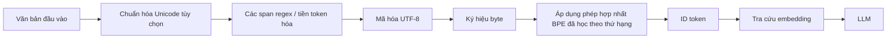
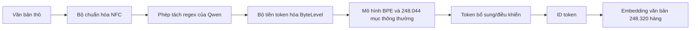

# Bộ token hóa Byte-Level Byte Pair Encoding (BBPE)

**Cải thiện:** cách token hóa theo từ, theo ký tự và BPE cấp ký tự
khi mô hình phải bao phủ nhiều hệ chữ viết, ký hiệu hiếm, văn bản nhiễu và mã nguồn
với một từ vựng cố định.
**Mục tiêu chính:** bảo đảm một bảng chữ cái cơ sở nhỏ, không mất dữ liệu, đồng thời
học các chuỗi byte có độ dài biến đổi thường gặp để văn bản thông thường không phải
chịu toàn bộ chi phí độ dài chuỗi của cách biểu diễn mỗi byte một token.

**Giải thích đơn giản:** BBPE chuyển văn bản đã chuẩn hóa thành byte UTF-8, bắt đầu
từ một từ vựng cơ sở biểu diễn được mọi byte, rồi học thứ hạng hợp nhất cặp để nén
các chuỗi byte thường gặp thành token lớn hơn. Nhờ đó, tokenizer có thể thích ứng
với nhiều ngôn ngữ và từ mới.

**Ngày nghiên cứu:** 2026-07-20
**Phạm vi:** thuật toán token, kiến ​​trúc và luồng dữ liệu của nó, các lựa chọn thay thế,
sự đánh đổi của hệ thống và các artifact token chính xác được xuất bản cho Qwen
dòng mô hình.

## Tại sao đơn vị token trước đó không đủ

| Đơn vị ban đầu | Điểm mạnh | Vấn đề cấu trúc mà BBPE giải quyết |
| ------------------- | -------------------------------------------------------------- | ------------------------------------------------------------------------------------------------------------------------------------------------------ |
| Từ | Chuỗi ngắn cho các từ thông dụng | Không thể nhét từ vựng mở vào một bảng cố định; tên mới, biến tố, lỗi chính tả và định danh mã nguồn sẽ thành unknown hoặc cần cơ chế fallback riêng |
| Ký tự Unicode | Ranh giới thường có thể giải thích được | Unicode chứa không gian ký tự rất lớn và được sử dụng không đồng đều; các ký tự hiếm sử dụng các khe từ vựng và mỗi ký tự vẫn là một bước riêng biệt |
| BPE cấp ký tự | Học các subword có thể tái sử dụng và cả từ phổ biến | Bảng chữ cái ký tự ban đầu vẫn cần được corpus bao phủ; ký tự chưa thấy có thể trở thành `<unk>` nếu không có cơ chế fallback khác |
| Byte thuần túy | Bất kỳ luồng byte nào cũng có thể được biểu thị bằng tối đa 256 ký hiệu cơ sở | UTF-8 sử dụng một đến bốn byte cho mỗi điểm mã Unicode, do đó các chuỗi trở nên dài hơn nhiều và tính toán mô hình tăng lên |
| **BBPE** | Cơ sở byte phổ quát cộng với byte n-gram đã học | Nó loại bỏ OOVs thông thường trong khi khôi phục phần lớn hiệu quả nén của BPE từ phụ |

Sennrich và cộng sự đã chuyển BPE từ dạng nén sang văn bản thần kinh từ vựng mở
phân đoạn: khởi tạo một bộ ký hiệu nhỏ, liên tục hợp nhất các ký hiệu thường xuyên nhất
cặp liền kề và sử dụng các kết hợp đã học để biểu diễn các từ hiếm thông qua
các đơn vị nhỏ hơn. Phiên bản của họ hoạt động trên các ký tự hoặc chuỗi ký tự,
không nhất thiết phải là byte thô.
([Sennrich và cộng sự, 2016, §3.2](https://aclanthology.org/P16-1162/))

Wang và cộng sự đã chuyển bảng chữ cái ban đầu đó xuống byte UTF-8. Động lực của họ
là bảng chữ cái byte cố định nhỏ gọn và không phụ thuộc vào ngôn ngữ, trong khi hiếm
các ký tự trong các ngôn ngữ ồn ào hoặc giàu ký tự có thể chiếm tỷ lệ không cân xứng
năng lực từ vựng. Các thử nghiệm NMT của họ cho thấy chất lượng tương đương với
BPE cấp độ ký tự với các từ vựng BBPE nhỏ hơn nhiều, nhưng những từ vựng thử nghiệm đó
tỷ lệ là kết quả cho việc thiết lập bản dịch của bài báo, không phải là quy luật chung cho
LLMs chỉ dành cho bộ giải mã.
([Wang và cộng sự, 2019](https://arxiv.org/abs/1909.03341))

## Từ nén BPE đến token BPE

Tên gọi này có nguồn gốc lịch sử. Thuật toán nén năm 1994 của Gage tìm thấy nhiều nhất
cặp byte liền kề thường xuyên trong một khối dữ liệu, thay thế mọi lần xuất hiện bằng
một byte chưa được sử dụng, ghi lại bảng thay thế và lặp lại cho đến khi tiếp tục
nén là không thể. Trình token thần kinh không yêu cầu một token chưa được sử dụng
byte vật lý cho mỗi lần hợp nhất. Nó tạo ra một **biểu tượng/token ID** mới có giá trị
là sự kết hợp của hai biểu tượng hiện có, học cách hợp nhất theo thứ tự có thể tái sử dụng
bảng từ một kho văn bản và rời khỏi mô hình ngôn ngữ để học cách nhúng cho
mỗi kết quả là ID.
([Gage, 1994](https://jacobfilipp.com/DrDobbs/articles/CUJ/1994/9402/gage/gage.htm))

Sự khác biệt này quan trọng:

- từ vựng của tokenizer là một từ điển đã học, không phải văn bản nén;
- một token có thể chứa một byte, một ký tự Unicode hoàn chỉnh, một số ký tự
  ký tự hoặc thậm chí chỉ là một phần của ký tự nhiều byte;
- thứ tự hợp nhất là một phần của đặc tả token và phải giống hệt nhau
  trong đào tạo và suy luận;
- trình tạo token không hiểu trực tiếp về hình thái hoặc ngữ nghĩa—nó học
  các mẫu kề cận thường xuyên từ phân bố huấn luyện của nó.

## Đào tạo BBPE

Hãy để kho dữ liệu đào tạo chuẩn hóa được chia thành các khoảng được mã hóa trước và để
mỗi nhịp được chuyển đổi thành byte UTF-8. Bảng chữ cái byte tối thiểu là

$$
V_0 = \{0,1,\ldots,255\}.
$$

Một số triển khai hiển thị các byte này thông qua đại diện thay thế Unicode có thể in được
ký tự, nhưng bảng chữ cái cơ bản vẫn đại diện cho byte. Ở bước hợp nhất
`t`, đếm các cặp ký hiệu liền kề trong khoảng cho phép:

$$
C_t(a,b)
=
\sum_{s \in \mathcal{D}_t}
\sum_{i=1}^{|s|-1}
\mathbf{1}\!\left[s_i=a \land s_{i+1}=b\right].
$$

Lựa chọn BPE dựa trên tần số cổ điển

$$
(a_t,b_t)
=
\underset{(a,b)}{\arg\max}\; C_t(a,b),
$$

tạo biểu tượng nối `a_t b_t`, gán cho nó thứ hạng hợp nhất tiếp theo và
thay thế các lần xuất hiện của cặp trong biểu diễn huấn luyện:

$$
V_{t+1}=V_t\cup\{a_tb_t\}.
$$

Vòng lặp dừng ở ngân sách từ vựng/hợp nhất hoặc ngưỡng tần số khác. TRONG
trường hợp đơn giản hóa với 256 ký hiệu byte ban đầu và không có token dành riêng,

$$
|V| = 256 + N_{\text{merges}}.
$$

Các tệp token thực có thể có bảng chữ cái ban đầu lớn hơn, IDs chưa được sử dụng, đã được thêm vào
token và các hàng nhúng được đệm, vì vậy không nên sử dụng danh tính này để suy ra
`vocab_size` chính xác của trạm kiểm soát mà không kiểm tra các artifact của nó.

### Tại sao token trước là một phần của kiến ​​trúc

Hầu hết các token BBPE sản xuất không cho phép hợp nhất trên toàn bộ tài liệu.
Trước tiên, một biểu thức chính quy hoặc một token trước khác sẽ tách biệt các khoảng như từ, số,
dấu câu, khoảng trắng và dòng mới. Đếm cặp và hợp nhất ứng dụng ở lại
bên trong những ranh giới đó. Do đó, chỉ thay đổi biểu thức chính quy trước token
có thể thay đổi:

- liệu khoảng trắng ở đầu có nối với từ sau hay không;
- liệu `1234` có thể trở thành một token hay bị buộc thành bốn chữ số;
- cách nhóm các từ viết tắt, thụt lề, CR/LF và dấu câu mã;
- những token ứng cử viên nào có thể được học, ngay cả với cùng một kho ngữ liệu và
  ngân sách từ vựng.

Đây là lý do tại sao “sử dụng BBPE” là không đủ để tái tạo token. Bộ bình thường hóa của nó,
token trước, bảng chữ cái ban đầu, xếp hạng hợp nhất, chính sách token đặc biệt và bộ giải mã
đều là một phần của hợp đồng.

## Mã hóa luồng dữ liệu



Đối với mỗi khoảng được mã hóa trước, suy luận bắt đầu từ các ký hiệu byte, lặp đi lặp lại
áp dụng cặp có sẵn với thứ hạng đã học tốt nhất và dừng khi không học được
cặp còn lại. Trong ký hiệu xếp hạng,

$$
(a^*,b^*)
=
\underset{(a,b)\in P(s)}{\arg\min}\;
r(a,b),
$$

trong đó một cặp chưa được học có thứ hạng `+infinity`. Ứng dụng xếp hạng này không phải là mới
đếm tần số theo lời nhắc của người dùng; tần số đã được chuyển đổi thành
hợp nhất các cấp bậc trong quá trình đào tạo tokenizer.

### Ví dụ cụ thể

Lấy chuỗi chuẩn hóa `café`. UTF-8 đại diện cho nó là

```text
văn bản: c a f é
byte: 63 61 66 C3 A9 (thập lục phân)
```

Giả sử bảng hợp nhất đã học chứa các quy tắc này theo thứ tự tăng dần:

```text
63 + 61 -> 6361 # "ca"
C3 + A9 -> C3A9 # hoàn thành mã hóa UTF-8 của "é"
6361+66 -> 636166#"caf"
636166 + C3A9 -> 636166C3A9 # "café"
```

Sau đó `café` có thể là một token. Nếu hai quy tắc cuối cùng chưa bao giờ được học, thì tương tự
đầu vào vẫn có thể được biểu diễn dưới dạng `ca`, `f`, `é`; chỉ với cơ sở 256 byte
nó vẫn có thể được biểu diễn dưới dạng năm byte gốc. **Phạm vi bảo hiểm là
được đảm bảo bởi bảng chữ cái cơ sở, trong khi việc nén phụ thuộc vào kiến ​​thức đã học
hợp nhất và kho văn bản của họ.**

Mã thông báo có thể vượt qua ranh giới ký tự Unicode hoặc kết thúc ở giữa một ký tự. Vì
ví dụ: token có thể giữ `C3` mà không có byte tiếp theo `A9`. Điều này hợp lệ
bên trong một chuỗi token, nhưng việc giải mã token đơn lẻ đó có thể hiển thị
ký tự thay thế Unicode. Ghi chú tokenizer của Qwen thể hiện chính xác
hành vi này: hai chuỗi byte token không hoàn chỉnh riêng lẻ trở thành hợp lệ
Ký tự Trung Quốc sau khi nối.
([ghi chú token Qwen chính thức](https://github.com/QwenLM/Qwen/blob/main/tokenization_note.md#regular-tokens))

## Ánh xạ byte sang Unicode GPT-2-style

Nhiều triển khai cần mã BPE hoạt động trên chuỗi thay vì thô
mảng byte. GPT-2 đã giới thiệu tính năng tra cứu có thể đảo ngược từ tất cả các giá trị 256 byte sang
các ký tự Unicode có thể in được, tránh khoảng trắng và các ký tự điều khiển trong
sự đại diện bên trong. Bộ mã hóa của nó thực hiện thứ tự này:

```text
nhịp độ chính quy -> byte UTF-8 -> tra cứu byte-to-Unicode -> xếp hạng BPE -> IDs
```

và giải mã đảo ngược nó:

```text
IDs -> chuỗi thay thế được hợp nhất -> byte -> văn bản UTF-8
```

`Ġ` quen thuộc trong từ vựng GPT-2-family hiển thị đại diện thay thế được liên kết
với một byte khoảng trắng; nó không phải là một dấu hiệu ngôn ngữ được phát hiện trong nguyên bản
chữ. Tương tự như vậy, các mảnh trông có vẻ thay thế không nên được hiểu là
các ký tự Unicode thực tế của văn bản. Triển khai GPT-2 ban đầu cho thấy
tra cứu có thể đảo ngược, biểu thức chính quy, vòng lặp hợp nhất được xếp hạng, chuyển đổi UTF-8 và nghịch đảo
bộ giải mã trực tiếp.
([OpenAI GPT-2 `encoder.py`](https://github.com/openai/gpt-2/blob/master/src/encoder.py))

## Giải mã và đảo ngược

Bỏ qua việc chuẩn hóa và loại bỏ token đặc biệt, việc giải mã là nghịch đảo của
mã hóa:

$$
\hat{b}
=
\operatorname{concat}
\left(
\operatorname{bytes}(v_{i_1}),\ldots,
\operatorname{bytes}(v_{i_L})
\right),
\qquad
\hat{x}=\operatorname{UTF8Decode}(\hat{b}).
$$

Đối với văn bản đầu vào được mã hóa bởi bộ token, cơ sở byte sẽ ngăn chặn một thông thường
token không xác định. Chuỗi token được tạo khác nhau: mô hình có thể dừng
sau token chỉ chứa một phần ký tự UTF-8, do đó bộ giải mã trực tuyến
có thể cần đệm nhiều token trước khi nó phát ra văn bản hợp lệ. Một cách tùy tiện
Chuỗi byte do mô hình tạo cũng có thể là UTF-8 không hợp lệ; ứng dụng phải
chọn đệm, thay thế, bỏ qua hoặc giải mã bề mặt các lỗi. Vương và
al. lưu ý rõ ràng rằng không phải mọi chuỗi byte tùy ý đều ánh xạ tới văn bản hợp lệ,
mặc dù trình tự không hợp lệ rất hiếm trong các thử nghiệm NMT đã hoàn thành của họ.
([Wang và cộng sự, 2019, thảo luận giải mã](https://arxiv.org/pdf/1909.03341))

Có một ranh giới quan trọng khác: **bộ chuẩn hóa có thể cố tình tạo ra
toàn bộ token không mất dữ liệu đối với các byte đầu vào ban đầu**. Vì
ví dụ: NFC có thể thay thế chuỗi ký tự cơ sở-cộng-dấu kết hợp được phân tách
với một điểm mã được soạn thảo chính tắc trước khi mã hóa byte. BBPE sau đó bảo quản
các byte được chuẩn hóa, không phải cách viết chính xác ban đầu ở cấp độ byte.

## BBPE không phải là dự phòng byte

| Cơ chế | Đường dẫn bình thường | Khi token byte thô xuất hiện | Hành vi OOV thông thường |
| ------------------------------------------ | ---------------------------------------------- | ----------------------------------------------------- | --------------------------------------------------------------- |
| Cấp byte thực BPE | Chuyển đổi**tất cả** đầu vào thành byte trước BPE | Luôn hình thành biểu diễn cơ sở | Không có khi tất cả 256 byte được bao phủ |
| Mô hình ký tự/từ phụ với dự phòng byte | Trước tiên hãy chạy mô hình ký tự/từ phụ thông thường | Chỉ khi một ký tự/khoảng không được biết đến | Những phần không xác định được thay thế bằng các token byte rõ ràng, chẳng hạn như`<0xE2>` |

Tài liệu giải mã chính thức của Hugging Face khiến việc triển khai
có thể nhìn thấy sự khác biệt: `ByteLevel` đảo ngược ánh xạ byte-to-Unicode GPT-2-style,
trong khi `ByteFallback` diễn giải token dự phòng `<0xNN>` rõ ràng
cho các ký tự chưa biết.
([Bộ giải mã Tokenizers ôm mặt](https://huggingface.co/docs/tokenizers/main/en/api/decoders))

SentencePiece cũng không phải là một thuật toán phân đoạn. Đó là một khuôn khổ mà
có thể huấn luyện các mô hình BPE, unigram, ký tự hoặc từ trực tiếp từ các câu thô;
Hoạt động tiêu chuẩn của nó xử lý đầu vào dưới dạng ký tự Unicode và áp dụng ký tự riêng của nó
chuẩn hóa và biểu diễn khoảng trắng. Mô hình SentencePiece có thể kích hoạt
dự phòng byte, nhưng điều đó không biến mọi cấu hình SentencePiece thành
BBPE.
([Giấy câu](https://arxiv.org/abs/1808.06226),
[triển khai chính thức](https://github.com/google/sentencepiece))

## So sánh với các token lân cận

| Phương pháp | Đơn vị ban đầu | Quy tắc đào tạo/mã hóa | Bảo hành OOV | Sự đánh đổi đặc trưng |
| -------------- | ----------------------------------------------- | --------------------------------------------------------------------------------------------------- | ----------------------------------------------------------- | -------------------------------------------------------------------------------------- |
| Nhân vật BPE | Ký tự Unicode được che phủ | Hợp nhất các đơn vị lân cận thường xuyên nhất; áp dụng cấp bậc đã học | Không, trừ khi có tất cả các ký tự cần thiết hoặc ký tự dự phòng | Các ký hiệu cơ sở dễ hiểu hơn, nhưng bảng chữ cái đa ngôn ngữ chiếm nhiều vị trí |
| **BBPE** | Tất cả byte | Hợp nhất các đơn vị có nguồn gốc byte liền kề thường xuyên; áp dụng cấp bậc đã học | Có đối với phạm vi bảo hiểm byte | Đế phổ thông nhỏ gọn; token có thể phân tách các ký tự và các hệ chữ viết hiếm có thể nặng byte |
| Từ ngữ | Bảng chữ cái giống ký tự với các dạng tiếp nối | Học từ vựng liên quan đến khả năng xảy ra; mã hóa bằng các phần khớp dài nhất | Thường sử dụng`[UNK]` khi một từ không thể được phân đoạn đầy đủ | Quy ước tiếp tục hữu ích, nhưng về bản chất không mở ở cấp byte |
| Unigram LM | Bộ từ phụ ứng cử viên lớn | Loại bỏ các ứng cử viên để tối ưu hóa mục tiêu khả năng của kho dữ liệu; chọn phân khúc có xác suất cao | Phụ thuộc vào mức độ bao phủ/dự phòng của nhân vật | Hỗ trợ các phân đoạn thay thế theo xác suất thay vì phân cấp hợp nhất cố định |
| Byte thuần túy | Tất cả byte | Không có sự hợp nhất đã học | Có | Từ vựng nhỏ nhất nhưng chuỗi dài nhất |

Việc triển khai đào tạo WordPiece chưa bao giờ được Google phát hành chính thức,
vì vậy những mô tả chính xác về quy tắc tính điểm theo cặp của nó là sự tái tạo lại từ
văn học. Sự khác biệt rõ ràng nhất là ở thời điểm mã hóa: WordPiece phổ biến
việc triển khai sử dụng từ vựng khớp đầu tiên dài nhất trên từ vựng cuối cùng, trong khi BPE
áp dụng một bảng hợp nhất theo thứ tự.
([Tài liệu Ôm mặt WordPiece](https://huggingface.co/docs/course/chapter6/6))

## Sự đánh đổi ở cấp độ hệ thống

### Kích thước từ vựng so với độ dài chuỗi

Đặt `V` là kích thước từ vựng, chiều rộng mô hình `d` và `L` là số kết quả của
token. Chi phí ma trận nhúng đầu vào

$$
P_{\text{embed}}=Vd.
$$

Nếu đầu LM đầu ra riêng biệt thì các trọng số của nó sẽ cộng thêm khoảng một `Vd` khác:

$$
P_{\text{vocab}}
\approx
\begin{cases}
Vd, & \text{tied input/output weights},\\
2Vd, & \text{untied input/output weights}.
\end{cases}
$$

Do đó, vốn từ vựng BBPE lớn hơn sẽ tăng bộ nhớ điểm kiểm tra, nhúng
băng thông và tính toán log cuối cùng. Đổi lại nó có thể giảm `L` bằng
lưu trữ các chuỗi thường xuyên hơn dưới dạng token đơn lẻ. Điều này quan trọng xuyên suốt
mạng: tỷ lệ điền trước toàn bộ sự chú ý xấp xỉ bằng

$$
O(L^2d),
$$

trong khi các phép chiếu thông minh về token và MLPs chia tỷ lệ tuyến tính với `L`. Nếu cùng một văn bản
sử dụng một phần `r` làm nhiều token, phần chú ý có thể rơi vào khoảng
`r^2` có kích thước trước đây, nhưng vốn từ vựng đầu ra lớn hơn khiến mỗi lần giải mã
bước đắt hơn. Do đó, kích thước từ vựng tốt nhất là phần cứng,
sự cân bằng giữa hỗn hợp ngôn ngữ, độ rộng mô hình và khối lượng công việc phục vụ—không chỉ đơn giản là “lớn hơn
thì tốt hơn.”

### Phân bổ Corpus là chính sách

Hợp nhất các vị trí đi theo các mẫu thường xuyên. Nếu tiếng Anh và lập trình phổ biến
ngôn ngữ chiếm ưu thế trong quá trình đào tạo token, chúng nhận được các token có thể tái sử dụng trong thời gian dài trong khi
hệ chữ viết tài nguyên thấp có thể vẫn ở gần byte thô. BBPE đảm bảo khả năng mã hóa,
Hiệu quả token không bằng nhau hoặc chất lượng mô hình bằng nhau giữa các ngôn ngữ. Từ vựng
việc chia sẻ có thể giúp chuyển giao đa ngôn ngữ—bài báo BBPE đã tìm thấy điều này trong
thiết lập bản dịch đa ngôn ngữ—nhưng một khoảng không quảng cáo được chia sẻ vẫn phản ánh
trọng số lấy mẫu được sử dụng để huấn luyện nó.

### Khoảng trắng, mã và văn bản chính xác

Xử lý cấp byte rất hấp dẫn đối với mã vì các tab, dấu cách, kết thúc dòng,
các toán tử và các mã định danh tùy ý vẫn có thể biểu diễn được. Tuy nhiên, biểu thức chính quy có thể
ngăn chặn sự hợp nhất hữu ích, chuẩn hóa Unicode có thể viết lại văn bản nguồn và
các chính sách kết thúc dòng khác nhau có thể thay đổi số lượng token. Bất kỳ mô hình mã nào cũng nên
do đó, hãy đánh giá **toàn bộ đường dẫn token**, không chỉ xác nhận rằng nó
loại mô hình là `BPE`.

### Sự mạnh mẽ và bảo mật không phải là tự động

BBPE loại bỏ lỗi phủ sóng `<unk>` nhưng không tương đương về mặt trực quan
dây giống nhau. Homoglyphs, ký tự có độ rộng bằng 0, điều khiển hai chiều,
Các biểu mẫu NFC/NFD và việc xử lý byte không hợp lệ là những mối quan tâm riêng biệt. Chuẩn hóa
có thể giảm một số biến thể nhưng cũng có thể phá hủy sự khác biệt quan trọng trong mã
hoặc văn bản nhạy cảm về bảo mật.

## Việc áp dụng Qwen chính xác

### Qwen → Qwen2 → Qwen3

| Gia Đình | Mô tả token đã được xác minh | Chi tiết đếm quan trọng |
| ------ | ------------------------------------------------------------------------------------------------------------------------------------ | ------------------------------------------------------------------------------------------------------------------------------------- |
| Qwen | Bắt đầu từ `tiktoken` của `tiktoken`, thêm các đơn vị tiếng Trung thường gặp và các đơn vị đa ngôn ngữ khác, đồng thời chia các số thành một chữ số | Từ vựng cuối cùng được báo cáo là khoảng 152K |
| Qwen2 | Tái sử dụng cấp byte BPE của Qwen | 151.643 token thông thường cộng với 3 token kiểm soát; báo cáo cảnh báo rằng kích thước nhúng có thể lớn hơn vì lý do đào tạo phân tán |
| Qwen3 | Xác định rõ ràng token là BBPE | Kích thước từ vựng 151.669 |

Nguồn: [Báo cáo kỹ thuật Qwen, §2.2](https://arxiv.org/abs/2309.16609),
[Báo cáo kỹ thuật Qwen2, §2.1](https://arxiv.org/abs/2407.10671) và
[Báo cáo kỹ thuật Qwen3, §2](https://arxiv.org/abs/2505.09388).

Dòng dõi này cũng cho thấy tại sao `151,643`, `151,646` và `151,669` lại không
trái ngược nhau. Đầu tiên là kho BPE thông thường của Qwen2, thứ hai bổ sung thêm
ba token kiểm soát Qwen2 và mã thứ ba là token Qwen3 sau này đã nêu
từ vựng đầy đủ.

### Qwen3.5: BBPE lớn hơn và luồng dữ liệu cấp độ tạo tác

Báo cáo Qwen3.5-Omni và bài đăng phát hành chính thức mô tả BPE cấp 250K byte
từ vựng, tăng từ khoảng 150K và báo cáo khả năng mã hóa và mã hóa tốt hơn 10–60%.
hiệu quả giải mã trên hầu hết các ngôn ngữ. Đây là tổng hợp được báo cáo bởi Qwen
khẳng định; câu báo cáo được trích dẫn không cung cấp token cho mỗi ngôn ngữ
bảng điểm chuẩn hoặc phương pháp đủ để tái tạo phạm vi.
([Báo cáo kỹ thuật Qwen3.5-Omni, §2.3](https://arxiv.org/abs/2604.15804),
[Bản phát hành Qwen3.5 chính thức](https://www.alibabacloud.com/blog/602894))

Các hiện vật `Qwen3.5-27B` được công bố tiết lộ đường ống bê tông:



Được xác minh trực tiếp từ các hiện vật chính thức:

- `tokenizer.json` sử dụng bộ chuẩn hóa NFC, một biểu thức chính quy `Split` theo sau là
  `ByteLevel`, mẫu `BPE` và bộ giải mã `ByteLevel`;
- Từ vựng mô hình BPE của nó có **248.044 mục**, IDs `0..248043`;
- cùng một tệp sẽ thêm 26 mục tại IDs `248044..248069`, bao gồm trò chuyện,
  tầm nhìn, công cụ, phần điền vào giữa, kho lưu trữ và các điểm đánh dấu tư duy;
- `tokenizer_config.json` khai báo `Qwen2Tokenizer` và liệt kê 33 token bổ sung
  mục giải mã thông qua ID `248076`, bao gồm bảy điểm đánh dấu âm thanh/TTS ngoài
  những thứ được đăng tuần tự trong `tokenizer.json`;
- `config.json` dự trữ **248.320** hàng cho từ vựng và bộ văn bản
  `tie_word_embeddings: false`.

Hiện vật chính thức:
[Qwen3.5-27B `tokenizer.json`](https://huggingface.co/Qwen/Qwen3.5-27B/blob/fc05daec18b0a78c049392ed2e771dde82bdf654/tokenizer.json),
[`tokenizer_config.json`](https://huggingface.co/Qwen/Qwen3.5-27B/blob/fc05daec18b0a78c049392ed2e771dde82bdf654/tokenizer_config.json) và
[`config.json`](https://huggingface.co/Qwen/Qwen3.5-27B/blob/fc05daec18b0a78c049392ed2e771dde82bdf654/config.json).

Do đó, “từ vựng 250K” được làm tròn không nên được thay thế một cách mù quáng cho
mọi lĩnh vực phần mềm:

$$
\underbrace{248{,}044}_{\text{BPE model entries}}
\neq
\underbrace{248{,}320}_{\text{reserved embedding rows}}.
$$

Khoảng cách dự kiến: đã thêm token đa phương thức/kiểm soát và được đệm hoặc dành riêng
các hàng phục vụ các mục đích khác nhau từ các mục BBPE đã học. Bởi vì Qwen3.5-27B
không ràng buộc các phần nhúng đầu vào và đầu ra, từ vựng văn bản được đệm ảnh hưởng đến
cả hai ma trận lớn chứ không phải một ma trận chung.

Biểu thức chính quy Qwen3.5 hiện tại là:

```regex
(?i:'s|'t|'re|'ve|'m|'ll|'d)|[^\r\n\p{L}\p{N}]?[\p{L}\p{M}]+|\p{N}| ?[^\s\p{L}\p{M}\p{N}]+[\r\n]*|\s*[\r\n]+|\s+(?!\S)|\s+
```

Nó xử lý các từ viết tắt không phân biệt chữ hoa chữ thường, giữ các dấu kết hợp Unicode
(`\p{M}`) với các chữ cái, chia số một chữ số một lần và có rõ ràng
các nhánh để chấm câu, khoảng trắng ngang và chạy dòng mới. Những thứ kia
các quy tắc—không phải riêng BBPE—xác định một phần tính năng đa ngôn ngữ, mã và
hành vi khoảng trắng.

## BBPE cải thiện những gì—và những gì không

**Nó trực tiếp cải thiện:**

- phạm vi bảo hiểm: mọi đầu vào UTF-8 được chuẩn hóa có thể được phân tách thành byte cơ sở;
- sự cô đọng của bảng chữ cái cơ sở trên nhiều hệ thống chữ viết;
- tái sử dụng các đoạn byte và chuỗi thường xuyên trên các ngôn ngữ;
- nén tương ứng với mô hình byte thuần;
- xử lý các ký hiệu hiếm, văn bản ồn ào, khoảng trắng và mã mà không cần thông thường
  từ vựng ký tự OOV.

**Nó không đảm bảo:**

- một token cho mỗi từ hoặc một token cho mỗi ký tự Unicode;
- hiệu quả token như nhau giữa các ngôn ngữ;
- ranh giới token ngữ nghĩa hoặc hình thái;
- bảo toàn chuỗi byte gốc khi quá trình chuẩn hóa chạy trước;
- UTF-8 hợp lệ sau mỗi token được tạo trung gian;
- các chuỗi ngắn hơn mọi token ký tự/từ phụ trên mọi miền;
- chất lượng nhiệm vụ cuối tốt hơn chỉ vì vốn từ vựng lớn hơn.

## Danh sách kiểm tra thực tế

Trước khi so sánh hai “token BBPE”, hãy kiểm tra:

1. bộ chuẩn hóa và liệu nhận dạng byte khứ hồi có quan trọng hay không;
2. ranh giới hợp nhất và biểu thức chính quy trước token chính xác;
3. các mục nhập BPE thông thường, số lượng hợp nhất, token được thêm và ID được chỉ định tối đa;
4. chiều dài token so với mô hình `vocab_size` và phần đệm nhúng;
5. ràng buộc trọng lượng đầu vào/đầu ra;
6. token trên mỗi byte, ký tự, từ và tài liệu cho từng ngôn ngữ đích và
   miền mã/dữ liệu;
7. chính sách giải mã trực tuyến và UTF-8 không hợp lệ;
8. việc chèn token đặc biệt và liệu văn bản của người dùng có thể xung đột với nó hay không;
9. độ trễ từ đầu đến cuối, không chỉ số lượng token.

## Nguồn

Tất cả các nguồn trực tuyến đã được mở hoặc tải xuống và kiểm tra vào ngày 20-07-2026.

- Philip Gage. [Thuật toán mới để nén dữ liệu](https://jacobfilipp.com/DrDobbs/articles/CUJ/1994/9402/gage/gage.htm), 1994.
- Rico Sennrich, Barry Haddow, Alexandra Birch. [Dịch máy thần kinh các từ hiếm với đơn vị từ phụ](https://aclanthology.org/P16-1162/), ACL 2016.
- Changhan Wang, Kyunghyun Cho, Jiatao Gu. [Dịch máy thần kinh với từ phụ cấp byte](https://arxiv.org/abs/1909.03341), AAAI 2020.
- OpenAI. [Triển khai bộ mã hóa BPE cấp byte GPT-2](https://github.com/openai/gpt-2/blob/master/src/encoder.py).
- Taku Kudo, John Richardson. [SentencePiece](https://arxiv.org/abs/1808.06226), giấy demo EMNLP 2018.
- Ôm Mặt. [Thành phần token](https://huggingface.co/docs/tokenizers/main/components) và [bộ giải mã](https://huggingface.co/docs/tokenizers/main/en/api/decoders).
- Đội Qwen. [Báo cáo kỹ thuật Qwen](https://arxiv.org/abs/2309.16609), [Báo cáo kỹ thuật Qwen2](https://arxiv.org/abs/2407.10671), [Báo cáo kỹ thuật Qwen3](https://arxiv.org/abs/2505.09388) và [Báo cáo kỹ thuật Qwen3.5-Omni](https://arxiv.org/abs/2604.15804).
- Đội Qwen. [Ghi chú token Qwen](https://github.com/QwenLM/Qwen/blob/main/tokenization_note.md) và [Cấu tạo token Qwen3.5-27B](https://huggingface.co/Qwen/Qwen3.5-27B/tree/main).
