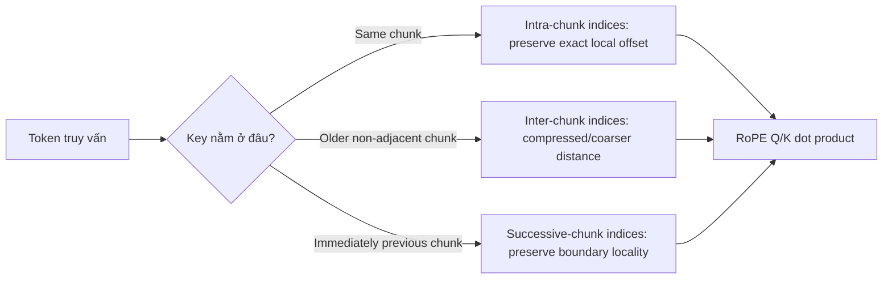

# Dual Chunk Attention (DCA)

**Cải thiện:** Sự chú ý của RoPE có khoảng cách tương đối thô vượt quá phạm vi ngữ cảnh được huấn luyện trước.
**Mục tiêu chính:** duy trì khoảng cách RoPE hiệu quả trong phạm vi quen thuộc trong khi
duy trì sự chú ý cục bộ, xuyên suốt và mở rộng ranh giới.

**Giải thích đơn giản:** Chia một chuỗi dài thành các phần chồng chéo để sự chú ý chủ yếu hoạt động trên các khoảng cách ngắn hơn, quen thuộc, trong khi đường dẫn chú ý xuyên suốt thứ hai sẽ lưu giữ thông tin tầm xa. (Do đó cần chú ý kép)

## Tại sao cần có chỉ số vị trí cụ thể

Một phương pháp chunk cục bộ đơn giản có thể sử dụng lại các vị trí `0..s-1` trong mỗi chunk, giữ nguyên
khoảng cách RoPE địa phương quen thuộc. Tuy nhiên, sự chú ý nghiêm ngặt của địa phương sẽ loại bỏ quyền truy cập
đến các khối cũ hơn. Sử dụng các vị trí chung ban đầu sẽ khôi phục quyền truy cập nhưng một lần nữa
cung cấp khoảng cách RoPE ngoài phạm vi được đào tạo.

DCA giải quyết tình trạng căng thẳng này bằng cách tính toán sự chú ý với ba vị trí truy vấn
lượt xem. Nó không chỉ đơn thuần che giấu tất cả các cặp chéo, và phương pháp ban đầu là
đào tạo miễn phí. ([An và cộng sự, 2024](https://arxiv.org/abs/2402.17463))

## Ba vùng chú ý



- **Chú ý nội bộ** sử dụng lại các vị trí `0..s-1` bên trong mỗi đoạn. Địa phương
  khoảng cách mã thông báo vẫn chính xác và nằm trong phạm vi được đào tạo.
- **Chú ý giữa các đoạn** cho phép truy cập vào các phần cũ hơn trong khi sử dụng giới hạn
  chỉ mục truy vấn. Nó giữ lại quyền truy cập nội dung nhưng cố tình tạo khoảng cách
  vị trí kém chính xác hơn.
- **Chú ý đến đoạn liên tiếp** duy trì một cửa sổ cục bộ trên đoạn liền kề
  ranh giới, tránh sự gián đoạn nhân tạo giữa mã thông báo cuối cùng của
  một đoạn và mã thông báo đầu tiên của đoạn tiếp theo.

## Ánh xạ lại vị trí

Đặt `c = L_train`, kích thước khối `s`, chỉ mục truy vấn `i`, chỉ mục khóa `j` và ranh giới
chiều rộng cửa sổ `w = c - s`. Một bản tóm tắt nhỏ gọn là:

$$
\begin{aligned}
P_k(j) &= j \bmod s,
&&\text{key position}, \\
P_q^{\mathrm{intra}}(i) &= i \bmod s,
&&\text{same-chunk query}, \\
P_q^{\mathrm{inter}}(i) &= c-1,
&&\text{older-chunk query}, \\
w &= c-s,
&&\text{successive-chunk local-window width}, \\
P_q^{\mathrm{succ}}(i) &\le c-1,
&&\text{preserve the local window, then cap}
\end{aligned}
$$

Mặt nạ nhân quả chọn vùng điểm chính xác cho mỗi cặp khóa truy vấn. Tất cả
các chỉ số hiệu quả vẫn còn bên trong `0..c-1`, nhưng các vị trí không liền kề cũ hơn thì
thô lại. Bài viết DCA mô tả các bộ vị trí Q riêng biệt cho nội bộ, giữa,
và các phép tính khối liên tiếp và cho thấy phương pháp này có thể tích hợp với
FlashChú ý. ([phương pháp DCA, §3](https://arxiv.org/abs/2402.17463))

## Ví dụ với đầu vào tám mã thông báo

Giả sử một mô hình được đào tạo với phạm vi bốn mã thông báo và chia chuỗi tám mã thông báo
vào `[A B C D] [E F G H]`:

```text
trong đoạn thứ hai: E,F,G,H sử dụng lại các vị trí cục bộ 0,1,2,3
F hướng tới E: chuyển vị cục bộ chính xác 1
F tham dự B: mối quan hệ chéo sử dụng khoảng cách được giới hạn/chỉ mục lại
E tham dự D: quy tắc đoạn kế tiếp bảo toàn địa phương ranh giới này
```

Mô hình có thể truy cập nội dung cũ hơn mà không cần gửi mọi dịch chuyển thô từ
4 đến 7 trực tiếp vào RoPE. Sự đánh đổi là mất khoảng cách chính xác giữa một số
những token ở xa.

## Những gì nó cải thiện và giới hạn của nó

- DCA bảo toàn hình học ranh giới cục bộ và liền kề tốt hơn so với một hình học đơn lẻ
  sơ đồ vị trí cục bộ lặp đi lặp lại.
- Nó giữ lại quyền truy cập nội dung nhiều đoạn thay vì cắt bớt tất cả các đoạn cũ.
- Nó vẫn thực hiện đầy đủ sự chú ý nhân quả đối với các vùng được kích hoạt; DCA làm được
  không chú ý đến thời gian tuyến tính.
- Kích thước khối và các lựa chọn cửa sổ ranh giới ảnh hưởng đến vị trí và phép ngoại suy.
- Khoảng cách xa bị thu hẹp có thể làm giảm sự phân biệt vị trí chính xác.
- Ngữ cảnh được chấp nhận lâu hơn không đảm bảo khả năng truy xuất hoặc lập luận hoàn hảo.

## Cách Qwen sử dụng DCA

**Đã xác minh:** Qwen2 sử dụng DCA cùng với YaRN sau quá trình đào tạo theo ngữ cảnh dài để
trình tự xử lý lên tới 131.072 mã thông báo.
([Báo cáo kỹ thuật Qwen2, §§2.2 và 3.2](https://arxiv.org/abs/2407.10671))

**Đã xác minh:** Qwen3 giới thiệu YaRN và DCA trong giai đoạn ngữ cảnh dài cho một
mở rộng suy luận bốn lần.
([Báo cáo kỹ thuật Qwen3, §3.2](https://arxiv.org/abs/2505.09388))

DCA thay đổi việc gán chỉ mục vị trí truy vấn/khóa. [YaRN](YaRN.md) thay vào đó
thay đổi phổ tần số RoPE và nhiệt độ chú ý. Qwen3-Next sau này
tiến xa hơn bằng cách thay thế hầu hết các lớp chú ý đầy đủ bằng Gated DeltaNet; cái đó
kiến trúc riêng biệt được đề cập trong [Gated_DeltaNet.md](Gated_DeltaNet.md).
