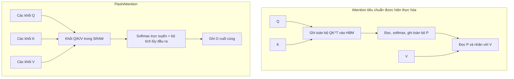

# FlashAttention

**Cải tiến:** mẫu truy cập bộ nhớ của attention chính xác tiêu chuẩn.
**Mục tiêu chính:** tránh ghi toàn bộ ma trận điểm attention và ma trận xác suất
vào bộ nhớ băng thông cao (HBM).

**Giải thích đơn giản:** FlashAttention giúp attention tiêu chuẩn của Transformer
nhanh hơn và tiết kiệm bộ nhớ hơn bằng cách tính toán theo các khối nhỏ vừa với
bộ nhớ nhanh trên chip. Nó giảm việc truyền dữ liệu chậm đến và đi từ bộ nhớ GPU
mà không xấp xỉ hoặc thay đổi kết quả attention.

Nó **không** làm giảm độ phức tạp tính toán lý thuyết \(O(n^2)\) của attention.
Thay vào đó, nó thực hiện cùng phép tính attention chính xác bằng một triển khai
GPU hiệu quả hơn.

## Đây là một thuật toán, không phải tầng attention được học khác

Attention tiêu chuẩn là:

$$
\begin{aligned}
S &= \frac{QK^{\top}}{\sqrt{d_{\mathrm{head}}}}, \\
P &= \operatorname{softmax}(S+M), \\
O &= PV
\end{aligned}
$$

Một triển khai GPU ngây thơ hiện thực hóa `S` và `P`, mỗi ma trận có kích thước
xấp xỉ `sequence_length × sequence_length` trên mỗi head. Triển khai ghi chúng
vào HBM, đọc lại để thực hiện softmax/trộn value và lưu các tensor trung gian
lớn cho lượt truyền ngược.

FlashAttention tính cùng một kết quả toán học, ngoại trừ sai khác thông thường do
thứ tự phép toán dấu phẩy động. Đổi mới chính của nó là chia khối có xét đến I/O:

1. nạp các khối Q, K và V từ HBM vào SRAM nhỏ, nhanh trên chip;
2. tính một khối điểm;
3. cập nhật giá trị cực đại, hệ số chuẩn hóa và bộ tích lũy đầu ra của softmax trực tuyến;
4. loại bỏ khối điểm thay vì ghi ma trận `N × N` vào HBM;
5. lặp lại trên mọi khối K/V; tính lại một số đại lượng trong lượt truyền ngược.

Bài báo chứng minh số lần truy cập HBM ít hơn triển khai hiện thực hóa tiêu chuẩn
trong chế độ bộ nhớ được phân tích.
([Dao et al., 2022, §§3.1–3.2](https://arxiv.org/abs/2205.14135))

## Vì sao softmax trực tuyến vẫn chính xác

Với một hàng query, giả sử khối trước có giá trị cực đại đang chạy `m_old`, hệ số
chuẩn hóa `l_old` và bộ tích lũy value có trọng số chưa chuẩn hóa `a_old`. Với
khối điểm mới `s`:

$$
\begin{aligned}
m_{\mathrm{new}}
&= \max\!\left(m_{\mathrm{old}},\max(s)\right), \\
\ell_{\mathrm{new}}
&= e^{m_{\mathrm{old}}-m_{\mathrm{new}}}\ell_{\mathrm{old}}
 + \sum_j e^{s_j-m_{\mathrm{new}}}, \\
a_{\mathrm{new}}
&= e^{m_{\mathrm{old}}-m_{\mathrm{new}}}a_{\mathrm{old}}
 + \sum_j e^{s_j-m_{\mathrm{new}}}V_j, \\
o &= \frac{a_{\mathrm{new}}}{\ell_{\mathrm{new}}}
\end{aligned}
$$

Việc đổi tỷ lệ bộ tích lũy trước khi `m_new` thay đổi giúp kết quả bằng softmax
trên tất cả các khối; toàn bộ hàng điểm không bao giờ phải cùng tồn tại trong HBM.

## So sánh luồng dữ liệu

## Độ phức tạp và lợi ích thực tế

- Phép tính vẫn có độ phức tạp bậc hai đối với full attention dày đặc: xấp xỉ
  `O(N^2 d)`. FlashAttention không phải phương pháp attention tuyến tính.
- Nó tránh lưu các tensor điểm/xác suất trung gian có kích thước bậc hai, giảm
  bộ nhớ phụ trợ về gần `O(Nd)`.
- Lưu lượng HBM thấp hơn có thể giúp attention nhanh hơn nhiều vì GPU thường có
  năng lực số học lớn hơn băng thông bộ nhớ dành cho phép toán này.
- Lợi thế tăng theo chiều dài chuỗi, nhưng tốc độ chính xác phụ thuộc vào GPU,
  dtype, kích thước head, mask, dropout, batching và thế hệ kernel.

FlashAttention không thu nhỏ KV cache tự hồi quy tồn tại lâu dài; GQA đảm nhiệm
việc đó. Hai kỹ thuật bổ trợ cho nhau: GQA lưu ít K/V head hơn, còn FlashAttention
thực thi attention trên các tensor Q/K/V sẵn có với lịch I/O tốt hơn.

## Cách Qwen sử dụng FlashAttention

Không nên liệt kê FlashAttention là đặc trưng kiến trúc ở cấp trọng số của Qwen.
Cùng một checkpoint Qwen có thể sử dụng attention eager/SDPA của framework hoặc
kernel FlashAttention mà vẫn biểu diễn cùng hàm đã học.

**Việc sử dụng trong lịch sử đã được xác minh:** báo cáo kỹ thuật Qwen gốc cho
biết FlashAttention được dùng để nâng cao hiệu quả attention trong tiền huấn
luyện. Đây là mô tả về triển khai huấn luyện, không phải mô-đun được học bổ sung
lưu trong trọng số. ([Báo cáo kỹ thuật Qwen, §2.4](https://arxiv.org/abs/2309.16609))

**Hỗ trợ runtime đã được xác minh:** README Qwen3-VL chính thức khuyến nghị
FlashAttention-2 để tăng tốc và tiết kiệm bộ nhớ, đồng thời bật nó bằng
`attn_implementation="flash_attention_2"`. Tài liệu cũng lưu ý rằng cách dùng
này yêu cầu FP16 hoặc BF16 và phần cứng tương thích.
([README Qwen3-VL](https://github.com/QwenLM/Qwen3-VL/blob/main/README.md#flash-attention-2-to-speed-up-generation))

Do đó, phát biểu chính xác là: **Qwen có thể chạy với FlashAttention khi
framework và phần cứng hỗ trợ; FlashAttention không phải nội dung mà checkpoint
đã học.**
