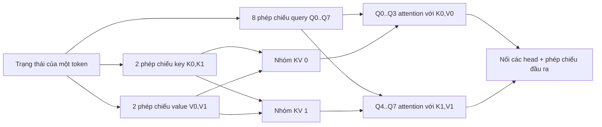

# Grouped-Query Attention (GQA)

**Cải tiến:** multi-head attention (MHA), với multi-query attention (MQA) là
đầu kia của phổ thiết kế.
**Mục tiêu chính:** duy trì phần lớn chất lượng của MHA trong khi giảm kích thước
KV cache tự hồi quy và băng thông bộ nhớ.

**Giải thích đơn giản:** Grouped-Query Attention (GQA) là kỹ thuật giảm **bộ nhớ
KV cache sử dụng** và **băng thông bộ nhớ** bằng cách cho phép nhiều query head
dùng chung các key head và value head. Cách này giảm đáng kể lượng dữ liệu K/V
phải lưu và đọc khi suy luận, đồng thời duy trì chất lượng mô hình gần tương đương
multi-head attention tiêu chuẩn.

## Từ MHA đến MQA rồi GQA

Với chiều rộng mô hình `d_model`, MHA chia phép tính attention thành `Hq`
query head. MHA thông thường cấp cho mỗi query head các key head và value head
riêng:

$$
\begin{aligned}
\mathrm{MHA}:&\quad H_q\ \text{query head},\ H_q\ \text{key head},\ H_q\ \text{value head} \\
\mathrm{MQA}:&\quad H_q\ \text{query head},\ 1\ \text{key head},\ 1\ \text{value head} \\
\mathrm{GQA}:&\quad H_q\ \text{query head},\ H_{kv}\ \text{key head},\ H_{kv}\ \text{value head},
\quad 1 < H_{kv} < H_q
\end{aligned}
$$

MQA giảm mạnh lưu lượng cache, nhưng việc dùng chung một biểu diễn K/V cho mọi
query head có thể làm giảm chất lượng. GQA chọn điểm trung gian: chia `Hq` query
head thành `Hkv` nhóm, sau đó cho mọi query trong một nhóm dùng chung một K/V
head. Bài báo GQA gốc báo cáo chất lượng gần MHA và tốc độ tương đương MQA sau
quá trình huấn luyện chuyển đổi.
([Ainslie et al., 2023](https://arxiv.org/abs/2305.13245))

Với query head `h`, nhóm KV của nó được định nghĩa là:

$$
g(h) = \left\lfloor \frac{hH_{kv}}{H_q} \right\rfloor
$$

$$
\operatorname{head}_h
= \operatorname{softmax}\!\left(
\frac{Q_hK_{g(h)}^{\top}}{\sqrt{d_{\text{head}}}} + M_{\text{causal}}
\right)V_{g(h)}
$$

Phép softmax và trộn value vẫn được thực hiện độc lập cho từng query head. Chỉ
các phép chiếu K/V và trạng thái K/V trong cache được dùng chung.

## Ví dụ về luồng dữ liệu

Giả sử `Hq = 8` và `Hkv = 2`:

Trong quá trình sinh, với mỗi token mới mô hình chỉ nối thêm hai K head và hai
V head vào cache, thay vì tám head cho mỗi loại.

## Vì sao giải mã trở nên ít tốn kém hơn

Bỏ qua batch, số tầng, số byte trên mỗi số vô hướng và phần đệm triển khai, dung
lượng cache trên mỗi tầng xấp xỉ:

$$
N_{\mathrm{KV}}
= 2 \times L_{\mathrm{sequence}} \times H_{kv} \times d_{\mathrm{head}}
$$

MHA sử dụng `Hkv = Hq`. Do đó tỷ lệ cache của GQA so với MHA là `Hkv / Hq`.
Trong ví dụ 8 query/2 KV, dung lượng lưu K/V và lưu lượng bộ nhớ K/V bằng khoảng
một phần tư MHA. Điều này đặc biệt quan trọng khi giải mã từng token, vốn thường
bị giới hạn bởi việc đọc trọng số mô hình và KV cache ngày càng lớn thay vì bởi
năng lực tính toán thuần túy.

Lợi ích này có các giới hạn:

- GQA không loại bỏ phép attention `QK^T` trên mọi vị trí đã lưu trong cache.
- Giai đoạn prefill vẫn phải thực hiện full-attention với độ phức tạp bậc hai,
  trừ khi một phương pháp khác thay đổi mẫu hoặc thuật toán attention.
- Ít KV head hơn tạo ra nút thắt biểu diễn; `Hkv` là lựa chọn thiết kế đánh đổi
  giữa chất lượng với cache/thông lượng.
- Mức giảm cache về lý thuyết có thể không chuyển thành mức tăng tốc tương ứng
  theo thời gian thực, vì kernel, batching, lượng tử hóa và mức sử dụng phần cứng
  cũng có ảnh hưởng.

## Cách Qwen sử dụng GQA

**Đã xác minh:** Qwen2 thay thế rõ ràng MHA thông thường bằng GQA để tối ưu mức
sử dụng KV cache và thông lượng. Ví dụ, mô hình 7B dùng 28 query head và 4 KV
head. ([Báo cáo kỹ thuật Qwen2, §2.2 và Bảng 1](https://arxiv.org/abs/2407.10671))

**Đã xác minh:** Qwen3 tiếp tục sử dụng GQA. Qwen3-8B dùng 32 query head và 8
KV head; Qwen3-235B-A22B dùng 64 query head và 4 KV head.
([Báo cáo kỹ thuật Qwen3, Bảng 1–2](https://arxiv.org/abs/2505.09388))

Các tầng full-attention của Qwen3-Next vẫn dùng K/V head theo nhóm: model card
của 80B-A3B liệt kê 16 Q head và 2 KV head. Ba tầng còn lại trong mỗi chu kỳ
bốn tầng là các tầng Gated DeltaNet, vì vậy GQA chỉ mô tả một phần tư
full-attention của stack lai này.
([Model card Qwen3-Next](https://huggingface.co/Qwen/Qwen3-Next-80B-A3B-Instruct))
