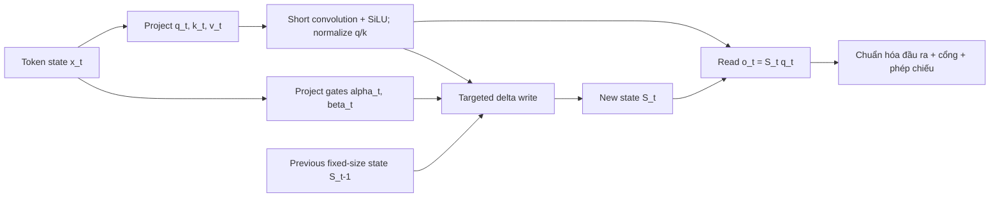

# Gated DeltaNet và attention lai

**Cải thiện:** chú ý đầy đủ bậc hai cho các chuỗi dài và tuyến tính đơn giản hơn
các lựa chọn thay thế định kỳ như Mamba2 hoặc DeltaNet.
**Mục tiêu chính:** duy trì bộ nhớ khóa-giá trị định kỳ có kích thước cố định có thể vừa
quên trên toàn cầu và cập nhật một liên kết cụ thể, sau đó kết hợp nó với định kỳ
toàn tâm toàn ý phục hồi khả năng truy xuất chính xác.

**Giải thích đơn giản:** Cơ chế chú ý tuyến tính giúp giảm độ phức tạp của sự chú ý xuống **O(n)** bằng cách thay thế sự chú ý từ mã thông báo này sang mã thông báo khác bằng **bộ nhớ lặp lại được chia sẻ**. Mỗi mã thông báo sử dụng **Q, K và V** để đọc và cập nhật bộ nhớ này thông qua **quy tắc delta** , trong khi **cổng đã học**(Mamba2) kiểm soát **lượng nội dung cập nhật được viết** , cho phép mô hình lưu giữ thông tin quan trọng và bỏ qua các cập nhật ít liên quan hơn.

## Từ sự chú ý hoàn toàn đến trạng thái tái diễn

Ở bước giải mã `t`, sự chú ý nguyên nhân đầy đủ sẽ lưu trữ mọi cặp K/V trước đó và
so sánh truy vấn hiện tại với tất cả các khóa. Điều này mang lại cho nội dung địa chỉ
truy cập nhưng bộ đệm KV phát triển tuyến tính theo độ dài chuỗi và điền trước đầy đủ
sự chú ý là bậc hai.

Thay vào đó, sự chú ý tuyến tính cơ bản có thể tóm tắt lịch sử ở trạng thái ma trận:

$$
\begin{aligned}
S_t &= S_{t-1} + v_tk_t^{\top}, \\
o_t &= S_tq_t
\end{aligned}
$$

Hình dạng trạng thái phụ thuộc vào kích thước đầu chứ không phải độ dài chuỗi. tính kết hợp
thay thế việc quét rõ ràng trên tất cả các mã thông báo trước đó bằng một bản cập nhật định kỳ. các
chi phí là nén: nhiều liên kết K/V chia sẻ một ma trận có kích thước cố định và có thể
va chạm.

## Tại sao cần cả quy tắc cổng và quy tắc delta

Phân rã vô hướng Mamba2-like làm tăng thêm sự lãng quên toàn cầu:

$$
S_t = \alpha_t S_{t-1} + v_tk_t^{\top},
\qquad 0 < \alpha_t < 1
$$

`alpha_t` nhỏ nhanh chóng xóa trạng thái cũ, nhưng nó làm hỏng mọi liên kết
cùng nhau. Nó không thể ghi đè có chọn lọc chỉ vào bộ nhớ được đánh địa chỉ bởi `k_t`.

DeltaNet thực hiện điều chỉnh có mục tiêu:

$$
S_t
= S_{t-1}\left(I-\beta_tk_tk_t^{\top}\right)
+ \beta_tv_tk_t^{\top}
$$

Tương tự, nó trừ đi lỗi dự đoán hiện tại tại khóa `k_t` và ghi
giá trị mới. Điều này thay đổi có chọn lọc một liên kết, nhưng thiếu một liên kết toàn cầu nhanh chóng.
đặt lại khi bối cảnh thay đổi.

Gated DeltaNet kết hợp chúng:

$$
\begin{aligned}
S_t
&= S_{t-1}\left[\alpha_t\left(I-\beta_tk_tk_t^{\top}\right)\right]
  + \beta_tv_tk_t^{\top}, \\
o_t &= S_tq_t
\end{aligned}
$$

- `alpha_t -> 0`: nhanh chóng quên hầu hết trạng thái cũ;
- `alpha_t -> 1`: hoạt động giống như bản cập nhật delta được nhắm mục tiêu;
- `beta_t`: kiểm soát mức độ liên kết K/V mới thay thế liên kết cũ
  giá trị tại khóa đó.

Phương trình và cách giải thích này đến từ bài báo Gated DeltaNet ban đầu.
([Yang, Kautz và Hatamizadeh, 2024/ICLR 2025, §3](https://arxiv.org/abs/2412.06464))

## Luồng dữ liệu mã thông báo



Trong quá trình giải mã tuần tự, chỉ có trạng thái được chuyển tiếp. Trong quá trình đào tạo,
sự tái diễn sẽ sử dụng không đúng mức GPUs nếu được đánh giá từng mã thông báo. Giấy
rút ra một thuật toán song song từng đoạn bằng cách sử dụng các dạng ma trận WY/UT nhỏ gọn sao cho mỗi
chunk trở thành phép nhân ma trận thân thiện với lõi tensor trong khi chuỗi tổng thể
độ phức tạp vẫn tuyến tính.

## Ví dụ về bộ nhớ

Giả sử trạng thái đã học được các liên kết cho các khóa giống như `user_name`,
`current_city` và `task`:

1. Một giá trị `current_city` mới xuất hiện. Thuật ngữ delta điều chỉnh trạng thái chủ yếu
   dọc theo hướng phím đó thay vì xóa bộ nhớ `user_name` không liên quan.
2. Cuộc trò chuyện chuyển sang một tài liệu hoàn toàn mới. Một chiếc `alpha_t` nhỏ
   phân rã toàn bộ trạng thái cũ một cách nhanh chóng.
3. Truy vấn hiện tại đọc kết hợp có trọng số thông qua `S_t q_t`.

Đây là một sự tương tự với việc cập nhật ma trận, không phải bằng chứng cho thấy một cái đầu được đào tạo thực sự
lưu trữ các trường con người có thể đọc được.

## Tại sao Qwen sử dụng ngăn xếp tuyến tính kết hợp thay vì tuyến tính thuần túy

Bộ nhớ lặp lại có kích thước cố định vẫn mất chi tiết khi nhiều liên kết xung đột.
Bài báo Gated DeltaNet tìm thấy các mô hình lặp lại thuần túy đằng sau sự chú ý đầy đủ về
một số nhiệm vụ truy xuất trong thế giới thực, trong khi các kết hợp có sự chú ý thực hiện tốt hơn.
([giấy §§4 và những hạn chế](https://arxiv.org/abs/2412.06464))

Do đó, Qwen3-Next sử dụng mẫu 3:1:

```text
DeltaNet có kiểm soát -> MoE
DeltaNet có kiểm soát -> MoE
DeltaNet có kiểm soát -> MoE
Kiểm soát hoàn toàn sự chú ý -> MoE
lặp lại 12 lần
```

Các lớp hồi quy truyền bá trạng thái nén tầm xa với giá rẻ. Mỗi phần tư
lớp cung cấp sự chú ý rõ ràng từ mã thông báo đến mã thông báo để truy xuất chính xác và
trộn. Qwen cũng thêm cổng đầu ra vào các lớp chú ý đầy đủ và sử dụng GQA
ở đó (16 đầu Q, 2 đầu KV trong 80B-A3B).
([bài đăng chính thức của Qwen3-Next](https://qwen.ai/blog?id=e34c4305036ce60d55a0791b170337c2b70ae51d),
[thẻ mẫu](https://huggingface.co/Qwen/Qwen3-Next-80B-A3B-Instruct))

## Sự phức tạp và sự đánh đổi

| Bất động sản | Toàn tâm chú ý | DeltaNet có cổng |
| ---------------------------- | ------------------------------- | -------------------------------------------------- |
| Trộn mã thông báo điền trước | Bậc hai theo độ dài dãy | Tuyến tính theo độ dài chuỗi với thuật toán chunkwise |
| Giải mã lịch sử | Phát triển bộ đệm KV | Trạng thái ma trận hồi quy có kích thước cố định |
| Quyền truy cập chính xác vào mã thông báo cũ | Đường dẫn có thể định địa chỉ nội dung mạnh mẽ | nén; có thể xảy ra va chạm |
| Đào tạo song song | Matmul lớn tự nhiên | Yêu cầu hạt nhân chunkwise chuyên dụng |
| Phục vụ hỗ trợ | Trưởng thành | Dành riêng cho kiến ​​trúc và kernel |

Thẻ Qwen3-Next chính thức tuyên bố thông lượng suy luận 10× trên bối cảnh 32K
so với Qwen3-32B cho mô hình/hệ thống được thử nghiệm của nó, nhưng kết quả đó kết hợp Gated
DeltaNet, MoE thưa thớt, kích thước mô hình, hạt nhân và thiết lập phân phối. Nó không nên
chỉ được quy cho phương trình truy hồi.

**Dòng dõi đã được xác minh:** Bản thân Qwen3 vẫn là một dòng sản phẩm dày đặc/MoE được mọi người chú ý.
DeltaNet có cổng đầu tiên vào dòng này thông qua Qwen3-Next; chính thức sau Qwen
các tài liệu mô tả nó tiếp tục đi vào Qwen3.5/3.6.

**Tuyên bố từ chối trách nhiệm:** Gated DeltaNet **chưa phải là sự thay thế phổ biến** để thu hút sự chú ý của Transformer. Mặc dù nó làm giảm độ phức tạp của sự chú ý từ **O(n²)** xuống **O(n)** , nhưng nó nén thông tin trong quá khứ vào bộ nhớ lặp lại, điều này có thể đánh đổi một số độ trung thực khi truy xuất so với sự chú ý hoàn toàn. Lợi thế về hiệu quả của nó trở nên đáng chú ý nhất đối với **ngữ cảnh rất dài (100K–1M+ mã thông báo)** , trong khi đối với độ dài ngữ cảnh phổ biến hơn (ví dụ: **8K–32K mã thông báo** ), sự chú ý của Máy biến áp được tối ưu hóa thường đã đủ hiệu quả nên lợi ích thực tế sẽ nhỏ hơn.
([Bài đăng Qwen FlashQLA](https://qwen.ai/blog?id=flashqla))
