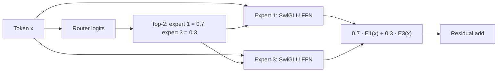

# Sparse Mixture-of-Experts (MoE)

**Cải tiến:** Máy biến áp FFN dày đặc áp dụng các tham số giống nhau cho mọi
mã thông báo.
**Mục tiêu chính:** tăng tổng dung lượng tham số trong khi chỉ kích hoạt một
tập hợp con nhỏ các tham số FFN cho mỗi mã thông báo

**Mô tả đơn giản:** Chia FFN thành nhiều chuyên gia chuyên biệt; mỗi token chỉ
được định tuyến đến một số chuyên gia FFN thay vì đi qua toàn bộ FFN dense.

## FFN dày đặc so với định tuyến chuyên gia thưa thớt

Trong một khối dày đặc, mỗi mã thông báo sử dụng một FFN:

$$
y = \operatorname{FFN}(x)
$$

Lớp MoE thay thế FFN đó bằng `N` chuyên gia cùng với bộ định tuyến đã học. Đối với mã thông báo
trạng thái `x`:

$$
\begin{aligned}
r &= W_{\mathrm{router}}x, \\
\mathcal{I}(x) &= \operatorname{TopK}(r,k), \\
p_i &= \frac{e^{r_i}}{\sum_{j\in\mathcal{I}(x)}e^{r_j}},
\qquad i\in\mathcal{I}(x), \\
\operatorname{MoE}(x)
&= \sum_{i\in\mathcal{I}(x)}p_iE_i(x)
\end{aligned}
$$

Mỗi `Expert_i` thường là FFN, thường là SwiGLU ở Qwen. Sự chú ý không được định tuyến
trong thiết kế thông thường này; mọi mã thông báo vẫn đi qua sự chú ý/mã thông báo
máy trộn, sau đó sử dụng các chuyên gia được lựa chọn thay thế cho một FFN dày đặc. Qwen2 mang lại điều này
cùng một công thức top-k được kiểm soát một cách rõ ràng.
([Báo cáo kỹ thuật Qwen2, §2.2.2](https://arxiv.org/abs/2407.10671))

## Luồng dữ liệu cấp mã thông báo

Giả sử bốn chuyên gia và định tuyến top 2:

Một token khác trong cùng đợt có thể chọn chuyên gia 0 và 2. Điều kiện này
việc thực thi cho phép mô hình lưu trữ nhiều hàm tham số hơn mức nó đánh giá
cho một mã thông báo.

## Tại sao tổng tham số và tham số hoạt động lại khác nhau

Để mỗi chuyên gia chứa các tham số `P_e` và để đường trục chung của người không phải chuyên gia
chứa `P_shared`:

$$
\begin{aligned}
P_{\mathrm{total}} &\approx P_{\mathrm{shared}}+NP_e, \\
P_{\mathrm{active/token}} &\approx P_{\mathrm{shared}}+kP_e
\end{aligned}
$$

Điều này giải thích những cái tên như `235B-A22B`: tồn tại tổng cộng khoảng 235B tham số,
nhưng có khoảng 22B tham gia vào lộ trình chuyển tiếp của một mã thông báo. FLOPs mỗi mã thông báo
có thể giống với một mô hình dày đặc nhỏ hơn nhiều mặc dù trạm kiểm soát có dung lượng lớn hơn nhiều.

Điều đó **không** có nghĩa là việc triển khai chỉ tốn chi phí cho số lượng tham số hoạt động:

- tất cả trọng lượng chuyên gia phải được lưu trữ ở đâu đó hoặc tìm nạp trên các thiết bị;
- sự song song của chuyên gia phân tán thực hiện việc gửi và trả lại mã thông báo từ tất cả đến tất cả;
- định tuyến không đồng đều tạo ra sự chậm trễ và lãng phí năng lực;
- các đợt nhỏ cho mỗi chuyên gia có thể làm giảm hiệu quả nhân ma trận;
- bộ định tuyến và trọng số chuyên gia sẽ thêm bộ nhớ ngay cả khi chuyên gia không sử dụng mã thông báo.

## Chuyên môn hóa, chia sẻ chuyên gia và cân bằng tải

Định tuyến tạo ra khả năng chuyên môn hóa, nhưng các nhãn chuyên gia như
Không nên cho rằng “chuyên gia toán học” hoặc “chuyên gia người Pháp” mà không có khả năng diễn giải được
chứng cớ. Mục tiêu đào tạo chỉ chọn ra những chuyên gia có ích cho việc giảm tổn thất.

Hai lựa chọn thiết kế tái diễn ở Qwen:

1. **Chuyên gia tinh tế.** Chia dung lượng FFN lớn thành nhiều hơn, nhỏ hơn
   các chuyên gia và kích hoạt một số. Với các thông số tổng và hoạt động bằng nhau, điều này
   mang đến cho bộ định tuyến nhiều sự kết hợp chuyên nghiệp hơn.
2. **Chuyên gia được chia sẻ.** Luôn thực hiện một hoặc nhiều chuyên gia về kiến ​​thức chung,
   trong khi các chuyên gia định tuyến chuyên môn. Điều này cải thiện phạm vi phủ sóng được chia sẻ nhưng thêm
   tính toán luôn hoạt động.

Bộ định tuyến có thể thu gọn vào một số chuyên gia nổi tiếng. Tổn thất cân bằng tải phụ trợ,
chính quy hóa bộ định tuyến, giới hạn dung lượng, loại bỏ mã thông báo hoặc định tuyến toàn cầu
số liệu thống kê được sử dụng để phân phối công việc. Tài liệu giấy Máy biến áp chuyển mạch
cả lợi thế mở rộng quy mô và các vấn đề không ổn định về truyền thông/đào tạo của MoE thưa thớt.
([Fedus và cộng sự, 2021](https://arxiv.org/abs/2101.03961))

## Qwen tiến hóa

| Gia đình | Thiết kế chuyên nghiệp | Ý nghĩa kiến ​​trúc |
| ------------------------- | --------------------------------------- | -------------------------------------------------------------------------------- |
| Qwen2-57B-A14B | 64 được định tuyến, top 8, cộng với 8 chuyên gia được chia sẻ | FFNs được định tuyến chi tiết cộng với FFNs chung luôn hoạt động |
| Qwen3-30B-A3B / 235B-A22B | 128 được định tuyến, top 8, không có chuyên gia chia sẻ | Nhiều lựa chọn chuyên môn hơn; cân bằng hàng loạt toàn cầu khuyến khích chuyên môn hóa |
| Qwen3-Next-80B-A3B | Tổng cộng 512, top 10 được định tuyến cộng với 1 lượt chia sẻ | Tỷ lệ hoạt động/tổng ​​thấp hơn nhiều; mỗi lớp trộn mã thông báo lai được theo sau bởi MoE |

Cấu hình Qwen2 được ghi lại trong Bảng 1 và thảo luận về định tuyến.
([Báo cáo kỹ thuật Qwen2](https://arxiv.org/abs/2407.10671)) Tài liệu Qwen3
Định tuyến 128/8, không có chuyên gia chia sẻ và cân bằng tải hàng loạt toàn cầu.
([Báo cáo kỹ thuật Qwen3, §2](https://arxiv.org/abs/2505.09388)) Qwen3-Next's
thẻ chính thức cung cấp cấu hình 512/10+1.
([Thẻ mẫu Qwen3-Next](https://huggingface.co/Qwen/Qwen3-Next-80B-A3B-Instruct))

Kết luận đúng không phải là “MoE sử dụng ít tham số hơn”. Nó sử dụng **được lưu trữ nhiều hơn
các tham số nhưng ít tham số hơn trên mỗi mã thông báo**, trao đổi tính toán dày đặc để định tuyến,
truyền thông và độ phức tạp của hệ thống.
