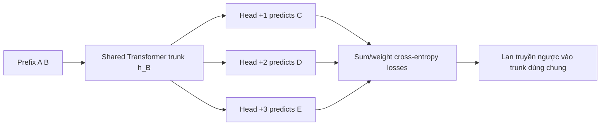
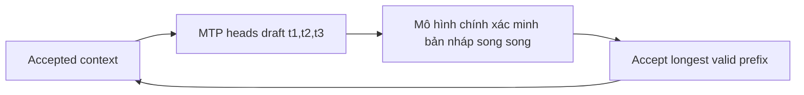

# Dự đoán nhiều token (MTP)

**Cải thiện:** huấn luyện mô hình ngôn ngữ chỉ dự đoán token kế tiếp và giải mã tự
hồi quy mỗi lần forward chỉ sinh một token.
**Mục tiêu chính:** giám sát nhiều vị trí trong tương lai từ từng bối cảnh và tái sử dụng
các yếu tố dự đoán bổ sung dưới dạng dự thảo đề xuất giải mã suy đoán.

## Dự đoán mã thông báo tiếp theo so với MTP

Mô hình ngôn ngữ nhân quả tiêu chuẩn huấn luyện một mục tiêu tại vị trí `t`:

$$
\mathcal{L}_{\mathrm{NTP}}
= -\log p\!\left(x_{t+1}\mid x_{\le t}\right)
$$

Công cụ dự đoán mã thông báo `n` chia sẻ đường trục Transformer nhưng bổ sung thêm dự đoán trong tương lai
đầu:

$$
\begin{aligned}
h_t &= \operatorname{Trunk}\!\left(x_{\le t}\right), \\
p_j &= \operatorname{Head}_j(h_t),
\qquad j\in\{1,\ldots,n\}, \\
\mathcal{L}_{\mathrm{MTP}}
&= -\sum_{j=1}^{n}
\log p_j\!\left(x_{t+j}\mid x_{\le t}\right)
\end{aligned}
$$

Những người đứng đầu dự đoán song song các mức chênh lệch khác nhau trong tương lai. Họ không tạo nên tương lai
mã thông báo độc lập có điều kiện trong mô hình tự hồi quy cuối cùng; họ là
Trưởng ban đào tạo phụ trợ và dự thảo cơ chế. Bài báo MTP ban đầu lập luận
rằng điều này buộc đường trục phải thể hiện các quyết định ít cục bộ hơn và báo cáo lớn hơn
mang lại lợi ích ở quy mô mô hình lớn hơn, đặc biệt là về việc tạo mã.
([Gloeckle và cộng sự, 2024](https://arxiv.org/abs/2404.19737))

## Luồng dữ liệu đào tạo

Đối với mã thông báo đầu vào `[A, B, C, D, E]` và ba đầu dự đoán:

Việc cụ thể hóa các bản ghi một cách ngây thơ cho mỗi cái đầu nhân lên từ vựng-logit đỉnh cao
ký ức. Việc thực hiện bài báo đánh giá và truyền lại các đầu
tuần tự trong khi tích lũy độ dốc thân cây, giải phóng khối lượng lớn của một đầu
logit tensor trước khi đánh giá tiếp theo.

## Suy luận: đề xuất rồi xác minh

Khi suy luận, đầu `+1` thông thường vẫn có thể tạo một mã thông báo mỗi lần. ĐẾN
đạt được tốc độ, các đầu bổ sung đề xuất một khối ngắn:

Việc xác minh là cần thiết. Đơn giản chỉ cần nối thêm tất cả tương lai được dự đoán độc lập
mã thông báo sẽ thay đổi phân phối đầu ra của mô hình và kết hợp không nhất quán
đoán. Giải mã tự suy đoán/theo khối hoặc dựa trên cây chỉ chấp nhận mã thông báo
vượt qua quy tắc xác minh của mô hình chính, sau đó tiếp tục lại từ quy tắc xác minh đầu tiên
sự từ chối. Tăng tốc phụ thuộc vào:

$$
\text{effective speedup}
\;\propto\;
\frac{\text{average accepted tokens per verification}}
{\text{draft cost}+\text{verification cost}}
$$

Nếu hầu hết các bản nháp bị từ chối, MTP có thể bổ sung thêm chi phí. Nếu một số được chấp nhận, một
đường trục đắt tiền nâng cao nhiều vị trí đầu ra. Giấy gốc
báo cáo tốc độ suy luận lên tới 3× trong các mô hình dự đoán 4 mã thông báo đã được thử nghiệm của nó, không phải
bảo đảm phổ quát.

## Sự cân bằng giữa năng lực và hệ thống

- MTP cung cấp khả năng giám sát dày đặc hơn trong tương lai từ cùng một văn bản và có thể khuyến khích
  các tính năng có tầm nhìn dài hơn.
- Các đầu bổ sung tiêu tốn các tham số và công việc huấn luyện, mặc dù chi phí của chúng thấp
  liên quan đến một đường trục chia sẻ lớn và có thể được sắp xếp theo lịch trình bộ nhớ.
- Đường chân trời dự đoán tốt nhất phụ thuộc vào kích thước và dữ liệu của mô hình. Trong bản gốc
  thử nghiệm, dự đoán bốn mã thông báo có thể hồi quy trên một số mô hình nhỏ hoặc
  cài đặt ngôn ngữ tự nhiên nhiều lựa chọn.
- Tăng tốc suy luận yêu cầu một công cụ hiểu được điểm kiểm tra MTP,
  xác minh cây/khối và KV/quản lý trạng thái.
- MTP bổ sung cho MoE hoặc Gated DeltaNet: nó thay đổi mục tiêu đào tạo
  và quy trình giải mã, không phải trình trộn mã thông báo hoặc phương trình FFN.

## Qwen sử dụng nó như thế nào

**Đã xác minh:** Qwen3-Next giới thiệu MTP gốc để cải thiện quá trình đào tạo trước và
cung cấp các đề xuất có tính chấp nhận cao cho việc giải mã đầu cơ. Bài đăng chính thức
cũng mô tả quá trình đào tạo nhiều bước nhằm phù hợp với suy luận nhiều bước và
cải thiện sự chấp nhận trong việc phục vụ thực sự.
([bài đăng chính thức của Qwen3-Next](https://qwen.ai/blog?id=e34c4305036ce60d55a0791b170337c2b70ae51d))

**Cảnh báo về thời gian chạy:** thẻ mẫu chính thức nêu rõ rằng MTP nói chung không được hỗ trợ
có sẵn thông qua Máy biến áp ôm mặt đơn giản và khuyên dùng
các khung suy luận như SGLang hoặc vLLM. Do đó, việc tải mô hình cơ sở
thành công không chứng minh rằng tính năng tăng tốc MTP đang hoạt động.
([Thẻ mẫu Qwen3-Next](https://huggingface.co/Qwen/Qwen3-Next-80B-A3B-Instruct))
