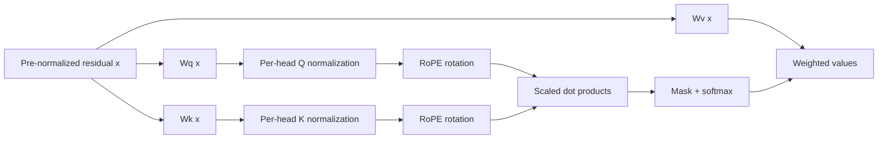

# Query-Key Normalization (QK-Norm)

**Cải thiện:** attention chỉ dựa vào hệ số chuẩn `1 / sqrt(d_head)` để kiểm soát logit.
**Mục tiêu chính:** ngăn cường độ Q/K đẩy mức độ chú ý lên mức cực độ
giá trị và độ bão hòa softmax trong quá trình đào tạo quy mô lớn.

## Vấn đề: độ lớn đã học có thể lấn át sự giống nhau

Sự chú ý của sản phẩm chấm có tỷ lệ tiêu chuẩn sẽ tính toán:

$$
\begin{aligned}
\ell_{ij} &= \frac{q_i^{\top}k_j}{\sqrt{d_{\mathrm{head}}}}, \\
a_i &= \operatorname{softmax}\!\left(\ell_{i,:}\right)
\end{aligned}
$$

Hệ số căn bậc hai bù cho phương sai dự kiến ​​khi khởi tạo, nhưng
nó không ngăn cản sự phát triển của các chỉ tiêu Q và K đã học. Khoảng cách logit rất lớn khiến
softmax gần một nóng; độ dốc thông qua xác suất bão hòa trở nên kém
nhật ký có điều kiện và cực đoan có thể xảy ra trước sự phân kỳ huấn luyện.

QK-Norm chèn chuẩn hóa sau các phép chiếu Q/K và trước dấu chấm
sản phẩm:

$$
\begin{aligned}
q_i &= \operatorname{Norm}\!\left(W_qx_i\right), \\
k_j &= \operatorname{Norm}\!\left(W_kx_j\right), \\
\ell_{ij} &= \frac{q_i^{\top}k_j}{\sqrt{d_{\mathrm{head}}}}
\end{aligned}
$$

`Norm` chính xác được triển khai cụ thể. Giấy QKNorm ban đầu sử dụng
L2-normalized Q/K và thang đo đã học thay vì `sqrt(d_head)`; nó thúc đẩy
phương pháp ngăn chặn độ bão hòa softmax tùy ý.
([Henry và cộng sự, 2020](https://arxiv.org/abs/2010.04245))
Công việc được trích dẫn bởi Qwen3 áp dụng LayerNorm cho các truy vấn và khóa được chiếu cho
ổn định Máy biến áp Vision 22B.
([Dehghani và cộng sự, 2023, §2](https://proceedings.mlr.press/v202/dehghani23a.html))
Do đó, “QK-Norm” đặt tên cho vị trí và mục đích chứ không phải một phương trình phổ quát.

## Nó nằm ở đâu trong khối

RMSNorm trên `x` không thể đảm bảo Q và K được giới hạn vì `Wq` và `Wk`
có thể khuếch đại các hướng cụ thể. QK-Norm hoạt động theo những dự đoán đó. RoPE là
một phép quay trực giao, do đó khi chuẩn hóa trước RoPE, nó không thay đổi
định mức Q/K.

## Ví dụ về độ lớn đơn giản

Hai cặp truy vấn/khóa có thể có cùng góc độ nhưng các chỉ tiêu rất khác nhau:

$$
\begin{aligned}
q_1=\begin{bmatrix}1\\0\end{bmatrix},\quad
k_1=\begin{bmatrix}1\\0\end{bmatrix}
&\quad\Longrightarrow\quad q_1^{\top}k_1=1, \\
q_2=\begin{bmatrix}100\\0\end{bmatrix},\quad
k_2=\begin{bmatrix}100\\0\end{bmatrix}
&\quad\Longrightarrow\quad q_2^{\top}k_2=10{,}000
\end{aligned}
$$

Nếu không có QK-Norm, chỉ riêng cường độ cũng có thể tạo ra logit softmax lớn. L2
chuẩn hóa ánh xạ cả hai cặp tới sản phẩm chấm 1; Các biến thể LayerNorm/RMSNorm cũng
quy mô kiểm soát, mặc dù hình dạng chính xác của chúng khác nhau. Sau đó, một thang đo đã học có thể
khôi phục nhiệt độ chú ý thích hợp mà không cho phép vectơ tùy ý
tăng trưởng bình thường.

## Lợi ích và giới hạn

- Nó trực tiếp kiểm soát một nguồn bùng nổ logit chú ý đã biết.
- Nó có thể cho phép các cơ sở đào tạo quy mô lớn tích cực hơn, nhưng nó không phải là một
  chữa trị hoàn toàn cho sự mất ổn định của trình tối ưu hóa hoặc kích hoạt dư lớn.
- Việc chuẩn hóa bổ sung thêm các tham số/thao tác và phải được hợp nhất tốt cho
  suy luận hiệu quả.
- Nó có thể loại bỏ thông tin được mã hóa hoàn toàn ở độ lớn Q/K; đã học được
  quy mô khôi phục một phần tính linh hoạt.
- QK-Norm tách biệt với cổng đầu ra, giới hạn logit, mức chú ý và
  chuẩn hóa dòng dư. Những cơ chế đó nhắm vào các bệnh lý khác nhau.

## Qwen sử dụng nó như thế nào

**Đã xác minh:** Qwen3 loại bỏ thành kiến ​​QKV được sử dụng trong Qwen2 và giới thiệu QK-Norm
“để đảm bảo đào tạo ổn định.” Báo cáo không khẳng định QK-Norm phải chịu trách nhiệm
để cải thiện điểm chuẩn độc lập, do đó việc phân bổ nhân quả không nên
được thực hiện. ([Báo cáo kỹ thuật Qwen3, §2](https://arxiv.org/abs/2505.09388))

Việc triển khai Qwen3 tích hợp sử dụng RMSNorm theo đầu riêng biệt trên
dự kiến ​​các tensor Q và K trước khi áp dụng RoPE; điều này cụ thể hơn
tên chung được sử dụng trong báo cáo.
([Triển khai Transformers Qwen3](https://github.com/huggingface/transformers/blob/main/src/transformers/models/qwen3/modeling_qwen3.py))

**Đã xác minh:** Qwen3-Next báo cáo rằng một số trọng số chuẩn hóa trong Qwen3
thiết kế phát triển lớn bất thường. Nó di chuyển đến RMSNorm không tâm, giảm trọng lượng
như một phần của việc thiết kế lại độ ổn định rộng hơn. Đây là bằng chứng cho thấy QK-Norm hữu ích
nhưng không phải là giải pháp cuối cùng hoặc miễn phí.
([bài đăng kiến ​​trúc Qwen3-Next chính thức](https://qwen.ai/blog?id=e34c4305036ce60d55a0791b170337c2b70ae51d))
