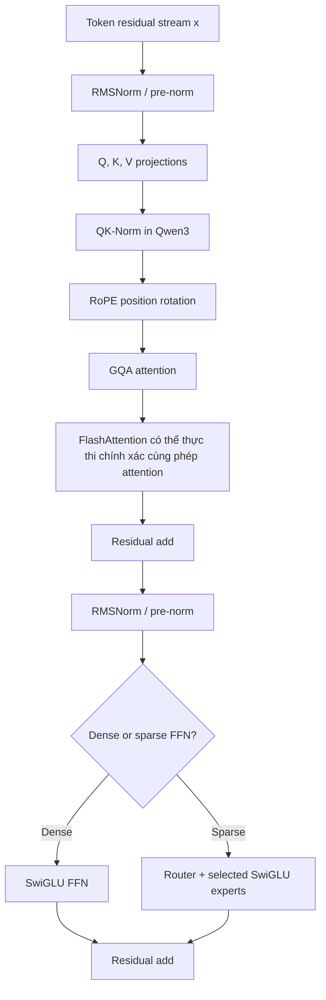

# Các mô-đun LLM hiện đại và vị trí của chúng ở Qwen

**Ngày nghiên cứu:** 2026-07-20
**Phạm vi:** các mô-đun phía bộ giải mã làm thay đổi đáng kể sự chú ý của LLM hiện đại,
FFN, chuẩn hóa, hành vi ngữ cảnh dài, mục tiêu đào tạo hoặc chi phí suy luận.

## Bức tranh kiến ​​trúc

Khối Qwen hiện đại không phải là sự thay thế hoàn toàn mới cho Transformer. Đó là
chủ yếu là một chuỗi các thay thế được nhắm mục tiêu xung quanh khối dư ban đầu:

Các mô hình Qwen sau này giới thiệu một sự thay đổi lớn hơn đối với đường dẫn trộn mã thông báo. Qwen3-Next
lặp lại ba lớp DeltaNet có cổng, theo sau là một lớp chú ý có cổng đầy đủ,
trong khi mỗi lớp vẫn có một lớp con MoE. Nó cũng thêm dự đoán nhiều mã thông báo
để huấn luyện và giải mã suy đoán. Thẻ mẫu chính thức chỉ định
bố cục như `12 × (3 × (Gated DeltaNet → MoE) → 1 × (Gated Attention → MoE))`.
([Thẻ mẫu Qwen3-Next](https://huggingface.co/Qwen/Qwen3-Next-80B-A3B-Instruct))

## Cái gì cải thiện cái gì

| Mô-đun mới | Người tiền nhiệm chính | Cải tiến chính | Nó **không** giải quyết được gì |
|---|---|---|---|
| [Mã thông báo BBPE](BBPE_Tokenizer.md) | Mã thông báo từ phụ, ký tự hoặc cấp ký tự | Sử dụng cơ sở byte phổ quát cộng với các kết hợp đã học để bao phủ mở và mã hóa đa ngôn ngữ/mã nhỏ gọn | Nó không đảm bảo hiệu quả mã thông báo như nhau, ranh giới ngữ nghĩa hoặc bảo toàn trước khi chuẩn hóa |
| [RoPE](RoPE.md) | Nhúng vị trí tuyệt đối phụ gia | Làm cho điểm chú ý phụ thuộc một cách tự nhiên vào sự dịch chuyển tương đối | Ngoại suy ngữ cảnh dài ngoài đào tạo không được đảm bảo |
| [GQA](GQA.md) | Chú ý nhiều đầu (MHA) | Thu hẹp băng thông bộ nhớ đệm và bộ giải mã KV | Nó không loại bỏ sự chú ý điền trước bậc hai |
| [FlashChú ý](FlashAttention.md) | Thực hiện chú ý cụ thể hóa | Tính toán sự chú ý chính xác với lưu lượng HBM và bộ nhớ tạm thời ít hơn nhiều | Nó không thay đổi kết quả toán học của sự chú ý hoặc phương trình bậc hai FLOPs |
| [SwiGLU](SwiGLU.md) | ReLU/GELU hai ma trận FFN | Thêm một cổng nhân phụ thuộc vào đầu vào | Nó bổ sung thêm phép chiếu thứ ba và không tự động rẻ hơn |
| [RMSNorm](RMSNorm.md) | LớpNorm | Loại bỏ việc tập trung vào giá trị trung bình và đơn giản hóa việc chuẩn hóa | Nó bảo toàn tính bất biến của thang đo, không phải tính bất biến của dịch chuyển |
| [QK-Norm](QK_Norm.md) | Chỉ chia tỷ lệ nhật ký theo `sqrt(d_head)` | Kiểm soát cường độ Q/K và tăng trưởng logit chú ý | Nó không thay thế chuẩn hóa dòng dư |
| [MoE thưa thớt](MoE.md) | Một FFN dày đặc cho mỗi mã thông báo | Tăng dung lượng tham số mà không cần kích hoạt tất cả tham số trên mỗi mã thông báo | Giao tiếp, cân bằng định tuyến và tổng trọng lượng bộ nhớ vẫn còn đắt |
| [Sợi](YaRN.md) | RoPE trơn nằm ngoài chiều dài đã được huấn luyện của nó | Thay đổi tỷ lệ phổ tần RoPE và nhiệt độ chú ý | Nó không thay đổi toàn bộ chi phí bậc hai của sự chú ý |
| [DCA](DCA.md) | Khoảng cách RoPE thô trên các chuỗi rất dài | Lập chỉ mục lại các vùng khóa truy vấn trong, giữa và liên tiếp | Chi tiết vị trí ở khoảng cách xa được cố tình làm thô |
| [Gated DeltaNet](Gated_DeltaNet.md) | Chú ý softmax đầy đủ hoặc tái phát tuyến tính đơn giản hơn | Sử dụng bộ nhớ định kỳ có kích thước cố định với mục tiêu cập nhật và tính năng quên toàn cục | Trạng thái kích thước cố định vẫn có thể va chạm và mất chi tiết chính xác |
| [Dự đoán nhiều mã thông báo](Multi_Token_Prediction.md) | Đào tạo chỉ dành cho mã thông báo tiếp theo | Giám sát một số vị trí trong tương lai và cung cấp mã thông báo dự thảo để đầu cơ | Tăng tốc yêu cầu xác minh và công cụ suy luận hỗ trợ nó |

## Dòng dõi Qwen, không hề quá đáng

- **Đã xác minh:** Qwen2 ghi lại GQA, SwiGLU, RoPE, RMSNorm/pre-norm, DCA và
  YaRN; MoE của nó thay thế một ngân hàng chuyên gia được định tuyến cho FFN dày đặc.
  ([Báo cáo kỹ thuật Qwen2, §2.2](https://arxiv.org/abs/2407.10671))
- **Đã xác minh:** Qwen3 giữ lại GQA, SwiGLU, RoPE và RMSNorm/pre-norm, bổ sung thêm
  QK-Norm và thay đổi MoE của mình thành 128 chuyên gia chi tiết với tám chuyên gia được chọn
  mỗi mã thông báo và không có chuyên gia chia sẻ.
  ([Báo cáo kỹ thuật Qwen3, §2](https://arxiv.org/abs/2505.09388))
- **Đã xác minh:** Qwen3-Next thay thế ngăn xếp toàn diện bằng tổ hợp 3:1
  của Gated DeltaNet và thu hút sự chú ý hoàn toàn, sử dụng MoE thưa thớt hơn nhiều và bổ sung thêm
  MTP. ([bài đăng kiến ​​trúc Qwen3-Next chính thức](https://qwen.ai/blog?id=e34c4305036ce60d55a0791b170337c2b70ae51d))
- **Sự khác biệt quan trọng:** FlashAttention là sự lựa chọn hạt nhân/thuật toán, không phải là
  kiến trúc điểm kiểm tra đã học. Điểm kiểm tra Qwen có thể chạy có hoặc không có nó
  nếu ngăn xếp phân phát hỗ trợ cả hai cách triển khai chính xác. Qwen chính thức
  Hướng dẫn Qwen3-VL hiển thị nó dưới dạng tùy chọn
  Cài đặt `attn_implementation="flash_attention_2"`.
  ([Qwen3-VL README](https://github.com/QwenLM/Qwen3-VL/blob/main/README.md#flash-attention-2-to-speed-up-generation))

Các tập tin trong thư mục này tập trung vào cơ chế mô-đun. Dữ liệu đào tạo trước,
đào tạo sau, chế độ lý luận, sử dụng công cụ và kết hợp đa phương thức có thể chiếm ưu thế
hành vi có thể quan sát được, nhưng chúng tách biệt với các thay thế cấp khối
đã phân tích ở đây
