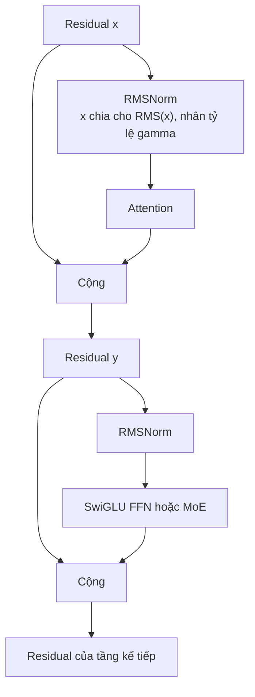

# RMSNorm và khối residual tiền chuẩn hóa

**Cải tiến:** LayerNorm với vai trò phép chuẩn hóa bên trong khối Transformer.
**Mục tiêu chính:** duy trì kiểm soát tỷ lệ trong khi loại bỏ phép trừ trung bình
của LayerNorm; trong Qwen, RMSNorm được dùng trước mỗi tầng con (`pre-norm`).

**Giải thích đơn giản:** thay hai phép tính nặng là **trung bình** và **phương sai**
bằng một phép tính **RMS** để tăng tốc mà không làm giảm hiệu năng trong các thiết
lập được báo cáo.

## So sánh LayerNorm và RMSNorm

Với vector ẩn `x` có chiều rộng `d`, LayerNorm tính:

$$
\begin{aligned}
\mu(x) &= \frac{1}{d}\sum_{i=1}^{d}x_i, \\
\sigma^2(x) &= \frac{1}{d}\sum_{i=1}^{d}\left(x_i-\mu(x)\right)^2, \\
\operatorname{LayerNorm}(x)
&= \gamma\odot
\frac{x-\mu(x)}{\sqrt{\sigma^2(x)+\varepsilon}}
+\beta
\end{aligned}
$$

Phép này bất biến với cả việc dịch tâm và đổi tỷ lệ dương của đầu vào. RMSNorm
loại bỏ phép trừ trung bình:

$$
\begin{aligned}
\operatorname{RMS}(x)
&= \sqrt{\frac{1}{d}\sum_{i=1}^{d}x_i^2+\varepsilon}, \\
\operatorname{RMSNorm}(x)
&= \gamma\odot\frac{x}{\operatorname{RMS}(x)}
\end{aligned}
$$

Dạng thường gặp trong LLM giữ hệ số tỷ lệ học được theo từng kênh `gamma` và
thường không có bias học được `beta`. Nó bất biến với đổi tỷ lệ nhưng không bất
biến khi cộng một độ dịch hằng. Giả thuyết trung tâm của bài báo RMSNorm là có
thể bỏ tính bất biến với dịch tâm của LayerNorm; bài báo báo cáo hiệu năng tác vụ
tương đương và **runtime thấp hơn** trong các thiết lập RNN và Transformer được
thử nghiệm.
([Zhang and Sennrich, 2019](https://arxiv.org/abs/1910.07467))

Mức giảm **7–64% runtime** trong bài báo là kết quả đo trên các mô hình và phần
cứng cụ thể, không phải mức tăng tốc phổ quát cho LLM hiện đại. Với các kernel
GPU hợp nhất hiện nay, lợi ích thực phụ thuộc vào lưu lượng bộ nhớ, mức hợp nhất,
dtype, chiều rộng ẩn và tỷ lệ tổng thời gian dành cho chuẩn hóa.

## Vì sao vị trí pre-norm là một vấn đề riêng

Loại phép chuẩn hóa và vị trí đặt phép chuẩn hóa là hai lựa chọn khác nhau.

Khối post-norm gốc:

$$
\begin{aligned}
y &= \operatorname{LayerNorm}\!\left(x+\operatorname{Attention}(x)\right), \\
z &= \operatorname{LayerNorm}\!\left(y+\operatorname{FFN}(y)\right)
\end{aligned}
$$

Khối pre-norm kiểu Qwen:

$$
\begin{aligned}
y &= x+\operatorname{Attention}\!\left(\operatorname{RMSNorm}(x)\right), \\
z &= y+\operatorname{FFN/MoE}\!\left(\operatorname{RMSNorm}(y)\right)
\end{aligned}
$$

Đường residual pre-norm chứa một đường đồng nhất từ `x` tới các tầng sau. Điều
này hỗ trợ dòng gradient qua một stack sâu vì dòng residual không bị buộc đi qua
phép chuẩn hóa tại mọi kết nối tắt. Sau đó RMSNorm kiểm soát độ lớn đầu vào của
từng tầng con mà không viết lại chính dòng residual.

## Ví dụ về luồng dữ liệu

Với trạng thái token đơn giản hóa `x = [3, 4]`, `gamma = [1, 1]` và không có epsilon:

$$
\begin{aligned}
\operatorname{RMS}(x)
&= \sqrt{\frac{3^2+4^2}{2}}
 = \sqrt{12.5}, \\
\operatorname{RMSNorm}(x)
&\approx \begin{bmatrix}0.849 & 1.131\end{bmatrix}
\end{aligned}
$$

RMSNorm giữ nguyên hướng của `x` và đổi tỷ lệ độ lớn RMS. LayerNorm trước tiên sẽ
trừ `3.5`, tạo ra một hướng chỉ dựa trên độ lệch so với trung bình. Ví dụ này làm
rõ phép tính nào đã bị loại bỏ; bản thân nó không chứng minh biểu diễn nào tốt hơn
trong mọi trường hợp.

## Giới hạn và chế độ lỗi

- RMSNorm không ràng buộc giá trị trung bình của activation. Các phần khác của
  mạng phải chịu được hoặc học cách xử lý độ dịch trung bình.
- Bản thân `gamma` học được có thể tăng; chuẩn hóa không bảo đảm hoàn toàn tránh
  logit attention bất ổn hoặc activation có độ lớn cực đại.
- Pre-norm giúp tối ưu stack sâu dễ hơn nhưng có thể thay đổi tỷ lệ biểu diễn và
  hành vi tầng cuối; thông thường vẫn áp dụng phép chuẩn hóa cuối trước LM head.
- RMSNorm và QK-Norm hoạt động ở các vị trí khác nhau: RMSNorm chuẩn hóa đầu vào
  khối; QK-Norm chuẩn hóa query/key head đã chiếu ngay trước phép tích vô hướng.

## Cách Qwen sử dụng RMSNorm

**Đã xác minh:** Qwen2 sử dụng RMSNorm với tiền chuẩn hóa để ổn định quá trình
huấn luyện. ([Báo cáo kỹ thuật Qwen2, §2.2.1](https://arxiv.org/abs/2407.10671))

**Đã xác minh:** Qwen3 tiếp tục dùng RMSNorm/pre-norm và bổ sung QK-Norm riêng.
([Báo cáo kỹ thuật Qwen3, §2](https://arxiv.org/abs/2505.09388))

**Đã xác minh:** Qwen3-Next báo cáo một biến thể xa hơn: RMSNorm có tâm bằng
không và weight decay, do nhóm quan sát thấy trọng số norm lớn bất thường với
thiết kế QK-Norm trước đó. Đây là sửa đổi về độ ổn định về sau, không phải định
nghĩa của RMSNorm thông thường.
([Bài viết kiến trúc Qwen3-Next chính thức](https://qwen.ai/blog?id=e34c4305036ce60d55a0791b170337c2b70ae51d))
