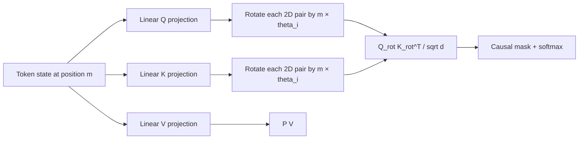

# Rotary Position Embedding (RoPE)

**Cải thiện:** embedding vị trí tuyệt đối dạng cộng được Transformer gốc sử dụng.
**Mục tiêu chính:** khiến điểm attention phụ thuộc tự nhiên vào vị trí tương đối,
đồng thời mã hóa vị trí bằng phép biến đổi xác định, chi phí thấp trên Q và K,
không cần embedding vị trí học được hoặc cố định.

**Giải thích đơn giản:** xoay **Q và K** theo góc dùng sin/cos, với tốc độ quay
phụ thuộc vị trí.

## Điều gì đã thay đổi từ việc nhúng vị trí tuyệt đối

Transformer ban đầu thêm vectơ vị trí `p_m` vào phần nhúng nội dung
tại vị trí `m`:

$$
\begin{aligned}
h_m &= e_m + p_m, \\
q_m &= W_qh_m, \\
k_m &= W_kh_m
\end{aligned}
$$

Vị trí và nội dung được trộn lẫn trước mọi dự đoán. Đã học bảng tuyệt đối
cũng có phạm vi đào tạo cố định; bảng hình sin có thể được đánh giá xa hơn,
nhưng điểm chú ý không đạt được dạng vị trí tương đối bằng cách xây dựng.

Thay vào đó, RoPE chiếu nội dung trước, sau đó **xoay cặp kích thước Q và K** theo một góc được xác định bởi vị trí mã thông báo. Đối với tần số `theta_i` và
cặp hai chiều `(2i, 2i+1)`:

$$
\begin{bmatrix}
q'_{2i} \\
q'_{2i+1}
\end{bmatrix}
=
\begin{bmatrix}
\cos(m\theta_i) & -\sin(m\theta_i) \\
\sin(m\theta_i) & \cos(m\theta_i)
\end{bmatrix}
\begin{bmatrix}
q_{2i} \\
q_{2i+1}
\end{bmatrix}
$$

Thao tác tương tự được áp dụng cho K. Giá trị V thường không được xoay. TRONG
ký hiệu thu gọn:

$$
\begin{aligned}
q'_m &= R_mq_m, \\
k'_n &= R_nk_n, \\
{q'_m}^{\top}k'_n
&= q_m^{\top}R_m^{\top}R_nk_n
 = q_m^{\top}R_{n-m}k_n
\end{aligned}
$$

Bởi vì các phép quay được tạo thành bởi hiệu số góc nên tích chấm chứa
độ dịch chuyển tương đối `n - m`, mặc dù mỗi vectơ được biến đổi bằng cách sử dụng
vị trí tuyệt đối của nó. Đây là kết quả RoPE cốt lõi.
([RoFormer, §3](https://arxiv.org/abs/2104.09864))

## Ví dụ về luồng dữ liệu

Hãy xét cụm từ `robot đã nắm lấy nó`, với `robot` ở vị trí 1 và `nó`
ở vị trí 3. Điểm tương thích giữa truy vấn `it` và khóa
đối với `robot` bao gồm các phép quay tương ứng với độ dịch chuyển `1 - 3 = -2`.
Nếu mối quan hệ cục bộ tương tự xuất hiện sau này trong tài liệu thì các vị trí tuyệt đối
thay đổi nhưng số hạng dịch chuyển tương đối có thể giữ nguyên.

## RoPE cải thiện những gì - và những gì không

RoPE hấp dẫn vì nó không thêm bảng vị trí đã học, bảo toàn vectơ
định mức theo vòng quay, rất rẻ để kết hợp vào các hạt nhân chú ý và hiển thị
chuyển vị tương đối trực tiếp trong tích Q/K chấm. Bài báo RoFormer cũng
lấy được đặc tính phân rã tầm xa cho biểu đồ tần số của nó.
([Phân tích RoFormer](https://arxiv.org/abs/2104.09864))

Tuy nhiên, “có thể tính toán phép quay ở vị trí bất kỳ” không giống như “mô hình
khái quát hóa đến bất kỳ chiều dài nào.” Ở những vị trí lâu hơn nhiều so với thời gian đào tạo:

- các chiều tần số cao có thể quay qua các pha lạ;
- các vị trí khác nhau có thể trở nên khó phân biệt do hiện tượng răng cưa pha;
- nhật ký chú ý và mạch học chỉ được tối ưu hóa trên các thiết bị tương đối ngắn hơn
  khoảng cách;
- thay đổi tần số cơ sở RoPE hoặc tần số chia tỷ lệ sẽ mang lại độ phân giải tầm ngắn
  chống lại sự bao phủ tầm xa.

Đây là lý do tại sao các hệ thống sau này kết hợp RoPE với các kỹ thuật như đế lớn hơn
tần số, [YaRN](YaRN.md), nội suy vị trí hoặc [DCA](DCA.md). Bài báo YaRN bắt đầu một cách rõ ràng
từ quan sát rằng các mô hình RoPE thông thường không khái quát hóa được quá khứ một cách đáng tin cậy.
chiều dài được đào tạo của họ. ([Peng và cộng sự, 2023](https://arxiv.org/abs/2309.00071))

## Qwen sử dụng nó như thế nào

**Đã xác minh:** Qwen2 giữ RoPE khỏi Qwen, tăng tần số cơ bản từ
10.000 đến 1.000.000 trong quá trình đào tạo theo ngữ cảnh dài và kết hợp nó với YaRN và
DCA để suy luận lên tới 131.072 mã thông báo.
([Báo cáo kỹ thuật Qwen2, §§2.2 và 3.2](https://arxiv.org/abs/2407.10671))

**Đã xác minh:** Qwen3 giữ lại RoPE và công thức ngữ cảnh dài: cuối cùng của nó
giai đoạn tiền huấn luyện lại sử dụng tần số cơ bản 1.000.000 với YaRN và DCA.
([Báo cáo kỹ thuật Qwen3, §§2 và 3.2](https://arxiv.org/abs/2505.09388))

**Đã xác minh:** Qwen3-Next chỉ áp dụng RoPE cho 25% phần đầu đầu tiên
kích thước trong các lớp chú ý đầy đủ được kiểm soát của nó. “RoPE một phần” này để lại phần còn lại
kích thước không phụ thuộc vào vị trí, thiết kế ngoại suy theo ngữ cảnh dài rõ ràng
sự lựa chọn thay vì RoPE đầy đủ chiều thông thường.
([bài đăng kiến ​​trúc Qwen3-Next chính thức](https://qwen.ai/blog?id=e34c4305036ce60d55a0791b170337c2b70ae51d))

Đối với các biến thể Qwen-VL, RoPE đa chiều hoặc đa phương thức cũng mở rộng ý tưởng tương tự
theo trục thời gian/chiều cao/chiều rộng. Đó là một phần mở rộng kết hợp phương thức và không phải
giống hệt với văn bản một chiều RoPE được phân tích ở đây.
