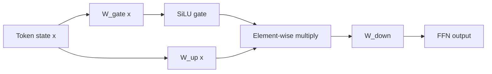

# Mạng feed-forward SwiGLU

**Cải tiến:** ReLU FFN hai ma trận ban đầu và phiên bản kế nhiệm GELU của nó.
**Mục tiêu chính:** sử dụng cổng nhân đã học, phụ thuộc vào đầu vào để kiểm soát
các tính năng mở rộng này sẽ chuyển qua FFN thông minh về mã thông báo.

**Giải thích đơn giản:** Tạo hai nhánh: một nhánh đi qua SiLU để làm cổng, nhánh
còn lại giữ giá trị. Đầu ra là **gate × value**, giúp chọn đặc trưng nào và lượng
bao nhiêu được truyền tiếp cho mỗi token.

## Từ ReLU/GELU FFN đến FFN có cổng

Máy biến áp ban đầu áp dụng MLP theo vị trí tương tự một cách độc lập cho
mọi mã thông báo:

$$
\operatorname{FFN}_{\mathrm{ReLU}}(x)
= W_{\mathrm{down}}\operatorname{ReLU}
  \!\left(W_{\mathrm{up}}x+b_{\mathrm{up}}\right)
  + b_{\mathrm{down}}
$$

Nhiều mẫu sau này thay thế ReLU bằng GELU, chạy mượt nhưng cấu trúc liên kết
vẫn là một phép chiếu mở rộng, một phép chiếu kích hoạt và một phép chiếu thu gọn.

SwiGLU tạo ra hai biểu diễn mở rộng riêng biệt. Một người trở thành một cánh cổng xuyên qua
SiLU/Swish; cái còn lại mang nội dung ứng cử viên:

$$
\begin{aligned}
g &= \operatorname{SiLU}\!\left(W_{\mathrm{gate}}x\right), \\
u &= W_{\mathrm{up}}x, \\
h &= g \odot u, \\
\operatorname{SwiGLU}(x) &= W_{\mathrm{down}}h, \\
\operatorname{SiLU}(a) &= a\,\sigma(a)
\end{aligned}
$$

Các thành kiến ​​bị bỏ qua ở trên vì nhiều triển khai LLM bỏ qua chúng. Họ không phải
cần thiết cho định nghĩa SwiGLU. Sự thay đổi quan trọng là sản phẩm theo yếu tố
giữa hai phép chiếu đã học. Bài báo GLU-variants đã tìm thấy SwiGLU và các vấn đề liên quan
các biến thể có kiểm soát tốt hơn các đường cơ sở ReLU/GELU trong Transformer của nó
thí nghiệm. ([Shazeer, 2020](https://arxiv.org/abs/2002.05202))

## Giải thích kiến ​​trúc

Câu trả lời FFN thông thường: “các tính năng mở rộng phi tuyến tính nào là dương hoặc
lớn?" SwiGLU có thể trả lời thêm: “với trạng thái mã thông báo này, mức độ mạnh mẽ như thế nào
kênh tính năng được học riêng có nên vượt qua không?

Giả sử một kênh mở rộng tạo ra `content = 2.0`:

$$
\begin{aligned}
a=-3&:\quad \operatorname{SiLU}(-3)\approx-0.142
      \;\Longrightarrow\; h\approx-0.284, \\
a= 3&:\quad \operatorname{SiLU}(3)\approx 2.858
      \;\Longrightarrow\; h\approx 5.716
\end{aligned}
$$

Nội dung ứng cử viên tương tự bị loại bỏ hoặc khuếch đại dựa trên một nội dung đã học khác
cái nhìn của đầu vào. Một cổng là liên tục chứ không phải là một quyết định bật/tắt khó khăn; Nó
cũng có thể tiêu cực.

## Kế toán tham số và tính toán

Một FFN thông thường có chiều rộng mở rộng `d_ff` có khoảng:

$$
P_{\mathrm{FFN}} \approx 2d_{\mathrm{model}}d_{\mathrm{ff}}
$$

SwiGLU có ba ma trận:

$$
P_{\mathrm{SwiGLU}}
\approx 3d_{\mathrm{model}}d_{\mathrm{ff,SwiGLU}}
$$

Do đó, người xây dựng mô hình thường giảm chiều rộng trung gian SwiGLU xuống khoảng
hai phần ba chiều rộng FFN cơ sở khi khớp với tham số hoặc ngân sách FLOP.
Ví dụ: so với `4 × d_model` FFN thông thường, khoảng
chiều rộng SwiGLU phù hợp với ngân sách là gần `8/3 × d_model`, thường được làm tròn cho phần cứng
căn chỉnh. Đây là nguồn gốc ngân sách, không phải là quy tắc cố định trong bài báo SwiGLU.

Sự đánh đổi:

- cổng cải thiện khả năng biểu đạt theo kinh nghiệm, nhưng yêu cầu đầu vào bổ sung
  phép chiếu;
- hiệu suất phụ thuộc vào độ rộng trung gian đã chọn, quá trình khởi tạo, dữ liệu và phần còn lại của kiến ​​trúc;
- SwiGLU thay đổi cách tính toán theo mỗi chuyên gia nhưng không làm cho FFN trở nên thưa thớt;
  MoE là cơ chế định tuyến riêng biệt để chọn FFNs nào thực thi;
- hạt nhân hợp nhất có thể giảm lưu lượng bộ nhớ, nhưng chỉ riêng “SwiGLU” thì không hứa hẹn
  thời gian trên đồng hồ treo tường thấp hơn GELU FFN nhỏ hơn.

## Qwen sử dụng nó như thế nào

**Đã xác minh:** Qwen2 rõ ràng tuân theo Qwen trong việc sử dụng SwiGLU làm FFN
kích hoạt. Các mô hình dày đặc của nó sử dụng SwiGLU FFN, trong khi mô hình MoE của nó sử dụng một dãy
định tuyến nhỏ hơn FFNs.
([Báo cáo kỹ thuật Qwen2, §2.2](https://arxiv.org/abs/2407.10671))

**Đã xác minh:** Qwen3 giữ lại SwiGLU ở cả biến thể dày đặc và MoE.
([Báo cáo kỹ thuật Qwen3, §2](https://arxiv.org/abs/2505.09388))

Trong lớp MoE, luồng dữ liệu trở thành:

$$
x
\;\xrightarrow{\text{router}}\;
\mathcal{I}_{\mathrm{top}\text{-}k}
\;\xrightarrow{\text{selected SwiGLU experts}}\;
\sum_{i\in\mathcal{I}_{\mathrm{top}\text{-}k}}p_iE_i(x)
\;\xrightarrow{\text{residual add}}\; y
$$

Do đó, “SwiGLU so với MoE” là sự so sánh sai: SwiGLU chỉ rõ quan điểm của một chuyên gia
hình dạng FFN bên trong; MoE chỉ định cách chuyển mã thông báo giữa nhiều chuyên gia.
