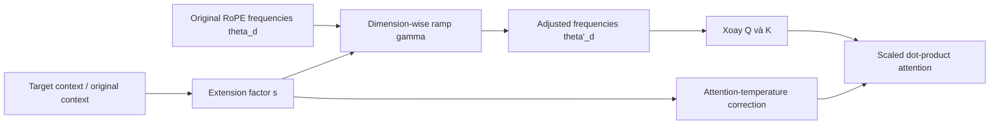

# YaRN: Mở rộng bối cảnh dựa trên RoPE

**Cải thiện:** RoPE thông thường khi dùng vượt quá độ dài chuỗi đã thấy trong huấn luyện.
**Mục tiêu chính:** mở rộng phạm vi vị trí có thể sử dụng trong khi vẫn duy trì vị trí cục bộ
thông tin tần số cao và điều chỉnh sự dịch chuyển phân bổ sự chú ý.

**Giải thích đơn giản:** **Thay đổi tỷ lệ các vị trí RoPE** để **ngữ cảnh cực dài** tạo ra các góc xoay tương tự như các góc nhìn thấy trong quá trình huấn luyện, cho phép các cửa sổ ngữ cảnh dài hơn nhiều trong khi vẫn lưu giữ thông tin vị trí cục bộ.

## Tại sao phần mở rộng RoPE đơn giản không thành công

Một mô hình RoPE được đào tạo theo chiều dài `L_train` chỉ học các pha quay
và khoảng cách tương đối trong phạm vi đó. Việc tăng giá trị cấu hình không
không đào tạo lại các mạch phụ thuộc vào vị trí đó. Ở các vị trí dài hơn, cao
kích thước tần số có thể xoay qua các giai đoạn không quen thuộc, trong khi thống nhất đơn giản
nội suy vị trí có thể làm mờ đi sự khác biệt về vị trí cục bộ.

YaRN—“Một phương pháp mở rộng RoPE khác”—thay đổi lịch trình tần số RoPE và
thu hút sự chú ý thay vì thay thế khối Transformer. Nó được thiết kế
để mở rộng các mô hình được huấn luyện trước bằng cách sử dụng dữ liệu huấn luyện liên tục ít hơn đáng kể
hơn các phương pháp mở rộng ngữ cảnh được so sánh trong bài báo.
([Peng và cộng sự, 2023](https://arxiv.org/abs/2309.00071))

## Kiến trúc và công thức

YaRN kết hợp ba ý tưởng:

1. duy trì các kích thước tần số cao đại diện cho các mối quan hệ địa phương;
2. nội suy các kích thước tần số thấp hơn cần thiết cho phạm vi dài hơn, với
   đoạn đường nối suôn sẻ giữa hai chế độ;
3. áp dụng hiệu chỉnh nhiệt độ chú ý phụ thuộc vào độ dài.

Đối với tần số góc RoPE gốc `theta_d`, hệ số mở rộng `s` và
đoạn đường nối phụ thuộc thứ nguyên `gamma(r_d)` trong khoảng từ 0 đến 1:

$$
\theta'_d
= \left(1-\gamma(r_d)\right)\frac{\theta_d}{s}
  + \gamma(r_d)\theta_d
$$

- `gamma(r_d) = 0` nội suy đầy đủ kích thước đó cho phạm vi dài hơn.
- `gamma(r_d) = 1` duy trì tần số gốc và độ phân giải cục bộ.
- Các giá trị trung gian hòa quyện một cách mượt mà thay vì tạo ra ranh giới cứng nhắc
  giữa các kích thước được chia tỷ lệ và không chia tỷ lệ.

YaRN cũng chia tỷ lệ nhiệt độ chú ý theo hàm của `s`. Điều này sửa
sự thay đổi entropy chú ý do phổ vị trí mới gây ra; nó không
thêm một lớp thần kinh đã học.

## Ví dụ về luồng dữ liệu

Trọng số Q/K/V và FFN đã học không thay đổi khi suy luận chỉ vì
YaRN được kích hoạt. Thời gian chạy thay đổi các góc được sử dụng bởi RoPE và các góc liên quan
mở rộng sự chú ý. Việc đào tạo theo bối cảnh dài vẫn có thể được sử dụng để
mô hình học cách khai thác phạm vi mở rộng.

## Những gì nó cải thiện và giới hạn của nó

Báo cáo của YaRN báo cáo việc tiếp cận các bối cảnh mở rộng với số lượng token ít hơn 10× và
Các bước đào tạo ít hơn 2,5 lần so với các phương pháp mở rộng được so sánh trước đó. Những thứ kia
là kết quả cho các mô hình và thiết lập của bài báo, không phải là tỷ lệ chi phí chung.
([Thí nghiệm sợi](https://arxiv.org/abs/2309.00071))

Các giới hạn quan trọng:

- hệ số tỷ lệ tốt nhất phụ thuộc vào độ dài ban đầu, độ dài mục tiêu, kiểu máy và
  cấu hình RoPE;
- mở rộng quy mô tích cực có thể làm giảm độ phân giải vị trí theo ngữ cảnh ngắn;
- chấp nhận nhiều mã thông báo hơn không đảm bảo việc truy xuất hoặc suy luận chính xác
  trên toàn bộ cửa sổ;
- YaRN thay đổi hình dạng vị trí nhưng không loại bỏ phép tính bậc hai
  sự chú ý đầy đủ;
- Phải báo cáo độ dài đào tạo gốc và độ dài suy luận mở rộng YaRN
  riêng.

## Cách Qwen sử dụng YaRN

**Đã xác minh:** Qwen2 tăng tần số cơ sở RoPE từ 10.000 lên 1.000.000 trong
giai đoạn huấn luyện theo ngữ cảnh dài và kết hợp YaRN với DCA để suy luận lên đến
131.072 mã thông báo.
([Báo cáo kỹ thuật Qwen2, §3.2](https://arxiv.org/abs/2407.10671))

**Đã xác minh:** Qwen3 tuân theo cùng một công thức ngữ cảnh dài: tần số cơ bản
1.000.000 cộng với YaRN và DCA để mở rộng suy luận gấp bốn lần.
([Báo cáo kỹ thuật Qwen3, §3.2](https://arxiv.org/abs/2505.09388))

YaRN và DCA là bổ sung, không phải từ đồng nghĩa. YaRN thay đổi tần số RoPE
phổ và tỷ lệ chú ý; [DCA](DCA.md) thay đổi các chỉ số vị trí được sử dụng
cho các vùng khóa truy vấn khác nhau.
