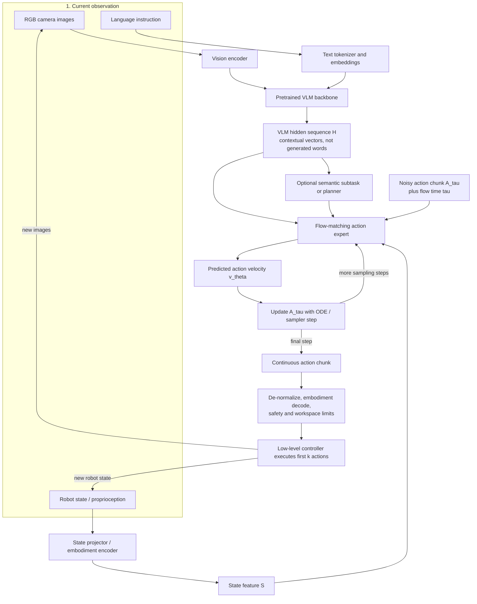

# Đường dẫn cốt lõi của các mô hình hành động-ngôn ngữ-thị giác hiện đại

## 1. Phiên bản ngắn

Một chiếc VLA hiện đại với chuyên gia hành động thường có hai phần được kết nối:

1. **Mô hình ngôn ngữ thị giác (VLM)** đã được huấn luyện trước xử lý hình ảnh camera và hướng dẫn ngôn ngữ.
2. **Chuyên gia hành động** dành riêng cho robot kết hợp các đặc trưng ẩn của VLM với proprioception, các hành động ứng cử viên ồn ào và dấu thời gian của luồng để tạo ra một đoạn hành động liên tục.

VLM thường **không** phát ra câu nào trước khi robot hành động. Đầu ra hữu ích của nó thường là một chuỗi các vectơ ẩn liên tục:

$$
H = [h_1, h_2, \ldots, h_N],
\qquad
H \in \mathbb{R}^{N \times d_{\text{VLM}}}
$$

Mỗi hàng là trạng thái ẩn theo ngữ cảnh của một vị trí hình ảnh hoặc văn bản. Đây không phải là token từ vựng IDs và không phải là lệnh vận động.

Trạng thái robot cũng không phải lúc nào cũng được chèn trực tiếp vào VLM. Trong nhiều kiến ​​trúc dựa trên dòng chảy hiện đại, hình ảnh và ngôn ngữ đi qua VLM trước tiên, trong khi proprioception được chiếu riêng biệt và hợp nhất sau đó bên trong chuyên gia hành động.



**Quan trọng:** đây là sơ đồ luồng dữ liệu logic. Một số triển khai tính toán bối cảnh VLM trước rồi chạy một Biến áp hành động riêng biệt, trong khi một số triển khai khác kết hợp các lớp Biến áp VLM và Chuyên gia hành động chặt chẽ hơn.

Đọc sơ đồ dưới dạng hai vòng:

- **Vòng lấy mẫu dòng bên trong** liên tục chuyển đổi một tensor tác động nhiễu thành một quỹ đạo mạch lạc.
- **Vòng điều khiển bên ngoài** thực hiện một phần quỹ đạo đó, quan sát lại robot và thay thế kế hoạch còn lại bằng một đoạn đã sửa.

Trình lập kế hoạch rõ ràng rất hữu ích cho các tác vụ dài nhưng không bắt buộc trong mọi VLA. Việc lập kế hoạch có thể vẫn ẩn trong các đặc trưng ẩn, xuất hiện dưới dạng nhiệm vụ con bằng văn bản hoặc được xử lý bởi một mô-đun riêng biệt.

---

## 2. Các module chính

| Mô-đun | Đầu vào | Chức năng chính | Đầu ra |
| -------------------------------- | -------------------------------------------------- | ----------------------------------------------------------------------- | ----------------------------- |
| **Bộ mã hóa thị giác** | Hình ảnh camera | Chuyển đổi các patch hình ảnh thành các phần nhúng trực quan | Vectơ token trực quan |
| **Đường dẫn nhúng văn bản** | Văn bản hướng dẫn | Chuyển đổi token IDs thành phần nhúng văn bản | Vectơ token văn bản |
| **Xương sống VLM** | Nhúng hình ảnh và văn bản | Bối cảnh hóa thị giác theo hướng dẫn | Ẩn sequence\(H\) |
| **Bộ chuyển đổi trạng thái** | Trạng thái khớp, bộ kẹp, bộ phận tác động cuối, cơ sở hoặc lực | Chuẩn hóa và chiếu các số dành riêng cho robot | Trạng thái feature\(S\) |
| **Công cụ lập kế hoạch** *(tùy chọn)* | Lịch sử nhiệm vụ và bối cảnh VLM | Chọn nhiệm vụ con ngữ nghĩa tiếp theo | Nhiệm vụ phụ văn bản hoặc ẩn |
| **Chuyên gia hành động** | \(H\), \(S\), hành động ồn ào, thời gian chảy | Dự đoán quỹ đạo nhiễu sẽ di chuyển theo quỹ đạo hợp lệ như thế nào | Trường vận tốc hành động |
| **Bộ giải mã hành động** | Đoạn hành động được chuẩn hóa | Chuyển đổi định dạng đầu ra được chia sẻ sang định dạng lệnh của robot | Mục tiêu chung hoặc tác động cuối cùng |
| **Bộ điều khiển cấp thấp** | Mục tiêu robot | Thực thi các lệnh dưới sự kiểm soát phần cứng và giới hạn an toàn | Chuyển động vật lý |

Ranh giới chính xác giữa các mô-đun này khác nhau. Cụ thể, **kết hợp trạng thái** và **tinh chỉnh VLM** là những lựa chọn thiết kế chứ không phải là một quy tắc chung.

---

## 3. Từ hình ảnh, ngôn ngữ đến không gian ẩn giấu của VLM

### 3.1 Hình ảnh trở thành hình ảnh nhúng trực quan

Mỗi hình ảnh camera được chia thành các phần và được xử lý bằng bộ mã hóa thị giác, chẳng hạn như Vision Transformer.

```text
hình ảnh
  → patch lỗi
  → bộ mã hóa thị giác
  → [v1, v2, ..., vm]
```

Nhiều camera tạo ra nhiều nhóm nhúng hình ảnh. Máy ảnh phía trước có thể mô tả khung cảnh chung, trong khi máy ảnh đeo tay cung cấp cái nhìn cận cảnh về vùng tiếp xúc và vùng tiếp xúc.

Bộ mã hóa thị giác thường không phát ra các ký hiệu rõ ràng như:

```text
vật = cái cốc
điểm nắm = tay cầm
```

Thay vào đó, nó phát ra các vectơ liên tục mà từ đó các lớp Transformer sau này có thể khôi phục thông tin ngữ nghĩa và không gian.

### 3.2 Ngôn ngữ trở thành phần nhúng văn bản

Hướng dẫn được mã hóa bình thường:

```text
"đặt chiếc cốc màu đỏ lên khay"
    → token IDs
    → [l1, l2, ..., ln]
```

Ngôn ngữ xác định phần nào của cảnh có liên quan. Cùng một hình ảnh sẽ dẫn đến các hành động khác nhau cho:

```text
"nhấc cốc lên"
"di chuyển xung quanh cốc"
"chỉ vào cốc"
```

### 3.3 VLM bối cảnh hóa tất cả các vị trí ngôn ngữ hình ảnh

Phần nhúng hình ảnh và văn bản vào Transformer VLM:

$$
X_0 = [V;L]
$$

Sau \(L\) Các lớp biến áp:

$$
H = \operatorname{VLM}(X_0)
  = [h_1,h_2,\ldots,h_N]
$$

Ở đâu:

- \(N\) là số vị trí văn bản và hình ảnh được giữ lại;
- \(d_{\text{VLM}}\) là chiều rộng ẩn VLM;
- mỗi \(h_i \in \mathbb{R}^{d_{\text{VLM}}}\) là một vectơ ẩn theo ngữ cảnh.

Thông qua sự chú ý, vị trí trực quan tương ứng với chiếc cốc có thể liên quan đến vị trí văn bản cho “cốc”, trong khi phần trình bày văn bản cho “đặt” có thể liên quan đến vùng cốc và khay.

Về mặt khái niệm, chuỗi ẩn có thể mã hóa thông tin tương ứng với:

- đồ vật nào phù hợp với “cốc đỏ”;
- vùng nào tương ứng với khay;
- đối tượng nào là mục tiêu nhiệm vụ;
- vùng thị giác nào là chướng ngại vật;
- hướng dẫn yêu cầu tương tác gì.

Những dữ kiện này thường **được phân bổ theo các vectơ và thứ nguyên**. Mô hình không nhất thiết phải lưu trữ chúng dưới dạng danh sách đối tượng hoặc biểu đồ cảnh có thể đọc được.

### 3.4 “VLM thì chuyên gia hành động” đôi khi chỉ là ranh giới khái niệm

Sơ đồ đơn giản gợi ý:

```text
VLM
  → dãy ẩn cuối cùng H
  → chuyên gia hành động
```

Điều đó chính xác đối với các kiến ​​trúc như GR00T N1, trong đó token đầu ra VLM được chuyển đến DiT xuôi dòng.

Tuy nhiên, các mô hình tích hợp chặt chẽ có thể kết hợp hai luồng trực tiếp hơn. Trong kiến ​​trúc kiểu π0:

```text
tiền tố hình ảnh và ngôn ngữ
        ↕ sự chú ý trên các lớp Transformer
trạng thái, hành động ồn ào và hậu tố thời gian
```

Tiền tố VLM và hậu tố chuyên gia hành động được xử lý bằng các lớp Transformer phối hợp. Hậu tố dành riêng cho chính sách có thể sử dụng thông tin tiền tố trên toàn mạng thay vì chờ xuất một tensor VLM cuối cùng.

Vì vậy, `H` nên được hiểu là một sự trừu tượng hóa hữu ích:

> tất cả các đặc trưng ngôn ngữ thị giác theo ngữ cảnh được cung cấp cho chính sách hành động.

Tùy thuộc vào việc triển khai, điều này có thể có nghĩa là:

- chuỗi ẩn VLM cuối cùng;
- token đầu ra VLM dự kiến;
- các đặc trưng khóa/giá trị được lưu trong bộ nhớ đệm trên mỗi lớp;
- các biểu diễn tiền tố có sự tham gia chung của các lớp chuyên gia hành động.

---

## 4. Chính xác thì trạng thái ẩn là gì?

### 4.1 Đây là vectơ đầu ra ở vị trí token

Giả sử chuỗi đầu vào VLM chứa:

```text
[hình ảnh 1] [hình ảnh 2] ... [hình ảnh m] [đặt] [cái] [cốc]
```

Ở đầu vào, mọi vị trí được thể hiện bằng một phần nhúng. Sau các lớp tự chú ý và chuyển tiếp nguồn cấp dữ liệu, mọi vị trí đều có một vectơ ngữ cảnh được cập nhật:

```text
vị trí trực quan 17 → h17
vị trí văn bản "cốc" → hm+3
```

Do đó, trạng thái ẩn là một vectơ như:

```text
h17 = [0,31, -0,82, 1,14, ..., 0,07]
```

Bản thân các giá trị không thể đọc được bằng con người. Ý nghĩa của chúng được học và phân phối.

### 4.2 Các vectơ ẩn không được tạo token đầu ra

Một mô hình ngôn ngữ thường chuyển đổi trạng thái ẩn thành nhật ký từ vựng:

$$
\text{logits} = W_{\text{LM}}h_i
$$

và sau đó chọn một token từ.

```text
vectơ ẩn
    → Đầu LM
    → xác suất từ ​​vựng
    → từ được tạo
```

VLA dựa trên luồng thường bỏ qua bước tạo ngôn ngữ này để kiểm soát cấp độ thấp:

```text
Chuỗi ẩn VLM H
    → chuyên gia hành động
    → quỹ đạo hành động liên tục
```

Do đó, việc nói rằng chuyên gia hành động sử dụng “token đầu ra” của VLM có thể không rõ ràng. Một tuyên bố rõ ràng hơn là:

> Chuyên gia hành động sử dụng **vectơ ẩn đầu ra của VLM ở vị trí token hình ảnh và văn bản**.

### 4.3 Không gian ẩn thường là một chuỗi chứ không phải một vectơ cảnh

Bối cảnh thường có hình dạng:

$$
H \in \mathbb{R}^{B \times N \times d_{\text{VLM}}}
$$

trong đó \(B\) là kích thước lô.

Giữ một trình tự bảo tồn thông tin vị trí cụ thể. Vị trí trực quan che chiếc cốc có thể vẫn khác biệt với vị trí trực quan che khay, mặc dù sự chú ý cho phép chúng trao đổi thông tin.

Một số kiến ​​trúc gộp hoặc nén \(H\), nhưng không nên giả định rằng mọi VLA đều giảm cảnh thành một vectơ duy nhất.

---

## 5. Trạng thái robot được hợp nhất như thế nào

Hình ảnh hiển thị thế giới bên ngoài nhưng chúng không chỉ rõ cấu hình bên trong chính xác của robot một cách đáng tin cậy. Một chính sách có thể nhận thêm:

```text
góc khớp
vận tốc chung
vị trí và sự định hướng của cơ quan tác động cuối cùng
mở kẹp
vận tốc cơ sở di động
chỉ số lực hoặc mô-men xoắn
```

Đặt trạng thái robot chuẩn hóa là:

$$
s_t \in \mathbb{R}^{d_s}
$$

Một máy chiếu đã học sẽ chuyển đổi nó thành một hoặc nhiều phần nhúng:

$$
S = f_{\text{state}}(s_t)
$$

Sự khác biệt quan trọng là **nơi \(S\) được chèn**.

### 5.1 Sự kết hợp muộn màng bên trong chuyên gia hành động

Điều này phổ biến trong VLAs điều chỉnh dòng chảy hiện đại.

```text
hình ảnh + hướng dẫn
    → VLM
    → bối cảnh ẩn H

trạng thái robot
    → máy chiếu trạng thái
    → S

H + S + hành động ồn ào + thời gian chảy
    → chuyên gia hành động
```

Trong thiết kế này, bản thân VLM chỉ có thể xử lý hình ảnh và ngôn ngữ. Trạng thái robot trước tiên tương tác với bối cảnh VLM bên trong chuyên gia hành động.

Hai mẫu đại diện là:

- **Xử lý tiền tố/hậu tố kiểu π0:** hình ảnh và ngôn ngữ tạo thành tiền tố VLM. Trạng thái dự kiến, đoạn hành động bị nhiễu và thông tin về thời gian tạo thành các đầu vào hậu tố dành riêng cho chính sách. Chuyên gia hành động sử dụng sự chú ý để kết hợp hậu tố với ngữ cảnh tiền tố.
- **GR00T-style chú ý chéo:** VLM xuất ra một chuỗi vectơ ngôn ngữ hình ảnh. DiT xử lý mã hóa trạng thái robot và hành động gây nhiễu trong khi tham gia chéo vào chuỗi đầu ra VLM.

Điều này chính xác hơn việc nói rằng mọi VLA hiện đại chỉ cần thêm token trạng thái vào đầu vào VLM ban đầu.

### 5.2 Sự kết hợp sớm bên trong VLM

Một thiết kế khả thi khác có thể chèn các phần nhúng trạng thái trước hoặc trong VLM:

```text
[token trực quan] [token văn bản] [token trạng thái]
                → VLM
                → chuỗi ẩn nhận biết trạng thái
```

Giờ đây, proprioception có thể ảnh hưởng đến khả năng suy luận bằng ngôn ngữ hình ảnh trong suốt các lớp VLM.

Cách tiếp cận này có thể hữu ích, nhưng nó không phổ biến. Nhiều kiến ​​trúc chuyên gia hành động sử dụng phản ứng tổng hợp muộn vì nó giữ cho giao diện VLM được huấn luyện trước sạch hơn và tách biệt các kích thước dành riêng cho robot bên trong mô-đun chính sách.

### 5.3 Nhiều token trạng thái và bộ điều hợp phương án

Một vectơ trạng thái có thể được biểu diễn dưới dạng:

- một nhúng cho toàn bộ tiểu bang;
- các phần gắn vào khớp, kẹp, lực hoặc đế riêng biệt;
- một biểu diễn đệm có chiều rộng cố định;
- một bộ mã hóa theo phương án cụ thể.

Các chính sách đa phương án thường sử dụng bộ mã hóa trạng thái và bộ giải mã hành động riêng biệt vì robot có số lượng khớp khác nhau và quy ước điều khiển khác nhau.

Sau đó, chuyên gia hành động được chia sẻ có thể tìm hiểu các mẫu hành vi chung trong khi bộ điều hợp xử lý các định dạng đầu vào và đầu ra dành riêng cho robot.

---

## 6. Kết hợp dòng chảy bên trong chuyên gia hành động

### 6.1 Đoạn hành động

Thay vì chỉ dự đoán lệnh tiếp theo, chính sách này thường dự đoán một loạt các hành động trong tương lai \(T\):

$$
A =
[a_t,a_{t+1},\ldots,a_{t+T-1}]
\in \mathbb{R}^{T \times d_a}
$$

Đối với bộ điều khiển tác động cuối 7D:

$$
a_t =
[\Delta x,\Delta y,\Delta z,
 \Delta roll,\Delta pitch,\Delta yaw,
 gripper]
$$

Các robot khác có thể sử dụng các mục tiêu chung, đồng bằng khớp, vận tốc cơ bản, lệnh bằng tay hoặc mục tiêu toàn thân.

### 6.2 Nội suy huấn luyện

Một công thức so khớp dòng chảy đơn giản bắt đầu bằng:

- đoạn hành động trình diễn \(A_1\);
- Nhiễu Gauss \(A_0 \sim \mathcal{N}(0,I)\);
- thời gian lấy mẫu \(\tau \in [0,1]\).

Xây dựng một đoạn ồn ào trung gian:

$$
A_\tau = (1-\tau)A_0 + \tau A_1
$$

Đối với phép nội suy thẳng này, vận tốc mục tiêu là:

$$
u_\tau = A_1 - A_0
$$

Chuyên gia hành động dự đoán:

$$
v_\theta =
v_\theta(A_\tau,\tau,H,S,z)
$$

trong đó \(z\) là một nhiệm vụ phụ ngữ nghĩa tùy chọn.

Mục tiêu điển hình là:

$$
\mathcal{L}_{\text{flow}}
=
\mathbb{E}
\left[
\left\|
v_\theta(A_\tau,\tau,H,S,z)-u_\tau
\right\|_2^2
\right]
$$

Đường dẫn, trọng số và tham số hóa chính xác có thể khác nhau giữa các bài viết, nhưng ý tưởng trung tâm là giống nhau: tìm hiểu trường vectơ di chuyển các quỹ đạo nhiễu về phía quỹ đạo đã được chứng minh của robot.

### 6.3 Suy luận

Khi suy luận, hãy bắt đầu bằng tiếng ồn:

$$
A_0 \sim \mathcal{N}(0,I)
$$

Sau đó tích hợp:

$$
\frac{dA_\tau}{d\tau}
=
v_\theta(A_\tau,\tau,H,S,z)
$$

sử dụng một số bước cập nhật số cho đến \(\tau=1\).

```text
đoạn hành động ngẫu nhiên
    → tốc độ chuyên gia hành động
    → cập nhật
    → tốc độ chuyên gia hành động
    → cập nhật
    → đoạn hành động liên tục cuối cùng
```

Mô hình không phải là từ ngữ khử nhiễu. Nó đang tinh chỉnh một tensor có các hàng là các lệnh của robot trong tương lai.

---

## 7. VLM có cần được huấn luyện lại để điều khiển VLA không?

### 7.1 Thường được khởi tạo từ VLM đã được huấn luyện trước

VLA hiện đại thường không huấn luyện kiến ​​thức ngôn ngữ hình ảnh từ đầu.

```text
huấn luyện trước hình ảnh-văn bản ở quy mô web
    → VLM đã được huấn luyện trước
    → thêm bộ điều hợp trạng thái và chuyên gia hành động
    → huấn luyện trình diễn robot
```

VLM được huấn luyện trước cung cấp kiến ​​thức về đối tượng, ngôn ngữ và ngữ nghĩa hình ảnh. Chuyên gia hành động cung cấp cơ chế kiểm soát liên tục.

Tối thiểu, mô-đun hành động mới được thêm vào phải được huấn luyện về dữ liệu robot. Trọng lượng VLM có thay đổi hay không tùy thuộc vào công thức luyện tập.

### 7.2 Đào tạo toàn diện hoặc chung từ đầu đến cuối

Nếu VLM không bị đóng băng, độ dốc do mất tác động có thể truyền qua:

```text
mất dòng chảy
   ↑
chuyên gia hành động
   ↑
Xương sống VLM
   ↑
bộ mã hóa thị giác
```

Điều này có thể làm cho chuỗi ẩn VLM trở nên hữu ích hơn cho việc điều khiển. Ví dụ: các đặc trưng có thể trở nên nhạy cảm hơn với các vùng tiếp xúc, khả năng chi trả của đối tượng, khả năng tiếp cận và hình học liên quan đến nhiệm vụ.

GR00T N1 mô tả rõ ràng VLM và DiT của nó được liên kết chặt chẽ và được tối ưu hóa chung từ đầu đến cuối. π0 được xây dựng trên PaliGemma đã được huấn luyện trước và sau đó được huấn luyện thành chính sách robot với chuyên gia hành động của nó.

Huấn luyện chung **không** có nghĩa là VLM được huấn luyện từ quá trình khởi tạo ngẫu nhiên. Điều đó có nghĩa là các trọng lượng đã được huấn luyện trước tiếp tục nhận được độ dốc huấn luyện của robot.

### 7.3 Tinh chỉnh một phần

Tùy chọn rẻ hơn chỉ cập nhật:

- trọng lượng LoRA;
- bộ điều hợp;
- các lớp Transformer phía trên được chọn;
- chuyên gia hành động và máy chiếu nhà nước.

```text
chủ yếu là VLM đã được đông lạnh trước
    + LoRA/bộ điều hợp có thể huấn luyện được
    + chuyên gia hành động có thể huấn luyện
```

Điều này làm giảm bộ nhớ và có thể lưu giữ nhiều kiến ​​thức VLM ban đầu hơn.

Ví dụ: OpenVLA-OFT sử dụng tinh chỉnh VLA dựa trên LoRA thay vì yêu cầu huấn luyện đầy đủ thông số.

### 7.4 VLM đông lạnh

VLM cũng có thể được cố định:

```text
VLM bị đóng băng → bối cảnh ẩn cố định H
chuyên gia hành động có thể huấn luyện → học cách sử dụng H
```

Điều này rẻ hơn và bảo vệ biểu diễn được huấn luyện trước, nhưng VLM không thể định hình lại không gian ẩn của nó để đối phó với tình trạng mất hành động.

Một xương sống cố định vẫn có thể hoạt động khi các đặc trưng hiện có của nó có đủ thông tin và mô-đun hành động có tính biểu cảm. GR00T N1.5 là một ví dụ trong đó VLM bị đóng băng trong khi chính sách hạ nguồn học cách sử dụng các phần nhúng của nó.

### 7.5 Kết luận đúng

Phát biểu đúng không phải là:

> Mọi VLM đều phải được huấn luyện lại đầy đủ khi chuyển đổi thành VLA.

Đó là:

> VLM đã được huấn luyện trước thường được sử dụng lại. Chuyên gia hành động và bộ điều hợp dành riêng cho robot phải được huấn luyện, trong khi VLM có thể được tinh chỉnh hoàn toàn, điều chỉnh một phần hoặc cố định tùy thuộc vào kiến ​​trúc, dữ liệu, ngân sách điện toán và nhu cầu lưu giữ kiến ​​thức đã được huấn luyện trước.

---

## 8. Lập kế hoạch và lý luận

### 8.1 Lập kế hoạch ngầm

Đối với các tác vụ ngắn, bối cảnh VLM có thể trực tiếp điều kiện cho chuyên gia hành động:

```text
image + "nhấc cốc lên"
    → bối cảnh ẩn H
    → đoạn hành động
```

Không có danh sách các bước có thể nhìn thấy. Sự phân rã nhiệm vụ có thể vẫn tiềm ẩn trong các đặc trưng ẩn và hành vi điều khiển đã học.

Việc này nhanh và đơn giản nhưng các tác vụ dài có thể yêu cầu bộ nhớ mạnh hơn hoặc theo dõi tiến trình rõ ràng.

### 8.2 Nhiệm vụ con ngữ nghĩa rõ ràng

Một mô hình phân cấp có thể dự đoán một nhiệm vụ con có ngữ nghĩa ngắn:

```text
Nhiệm vụ chung: "dọn dẹp nhà bếp"
Cảnh hiện tại: Đĩa bẩn trên quầy
nhiệm vụ phụ tiếp theo: "nhặt đĩa bẩn"
```

Sau đó, chuyên gia hành động cấp thấp sẽ tạo ra chuyển động có điều kiện dựa trên nhiệm vụ phụ đó.

π0,5 là một thiết kế tiêu biểu kết hợp dự đoán ngữ nghĩa cấp cao với việc tạo hành động cấp thấp liên tục.

### 8.3 Lập kế hoạch riêng

Các hệ thống mô-đun trước đây sử dụng ranh giới rõ ràng hơn:

```text
Trình lập kế hoạch LLM/VLM
    → kỹ năng biểu tượng hoặc mục tiêu không gian
    → người lập kế hoạch chuyển động hoặc người điều khiển kỹ năng
    → robot
```

Điều này có thể cải thiện khả năng diễn giải và tái sử dụng các mô-đun điều khiển thông thường, nhưng lỗi có thể tích tụ trên các giao diện.

Lý luận không nhất thiết có nghĩa là văn bản có chuỗi suy nghĩ rõ ràng. Nó có thể đề cập đến tính toán ngữ nghĩa tiềm ẩn, một nhiệm vụ phụ được dự đoán hoặc một mô-đun lập kế hoạch bên ngoài.

---

## 9. Các phương pháp tạo hành động khác

### 9.1 Hồi quy liên tục song song

Người đứng đầu hành động có thể dự đoán toàn bộ đoạn trong một lần:

$$
\hat{A} = f_\theta(H,S)
$$

```text
bối cảnh
    → [hành động t, hành động t+1, ..., hành động t+T-1]
```

OpenVLA-OFT cho thấy rằng dự đoán liên tục song song với phân đoạn hành động có thể nhanh chóng và hiệu quả mà không cần lấy mẫu luồng lặp.

### 9.2 Token hành động tự hồi quy rời rạc

VLAs đầu cuối trước đó thường lượng tử hóa các giá trị động cơ:

```text
hành động liên tục
    → thùng số
    → token từ vựng IDs
    → dự đoán token tiếp theo
```

IDs dự đoán sau đó được chuyển đổi trở lại thành số liên tục.

Điều này sử dụng lại đầu ra mô hình ngôn ngữ và mục tiêu entropy chéo, nhưng việc giải mã từng token có thể bị chậm đối với các khối hành động tần số cao.

### 9.3 Token nén FAST-style

FAST nén quỹ đạo hành động trước khi token tự hồi quy, giảm thông tin lặp lại và số lượng token được tạo.

Vì vậy, “token hành động” nên được sử dụng cẩn thận:

- theo nghĩa triển khai hẹp, nó là một từ vựng rời rạc ID thể hiện thông tin hành động;
- trong một số khảo sát, nó được sử dụng rộng rãi hơn cho mọi cách trình bày liên quan đến hành động;
- VLAs dựa trên luồng thường xuất ra các tensor hành động liên tục, không phải token ngôn ngữ theo nghĩa đen.

---

## 10. Giải mã, thực thi và phản hồi

Đoạn hành động được tạo thường được chuẩn hóa. Trước khi thực hiện, hệ thống phải:

1. chuyển đổi các giá trị trở lại đơn vị vật lý;
2. chọn đúng kích thước theo phương án cụ thể;
3. thực thi các giới hạn chung, vận tốc, không gian làm việc và an toàn;
4. gửi mục tiêu đến bộ điều khiển cấp thấp.

Robot thường chỉ thực hiện một phần của đoạn:

```text
dự đoán 16 hành động
    → thực hiện 2–8 đầu tiên
    → chụp ảnh và trạng thái mới
    → dự đoán đoạn thay thế
```

Đây là điều khiển vòng kín theo chiều ngang rút lui. Nó ngăn chặn robot thực hiện một cách mù quáng quỹ đạo cũ sau khi cảnh thay đổi hoặc thao tác nắm bắt đi chệch khỏi mong đợi.

Lệnh có thể không đổi và đôi khi có thể được lưu vào bộ đệm. Hình ảnh và khả năng nhận thức phải được làm mới sau khi chuyển động.

---

## 11. Ví dụ đầy đủ: đầu vào thô cho chuyển động vật lý

Những con số dưới đây mang tính minh họa chứ không phải sao chép từ một mô hình.

### Bước 1: quan sát thô

```text
Chỉ dẫn:
"Đặt chiếc cốc màu đỏ lên khay."

Hình ảnh:
I_front = camera RGB phía trước
I_wrist = cổ tay Máy ảnh RGB

Trạng thái robot:
s_t = [góc khớp, vận tốc khớp, độ mở kẹp]
```

### Bước 2: mã hóa ngôn ngữ hình ảnh

```text
I_mặt trước, I_cổ tay
    → patch lỗi
    → nhúng trực quan V

chỉ dẫn
    → token IDs
    → nhúng văn bản L

[V ; L]
    → Transformer VLM
    → H = [h1, h2, ..., hN]
```

`H` là một chuỗi các vectơ ngữ cảnh. Nó không phải là câu “cái cốc ở bên trái”, mặc dù các vectơ của nó có thể mã hóa thông tin cần thiết để rút ra mối quan hệ đó.

### Bước 3: mã hóa trạng thái

```text
s_t
    → bình thường hóa
    → máy chiếu trạng thái
    → S
```

Trong kiến ​​trúc kết hợp muộn, `S` vẫn chưa thay đổi `H`. Cả hai đều được cung cấp cho chuyên gia hành động.

### Bước 4: đầu vào luồng

```text
A_0 ~ nhiễu Gauss
tau = thời gian dòng chảy hiện tại

tình trạng:
- Chuỗi ẩn VLM H
- đặc điểm trạng thái S
- nhiệm vụ phụ ngữ nghĩa tùy chọn z
```

### Bước 5: sàng lọc chuyên gia hành động

```text
(A_tau, tau, H, S, z)
    → chuyên gia hành động
    → vận tốc dự đoán v_theta
    → cập nhật số của A_tau
    → lặp lại
    → đoạn cuối A
```

Giả sử mỗi hành động sử dụng:

```text
[Δx, Δy, Δz, Δroll, Δpitch, Δyaw, kẹp]
```

Một đoạn hành động có thể bắt đầu bằng:

```text
a_t = [+0,012, -0,004, +0,006, 0,000, +0,010, -0,020, 1,0]
a_t+1 = [+0,011, -0,003, +0,005, 0,000, +0,008, -0,018, 1,0]
a_t+2 = [+0,009, -0,002, +0,003, 0,000, +0,005, -0,012, 1,0]
...
```

Những hành động ban đầu sẽ di chuyển về phía cốc trong khi tay kẹp vẫn mở. Các chu kỳ lập kế hoạch lại sau đó sẽ đóng dụng cụ kẹp lại, nhấc cốc lên, di chuyển về phía khay và thả nó ra.

### Bước 6: Thực hiện và lập kế hoạch lại

```text
đoạn hành động chuẩn hóa
    → phi chuẩn hóa
    → bộ giải mã phương án
    → giới hạn an toàn
    → thực hiện k hành động đầu tiên
    → nhận hình ảnh và trạng thái mới
    → chạy lại mô hình
```

Sự biến đổi hoàn toàn là:

```text
pixel + hướng dẫn
    → vectơ ẩn VLM theo ngữ cảnh H

số lượng cơ thể robot
    → đặc điểm trạng thái dự kiến ​​S

H + S + đoạn hành động ồn ào + thời gian chảy
    → chuyên gia hành động
    → đoạn hành động liên tục
    → lệnh dành riêng cho robot
    → chuyển động vật lý
    → pixel và số nội dung mới
```

---

## 12. So sánh kiến ​​trúc

| Thiết kế | Nơi hình ảnh và ngôn ngữ được hợp nhất | Nơi trạng thái robot được hợp nhất | Cách tạo hành động | Đào tạo VLM điển hình |
| --------------------------------------- | --------------------------------------------------- | ------------------------------------------------------------ | -------------------------------- | -------------------------------------------------------------------------------- |
| **Dòng kiểu π0 VLA** | Tiền tố PaliGemma/VLM | Hậu tố chính sách/chuyên gia hành động | Đoạn liên tục phù hợp với dòng chảy | VLM được huấn luyện trước được điều chỉnh phù hợp với chính sách robot; tồn tại các tùy chọn đóng băng hạ lưu/LoRA |
| **Hệ thống kép GR00T N1-style** | Đại Bàng VLM | Bộ mã hóa trạng thái/hành động bên trong DiT; DiT tham gia vào các đầu ra VLM | Kết hợp dòng chảy DiT | N1 được tối ưu hóa từ đầu đến cuối |
| **Chuyên gia hành động xương sống đông lạnh** | VLM đã qua xử lý đông lạnh | Mô-đun chính sách hạ nguồn | Dòng chảy, khuếch tán hoặc hồi quy | VLM đã sửa; mô-đun hành động được huấn luyện |
| **OpenVLA-OFT** | Đường trục OpenVLA | Máy chiếu cảm nhận quyền sở hữu tùy chọn trong thiết lập tinh chỉnh | Đoạn hành động liên tục song song | Tinh chỉnh LoRA |
| **VLA hợp nhất trạng thái sớm** | Thị giác, ngôn ngữ và trạng thái đi vào xương sống chung | Bên trong các lớp VLM | Bất kỳ đầu hành động | Thường yêu cầu ít nhất bộ điều hợp hoặc điều chỉnh đường trục |

Bài học kiến ​​trúc quan trọng là:

> “Bối cảnh VLM” có nghĩa là các vectơ ẩn theo ngữ cảnh. “Hợp nhất trạng thái” mô tả cách các vectơ trạng thái robot được chiếu tương tác với các vectơ ẩn đó. Trong nhiều mô hình chuyên gia hành động hiện đại, sự tương tác đó xảy ra trong chuyên gia hành động thay vì bên trong VLM ban đầu.

---

## Nguồn

- [π0: Mô hình luồng hành động-ngôn ngữ-thị giác để điều khiển robot chung](https://arxiv.org/abs/2410.24164)
- [π0,5: Mô hình Hành động-Ngôn ngữ-Thị giác với tính khái quát hóa trong thế giới mở](https://arxiv.org/abs/2504.16054)
- [GR00T N1: Mô hình nền tảng mở cho robot hình người tổng quát](https://arxiv.org/abs/2503.14734)
- [Cập nhật kiến ​​trúc GR00T N1.5](https://research.nvidia.com/labs/gear/gr00t-n1_5/)
- [OpenVLA](https://arxiv.org/abs/2406.09246)
- [OpenVLA-OFT](https://arxiv.org/abs/2502.19645)
- [FAST: Mã hóa hành động hiệu quả cho các mô hình hành động-ngôn ngữ-thị giác](https://arxiv.org/abs/2501.09747)
