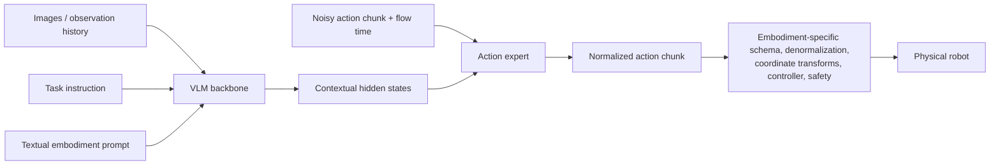

# Hiện thân được biểu diễn bằng văn bản trong mô hình Vision-Language-Action

## Câu hỏi và phạm vi nghiên cứu

**Câu hỏi.** Biểu diễn hiện thân robot bằng văn bản trong mô hình
Vision-Language-Action (VLA) nghĩa là gì, điều kiện đó ảnh hưởng thế nào đến quá trình
sinh hành động, và những VLA nào khác sử dụng ý tưởng tương tự?

**Phạm vi.** Báo cáo dùng *hiện thân bằng văn bản* theo nghĩa hẹp: văn bản đọc được
hoặc prompt có cấu trúc mô tả nền tảng tác động và bối cảnh điều khiển, rồi dùng các
token đó để điều kiện hóa chính sách VLA. Khái niệm này không đồng nghĩa với ngôn ngữ
tác vụ, soft prompt đã học, vectơ trạng thái proprioception hay URDF được mã hóa thành
token số/đồ thị. Cụm từ này chưa phải một phân loại VLA chuẩn hóa; triển khai rõ nhất
được xem xét ở đây là *điều kiện hóa bằng prompt nhận biết hiện thân* của Qwen-VLA.

Nghiên cứu được thực hiện vào **2026-07-21**. Việc phân tích cục bộ ban đầu là
[Quy trình kiến ​​trúc, đào tạo và dữ liệu đầu cuối Qwen-VLA](../../qwen_models/Qwen-VLA/qwen_vla_details.md).
Các tuyên bố dưới đây sau đó đã được kiểm tra dựa trên các giấy tờ chính và các kho chính thức.

## Câu trả lời ngắn

Hiện thân bằng văn bản được hiểu rõ nhất là **giao diện định tuyến và điều kiện hóa**,
tương tự **system prompt cho robot**. Nó cho chính sách dùng chung biết phân phối
robot/điều khiển nào đang hoạt động, chẳng hạn danh tính nền tảng, cấu hình một hay hai
tay máy, đế di động, tần số điều khiển, chân trời hành động và đôi khi cả cách tham số
hóa hành động. VLM mã hóa văn bản và dùng trạng thái ẩn theo ngữ cảnh để điều kiện hóa
bộ sinh hành động.

Nó **không phải là một thông số kỹ thuật vật lý hoàn chỉnh**. Riêng văn bản không xác định thứ tự kênh, đơn vị, khung tọa độ, thống kê chuẩn hóa, động học, giới hạn khớp, hành vi của bộ điều khiển hoặc các ràng buộc an toàn. Những ngữ nghĩa đó vẫn tồn tại trong lược đồ tập dữ liệu và bộ điều hợp robot.

**Đã xác minh:** VLAs khác sử dụng các cách triển khai phù hợp chặt chẽ. Các kết quả trùng khớp đầy đủ/mạnh rõ ràng nhất được tìm thấy là **Green-VLA**, sử dụng prompt hiện thân/loại điều khiển có cấu trúc và **Qwen-RobotManip**, sử dụng các trường văn bản có cấu trúc rõ ràng để nhận dạng robot và bối cảnh thực thi theo thời gian.

Hai phần trùng khớp cũng mang lại nhiều thông tin: **Đường cơ sở nhắc ngôn ngữ của X-VLA** sử dụng văn bản tần số/máy ảnh/phần cứng có thể đọc được, trong khi **CHORUS** thêm vào danh tính robot và nhóm vai trò được chia sẻ VLA.

Qwen-RobotManip đến từ dòng nghiên cứu Qwen có liên quan; Green-VLA, X-VLA và CHORUS cung cấp bằng chứng độc lập. Một số mô hình khác sử dụng cơ chế *liền kề*—prompt mềm đã học, vectơ trạng thái, tập dữ liệu IDs hoặc token động—nhưng những thứ này không được gắn nhãn sai thành hiện thân văn bản.

## Giao diện đang được mô hình hóa

Một chính sách có điều kiện nhiệm vụ thông thường có thể được viết dưới dạng

$$
\hat{A} \sim p_\theta(A \mid O, I),
$$

trong đó $O$ là quan sát trực quan và $I$ là hướng dẫn nhiệm vụ. Phương án văn bản bổ sung thêm một
điều kiện rõ ràng $E_{\text{text}}$:

$$
\hat{A} \sim p_\theta(A \mid O, I, E_{\text{text}}).
$$

Đối với VLA chuyên gia hành động, luồng dữ liệu logic là:



Văn bản ảnh hưởng đến phân phối đã học được lựa chọn bởi mô hình. Bộ chuyển đổi vẫn cho đầu ra
các con số có ý nghĩa vật lý thực thi được của chúng.

## Qwen-VLA là trường hợp rõ ràng nhất

[Bài viết Qwen-VLA](https://arxiv.org/abs/2605.30280) thêm vào trước mỗi ví dụ đào tạo một
mẫu ngôn ngữ tự nhiên có chứa:

- thẻ robot/nền tảng;
- cấu hình một cánh tay hoặc hai cánh tay;
- tùy chọn thắt lưng và đế di động;
- tần số điều khiển;
- độ dài đoạn hành động dự đoán;
- hướng dẫn nhiệm vụ.

Mã thông báo nhắc nhở được xử lý bởi VLM. Trạng thái ẩn của chúng được cung cấp cho hoạt động DiT
chuyên gia cùng với một đoạn hành động ồn ào và dòng thời gian. Điều này làm cho việc thể hiện văn bản trở thành một
điều kiện phía đầu vào, không phải là lời giải thích được tạo ra và không phải là lệnh của robot.

Qwen-VLA chia sẻ giao diện tensor $H \times K$ cố định và mất mát ẩn trên các tập dữ liệu, nhưng thực tế thì có
**không** chuyển đổi mọi tập dữ liệu thành một không gian hành động vật lý. Mỗi nguồn giữ lại hành động gốc của nó
quy ước, sử dụng chuẩn hóa lượng tử cho mỗi tập dữ liệu và chỉ chiếm các kênh đầu ra hợp lệ của nó. các
nhắc nhở giúp mạng chia sẻ phân biệt được các quy ước đã học này; siêu dữ liệu của tập dữ liệu và
bộ điều hợp triển khai vẫn là định nghĩa chính thức về chúng.

Đây là lý do tại sao mô hình tinh thần chính xác nhất là:

> Một mạng học nhiều ngôn ngữ hành động theo hiện thân cụ thể; văn bản chọn cái đã học
> ngôn ngữ đang hoạt động, trong khi bộ điều hợp robot diễn giải và thực thi nó.

Câu đó là sự diễn giải chứ không phải là thuật ngữ hình thức được tác giả đưa ra.

### Liên quan đến proprioception

Câu trả lời bằng văn bản **nội dung/ngữ cảnh điều khiển nào đang hoạt động**. Quyền sở hữu câu trả lời ** cái gì
trạng thái cơ thể đó hiện đang ở**. Chúng là những tín hiệu khác nhau.

Qwen-VLA báo cáo quá trình cắt bỏ RoboTwin-2.0 trong đó thêm trạng thái khớp dưới dạng prompt rời rạc
văn bản hoặc trực tiếp tới DiT chỉ tạo ra những lợi ích nhỏ mà không có trạng thái nào. Do đó, mô hình mặc định bỏ qua
khả năng cảm nhận proprioception và giữ prompt hiện thân làm đầu vào mô hình dành riêng cho nền tảng của nó. Đây là bằng chứng
đối với bối cảnh được đánh giá đó, không có bằng chứng nào cho thấy trạng thái nói chung là không cần thiết. Lời giải thích của tác giả
phụ thuộc vào hình ảnh nhiều góc nhìn hiển thị cấu hình robot và khả năng giảm dự đoán hành động tương đối
sự cần thiết của một tham chiếu trạng thái tuyệt đối.

Ngược lại, [$\pi_0$](https://arxiv.org/abs/2410.24164) bao gồm rõ ràng góc khớp của robot
vector trong quan sát của nó và cung cấp token trạng thái/hành động dành riêng cho robot cho chuyên gia hành động. Nhà nước có thể
vẫn quan trọng dưới tác động của tắc, tiếp xúc, động học tốc độ cao, kiểm soát khớp tuyệt đối hoặc một phần
khả năng quan sát.

## VLAs khác có cùng mẫu triển khai

Câu trả lời là **có**, nhưng kết quả trùng khớp chính xác vẫn là một danh sách ngắn. Bảng phân biệt có thể đọc được
prompt hiện thân/điều khiển chỉ từ các cơ chế tiềm ẩn giống như prompt.

| Người mẫu | Những gì được đặt trong dấu nhắc | Nó gần với Qwen-VLA đến mức nào?                                                                                                           | Sự khác biệt quan trọng |
| ----------------------------------------------------------------- | ------------------------------------------------------------------------------------------------------------------------------------------------------------------------------------- | -------------------------------------------------------------------------------------------------------------------------------------- | -------------------------------------------------------------------------------------------------------------------------------------------------------------------------------------- |
| [Xanh-VLA](https://arxiv.org/abs/2602.00919) | Prompt hiện thân/loại điều khiển có cấu trúc chỉ định các tác nhân hoạt động và tham số hóa hành động, chẳng hạn như cấu hình cánh tay/bàn tay, điều khiển khớp so với Descartes và tính di động | **Kết hợp độc lập mạnh**: token văn bản/điều khiển quy định một đa hiện thân VLA | Đồng thời sử dụng trạng thái cảm thụ bản thân và ánh xạ các hành động vào một không gian thống nhất 64 chiều ngữ nghĩa cố định; văn bản là một phần của hợp đồng căn chỉnh lớn hơn |
| [Qwen-RobotManip](https://arxiv.org/abs/2606.17846) | Các trường có cấu trúc dành cho`embodiment`, nhiệm vụ `instruction`, thùng tốc độ, `fps` và hướng xem camera | **Kết hợp chặt chẽ, dòng nghiên cứu liên quan**: văn bản có cấu trúc dễ đọc tạo điều kiện cho chuyên gia hành động khuếch tán và xương sống Qwen-VL | Sử dụng biểu diễn 80 chiều chuẩn, căn chỉnh chuyển động khung máy ảnh, lịch sử hành động trong ngữ cảnh tùy chọn, tỷ lệ bỏ trường 15% và báo cáo cắt bỏ thành phần prompt |
| [X-VLA cơ sở nhắc ngôn ngữ](https://arxiv.org/abs/2510.10274) | Văn bản có chữ viết như`Embodiment: Single Franka, Camera Setup: Top View, Freq: 30Hz`, được nối với hướng dẫn tác vụ | **Khớp độc lập một phần**: siêu dữ liệu hiện thân ngôn ngữ tự nhiên đi vào bộ mã hóa VLM được huấn luyện trước | Đây là đường cơ sở sơ bộ, không phải thiết kế cuối cùng của X-VLA; nó bỏ qua quy ước hành động rõ ràng, chuẩn hóa và đường chân trời, đồng thời các tác giả thích những prompt mềm đã học được về khả năng mở rộng |
| [CHORUS](https://arxiv.org/abs/2606.12352) | Tiền tố nhận dạng robot đặt tên cho hiện thân, chẳng hạn như`<ARX>` hoặc `<Kinova>`, cộng với vai trò ngôn ngữ tự nhiên của robot đó trong nhiệm vụ cộng tác | **Khớp độc lập một phần**: văn bản xác định robot nào được chia sẻ điều khiển phiên bản VLA | Prompt gần với thẻ nhận dạng/vai trò hơn là đặc tả điều khiển vật lý; nó không mã hóa DoF, khung, đơn vị, chuẩn hóa hoặc loại hành động |
| [Qwen-VLA](https://arxiv.org/abs/2605.30280) | Câu ngôn ngữ tự nhiên chứa nền tảng, cấu hình cánh tay, cờ thắt lưng/cơ sở, FPS, đường chân trời và nhiệm vụ | **Thực hiện tham khảo** | Bảo toàn ngữ nghĩa hành động gốc nguồn và dựa vào việc chuẩn hóa trên mỗi tập dữ liệu thay vì một không gian vật lý ngữ nghĩa cố định duy nhất |

### Xanh-VLA

Chính sách của Green-VLA hợp nhất RGB, trạng thái nhận cảm bản thân, ngôn ngữ tác vụ và cấu trúc
prompt hiện thân/loại điều khiển trước chuyên gia hành động khớp luồng của nó. Dấu nhắc điều khiển của nó làm cho
Nội dung hoạt động và biểu diễn điều khiển rõ ràng trong khi bố cục hành động ngữ nghĩa và mặt nạ hợp lệ căn chỉnh
robot không đồng nhất. Do đó, đây là ví dụ độc lập gần nhất được tìm thấy: nó sử dụng điều khiển văn bản
điều kiện hóa, nhưng không mong đợi văn bản sẽ thay thế trạng thái hoặc ánh xạ hành động.

### Qwen-RobotManip

Qwen-RobotManip đưa ra một ví dụ về văn bản có cấu trúc cụ thể:

```text
hiện thân: robot_aloha
Hướng dẫn: Lấy đồ chơi ra khỏi bàn và đặt lên tấm thảm.
tốc độ: 1000
khung hình / giây: 30
Hướng nhìn của camera: phía cánh tay
```

Bài viết của nó cũng loại bỏ ngẫu nhiên các trường hiện thân, tốc độ và FPS trong quá trình đào tạo và báo cáo
thẻ hiện thân tách biệt cắt bỏ, FPS và lịch sử trong ngữ cảnh. Đây là bằng chứng mạnh mẽ hơn cho thấy
các lĩnh vực đóng góp nhiều hơn kết quả của Qwen-VLA, mặc dù hai mô hình có chung các tác giả liên quan và một
Xương sống Qwen.

### Đường cơ sở nhắc nhở ngôn ngữ của X-VLA

X-VLA thường được mô tả là VLA có dấu nhắc mềm, nhưng bài viết của nó trước tiên đánh giá ngôn ngữ có thể đọc được
đường cơ sở. Mỗi miền nhận được một mô tả theo kịch bản về hiện thân, cách sắp xếp camera và
tần số, được nối với lệnh nhiệm vụ và được mã hóa bởi Florence-Base. Ví dụ phân biệt
Franka đơn so với kép, UR, AgileX, chế độ xem trên/trái/phải/cổ tay và 15 so với 30 Hz.

Đường cơ sở này xác nhận rằng điều kiện hóa phần cứng ngôn ngữ tự nhiên có trước Qwen-VLA. Nó không phải là
phát hành thiết kế X-VLA: các tác giả cho rằng khó có thể duy trì các mô tả được viết kịch bản cẩn thận ở
thay vào đó hãy chia tỷ lệ và chọn các nội dung nhúng đã học. Nó cũng hẹp hơn Qwen-VLA vì nó không
mô tả chính thức phạm vi hành động hoặc quy ước kiểm soát hoàn chỉnh.

### CHORUS

CHORUS điều chỉnh một chính sách VLA dựa trên $\pi_{0.5}$ cho một nhóm robot không đồng nhất. Tại mỗi dấu thời gian,
mỗi robot độc lập chỉ nhận được sự quan sát cục bộ và prompt nhận dạng robot. các
nhắc đặt tên cho hiện thân và nêu rõ vai trò của nó—ví dụ: tiền tố `<YAM>` theo sau là tiền tố đó
robot là một phần của nhiệm vụ nâng hợp tác—do đó, đường chuyền chung về phía trước không nhất thiết phải suy ra robot
nhận dạng từ pixel.

Đây là sự điều kiện hóa thể hiện văn bản đích thực, nhưng ở mức độ yếu hơn Qwen-VLA: prompt
định tuyến danh tính và vai trò, không phải lược đồ hành động hoặc động học.

### Kết luận tìm kiếm

**Đã được xác minh kể từ ngày 21 tháng 07 năm 2026:** Green-VLA và Qwen-RobotManip triển khai cùng một mô hình rộng rãi về
siêu dữ liệu hiện thân/kiểm soát có thể đọc được điều chỉnh VLA. Cơ sở ngôn ngữ sơ bộ của X-VLA và
CHORUS chỉ khớp một phần. Không tìm thấy mẫu nào khác khớp đồng thời với Qwen-VLA trên cả ba mẫu
các tính năng: mô tả robot bằng ngôn ngữ tự nhiên, siêu dữ liệu tần số/chân trời/quy ước điều khiển và điều đó
văn bản đóng vai trò là điều kiện dành riêng cho nền tảng chính cho một bộ giải mã hành động được chia sẻ. Đây là một giới hạn
kết luận tìm kiếm, không phải là bằng chứng cho thấy không có ví dụ nào khác tồn tại trong một nền văn học chuyển động nhanh. Qwen-VLA cũng vậy
vẫn đặc biệt trong việc kết hợp các mục tiêu thao tác, điều hướng và quỹ đạo của con người trong khi
duy trì các quy ước hành động nguồn-bản địa.

## Các cách tiếp cận liên quan không giống nhau

| Tiếp cận | Ví dụ | Điều kiện của mô hình | Tại sao nó không phải là hiện thân bằng văn bản |
| ------------------------------------------------- | --------------------------------------------------------------------------------------------------------- | ------------------------------------------------------------------------------ | ------------------------------------------------------------------------------------------------------------------------------------------------------------------------------------- |
| Đã học được prompt mềm | [Mẫu cuối cùng X-VLA](https://arxiv.org/abs/2510.10274) | Một tập hợp các phần nhúng đã học riêng biệt cho từng nguồn/hiện thân dữ liệu | Không giống như đường cơ sở ngôn ngữ sơ bộ của nó, vectơ nhắc nhở cuối cùng không thể đọc được và không nêu rõ ngữ nghĩa vật lý; điều chỉnh một robot mới học các thông số nhắc nhở mới |
| Điều hòa trạng thái rõ ràng | [$\pi_0$](https://arxiv.org/abs/2410.24164) | Trạng thái góc khớp được chiếu vào các token dành riêng cho robot | Mô tả cấu hình tức thời bằng số, không phải quy ước nhận dạng/điều khiển robot trong văn bản |
| Chuẩn hóa và giải mã dành riêng cho tập dữ liệu | [Mở X-Phương án / RT-X](https://www.jiajunwu.com/papers/openx_icra.pdf) | Vectơ hành động được căn chỉnh thô cộng với chuẩn hóa/khử chuẩn hóa trên mỗi tập dữ liệu | Việc diễn giải vật lý được chọn theo đường dẫn dữ liệu/triển khai chứ không phải theo mô tả robot bằng văn bản |
| Mã hóa hình thái cấu trúc | [Nhúng Hình thái học vào Máy biến áp để học chính sách giữa các robot](https://arxiv.org/abs/2603.00182) | Mã thông báo động học trên mỗi khớp, sự chú ý nhận biết cấu trúc liên kết và các thuộc tính chung | Mã hóa trực tiếp đồ thị động học; mang tính cấu trúc hơn văn bản và cố ý thêm một thành kiến ​​quy nạp mà văn bản không cung cấp |
| Prompt chỉ có hướng dẫn cộng với phím bộ điều hợp bên ngoài | [OpenVLA](https://github.com/openvla/openvla) | Hướng dẫn nhiệm vụ bằng văn bản; bên ngoài`unnorm_key` chọn thống kê hành động | Hướng dẫn cho biết phải làm gì, trong khi diễn giải hiện thân/hành động vẫn nằm ngoài dấu nhắc ngôn ngữ |

Các cơ chế này bổ sung cho nhau. Một hệ thống nhiều robot mạnh mẽ có thể sử dụng siêu dữ liệu văn bản có thể đọc được để
định tuyến, trạng thái số cho cấu hình hiện tại, token hình thái cấu trúc cho động học,
và một bộ chuyển đổi rõ ràng để thực thi.

## Những bằng chứng hiện tại hỗ trợ những gì

### Đã xác minh

- Mã thông báo văn bản/điều khiển có thể điều chỉnh một trình tạo hành động được chia sẻ trong nhiều khóa đào tạo
  các hiện thân trong Qwen-VLA, Green-VLA và Qwen-RobotManip.
- Báo cáo chính thức của Qwen-VLA và
  [kho lưu trữ chính thức](https://github.com/QwenLM/Qwen-VLA) mô tả một bộ trọng số và không
  đầu ra trên mỗi nền tảng.
- Qwen-VLA vẫn sử dụng quy ước chuẩn hóa theo từng tập dữ liệu và hành động gốc nguồn.
- Qwen-RobotManip báo cáo một thiết kế theo hiện thân và việc cắt bỏ thành phần; Green-VLA kết hợp
  prompt điều khiển của nó với một không gian hành động thống nhất rõ ràng.
- Bài viết của X-VLA triển khai các prompt về hiện thân/máy ảnh/tần số có thể đọc được làm đường cơ sở sơ bộ,
  và CHORUS đưa ra chính sách chung về nhận dạng và vai trò của robot văn bản.

### Suy ra

- Prompt có thể hoạt động một phần như một tập dữ liệu/mã định danh robot được khởi tạo về mặt ngữ nghĩa. lặp đi lặp lại
  sự xuất hiện đồng thời cho phép mạng liên kết các trường văn bản với số liệu thống kê quan sát, các kênh hoạt động,
  thang đo hành động và mô hình thời gian.
- Các trường tổng hợp mà con người có thể đọc được có thể được tái sử dụng nhiều hơn so với tập dữ liệu không rõ ràng ID khi có một
  nền tảng chia sẻ các thuộc tính đã thấy, nhưng các đánh giá hiện tại không thiết lập luật chung về
  chuyển giao thành phần.
- Văn bản hữu ích nhất cho siêu dữ liệu ở cấp độ tập hoặc thay đổi chậm. Trạng thái liên tục nhanh thường là
  được thể hiện tốt hơn bằng số.

### Không rõ hoặc chưa được thành lập

- Qwen-VLA không tách biệt hiệu ứng của từng trường prompt hoặc từ ngữ nhắc nhở trong một
  sự cắt bỏ.
- Mô hình điểm chuẩn tổng quát được báo cáo của nó được đào tạo chung dựa trên các hiện thân được đánh giá. ALOHA của nó
  Các kết quả trên robot thực sử dụng các bản trình diễn ALOHA để tinh chỉnh và các thử nghiệm kết quả không bắn DOMINO của nó
  động lực vô hình chứ không phải là một robot vô hình tùy ý. Những kết quả này không chứng minh khả năng kiểm soát chỉ nhanh chóng
  của một hình thái hoàn toàn mới lạ.
- Mẫu Qwen-VLA đã xuất bản đặt tên cho robot, cấu hình cánh tay, FPS và đường chân trời, nhưng không
  tuần tự hóa rõ ràng thứ tự kênh, đơn vị, khung tọa độ, biểu diễn xoay, bộ kẹp
  thống kê quy ước hoặc chuẩn hóa. Văn xuôi cho biết prompt chỉ định “điều khiển
  quy ước” do đó nên được đọc cùng với hợp đồng bộ dữ liệu/bộ chuyển đổi bên ngoài.
- Được truy cập vào ngày 21-07-2026, kho lưu trữ Qwen-VLA chính thức chứa thông tin tổng quan về nghiên cứu và
  nội dung nhưng không đủ mã triển khai để kiểm tra quá trình xây dựng và giải mã prompt thời gian chạy chính xác.

## Dữ liệu được đề xuất và hợp đồng triển khai

Văn bản phải là **chế độ xem bắt nguồn từ siêu dữ liệu hiện thân có cấu trúc** chứ không phải là nguồn thông tin chính xác duy nhất.
Hồ sơ đào tạo phải giữ lại các trường có thể kiểm tra bằng máy, chẳng hạn như:

```yaml
embodiment_id: aloha_v2
morphology:
  arms: 2
  mobile_base: false
observation:
  cameras: [front, left_wrist, right_wrist]
state_schema: joint_position_12d
action:
  type: absolute_joint_position
  channel_order: [left_j1, left_j2, ..., right_gripper]
  unit: radian
  reference_frame: joint_space
  rotation: null
  gripper_convention: 0_closed_1_open
control_hz: 30
horizon: 16
normalization_id: aloha_v2_q01_q99
adapter_version: aloha_v2_controller_3
```

Tạo prompt đối mặt với mô hình một cách xác định từ các trường đó, ví dụ:

```text
Robot là ALOHA có hai cánh tay và không có đế di động.
Điều khiển sử dụng các vị trí khớp tuyệt đối ở tần số 30 Hz.
Dự đoán 16 hành động tiếp theo về: bỏ cốc màu đỏ vào thùng rác.
```

Hồ sơ có cấu trúc phải vẫn có thẩm quyền. Bộ điều hợp triển khai sẽ xác thực prompt
cấu hình dựa trên lược đồ hành động, số liệu thống kê chuẩn hóa, camera dự kiến, phiên bản bộ điều khiển và
giới hạn an toàn trước khi suy luận. Chỉ thay đổi phần văn xuôi trong khi để lại những thành phần đó không nhất quán là
không chuyển giao hiện thân; đó là một lược đồ không khớp.

## Phần kết luận

Phương án bằng văn bản là một cách hữu ích, ít ma sát để hiển thị siêu dữ liệu và kiểm soát siêu dữ liệu ở cấp độ tập cho
phần điều chỉnh ngôn ngữ của VLA. Nó có thể cho phép một chính sách định tuyến giữa nhiều hành động đã học
bản phân phối không có đầu mô hình trên mỗi nền tảng. Không nên nhầm nó với một robot vạn năng
mô tả hoặc sự thay thế cho khả năng nhận thức, hình thái, ngữ nghĩa hành động và bộ điều khiển.

VLAs khác thực hiện cùng một ý tưởng rộng rãi—rõ ràng nhất là Green-VLA và Qwen-RobotManip—nhưng
trường hiện sử dụng một số ý nghĩa không tương thích của “nhắc nhở”. Báo cáo và mã phải luôn nói
liệu prompt là văn bản có thể đọc được, vectơ tiềm ẩn đã học, hiện thân phân loại ID hay
biểu diễn động học có cấu trúc.

## Nguồn sơ cấp

1. Vương và cộng sự. **Qwen-VLA: Thống nhất Mô hình Hành động-Ngôn ngữ-Thị giác giữa các Nhiệm vụ, Môi trường,
   và các Phương án Robot.** arXiv:2605.30280, 2026.
   [Giấy](https://arxiv.org/abs/2605.30280) ·
   [Kho lưu trữ chính thức](https://github.com/QwenLM/Qwen-VLA). Truy cập 2026-07-21.
2. Apanasevich và cộng sự. **Green-VLA: Mô hình hành động-ngôn ngữ-thị giác theo giai đoạn dành cho robot tổng quát.**
   arXiv:2602.00919, 2026. [Giấy](https://arxiv.org/abs/2602.00919) ·
   [Dự án](https://greenvla.github.io/). Truy cập 2026-07-21.
3. Nguyên và cộng sự. **Báo cáo kỹ thuật Qwen-RobotManip: Căn chỉnh mở khóa quy mô cho robot
   Các mô hình nền tảng thao túng.** arXiv:2606.17846, 2026.
   [Giấy](https://arxiv.org/abs/2606.17846). Truy cập 2026-07-21.
4. Zheng và cộng sự. **X-VLA: Máy biến áp có dấu nhắc mềm như một hiện thân chéo có thể mở rộng
   Mô hình Hành động-Ngôn ngữ-Thị giác.** arXiv:2510.10274, 2025.
   [Giấy](https://arxiv.org/abs/2510.10274). Truy cập 2026-07-21.
5. Đen và cộng sự. **$\pi_0$: Mô hình luồng hành động-ngôn ngữ-thị giác để điều khiển robot chung.**
   arXiv:2410.24164, sửa đổi năm 2026. [Giấy](https://arxiv.org/abs/2410.24164). Truy cập 2026-07-21.
6. Padalkar và cộng sự. **Phương án X mở: Bộ dữ liệu học tập bằng robot và Mô hình RT-X.** ICRA 2024.
   [Giấy](https://www.jiajunwu.com/papers/openx_icra.pdf). Truy cập 2026-07-21.
7. Suzuki và cộng sự. **Nhúng Hình thái học vào Máy biến áp để học chính sách giữa các robot.**
   arXiv:2603.00182, 2026. [Giấy](https://arxiv.org/abs/2603.00182). Truy cập 2026-07-21.
8. Kim và cộng sự. **OpenVLA: Mô hình hành động-ngôn ngữ-thị giác nguồn mở.** 2024.
   [Kho lưu trữ chính thức](https://github.com/openvla/openvla). Truy cập 2026-07-21.
9. Doshi và cộng sự. **CHORUS: Hợp tác đa hiện thân phi tập trung với một chính sách VLA.**
   arXiv:2606.12352, 2026. [Giấy](https://arxiv.org/abs/2606.12352). Truy cập 2026-07-21.
