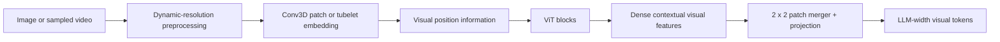

# Biến áp thị giác (ViT) trong Qwen VLMs

> **Câu hỏi:** Transformer thị giác đóng góp gì cho VLM và nó đóng góp như thế nào
> Qwen có thay đổi nó từ Qwen2-VL thành Qwen3-VL/Qwen3.5 không?
>
> **Phạm vi:** đường dẫn trực quan từ các patch hình ảnh/video đến hình ảnh theo ngữ cảnh
> đặc trưng. Mã hóa vị trí và nén token được mở rộng riêng biệt trong [pos_encode.md](pos_encode.md) và [patch_merger.md](patch_merger.md).
> Các ánh xạ chính xác từ bộ mã hóa được huấn luyện trước tới VLM được phân loại riêng trong
> [pretrained_vision_encoders.md](pretrained_vision_encoders.md).
> Ngày nghiên cứu: 21-07-2026.

## Câu trả lời ngắn

ViT biến hình ảnh hoặc video thành một **chuỗi vectơ đặc trưng theo ngữ cảnh**.
Bản thân nó không tạo ra lời nói. Trong Qwen, các nhóm và dự án mô-đun tiếp theo
các vectơ đó vào chiều rộng ẩn của mô hình ngôn ngữ, sau đó chúng thay thế
token giữ chỗ trực quan theo trình tự đa phương thức.

Công thức ViT ban đầu là `patchify -> linear projection -> position -> Transformer encoder -> classifier`. Thay vào đó, Qwen VLM giữ trình tự patch
giảm nó thành một token phân loại, hỗ trợ kích thước hình ảnh thay đổi và
video và huấn luyện các đặc điểm trực quan để nhận thức dựa trên ngôn ngữ. các
ViT ban đầu áp dụng khả năng tự chú ý của nhiều đầu toàn cầu vào patch hoàn chỉnh
trình tự, bao gồm token phân loại của nó, trong mỗi khối mã hóa. các
Các khối Transformer cũng không giống nhau qua các thế hệ Qwen: Qwen2.5-VL,
ví dụ: sử dụng sự chú ý của cửa sổ trong hầu hết các lớp trực quan và sự chú ý đầy đủ trong
bốn lớp. [ViT gốc, §3][vit] [Qwen2.5-VL, §2.1][qwen25]



## Cơ chế cốt lõi

Đặt đầu vào được xử lý có chiều dài tạm thời `T`, chiều cao `H`, chiều rộng `W`, không gian
kích thước patch `P` và kích thước patch tạm thời `P_t`. Trước khi sáp nhập, số lượng
đặc điểm hình ảnh là

$$
N_{\text{patch}} = \frac{T}{P_t}\frac{H}{P}\frac{W}{P}.
$$

Việc phân chia là chính xác vì bộ xử lý của Qwen thay đổi kích thước hoặc đệm lưới thành
bội số tương thích. Qwen sử dụng tích chập 3D có kernel và sải bước bằng nhau
`(P_t, P, P)`. Do đó, nó vừa là một công cụ trích xuất patch không chồng chéo vừa là một công cụ
phép chiếu tuyến tính đã học:

$$
X_0 = \operatorname{flatten}\left(
\operatorname{Conv3D}_{(P_t,P,P)}(I)
\right) \in \mathbb{R}^{N_{\text{patch}}\times d_v}.
$$

Đối với hình ảnh tĩnh, Qwen2/2.5 sao chép hình ảnh thành hai khung giống hệt nhau và sử dụng `P_t=2`, do đó, lưới đầu ra tạm thời vẫn có độ dài bằng một. Đối với video, hai
các khung liên tiếp tạo thành một ống nhỏ. [Qwen2-VL, §2.1][qwen2]
[Qwen2.5-VL, §2.1.1][qwen25]

Mỗi khối ViT được chuẩn hóa trước sẽ thực hiện

$$
\begin{aligned}
Y_l &= X_l + \operatorname{Attention}(\operatorname{Norm}(X_l)),\\
X_{l+1} &= Y_l + \operatorname{MLP}(\operatorname{Norm}(Y_l)).
\end{aligned}
$$

Chú ý làm cho việc trình bày mỗi patch phụ thuộc vào các patch khác được cho phép
ranh giới chú ý của lớp. Sự chú ý đầy đủ có thể kết nối hình ảnh hoàn chỉnh
lưới; sự chú ý của cửa sổ giới hạn một lớp đối với các cửa sổ cục bộ. Kết quả vẫn là một
trình tự dày đặc—không có Qwen-VL tương đương với việc chỉ sử dụng ViT gốc
Vector `[CLS]` để phân loại.

## Chú ý: LLM có gì khác biệt?

ViT thường sử dụng lại sự chú ý của sản phẩm chấm có tỷ lệ nhiều đầu giống như văn bản
Transformer: các patch được chiếu tới các truy vấn, khóa và giá trị và mỗi đầu ra
là một hỗn hợp có trọng số của các giá trị. Đạo hàm Q/K/V, nối đầu,
Do đó, đường dẫn dư và MLP trên mỗi token không được lặp lại ở đây. Họ làm theo
nguyên tắc tương tự như sự chú ý của văn bản. [Tất cả những gì bạn cần là sự chú ý, §3.2][Transformer]

Những thay đổi nào là **cấu trúc liên kết đầu vào và ranh giới chú ý**:

| Mối quan tâm | Chú ý LLM chỉ có bộ giải mã | ViT chú ý |
| --- | --- | --- |
| Đơn vị đầu vào | Token văn bản theo chuỗi 1D | Bản vá hình ảnh hoặc ống video trên lưới 2D/3D |
| Vị trí | Đặt hàng token | Tọa độ không gian hoặc thời gian |
| Thị giác | Thông thường là nhân quả: token \(i\) không thể đọc token trong tương lai | Thường là hai chiều: một patch có thể đọc bất kỳ patch nào được phép |
| Địa phương tự nhiên | Vị trí chuỗi lân cận | Các vùng lân cận trong lưới hình ảnh hoặc các khung video lân cận |
| Vai trò đầu ra trong VLM | Xây dựng cách trình bày văn bản được tạo | Bối cảnh hóa các đặc trưng thị giác trước khi hợp nhất và chèn vào LLM |

Tháp ViT tham dự giữa các patch hình ảnh; nó vẫn chưa trộn các patch đó
bằng những lời nhắc nhở. Ở Qwen, sự tương tác giữa thị giác và ngôn ngữ xảy ra sau khi hợp nhất
đặt các vectơ hình ảnh LLM-width vào chuỗi đa phương thức.

Vị trí đặc biệt quan trọng vì việc làm phẳng một lưới thành một chuỗi sẽ
bản thân nó không duy trì “ở trên”, “dưới” hoặc khung thời gian. Qwen tiêm trực quan
phối hợp thu hút sự chú ý thông qua RoPE trực quan; luồng tọa độ chính xác là trong
[pos_encode.md](pos_encode.md).

## Phương sai chú ý dành riêng cho thị giác

### Sự chú ý trực quan toàn cầu

ViT ban đầu sử dụng sự chú ý hai chiều hoàn toàn trên patch hoàn chỉnh
trình tự, bao gồm cả token phân loại của nó. Không giống như sự chú ý LLM nhân quả,
mặt nạ không phải là hình tam giác: mọi patch có thể trao đổi thông tin trực tiếp với
mọi patch khác trong một lớp. [ViT gốc, §3.1][vit]

Điều này trở nên tốn kém vì độ phân giải hình ảnh kiểm soát độ dài chuỗi. Với
Các patch 14 pixel của Qwen2.5:

| Hình ảnh đã qua xử lý | Lưới vá | Bản vá | Điểm cặp mỗi đầu |
| --- | ---: | ---: | ---: |
| \(224\times224\) | \(16\times16\) | 256 | 65.536 |
| \(448\times448\) | \(32\times32\) | 1.024 | 1.048.576 |

Nhân đôi cả hai kích thước hình ảnh sẽ tạo ra số lượng patch gấp bốn lần và mười sáu
gấp nhiều lần số cặp khóa truy vấn. Áp lực mở rộng không gian này là lý do tại sao cửa sổ
sự chú ý đặc biệt hữu ích trong các mô hình thị giác.

### Cửa sổ chú ý

Sự chú ý của cửa sổ duy trì sự chú ý Q/K/V thông thường nhưng thay đổi ** patch nào
có thể tương tác**. Lưới vá 2D được phân vùng thành các cửa sổ cục bộ và
sự chú ý được tính toán độc lập bên trong mỗi cửa sổ:

```text
Sự chú ý toàn cầu Sự chú ý của cửa sổ

A A A A A A | B B
A A A A A A | B B
A A A A ----+---
A A A A C C | D D
                              C C | D D

một vùng 16 patch bốn vùng 4 patch độc lập
```

Đối với các patch \(N\) được chia thành các cửa sổ cố định của các patch \(K\), số cặp là
\(N K\) thay vì \(N^2\). Sự đánh đổi là các patch lỗi ở xa không thể
giao tiếp trực tiếp trong lớp đó.

Swin Transformer giải quyết vấn đề ranh giới cố định bằng cách xen kẽ thường xuyên và
phân vùng cửa sổ bị dịch chuyển. Hai miếng vá cách nhau bởi ranh giới của một lớp có thể
rơi vào cùng một cửa sổ ở lớp tiếp theo, cho phép thông tin được truyền bá
xuyên suốt hình ảnh theo chiều sâu. Swin cũng hợp nhất các patch giữa các giai đoạn để xây dựng
một hệ thống phân cấp không gian. [Transformer Swin, §§1 và 3.2][swin]

```text
Lớp L: cửa sổ thông thường -> Lớp L+1: cửa sổ được dịch chuyển
chỉ trộn cục bộ các ranh giới cửa sổ trước đó được vượt qua
```

Sự chú ý của cửa sổ được hiểu rõ nhất là một mô hình thưa thớt có hình dạng thị giác: nó
các khối hình chữ nhật thông thường phù hợp với hình dạng hình ảnh và có hiệu quả theo lô.

### Cửa sổ lai và sự chú ý toàn cầu

Một giải pháp khác giữ sự chú ý của cửa sổ giá rẻ ở hầu hết các lớp và chèn một vài
các lớp toàn cầu để kết nối lại hình ảnh hoàn chỉnh:

```text
cửa sổ -> cửa sổ -> cửa sổ -> toàn cầu -> lặp lại
```

Qwen2.5-VL sử dụng thiết kế này. Trong số 32 khối trực quan của nó, các khối
`{7,15,23,31}` sử dụng toàn bộ sự chú ý và 28 cái còn lại sử dụng cửa sổ 112 x 112 pixel.
Đối với hình ảnh `224 x 224`, mỗi lớp cục bộ xử lý bốn cửa sổ gồm 64 patch:

```text
lớp cửa sổ: 4 * (64 * 64) = 16.384 cặp điểm/đầu
lớp toàn cầu: 256 * 256 = 65.536 cặp điểm/đầu
```

Các lớp cửa sổ giảm chi phí, trong khi các lớp toàn cục định kỳ cung cấp trực tiếp
trao đổi toàn bộ hình ảnh. Đây không phải là cơ chế cửa sổ dịch chuyển của Swin: Qwen2.5 sử dụng
các cửa sổ thông thường cộng với các lớp chú ý toàn cầu rõ ràng.
[Qwen2.5-VL, Bảng 1 và §2.1.1][qwen25]
[Đã ghim triển khai Qwen2.5-VL] [qwen25-code]

### Các biến thể khác, tóm tắt

Sự chú ý thưa thớt chung, sự chú ý tuyến tính và các hạt nhân được tối ưu hóa như
FlashAttention về bản chất không phải là cơ chế ViT; những ý tưởng tương tự cũng được áp dụng
để nhắn tin cho Transformers. Do đó, chúng nằm ngoài phạm vi ở đây. Có liên quan
lựa chọn dành riêng cho thị giác là cách kết nối sự chú ý theo hình ảnh/video
lưới: toàn cục, cửa sổ cố định, cửa sổ đã dịch chuyển hoặc cửa sổ/lịch trình toàn cầu.

Trong các tháp Qwen được ghi lại, Qwen2.5-VL sử dụng sơ đồ cửa sổ/toàn cầu kết hợp.
Thay vào đó, việc triển khai Qwen3-VL được ghim sử dụng toàn bộ sự chú ý trong mỗi
phân đoạn hình ảnh hoặc video được đóng gói và Qwen3.5 kế thừa dòng khối thị giác đó.
[Đã ghim triển khai Qwen3-VL] [qwen3-code]
[Đã ghim đường nhìn của Qwen3.5] [qwen35-code]

## Luồng dữ liệu ví dụ: một hình ảnh 224 x 224

Sử dụng **Qwen2.5-VL-7B** làm ví dụ cụ thể. Giấy/cấu hình chỉ định một
Bản vá 14 pixel, patch tạm thời kích thước 2, chiều rộng hình ảnh 1.280, khối 32 ViT và một
chiều rộng đầu ra là 3.584. Sau đây cho thấy hình dạng tensor; giá trị đặc trưng số
được học và do đó bị bỏ qua. [Qwen2.5-VL, Bảng 1 và §2.1][qwen25]
[Đã ghim cấu hình Qwen2.5-VL-7B] [qwen25-config]

```text
Nhập hình ảnh RGB
  hình dạng logic: 224 x 224 x 3
        |
        | coi hình ảnh là hai khung hình giống hệt nhau
        v
Đầu vào dạng video logic
  2 khung hình x 224 x 224 x 3
        |
        | Hạt nhân Conv3D=sải bước=(2, 14, 14)
        v
Lưới vá
  T=1, H=16, W=16, chiều rộng=1280
  hình phẳng: 256 x 1280
        |
        | RoPE 2D trực quan trên lưới 16 x 16
        v
32 khối ViT
  khối 7, 15, 23, 31: tập trung hoàn toàn vào 256 patch
  28 khối khác: chú ý đến cửa sổ
        |
        v
Các đặc trưng ViT theo ngữ cảnh
  hình dạng: 256 x 1280
        |
        | sáp nhập 2 x 2; bốn vectơ lân cận trở thành một
        v
Tải trọng trực quan được hợp nhất
  lưới: 1 x 8 x 8
  hình dạng: 64 x 3584
        |
        | thay thế 64 phần giữ chỗ trực quan trong lời nhắc
        v
Bộ giải mã ngôn ngữ Qwen2.5
```

Đối với hình ảnh này, cửa sổ chú ý 112 x 112 pixel tương ứng với `8 x 8`
trước khi hợp nhất các patch. Do đó, trên lưới vá `16 x 16`, lớp chú ý cửa sổ
xử lý bốn cửa sổ không gian, mỗi cửa sổ có 64 patch, trong khi một lớp chú ý đầy đủ
có thể kết nối tất cả 256 patch. Đây là lý do tại sao đặc trưng cuối cùng tại một địa điểm lại không có
còn chỉ là một patch cục bộ được làm phẳng: nó chứa ngữ cảnh được tích lũy trên toàn bộ
Biểu đồ chú ý 32 khối.

Chuỗi `64 x 3584` cuối cùng là đầu ra hợp nhất, không phải đầu ra ViT thô. các
hai báo cáo tiếp theo phóng to hai phép biến đổi bị bỏ qua: chính xác
[luồng tọa độ vị trí](pos_encode.md) và một luồng đã hoạt động
[Thao tác hợp nhất 2 x 2](patch_merger.md).

## Phân loại ViT so với VLM ViT của Qwen

| Khía cạnh | Phân loại gốc ViT | Tháp thị giác Qwen |
| --------------- | ------------------------------------------------ | ------------------------------------------------------------------------------------------------------ |
| Hình dạng đầu vào | Thông thường một độ phân giải cố định | Hình ảnh có độ phân giải động/gốc và lưới video có thể thay đổi |
| Nhúng patch | Phép chiếu tuyến tính 2D hoặc tương đương Conv2D | Trình chiếu patch/tubelet Conv3D được chia sẻ cho hình ảnh và video |
| Vị trí | Đã học bảng tuyệt đối 1D trong thiết kế ban đầu | RoPE trực quan 2D; sau này Qwen cũng nội suy các nhúng tuyệt đối đã học |
| Chú ý | Sự chú ý toàn cầu trong từng khối mã hóa | Phụ thuộc vào thế hệ: Qwen2.5 kết hợp sự chú ý của cửa sổ và toàn cầu; Qwen3-VL thu hút sự chú ý trực quan |
| Đầu ra | Thông thường một đại diện lớp | Tất cả các đặc trưng không gian, sau đó là máy chiếu/sáp nhập 2 x 2 |
| Mục tiêu huấn luyện | Phân loại hình ảnh | Căn chỉnh ngôn ngữ thị giác và các mục tiêu đa phương thức từ đầu đến cuối |

Bản thân bài viết ViT nhấn mạnh rằng hiệu suất hữu ích cần có quy mô lớn
huấn luyện trước. Chỉ riêng kiến ​​trúc không giải thích được OCR, nền tảng hoặc hình ảnh
chất lượng lập luận. [ViT gốc] [vit]

## Sự tiến hóa ở Qwen

| Người mẫu | Đã xác minh thay đổi xương sống trực quan | Hiệu quả thiết thực |
| ---------- | ------------------------------------------------------------------------------------------------------------------------------------------------------------------------------------ | ------------------------------------------------------------------------------------------------------------------------------ |
| Qwen2-VL | Khoảng 675M thông số ViT; kích thước miếng vá 14; loại bỏ bảng tuyệt đối cũ, thêm RoPE 2D, độ phân giải động và tích chập 3D độ sâu 2 | Một tháp xử lý hình ảnh và video trong khi vẫn giữ được các chi tiết không gian có thể thay đổi |
| Qwen2.5-VL | ViT 32 lớp mới, chiều rộng 1280 được huấn luyện từ đầu; 16 đầu; Các patch 14 pixel; 28 lớp chú ý đến cửa sổ và sự chú ý đầy đủ tại các khối`{7,15,23,31}`; RMSNorm và FFN theo phong cách SwiGLU | Hầu hết các tỷ lệ pha trộn trực quan gần như tuyến tính với số lượng patch trong khi các lớp toàn cầu định kỳ khôi phục tương tác toàn bộ hình ảnh |
| Qwen3-VL | Tiếp tục từ SigLIP-2 đã được huấn luyện trước, huấn luyện ở độ phân giải động, kết hợp các vị trí đã học được nội suy với RoPE 2D và xuất ba cấp độ trung gian cho DeepStack | Khởi tạo trực quan được huấn luyện trước mạnh mẽ hơn và kết hợp đa cấp với LLM |
| Qwen3.5 | Kế thừa các khối xây dựng trực quan Qwen3-VL nhưng bản triển khai đã phát hành sẽ xóa DeepStack và chỉ chuyển các đặc trưng được hợp nhất cuối cùng ở đầu vào bộ giải mã | Con đường hợp nhất đơn giản hơn; đừng cho rằng mọi đặc trưng của Qwen3-VL đều không thay đổi |

### Qwen2-VL

**Đã xác minh.** Qwen2-VL sử dụng một ViT thông số khoảng 675M cho tất cả LLM
kích thước. Bản vá không gian 14 pixel và hạt nhân tạm thời hai khung hình tạo hình ảnh/video
đặc trưng; độ phân giải động làm cho độ dài chuỗi phụ thuộc vào đầu vào
lưới. Mô hình loại bỏ các phần nhúng vị trí tuyệt đối trước đó và sử dụng RoPE 2D
bên trong tháp. [Qwen2-VL, §2.1][qwen2]

Thiết kế này cải thiện tính linh hoạt nhưng độ phân giải cao hơn vẫn tạo ra nhiều
các patch lỗi. Sự cắt bỏ của chính Qwen2 cũng cho thấy việc chỉ phóng to mọi hình ảnh là không
luôn tốt hơn; việc nâng cấp không phù hợp có thể khiến đầu vào bị loại khỏi quá trình huấn luyện
phân bổ. [Qwen2-VL, §3.3.1][qwen2]

### Qwen2.5-VL

**Đã xác minh.** Bài báo Qwen2.5-VL báo cáo ViT 32 lớp với chiều rộng ẩn
1.280, 16 đầu và kích thước patch 14. Lịch trình chú ý toàn cầu/cửa sổ của nó là
chi tiết ở trên. Các vùng nhỏ hơn được xử lý mà không cần đệm.
[Qwen2.5-VL, Bảng 1 và §2.1.1][qwen25]

Bài báo báo cáo kích thước trung bình của FFN là 3.456, trong khi kích thước hiện tại
đã phát hành bản ghi cấu hình checkpoint 7B 3.420. Đây là sự khác biệt về nguồn, không phải là
value để âm thầm bình thường hóa đi. Sử dụng cấu hình checkpoint khi sao chép
checkpoint đó và giá trị của tờ giấy khi mô tả thí nghiệm trên giấy.
[Đã ghim cấu hình Qwen2.5-VL-7B] [qwen25-config]

### Qwen3-VL và Qwen3.5

**Đã xác minh.** Qwen3-VL khởi chạy bộ mã hóa của nó từ SigLIP-2 và liên tục
huấn luyện nó ở độ phân giải động. Bài báo gọi kết quả là Qwen3-ViT và sử dụng
SigLIP2-SO-400M theo mặc định, với SigLIP2-Large cho các biến thể 2B và 4B. Của nó
quá trình cắt bỏ so sánh bộ mã hóa đã được huấn luyện này với SigLIP-2 ban đầu theo
thiết lập được báo cáo; kết quả không nên được coi là một bảng xếp hạng chung về thị giác
bộ mã hóa. [Qwen3-VL, §2 và §5.12.1][qwen3]

Cấu hình Qwen3-VL-8B được ghim có 27 khối trực quan, chiều rộng 1.152, 16 đầu,
`patch_size=16`, `temporal_patch_size=2` và DeepStack chạm vào khối 8, 16 và
24. [Đã ghim cấu hình Qwen3-VL-8B] [qwen3-config] Cấu hình 27B của Qwen3.5 giữ nguyên
hình dạng patch/tháp nhưng có danh sách chỉ mục DeepStack trống; tham chiếu của nó về phía trước
path loại bỏ rõ ràng các mô-đun DeepStack. Những con số chính xác này là
checkpoint cụ thể, không phải là lời hứa cho mọi thành viên trong gia đình.
[Đã ghim cấu hình Qwen3.5-27B] [qwen35-config]
[Đã ghim đường nhìn của Qwen3.5] [qwen35-code]

## Chi phí, thông tin và những lỗi thường gặp

- Sự tự chú ý bằng hình ảnh là bậc hai về số lượng patch khi nó mang tính toàn cầu.
  Các lớp cửa sổ của Qwen2.5 giảm phần này thành tỷ lệ gần như tuyến tính cho kích thước cửa sổ cố định, nhưng bốn lớp chú ý đầy đủ của nó vẫn là bậc hai.
- Các đặc trưng của patch không phải là pixel cục bộ thô sau ViT. Mỗi đặc trưng đã tích lũy ngữ cảnh thông qua biểu đồ chú ý được phép trước khi hợp nhất.
- Độ phân giải động chỉ bảo tồn nhiều chi tiết nguồn hơn trong phạm vi bộ xử lý
  ngân sách pixel/token. Nó không ngụ ý các pixel gốc không bị mất.
- Hình ảnh lớn hơn tạo ra nhiều công việc điền trước trực quan hơn và sau khi hợp nhất, sẽ có nhiều token hơn cho LLM. [Việc sáp nhập patch](patch_merger.md) giảm bớt nhưng không loại bỏ
  sự tăng trưởng đó.
- Sự chú ý của cửa sổ Qwen2.5 và Qwen3-VL DeepStack thuộc các phiên bản khác nhau.
  Việc liệt kê cả hai dưới dạng thuộc tính chung của mọi mô hình “Qwen gần đây” là không chính xác.
- Qwen-VLA xác nhận đường trục Qwen3.5 VLM có ViT và hợp nhất không gian, nhưng nó
  bài báo không tiết lộ cấu hình thị giác 4B chính xác. Đừng thay thế
  cấu hình 27B mà không đánh dấu nó là suy luận.

## Nguồn

Tất cả các nguồn trực tuyến đã được truy cập vào ngày 21-07-2026.

- Dosovitskiy và cộng sự. *Một hình ảnh có giá trị 16x16 từ: Transformer cho hình ảnh
  Công nhận ở quy mô*. ICLR 2021. [arXiv][vit]
- Vaswani và cộng sự. *Chú ý là tất cả những gì bạn cần*. NeurIPS 2017.
  [arXiv][Transformer]
- Lưu và cộng sự. *Swin Transformer: Transformer thị giác phân cấp sử dụng Shifted
  Cửa sổ*. ICCV 2021. [arXiv][swin]
- Vương và cộng sự. *Qwen2-VL: Nâng cao nhận thức của mô hình ngôn ngữ thị giác về
  Thế giới ở mọi độ phân giải*. 2024. [PDF địa phương][qwen2-local] · [arXiv][qwen2]
- Bài và cộng sự. *Báo cáo kỹ thuật Qwen2.5-VL*. 2025.
  [PDF cục bộ][qwen25-local] · [arXiv][qwen25]
- Bài và cộng sự. *Báo cáo kỹ thuật Qwen3-VL*. 2025. [arXiv][qwen3]
- Qwen và ôm mặt. Cấu hình checkpoint được ghim và triển khai tham chiếu
  được liên kết bên dưới.

[vit]: https://arxiv.org/abs/2010.11929
[Transformer]: https://arxiv.org/abs/1706.03762
[thắng]: https://arxiv.org/abs/2103.14030
[qwen2]: https://arxiv.org/abs/2409.12191
[qwen25]: https://arxiv.org/abs/2502.13923
[qwen3]: https://arxiv.org/abs/2511.21631
[qwen2-local]: ../../../gwen-overview/qwen2_vl_2409.12191.pdf
[qwen25-local]: ../../../gwen-overview/qwen2.5_vl_2502.13923.pdf
[qwen25-config]: https://huggingface.co/Qwen/Qwen2.5-VL-7B-Instruct/blob/cc594898137f460bfe9f0759e9844b3ce807cfb5/config.json
[qwen25-code]: https://github.com/huggingface/transformers/blob/29985e67cccdddef7e336d7e53840500359d30a3/src/transformers/models/qwen2_5_vl/modeling_qwen2_5_vl.py
[qwen3-config]: https://huggingface.co/Qwen/Qwen3-VL-8B-Instruct/blob/0c351dd01ed87e9c1b53cbc748cba10e6187ff3b/config.json
[qwen3-code]: https://github.com/huggingface/transformers/blob/29985e67cccdddef7e336d7e53840500359d30a3/src/transformers/models/qwen3_vl/modeling_qwen3_vl.py
[qwen35-config]: https://huggingface.co/Qwen/Qwen3.5-27B/blob/fc05daec18b0a78c049392ed2e771dde82bdf654/config.json
[qwen35-code]: https://github.com/huggingface/transformers/blob/7ea2320c76117e6742364808a666ef6f2fb40a67/src/transformers/models/qwen3_5/modular_qwen3_5.py
