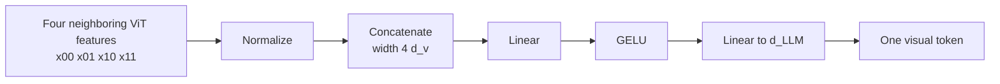

# Sáp nhập patch trong Qwen VLMs

> **Câu hỏi:** Làm cách nào Qwen biến một mạng lưới dài các đặc trưng ViT thành ít token phù hợp với mô hình ngôn ngữ hơn?
>
> **Phạm vi:** sáp nhập không gian Qwen 2 x 2 từ Qwen2-VL đến Qwen3.5,
> bao gồm cả vai trò của nó vừa là máy nén token vừa là máy chiếu ngôn ngữ thị giác.
> Ngày nghiên cứu: 21-07-2026.

## Câu trả lời ngắn

Việc hợp nhất patch của Qwen đã đưa từng nhóm `2 x 2` liền kề về mặt không gian vào **
các đặc trưng ViT theo ngữ cảnh**, nối bốn vectơ và áp dụng MLP
tạo ra một vectơ ở độ rộng ẩn của mô hình ngôn ngữ. Do đó nó làm
hai công việc cùng một lúc:

1. giảm số lượng token trực quan xuống bốn lần; Và
2. các dự án từ chiều rộng thị giác đến chiều rộng mô hình ngôn ngữ.

Nó không phải là sự tổng hợp trung bình, một bộ lấy mẫu lại truy vấn đã học hoặc một “sự hợp nhất sau đó” riêng biệt.
máy chiếu". Đó là những lựa chọn thay thế VLM chung hữu ích, nhưng chúng không phải là
Mô-đun Qwen được mô tả ở đây. [Qwen2.5-VL, §2.1][qwen25]



## Hoạt động của tensor

Đối với lưới đặc trưng

$$
X\in\mathbb{R}^{T\times H\times W\times d_v}
$$

và kích thước hợp nhất không gian `s=2`, sắp xếp lại từng nhóm cục bộ thành

$$
g_{t,i,j}=\operatorname{concat}(
x_{t,2i,2j},
x_{t,2i,2j+1},
x_{t,2i+1,2j},
x_{t,2i+1,2j+1})
\in\mathbb{R}^{4d_v}.
$$

MLP hai lớp tính toán

$$
y_{t,i,j}=W_2\,\operatorname{GELU}(W_1g_{t,i,j}+b_1)+b_2,
\qquad y_{t,i,j}\in\mathbb{R}^{d_{\text{LLM}}}.
$$

Kể từ đây

$$
N_{\text{out}}=\frac{T H W}{s^2}=\frac{T H W}{4}.
$$

`T`, `H` và `W` đây là kích thước lưới **sau** patch/ống nhỏ
nhúng. Quá trình xử lý trước của Qwen làm cho `H` và `W` chia hết cho kích thước hợp nhất.
Việc sáp nhập không làm giảm thời gian; nén thời gian xảy ra sớm hơn thông qua
nhúng ống nghiệm hai khung.

## Luồng dữ liệu ví dụ: một nhóm 2 x 2

Tiếp tục ví dụ `224 x 224` **Qwen2.5-VL-7B**. ViT phát ra một
Lưới đặc trưng `16 x 16 x 1280`. Theo dõi nhóm ở hàng 1, cột 1 đã hợp nhất—
cùng một nhóm được sử dụng trong ví dụ mã hóa vị trí:

```text
Tọa độ trước khi hợp nhất Hình dạng đặc trưng

x[2,2] x[2,3] mỗi vectơ: 1280
x[3,2] x[3,3]
        |
        | RMSNorm mỗi đặc trưng
        v
n[2,2] n[2,3] 4 x 1280
n[3,2] n[3,3]
        |
        | nối theo thứ tự raster được sắp xếp của mô hình
        v
g[1,1] 4*1280 = 5120
        |
        | Tuyến tính 5120 -> 5120
        | GELU
        | Tuyến tính 5120 -> 3584
        v
y[1,1] một token trực quan LLM-width
```

Việc lặp lại thao tác trên toàn bộ lưới sẽ mang lại

```text
Đầu ra ViT: 1 x 16 x 16 x 1280 = 256 vectơ đặc trưng
phân nhóm: 1 x 8 x 8 nhóm = 64 nhóm
sản lượng sáp nhập: 64 x 3584
```

Ví dụ này cho thấy hai phép biến đổi mà tên “sáp nhập patch” có thể
ẩn: độ dài chuỗi thay đổi từ 256 thành 64, trong khi chiều rộng của đối tượng thay đổi từ
1.280 đến 3.584. Ô đầu ra `(1,1)` nhận được
[bộ giải mã tọa độ MRoPE](pos_encode.md) `(t=0,h=1,w=1)` trước khi chú ý đến
mô hình ngôn ngữ [Qwen2.5-VL, Bảng 1 và §2.1][qwen25]
[Đã ghim triển khai Qwen2.5-VL] [qwen25-code]

## Tại sao hợp nhất sau ViT

Nếu bốn patch thô được nén trước khi được chú ý bằng mắt, chi tiết đẹp có thể
bị loại bỏ trước khi nó tương tác với bối cảnh xung quanh. Thay vào đó Qwen chạy
[ViT](ViT.md) đầu tiên. Token tham gia sáp nhập vẫn chiếm một lưới
vị trí, nhưng vectơ của nó đã có thông tin hỗn hợp thông qua địa phương/toàn cầu
sự chú ý trực quan.

Sự đánh đổi là có chủ ý:

- ViT trả tiền cho toàn bộ lưới trước khi hợp nhất, duy trì hình ảnh chi tiết
  xử lý;
- mô hình ngôn ngữ lớn hơn nhiều chỉ nhận được một phần tư số lượng hình ảnh
  token;
- mỗi token đầu ra giữ một vị trí raster cố định tương ứng với một 2 x 2
  nhóm, hoạt động tự nhiên với phía bộ giải mã
  [vị trí chiều cao/chiều rộng](pos_encode.md).

Để tập trung hoàn toàn vào chuỗi hình ảnh phụ, giảm độ dài của nó đi bốn
giảm diện tích ma trận chú ý từ thị giác đến thị giác tới 16. Đây là một
tỷ lệ cấp độ thành phần theo lý thuyết, không phải là tốc độ tăng tốc từ đầu đến cuối 16 lần: token văn bản,
Tính toán ViT, phép chiếu, hạt nhân và phần còn lại của bộ giải mã vẫn đóng góp.

## Ví dụ về số lượng token cụ thể

### Qwen2/2.5 với các patch 14 pixel

Hình ảnh `224 x 224` đã được xử lý sẽ tạo ra lưới patch `16 x 16`:

```text
224 / 14 = 16
Tính năng 16 x 16 = 256 ViT
Hợp nhất 2 x 2 -> 8 x 8 = 64 token trực quan
```

Qwen2-VL báo cáo 66 token vào LLM vì nó tính 64 token được hợp nhất
token cộng với `<|vision_start|>` và `<|vision_end|>`. Các điểm đánh dấu ranh giới không
kết quả của việc sáp nhập. [Qwen2-VL, §2.1][qwen2]

Mỗi token được hợp nhất có dấu chân hình học `28 x 28`-pixel danh nghĩa trước
xem xét thay đổi kích thước và bối cảnh ViT. Nó không nên được gọi là `28 x 28` thô
patch: bốn đầu vào của nó là các vectơ đặc trưng theo ngữ cảnh.

### Qwen3-VL/Qwen3.5 với các patch 16 pixel

Cấu hình Qwen3-VL-8B và Qwen3.5-27B được ghim sử dụng `patch_size=16` và
`spatial_merge_size=2`. Do đó, một token trực quan của bộ giải mã tương ứng với một
vùng `32 x 32` danh nghĩa trong ảnh đã xử lý, một lần nữa với giá trị đã học lớn hơn nhiều
trường tiếp nhận sau ViT. [Đã ghim cấu hình Qwen3-VL-8B] [qwen3-config]
[Đã ghim cấu hình Qwen3.5-27B] [qwen35-config]

## Chi tiết triển khai theo thế hệ

| Người mẫu | Hành vi sáp nhập | Sự khác biệt quan trọng |
| ---------- | -------------------------------------------------------------------------------------------------------------------- | ---------------------------------------------------------------------------------------------------------------- |
| Qwen2-VL | MLP đơn giản sau khi ViT nén 2 x 2 token liền kề | Paper thiết lập đặc trưng nén và ví dụ 224 pixel/66 token, nhưng cung cấp ít chi tiết bên trong hơn mã sau này |
| Qwen2.5-VL | RMSNorm mỗi đặc trưng có chiều rộng 1280, định hình lại bốn lân cận thành chiều rộng 5120, sau đó là hai lớp tuyến tính có chiều rộng GELU đến LLM | Độ rộng đầu ra thay đổi theo khung ngôn ngữ 3B/7B/72B |
| Qwen3-VL | LayerNorm + GELU MLP hai lớp; một sự hợp nhất cuối cùng cộng với các sự hợp nhất chuyên dụng cho ba cấp đặc trưng DeepStack | Các đặc trưng ViT trung gian cũng được chiếu và đưa vào ba lớp LLM đầu tiên |
| Qwen3.5 | Kế thừa sáp nhập Qwen3-VL chính nhưng xóa danh sách sáp nhập DeepStack | Chỉ các đặc trưng được hợp nhất cuối cùng mới được chèn một lần ở đầu vào bộ giải mã |

### Chuẩn hóa và chiếu Qwen2.5-VL

Việc triển khai tham chiếu được ghim thực hiện RMSNorm ở độ rộng trực quan trước
định hình lại từng nhóm thành `4*d_v`. Lớp tuyến tính đầu tiên của nó bảo toàn rằng
chiều rộng nối; bản đồ thứ hai của nó tới `d_LLM`. Điều này xác nhận rằng mô-đun là
đồng thời là sự hợp nhất không gian và máy chiếu có chiều rộng phương thức.
[Đã ghim triển khai Qwen2.5-VL] [qwen25-code]

Bài báo Qwen2.5 báo cáo chiều rộng đầu vào sáp nhập 1.280 và đầu ra là 2.048, 3.584,
và 8.192 cho các biến thể 3B, 7B và 72B tương ứng. Việc nén token
tỷ lệ không thay đổi mặc dù chiều rộng chiếu tuân theo LLM.
[Qwen2.5-VL, Bảng 1][qwen25]

### Sự hợp nhất chính của Qwen3-VL và DeepStack

Qwen3-VL giữ lại sự hợp nhất cuối cùng và thêm một sự hợp nhất chuyên dụng cho mỗi sự hợp nhất được chọn
mức độ ViT trung bình. Đường dẫn chính chuẩn hóa từng đặc trưng `d_v` trước đó
phân nhóm; trước tiên hãy nhóm đường dẫn DeepStack tham chiếu, sau đó chuẩn hóa
Vectơ `4*d_v` (`use_postshuffle_norm=true`). Cả hai đường dẫn đều có chiều rộng LLM.
[Đã ghim triển khai Qwen3-VL] [qwen3-code]

Ba chuỗi đặc trưng được hợp nhất trung gian được thêm vào chuỗi tương ứng
vị trí trực quan trong ba lớp LLM đầu tiên. Trong giấy được kiểm soát
cắt bỏ trước khi tập luyện, DeepStack tăng mức trung bình 12 tác vụ được báo cáo từ 74,7 lên
76,0. Điều đó hỗ trợ thiết lập huấn luyện chính xác này; nó không chứng minh thêm điều đó
sáp nhập luôn hoàn thiện mọi công việc. [Qwen3-VL, §2.2 và §5.12.2][qwen3]

### Qwen3.5 loại bỏ DeepStack

Đường chuyển tiếp Qwen3.5 được ghim sẽ xóa rõ ràng `deepstack_visual_indexes`
và `deepstack_merger_list`, lặp qua các khối thị giác và chỉ gọi
sự sáp nhập cuối cùng. Cấu hình 27B của nó chứa danh sách chỉ mục DeepStack trống. Vì thế
Qwen3.5 không nên được lập sơ đồ với ba đường dẫn chèn bổ sung của Qwen3-VL.
[Đã ghim triển khai Qwen3.5] [qwen35-code]
[Đã ghim cấu hình Qwen3.5-27B] [qwen35-config]

## Bố cục là một phần của hợp đồng

Việc triển khai sáp nhập chỉ có thể sử dụng một định hình lại đơn giản vì quá trình tiền xử lý
và mô hình thị giác sắp xếp các token sao cho bốn vectơ đặc trưng liên tiếp là
các lân cận không gian dự định. Qwen2.5 sắp xếp lại thêm các đặc trưng cho
chú ý đến cửa sổ và áp dụng các chỉ số nghịch đảo sau khi hợp nhất để khôi phục raster
đặt hàng. Sao chép MLP mà không có cùng thứ tự lưới có thể hợp nhất một cách âm thầm
những vị trí không liên quan. [Đã ghim triển khai Qwen2.5-VL] [qwen25-code]

Hợp đồng hình dạng có thể kiểm toán là:

```text
số lượng đầu vào = T * H * W
chiều rộng đầu vào = d_v
chiều rộng nhóm = 4 * d_v
số lượng đầu ra = T * H * W / 4
chiều rộng đầu ra = d_LLM
```

Bất kỳ checkpoint triển khai hoặc chuyển đổi nào đều phải xác minh tất cả bốn đại lượng,
cộng với thứ tự lân cận, thay vì chỉ kiểm tra xem tensor cuối cùng có
đúng cấp bậc.

## Hạn chế và sai lầm thường gặp

- Hợp nhất là mất mát. Bốn vectơ token trở thành một vectơ có chiều rộng cố định; MLP
  có thể học được những gì cần giữ lại, nhưng không thể đảm bảo bảo toàn được mọi chi tiết.
- Nó làm giảm số lượng token LLM-side chứ không phải số lượng patch phía ViT. Độ phân giải cao
  đầu vào vẫn khiến tháp thị giác trở nên đắt đỏ.
- “Một token được hợp nhất bằng 28 x 28 hoặc 32 x 32 pixel” mô tả lưới danh nghĩa
  phạm vi bao phủ, không phải trường tiếp nhận theo ngữ cảnh hoặc các pixel nguồn chính xác sau
  thay đổi kích thước.
- Việc sáp nhập patch không thực hiện sự chú ý đa phương thức. Nó chỉ phát ra vectơ
  với chiều rộng chính xác; tương tác đa phương thức xảy ra trong mô hình ngôn ngữ.
- Việc sáp nhập Qwen không nên được kết hợp với bộ lấy mẫu lại Perceiver hoặc Q-Former
  các truy vấn đã học. Những thứ đó có thể tạo ra số lượng token cố định; Đầu ra của Qwen vẫn còn
  tỷ lệ thuận với diện tích đầu vào.
- Bài báo Qwen-VLA xác nhận việc hợp nhất không gian trong xương sống Qwen3.5 VLM của nó nhưng
  không tiết lộ kích thước chính xác của trạm kiểm soát 4B. Giá trị từ công chúng
  Cấu hình Qwen3.5-27B không tự động hợp lệ cho Qwen-VLA.

## Nguồn

Tất cả các nguồn trực tuyến đã được truy cập vào ngày 21-07-2026.

- Vương và cộng sự. *Qwen2-VL*. [PDF cục bộ][qwen2-local] · [arXiv][qwen2]
- Bài và cộng sự. *Báo cáo kỹ thuật Qwen2.5-VL*.
  [PDF cục bộ][qwen25-local] · [arXiv][qwen25]
- Bài và cộng sự. *Báo cáo kỹ thuật Qwen3-VL*. [arXiv][qwen3]
- Qwen và ôm mặt. Đã ghim các triển khai và cấu hình checkpoint bên dưới.

[qwen2]: https://arxiv.org/abs/2409.12191
[qwen25]: https://arxiv.org/abs/2502.13923
[qwen3]: https://arxiv.org/abs/2511.21631
[qwen2-local]: ../../../gwen-overview/qwen2_vl_2409.12191.pdf
[qwen25-local]: ../../../gwen-overview/qwen2.5_vl_2502.13923.pdf
[qwen25-code]: https://github.com/huggingface/transformers/blob/29985e67cccdddef7e336d7e53840500359d30a3/src/transformers/models/qwen2_5_vl/modeling_qwen2_5_vl.py
[qwen3-code]: https://github.com/huggingface/transformers/blob/29985e67cccdddef7e336d7e53840500359d30a3/src/transformers/models/qwen3_vl/modeling_qwen3_vl.py
[qwen3-config]: https://huggingface.co/Qwen/Qwen3-VL-8B-Instruct/blob/0c351dd01ed87e9c1b53cbc748cba10e6187ff3b/config.json
[qwen35-config]: https://huggingface.co/Qwen/Qwen3.5-27B/blob/fc05daec18b0a78c049392ed2e771dde82bdf654/config.json
[qwen35-code]: https://github.com/huggingface/transformers/blob/7ea2320c76117e6742364808a666ef6f2fb40a67/src/transformers/models/qwen3_5/modular_qwen3_5.py
