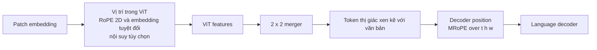

# Mã hóa vị trí trong stack ngôn ngữ-thị giác Qwen

> **Câu hỏi:** Qwen làm cách nào để duy trì trật tự không gian và thời gian khi hiển thị
> đặc trưng đi qua vision tower rồi đến bộ giải mã ngôn ngữ?
>
> **Phạm vi:** Qwen2-VL, Qwen2.5-VL, Qwen3-VL và tài liệu tham khảo Qwen3.5 đã phát hành
> con đường. Ngày nghiên cứu: 21-07-2026.

## Câu trả lời ngắn gọn: có hai hệ thống vị trí

Qwen không sử dụng một mã hóa vị trí cho toàn bộ quy trình trực quan.

1. **Bên trong ViT**, các vị trí mô tả lưới vá để có thể chú ý trực quan
   phân biệt lên/xuống và trái/phải. Qwen2/2.5 sử dụng RoPE 2D; Qwen3-VL và
   Qwen3.5 cũng bổ sung thêm đặc trưng nhúng tuyệt đối đã học được nội suy.
2. **Bên trong bộ giải mã ngôn ngữ**, MRoPE gán thời gian, chiều cao và chiều rộng
   phối hợp với các token trực quan trong khi văn bản thông thường hoạt động giống như RoPE 1D. Cái này
   cho phép văn bản, hình ảnh và video chia sẻ một chuỗi nhân quả mà không giả vờ
   hình ảnh chỉ là một hàng phẳng gồm các token không liên quan.

Các hệ thống này hoạt động theo các mô-đun khác nhau và ở các độ rộng đặc trưng khác nhau. “Qwen
sử dụng MRoPE” không có nghĩa là ViT và LLM sử dụng cùng một tensor vị trí.



## Từ nhúng tuyệt đối đến RoPE

Bảng vị trí tuyệt đối thêm vectơ đã học vào nội dung token:

$$
x_{h,w}^{\prime}=x_{h,w}+e_{h,w}.
$$

Điều này đơn giản nhưng một bảng được huấn luyện trên một hình dạng lưới phải được thay đổi kích thước hoặc
nội suy cho một hình dạng mới. ViT ban đầu sử dụng vị trí 1D đã học
nhúng trên chuỗi bản vá phẳng. [ViT gốc, §3.1][vit]

Thay vào đó, RoPE sẽ xoay các cặp kích thước truy vấn và khóa. Đối với một cặp 2D tại
vị trí `p` và tần số góc $\theta_i$:

$$
R(p\theta_i)=
\begin{bmatrix}
\cos(p\theta_i)&-\sin(p\theta_i)\\
\sin(p\theta_i)&\cos(p\theta_i)
\end{bmatrix}.
$$

Áp dụng $R$ cho Q và K làm cho tích số chấm của chúng phụ thuộc vào độ dịch chuyển tương đối:

$$
(R_mq)^\top(R_nk)=q^\top R_{n-m}k.
$$

Đối với lưới trực quan, Qwen cung cấp tọa độ chiều cao và chiều rộng thay vì chỉ
một chỉ số phẳng. Giá trị V không được xoay. Đạo hàm 1D chi tiết có trong
[ghi chú RoPE cục bộ](../LLM_modules/RoPE.md).

## Luồng dữ liệu ví dụ: một bản vá từ ViT đến bộ giải mã MRoPE

Tiếp tục ví dụ `224 x 224` Qwen2.5-VL từ [ViT.md](ViT.md). Kích thước miếng vá 14
tạo lưới `16 x 16` trước khi hợp nhất và lưới `8 x 8` sau đó.

Chọn bản vá hợp nhất trước ở hàng 2, cột 3. Trong ảnh đã xử lý, nó có
giới hạn pixel danh nghĩa

```text
y = [2*14, 3*14) = [28, 42)
x = [3*14, 4*14) = [42, 56)
```

Thông tin vị trí của nó chảy như sau:

```text
Tính năng bản vá x [2,3], chiều rộng 1280
        |
        | vị trí thị giác ID = (h=2, w=3)
        | tạo ra các pha quay chiều cao/chiều rộng
        v
Xoay Q và K của bản vá này bên trong mỗi khối chú ý ViT
        |
        | điểm chú ý đến bản vá x [2,6]
        | chứa chuyển vị không gian (delta_h=0, delta_w=3)
        v
Tính năng ViT theo ngữ cảnh tại ô lưới (2,3)
        |
        | Sáp nhập 2 x 2 thay đổi lưới tọa độ
        v
Ô giải mã đã hợp nhất (h=1, w=1), chiều rộng 3584
        |
        | tọa độ thời gian của hình ảnh không đổi, sử dụng t=0 cục bộ
        v
Bộ giải mã tọa độ MRoPE = (t=0, h=1, w=1)
```

Tọa độ thay đổi từ `(2,3)` thành `(1,1)` vì việc sáp nhập ánh xạ từng
hợp nhất trước ô `(r,c)` với `(floor(r/2), floor(c/2))`. Ô đã hợp nhất `(1,1)`
chứa các hàng `{2,3}` và các cột `{2,3}`. Sau đó, mức bù đắp ở mức nhắc nhở sẽ được thêm vào để
phân đoạn hình ảnh này theo sau bất kỳ phân đoạn văn bản hoặc phương thức nào trước đó; lưới địa phương
tọa độ ở trên được hiển thị mà không có phần bù đó cho rõ ràng.

Cùng một bộ vị trí được diễn giải khác nhau cho văn bản:

```text
token trực quan: (t, h, w) = (0, 1, 1)
token văn bản ở vị trí chuỗi p: (t, h, w) = (p, p, p)
```

Do đó, bộ giải mã có thể sử dụng trục không gian cho token trực quan trong khi token văn bản
giảm xuống còn RoPE 1D thông thường. Ví dụ hoạt động này cũng cho thấy tại sao vị trí ID phải
được tái tạo cho lưới **đã hợp nhất** `8 x 8`; vượt qua `16 x 16` ban đầu
tọa độ với tải trọng bộ giải mã 64 token sẽ vi phạm token/vị trí
hợp đồng. [Qwen2-VL, §2.1][qwen2]
[Đã ghim triển khai Qwen2.5-VL] [qwen25-code]

## Lớp 1: vị trí bên trong tháp thị giác

### Qwen2-VL và Qwen2.5-VL: RoPE trực quan 2D

**Đã xác minh.** Qwen2-VL xóa các phần nhúng vị trí tuyệt đối trước đó và
giới thiệu 2D RoPE để một ViT có thể xử lý các lưới hình ảnh có thể thay đổi. Qwen2.5-VL giữ
2D RoPE đồng thời thêm sự chú ý vào cửa sổ; bộ xử lý của nó thay đổi kích thước chiều cao và chiều rộng thành
bội số của 28, tương thích với các bản vá 14 pixel và hợp nhất 2 x 2.
[Qwen2-VL, §2.1][qwen2] [Qwen2.5-VL, §2.1][qwen25]

Trong đường dẫn tham chiếu, tọa độ lưới tạo ra các pha quay và các pha đó
xoay Q và K bên trong mỗi khối chú ý trực quan. Sắp xếp lại cửa sổ trong
Qwen2.5-VL sắp xếp lại các giai đoạn vị trí cùng với các đặc trưng của bản vá, do đó, token
giữ bản sắc không gian của nó ngay cả khi sự chú ý được tính toán từng cửa sổ.
[Đã ghim triển khai Qwen2.5-VL] [qwen25-code]

### Qwen3-VL và Qwen3.5: vị trí đã học cộng với RoPE trực quan

**Đã xác minh.** Qwen3-VL sử dụng hai tín hiệu bổ sung bên trong tháp quan sát của nó:

- một bảng vị trí tuyệt đối đã học, được nội suy song tuyến với giá trị hiện tại
  lưới động; Và
- các pha quay trực quan được áp dụng cho Q và K.

Bảng cộng cung cấp tín hiệu vị trí tuyệt đối; Cấu trúc RoPE
sự chú ý bằng cách dịch chuyển. Việc triển khai tham chiếu tính toán cả trước
các khối thị giác. [Qwen3-VL, §2][qwen3]
[Đã ghim triển khai Qwen3-VL] [qwen3-code]

Qwen3.5 kế thừa đường dẫn trực quan này. Việc triển khai tham chiếu của nó nội suy
bảng đã học, thêm nó vào bản vá các phần nhúng, tính toán RoPE trực quan và sau đó chạy
tất cả các khối thị giác. [Đã ghim đường nhìn của Qwen3.5] [qwen35-code]

## Lớp 2: RoPE đa phương thức bên trong bộ giải mã

Đặt mỗi token giải mã có ba vị trí ID:

$$
p_i=(t_i,h_i,w_i).
$$

MRoPE của Qwen2-VL ánh xạ chúng theo phương thức:

| Loại token | ID tạm thời | Chiều cao ID | Chiều rộng ID |
|---|---:|---:|---:|
| văn bản | `p` | `p` | `p` |
| Mã thông báo hình ảnh | không đổi trong hình ảnh | hàng lưới hợp nhất | cột lưới hợp nhất |
| Mã thông báo video | chỉ số khung/tubelet | hàng lưới hợp nhất | cột lưới hợp nhất |

Đối với văn bản, ba ID bằng nhau nên kết quả về mặt chức năng là 1D thông thường
Dây thừng. Đối với hình ảnh, ID tạm thời vẫn cố định trong khi chiều cao và chiều rộng khác nhau. Vì
video, vị trí thời gian cũng khác nhau. Khi các phương thức được nối với nhau, một phương thức mới
đoạn bắt đầu sau vị trí tối đa ID của đoạn trước đó thay vì
hơn là chỉ đơn giản sử dụng một vị trí vô hướng trên mỗi miếng vá hình ảnh. Điều này giữ cho
phạm vi vị trí đa phương thức của bộ giải mã nhỏ gọn hơn. [Qwen2-VL, §2.1][qwen2]

### Qwen2/2.5: MRoPE được chia thành từng đoạn

Qwen2-VL phân vùng các kích thước quay thành các phần thời gian, chiều cao và chiều rộng.
Qwen2.5-VL giữ lại sự phân tách đó và thay đổi **ý nghĩa của ID tạm thời**:
chúng được căn chỉnh theo thời gian tuyệt đối thay vì chỉ số lượng khung hình được lấy mẫu. Như vậy
video được lấy mẫu ở các tốc độ khung hình khác nhau có thể biểu thị cùng một thời gian đã trôi qua
nhất quán hơn. [Qwen2.5-VL, §2.1.2-2.1.3][qwen25]

Điều này không nên được mô tả như một bộ mã hóa video mới. Nó thay đổi vị trí bộ giải mã
ID; lựa chọn khung và nhúng ống nhỏ vẫn là quá trình tiền xử lý/ViT riêng biệt
hoạt động.

### Qwen3-VL: xen kẽ MRoPE và thời gian văn bản

Qwen3-VL xác định giới hạn của bố cục khối trước đó: chỉ định một
dải tần tiếp giáp với mỗi trục cho biết thời gian, chiều cao và chiều rộng
vùng phủ sóng quang phổ khác nhau. Thay vào đó nó xen kẽ chúng:

```text
Qwen2/2.5: T T T ... | H H H ... | ồ ồ ồ ...
Qwen3-VL: T H W T H W T H W ...
```

Mục tiêu là hiển thị mọi trục ở cả dải tần số thấp và tần số cao. các
việc triển khai được ghim ghi lại rõ ràng bố cục tần số từ chunked sang
xen kẽ trước khi tính cosin và sin. [Qwen3-VL, §2.1][qwen3]
[Đã ghim triển khai Qwen3-VL] [qwen3-code]

Qwen3-VL cũng ngừng sử dụng ID tạm thời có thời gian tuyệt đối lớn làm lần duy nhất
tín hiệu. Mỗi bản vá tạm thời của video có tiền tố bằng văn bản, chẳng hạn như
`<3.0 seconds>`; đào tạo bao gồm các dạng giây và `HH:MM:SS`. Bài báo trích dẫn
ID quá lớn, thưa thớt trong các video dài và phạm vi phủ sóng tốc độ khung hình đắt tiền
là lý do cho sự thay đổi này. Dấu thời gian văn bản tốn một vài token trình tự, nhưng tạo ra
thời gian có thể đọc được rõ ràng bằng mô hình ngôn ngữ. [Qwen3-VL, §2.3][qwen3]

### Chi tiết điểm kiểm tra Qwen3.5

Cấu hình Qwen3.5-27B được ghim ghi lại `mrope_interleaved=true`,
`mrope_section=[11,11,10]`, `rope_theta=10,000,000` và
`partial_rotary_factor=0.25`. Đây là các cài đặt thực thi cho điểm kiểm tra đó,
không phải là hằng số của toàn gia đình. Bộ giải mã của nó cũng duy trì một văn bản 1D riêng biệt
luồng vị trí để ghi lại mặt nạ nhân quả và bộ đệm trong khi sử dụng ba
luồng thời gian/chiều cao/chiều rộng cho RoPE đa phương thức.
[Đã ghim cấu hình Qwen3.5-27B] [qwen35-config]
[Đường dẫn bộ giải mã Qwen3.5 đã được ghim] [qwen35-code]

## Mã hóa vị trí nào giải quyết được—và nó không giải quyết được điều gì

- Nó duy trì trật tự không gian/thời gian trong sự chú ý; nó không phục hồi pixel
  bị loại bỏ bằng cách thay đổi kích thước, lấy mẫu khung, vá hoặc hợp nhất.
- Tọa độ động cho phép lưới biến đổi; họ không làm cho việc tính toán trở nên độc lập
  độ phân giải.
- RoPE có thể được đánh giá ngoài các vị trí được đào tạo, nhưng điều đó không đảm bảo
  phép ngoại suy đáng tin cậy. Các mạch chú ý đã học và vùng phủ sóng dữ liệu vẫn còn
  vấn đề.
- Qwen2.5 dấu thời gian văn bản MRoPE và Qwen3-VL thời gian tuyệt đối khác nhau
  thiết kế. Phần sau được trình bày để thay thế cho video dài của phần trước
  điểm yếu chứ không chỉ đơn thuần là một dạng hiển thị phụ.
- Việc xen kẽ cân bằng quyền truy cập vào các dải tần số; bản thân nó không chứng minh
  hình học đối tượng hoặc trình tự thời gian của video chính xác.
- “2D/3D RoPE” không rõ ràng trừ khi tài liệu cho biết **mô-đun nào** sử dụng nó.
  Sử dụng rõ ràng “2D RoPE phía thị giác” hoặc “MRoPE phía bộ giải mã”.

## Nguồn

Tất cả các nguồn trực tuyến đã được truy cập vào ngày 21-07-2026.

- Dosovitskiy và cộng sự. *Một hình ảnh có giá trị 16x16 từ*. [arXiv][vit]
- Vương và cộng sự. *Qwen2-VL*. [PDF cục bộ][qwen2-local] · [arXiv][qwen2]
- Bài và cộng sự. *Báo cáo kỹ thuật Qwen2.5-VL*.
  [PDF cục bộ][qwen25-local] · [arXiv][qwen25]
- Bài và cộng sự. *Báo cáo kỹ thuật Qwen3-VL*. [arXiv][qwen3]
- Qwen và ôm mặt. Đã ghim triển khai và cấu hình điểm kiểm tra bên dưới.

[vit]: https://arxiv.org/abs/2010.11929
[qwen2]: https://arxiv.org/abs/2409.12191
[qwen25]: https://arxiv.org/abs/2502.13923
[qwen3]: https://arxiv.org/abs/2511.21631
[qwen2-local]: ../../../gwen-overview/qwen2_vl_2409.12191.pdf
[qwen25-local]: ../../../gwen-overview/qwen2.5_vl_2502.13923.pdf
[qwen25-code]: https://github.com/huggingface/transformers/blob/29985e67cccdddef7e336d7e53840500359d30a3/src/transformers/models/qwen2_5_vl/modeling_qwen2_5_vl.py
[qwen3-code]: https://github.com/huggingface/transformers/blob/29985e67cccdddef7e336d7e53840500359d30a3/src/transformers/models/qwen3_vl/modeling_qwen3_vl.py
[qwen35-config]: https://huggingface.co/Qwen/Qwen3.5-27B/blob/fc05daec18b0a78c049392ed2e771dde82bdf654/config.json
[qwen35-code]: https://github.com/huggingface/transformers/blob/7ea2320c76117e6742364808a666ef6f2fb40a67/src/transformers/models/qwen3_5/modular_qwen3_5.py
