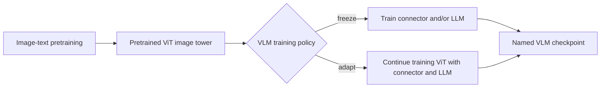

# Bộ mã hóa ViT đã được huấn luyện trước được VLMs tái sử dụng

> **Câu hỏi:** Những bộ mã hóa ViT được huấn luyện trước nổi tiếng nào thực sự được sử dụng bởi
> được đặt tên là VLMs và mỗi VLM sử dụng chúng như thế nào?
>
> **Phạm vi:** tháp quan sát được huấn luyện trước hoặc có thể tái sử dụng bên ngoài. Báo cáo này
> phân biệt một checkpoint chính xác với một nhóm huấn luyện trước và một checkpoint bị đóng băng
> tower từ quá trình khởi tạo mà sau này được điều chỉnh. Ngày nghiên cứu:
> 2026-07-21.

## Câu trả lời ngắn

Điểm khởi đầu phổ biến nhất không phải là ImageNet ViT đơn giản. Họ là ViT
có các đặc trưng đã được điều chỉnh phù hợp với ngôn ngữ, đặc biệt là **CLIP**,
**OpenCLIP**, **EVA-CLIP**, **SigLIP** và **SigLIP 2**. Một lớp hữu ích thứ hai,
được đại diện bởi **DINOv2**, được huấn luyện trước mà không có văn bản ghép nối và đóng góp
các đặc trưng hình ảnh không gian và ngữ nghĩa mạnh mẽ.

Chỉ riêng cái tên là không đủ. Ví dụ: đây là ba trường hợp khác nhau:

```text
LLaVA <- OpenAI CLIP ViT-L/14 (giữ đông lạnh)
Qwen-VL <- OpenCLIP ViT-bigG (khởi tạo, sau đó điều chỉnh)
MiniGPT-4 <- EVA-CLIP ViT-G/14 qua BLIP-2 (giữ đông lạnh)
```

Tương tự như vậy, “được huấn luyện trước” không có nghĩa là “bị đóng băng”. PaliGemma bắt đầu từ SigLIP nhưng
cùng huấn luyện bộ mã hóa thị giác, trong khi Prismatic giữ lại SigLIP và DINOv2
tháp bị đóng băng. Do đó, việc xử lý phải được nêu rõ trên mỗi VLM và mỗi lần huấn luyện
sân khấu.

## Những gì đang được tái sử dụng?

Quá trình huấn luyện trước CLIP-like có hai tháp: bộ mã hóa hình ảnh và bộ mã hóa văn bản. VLM
thường sử dụng lại **tháp hình ảnh ViT**, loại bỏ tháp văn bản tương phản,
và kết nối các đặc điểm hình ảnh với mô hình ngôn ngữ của chính nó thông qua máy chiếu,
Q-Former, bộ lấy mẫu lại hoặc bộ chuyển đổi tương tự.



Ba cách đặt tên ngăn ngừa hầu hết các sai lầm:

- **CLIP** bên dưới có nghĩa là dòng mô hình/checkpoint OpenAI. **OpenCLIP** là một
  Hệ sinh thái checkpoint và triển khai mở độc lập. **EVA-CLIP** sử dụng
  mục tiêu CLIP với khởi tạo trực quan EVA-based. Họ có liên quan
  công thức nấu ăn, trọng lượng không thể hoán đổi cho nhau. [CLIP][clip] [EVA-CLIP][eva-clip]
- `ViT-L/14`, `ViT-g/14` hoặc `ViT-So400m/14` mô tả quy mô kiến ​​trúc và
  kích thước patch; nó không xác định duy nhất ai đã huấn luyện trước trạm kiểm soát.
- **SigLIP** thay thế tổn thất tương phản softmax chuẩn hóa hàng loạt của CLIP bằng
  tổn thất sigmoid độc lập trên các cặp văn bản-hình ảnh. **SigLIP 2** là phiên bản mới hơn
  công thức bổ sung chú thích, tự chắt lọc, dự đoán ẩn và trực tuyến
  quản lý dữ liệu. [SigLIP][siglip] [SigLIP 2][siglip2]

## Bản đồ áp dụng chính xác

### Điểm kiểm tra CLIP-family

| Bộ mã hóa thị giác được huấn luyện trước | VLMs có bằng chứng trực tiếp | VLM sử dụng nó như thế nào |
| --- | --- | --- |
| OpenAI CLIP `ViT-L/14` | **LLaVA v1** | Tháp CLIP bị treo trong cả quá trình điều chỉnh căn chỉnh và hướng dẫn trực quan. Giai đoạn 1 huấn luyện lớp chiếu; Giai đoạn 2 huấn luyện máy chiếu và LLM. [LLaVA, §§4.1-4.2][llava] |
| OpenAI CLIP `ViT-L/14@336px` (`openai/clip-vit-large-patch14-336`) | **LLaVA-1.5 7B/13B** | LLaVA-1.5 thay thế tháp có độ phân giải thấp hơn bằng checkpoint 336 pixel và máy chiếu MLP. Cấu hình 7B được phát hành ghi lại chính xác tháp và `unfreeze_mm_vision_tower: false`. [LLaVA-1.5][llava15] [cấu hình chính thức][llava15-config] |
| OpenCLIP `ViT-bigG` | **Qwen-VL** và **Qwen-VL-Chat** | Qwen khởi tạo từ OpenCLIP thay vì OpenAI CLIP. Nó huấn luyện bộ mã hóa thị giác cộng với bộ chuyển đổi ở Giai đoạn 1, huấn luyện toàn bộ mô hình ở Giai đoạn 2, sau đó đóng băng bộ mã hóa thị giác trong quá trình tinh chỉnh có giám sát. [Qwen-VL, §§2.1 và 3.1-3.3][qwen-vl] |
| CLIP `ViT-L/14` hoặc EVA-CLIP `ViT-g/14` | **Biến thể BLIP-2** | Cả hai đều được đánh giá là bộ mã hóa hình ảnh bị đóng băng trong quá trình huấn luyện trước BLIP-2 trong khi Q-Former tìm hiểu cầu nối. Một số tác vụ tinh chỉnh phía dưới sẽ cập nhật bộ mã hóa hình ảnh sau này, vì vậy “BLIP-2 luôn đóng băng ViT” là quá rộng. [BLIP-2, §§3.4, 4.2-4.3][blip2] |
| EVA-CLIP `ViT-g/14` | **Hướng dẫnBLIP** với Flan-T5-XL/XXL hoặc Vicuna-7B/13B | Nó kế thừa tháp BLIP-2, đóng băng cả bộ mã hóa hình ảnh và LLM, đồng thời hướng dẫn điều chỉnh Q-Former. [InstructBLIP, §§2.3 và 2.6][instructblip] |
| EVA-CLIP `ViT-G/14` cộng với BLIP-2 Q-Cựu | **MiniGPT-4** | Nó đóng băng các thành phần hình ảnh và mô hình ngôn ngữ được kế thừa và chỉ huấn luyện một phép chiếu tuyến tính mới trong các giai đoạn căn chỉnh của nó. `G` so với `g` là cách viết hoa của giấy tờ nguồn, không phải bằng chứng về một tòa tháp khác ở đây. [MiniGPT-4, §3.1][minigpt4] |
| Bộ mã hóa tùy chỉnh dựa trên MetaCLIP; checkpoint công cộng chính xác không được nêu | **Llama 4 Scout** và **Llama 4 Maverick** | Meta cho biết bộ mã hóa hình ảnh dựa trên MetaCLIP nhưng đã được huấn luyện riêng biệt cùng với mô hình Llama đông lạnh để điều chỉnh nó cho phù hợp với LLM. Đây là một dòng công thức nấu ăn, không phải bằng chứng cho thấy Llama 4 đã tải một checkpoint MetaCLIP có sẵn. [Thông báo về Meta Llama 4][llama4] |

Hàng Qwen-VL là nguồn phổ biến của sơ đồ không chính xác: chỉ viết “CLIP
ViT” mất cả danh tính checkpoint **OpenCLIP** và thực tế là tháp
được điều chỉnh trước khi đông lạnh để tinh chỉnh có giám sát.

### Điểm kiểm tra họ SigLIP

| Bộ mã hóa thị giác được huấn luyện trước | VLMs có bằng chứng trực tiếp | VLM sử dụng nó như thế nào |
| --- | --- | --- |
| SigLIP `ViT-So400m/14` | **PaliGemma** và **PaliGemma 2** | PaliGemma kết hợp tháp SigLIP-So400m có sẵn với Gemma 2B. Giai đoạn 1 và 2 huấn luyện toàn bộ mô hình, bao gồm cả bộ mã hóa thị giác; truyền xuôi dòng thường tinh chỉnh tất cả các tham số. PaliGemma 2 sử dụng lại rõ ràng cùng họ SigLIP-So400m với các mẫu Gemma 2 từ 2B đến 27B. [PaliGemma, §§3.1-3.2][paligemma] [PaliGemma 2][paligemma2] |
| SigLIP `google/siglip-so400m-patch14-384` | **Idefics2 8B** | Idefics2 chọn SigLIP-SO400M sau khi so sánh nó với CLIP-ViT-H và EVA-CLIP-5B. Các đường trục được huấn luyện trước được điều chỉnh bằng LoRA trong khi các tham số mới được giới thiệu đã được huấn luyện đầy đủ; tòa tháp không chỉ đơn giản là bị đóng băng. [Idefics2, §§3.2 và 4.1][idefics2] [mẫu cơ sở chính thức][idefics2-card] |
| SigLIP `google/siglip-so400m-patch14-384` | **LLaVA-OneVision Qwen2-7B** | Sau quá trình khởi động chỉ dùng máy chiếu là các giai đoạn trong đó tháp thị giác, máy chiếu và LLM có thể huấn luyện được. Cấu hình được phát hành nêu tên checkpoint SigLIP chính xác và tốc độ học thị giác riêng biệt. [LLaVA-OneVision][llava-ov] [cấu hình chính thức][llava-ov-config] |
| SigLIP `ViT-So400m/14` | **Lăng kính-SigLIP** 7B/13B | Prismatic giữ cho tháp quan sát được cố định và huấn luyện máy chiếu cũng như LLM theo công thức một giai đoạn. [ Lăng trụ, §§4.1-4.2][ Lăng trụ] |
| SigLIP 2: `SigLIP2-SO-400M` theo mặc định; `SigLIP2-Large` cho các biến thể 2B/4B | **Qwen3-VL** | Qwen3-VL khởi chạy từ các checkpoint SigLIP 2 chính thức và tiếp tục rèn luyện thị lực ở độ phân giải động. Nó đóng băng bộ mã hóa hình ảnh trong giai đoạn S0 chỉ hợp nhất, sau đó giải phóng tất cả các thành phần trong S1-S3. Kết quả điều chỉnh được gọi là Qwen3-ViT, không phải là tháp SigLIP 2 không thay đổi. [Qwen3-VL, §§2 và 3.1][qwen3-vl] |

Bài báo SigLIP 2 cũng huấn luyện **VLMs thử nghiệm giống PaliGemma** để đánh giá
bộ mã hóa của nó, nhưng đây không phải là bằng chứng cho thấy PaliGemma hoặc PaliGemma 2 đã được phát hành
checkpoint sử dụng SigLIP 2. Bài viết mô tả rõ ràng các mô hình đó sử dụng
công thức tương tự. [SigLIP 2, §3.2][siglip2]

### ViT được huấn luyện trước chỉ bằng hình ảnh và dành riêng cho dự án

| Bộ mã hóa thị giác được huấn luyện trước | VLMs có bằng chứng trực tiếp | VLM sử dụng nó như thế nào |
| --- | --- | --- |
| DINOv2 `ViT-L/14` hợp nhất với SigLIP `ViT-So400m/14` | **Lăng kính-DINOSigLIP** 7B/13B | Prismatic kết hợp các đặc điểm từ hai tòa tháp đông lạnh. DINOv2 cung cấp các đặc trưng hình ảnh tự giám sát, trong khi SigLIP cung cấp các đặc trưng căn chỉnh hình ảnh-văn bản; máy chiếu học cách sử dụng biểu diễn hợp nhất. [DINOv2][dinov2] [ Lăng trụ, §§4.1-4.3][ lăng trụ] |
| Thực tập sinhViT-6B | **InternVL 1.0**, sau đó **Các biến thể InternVL 1.5/2/2.5** | InternVL 1.0 ban đầu tạo InternViT-6B: nó được khởi tạo ngẫu nhiên và được huấn luyện chung ở Giai đoạn 1, sau đó được cố định ở Giai đoạn 2. Sau đó, InternVL phát hành tái sử dụng các checkpoint InternViT đã được huấn luyện trước, nhưng kích thước tháp thay đổi tùy theo kích thước VLM. [Thực tập sinhVL, §4.1][thực tập sinh] [Đào tạo thực tập sinhVL 2.5][internvl25] |
| DFN-derived ViT, checkpoint công khai chính xác không được tiết lộ | **Qwen2-VL** | Bài báo cho biết bộ mã hóa thị giác có tham số khoảng 675M của nó được khởi tạo từ ViT có nguồn gốc từ DFN và thay thế bảng vị trí cố định bằng 2D RoPE. Nó không xác định chính xác checkpoint DFN công khai, do đó việc đánh đồng nó với `DFN5B-CLIP-ViT-H-14` sẽ là một suy luận. [Qwen2-VL, §2.1][qwen2-vl] [DFN][dfn] |

DINOv2 là ngoại lệ quan trọng đối với “tháp thị giác phải hiểu
văn bản". Quy tắc huấn luyện trước hình ảnh tự giám sát của nó không căn chỉnh hình ảnh theo
chú thích, nhưng Prismatic thấy nó bổ sung cho SigLIP khi các đặc trưng của chúng
hợp nhất. Điều này hỗ trợ một kết luận hẹp hơn—**chỉ dựa trên ngôn ngữ và hình ảnh
các đặc trưng có thể bổ sung cho nhau**—không phải riêng DINOv2 nói chung là
bộ mã hóa VLM tốt nhất.

## Dòng dõi huấn luyện thị giác Qwen

Qwen là một ví dụ phản biện hữu ích để coi một công thức mã hóa là vĩnh viễn
trong một gia đình kiểu mẫu:

| Phát hành | Khởi tạo thị giác | Điều gì xảy ra tiếp theo |
| --- | --- | --- |
| Qwen-VL | OpenCLIP `ViT-bigG` | Tháp thị giác được huấn luyện ở giai đoạn đầu và đóng băng cho SFT. [Qwen-VL][qwen-vl] |
| Qwen2-VL | ViT có nguồn gốc từ DFN; checkpoint chính xác chưa biết | Tháp được điều chỉnh cho phù hợp với đầu vào hình ảnh/video động và RoPE 2D. [Qwen2-VL][qwen2-vl] |
| Qwen2.5-VL | ViT được huấn luyện từ đầu | Các tác giả huấn luyện rõ ràng một cửa sổ mới/ViT chú ý toàn cầu thay vì sử dụng lại các trọng số CLIP hoặc SigLIP. [Qwen2.5-VL][qwen25-vl] |
| Qwen3-VL | Điểm kiểm tra SigLIP 2 chính thức, kích thước tùy thuộc vào biến thể VLM | Tiếp tục huấn luyện trước thị giác sẽ tạo ra Qwen3-ViT thích ứng; các giai đoạn VLM sau này cùng huấn luyện tất cả các thành phần. [Qwen3-VL][qwen3-vl] |

Do đó, “Qwen sử dụng CLIP” chỉ đúng với một thế hệ cụ thể và không đúng
một mô tả hợp lệ về toàn bộ gia đình hiện tại.

## Chọn cách mô tả tháp thị giác VLM

Đối với sơ đồ kiến ​​trúc hoặc bảng mô hình, hãy ghi lại bốn trường:

```text
nhà cung cấp/gia đình + checkpoint chính xác nếu biết
        + độ phân giải đầu vào
        + trạng thái cố định/thích ứng theo từng giai đoạn
        + đầu nối với LLM
```

Ví dụ:

```text
LLaVA-1.5:
  openai/clip-vit-large-patch14-336
  -> tháp thị giác đông lạnh
  -> máy chiếu MLP hai lớp
  -> Mô hình ngôn ngữ Vicuna

Qwen3-VL mặc định:
  Khởi tạo SigLIP2-SO-400M
  -> giai đoạn đóng băng chỉ sáp nhập
  -> thích ứng hoàn toàn với Qwen3-ViT
  -> Mô hình ngôn ngữ Qwen
```

Tránh các phím tắt sau:

- **“CLIP ViT”** khi nguồn thực sự ghi là OpenCLIP hoặc EVA-CLIP.
- **“Sử dụng SigLIP”** mà không nêu rõ liệu nó có còn bị đóng băng hay chỉ là
  khởi tạo.
- Coi `ViT-L/14` là checkpoint ID; nó chỉ là một nhãn kiến ​​trúc.
- Chỉ định một tháp cho mọi kích thước hoặc phiên bản của dòng VLM. Thực tập sinhVL và
  Qwen3-VL thay đổi rõ ràng bộ mã hóa theo kích thước mẫu hoặc thế hệ.
- Giả sử mọi VLM hiện đại đều bắt đầu từ một tháp được huấn luyện trước bên ngoài.
  Qwen2.5-VL ghi lại ViT được huấn luyện từ đầu.

## Nguồn

Tất cả các nguồn trực tuyến đã được truy cập vào ngày 21-07-2026.

- Radford và cộng sự. *Học các mô hình trực quan có thể chuyển đổi từ ngôn ngữ tự nhiên
  Giám sát*. [arXiv][clip]
- Zhai và cộng sự. *Mất sigmoid khi huấn luyện trước về hình ảnh ngôn ngữ*. [arXiv][siglip]
- Tschannen và cộng sự. *SigLIP 2: Bộ mã hóa ngôn ngữ thị giác đa ngôn ngữ với
  Cải thiện khả năng hiểu ngữ nghĩa, bản địa hóa và các đặc trưng dày đặc*.
  [arXiv][siglip2]
- Lưu và cộng sự. *Điều chỉnh hướng dẫn trực quan* và *Cải thiện đường cơ sở bằng hình ảnh
  Điều chỉnh hướng dẫn*. [LLaVA][llava] · [LLaVA-1.5][llava15]
- Bài và cộng sự. *Qwen-VL: Mô hình ngôn ngữ thị giác lớn tiên phong với tính linh hoạt
  Khả năng*. [arXiv][qwen-vl]
- Li và cộng sự. *BLIP-2: Đào tạo trước ngôn ngữ-hình ảnh khởi động với hình ảnh đông lạnh
  Bộ mã hóa và mô hình ngôn ngữ lớn*. [arXiv][blip2]
- Đại và cộng sự. *InstructBLIP: Hướng tới các mô hình ngôn ngữ thị giác có mục đích chung với
  Điều chỉnh hướng dẫn*. [arXiv][blip hướng dẫn]
- Zhu và cộng sự. *MiniGPT-4: Nâng cao khả năng hiểu ngôn ngữ thị giác với Advanced
  Mô hình ngôn ngữ lớn*. [arXiv][minigpt4]
- Beyer và cộng sự. *PaliGemma: Một 3B VLM đa năng để chuyển nhượng*. [arXiv][paligemma]
- Steiner và cộng sự. *PaliGemma 2: Dòng VLMs đa năng để chuyển nhượng*.
  [arXiv][paligemma2]
- Laurencon và cộng sự. *Điều gì quan trọng khi xây dựng mô hình ngôn ngữ-hình ảnh?*
  [Giấy Idefics2][idefics2]
- Karamcheti và cộng sự. *Prismatic VLMs: Nghiên cứu không gian thiết kế trực quan-
  Mô hình ngôn ngữ có điều kiện*. [arXiv][lăng trụ]
- Oquab và cộng sự. *DINOv2: Học các đặc trưng trực quan mạnh mẽ mà không cần giám sát*.
  [arXiv][dinov2]
- Chen và cộng sự. *InternVL: Nhân rộng các mô hình Quỹ Thị giác và Điều chỉnh cho
  Nhiệm vụ ngôn ngữ hình ảnh chung *. [Giấy CVPR][thực tập]
- Vương và cộng sự. *Qwen2-VL*; Bài và cộng sự. *Qwen2.5-VL*; Bài và cộng sự. *Qwen3-VL*.
  [Qwen2-VL][qwen2-vl] · [Qwen2.5-VL][qwen25-vl] · [Qwen3-VL][qwen3-vl]
- Meta. *Đàn Llama 4: Sự khởi đầu của một kỷ nguyên mới của AI đa phương thức nguyên bản
  sự đổi mới*. [Thông báo chính thức][llama4]

[clip]: https://arxiv.org/abs/2103.00020
[eva-clip]: https://arxiv.org/abs/2303.15389
[siglip]: https://arxiv.org/abs/2303.15343
[siglip2]: https://arxiv.org/abs/2502.14786
[llava]: https://arxiv.org/pdf/2304.08485
[llava15]: https://openaccess.thecvf.com/content/CVPR2024/papers/Liu_Improved_Baselines_with_Visual_Instruction_Tuning_CVPR_2024_paper.pdf
[llava15-config]: https://huggingface.co/liuhaotian/llava-v1.5-7b/blob/66456a4fdc5655d2f39a9d533f80e8ae961a51eb/config.json
[qwen-vl]: https://arxiv.org/pdf/2308.12966
[blip2]: https://arxiv.org/pdf/2301.12597
[hướng dẫn]: https://arxiv.org/pdf/2305.06500
[minigpt4]: https://arxiv.org/pdf/2304.10592
[paligemma]: https://arxiv.org/pdf/2407.07726
[paligemma2]: https://arxiv.org/abs/2412.03555
[idefics2]: https://arxiv.org/pdf/2405.02246
[idefics2-card]: https://huggingface.co/HuggingFaceM4/idefics2-8b-base
[llava-ov]: https://arxiv.org/abs/2408.03326
[llava-ov-config]: https://huggingface.co/lmms-lab/llava-onevision-qwen2-7b-ov/blob/main/config.json
[qwen3-vl]: https://arxiv.org/pdf/2511.21631
[lăng trụ]: https://arxiv.org/pdf/2402.07865
[dinov2]: https://arxiv.org/abs/2304.07193
[thực tập sinh]: https://openaccess.thecvf.com/content/CVPR2024/papers/Chen_InternVL_Scaling_up_Vision_Foundation_Models_and_Aligning_for_Generic_CVPR_2024_paper.pdf
[internvl25]: https://internvl.github.io/blog/2024-12-05-InternVL-2.5/
[qwen2-vl]: https://arxiv.org/abs/2409.12191
[dfn]: https://arxiv.org/abs/2309.17425
[qwen25-vl]: https://arxiv.org/abs/2502.13923
[llama4]: https://ai.meta.com/blog/llama-4-multimodal-intelligence/
