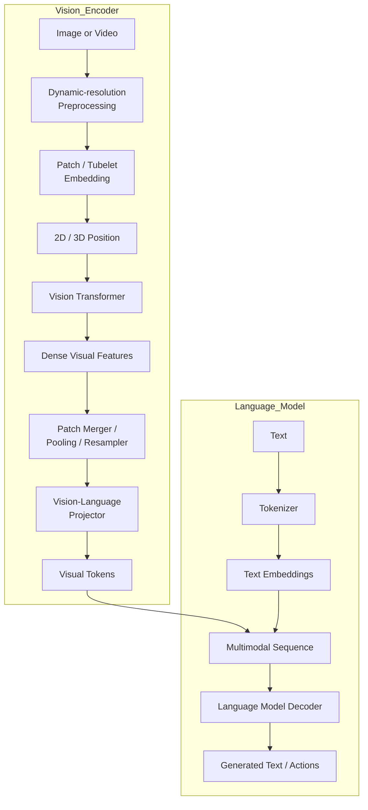

# Kiến trúc biến đổi thị giác trong thị giác--Mô hình ngôn ngữ

> **Lưu ý:** Phiên bản này được định dạng bằng màn hình LaTeX (`$$ ... $$`)
> dành cho trình kết xuất Markdown.

## 1. Tóm tắt điều hành

Chia sẻ Transformer Thị giác (ViT) bên trong Mô hình Ngôn ngữ-Thị giác (VLM)
kiến trúc cơ bản giống như ViT thông thường:

1. Chia hình ảnh thành các patch.
2. Chuyển đổi từng patch thành một bản nhúng.
3. Thêm thông tin vị trí.
4. Xử lý chuỗi patch bằng các khối mã hóa Transformer.

Sự khác biệt chính là **không phải ở Transformer** mà là **cái gì
xảy ra trước và sau nó**.

Một phân loại ViT nén một hình ảnh thành một biểu diễn phù hợp
để nhận dạng hình ảnh. Thay vào đó, VLM bảo tồn không gian chi tiết
thông tin để LLM có thể suy luận về các đối tượng, văn bản, bố cục,
tài liệu, giao diện người dùng và video.

Các bổ sung VLM hiện đại điển hình bao gồm:

- Xử lý trước hình ảnh có độ phân giải động hoặc gốc
- Đào tạo trước thị giác phù hợp với ngôn ngữ (CLIP, SigLIP, v.v.)
- Các đặc trưng vá lỗi dày đặc thay vì chỉ có token CLS
- Hợp nhất patch hoặc nén token
- Máy chiếu ngôn ngữ thị giác
- Mã hóa vị trí 2D/3D
- Tiêm đặc trưng hình ảnh đa cấp
- Điều chỉnh hướng dẫn và huấn luyện trước đa phương thức

## Kiến trúc tổng thể



---

# 2. Transformer thị giác tiêu chuẩn

Đối với hình ảnh có kích thước $H\times W$ được chia thành các mảng kích thước hình vuông
$P$:

$$
N=\frac{H}{P}\times\frac{W}{P}
$$

trong đó $N$ là số lượng patch hình ảnh.

Ví dụ:

$$
224\times224,\quad P=16
$$

cho

$$
N=14\times14=196
$$

Mỗi patch hình ảnh chứa

$$
P^2\times3
$$

Giá trị RGB.

Mỗi patch được chiếu vào chiều ẩn ViT:

$$
z_i=x_iW_E+b_E
$$

Các triển khai hiện đại thực hiện việc này với Conv2D có kích thước hạt nhân và
sải bước bằng kích thước miếng vá.

Đầu vào ViT trở thành

$$
X_0=
[z_{\mathrm{CLS}},z_1,z_2,\ldots,z_N]
+
E_{\mathrm{position}}
$$

Trình tự được xử lý bằng các khối mã hóa Transformer lặp đi lặp lại.

Cuối cùng, chỉ có token CLS thường được gửi đến bộ phân loại.

```text
Hình ảnh
 ↓
Nhúng patch
 ↓
CLS + Token vá
 ↓
Bộ mã hóa ViT
 ↓
Đại diện CLS
 ↓
Trình phân loại
```

---

# 3. Tại sao VLMs cần nhiều hơn ViT tiêu chuẩn

Việc phân loại chỉ yêu cầu một dự đoán toàn cầu.

VLM phải trả lời các câu hỏi như:

- Đối tượng ở đâu?
- Văn bản nào xuất hiện trong hình ảnh?
- Đối tượng nào đã thay đổi?
- Ô bảng nào chứa giá trị lớn nhất?

Thay vì một vectơ, LLM cần một **chuỗi các đặc điểm không gian**.

```text
Vùng trên cùng bên trái
Thượng-trung
Phía trên bên phải
...
Dưới cùng bên phải
```

Chúng trở thành **token trực quan** bên trong mô hình ngôn ngữ.

---

# 4. Các mô-đun chính

## 4.1 Tiền xử lý trực quan

Có ba cách tiếp cận phổ biến.

### Độ phân giải cố định

```text
1920×1080
      ↓
224×224
```

Đơn giản nhưng mất chi tiết.

### ốp lát

Hình ảnh lớn trở thành một số cây trồng.

Những lợi ích:

- OCR tốt hơn
- Nhận dạng đối tượng nhỏ tốt hơn

Nhược điểm:

- Nhiều token trực quan hơn.

### Độ phân giải động

Độ phân giải hình ảnh phần lớn được bảo tồn.

```text
Hình ảnh nhỏ → Ít patch

Hình ảnh lớn → Nhiều patch
```

Các mẫu máy hiện đại như Qwen-VL ngày càng sử dụng phương pháp này.

---

## 4.2 Nhúng patch

ViT hiện đại hiếm khi làm phẳng các patch một cách rõ ràng.

Thay vào đó họ sử dụng

```text
Conv2D

Hạt nhân = Kích thước patch

Sải bước = Kích thước patch
```

tương đương về mặt toán học nhưng lại nhanh hơn trên GPUs.

Các mô hình video thường sử dụng ống nhỏ:

```text
2 khung
×

Điểm ảnh 14×14
```

thay vì các patch hình ảnh riêng lẻ.

---

## 4.3 Mã hóa vị trí

Ngôn ngữ sử dụng vị trí một chiều

$$
p=0,1,2,\ldots
$$

Thay vào đó hãy sử dụng hình ảnh

$$
(h,w)
$$

Video sử dụng

$$
(t,h,w)
$$

VLMs hiện đại thường áp dụng:

- Dây 2D
- Vị trí tương đối
- Nhúng vị trí nội suy

---

## 4.4 Xương sống biến áp thị giác

Sự tự chú ý giống hệt với Transformers thông thường.

$$
Q=XW_Q
$$

$$
K=XW_K
$$

$$
V=XW_V
$$

Chú ý là

$$
\operatorname{Attention}(X)=
\operatorname{softmax}
\left(
\frac{QK^\top}{\sqrt{d_k}}
\right)V
$$

Những cải tiến kiến ​​trúc chính không phải là sự chú ý bên trong mà là
trong quá trình huấn luyện và tiền xử lý.

Nhiều VLMs khởi tạo thị giác của họ từ bộ mã hóa hình ảnh-văn bản chẳng hạn như
CLIP hoặc SigLIP, nhưng checkpoint chính xác và chính sách huấn luyện khác nhau tùy theo mẫu máy;
thay vào đó, một số VLMs sẽ huấn luyện tháp từ đầu. Xem đã xác minh
[Bản đồ bộ mã hóa được huấn luyện trước tới VLM](pretrained_vision_encoders.md).

---

## 4.5 Tính năng đa cấp

Thay vì chỉ sử dụng lớp ViT cuối cùng,

VLMs hiện đại có thể kết hợp

- lớp đầu (cạnh)
- lớp giữa (bộ phận)
- lớp muộn (đối tượng)

Một số kiến ​​trúc đưa các đặc trưng này vào nhiều lớp LLM.

---

## 4.6 Sáp nhập patch/Bộ lấy mẫu lại

Hình ảnh có độ phân giải cao có thể tạo ra hàng nghìn token trực quan.

Kỹ thuật nén bao gồm:

- Sáp nhập patch
- Tổng hợp trung bình
- Trình lấy mẫu lại truy vấn đã học
- Bộ lấy mẫu lại cảm biến

Ví dụ:

```text
v1 v2
v3 v4

↓

Token đã hợp nhất
```

Điều này làm giảm tính toán LLM.

---

## 4.7 Máy chiếu ngôn ngữ thị giác

Bản đồ máy chiếu

$$
d_{\text{vision}}
\rightarrow
d_{\text{LLM}}
$$

Ví dụ

$$
1152
\rightarrow
4096
$$

Một máy chiếu đơn giản là

$$
v'=Wv+b
$$

Máy chiếu hiện đại thường sử dụng

$$
v'
=
W_2\phi(W_1v+b_1)+b_2
$$

trong đó $\phi$ là GELU hoặc SwiGLU.

Công việc của nó không chỉ đơn thuần là thay đổi kích thước.

Nó căn chỉnh cách trình bày thị giác với việc nhúng mô hình ngôn ngữ
không gian.

---

## 4.8 Sự kết hợp

Có hai cách tiếp cận chính.

### Chèn token

Token trực quan trở thành một phần của chuỗi ngôn ngữ.

```text
<vision_start>

Token trực quan

<vision_end>

Câu hỏi
```

Được sử dụng bởi các mẫu như LLaVA và Qwen-VL.

### Chú ý chéo

Các đặc trưng trực quan vẫn tách biệt.

Các lớp chú ý chéo truy xuất thông tin trực quan khi cần thiết.

Được sử dụng bởi Flamingo.

---

# 5. Quy trình huấn luyện

1. Huấn luyện trước thị lực
2. Căn chỉnh máy chiếu
3. Huấn luyện trước đa phương thức chung
4. Điều chỉnh hướng dẫn

Cách tiếp cận theo giai đoạn này giúp ổn định việc tối ưu hóa trong khi vẫn bảo tồn ngôn ngữ
khả năng.

---

# 6. Người mẫu đại diện

## LLaVA

- Bộ mã hóa thị giác CLIP
- Máy chiếu tuyến tính / MLP
- Chèn token trực tiếp

Đơn giản và hiệu quả.

## BLIP-2

- Bộ mã hóa thị giác đông lạnh
- Q-Cựu
- LLM đông lạnh

Nén hàng nghìn patch thành một vài token trực quan đã học được.

## Chim hồng hạc

- Bộ mã hóa thị giác
- Bộ lấy mẫu lại nhận thức
- Sự chú ý chéo bên trong LLM

Tốt hơn cho văn bản hình ảnh và video xen kẽ.

## Qwen-VL

Các mẫu Qwen gần đây giới thiệu:

- Độ phân giải động gốc
- Cửa sổ chú ý
- Sáp nhập patch 2×2
- máy chiếu MLP
- Tiêm trực quan đa cấp
- RoPE đa phương thức theo ngữ cảnh dài

Những thay đổi này chủ yếu cải thiện OCR, nối đất, hiểu biết về GUI,
tài liệu và video dài.

## Song Tử

Thông tin công khai chỉ ra:

- Đào tạo đa phương thức bản địa
- Bối cảnh đa phương thức dài

Bộ mã hóa thị giác và máy chiếu chính xác vẫn chưa được tiết lộ.

## GPT-4 / GPT-4o

OpenAI chưa công bố kiến ​​trúc thị giác chi tiết.

Được biết đến rộng rãi:

- Hiểu hình ảnh gốc
- GPT-4o đa phương thức từ đầu đến cuối

Chi tiết cụ thể về ViT không được công khai.

---

# 7. Sự phát triển của VLMs hiện đại

  Trước đó Hiện đại

---

  Đã sửa lỗi thay đổi kích thước Độ phân giải động
  Phân loại ViT ViT theo ngôn ngữ
  Chỉ lớp cuối cùng
  Tất cả các patch Hợp nhất patch
  Vị trí tuyệt đối RoPE 2D/3D
  Hình ảnh đơn Bối cảnh đa phương thức dài
  Các mô-đun đông lạnh Đào tạo toàn diện

---

# 8. Kết luận

Hiệu suất VLM hiện đại được xác định ít hơn bằng cách thay đổi Transformer
chính nó và hơn thế nữa bằng cách cải thiện toàn bộ **việc tạo token trực quan
đường ống**:

1. Tiền xử lý tốt hơn
2. Bộ mã hóa thị giác tốt hơn
3. Mã hóa vị trí tốt hơn
4. Nén token tốt hơn
5. Máy chiếu tốt hơn
6. Đào tạo đa phương thức tốt hơn

Vision Transformer trích xuất các đặc điểm ngữ nghĩa trực quan, trong khi
sự hợp nhất và trình chiếu xác định mức độ hiệu quả của các đặc trưng đó
token mô hình ngôn ngữ. LLM sau đó thực hiện lý luận đa phương thức bằng cách sử dụng
kiến trúc Transformer tương tự được thiết kế ban đầu cho văn bản.
