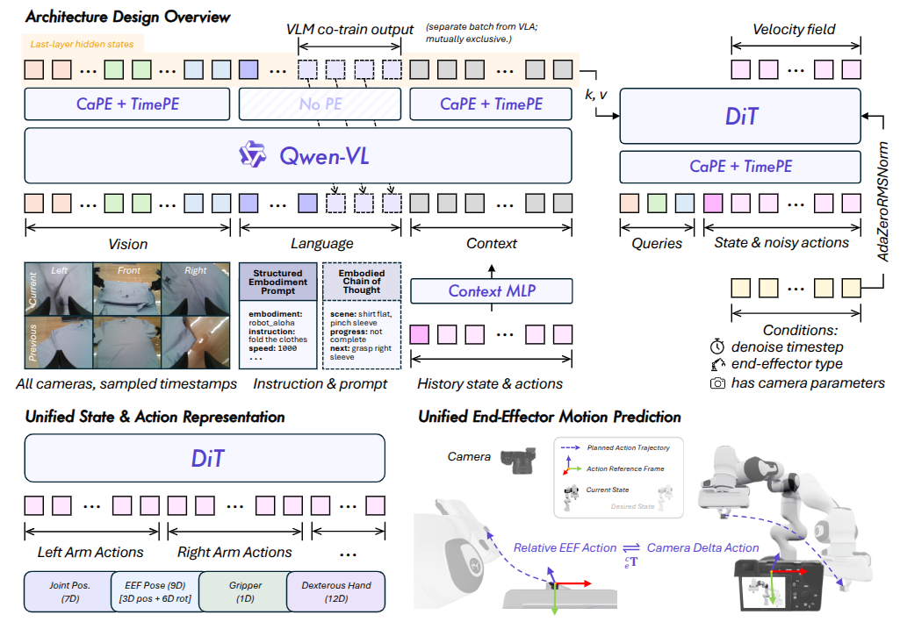
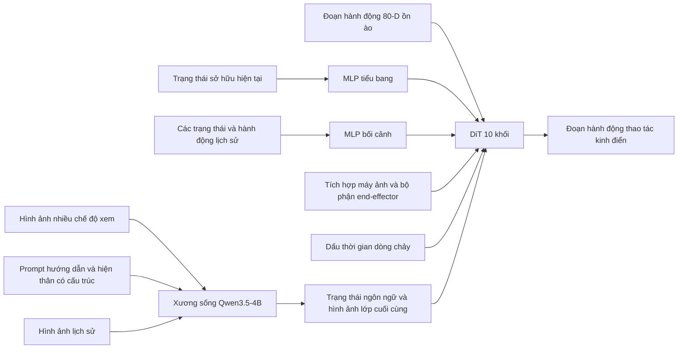
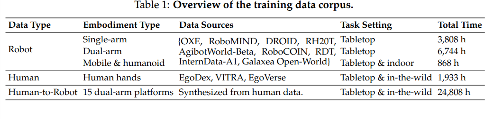
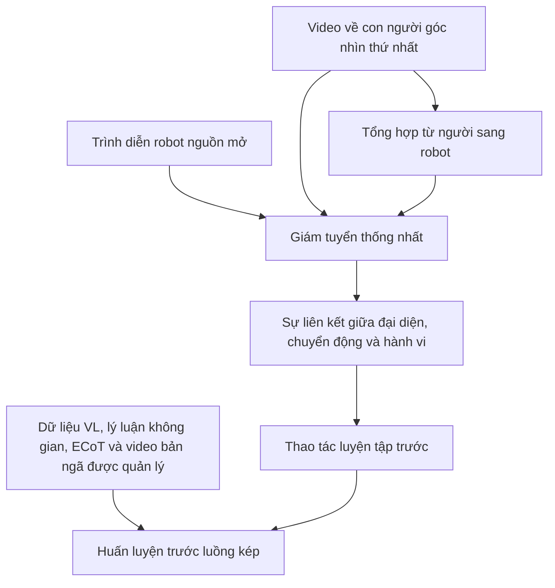
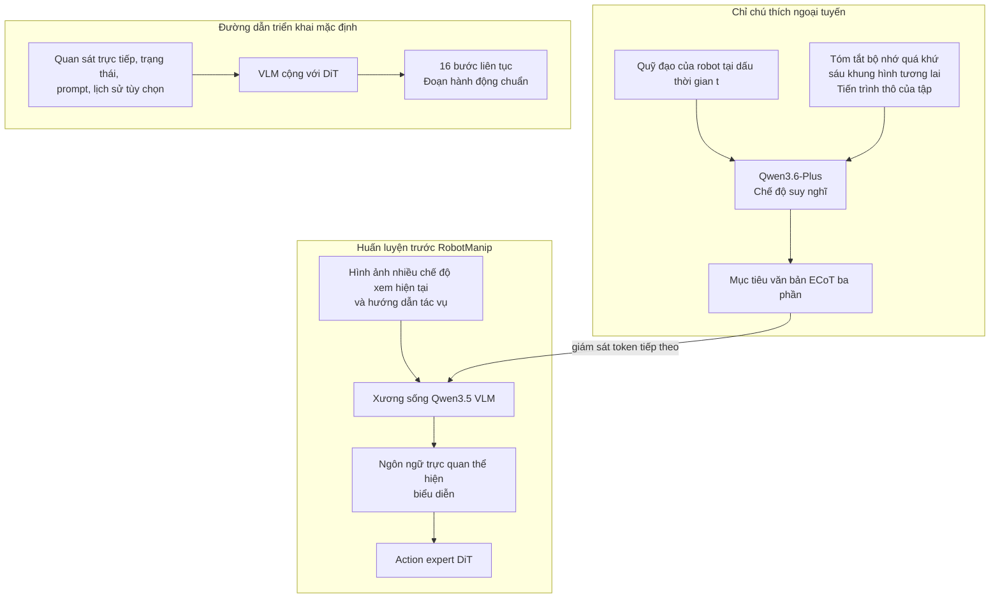

# Qwen-RobotManip: Kiến trúc, Dữ liệu huấn luyện và Đánh giá

## Phạm vi

Báo cáo này bao gồm **Qwen-RobotManip**, chuyên gia thao tác trong bộ Qwen-Robot.
Nó tập trung vào kiến trúc, liên kết nhiều hiện thân, tập dữ liệu huấn luyện, luân phiên nhiệm vụ,
mục tiêu, sau huấn luyện và đánh giá. Đối với chuyên gia điều hướng, hãy xem
[Qwen-RobotNav](../Qwen-RobotNav/qwen_robotnav_details.md). Đối với mô hình chung, xem
[Qwen-VLA](../Qwen-VLA/qwen_vla_details.md).

> **Ngày nghiên cứu:** 22-07-2026. Nguồn chính được kiểm tra là Qwen-RobotManip v2
> (2026-06-17). Tập dữ liệu và số lượng đánh giá là do tác giả báo cáo và chưa được
> được sao chép trong không gian làm việc này. Kho lưu trữ chính thức hiện tuyên bố rằng không có
> lên kế hoạch giải phóng trọng lượng của mô hình.

## Ý tưởng cốt lõi

Qwen-RobotManip coi các biểu diễn robot không đồng nhất là nút thắt quy mô trung tâm.
Nó ánh xạ nhiều hiện thân vào một không gian trạng thái/hành động 80 chiều được che kín, sắp xếp chuyển động theo
tọa độ agent cuối liên quan đến máy ảnh và các điều kiện về hành vi gần đây cho trong ngữ cảnh
sự thích nghi. DiT flow matching sẽ tạo ra các khối hành động trong khi tách biệt các thao tác và
các lô thị giác-ngôn ngữ bảo tồn cả khả năng kiểm soát và lý luận đa phương thức.

## 1. Tổng quan về mô hình

### 1.1 Nhiệm vụ chính

Qwen-RobotManip tập trung vào thao tác hơn là tập hợp đầy đủ các nhiệm vụ được thể hiện.

Khả năng mục tiêu bao gồm:

- Thao tác bằng một tay và hai tay
- Tay nắm song song và điều khiển khéo léo
- Chọn, đặt, gấp, chèn, vận hành và sắp xếp lại các nhiệm vụ
- Thao tác có điều kiện
- Chuyển giao giữa các robot
- Tính bền vững đối với các đối tượng, bố cục, hình nền và tư thế máy ảnh mới
- Thích ứng hành vi nhanh chóng từ lịch sử tập phim gần đây


Không giống như Qwen-VLA, nó không cần một bộ giải mã hành động để mô hình hóa các điểm định hướng hoặc quỹ đạo lái xe tự động.

### 1.2 Kiến trúc





Các trạng thái ẩn của đường trục Qwen VLM có chiều rộng 2.560.

Action expert bao gồm:

- **10 khối Transformer**
- Chiều rộng ẩn **768**
- **12 đầu chú ý**
- Tự chú ý đến trạng thái và token action nhiễu
- Chú ý chéo đến VLM sau khi tự chú ý
- Các lớp chuyển tiếp nguồn cấp dữ liệu SwiGLU
- Luân phiên chú ý chéo:
  - Các khối được lập chỉ mục chẵn tham gia vào token trực quan
  - Các khối được lập chỉ mục lẻ tham dự vào token ngôn ngữ

Điều này khác với DiT luồng đơn lớn hơn của Qwen-VLA, trong đó token hành động và token có nguồn gốc từ VLM được xử lý cùng nhau thông qua sự tự chú ý.

Đầu ra chứa một đoạn **16 hành động liên tục**, với **80 mức độ mờ**.

## 2. Đầu vào và biểu diễn xuyên embodiment

### 2.1 Đầu vào mô hình, Chế độ xem camera và Ví dụ về prompt

Một quyết định của RobotManip đòi hỏi nhiều thứ hơn là hình ảnh và hướng dẫn. Đầu vào khái niệm hoàn chỉnh là:

| Nhóm đầu vào | Nội dung | Nơi nó đi vào mô hình |
| --------------------------- | ------------------------------------------------------------------------------------------------------ | ------------------------------------------------------------------------------------- |
| Thị giác hiện tại | Một hoặc nhiều chế độ xem camera RGB được đồng bộ hóa | Backbone thị giác-ngôn ngữ Qwen3.5 |
| Văn bản nhiệm vụ và hiện thân | Prompt có cấu trúc với hiện thân, hướng dẫn, tốc độ, FPS và hướng xem camera | Luồng văn bản Qwen3.5 |
| Quyền sở hữu hiện tại | Trạng thái 80-D chuẩn được che dấu; chỉ các vị trí được điền của hiện thân mới có ý nghĩa | MLP trạng thái hai lớp, sau đó được thêm vào trước các token action nhiễu trong DiT |
| Hình học máy ảnh | Nội tại và bên ngoài cho mọi chế độ xem được hiệu chỉnh; camera tham chiếu hành động được chọn trên mỗi bộ hiệu ứng cuối | Mã hóa vị trí camera trong attention chéo của DiT |
| Điều hòa bên hành động | Loại bộ end-effector, cờ khả dụng hiệu chuẩn máy ảnh và dấu thời gian của luồng | Chuẩn hóa/điều hòa thích ứng trong DiT |
| Lịch sử hành vi tùy chọn | Các quan sát RGB trước đó, trạng thái 80-D và các đoạn hành động được thực hiện từ cùng một tập | Hình ảnh lịch sử tham gia vào dòng hình ảnh; lịch sử trạng thái/hành động trở thành token bối cảnh |

Đoạn action nhiễu Gaussian và dấu thời gian của luồng là máy huấn luyện/suy luận, không phải đầu vào cảm biến
được cung cấp bởi người vận hành robot. Cuối cùng, mô hình sẽ chuyển chúng thành đoạn hành động chuẩn tiếp theo.
[Giấy RobotManip v2, §§3.1-3.5](https://arxiv.org/abs/2606.17846v2)

Kiến trúc DiT được thông qua cũng sử dụng một tập hợp nhỏ token truy vấn đã học làm proxy nội bộ cho VLM
đặc điểm thị giác/ngôn ngữ. Họ tham gia các token trạng thái/hành động, tham dự chéo đến các trạng thái VLM lớp cuối cùng và
tham gia vào việc tự chú ý đến DiT; đầu ra của chúng bị loại bỏ thay vì được giải mã dưới dạng hành động. Giấy
không tiết lộ số lượng hoặc khởi tạo của họ. [RobotManip paper v2, §6.4 và Hình 20](https://arxiv.org/abs/2606.17846v2)

#### Chế độ xem camera và “góc”

RobotManip **không** quy định số lượng camera cố định hoặc danh sách chung các góc lệch. Nó tiêu thụ
bất kỳ chế độ xem được đồng bộ hóa nào mà hiện thân nguồn cung cấp. Bài báo và Hình 3 sử dụng các ngữ nghĩa này
các kiểu xem:

| Loại xem | Ví dụ trong bài báo | Nó được sử dụng như thế nào |
| --------------------- | ----------------------------------------------------------- | ----------------------------------------------------------------------------------------------------- |
| Bên ngoài/người thứ ba | Mặt trước, mặt bên, mặt trái và mặt phải | Hình học cánh tay và đối tượng trên toàn cảnh; mọi chế độ xem bên ngoài có sẵn đều có thể là tham chiếu cho một nhánh |
| Gắn trên đầu | Một góc nhìn chung phía trên/giữa hai cánh tay | Có thể là khung tham chiếu hành động chung cho cả hai cánh tay |
| Gắn trên cổ tay | Chế độ xem cổ tay một cánh tay hoặc máy ảnh cổ tay trái/phải riêng biệt | Thao tác cận cảnh; cánh tay kép có thể sử dụng máy ảnh đeo tay của riêng mình làm khung tham chiếu riêng biệt |

“Trái”, “phía trước”, “phải”, “bên” và “cổ tay” là các vai trò xem, không phải là góc phương vị số được công bố. các
prompt có cấu trúc giảm hướng camera xuống **`arm side`** hoặc **`opposite side`**; nó không mang theo
một giá trị độ. Thay vào đó, hình học chính xác đến từ phần bên trong/bên ngoài của máy ảnh và Vị trí của máy ảnh
Mã hóa (CaPE): mỗi token hình ảnh sử dụng tư thế máy ảnh riêng, trong khi mỗi token trạng thái/hành động sử dụng tư thế
của máy ảnh tham chiếu đã chọn.

Lựa chọn tham khảo được chọn ngẫu nhiên trong quá trình huấn luyện:

- Đối với một cánh tay, hãy chọn bất kỳ máy ảnh bên ngoài hoặc máy ảnh gắn trên cổ tay nào có sẵn.
- Đối với hai cánh tay, hãy sử dụng camera đầu/máy ảnh của người thứ ba dùng chung cho cả hai tay hoặc sử dụng máy ảnh ở cổ tay trái
  cho cánh tay trái và máy ảnh cổ tay phải cho cánh tay phải.
- Nếu không có thông số camera đã hiệu chỉnh, cờ phụ sẽ chuyển dự đoán từ
  chế độ delta khung máy ảnh sang chế độ tương đối với cơ sở robot.

Đường dẫn hành động của khung máy ảnh yêu cầu hiệu chỉnh ở cả quá trình huấn luyện và suy luận. Tờ giấy không
xuất bản độ phân giải đầu vào cố định, trường nhìn của ống kính bắt buộc, thứ tự camera chính xác trong cuộc trò chuyện Qwen
mẫu hoặc góc gắn số cho mỗi tập dữ liệu.
[RobotManip paper v2, §3.3 và Hình 3](https://arxiv.org/abs/2606.17846v2)

Dữ liệu chuỗi suy nghĩ được thể hiện trong bài báo sử dụng các chế độ xem có sẵn được đồng bộ hóa như mặt trước, cổ tay và
bên. Trong quá trình chú thích, một VLM riêng biệt có thể xem bản tóm tắt lịch sử, sáu khung hình trong tương lai cách nhau một giây
ngoài và tiến triển của tập phim. Đó là **đầu vào chú thích đặc quyền**: khóa huấn luyện RobotManip VLM
ví dụ chỉ nhận được hình ảnh nhiều góc nhìn hiện tại và hướng dẫn tác vụ, với lý do được tạo
như mục tiêu của nó. Chúng không nên được thêm vào hợp đồng đầu vào chính sách thời gian chạy.
[Giấy RobotManip v2, §2.5](https://arxiv.org/abs/2606.17846v2)

#### Prompt hiện thân có cấu trúc chính xác

Bài báo công bố ví dụ chính xác này:

```text
embodiment: robot_aloha
instruction: Take the toy off the table and put it on the mat.
speed: 1000
fps: 30
camera view direction: arm side
```

Các trường có nghĩa là:

| Lĩnh vực | Ý nghĩa |
| ------------------------- | ---------------------------------------------------------------------------- |
| `embodiment` | Mã nhận dạng nền tảng robot, chẳng hạn như`robot_aloha` |
| `instruction` | Mục tiêu ngôn ngữ tự nhiên ở cấp độ tập |
| `speed` | Độ dài tập theo dấu thời gian, được lượng tử hóa thành các thùng 500 bước—không phải mét/giây |
| `fps` | Tốc độ lấy mẫu tạm thời của chuỗi đầu vào |
| `camera view direction` | Vị trí camera so với cánh tay diễn xuất:`arm side` hoặc `opposite side` |

Trong quá trình huấn luyện, `embodiment`, `speed` và `fps` bị rơi ngẫu nhiên với xác suất 15%
chính sách có thể chấp nhận việc thiếu siêu dữ liệu. Bài viết không nói rằng hướng dẫn hoặc hướng dẫn camera
trường bị loại bỏ. [Giấy RobotManip v2, §3.4](https://arxiv.org/abs/2606.17846v2)

#### Đầu vào lịch sử hành vi

Một phần lịch sử là bộ ba \((o_h,s_h,a_h)\): những gì robot nhìn thấy, trạng thái cảm nhận bản thể của nó và
đoạn hành động bước \(K\) hoàn chỉnh mà nó đã thực thi. Đối với khối \(H\) :

- các khung lịch sử được thêm vào khung hiện tại và được mã hóa bằng các hình ảnh hiện tại trong một VLM
  chuyền về phía trước;
- chú thích số lượng hình ảnh được thêm vào lệnh để VLM có thể liên kết hình ảnh với thời gian;
- các trạng thái lịch sử và các khối hành động được làm phẳng được chiếu bởi các MLP riêng biệt;
- các phần nhúng tạm thời xác định các phần nhúng và phần nhúng vị trí xác định các vị trí hành động;
- các khối được tuần tự hóa từ cũ nhất đến mới nhất, trong khi trạng thái hiện tại vẫn chuyển sang trạng thái chuyên dụng của DiT
  bộ mã hóa.

Thiết kế “hợp nhất” mặc định sẽ gắn các token ngữ cảnh này vào chuỗi VLM. Mẫu huấn luyện a
cửa sổ từ một vị trí ngẫu nhiên trong cùng một tập phim; triển khai sử dụng cửa sổ cuộn gần đây nhất.
Bài viết sử dụng ký hiệu \(H\) và \(K\) trong phần mô tả phương pháp nhưng không công bố một ký hiệu chung
độ dài lịch sử hoặc chuỗi chú thích đếm hình ảnh theo nghĩa đen. [Giấy RobotManip v2, §3.5](https://arxiv.org/abs/2606.17846v2)

#### Đầu vào lắp ráp minh họa

Sau đây là **bản dựng lại để giải thích**, không phải lược đồ API được phát hành hoặc trò chuyện nguyên văn
mẫu:

```yaml
current_images:
  - camera: left_external
    rgb: <image>
    calibrated: true
  - camera: front_external
    rgb: <image>
    calibrated: true
  - camera: right_wrist
    rgb: <image>
    calibrated: true

prompt: |
  embodiment: robot_aloha
  instruction: Take the toy off the table and put it on the mat.
  speed: 1000
  fps: 30
  camera view direction: arm side

current_state:
  canonical_80d: <masked state vector>

reference_camera:
  left_arm: front_external
  right_arm: right_wrist

history:
  - images: <earlier synchronized views>
    state_80d: <earlier state>
    executed_action_chunk_80d: <K earlier actions>
```

Ví dụ này cho thấy các mối quan hệ thông tin. Bài viết không phát hành các khóa YAML này,
tuần tự hóa tensor chính xác hoặc API suy luận.

### 2.2 Không gian hành động và trạng thái 80 chiều chuẩn mực

RobotManip ánh xạ nhiều hiện thân thành một mẫu 80 chiều cố định:

```text
Left arm block:  29 dimensions
Right arm block: 29 dimensions
Reserved block:  22 dimensions
Total:            80 dimensions
```

Mỗi khối tay 29 chiều bao gồm:

```text
7  joint-position dimensions
9  end-effector-state dimensions
1  gripper dimension
12 dexterous-hand dimensions
```

Các kích thước dành riêng có thể thể hiện mức độ tự do bổ sung như chuyển động của bệ di động và hành động của robot hình người.

Các robot khác nhau kích hoạt các tập hợp con khác nhau của không gian này. Mặt nạ nhị phân đảm bảo rằng chỉ những kích thước hợp lệ mới góp phần huấn luyện.

### 2.3 Ba hình thức liên kết theo hiện thân chéo

Sự đổi mới chính của RobotManip không chỉ đơn giản là một tập dữ liệu thao tác lớn hơn. Nó làm cho dữ liệu từ các robot khác nhau tương thích về mặt số lượng và hành vi.

#### A. Căn chỉnh biểu diễn

Tất cả các robot đều được chuyển đổi thành cùng một mẫu 80-D.

```text
Franka data ─────┐
ALOHA data ──────┼──> canonical 80-D state/action representation
UR data ─────────┤
ARX data ────────┘
```

Mặt nạ theo kích thước ngăn chặn:

- Thiếu khớp do tạo mục tiêu 0 giả
- Robot một cánh tay giám sát cánh tay không sử dụng
- Robot có bàn tay khéo léo chiếm ưu thế trong các hiện thân kẹp đơn giản hơn

#### B. Căn chỉnh chuyển động

Các hành động của bộ end-effector được thể hiện dưới dạng **delta tương đối của khung máy ảnh** thay vì chỉ tọa độ khung cơ sở robot.

Điều này làm cho các chuyển động tương tự về mặt trực quan gần hơn về mặt số lượng:

```text
Robot A: move toward the cup in camera coordinates
Robot B: move toward the cup in camera coordinates
```

Mặc dù hai robot có thể có khung cơ sở và động học khác nhau nhưng chuyển động của mục tiêu sẽ được điều chỉnh phù hợp với những gì mô hình thị giác nhìn thấy.

Mã hóa vị trí camera và phần nhúng camera đã học cung cấp thông tin về góc nhìn và hình dạng camera.

#### C. Điều chỉnh hành vi

Chính sách nhận được:

- Nhận dạng robot
- Tốc độ thực hiện
- FPS
- Hướng máy ảnh
- Các khối hành động trạng thái quan sát gần đây

Lịch sử gần đây đóng vai trò như một sự mô tả ngầm định về:

- Động học
- Tốc độ chuyển động
- Phong cách nắm bắt
- Hành vi điều khiển
- Động lực thực thi theo từng tập cụ thể

Điều này cho phép **điều chỉnh chính sách trong ngữ cảnh** mà không thay đổi các tham số mô hình.

## 3. Dữ liệu huấn luyện

### 3.1 Thành phần tập dữ liệu

RobotManip tập trung vào dữ liệu hơn Qwen-VLA.





Kho dữ liệu huấn luyện hành động chứa **38.161 giờ** trong Bảng 1, được các tác giả làm tròn thành
**khoảng 38.100 giờ**. Tổng tiêu đề của nó không phải là một căn hộ
bộ sưu tập: nó kết hợp các phần trình diễn robot trực tiếp, video do bàn tay con người thực hiện và các dẫn xuất do robot kết xuất
video nhân văn đó. Luồng bảo quản VL đi kèm là một tập hợp riêng có dung lượng khoảng **28M
ví dụ**. [RobotManip paper v2, §2 và Bảng 1](https://arxiv.org/abs/2606.17846v2)

| Nhóm dữ liệu hành động | Số tiền báo cáo | Nguồn và phạm vi |
| ------------------------- | --------------: | -------------------------------------------------------------------------------------------------------------- |
| Robot một tay |         3,808 giờ | Một phần của OXE, RoboMIND, DROID, RH20T, AgiBotWorld-Beta, RoboCOIN, RDT-1B, InternData-A1 và Galaxea Open-World |
| Robot hai tay |         6.744 giờ | Kho ngữ liệu chín nguồn tương tự, được nhóm lại theo hiện thân thay vì tập dữ liệu |
| Robot di động và hình người |           868 giờ | Thao tác trên bàn và trong nhà |
| Bàn tay con người góc nhìn thứ nhất |         1.933 giờ | EgoDex 732 h đã qua sử dụng, VITRA 247 h, EgoVerse 954 h |
| Tổng hợp từ người sang robot |        24.808 giờ | Bắt nguồn từ video của con người và được hiển thị trên 15 nền tảng cánh tay kép |

#### Trình diễn robot trực tiếp

**11.420 giờ sử dụng robot trực tiếp** đến từ chín nguồn mở có tên:

| Nguồn |       Số tiền đã sử dụng hoặc báo cáo | Nó đóng góp gì |
| ------------------------- | ----------------------------: | -------------------------------------------------------------------------------------- |
| Mở X-Hiện thân |                   khoảng 600 giờ | tập hợp con Fractal, Bridge và BC-Z; hành vi đa dạng của robot thực một cánh tay |
| AgiBotWorld-Beta |                 khoảng 2.400 giờ | Trình diễn G1 hai tay dựa trên bộ kẹp trên khoảng 200 loại nhiệm vụ |
| RoboMIND và RoboMIND 2.0 |                 khoảng 1.400 giờ | Dữ liệu một cánh tay, hai cánh tay, ALOHA và hình người trên nhiều nền tảng |
| Thế giới mở Galaxea |                   khoảng 500 giờ | Thao tác di động hai tay trong công việc gia đình |
| RoboCOIN |                   khoảng 430 giờ | Trình diễn thế giới thực đa hiện thân |
| DROID | Quỹ đạo 95K, khoảng 500 giờ | Dữ liệu Franka từ 86 môi trường trong thế giới thực |
| RH20T |                 khoảng 1.100 giờ | Dữ liệu giàu liên hệ qua bốn hiện thân và hơn 140 nhiệm vụ |
| RDT-1B |                          29 giờ | Trình diễn hai tay trên phần cứng giống ALOHA |
| Thực tậpData-A1 |             hơn 3.600 giờ | Mô phỏng có độ chính xác cao trải rộng trên mặt bàn, thao tác trên thiết bị di động và các tác vụ có thị giác dài |

Các số liệu nguồn được làm tròn riêng lẻ này không khớp chính xác với tổng số nhóm hiện thân,
và bài báo không xuất bản bản kê khai các tập sau tuyển chọn. Do đó, chúng là bằng chứng tổng hợp,
không phải là sổ cái kế toán chính xác. [Giấy RobotManip v2, §§2.1-2.2](https://arxiv.org/abs/2606.17846v2)

#### Video về con người góc nhìn thứ nhất

**1.933 giờ làm việc** là các tập hợp con được lọc thay vì bản phát hành đầy đủ của từng nguồn:

- **EgoDex:** sử dụng 732 trên 829 giờ khả dụng; giữ lại 60% khung hình trong quá trình huấn luyện.
- **VITRA:** sử dụng 247 giờ từ các tập hợp con Ego4D và EPIC-KITCHENS; giữ lại 25% số khung hình.
- **EgoVerse:** sử dụng 954 trong số 1.362 giờ có sẵn; giữ lại 45% số khung hình.

Lấy mẫu con theo thời gian làm chậm chuyển động nhanh hơn của bàn tay con người để phân phối tốc độ của nó phù hợp hơn với robot
dữ liệu viễn thông.
[Giấy RobotManip v2, §§2.2-2.3](https://arxiv.org/abs/2606.17846v2)

#### Tổng hợp từ người sang robot

Đường dẫn chuyển đổi:

1. Điều chỉnh lại tư thế tay MANO thành tư thế end-effector và chiều rộng tay cầm.
2. Quỹ đạo dịch chuyển và xoay trơn tru.
3. Phân đoạn và loại bỏ bàn tay con người có thể nhìn thấy được.
4. Sơn lại các vùng tay đã loại bỏ.
5. Tìm kiếm các vị trí đặt bệ robot khả thi.
6. Giải động học nghịch đảo trong MuJoCo.
7. Hiển thị hình thái robot đã chọn.
8. Kết hợp robot vào video nguồn bằng độ sâu ước tính.

Kết quả mở rộng **1.933 giờ nguồn thành 24.808 giờ phái sinh** trên 15 hình thái hai tay.
Những giờ này làm tăng quy mô huấn luyện nhưng không phải là trải nghiệm độc lập của con người.

**Không xác định:** bài viết không giải thích tại sao \(1,933\times15\) khác với tổng số tổng hợp đã nêu.
Việc lọc hoặc chuyển đổi không thành công là hợp lý nhưng không được ghi lại.
[Giấy RobotManip v2, §2.3](https://arxiv.org/abs/2606.17846v2)
[Kho lưu trữ RobotManip chính thức](https://github.com/QwenLM/Qwen-RobotManip)

#### Luồng huấn luyện chung về thị giác-ngôn ngữ

**Luồng VL ví dụ 28M** riêng biệt bao gồm:

- hiểu biết trực quan chung;
- nhận thức và lý luận về không gian;
- OCR và hiểu biết tài liệu;
- kiến thức chuyên môn đa phương thức;
- hướng dẫn đa ngôn ngữ sau đây;
- thể hiện chuỗi suy nghĩ và sự hiểu biết về cái tôi-video.

Các nguồn được đặt tên bao gồm RoboPoint, RefSpatial, PixMo và CapsFusion. Tuy nhiên:

- hỗn hợp cũng chứa dữ liệu VL tổng hợp và độc quyền;
- bài viết không đưa ra sự phân tích đầy đủ theo từng nguồn;
- “chỉ dữ liệu nguồn mở” áp dụng cho kho thao tác, không phải cho mọi ví dụ VL;
- không có cuộc kiểm tra ô nhiễm chuẩn toàn cầu nào được báo cáo cho hỗn hợp web/độc quyền.

[Giấy RobotManip v2, §2.5](https://arxiv.org/abs/2606.17846v2)

### 3.2 ECoT: Nó là gì và được sử dụng ở đâu

**Chuỗi suy nghĩ được thể hiện (ECOT)** là khả năng suy luận ngôn ngữ dựa trên cảnh quan trực quan và trạng thái vật lý của robot. Chính sách ECoT ban đầu tạo ra văn bản nhiệm vụ, kế hoạch, nhiệm vụ phụ, chuyển động, vị trí kẹp và nối đất đối tượng trước khi dự đoán một hành động.

Qwen-RobotManip áp dụng ý tưởng cơ bản nhưng sử dụng nó theo cách khác: các ví dụ ECoT của nó là **nhiệm vụ huấn luyện ngôn ngữ-thị giác phụ trợ**, không phải là tiền tố văn bản bắt buộc được ghi lại cho chính sách hành động liên tục khi triển khai.
[Giấy ECOT gốc, §§4.1-4.3](https://arxiv.org/abs/2407.08693)
[RobotManip paper v2, §§2.5, 4.1.2 và 5](https://arxiv.org/abs/2606.17846v2)

#### Nơi ECoT đi vào quy trình



Tại thời điểm quỹ đạo được lấy mẫu `t`, quy trình chú thích cung cấp cho VLM giáo viên nhiều thông tin hơn
học sinh cuối cùng thấy:

1. hình ảnh hiện tại được đồng bộ hóa từ tất cả các chế độ xem có sẵn;
2. bản tóm tắt các khung tập trước đó và những thay đổi trạng thái hiển thị;
3. sáu khung hình trong tương lai được lấy mẫu trong khoảng thời gian một giây từ `t`;
4. ước tính sơ bộ về mức độ tiến triển của tình tiết;
5. hướng dẫn nhiệm vụ.

Giáo viên, được báo cáo là **Qwen3.6-Plus ở chế độ tư duy**, viết một mục tiêu với ba trường:

1. **Mô tả cảnh** — các đối tượng, mối quan hệ không gian, vị trí cánh tay robot và trạng thái tay cầm;
2. **Đánh giá tiến độ nhiệm vụ** — các mục tiêu phụ đã hoàn thành cộng với phán đoán theo nghĩa đen `Task complete.` hoặc
   `Task not yet complete.`;
3. **Hành động tiếp theo** — một hành động cơ bản từ phân loại của bài báo, chẳng hạn như tiếp cận và nắm bắt, di chuyển và thả ra,
   xoay, mở, đẩy, chèn hoặc chuyển giao.

Bối cảnh đặc quyền trong quá khứ/tương lai/tiến trình chỉ được sử dụng để cải thiện chất lượng chú thích. Kết quả
ví dụ huấn luyện chứa **hình ảnh nhiều chế độ xem hiện tại + hướng dẫn tác vụ làm đầu vào** và ba phần
Phản hồi ECoT làm mục tiêu văn bản của nó. Nó được huấn luyện với việc mất token tiếp theo VLM như một phần của VL riêng biệt
luồng hàng loạt. Bài viết báo cáo tổng thể **hỗn hợp huấn luyện trước thao tác với VL 9:1**, nhưng không
công bố phần nào trong khoảng 28 triệu ví dụ VL là ECoT.
[RobotManip paper v2, §2.5 và §4.1](https://arxiv.org/abs/2606.17846v2)

#### ECoT ảnh hưởng đến hành động như thế nào

Giám sát ECoT trực tiếp cập nhật **đường trục VLM**, khuyến khích các trạng thái ẩn của nó mã hóa cảnh
trạng thái, tiến độ nhiệm vụ và ngữ nghĩa hành động tiếp theo hữu ích. Các lô hành động truyền ngược riêng biệt
Suy hao phù hợp với luồng thông qua cả đường trục và DiT, vì vậy chuyên gia hoạt động liên tục có thể sử dụng những suy hao đó
biểu diễn ngôn ngữ hình ảnh phong phú hơn. Đây là con đường chuyển giao đại diện gián tiếp; tờ giấy làm
không nói rằng DiT sử dụng văn bản ECoT gồm ba phần được tạo.

Sự phân biệt pha rất quan trọng:

| Giai đoạn | Vai trò ECoT | Những gì mô hình nhận được hoặc sản xuất |
| ------------------------------------ | ----------------------------------- | ----------------------------------------------------------------------------------------------------------- |
| Tổng hợp dữ liệu | Tạo giám sát văn bản | Giáo viên nhìn thấy các quan điểm hiện tại cộng với các tín hiệu đặc quyền về quá khứ, tương lai và tiến bộ và viết mục tiêu gồm ba phần |
| Huấn luyện nền tảng đợt VL | Huấn luyện các đại diện thể hiện | Học sinh chỉ nhìn thấy các chế độ xem và hướng dẫn hiện tại, đồng thời dự đoán văn bản ECoT có mất token tiếp theo |
| Huấn luyện nền tảng, đợt hành động | Chuyển biểu diễn sang điều khiển | VLM và DiT dự đoán các hành động liên tục bằng cách flow matching; không có mục tiêu văn bản ECoT nào được ghi lại trong đợt này |
| Tên miền mặc định SFT | Không có mục tiêu ECoT rõ ràng | Chỉ mất hành động phù hợp với dòng chảy |
| Triển khai mặc định | Không có tài liệu giải mã ECoT | Các trạng thái ẩn VLM điều chỉnh DiT, tạo ra đoạn hành động liên tục 16 bước |

Điều này khác với thiết kế ECoT 2024 ban đầu, trong đó chính sách tự động đưa ra chuỗi lý luận trước khi hành động. Thiết kế của Qwen-RobotManip gần với dòng **huấn luyện trước/đồng huấn luyện lý luận** được nghiên cứu bởi ECoT-Lite: sử dụng lý luận để định hình các biểu diễn nội bộ đồng thời tránh bắt buộc
tạo văn bản trong thời gian thử nghiệm.

Đây là một so sánh mang tính khái niệm, không phải là khẳng định rằng RobotManip thực hiện
công thức ECoT-Lite được công bố chính xác.
[Dự án ECoT-Lite, “Biến thể chính sách”](https://ecot-lite.github.io/)

#### Ví dụ thực tế

Bài viết không xuất bản mẫu RobotManip ECoT được tạo hoàn chỉnh. Do đó, phần sau đây là **tái tạo minh họa** tuân theo lược đồ ba trường được ghi lại và phân loại hành động nguyên tử; nó không phải là một đầu ra mô hình nguyên văn.

**Đầu vào huấn luyện sinh viên:**

```yaml
images:
  - <front-camera image at time t>
  - <left-wrist-camera image at time t>
  - <right-wrist-camera image at time t>
instruction: "Take the toy off the table and put it on the mat."
```

**Mục tiêu văn bản ECoT:**

```text
Scene Description: A red toy is on the left side of the table. The blue mat is
to its right. Both grippers are open, and the left gripper is closer to the toy.

Task Progress Assessment: The toy has not yet been grasped and is not on the mat.
Task not yet complete.

Next Action: Reach the left gripper toward the red toy and grasp it.
```

Giáo viên có thể đã sử dụng ngữ cảnh chỉ có chú thích ẩn bên dưới để làm cho mục tiêu đó trở nên đáng tin cậy:

```yaml
annotation_only:
  memory_summary: "No manipulation has yet been completed."
  future_preview: "The left gripper approaches and closes around the toy."
  sampled_future_frames: 6
  sampling_interval_seconds: 1
  coarse_episode_progress: "early"
```

Không có `annotation_only` nào thuộc về API triển khai mặc định hoặc đầu vào của sinh viên. Trong quá trình điều khiển robot,
Thay vào đó, chính sách sử dụng quan sát trực tiếp, trạng thái cảm nhận bản thân, prompt hiện thân có cấu trúc và
lịch sử hành vi tùy chọn; DiT sau đó sẽ phát ra đoạn hành động số. Văn bản `Next Action` ở trên
dạy lựa chọn hành động ngữ nghĩa nhưng bản thân nó không phải là lệnh vận động.

#### Giới hạn bằng chứng

- Bài báo không tiết lộ kích thước tập con ECoT, prompt tổng hợp chính xác, tốc độ lọc chú thích,
  hoặc bản kê khai tập dữ liệu ECoT đã được phát hành.
- Nó báo cáo sự cắt bỏ để loại bỏ **toàn bộ hỗn hợp VL**, không chỉ riêng ECoT. Hiệu suất được báo cáo
  do đó, sự sụt giảm không thể được quy cụ thể cho ECoT.
- Một so sánh kiến trúc loại trừ prompt hiện thân, ECoT và ngữ cảnh cùng nhau, do đó, nó cũng
  không cô lập tác động nhân quả của ECoT.
- “Qwen3.6-Plus với chế độ tư duy” đặt tên cho cấu hình chú thích của giáo viên. Suy nghĩ nội tại của nó
  không phải là thành phần giống với mục tiêu ECoT có cấu trúc được sử dụng để huấn luyện RobotManip.
- Tài liệu và kho lưu trữ công khai không ghi lại việc tạo, hiển thị, chỉnh sửa hoặc
  tái sử dụng văn bản RobotManip ECoT. Việc coi nó như một người lập kế hoạch được triển khai sẽ vượt xa bằng chứng.

### 3.3 Quản lý dữ liệu

Quy trình quản lý dễ đọc hơn dưới dạng bốn bước kiểm tra:

- **Căn chỉnh theo thời gian**
  - đồng bộ hóa video, trạng thái robot và dấu thời gian hành động;
  - duy trì ranh giới tập hợp lệ.
- **Tính đúng đắn của chuyển động và động học**
  - loại bỏ sự gián đoạn và các bước hành động không hợp lệ;
  - sửa các quy ước động học không tương thích.
- **Tính nhất quán giữa các phương thức**
  - xác minh rằng ngôn ngữ phù hợp với hành vi được thể hiện;
  - kiểm tra sự thống nhất giữa video và tín hiệu trạng thái/hành động.
- **Giá trị trực quan**
  - hài hòa các luồng camera;
  - loại bỏ các khung không sử dụng được, bàn tay bị thiếu và quỹ đạo bàn tay bị che khuất.

Điều này rất quan trọng vì dữ liệu hỗn hợp của robot có thể tạo ra các gradient trái ngược nhau khi cùng một hành vi vật lý được mã hóa khác nhau.

## 4. Quy trình huấn luyện

### 4.1 Huấn luyện trước và luân phiên nhiệm vụ

RobotManip sử dụng đồng huấn luyện hai luồng:

- **Tỷ lệ được báo cáo:** 9:1 robot/thao tác-to-VL.
- **Nội dung luồng hành động trong Hình 3:** trình diễn robot, bàn tay lấy cái tôi làm trung tâm và Con người với Robot
  quỹ đạo.
- **Mơ hồ về thuật ngữ:** §4.1.1 gọi tử số là “dữ liệu robot”.
- **Không xác định:** cách diễn giải chính xác ở cấp độ trình tải của tử số đó không được chỉ định đầy đủ.

```text
Approximately 90% manipulation/VLA data
Approximately 10% vision-language data
```

Các luồng sử dụng **các lô riêng biệt**, các lược đồ khác nhau và các mục tiêu hoạt động khác nhau:

```text
VLA batch:
vision + language + state + context + action

VLM batch:
vision + language question/answer tokens
```

| Đơn vị huấn luyện | Giám sát tích cực | Thông số được cập nhật | Chi tiết lấy mẫu |
| ----------------------------- | ------------------------------------------------------------------- | --------------------------------------------------------------------------- | ---------------------------------------------- |
| Lô VLA | Vận tốc phù hợp với dòng chảy được che giấu trên một đoạn hành động | Action expert DiT và xương sống VLM | Khoảng 90% hỗn hợp huấn luyện trước được báo cáo |
| Lô VL | Dự đoán token tiếp theo tự động hồi quy | Đường dẫn VLM; không có mục tiêu hành động | Khoảng 10% hỗn hợp huấn luyện trước được báo cáo |
| Một mẫu VLA bên trong DiT | Tám nhiễu/dấu thời gian độc lập tái sử dụng một biểu diễn VLM | Chủ yếu tăng cường sự giám sát của action expert trên mỗi mã hóa hình ảnh đắt tiền | Tám lần lặp lại không phải là tám cuộc biểu tình mới |

Không được nhầm lẫn điều này với sự thay thế *theo lớp* của action expert:

```text
DiT block 0 -> cross-attend to visual tokens
DiT block 1 -> cross-attend to language tokens
DiT block 2 -> cross-attend to visual tokens
...
```

Những gì được biết và chưa được biết:

- **Đã biết:** mỗi lô thuộc về luồng VLA hoặc luồng VL.
- **Đã biết:** các luồng được lấy mẫu theo hỗn hợp 9:1 được báo cáo.
- **Chưa được công bố:** chu trình `9 VLA -> 1 VL` xác định.
- **Chưa được công bố:** chi tiết về bộ lập lịch xác suất, trọng số trên mỗi nguồn hoặc cấu trúc kỷ nguyên.
- **Chưa được xuất bản:** sửa lỗi mất cân bằng trong giờ thô giữa dữ liệu robot, con người và H2R.

Do đó, “Nhiệm vụ luân phiên” có nghĩa là **lấy mẫu các lô nhiệm vụ riêng biệt theo tỷ lệ hỗn hợp**, không phải
trình tự cố định được ghi lại. [RobotManip paper v2, Hình 3 và §4.1.1](https://arxiv.org/abs/2606.17846v2)

#### Mục tiêu flow matching

Đối với đoạn hành động thực tế \(a\), nhiễu Gaussian \(\epsilon\) và
\(t\sim\operatorname{Beta}(1,1.5)\):

$$
x_t = (1-t)\epsilon + ta
$$

Vận tốc mục tiêu là:

$$
v = a-\epsilon
$$

Action expert giảm thiểu:

$$
\mathcal{L__{FM}
=
\left\|
f_\theta(x_t,t,s,o)-(a-\epsilon)
\right\|_2^2
$$

trong đó \(s\) là trạng thái robot và \(o\) là quan sát bằng ngôn ngữ hình ảnh.

#### Tổn thất phù hợp với dòng chảy được che giấu

RobotManip áp dụng ba mặt nạ:

1. **Mặt nạ khe** — kích thước hoạt động cho hiện thân
2. **Mặt nạ hợp lệ theo bước** — các bước quỹ đạo hợp lệ, không dị thường
3. **Mặt nạ xác thực của bàn tay con người** — xóa tính năng giám sát sau khi một bàn tay rời khỏi chế độ xem camera

Sự mất mát được chuẩn hóa trên mỗi mẫu trên các mục nhập hợp lệ để các robot có kích thước hoạt động cao hơn không tự động tạo ra độ dốc lớn hơn.

#### Mất bảo toàn VLM

Các mẫu thị giác-ngôn ngữ sử dụng dự đoán token tiếp theo tự hồi quy tiêu chuẩn:

$$
\mathcal{L}
=
\mathcal{L__{FM}
+
\lambda\mathcal{L__{VLM}
$$

Báo cáo sử dụng \(\lambda=0.1\). Bởi vì chỉ có tổn thất tương ứng được kích hoạt cho từng loại lô, điều này
hệ số tính trọng số cập nhật VL khi lô được chọn là lô VL; nó không có nghĩa là mọi
ví dụ huấn luyện đồng thời có cả hai mục tiêu.

#### Lấy mẫu nhiễu lặp đi lặp lại

Đối với một đoạn hành động, action expert sẽ lấy nhiều mẫu nhiễu và dấu thời gian độc lập. Thiết lập được báo cáo lặp lại phép tính huấn luyện khuếch tán tám lần trong khi sử dụng lại biểu diễn VLM đắt tiền.

Điều này cải thiện hiệu quả huấn luyện action expert mà không yêu cầu tám đường chuyển tiếp trực quan riêng biệt.

### 4.2 Lấy mẫu bối cảnh ngẫu nhiên

Việc luôn cung cấp đoạn hành động ngay trước đó có thể dẫn đến một lối tắt: mô hình có thể sao chép hành động mới nhất thay vì tìm hiểu hành vi rộng hơn của robot.

Trong quá trình huấn luyện, RobotManip lấy mẫu bối cảnh lịch sử từ các vị trí ngẫu nhiên trong cùng một tập.

```text
Naive context:
[t-3, t-2, t-1] → predict t

Stochastic context:
[random earlier chunks] → predict t
```

Điều này buộc mô hình phải suy ra các đặc điểm hành vi ổn định thay vì khai thác khoảng cách về thời gian.

Khi triển khai, có thể sử dụng cửa sổ lịch sử gần đây cuộn bình thường.

### 4.3 Sau Huấn luyện

RobotManip sử dụng **SFT tổng quát** dành riêng cho từng miền:

- Tất cả các bản trình diễn cho benchmark mục tiêu hoặc miền triển khai được kết hợp
- Một chính sách tinh chỉnh xử lý tất cả các tác vụ trong miền đó
- Mục tiêu SFT mặc định chỉ là flow matching
- Áp dụng jitter màu hình ảnh
- Quá trình huấn luyện sau hỗn hợp tùy chọn có thể giữ lại dữ liệu VL và dữ liệu VLA tiền huấn luyện phụ trợ để giảm tình trạng trang bị quá mức miền

Các so sánh benchmark chính chỉ sử dụng SFT tên miền. Trong quá trình cắt bỏ, việc thêm VL chiếm 10%
mẫu sau huấn luyện; một cài đặt hỗn hợp khác giúp cho việc huấn luyện trước VLA phụ trợ chiếm 75% trong tổng số dữ liệu VLA, nhưng
bộ lập lịch cấp nguồn còn lại không được tiết lộ. Không có giai đoạn học tăng cường chuyên dụng nào được
được báo cáo là đường dẫn chính. [RobotManip paper v2, §§4.2 và 6.5.1](https://arxiv.org/abs/2606.17846v2)

## 5. Đánh giá

### 5.1 Phạm vi benchmark

Bài viết cố tình tách các tiêu chuẩn quen thuộc trong phân phối khỏi các bài kiểm tra nhằm đo lường
khái quát hóa. Tất cả các giá trị bên dưới là tỷ lệ thành công do tác giả báo cáo trừ khi một số liệu khác được nêu tên.
[Giấy RobotManip v2, §6](https://arxiv.org/abs/2606.17846v2)

| Đánh giá | Giao thức và số liệu chính |             Kết quả Qwen-RobotManip | Giải thích quan trọng |
| -------------------- | ------------------------------------------------------ | ---------------------------------: | -------------------------------------------------------------------------------------- |
| LIBERO | Bộ tác vụ/cảnh đang được phân phối; SR |                 99,1; Bối cảnh 99,2 | Gần bão hòa, bằng chứng quá yếu về chất lượng huấn luyện trước |
| RoboTwin Dễ / Khó | Nhiệm vụ hai cánh tay trong phân phối; SR |   93,4/92,5; Bối cảnh 93,7 / 94,0 | Các biện pháp thích ứng tên miền hơn là chuyển giao thế giới mở |
| LIBERO-Plus | Bảy trục nhiễu loạn OOD; tổng thể SR |                 89,0; Bối cảnh 91.4 | Bao gồm máy ảnh, trạng thái robot, ngôn ngữ, ánh sáng, nền, nhiễu và các thay đổi bố cục |
| RoboTwin-Clean2Rand | Tinh chỉnh Clean, kiểm tra ngẫu nhiên; SR cứng |                 62,6; Bối cảnh 69,4 | Bối cảnh giúp ích nhiều nhất trong ca kết hợp |
| RoboCasa365 | Nguyên tử, tổng hợp-nhìn thấy, tổng hợp-không nhìn thấy; tổng SR |                               35,9 | Tổng hợp không nhìn thấy là 14,9 so với 5,4 của RLDX-1 |
| EBench | 26 loại nhiệm vụ; SR và điểm tổng hợp |                 45,6 SR / 60 điểm | Bao gồm các nhiệm vụ trên bàn, chọn và đặt trên thiết bị di động và thị giác dài |
| RoboTwin-IF | Các mẫu hướng dẫn được giữ lại; SR trung bình |                               72,2 | Kiểm tra lựa chọn hành động có điều kiện ngôn ngữ trong các cảnh tương tự |
| RoboTwin-XE | Huấn luyện trên AgileX ALOHA, không bắn tới ARX/UR5/Franka; SR | trung bình 23,9 với EEF khung máy ảnh | Chuyển giao không gian chung vẫn còn kém; result hỗ trợ căn chỉnh khung máy ảnh |

### 5.2 Đánh giá Robot thật

Đánh giá trong thế giới thực sử dụng quy trình tổng quát RoboChallenge Table30 v1: **30 nhiệm vụ trên AgileX
ALOHA, Franka, UR và ARX**. Bài báo báo cáo vị trí đầu tiên, **45% nhiệm vụ thành công** và **59,83
điểm quá trình**. Trên tám tác vụ ALOHA hai tay, nó báo cáo SR trung bình là 40% so với 21,2% của
\(\pi_{0.5}\); trên 12 nhiệm vụ chọn và đặt đa nền tảng, nó báo cáo 63,3% so với 48,3% của DM0.
[Tóm tắt benchmark RobotManip chính thức](https://github.com/QwenLM/Qwen-RobotManip)

Các giao thức robot thực bổ sung cho thấy số benchmark tổng hợp ẩn giấu điều gì:

| Giao thức | Thiết lập huấn luyện/đánh giá |                                                                    Kết quả chính |
| ---------------------------- | ------------------------------------------------------------------------------------ | -----------------------------------------------------------------------------: |
| CobotMagic ALOHA | Tinh chỉnh vào 22,9h; bảy nhiệm vụ trong phân phối × 5 thử nghiệm |                                         88,6% SR so với 42,9% cho\(\pi_{0,5}\) |
| CobotMagic ALOHA OOD | Bốn nhiệm vụ thay đổi đối tượng/cảnh/hướng dẫn × 10 lần thử |                                                          87,5% SR so với 37,5% |
| ARX ​​bắn ít | 130 cuộc biểu tình tương tự; năm nhiệm vụ × 10 thử nghiệm |     Dẫn đầu bốn nhiệm vụ, nhưng mọi mô hình được thử nghiệm đều đạt 0/10 khi lắp vít đầy đủ |
| Chuyển giao kỹ năng không demo ARX | SFT chung trên các cuộc trình diễn 6K CobotMagic + 130 ARX; bốn nhiệm vụ mục tiêu không có bản demo | 55,0% với sự căn chỉnh đầy đủ; 12,5% không có UnifiedEEF; 7,5% không có UnifiedSpace |

[RobotManip paper v2, Bảng 10-14](https://arxiv.org/abs/2606.17846v2)

### 5.3 Huấn luyện và Loại bỏ bối cảnh

Sự cắt bỏ phù hợp nhất để giải thích công thức huấn luyện là:

- Loại bỏ việc huấn luyện trước VL làm giảm RoboTwin-Clean2Rand Hard từ 62,6 xuống 54,4 và
  RoboTwin-IF từ 71,6 đến 64,6, ủng hộ tuyên bố rằng luồng VL ảnh hưởng đến hạ lưu
  mạnh mẽ hơn là chỉ bảo tồn việc tạo văn bản.
- Thêm VL trong quá trình huấn luyện sẽ cải thiện LIBERO-Plus từ 90,1 lên 91,4 nhưng để lại mức Hard
  Kết quả Clean2Rand về cơ bản bằng phẳng, 62,6 đến 62,5.
- Với tỷ lệ dữ liệu giữa robot và phụ trợ cố định là 7:3, điểm số biến thể chỉ dành cho robot, +ego và +H2R
  54,7, 55,0 và 58,7 trên Clean2Rand Hard; H2R hữu ích hơn video bản ngã thô trong thử nghiệm đó.
- Bối cảnh yêu cầu đủ các bước tích hợp luồng: 10 bước đạt điểm trung bình 70,9 trong báo cáo
  cắt bỏ bối cảnh, trong khi bốn bước đạt 63,3 và có thể bị rung; không có lịch sử khi bắt đầu tập phim
  gây do dự.

[RobotManip paper v2, Bảng 15-18](https://arxiv.org/abs/2606.17846v2)

### 5.4 Đánh giá hãy cẩn thận

- Kết quả do tác giả báo cáo và không có phương sai hoặc khoảng tin cậy lặp lại.
- Biến thể ngữ cảnh không tốt hơn một cách thống nhất:
  - nó cải thiện LIBERO-Plus và RoboTwin-Clean2Rand;
  - nó thấp hơn trên EBench và RoboCasa365;
  - nó đòi hỏi ngân sách khử nhiễu lớn hơn để tránh hiện tượng jitter.
- Dữ liệu từ người đến robot có thể chứa các artifact nhắm mục tiêu lại, hiển thị hoặc inpainting.
- Hầu hết các thử nghiệm OOD được kiểm soát vẫn dựa trên mô phỏng.
- Các khối hành động cố định và suy luận lặp lại hạn chế hành vi có tính phản ứng cao.
- Xác thực trong thế giới thực vẫn bao gồm một tập hợp hữu hạn các nền tảng và nhiệm vụ.

## 6. So sánh và kết luận

### 6.1 RobotManip khác với Qwen-VLA như thế nào

| Khía cạnh | Qwen-VLA | Qwen-RobotManip |
| -------------------------- | ------------------------------------------------------ | ------------------------------------------------------------------- |
| Phạm vi | Thao tác, điều hướng, quỹ đạo của con người và agent | Chỉ thao tác |
| Cấu trúc DiT | DiT luồng đơn lớn 16 khối | DiT 10 khối nhỏ hơn với attention chéo xen kẽ |
| Đại diện hành động | Không gian hành động/quỹ đạo có đệm phụ thuộc vào nhiệm vụ chung | Mẫu thao tác kinh điển 80-D rõ ràng |
| Cơ chế chéo robot chính | Dấu nhắc và tính hợp lệ của hiện thân thực hiện văn bản | Sự biểu diễn, chuyển động của khung máy ảnh và căn chỉnh hành vi |
| Lịch sử | Lịch sử quan sát chung có thể được sử dụng | Bối cảnh hành động-trạng thái quan sát rõ ràng để thích ứng trong ngữ cảnh |
| Chiến lược dữ liệu | Hỗn hợp thể hiện không đồng nhất rộng | Hỗn hợp chỉ dành cho thao tác được quản lý sâu sắc |
| Tỉ lệ tổng hợp | Dữ liệu mô phỏng và con người trong phạm vi rộng | Chuyển đổi chuyên dụng từ người sang robot trên 15 nền tảng |
| Lịch trình huấn luyện trước | T2A → CPT → SFT → RL | Huấn luyện trước căn chỉnh theo luồng kép → SFT tổng hợp miền |
| RL | Bao gồm | Không phải là một giai đoạn báo cáo trung tâm |
| Triết lý thiết kế chính | Xây dựng dần dần một trình tạo hành động phổ quát | Căn chỉnh dữ liệu thao tác không đồng nhất, sau đó chia tỷ lệ |

### 6.2 Triết lý huấn luyện cốt lõi

> **Căn chỉnh trước rồi mới chia tỷ lệ.**

RobotManip coi việc biểu diễn robot không nhất quán là nút thắt cổ chai chính. Quy trình huấn luyện được xây dựng xoay quanh việc giúp các robot khác nhau giám sát một khái niệm vật lý chung trước khi tăng khối lượng dữ liệu.

---

## Nguồn chính

1. Yuan và cộng sự. *Báo cáo kỹ thuật Qwen-RobotManip: Căn chỉnh mở khóa quy mô cho robot
   Mô hình nền tảng thao túng*, v2, 2026-06-17.
   [arXiv](https://arxiv.org/abs/2606.17846v2) ·
   [PDF cục bộ](../../../../papers/01-gwen/vla-specific/qwen_robotmanip_2606.17846.pdf) ·
   [kho lưu trữ chính thức](https://github.com/QwenLM/Qwen-RobotManip)
2. Wang và cộng sự. *Qwen-VLA: Mô hình Hành động-Ngôn ngữ-Thị giác cho Trí tuệ Thể hiện Chung*.
   [arXiv](https://arxiv.org/abs/2605.30280v2) ·
   [PDF cục bộ](../../../../papers/01-gwen/vla-specific/qwen_vla_2605.30280.pdf)
3. Zawalski và cộng sự. *Điều khiển bằng robot thông qua suy luận chuỗi suy nghĩ được thể hiện*, 2024.
   [arXiv](https://arxiv.org/abs/2407.08693) ·
   [trang dự án](https://embodied-cot.github.io/) ·
   [kho lưu trữ chính thức](https://github.com/MichalZawalski/embodied-CoT)
4. Chen và cộng sự. *Chiến lược huấn luyện về lý luận thể hiện hiệu quả*, 2025.
   [arXiv](https://arxiv.org/abs/2505.08243) ·
   [trang dự án](https://ecot-lite.github.io/)
