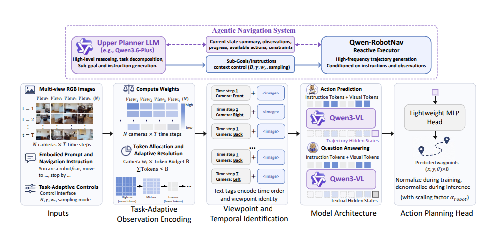
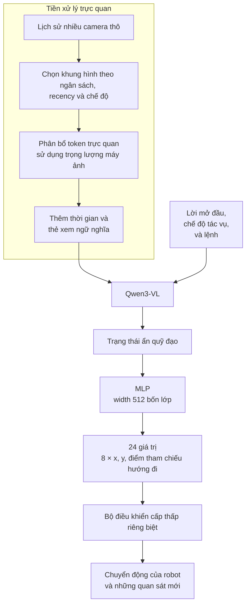
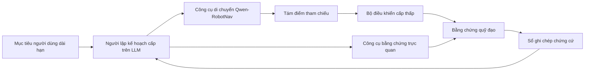
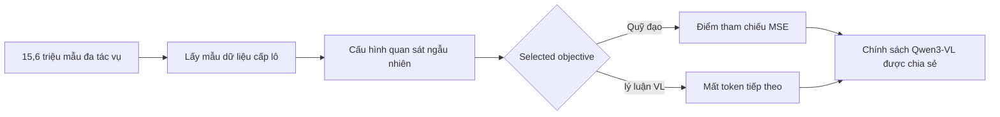

# Qwen-RobotNav: Tóm tắt bài thuyết trình

> **Nguồn thông tin đầy đủ:** [Báo cáo đầy đủ Qwen-RobotNav](qwen_robotnav_details.md). Phiên bản ngắn này
> cố tình bỏ qua các lược đồ đầu vào hoàn chỉnh, xây dựng tập dữ liệu, cài đặt huấn luyện, benchmark
> các giao thức và cảnh báo. Bài viết chính: [Qwen-RobotNav v3](https://arxiv.org/abs/2606.18112v3).

## Thông điệp chính

> **Qwen-RobotNav biến lịch sử nhiều camera có thể định cấu hình và hướng dẫn điều hướng thành tám tương lai
> điểm tham chiếu và có thể đóng vai trò là công cụ di chuyển bên trong agent robot do LLM lập kế hoạch.**

- Hỗ trợ VLN, PointNav, ObjectNav, theo dõi mục tiêu và huấn luyện lái xe tự động.
- Sử dụng Qwen3-VL để suy luận về không gian và ngôn ngữ.
- Sử dụng MLP bốn lớp nhỏ thay vì khuếch tán.
- Dự đoán tám điểm \((x,y,\theta)\) trong một lần chuyển tiếp.
- Cho phép người lập kế hoạch cấp trên thay đổi chế độ nhiệm vụ và chiến lược quan sát giữa các cuộc gọi.

## Kiến trúc



| Thành phần | Bài thuyết trình mang đi |
| ------------------------ | ------------------------------------------------------------------------------------------------- |
| Đầu vào | Lịch sử RGB nhiều camera, lời mở đầu phương án, mục tiêu phụ, chế độ tác vụ và cấu hình quan sát |
| Backbone thị giác-ngôn ngữ | Qwen3-VL với mã hóa hình ảnh có độ phân giải động |
| Kiểm soát quan sát | Ngân sách token, mức giảm gần đây, trọng lượng máy ảnh, lấy mẫu ngẫu nhiên/mới nhất, giới hạn trên mỗi hình ảnh |
| Đầu hành động | MLP bốn lớp, chiều rộng ẩn 512 |
| Đầu ra | 24 số = tám điểm tham chiếu ×\((x,y,\theta)\) |
| Ranh giới điều khiển | Một bộ điều khiển cấp thấp riêng biệt chuyển đổi các điểm tham chiếu thành chuyển động vật lý |

## Các chế độ tác vụ dành cho agent

Trình lập kế hoạch phía trên chọn một trong bốn chế độ cho mỗi lệnh gọi RobotNav. Đây là những giao diện giống nhau
trọng lượng mô hình, không phải chính sách riêng biệt.

| Trường YAML minh họa | Hành vi đã chọn | Chiến lược quan sát điển hình | Đầu vào đại diện |
| ----------------------- | --------------------------------------------------------- | ---------------------------------------------------------------------------- | ---------------------------------------------------------------- |
| `task_mode: VLN` | Đi theo lộ trình ngôn ngữ tự nhiên và các mốc được sắp xếp theo thứ tự | Lịch sử rộng, bối cảnh rộng hơn, xu hướng gần đây yếu | `Go to the living room, turn left, and stop near the kitchen.` |
| `task_mode: PointNav` | Di chuyển tới mục tiêu cục bộ giống như tọa độ hoặc điểm tham chiếu | Lịch sử được lấy mẫu cục bộ hoặc thống nhất; nhấn mạnh các khung hình gần đây gần mục tiêu | `Go to (2.2, 2.4).` |
| `task_mode: ObjNav` | Tìm kiếm một danh mục hoặc phiên bản đối tượng | Lịch sử rộng rãi/ngẫu nhiên trong quá trình thăm dò; khung hình gần đây trong lần tiếp cận cuối cùng | `Search the kitchen area for a mug.` |
| `task_mode: Tracking` | Theo dõi mục tiêu đang di chuyển hoặc được quan sát gần đây | Lấy mẫu khung hình mới nhất, độ lệch gần đây mạnh, độ trung thực khung hình gần đây cao | `Follow the man in the blue t-shirt.` |

Bốn tên chế độ được bài báo công bố, nhưng cú pháp `task_mode: <value>` YAML theo nghĩa đen là một
xây dựng lại bản trình bày thay vì API được phát hành. `ObjNav` chọn hành vi tìm kiếm; sau khi tìm thấy
một ứng cử viên, người lập kế hoạch có thể chuyển mô hình tương tự sang `PointNav` hoặc `Tracking` cục bộ.

Đừng nhầm lẫn bốn chế độ này với năm nhóm huấn luyện quỹ đạo. **Lái xe tự động là
họ huấn luyện và đánh giá thứ năm, nhưng bài báo không xác định giá trị `task_mode: Driving` trong
giao diện hướng tới agent.** Xem [báo cáo đầy đủ](qwen_robotnav_details.md#all-agent-facing-task_mode-values)
để có đầy đủ bằng chứng và cảnh báo.

### Ví dụ thực tế: đầu vào đến waypoint

**Việc tái tạo bản trình bày** này sử dụng các trường được mô tả trong bài báo; nó không phải là API chính thức:

```yaml
system_preamble: Imagine you are a robot programmed for navigation tasks
task_mode: ObjNav
instruction: Search the kitchen area for a mug.

observation_config:
  token_budget: 4096
  temporal_decay: 1.0
  frame_sampling: random
  camera_weights: {front: 2.0, right: 1.0, back: 0.5, left: 1.0}
  tokens_per_image: {min: 4, max: 256}

observations:
  - time: 0
    views: {front: <image>, right: <image>, back: <image>, left: <image>}
  - time: 1
    views: {front: <image>, right: <image>, back: <image>, left: <image>}
```

Sau khi lựa chọn, hình ảnh được tuần tự hóa bằng camera ngữ nghĩa và thẻ thời gian, ví dụ:

```text
Time step 0 Front View <image> Right View <image> Back View <image> Left View <image>
Time step 1 Front View <image> Right View <image> Back View <image> Left View <image>
```



Một kết quả minh họa có hình dạng tám hàng, ba giá trị chính xác có thể là:

```text
[(0.25, 0.00, 0.00), (0.50, 0.03, 0.05), ...,
 (1.60, 0.45, 0.55), (1.75, 0.65, 0.75)]
```

| Trường đầu ra | Ý nghĩa |
| ------------ | ------------------------------------------------------ |
| (x, y) | Vị trí điểm tham chiếu phẳng trong tương lai |
| \(\theta\) | Mục tiêu mong muốn tại điểm tham chiếu đó |
| Tám hàng | Một quỹ đạo cục bộ ngắn được dự đoán trong một lần chuyển tiếp |

Các điểm tham chiếu bằng số mang tính minh họa. RobotNav không trực tiếp xuất ra tốc độ bánh xe, mô men xoắn của động cơ,
hoặc một kế hoạch ngôn ngữ; bộ điều khiển thực thi chúng và trả về bằng chứng mới cho cuộc gọi tiếp theo.

## Chiến lược camera và lịch sử

Các mẫu ngữ cảnh cho mỗi chế độ ở trên là xu hướng được đề xuất, không phải là giá trị đặt trước cố định. Người lập kế hoạch có thể
thay đổi ngân sách token, lần truy cập gần đây, trọng số máy ảnh và chế độ lấy mẫu giữa các cuộc gọi khi giai đoạn thay đổi nhiệm vụ.

Các điều khiển chính là:

- **Ngân sách token \(B\):** tổng số token trực quan được chia sẻ trên các hình ảnh được giữ lại. Một ngân sách lớn hơn sẽ bảo tồn
  nhiều chi tiết về lịch sử hoặc hình ảnh hơn nhưng làm tăng khả năng tính toán.
- **Giảm dần theo thời gian \(\gamma\):** xu hướng gần đây. Giá trị lớn hơn phân bổ tương đối nhiều token hơn cho các
  quan sát; giá trị nhỏ hơn bảo tồn bằng chứng cũ một cách đồng đều hơn.
- **Chế độ lấy mẫu:** `random` cung cấp phạm vi phủ sóng rộng hơn trên toàn tập, trong khi `latest` giữ thông tin gần đây
  bối cảnh trượt.
- **Trọng lượng máy ảnh:** tầm quan trọng tương đối trong quá trình phân bổ token. Chúng là trọng lượng, không phải tỷ lệ phần trăm và
  không cần phải tổng hợp thành một.
- **Giới hạn trên mỗi hình ảnh \(b_{min},b_{max}\):** ngăn hình ảnh được giữ lại nhận quá ít hoặc quá nhiều
  token.

Sau đây là **giá trị đặt trước suy luận minh họa**, không phải giá trị bắt buộc hoặc được đánh giá là hoàn chỉnh
cấu hình cho mỗi nhiệm vụ theo bài báo:

| Chế độ và giai đoạn | \(B\) | \(\gamma\) | Lấy mẫu | Trọng lượng máy ảnh`front/right/back/left` | \(b_{min}/b_{max}\) | Hiệu quả dự định |
| ------------------------------ | ----: | ---------: | ---------- | --------------------------------------- | ------------------- | ------------------------------------------------------------------------------ |
| `VLN` |  4096 |        1.0 | `random` | `2.0 / 1.0 / 0.5 / 1.0` | `4 / 256` | Lưu giữ lịch sử tuyến đường rộng rãi trong khi vẫn giữ chế độ xem phía trước chi tiết nhất |
| `PointNav` — cách tiếp cận cục bộ |  2560 |        2,5 | `latest` | `2.0 / 0.75 / 0.25 / 0.75` | `4 / 256` | Ưu tiên hình học hiện tại và những thay đổi trở ngại gần đây gần mục tiêu |
| `ObjNav` — thăm dò |  4096 |        1.0 | `random` | `1.5 / 1.0 / 1.0 / 1.0` | `4 / 256` | Bao gồm các khu vực đã ghé thăm trước đây và lưu giữ bằng chứng từ mọi hướng |
| `Tracking` |  2048 |        3.0 | `latest` | `2.0 / 0.5 / 0.25 / 0.5` | `4 / 256` | Chi tiêu một ngân sách nhỏ gọn cho các khung hình mới nhất và có khả năng chuyển tiếp vị trí mục tiêu |

Ví dụ: lệnh gọi tìm kiếm đối tượng có thể bắt đầu bằng hàng khám phá `ObjNav`. Khi một chiếc cốc được nhìn thấy,
người lập kế hoạch có thể chuyển sang hàng `PointNav` cục bộ; nếu mục tiêu đang di chuyển, thay vào đó nó có thể chuyển sang
Hàng `Tracking`. Sự thay đổi pha này là mục đích sử dụng của giao diện có thể định cấu hình.

Bài viết ngẫu nhiên hóa các cấu hình huấn luyện trên các phạm vi được công bố sau:

| Tham số | Phạm vi huấn luyện |
| ------------- | --------------------------------------------------- |
| \(B\) | Đồng phục từ 2048 đến 4096 |
| \(\gamma\) | Đồng phục từ 1 đến 3 |
| \(b_{min}\) | Đồng phục rời rạc từ 1 đến 8 |
| \(b_{max}\) | Đồng phục rời rạc từ 128 đến 256 |
| Chế độ lấy mẫu | `random` hoặc `latest`, mỗi loại có xác suất 50% |

Trọng lượng máy ảnh sử dụng phạm vi ngẫu nhiên dành riêng cho máy ảnh và không được tiết lộ bằng số. Hoàn chỉnh duy nhất
Bốn ví dụ được công bố trong báo cáo là:

```text
front = 2.0, right = 1.0, back = 0.5, left = 1.0
```

Do đó, các hàng trọng lượng máy ảnh thay thế ở trên là những lựa chọn có tính giải thích, không phải là giá trị mặc định được báo cáo.
Đối với nền tảng không có bốn chế độ xem, trình lập kế hoạch sẽ cung cấp trọng số cho tên camera ngữ nghĩa thực tế của nó.
Bài viết sử dụng những cái tên đó thay vì một hợp đồng góc số cố định.
[Qwen-RobotNav v3, §§2.2, 3.2 và 5.5](https://arxiv.org/abs/2606.18112v3)

## RobotNav Bên trong Agent




| Thành phần đại lý | Vai trò |
| ------------------- | -------------------------------------------------------------------- |
| Người lập kế hoạch cấp trên LLM | Phân tách mục tiêu, chọn công cụ, chọn chế độ nhiệm vụ và quản lý tiến độ |
| Qwen-RobotNav | Tạo điểm chuyển động |
| Máy dò đối tượng | Tìm đối tượng ứng viên trong khung hiện tại hoặc được lưu trữ |
| Hiểu cảnh | Mô tả phòng, cách bố trí và địa danh |
| Nền tảng ngữ nghĩa | Kết nối tài liệu tham khảo ngôn ngữ với bằng chứng trực quan |
| Khai thác bằng chứng | Nén các bản giới thiệu thành bản tóm tắt và tài liệu tham khảo khung chính |
| Sổ tay chứng cứ | Bảo tồn các khu vực, giả thuyết, mốc và kết quả được tìm kiếm |

Bài viết nêu tên các công cụ trực quan nhưng không tiết lộ cách triển khai hoặc API của chúng.

## Dữ liệu huấn luyện


| Huấn luyện gia đình | Mẫu báo cáo |
| -------------------------- | ---------------: |
| Hướng dẫn sau |           5,631M |
| ĐiểmNav |             984K |
| Đối tượngNav |           2.000M |
| Theo dõi mục tiêu |           1,486M |
| Lái xe tự động |           3.216M |
| VL Tổng Hợp |       Khoảng 1,0 triệu |
| Lý luận điều hướng |             873K |
| Hội thoại VLN rời rạc |             362K |
| Điều hướng chuyển văn bản thành video |              40K |

Tổng cộng: khoảng **15,6 triệu mẫu**, được kết hợp dưới dạng **85% quỹ đạo** và **15% VL/lý luận**.

## Cách xây dựng mẫu huấn luyện

| Họ mô hình | Chuyển đổi chính |
| --------- | ----------------------------------------------------------------------------------------------- |
| R2R/RxR | Giáo viên buộc phải thực hiện các bước, loại bỏ hướng dẫn trùng lặp, thêm ba cách diễn giải, tinh chỉnh hình ảnh |
| ĐiểmNav | Nhấn mạnh các tuyến đường 6-10 m; giữ bước tiến ở mức 45%; giữ lại tất cả các lượt/điểm dừng |
| Đối tượngNav | Khám phá biểu đồ khung xương với hành vi rẽ nhánh/ngược lại; spline trơn tru ở khoảng cách 0,25 m |
| Theo dõi | Ghép nối các quan sát hiện tại/gần đây với mô tả mục tiêu và các điểm tham chiếu trong tương lai |
| Lái xe | Sử dụng lại các đường dẫn với hướng dẫn tùy chọn, trạng thái bản ngã và điều hòa lịch sử quỹ đạo |
| T2V | Prompt LLM → tạo video → Bộ lọc VLM → tư thế/độ sâu một mắt → bộ lọc động học |

## Luồng huấn luyện



Quan trọng: bài viết đưa ra hỗn hợp 85:15 nhưng không cung cấp tỷ lệ đăng ký tập dữ liệu đầy đủ hoặc thứ tự lô theo nghĩa đen.

## Điểm nổi bật của đánh giá

| Đánh giá |         Kết quả báo cáo chính | Thận trọng khi trình bày |
| --------------------- | ---------------------------: | ----------------------------------------------------------- |
| VLN-CE R2R Val-Không nhìn thấy |           72,1 SR / 66,6 SPL | Toàn cảnh 8B |
| VLN-CE RxR Val-Không nhìn thấy |           76,5 SR / 65,7 SPL | Lộ trình đa ngôn ngữ sau |
| VLNNgược lại ổn |         63,75 SR / 57,93 SPL | Hướng dẫn thô có điểm thấp hơn |
| HM3D-OVON vô hình |                      53,1 SR | Đường dẫn tìm kiếm dài hơn làm giảm hiệu quả |
| Theo dõi băng ghế dự bị EVT | theo dõi 90,0 / 77,4 thành công | Theo dõi cao nhất không có nghĩa là thành công nhiệm vụ cao nhất |
| NAVSIM |                    91,4 PDMS | Sử dụng ba quỹ đạo thực tế cơ bản trước đó trong dấu nhắc |
| AlpaSim không bắn |                   0,17 điểm | Bỏ xa các chuyên gia lái xe |

Các kết quả EQA cấp hệ thống sử dụng **Qwen3.6-Plus làm công cụ lập kế hoạch** và **Qwen-RobotNav-8B làm công cụ di chuyển**;
chúng không phải là điểm số RobotNav độc lập.

## Trang trình bày cuối cùng: Năm điểm

1. RobotNav đặt hầu hết lý luận điều hướng trong Qwen3-VL và giữ phần đầu hành động ở mức nhỏ.
2. Bề mặt điều khiển chính của nó là chiến lược quan sát, không phải bộ giải mã điểm tham chiếu.
3. Một mô hình hỗ trợ một số chế độ điều hướng thông qua prompt và cấu hình tác vụ.
4. Bên trong agent được đề xuất, RobotNav đặc biệt là **công cụ di chuyển**.
5. Phạm vi benchmark rất rộng, nhưng bằng chứng về robot thực là hoạt động lái xe/theo dõi định tính và chuyên nghiệp
   phương pháp vẫn còn bộc lộ những lỗ hổng quan trọng.
