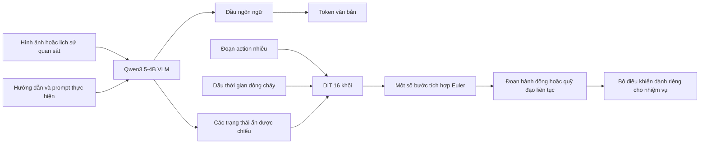
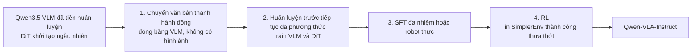

# Qwen-VLA: Tóm tắt bài thuyết trình

> **Nguồn thông tin đầy đủ:** [báo cáo kiến trúc và huấn luyện](qwen_vla_details.md) và
> [bằng chứng đánh giá](../../evaluation/VLA/benchmarks.md). Phiên bản ngắn này cố tình bỏ qua
> phương trình, lược đồ hành động ở cấp bộ dữ liệu, giao thức hoàn chỉnh và chi tiết triển khai.
> Bài báo chính: [Qwen-VLA v2](https://arxiv.org/abs/2605.30280v2).

## Thông điệp chính

> **Qwen-VLA sử dụng một backbone đa phương thức và một bộ giải mã hành động liên tục để hỗ trợ thao tác,
> điều hướng, chuyển động của con người và thị giác-ngôn ngữ trên nhiều hiện thân khác nhau.**

- Bắt đầu từ mô hình thị giác-ngôn ngữ Qwen3.5-4B.
- Thêm bộ giải mã hành động DiT 16 khối riêng biệt, tham số khoảng 1,15B.
- Sinh các đoạn hành động hoặc quỹ đạo liên tục bằng flow matching.
- Sử dụng prompt văn bản để xác định hiện thân, tần suất điều khiển, chân trời và nhiệm vụ.
- Giữ nguyên ngữ nghĩa hành động gốc; mô hình hợp nhất shape tensor và quy trình huấn luyện, không hợp nhất ngữ nghĩa vật lý.

## Kiến trúc



| Thành phần | Ý chính khi thuyết trình |
| --- | --- |
| Đầu vào | Quan sát thị giác, hướng dẫn nhiệm vụ và prompt về hiện thân/điều khiển |
| Backbone nhận thức | Qwen3.5-4B thực hiện nhận thức, grounding và suy luận ngôn ngữ |
| Bộ giải mã hành động | DiT một luồng riêng biệt cùng xử lý ngữ cảnh và token action nhiễu |
| Đầu ra | Một tensor liên tục có đệm, bao phủ chân trời và số kênh riêng của từng nhiệm vụ |
| Trạng thái robot mặc định | Không có proprioception; ảnh và prompt là đầu vào tiêu chuẩn |
| Ranh giới thực thi | Thống kê của bộ dữ liệu/nền tảng giải mã các kênh hành động trước khi bộ điều khiển thực thi |

Bộ giải mã đầu ngôn ngữ và hành động vẫn tách biệt: văn bản được huấn luyện với dự đoán token tiếp theo,
trong khi các quỹ đạo liên tục được huấn luyện bằng flow matching có điều kiện và mask.

## “Hành động thống nhất” thực sự có nghĩa là gì

```text
Thao tác:            [dx, dy, dz, rotation, gripper, ...]
Điều hướng:          [dx, dy, heading]
Chuyển động người:   [wrist transform, hand articulation, ...]
                         ↓
              đệm thành tensor H x K dùng chung
                         +
                 mask các phần tử không dùng
```

| Được chia sẻ qua các nhiệm vụ | Vẫn là nhiệm vụ hoặc phương án cụ thể |
| --- | --- |
| Trọng lượng VLM và DiT | Ý nghĩa vật lý của từng kênh |
| Hình dạng tensor tối đa | Khung tọa độ và đơn vị |
| Phần đệm và mặt nạ hợp lệ | Thống kê chuẩn hóa |
| Mục tiêu phù hợp với dòng chảy | Đường chân trời, bộ điều khiển và giới hạn an toàn |

Lưu ý chính: chỉ đặt tên robot mới trong prompt là chưa đủ. Triển khai vẫn cần lược đồ hành động,
chuẩn hóa và bộ điều khiển tương thích, và thường cần cả dữ liệu thích ứng.

## Prompt hiện thân

Bài viết sử dụng mẫu ngôn ngữ tự nhiên có chứa:

```text
danh tính robot và cấu hình tay máy
+ cờ chỉ báo eo hoặc đế di động
+ tần số điều khiển
+ số hành động tương lai
+ hướng dẫn nhiệm vụ
```

Prompt này chọn một quy ước hành động đã học. Nó không thay thế URDF, mô hình động học hoặc
giao diện phần cứng.

## Quy trình huấn luyện bốn giai đoạn



| Họ dữ liệu tiền huấn luyện tiếp diễn | Tỷ lệ lấy mẫu được báo cáo |
| --- | ---: |
| Quỹ đạo thao tác của robot | 74,2% |
| Quỹ đạo điều hướng, con người và tổng hợp | 17,2% |
| Thị giác-ngôn ngữ, grounding, VQA có prompt và chú thích hành động | 8,5% |

Các giá trị được nhóm tổng cộng là 99,9% vì bài báo báo cáo tỷ lệ cấp nguồn được làm tròn.

Quy mô được báo cáo gồm hơn **10.000 giờ tương tác robot công khai**, hơn **1.000
giờ vận hành robot độc quyền** và hơn **8 triệu quỹ đạo tổng hợp**. Các nguồn này
sử dụng các hiện thân và phương pháp thu thập khác nhau, vì vậy không nên cộng số
giờ của chúng thành một tổng kinh nghiệm đồng nhất.

Giai đoạn chuyển văn bản thành hành động không dùng ảnh trước tiên dạy DiT khởi
tạo ngẫu nhiên một prior hành động được lập chỉ mục bằng ngôn ngữ. Tiền huấn
luyện đa phương thức sau đó grounding prior này vào cảnh quan sát được. SFT đem
lại phần lớn mức tăng hậu huấn luyện đo được; giai đoạn RL được báo cáo chỉ bổ
sung các thay đổi nhỏ hơn và không đồng nhất.

## Điểm nổi bật của đánh giá

Tất cả các giá trị đều được **tác giả báo cáo** và không được sao chép trong không gian làm việc này.

| Đánh giá | Qwen-VLA-Base | Qwen-VLA-Instruct | Diễn giải khi thuyết trình |
| --- | ---: | ---: | --- |
| LIBERO thành công | 90,8 | **97,9** | Thao tác mô phỏng mạnh mẽ; gần bão hòa |
| RoboCasa-GR1 thành công | 40,4 | **56,7** | Nhiệm vụ bimanual trong bếp vẫn khó hơn đáng kể |
| Simpler-WidowX thành công | 64,3 | **73,7** | Việc triển khai RL chỉ được thu thập trong môi trường này |
| RoboTwin Thành công dễ / khó | 64,3 / 66,4 | **86,1 / 87,2** | Tăng mạnh sau khi huấn luyện trên các cài đặt cánh tay kép |
| SimplerEnv-OOD thành công | 25.3 | **32.0** | Có khả năng chuyển giao, nhưng tỷ lệ thành công OOD tuyệt đối vẫn thấp |
| DOMINO năng động thành công | 21.1 | **26,6** | Thao tác động vẫn còn khó khăn |

Bằng chứng bổ sung:

- Qwen-VLA-Base tinh chỉnh trên dữ liệu ALOHA thực báo cáo tỷ lệ thành công trung bình **83,6%** trong miền và **76,9%** OOD,
  thành công, so với 48,5% và 36,2% khi huấn luyện cùng một kiến trúc từ đầu.
- Khi điều hướng liên tục, Qwen-VLA-Instruct báo cáo **57,5 SR / 51,2 SPL** trên R2R Val-Unseen và
  **59,6 SR / 47,8 SPL** trên RxR Val-Unseen. Nó dẫn đầu các đường cơ sở mở được liệt kê về tỷ lệ thành công, nhưng
  không phải mọi thước đo chất lượng đường dẫn.

## Các giới hạn cần nêu trên slide

- Một tensor dùng chung không phải là một không gian hoạt động vật lý phổ quát.
- Giao diện trạng thái chỉ có tầm nhìn mặc định có thể bị lỗi khi bị tắc, tiếp xúc hoặc động lực nhanh.
- Bộ giải mã hành động 1.15B đắt tiền so với đầu chính sách nhỏ.
- Hầu hết bằng chứng định lượng thuộc tác vụ ngắn hạn và dựa trên benchmark; khả năng phục hồi và bộ nhớ liên tục
  vẫn còn những vấn đề mở.
- Như đã kiểm tra vào ngày 22-07-2026, kho lưu trữ chính thức đã cung cấp báo cáo và kết quả nhưng không được công bố
  checkpoint, mã suy luận hoặc bộ công cụ đánh giá để tái lập.

## Trang trình bày cuối cùng: Năm điểm

1. Qwen-VLA là **mô hình đa phương thức tổng quát với một DiT hành động liên tục riêng biệt**.
2. Giao diện chia sẻ của nó sử dụng phần đệm, mặt nạ, prompt và chuẩn hóa dành riêng cho tập dữ liệu.
3. Tiền huấn luyện chuyển văn bản thành hành động ổn định bộ giải mã hành động mới trước khi grounding bằng thị giác.
4. Một checkpoint bao phủ cả thao tác và điều hướng, với kết quả trong phân phối được báo cáo rõ ràng.
5. Thành công của OOD, ngữ nghĩa triển khai, độ trễ và độ an toàn vẫn là những thử nghiệm quan trọng chưa được giải quyết.
