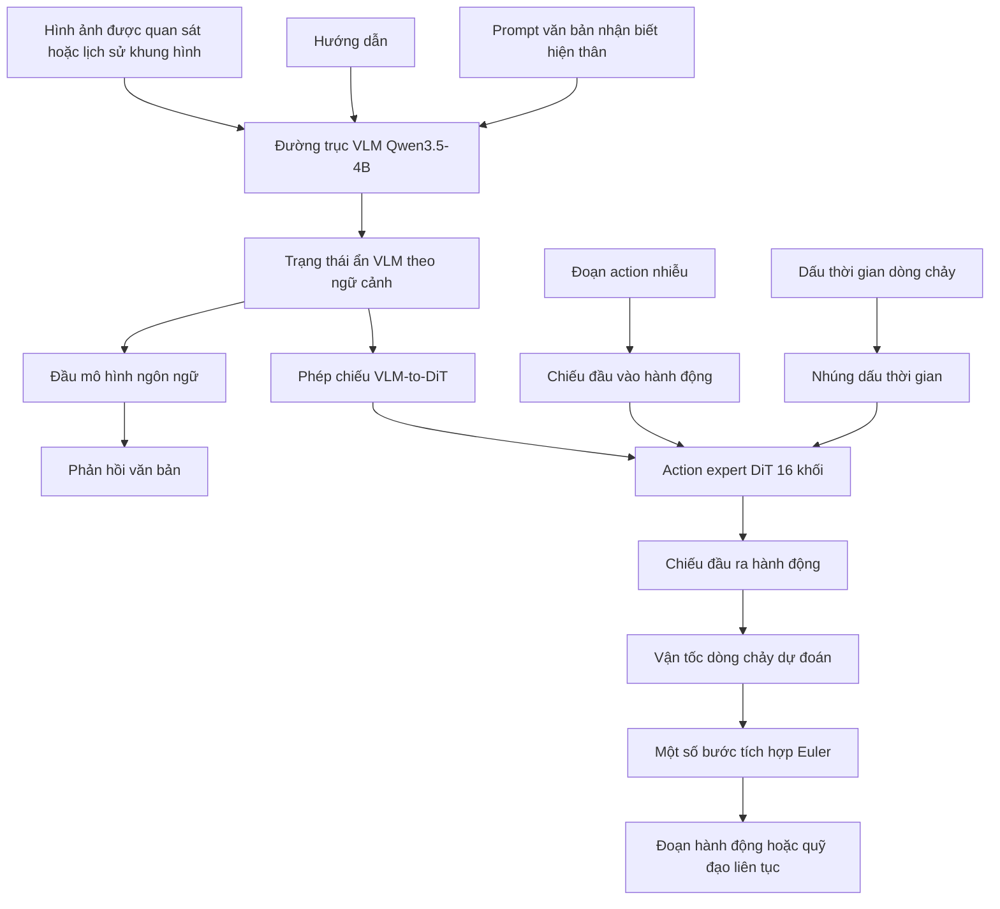
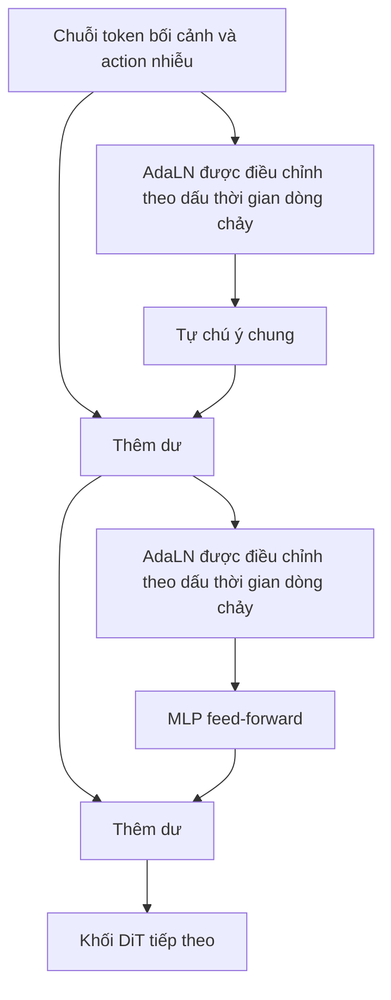
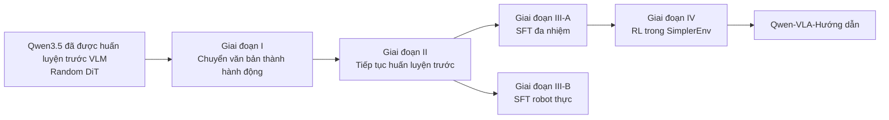
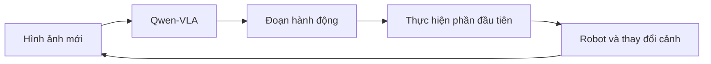
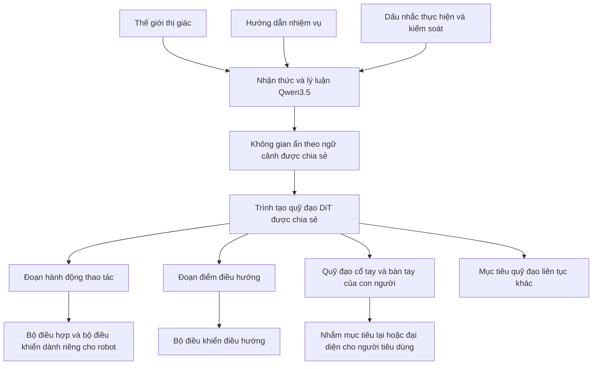

# Luồng dữ liệu, huấn luyện và kiến trúc Qwen-VLA từ đầu đến cuối

## 1. Tóm tắt

Qwen-VLA là **mô hình hành động-ngôn ngữ-thị giác tổng quát**, mở rộng mô hình
ngôn ngữ-thị giác Qwen3.5-4B đã được huấn luyện trước bằng một **action expert
Diffusion Transformer (DiT) 1,15B tham số**.

Mục tiêu thiết kế trung tâm của nó rộng hơn các VLA tập trung vào thao tác thông thường:

- xử lý hình ảnh, lịch sử quan sát giống như video và ngôn ngữ;
- duy trì sự hiểu biết thị giác-ngôn ngữ và tạo văn bản;
- tạo ra các hành động thao tác liên tục;
- tạo quỹ đạo điểm điều hướng;
- học từ quỹ đạo cổ tay và bàn tay góc nhìn thứ nhất của con người;
- hỗ trợ nhiều hiện thân robot và quy ước điều khiển bằng một bộ trọng số.

Kiến trúc có thể được tóm tắt như sau:

```text
Images / observation history
            +
Chỉ dẫn + prompt nhận biết hiện thân
            ↓
Backbone ngôn ngữ-thị giác Qwen3.5-4B
            ↓
Chuỗi trạng thái ẩn theo ngữ cảnh
            ├── Đầu ngôn ngữ → token văn bản
            └── Action expert DiT
                    +
                đoạn hành động nhiễu
                    +
                bước thời gian của luồng
                    ↓
            đoạn hành động hoặc quỹ đạo liên tục sạch
```

Điểm khác biệt quan trọng nhất là Qwen-VLA **hợp nhất giao diện thần kinh**,
không phải ý nghĩa vật lý của mọi chiều hành động. Một waypoint điều hướng và một
mục tiêu khớp robot vẫn khác nhau về mặt vật lý. Qwen-VLA đặt chúng vào cùng một
định dạng tensor đệm, xác định quy ước điều khiển của chúng thông qua văn bản và mặt nạ
các kênh không được sử dụng trong quá trình huấn luyện.

Điều chỉnh quan trọng thứ hai là khung Qwen-VLA mặc định **không
sử dụng trạng thái proprioception của robot làm đầu vào**. Các tác giả đã thử điều kiện hóa
bằng trạng thái góc khớp, nhưng chỉ thấy cải thiện nhỏ trên RoboTwin, nên giữ
prompt văn bản nhận biết hiện thân làm đầu vào duy nhất dành riêng cho nền tảng. Điều này khác với
các mô hình như π0, xử lý trạng thái robot một cách rõ ràng.

---

## 2. Qwen-VLA đang giải quyết vấn đề gì

Một VLA thông thường thường học:

$$
p_\theta(a_t \mid o_t, x)
$$

ở đâu:

- $o_t$ là quan sát trực quan hiện tại;
- $x$ là hướng dẫn ngôn ngữ;
- $a_t$ là hành động tiếp theo của robot.

Công thức này thường chuyên biệt cho một nhóm nhiệm vụ, thường là thao tác,
và một nhóm quy ước hành động hạn chế.

Thay vào đó, Qwen-VLA nhắm đến mô hình trình tự có điều kiện rộng hơn:

$$
p_\theta
\left(
y_{t:t+H-1}
\mid
o_t, x, e, z
\right)
$$

ở đâu:

- $o_t$ là bối cảnh trực quan: một hình ảnh, nhiều camera, khung hình video hoặc lịch sử;
- $x$ là lệnh nhiệm vụ;
- $e$ là mô tả hiện thân và điều khiển bằng văn bản;
- $z$ là mã định danh tác vụ tùy chọn;
- $H$ là chân trời dự đoán;
- $y_{t:t+H-1}$ là chuỗi hành động hoặc quỹ đạo trong tương lai.

Do đó, đầu ra có thể có nghĩa khác nhau:

```text
Thao tác:
    hành động end-effector, khớp, gripper hoặc bàn tay trong tương lai

Điều hướng:
    waypoint tương đối trong tương lai

Mô hình hóa góc nhìn thứ nhất của con người:
    phép biến đổi cổ tay và khớp bàn tay trong tương lai

Dự đoán tập trung vào quỹ đạo:
    đường đi không gian trong tương lai của một tác nhân có hiện thân hoặc thực thể khác
```

Khái niệm trừu tượng được chia sẻ không phải là “tất cả các đầu ra đều là khớp nối của robot”. Đó là:

> Với bối cảnh ngôn ngữ-thị giác và đặc tả hiện thân/điều khiển, hãy dự đoán
> chuỗi các vectơ có giá trị thực có ý nghĩa vật lý theo thời gian.

---

## 3. Kiến trúc cấp cao



Do đó, Qwen-VLA có hai đường dẫn đầu ra khác nhau về mặt khái niệm:

| Đường dẫn đầu ra | Mẫu đầu ra | Mục tiêu huấn luyện |
| ----------------- | ----------------------------------- | ------------------------- |
| Đầu ngôn ngữ VLM | Token văn bản rời rạc | Entropy chéo token tiếp theo |
| Action expert DiT | Tensor hành động/quỹ đạo liên tục | Flow matching có điều kiện |

VLM chịu trách nhiệm chủ yếu về nhận thức, nền tảng, hướng dẫn
sự hiểu biết và lý luận theo ngữ cảnh. DiT chuyên về độ chính xác,
tạo ra hành động liên tục mạch lạc theo thời gian.

---

## 4. Backbone thị giác-ngôn ngữ Qwen3.5

Qwen-VLA sử dụng **Qwen3.5-4B** làm xương sống nhận thức.

### 4.1 Cấu trúc token đầu vào

Xương sống nhận được:

- token văn bản từ hướng dẫn;
- token văn bản từ prompt nhận biết hiện thân;
- token trực quan được tạo bởi bộ mã hóa thị giác;
- có thể có nhiều hình ảnh hoặc quan sát trực quan theo thời gian.

Qwen3.5 vốn là đa phương thức và sử dụng phản ứng tổng hợp sớm. nhúng trực quan là
được xen kẽ vào luồng token văn bản thay vì được xử lý hoàn toàn bởi một
chính sách hạ nguồn riêng biệt.

Về mặt khái niệm:

```text
Embodiment tokens
Instruction tokens
Image placeholder
Visual tokens
Additional text or image tokens
        ↓
One multimodal token sequence
        ↓
Qwen3.5 transformer
```

### 4.2 Trạng thái ẩn ở đây có ý nghĩa gì

Đối với chuỗi đầu vào của token đa phương thức $N$, VLM tạo ra:

$$
H_{\text{VLM}}
=
[h_1,h_2,\ldots,h_N]
\in
\mathbb{R}^{N\times d_{\text{VLM}}}
$$

Mỗi $h_i$ là một biểu diễn theo ngữ cảnh. Nó không phải là một hành động và không phải là một
token đầu ra được giải mã thông thường. Nó chứa thông tin được thu thập thông qua
xương sống về:

- đối tượng trực quan và vị trí của chúng;
- mục tiêu được đề cập;
- hình học cảnh;
- ý nghĩa hướng dẫn;
- quy ước thực hiện và kiểm soát;
- mối quan hệ giữa tất cả các token đầu vào.

Lớp tuyến tính đã học sẽ ánh xạ các trạng thái ẩn này vào độ rộng kênh DiT:

$$
C = H_{\text{VLM}}W_c
$$

ở đâu:

$$
C\in\mathbb{R}^{N\times d_{\text{DiT}}}
$$

Những token bối cảnh dự kiến này điều kiện hóa action expert.

---

## 5. Action expert DiT dùng flow matching

## 5.1 Mục đích

Action expert tạo ra các đoạn hành động liên tục thay vì hành động giống như văn bản
token.

Chuyên gia có khoảng **1,15B thông số**, bao gồm:

- 16 khối DiT;
- khoảng 70,8M tham số trên mỗi khối;
- khoảng 1,13B tham số trong các khối;
- MLP chiếu đầu vào và đầu ra hành động thô;
- Phép chiếu trạng thái ẩn VLM;
- nhúng dấu thời gian;
- đầu ra điều chế AdaLN.

DiT không chỉ là một người đứng đầu chính sách tuyến tính nhỏ. Đó là một điều đáng kể
Transformer dành riêng cho quỹ đạo liên tục.

## 5.2 Đầu vào của action expert

Action expert nhận được ba thông tin đầu vào chính:

1. token bối cảnh VLM dự kiến;
2. một đoạn action nhiễu;
3. bước thời gian của luồng $\tau$.

Hãy để tensor hành động đệm có hình dạng:

$$
Y_\tau \in \mathbb{R}^{H\times K}
$$

ở đâu:

- $H$ là chân trời hành động cực đại dùng chung;
- $K$ là số lượng kênh hành động tối đa phổ biến.

MLP đầu vào ánh xạ từng vectơ hành động thô vào chiều rộng ẩn DiT:

$$
A_\tau = \operatorname{MLP}_{\text{in}}(Y_\tau)
$$

Sau đó, mô hình sẽ kết hợp các token bối cảnh và hành động thành một chuỗi:

$$
S_\tau = [C;A_\tau]
$$

Không giống như bộ giải mã chú ý chéo đơn giản, Qwen-VLA xử lý bối cảnh VLM và nhiễu
token hành động với **sự tự chú ý chung** bên trong DiT một luồng.

## 5.3 Khối DiT

Một khối đơn giản hóa là:



Chuyên gia sử dụng:

- tự chú ý chung;
- các lớp MLP feed-forward;
- chuẩn hóa lớp thích ứng;
- điều hòa dấu thời gian;
- RoPE nhiều phần thẳng hàng với đường trục.

### Điều kiện hóa timestep bằng AdaLN (Chuẩn hóa lớp thích ứng)

Vấn đề khử nhiễu thay đổi với $\tau$. Ở mức nhiễu cao, mạng phải suy ra
cấu trúc quỹ đạo rộng. Gần điểm cuối sạch, nó phải tinh chỉnh chi tiết.
AdaLN biến đổi việc nhúng dấu thời gian vào các tham số điều chế làm thay đổi
chuẩn hóa trong mỗi khối.

Một biểu diễn đơn giản hóa là:

$$
\operatorname{AdaLN}(x,\tau)
=
\gamma(\tau)
\odot
\operatorname{Norm}(x)
+
\beta(\tau)
$$

Kiến trúc thực tế cũng có thể sử dụng các cổng phụ thuộc vào dấu thời gian cho phần dư
chi nhánh. Điều này cho mọi khối DiT biết nó đang ở giai đoạn nào của quá trình xử lý dòng chảy.
hiện đang giải quyết.

## 5.4 Đầu ra

DiT dự đoán trường vận tốc:

$$
v_\theta
\left(
Y_\tau,\tau
\mid
o,x,e,z
\right)
\in
\mathbb{R}^{H\times K}
$$

Đây không phải là hành động trực tiếp cuối cùng. Khi suy luận, mô hình bắt đầu từ ngẫu nhiên
nhiễu và tích phân trường vận tốc dự đoán cho một số lượng nhỏ Euler
các bước cho đến khi thu được một đoạn hành động rõ ràng.

---

## 6. Biểu diễn hành động và quỹ đạo thống nhất

## 6.1 “Thống nhất” nghĩa là gì

Qwen-VLA **không** chuyển đổi tất cả các tập dữ liệu thành một hành động vật lý chung
định nghĩa.

Nó bảo tồn ngữ nghĩa kiểm soát gốc của mỗi tập dữ liệu, chẳng hạn như:

```text
Tập dữ liệu A:
    tịnh tiến end-effector dạng delta + góc quay Euler + gripper

Tập dữ liệu B:
    vị trí khớp tuyệt đối

Tập dữ liệu C:
    vị trí khớp hai tay máy + hai gripper

Tập dữ liệu D:
    waypoint điều hướng tương đối

Tập dữ liệu E:
    chuyển động cổ tay SE(3) của người + eigengrasp của bàn tay
```

Nó chỉ thống nhất:

- cấp tensor và hình dạng cực đại;
- quy ước vị trí kênh;
- đệm;
- che giấu tính hợp lệ;
- bộ giải mã thần kinh;
- giao diện huấn luyện phù hợp với dòng chảy.

## 6.2 Tensor đệm dùng chung

Mỗi mục tiêu được thể hiện dưới dạng:

$$
Y_0\in\mathbb{R}^{H\times K}
$$

Một tác vụ chỉ sử dụng dấu thời gian $H_{\text{task}}$ và kích thước hành động $c$ sẽ lấp đầy
ma trận con hàng đầu:

$$
Y_0[0:H_{\text{task}},\,0:c]
$$

Phần còn lại được đệm bằng 0.

Mặt nạ nhị phân chỉ định các mục nhập hợp lệ:

$$
M\in\{0,1\}^{H\times K}
$$

với:

$$
M_{h,k}
=
\begin{cases}
1, & h < H_{\text{task}}\ \text{and}\ k<c \\
0, & \text{otherwise}
\end{cases}
$$

Ví dụ với $H=4$ và $K=8$:

### Mẫu điều hướng sử dụng ba kênh

```text
Target Y:

[
 [ Δx1, Δy1, Δθ1, 0, 0, 0, 0, 0 ],
 [ Δx2, Δy2, Δθ2, 0, 0, 0, 0, 0 ],
 [ Δx3, Δy3, Δθ3, 0, 0, 0, 0, 0 ],
 [   0,   0,   0,  0, 0, 0, 0, 0 ]
]

Mask M:

[
 [ 1, 1, 1, 0, 0, 0, 0, 0 ],
 [ 1, 1, 1, 0, 0, 0, 0, 0 ],
 [ 1, 1, 1, 0, 0, 0, 0, 0 ],
 [ 0, 0, 0, 0, 0, 0, 0, 0 ]
]
```

### Mẫu thao tác sử dụng bảy kênh

```text
[
 [ Δx1, Δy1, Δz1, Δr1, Δp1, Δyaw1, grip1, 0 ],
 [ Δx2, Δy2, Δz2, Δr2, Δp2, Δyaw2, grip2, 0 ],
 ...
]
```

Mặt nạ ngăn chặn các giá trị bị đệm góp phần gây ra sự mất mát.

## 6.3 Chuẩn hóa dành riêng cho tập dữ liệu

Bởi vì góc khớp, khẩu độ kẹp và chuyển vị điều hướng có
các đơn vị và tỷ lệ khác nhau, mỗi tập dữ liệu giữ lại mức chuẩn hóa thích hợp
kế hoạch.

Về mặt khái niệm:

$$
\tilde{y}_{h,k}
=
\frac{
y_{h,k}-\mu_{\mathcal{D},k}
}{
\sigma_{\mathcal{D},k}+\epsilon
}
$$

hoặc một sự chuẩn hóa mạnh mẽ tương đương.

Mô hình được huấn luyện trên các giá trị chuẩn hóa. Khi suy luận, các kênh được dự đoán
không được chuẩn hóa bằng cách sử dụng tập dữ liệu/thống kê kiểm soát của nền tảng đích trước đó
được chuyển đến bộ điều khiển.

Điều này là cần thiết. Chỉ cần đệm các đơn vị thô khác nhau vào một tensor sẽ tạo ra
độ dốc cân bằng kém và thang số không rõ ràng.

---

## 7. Các loại hành động được xử lý bởi Qwen-VLA

## 7.1 Hành động thao tác

Dữ liệu thao tác có thể bao gồm:

### Điều khiển end-effector dạng delta

$$
a_t =
[
\Delta x,\Delta y,\Delta z,
\Delta r_x,\Delta r_y,\Delta r_z,
g
]
$$

### Điều khiển end-effector bằng quaternion

$$
a_t =
[
\Delta x,\Delta y,\Delta z,
q_x,q_y,q_z,q_w,
g
]
$$

### Kiểm soát vị trí khớp tuyệt đối

$$
a_t =
[
q_1,q_2,\ldots,q_n,g
]
$$

### Điều khiển bàn tay khéo léo

$$
a_t =
[
q^{\text{arm}},
q^{\text{thumb}},
q^{\text{index}},
\ldots
]
$$

### Điều khiển hai tay

$$
a_t =
[
a_t^{\text{left}},
a_t^{\text{right}},
g_t^{\text{left}},
g_t^{\text{right}}
]
$$

## 7.2 Quỹ đạo điều hướng

Điều hướng sử dụng các điểm tham chiếu tương đối:

$$
a_h =
[
\Delta x_h,\Delta y_h,\Delta\theta_h
]
$$

Một đoạn là:

$$
Y =
\begin{bmatrix}
\Delta x_1 & \Delta y_1 & \Delta\theta_1 \\
\Delta x_2 & \Delta y_2 & \Delta\theta_2 \\
\vdots & \vdots & \vdots \\
\Delta x_H & \Delta y_H & \Delta\theta_H
\end{bmatrix}
$$

Bộ điều khiển điều hướng xuôi dòng chuyển đổi quỹ đạo ngắn này thành có thể thực thi được
các lệnh về bánh xe, lái hoặc chuyển động.

## 7.3 Biểu diễn hành động egocentric của con người

Đối với mỗi bàn tay, Qwen-VLA thể hiện chuyển động của cổ tay trong tương lai so với ban đầu
khung cổ tay:

- dịch ba chiều;
- xoay góc trục với ba chiều;
- 10 hệ số khớp nối tay PCA được gọi là eigengrasps.

Mỗi bàn tay:

$$
6\ \text{chiều cổ tay}
+
10\ \text{chiều bàn tay}
=
16
$$

Đối với hai tay:

$$
16\times2=32
$$

Do đó, mỗi bước thời gian góc nhìn thứ nhất của con người chứa 32 chiều hành động.

Những mục tiêu này không trực tiếp là lệnh động cơ robot. Chúng cung cấp prior thao tác
rộng từ con người và có thể hỗ trợ chuyển giao hoặc retargeting sang robot sau này.

---

## 8. Điều kiện hóa prompt theo embodiment

## 8.1 Mẫu prompt

Báo cáo chỉ định prompt có dạng sau:

```text
Robot là {robot_tag}, có {một tay máy / hai tay máy}
[, eo][, và đế di động].
Tần số điều khiển là {FPS} Hz.
Hãy dự đoán {chunk_size} hành động điều khiển tiếp theo để thực hiện
nhiệm vụ sau: {instruction}.
```

Prompt truyền đạt:

- nhận dạng robot/nền tảng;
- số lượng và cấu hình của cánh tay;
- sự hiện diện của thắt lưng;
- sự hiện diện của một căn cứ di động;
- tần số điều khiển;
- chân trời dự đoán;
- hướng dẫn nhiệm vụ;
- ngầm định, quy ước kiểm soát tập dữ liệu/nền tảng đã học được trong quá trình huấn luyện.

## 8.2 Thực tế nó làm gì

Prompt không xác định động học một cách máy móc như tệp URDF. Nó không
chứa các giới hạn chung, độ dài liên kết hoặc triển khai bộ điều khiển.

Thay vào đó, các ví dụ huấn luyện lặp đi lặp lại sẽ dạy cho mô hình một sự liên kết:

```text
Prompt về hiện thân/điều khiển
        ↔
Phân phối quan sát
        ↔
Số chiều hành động và cách chuẩn hóa
        ↔
Động lực học và mẫu chuyển động điển hình
```

Ví dụ:

```text
"dual-arm ALOHA, 50 Hz, predict 50 actions"
```

chọn một phân phối hành động có điều kiện đã học khác từ:

```text
"navigation agent, 5 Hz, predict 8 waypoints"
```

Prompt tương tự như một nhiệm vụ hoặc thẻ ngôn ngữ trong học tập đa nhiệm, nhưng mang theo
thông tin điều khiển chi tiết hơn.

## 8.3 Điều gì không đảm bảo

Việc thay đổi prompt thành tên robot hoàn toàn không được nhìn thấy sẽ không tự động thực hiện
người mẫu hiểu được robot đó.

Khái quát hóa vẫn phụ thuộc vào:

- liệu các hiện thân tương tự có xuất hiện trong quá trình huấn luyện hay không;
- liệu các kênh hành động mới có tương thích hay không;
- liệu chuẩn hóa và giải mã có được xác định hay không;
- liệu hình thức trực quan và động lực học có đủ giống nhau hay không;
- liệu bộ điều khiển xuôi dòng có thể thực hiện quy ước dự đoán hay không.

Prompt văn bản là giao diện điều hòa, không phải là sự thay thế cho dữ liệu robot.

---

## 9. Điểm quan trọng: Qwen-VLA mặc định không sử dụng trạng thái robot

Nhiều VLA có action expert hiện đại cung cấp proprioception rõ ràng như:

$$
s_t =
[
q_t,\dot q_t,g_t
]
$$

Qwen-VLA đã đánh giá hai phương pháp tiêm trạng thái:

1. trạng thái mã hóa trong dấu nhắc VLM;
2. tiêm trạng thái trực tiếp vào DiT.

Trên RoboTwin-2.0, kết quả được báo cáo là:

| Điều hòa | RoboTwin-Dễ dàng | RoboTwin-Hard |
| ------------------- | ------------: | ------------: |
| Không có trạng thái |          88,7 |          87,4 |
| Trạng thái trong dấu nhắc VLM |          89,3 |          88,7 |
| Trạng thái trong DiT |          89,4 |          88,3 |

Sự cải thiện là nhỏ. Các tác giả gán điều này cho:

- hình ảnh nhiều chế độ xem đã hiển thị cấu hình robot hiện tại;
- dự đoán hành động tương đối làm giảm sự phụ thuộc vào tham chiếu trạng thái tuyệt đối;
- chi phí kỹ thuật để duy trì nhiều giao diện trạng thái riêng cho từng hiện thân.

Do đó, mô hình mặc định giữ:

```text
Hình ảnh
+
Chỉ dẫn
+
Prompt văn bản nhận biết hiện thân
```

và không yêu cầu:

```text
Vectơ trạng thái góc khớp
```

Đây là một quyết định thiết kế, không phải là khẳng định rằng khả năng cảm nhận bản thể nói chung là vô dụng.
Bang có thể sẽ quan trọng hơn khi:

- robot bị ẩn một phần;
- hành động chung tuyệt đối được dự đoán;
- lực tiếp xúc quan trọng;
- vận tốc và trạng thái động là quan trọng;
- yêu cầu điều khiển vòng kín tốc độ cao;
- tầm nhìn không thể suy ra cấu hình hoàn chỉnh.

---

## 10. Mục tiêu huấn luyện flow matching

## 10.1 Nội suy các hành động sạch và nhiễu

Hãy:

- $Y_0$ là hành động mục tiêu chuẩn hóa rõ ràng;
- $Y_1\sim\mathcal{N}(0,I)$ là nhiễu Gaussian;
- $\tau\in[0,1]$ là dấu thời gian của luồng.

Cấu trúc Qwen-VLA:

$$
Y_\tau
=
(1-\tau)Y_0+\tau Y_1
$$

Vì vậy:

```text
τ = 0 → hành động sạch
τ = 1 → nhiễu thuần túy
```

Vận tốc mục tiêu dọc theo đường tuyến tính này là:

$$
\frac{dY_\tau}{d\tau}
=
Y_1-Y_0
$$

DiT học được:

$$
v_\theta
\left(
Y_\tau,\tau
\mid
o,x,e,z
\right)
\approx
Y_1-Y_0
$$

## 10.2 Action loss có mask theo từng kênh

Đối với kênh hoạt động $k$, bài viết tính toán lỗi bình phương trung bình được che dấu dấu thời gian:

$$
\ell_k
=
\frac{
\sum_{h=1}^{H}
M_{h,k}
\left\|
v_\theta(Y_\tau,\tau\mid o,x,e,z)_{h,k}
-
(Y_1-Y_0)_{h,k}
\right\|_2^2
}{
\sum_{h=1}^{H}M_{h,k}
}
$$

Sau đó, nó tính trung bình đồng đều trên các kênh hoạt động $c$:

$$
\mathcal{L}_{\text{act}}
=
\mathbb{E}
\left[
\frac{1}{c}
\sum_{k=0}^{c-1}
\ell_k
\right]
$$

Việc tính trung bình hai cấp độ này rất quan trọng vì nếu không thì:

- các mục được đệm có thể ảnh hưởng đến độ dốc;
- các mẫu có tầm nhìn dài có thể chiếm ưu thế;
- các hiện thân có nhiều kênh hành động hơn có thể tạo loss lớn hơn chỉ vì
  chúng có chiều cao hơn.

## 10.3 Mục tiêu thị giác-ngôn ngữ

Đối với các mẫu thị giác-ngôn ngữ thông thường, xương sống giữ lại token tiếp theo tiêu chuẩn
huấn luyện:

$$
\mathcal{L}_{\text{vl}}
=
-\sum_i
\log
p_\theta(w_i\mid w_{<i},o)
$$

Điều này được áp dụng cho dữ liệu như:

- giám sát thị giác-ngôn ngữ chung;
- nối đất không gian;
- chú thích hành động thể hiện;
- VQA lái xe tự động.

Mục đích của nó là bảo tồn nhận thức trực quan, nền tảng ngôn ngữ và lý luận
trong khi một lượng lớn huấn luyện hành động sửa đổi mô hình.

## 10.4 Mục tiêu kết hợp

Mục tiêu tổng thể là:

$$
\mathcal{L}
=
\lambda_{\text{act}}
\mathcal{L}_{\text{act}}
+
\lambda_{\text{vl}}
\mathcal{L}_{\text{vl}}
$$

Các hệ số được chọn để cân bằng độ lớn gradient giữa tác động
và mục tiêu ngôn ngữ.

---

## 11. Quy trình huấn luyện bốn giai đoạn

Việc huấn luyện toàn bộ kiến trúc cùng nhau ngay từ đầu là khó khăn vì:

- Qwen3.5 VLM đã được huấn luyện trước;
- action expert DiT bắt đầu được khởi tạo ngẫu nhiên;
- một DiT mới ban đầu tạo ra những gradient ồn ào, thiếu thông tin;
- mã hóa hình ảnh đắt tiền;
- bộ giải mã phải đồng thời tìm hiểu cấu trúc hoạt động, động lực học dòng chảy,
  điều kiện hóa theo hiện thân và nền tảng thị giác.

Qwen-VLA chia các vấn đề này thành bốn giai đoạn.



## 11.1 Giai đoạn I: Huấn luyện trước DiT chuyển văn bản thành hành động

### Các thành phần được đóng băng và có thể huấn luyện được

```text
Qwen3.5 VLM: frozen
DiT action expert: trainable
Images: withheld
```

Các đầu vào là:

```text
Task instruction
+
Embodiment prompt
+
Noisy target action
+
Flow timestep
```

Mục tiêu là quỹ đạo hành động rõ ràng thông qua tổn thất phù hợp với dòng chảy.

Bài viết giải thích điều này là **giải nén có cấu trúc**:

```text
Compact language:
    "pick up the red cup"
    "dual-arm robot, 50 Hz, 32 actions"

            ↓

High-dimensional trajectory:
    hàng trăm hoặc hàng nghìn giá trị liên tục
```

Giai đoạn này dạy DiT:

- hình học tổng thể của phân phối hành động;
- sự gắn kết về mặt thời gian giữa các khối hành động;
- cách ngôn ngữ tác vụ chọn một họ hành vi;
- cách prompt về hiện thân thay đổi tham số hóa hành động;
- làm thế nào để giải quyết vấn đề khử nhiễu phù hợp với dòng chảy.

Vì không có hình ảnh nên DiT không thể sử dụng lối tắt trực quan. Đầu tiên nó học một
hành động được lập chỉ mục ngôn ngữ trước đó.

### Giới hạn riêng của T2A

Chỉ văn bản thôi thì không thể xác định quỹ đạo chính xác trong một cảnh cụ thể. Ví dụ,
“Nhấc cốc lên” không cho chính sách biết cốc ở đâu. T2A học rộng
hình dạng và ngữ nghĩa của hành vi chứ không phải sự kiểm soát dựa trên bối cảnh.

## 11.2 Giai đoạn II: tiếp tục huấn luyện trước đa phương thức

Mô hình sau đó giải phóng cả hai mô-đun:

```text
Qwen3.5 VLM: trainable
DiT action expert: trainable
Images: included
```

Mục đích chính là nền tảng trực quan:

```text
Language-indexed action prior
        +
Actual scene observations
        ↓
Scene-specific executable trajectory
```

Hỗn hợp huấn luyện chứa các ví dụ về hành động và thị giác-ngôn ngữ không đồng nhất.
Trong một đợt, các mẫu từ các nhóm nhiệm vụ khác nhau được trộn theo các nguyên tắc cố định.
tỷ lệ lấy mẫu.

Giai đoạn này dạy:

- nền tảng đối tượng và mục tiêu;
- lập bản đồ không gian và động học;
- chuyển giao giữa các hiện thân;
- quỹ đạo điều hướng;
- ưu tiên chuyển động của robot và con người;
- tiếp tục khả năng thị giác-ngôn ngữ.

Điểm kiểm tra kết quả là Qwen-VLA-Base hoặc cơ sở mà sau này
chuyên môn hóa tiến hành.

## 11.3 Giai đoạn III: tinh chỉnh có giám sát

SFT bắt đầu từ điểm kiểm tra tiếp tục huấn luyện trước và chia thành hai đường.

### SFT đa nhiệm

Nó cùng sử dụng các ví dụ được tuyển chọn từ:

- thao túng;
- điều hướng;
- trả lời câu hỏi trực quan;
- nối đất không gian;
- các nhiệm vụ thể hiện khác.

Dữ liệu được lấy mẫu với sự cân bằng giữa tác vụ và hiện thân để một tập dữ liệu vượt trội
không áp đảo các nhóm nhiệm vụ nhỏ hơn.

### SFT robot thật

Một nhánh riêng biệt tinh chỉnh dữ liệu vận hành từ xa nội bộ cho robot vật lý
triển khai.

Điều này kiểm tra xem quá trình huấn luyện trước đa tác vụ có chuyển sang phần cứng thực với
dữ liệu được nhắm mục tiêu tương đối.

## 11.4 Giai đoạn IV: học tăng cường

SFT tối đa hóa khả năng bắt chước, nhưng khả năng trình diễn cao thì không
trực tiếp tối ưu hóa việc thực hiện vòng kín thành công.

Do đó, Qwen-VLA áp dụng học tăng cường bắt đầu từ SFT đa nhiệm
checkpoint.

Thiết lập RL được báo cáo sử dụng:

- một môi trường mô phỏng: SimplerEnv;
- phần thưởng thành công nhiệm vụ nhị phân thưa thớt;
- thực hiện quỹ đạo vòng kín.

Về mặt khái niệm:

$$
\max_\theta
\mathbb{E}_{\pi_\theta}
[
R(\text{quỹ đạo đã thực hiện})
]
$$

Điểm kiểm tra cuối cùng là Qwen-VLA-Instruct.

Một lựa chọn thử nghiệm đáng chú ý là RL hẹp—một môi trường mô phỏng—trong khi
đánh giá kéo dài các môi trường và nhiệm vụ khác. Các tác giả sử dụng điều này để kiểm tra xem liệu
chuyển giao sàng lọc chính sách theo định hướng thành công ngoài môi trường RL.

---

## 12. Hỗn hợp dữ liệu huấn luyện trước

Hỗn hợp tiếp tục huấn luyện trước được báo cáo là:

| Họ dữ liệu | Tỷ lệ lấy mẫu |
| ------------------------------------- | ------------------: |
| Quỹ đạo thao tác của robot |               74,2% |
| Quỹ đạo góc nhìn thứ nhất của con người |                6,0% |
| Quỹ đạo điều hướng |                7,5% |
| Quỹ đạo mô phỏng tổng hợp |                3,7% |
| Dữ liệu thị giác-ngôn ngữ chung |                3,4% |
| Dữ liệu nối đất không gian |                2,5% |
| VQA lái xe tự hành |                2,4% |
| Chú thích hành động được thể hiện chi tiết |                0,2% |
| **Tổng cộng** |    **100,0%** |

Hỗn hợp kết hợp một số loại giám sát:

```text
Quỹ đạo robot
    → prior về động cơ và bộ điều khiển có thể thực thi

Quỹ đạo góc nhìn thứ nhất của con người
    → prior có khả năng mở rộng về tương tác vật thể và sự khéo léo

Quỹ đạo điều hướng
    → làm theo chỉ dẫn dài hạn và tiến triển trong không gian

Quỹ đạo tổng hợp
    → độ đa dạng có thể kiểm soát và các cấu hình đuôi dài

Spatial grounding and VQA
    → tham chiếu vật thể, hình học và suy luận ngữ nghĩa

Dữ liệu VL tổng quát
    → duy trì năng lực ngôn ngữ-thị giác rộng
```

Thao tác của robot chiếm đa số, nhưng dữ liệu không phải của robot không chỉ đơn thuần
trang trí phụ trợ. Họ cung cấp các ưu tiên về ngữ nghĩa và quỹ đạo nhằm mục đích
cải thiện tính tổng quát.

---

## 13. Cách xây dựng mẫu huấn luyện chi tiết

Giả sử tập dữ liệu thô chứa một tập thao tác hai cánh tay.

### 13.1 Ví dụ thô

```text
Cameras:
    front_rgb[t]
    left_wrist_rgb[t]
    right_wrist_rgb[t]

Instruction:
    "Place the red bowl on top of the blue bowl."

Robot:
    dual-arm ALOHA

Control:
    absolute joint positions + grippers

Frequency:
    50 Hz

Target:
    next 32 control steps
```

### 13.2 Prompt bằng văn bản

```text
Robot là ALOHA với hai tay máy.
Tần số điều khiển là 50 Hz.
Hãy dự đoán 32 hành động điều khiển tiếp theo để thực hiện nhiệm vụ:
Đặt bát đỏ lên trên bát xanh.
```

### 13.3 Mục tiêu hành động

Giả sử mỗi dấu thời gian sử dụng:

```text
7 left-arm joints
7 right-arm joints
1 left gripper
1 right gripper
```

Sau đó:

$$
c=16
$$

và mục tiêu gốc có hình dạng:

$$
A_{\text{native}}
\in
\mathbb{R}^{32\times16}
$$

Sau khi chuẩn hóa và đệm:

$$
Y_0\in\mathbb{R}^{H\times K}
$$

trong đó vùng $32\times16$ đầu tiên hợp lệ và phần còn lại được đệm.

### 13.4 Tạo mẫu huấn luyện flow matching

mẫu:

$$
Y_1\sim\mathcal{N}(0,I)
$$

và:

$$
\tau\sim p(\tau)
$$

Xây dựng:

$$
Y_\tau=(1-\tau)Y_0+\tau Y_1
$$

Các đầu vào của mô hình là:

```text
Multiview images
Prompt tokens
Noisy action Yτ
Flow timestep τ
```

Mục tiêu hành động là:

$$
Y_1-Y_0
$$

Mất hành động chỉ được đánh giá khi $M=1$.

### 13.5 Lô hỗn hợp

Một minibatch có thể chứa:

```text
Mẫu 1: hành động khớp hai tay ALOHA
Mẫu 2: delta end-effector của WidowX
Mẫu 3: waypoint tương đối VLN
Mẫu 4: quỹ đạo cổ tay và bàn tay hai bên của người
Mẫu 5: câu trả lời văn bản về spatial grounding
Mẫu 6: trả lời câu hỏi hình ảnh tổng quát
```

Không phải mọi mẫu đều sử dụng cả hai tổn thất:

- mẫu hành động đóng góp cho $\mathcal{L}_{\text{act}}$;
- mẫu phản hồi văn bản đóng góp cho $\mathcal{L}_{\text{vl}}$;
- một số ví dụ đa phương thức có thể cung cấp cả hai hình thức giám sát tùy thuộc vào
  việc xây dựng của họ.

Đường trục dùng chung được cập nhật bởi hỗn hợp kết hợp, trong khi DiT được cập nhật bởi
mẫu hành động liên tục

---

## 14. Luồng dữ liệu suy luận đầu-cuối: thao tác

Hãy xem xét:

```text
Instruction:
    "Pick up the red cup."

Embodiment:
    single-arm robot
    delta end-effector control
    10 Hz
    16-step horizon

Observation:
    front image + wrist image
```

### Bước 1: xây dựng prompt

```text
Robot là {robot tag}, có một tay máy.
Tần số điều khiển là 10 Hz.
Hãy dự đoán 16 hành động điều khiển tiếp theo để thực hiện nhiệm vụ:
Nhấc chiếc cốc đỏ lên.
```

### Bước 2: mã hóa hình ảnh

ViT chuyển đổi từng hình ảnh thành các đặc điểm hình ảnh ở cấp độ bản vá. Hợp nhất không gian
giảm số lượng token và căn chỉnh các tính năng với độ rộng ẩn VLM.

```text
RGB images
    ↓
patch embedding
    ↓
vision transformer
    ↓
spatial merging
    ↓
visual tokens
```

### Bước 3: chạy VLM

Token trực quan và nhắc nhở đi qua Qwen3.5.

Chuỗi ẩn theo ngữ cảnh mã hóa thông tin như:

```text
chiếc cốc đỏ nằm bên trái tâm ảnh
gripper nằm thấp hơn và phía sau nó
vật thể được yêu cầu là chiếc cốc, không phải chiếc bát
giao diện đang hoạt động là hành động end-effector dạng delta 7D
```

Những tuyên bố này là những diễn giải mang tính khái niệm của sự biểu đạt; người mẫu
không nhất thiết xuất chúng dưới dạng văn bản rõ ràng.

### Bước 4: khởi tạo action nhiễu

Tạo:

$$
Y_{\tau=1}
\sim
\mathcal{N}(0,I)
$$

với hình dạng:

$$
H\times K
$$

### Bước 5: tích hợp luồng

Đối với các bước Euler từ $\tau=1$ tới $\tau=0$:

1. chiếu action nhiễu hiện tại vào token DiT;
2. nối nó với các trạng thái ẩn VLM được chiếu;
3. điều chỉnh DiT thông qua việc nhúng dấu thời gian và AdaLN;
4. dự đoán trường vận tốc;
5. cập nhật tensor hành động.

Đối với bước phủ định $\Delta\tau$:

$$
Y_{\tau+\Delta\tau}
=
Y_\tau
+
\Delta\tau\,
v_\theta(Y_\tau,\tau\mid o,x,e)
$$

### Bước 6: giải mã các kênh hợp lệ

Giả sử nền tảng sử dụng:

$$
[
\Delta x,\Delta y,\Delta z,
\Delta roll,\Delta pitch,\Delta yaw,
g
]
$$

Chỉ có bảy kênh đầu tiên được giữ lại, sau đó không chuẩn hóa.

### Bước 7: thực thi bộ điều khiển

```text
Delta end-effector dự đoán
        ↓
Bộ điều khiển trở kháng Cartesian hoặc IK
        ↓
Mục tiêu khớp
        ↓
Bộ điều khiển động cơ
        ↓
Chuyển động vật lý
```

### Bước 8: tái quy hoạch khép kín

Sau khi thực hiện một phần của chunk, hệ thống sẽ nhận được hình ảnh mới và dự đoán
một lần nữa.



Điều này tránh việc thực hiện toàn bộ vòng mở quỹ đạo dài sau khi cảnh đã kết thúc.
đã thay đổi.

---

## 15. Luồng dữ liệu suy luận đầu-cuối: điều hướng

Hãy xem xét:

```text
Instruction:
    "Go through the doorway and stop beside the sofa."

Embodiment:
    tác nhân điều hướng di động
    quy ước waypoint tương đối
    5 Hz
    8-waypoint horizon
```

Các giai đoạn nhận thức và VLM tương tự nhau, nhưng các kênh hành động hợp lệ có nghĩa là:

$$
[
\Delta x,\Delta y,\Delta\theta
]
$$

Đầu ra là:

$$
Y
\in
\mathbb{R}^{8\times3}
$$

Ví dụ:

```text
[
 [0.40,  0.02,  0.01],
 [0.42,  0.04,  0.03],
 [0.35,  0.12,  0.10],
 [0.24,  0.20,  0.18],
 ...
]
```

Đây là một quỹ đạo địa phương ngắn. Sau đó, bộ điều khiển điều hướng sẽ xử lý:

- lệnh bánh xe hoặc bộ truyền động;
- theo dõi đường dẫn cấp thấp;
- ràng buộc động;
- tránh va chạm, tùy thuộc vào sự tích hợp hệ thống.

Qwen-VLA dự đoán nơi agent được thể hiện sẽ di chuyển, không nhất thiết là nguyên
tín hiệu động cơ bánh trái và bánh phải.

---

## 16. Qwen-VLA khác với VLA “bình thường” như thế nào

Không có kiến trúc VLA bình thường duy nhất. Sự so sánh rõ ràng nhất là giữa hai
các gia đình lớn.

## 16.1 So với VLA token hành động tự hồi quy

Các mẫu đại diện:

- RT-2;
- OpenVLA gốc.

Các mô hình này lượng tử hóa các hành động và tạo ra chúng bằng cách sử dụng đầu ra mô hình ngôn ngữ
cơ chế.

```text
Image + instruction
        ↓
VLM
        ↓
action token 1
        ↓
action token 2
        ↓
...
        ↓
giải mã token thành điều khiển liên tục
```

Thay vào đó, Qwen-VLA sử dụng:

```text
Image + instruction + embodiment prompt
        ↓
VLM hidden sequence
        ↓
continuous flow-matching DiT
        ↓
parallel multi-step action tensor
```

| Thuộc tính | RT-2 / kiểu OpenVLA gốc | Qwen-VLA |
| ---------------------------------- | --------------------------------------- | ------------------------------------------------------ |
| Tạo hành động | Token rời rạc tự động | Kết hợp dòng chảy liên tục |
| Bộ giải mã hành động chính | Đầu ngôn ngữ VLM | DiT 1,15B riêng |
| Dạng tạm thời | Thường là hành động tiếp theo hoặc hành động tuần tự | Đoạn hành động |
| Lượng tử hóa | Bắt buộc | Không cần thiết cho đầu ra hành động |
| Phạm vi chính | Thao tác robot | Thao tác, điều hướng, con người và các quỹ đạo khác |
| Nhiều quy ước hành động | Ánh xạ lại/token theo tập dữ liệu | Tensor dùng chung có đệm + mặt nạ + prompt |
| Tạo văn bản | Cùng một đầu tự hồi quy | Đầu ngôn ngữ VLM vẫn tách biệt |
| Mô hình quỹ đạo tần số cao | Khó khăn hơn do tuần tự hóa | Dự đoán chunk liên tục tự nhiên |

## 16.2 So với π0 và π0.5

π0 có kiến trúc gần với Qwen-VLA hơn nhiều:

- VLM được huấn luyện trước;
- action expert phù hợp với dòng chảy riêng biệt;
- khối hành động liên tục;
- huấn luyện trên nhiều hiện thân.

Điểm khác biệt chính không phải là “Qwen-VLA có DiT trong khi π0 không có action expert”.
Cả hai đều thuộc nhóm action expert VLM-plus-flow-action hiện đại, mặc dù
tích hợp Transformer cụ thể khác nhau.

| Thuộc tính | họ π0 | Qwen-VLA |
| --------------------- | ------------------------------------------------------- | ------------------------------------------------------------------------ |
| Trọng tâm cốt lõi | Thao tác robot nói chung và thao tác di động | Các tác vụ được thể hiện thống nhất bao gồm thao tác và điều hướng |
| Xương sống | VLM có nguồn gốc từ PaliGemma trong π0 | VLM đa phương thức gốc Qwen3.5-4B |
| Đầu ra liên tục | Đoạn hành động phù hợp với luồng | Đoạn hành động/quỹ đạo phù hợp với dòng chảy |
| Trạng thái robot | Xử lý trạng thái dành riêng cho robot rõ ràng | Bị bỏ qua trong khung mặc định sau khi cắt bỏ |
| Action expert | Trọng lượng chuyên gia dành riêng cho robot | DiT 16 khối luồng đơn |
| Điều hòa | Các quy ước về hình ảnh, ngôn ngữ, trạng thái và cách thể hiện/dữ liệu | Prompt văn bản nhận biết hình ảnh, ngôn ngữ và cách thể hiện |
| Họ đầu ra | Hành động của robot trên nhiều cấu hình | Hành động của robot, điểm tham chiếu, quỹ đạo của con người, mục tiêu quỹ đạo rộng hơn |
| Cơ chế thống nhất | Thiết kế chính sách robot đa hiện thân | Giao diện $H\times K$ cố định, phần đệm, mặt nạ và prompt cho các kênh đầu |
| Khởi động luyện tập | Công thức tổng hợp trước/sau huấn luyện | Giai đoạn Chuyển văn bản thành hành động không có hình ảnh rõ ràng trước CPT đa phương thức |
| Giai đoạn RL | Phụ thuộc vào kiểu máy/phiên bản và công thức | Đã báo cáo giai đoạn RL thành công thưa thớt rõ ràng cho Qwen-VLA-Instruct |

Do đó, Qwen-VLA không phải là sự thay thế hoàn toàn không liên quan cho π0. Nó mở rộng một
ý tưởng action expert hiện đại tương tự thành một quỹ đạo và hành động không đồng nhất hơn
mô hình nền tảng.

## 16.3 So với các mô hình điều hướng chuyên dụng

Nhiều VLA điều hướng sử dụng:

- một VLM;
- một đầu điểm MLP nhỏ;
- xử lý lịch sử trực quan dành riêng cho điều hướng;
- một định dạng đầu ra điểm cố định.

Thay vào đó, Qwen-VLA sử dụng action expert DiT lớn tương tự để điều hướng và
thao tác, do đó điều hướng là một chế độ điều khiển trong phạm vi liên tục rộng hơn
khung quỹ đạo.

Sự đánh đổi là:

```text
Đầu chuyên biệt:
    đơn giản và rẻ hơn cho một loại đầu ra

DiT thống nhất:
    tốn kém hơn, nhưng có thể chia sẻ prior hành động và quỹ đạo giữa các tác vụ
```

---

## 17. Tại sao giai đoạn Chuyển văn bản thành hành động có thể hoạt động

Lúc đầu, việc dự đoán hành động chính xác mà không có hình ảnh dường như là không thể. Đó là
không thể khôi phục một hành động cụ thể theo cảnh chính xác duy nhất từ ngôn ngữ
một mình.

Tuy nhiên, việc so khớp luồng mô hình **phân phối có điều kiện**, không phải là mô hình xác định
bảng tra cứu.

Dành cho:

```text
"pick up the cup"
```

mô hình có thể tìm hiểu các quy luật rộng rãi:

- tiếp cận trước khi nắm bắt;
- đóng dụng cụ kẹp gần vật thể;
- nhấc lên sau khi nắm;
- tạo ra chuyển động tương quan trơn tru theo thời gian;
- tôn trọng chiều hướng và tần suất hành động đã chọn;
- sử dụng cả hai cánh tay khác với một cánh tay.

Do đó T2A học được:

$$
p(Y\mid x,e)
$$

CPT sau đó học được cách phân phối dựa trên cảnh sắc nét hơn:

$$
p(Y\mid o,x,e)
$$

Hình ảnh làm giảm sự không chắc chắn bằng cách cung cấp vị trí đối tượng, hình dạng hiện tại và
những hạn chế của cảnh.

Một cách giải thích hữu ích là:

```text
T2A:
    học hình dạng thường gặp của quỹ đạo cho tác vụ và hiện thân này

CPT:
    học quỹ đạo cụ thể nào phù hợp với cảnh quan sát được
```

---

## 18. Điều gì được chia sẻ và điều gì vẫn mang tính cụ thể của từng embodiment

## Các thành phần mô hình được chia sẻ

- nhận thức trực quan;
- hiểu biết ngôn ngữ;
- nối đất không gian;
- Biểu diễn ẩn VLM;
- Thông số DiT;
- thuật toán kết hợp dòng chảy;
- giao diện tensor đệm;
- thực hiện mất mát;
- các ưu tiên chung về thời gian và thể chất.

## Vẫn đặc thù theo embodiment

- văn bản nhắc nhở;
- kích thước hành động tích cực;
- ý nghĩa kênh hành động;
- bình thường hóa hành động;
- tần số điều khiển;
- đường chân trời;
- khung tọa độ;
- quy ước luân chuyển;
- bộ điều khiển và không chuẩn hóa;
- giới hạn an toàn phần cứng;
- Giao diện thực thi cấp thấp.

Vì vậy:

> Một mô hình thần kinh dùng chung không loại bỏ nhu cầu về bộ chuyển đổi robot.

Bộ điều hợp triển khai vẫn cần xác định:

```text
camera preprocessing
prompt construction
action-channel schema
normalization statistics
coordinate transformations
action denormalization
controller interface
safety validation
```

---

## 19. Phác thảo triển khai thực tế

Một hồ sơ huấn luyện đơn giản có thể trông như sau:

```python
sample = {
    "images": {
        "front": front_rgb,
        "wrist": wrist_rgb,
    },
    "instruction": "Pick up the red cup.",
    "embodiment_prompt": (
        "The robot is WidowX with a single arm. "
        "The control frequency is 5 Hz. "
        "Please predict the next 8 control actions."
    ),
    "action": action_chunk,       # [H_task, c]
    "action_mask": valid_mask,   # [H, K]
    "dataset_id": "bridge_v2",
    "task_family": "manipulation",
}
```

Tiền xử lý:

```python
normalized = normalize_by_dataset(
    sample["action"],
    dataset_id=sample["dataset_id"],
)

target = zero_pad(normalized, shape=(H_max, K_max))
mask = construct_mask(
    horizon=H_max,
    channels=K_max,
    valid_horizon=H_task,
    valid_channels=c,
)
```

Khái niệm huấn luyện:

```python
noise = torch.randn_like(target)
tau = sample_flow_timestep(batch_size=target.shape[0])

noisy_action = (
    (1.0 - tau) * target
    + tau * noise
)

vlm_hidden = vlm(images, instruction, embodiment_prompt)

predicted_velocity = dit(
    context=vlm_hidden,
    noisy_action=noisy_action,
    timestep=tau,
)

target_velocity = noise - target

action_loss = masked_channel_balanced_mse(
    predicted_velocity,
    target_velocity,
    mask,
)
```

Mã này mang tính minh họa chứ không phải sao chép từ bản triển khai chính thức.

---

## 20. Điểm mạnh của thiết kế

### Tái sử dụng giám sát trên diện rộng

Một mô hình có thể học hỏi từ các bộ dữ liệu thường yêu cầu các chính sách riêng biệt.

### Bảo toàn năng lực thị giác-ngôn ngữ

Mục tiêu VLM làm giảm tình trạng quên thảm họa trong quá trình huấn luyện hành động.

### Chất lượng quỹ đạo liên tục

Kết hợp luồng hỗ trợ các đoạn hành động mượt mà, đa phương thức, có chiều cao mà không cần
lượng tử hóa token hành động theo chiều.

### Không cần output head riêng cho từng nền tảng

Cùng một DiT xử lý số lượng kênh và phạm vi kênh thông qua dấu nhắc
điều hòa và che đậy.

### Phân tách trách nhiệm rõ hơn

```text
VLM:
    hiểu biết ngữ nghĩa và không gian

DiT:
    sinh hành động liên tục theo thời gian

Bộ điều hợp robot:
    diễn giải vật lý và thực thi
```

### Lộ trình huấn luyện có cấu trúc

T2A ngăn action expert được khởi tạo ngẫu nhiên gây mất ổn định ngay lập tức
VLM đã được huấn luyện trước.

---

## 21. Hạn chế và câu hỏi mở

### Tensor thống nhất không đồng nghĩa với chuyển giao embodiment phổ quát

Một robot mới vẫn yêu cầu một lược đồ hành động đã biết, sự chuẩn hóa, bộ điều khiển và
thường là dữ liệu thích ứng.

### Mặc định không dùng proprioception

Suy luận trạng thái chỉ có tầm nhìn có thể thất bại khi bị tắc, tiếp xúc, chuyển động động hoặc
khả năng quan sát một phần.

### Action expert lớn

DiT 1,15B có chi phí tính toán đắt hơn so với đầu MLP nhỏ.

### Nhiễu giữa các nhiệm vụ khi huấn luyện chung

Các mục tiêu thao tác, điều hướng và thị giác-ngôn ngữ có thể cạnh tranh. Báo cáo
lưu ý rằng huấn luyện chung theo định hướng hành động có thể giảm nhẹ một số
thị giác-ngôn ngữ hoặc các biện pháp điều hướng.

### Sự khan hiếm dữ liệu hành động

Dữ liệu được thể hiện vẫn nhỏ hơn và kém đa dạng hơn nhiều so với quy mô Internet
dữ liệu thị giác-ngôn ngữ.

### Chủ yếu là đánh giá trong thời gian ngắn

Thực thi, phục hồi, bộ nhớ liên tục và xử lý lỗi lặp đi lặp lại trong thời gian dài
vẫn là những thách thức mở.

### Ngữ nghĩa chính xác vẫn ở bên ngoài

Prompt điều kiện cho mô hình, nhưng tọa độ khung, đơn vị, chuẩn hóa,
các ràng buộc về phần cứng và xác nhận an toàn vẫn phải được xác định bởi dữ liệu và
hệ thống triển khai.

---

## 22. Mô hình khái niệm tổng kết

Cách chính xác nhất để hiểu Qwen-VLA là:

```text
Đây không phải một bộ điều khiển robot phổ quát với một ý nghĩa hành động phổ quát.

Đây là một mô hình đa phương thức dùng chung và một bộ sinh quỹ đạo liên tục dùng chung,
có thể học nhiều ngôn ngữ hành động dành riêng cho từng hiện thân.
```

Prompt hiện thân cho mô hình biết ngôn ngữ hành động nào đang hoạt động. Tensor đệm
tensor và mặt nạ cung cấp một cấu trúc tính toán chung. Nguồn cung cấp VLM
sự hiểu biết đa phương thức. DiT biến sự hiểu biết đó thành một sự mạch lạc
trình tự liên tục.



Sự mới lạ của kiến trúc là sự kết hợp của:

1. một xương sống Qwen đa phương thức mạnh mẽ;
2. một action expert DiT liên tục lớn;
3. ngữ nghĩa hành động không đồng nhất có điều kiện kịp thời;
4. tensor hành động thống nhất đệm và mặt nạ;
5. huấn luyện Chuyển văn bản thành hành động, huấn luyện tiếp tục trước, SFT và RL;
6. Bảo toàn đồng thời đầu ra ngôn ngữ và đầu ra được thể hiện liên tục.

---

## Tài liệu tham khảo

1. Đội Qwen. **Qwen-VLA: Thống nhất mô hình hóa hành động-ngôn ngữ-tầm nhìn giữa các nhiệm vụ,
   Môi trường và Phương án Robot.** arXiv:2605.30280, 2026.
2. Trí tuệ thể chất. **π0: Mô hình luồng hành động-ngôn ngữ-tầm nhìn dành cho chung
   Điều khiển Robot.** arXiv:2410.24164, 2024.
3. Kim và cộng sự. **OpenVLA: Mô hình hành động-ngôn ngữ-tầm nhìn nguồn mở.**
   arXiv:2406.09246, 2024.
4. Brohan và cộng sự. **RT-2: Các mô hình Hành động-Ngôn ngữ-Tầm nhìn Chuyển giao Kiến thức Web tới
   Điều khiển bằng robot.** arXiv:2307.15818, 2023.
5. Lipman và cộng sự. **Kết hợp dòng chảy cho mô hình sáng tạo.** 2023.
6. Peebles và Xie. **Mô hình khuếch tán có thể mở rộng bằng máy biến áp.** 2023.
