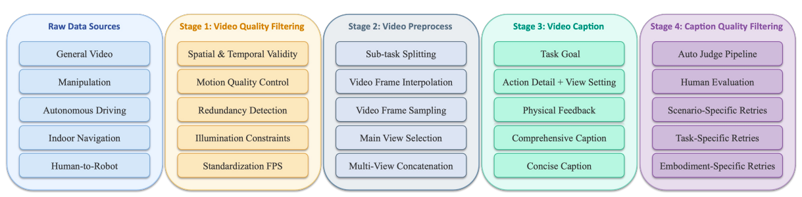

# Qwen-RobotWorld — Bộ dữ liệu

## 1. Tri thức thế giới hiện thân (EWK)

EWK gồm khoảng **8,6M cặp video-văn bản**, hơn **200M frame quan sát**:

| Thành phần | Quy mô/thông tin |
| ----------------------- | -------------------------------------------------------------------------------- |
| Video/hình ảnh tổng quát | 30% tổng corpus |
| Dữ liệu hiện thân | 70% tổng corpus |
| Thao tác | khoảng 5,9M sample; hơn 20 hình thái robot; hơn 1.300 kỹ năng |
| Lái xe | khoảng 200K sample trong phần tóm tắt; hỗn hợp tuyển chọn đầy đủ gồm khoảng 1.744.405 clip/2.405 giờ |
| Điều hướng trong nhà | 6.064 episode; 134 cảnh trong nhà; khoảng 49,8 km |
| Chuyển giao từ người sang robot | Pipeline MANO-to-robot; 14 hình thái robot |
| Đa góc nhìn | khoảng 1,6M sample hiện thân; 2–4 góc nhìn được đồng bộ |


## 2. Ánh xạ ngôn ngữ hành động

Các tín hiệu hành động khác nhau như góc khớp, waypoint, góc lái, hướng di chuyển và chuyển động bàn tay được chuyển thành hành động bằng ngôn ngữ tự nhiên. Mô hình học:

```text
Trạng thái thị giác s_t + hành động bằng ngôn ngữ a_t
                       ↓
                dự đoán s_(t+1)
```

Độ bao phủ gồm hơn 20 embodiment và hơn 500 loại hành động: thao tác nguyên tử, tổ hợp dài hạn, vận động/điều hướng và tương tác động/với vật thể biến dạng.

## 3. Năm lớp chú thích

1. **Mục tiêu nhiệm vụ:** mục tiêu và sự chuyển đổi trạng thái mong muốn.
2. **Chi tiết hành động:** quỹ đạo, hành động vi mô, tốc độ, lực, góc nhìn.
3. **Phản hồi vật lý:** sự dịch chuyển, biến dạng, thay đổi trạng thái tiếp xúc.
4. **Chú thích đầy đủ:** 50–100 từ.
5. **Chú thích ngắn gọn:** 15–30 từ.

Hai loại caption được lấy mẫu với xác suất bằng nhau 50/50 trong quá trình huấn luyện.

## 4. Miền dữ liệu

| Miền | Nguồn/vai trò |
| ------------------ | --------------------------------------------------------------------------------------------------------------------------- |
| Thao tác | EgoHOD, EPIC-Kitchens, Bridge V2, RH20T, DROID, RoboMIND, RoboCoin, Agibot-World, Galaxea, ActionNet, OpenLoong, Robotwin… |
| Lái xe tự động | Waymo E2E, NVIDIA PhysicalAI-AD, Bench2Drive, Sekai |
| Điều hướng trong nhà | VLNVerse, Isaac Sim, 134 cảnh |
| Người sang robot | Video lấy con người làm trung tâm → tái dựng MANO → retarget sang robot/chỉnh sửa video |
| Dữ liệu tổng quát | Hình ảnh/video trên Internet, đa độ phân giải, không có AIGC theo bài báo |

## 5. Lọc chất lượng

LLM judge kiểm tra độ chính xác thực tế, tính cụ thể, độ rõ ràng của chỉ dẫn và tính nhất quán của góc nhìn. Caption gần ngưỡng hoặc thuộc miền ít được đại diện sẽ được con người duyệt; prompt được tinh chỉnh theo kịch bản/nhiệm vụ/embodiment rồi chú thích lại.

## 6. Metric của dataset — các chỉ số mô tả dữ liệu

Các chỉ số dưới đây mô tả **quy mô và độ bao phủ của dataset**, không phải điểm của mô hình:

| Metric của dataset | Giá trị được báo cáo | Ý nghĩa |
| ------------------------------- | ----------------------------------: | ------------------------------------------------------------------------- |
| Cặp video-văn bản | khoảng 8,6M | Số cặp video và phần mô tả/văn bản hành động trong EWK |
| Frame quan sát | hơn 200M | Số frame quan sát dùng để học động lực học thị giác |
| Tỷ lệ dữ liệu hiện thân/tổng quát | khoảng 70% / 30% | Tỷ lệ dữ liệu hiện thân so với dữ liệu thế giới tổng quát |
| Độ bao phủ embodiment | hơn 20 loại | Độ đa dạng hình thái: bàn tay người, bộ kẹp, robot hai tay, humanoid… |
| Độ bao phủ hành động | hơn 500 loại | Số nhóm hành động/thao tác/điều hướng/tương tác |
| Sample thao tác | khoảng 5,9M | Quy mô dữ liệu thao tác của robot và con người |
| Tập dữ liệu lái xe | 1.744.405 clip, khoảng 2.405 giờ | Quy mô tập lái xe thô/đã xử lý được bài báo công bố |
| Điều hướng trong nhà | 6.064 episode, 134 cảnh | Độ bao phủ cảnh và trajectory điều hướng |
| Chuyển giao từ người sang robot | khoảng 80K episode | Dữ liệu retargeting MANO và render robot |
| Dữ liệu hiện thân đa góc nhìn | khoảng 1,6M sample | Dữ liệu từ các góc nhìn chính/cổ tay/bên ngoài được đồng bộ |
| Hình thái robot trong chuyển giao | 14 loại | Số mô hình robot được render/retarget từ chuyển động người |
| Các lớp caption | 5 lớp | Mục tiêu, chi tiết hành động, phản hồi vật lý, caption đầy đủ và ngắn gọn |
| Lấy mẫu caption | 50% / 50% | Caption đầy đủ và caption ngắn gọn |

Các metric này trả lời câu hỏi **“dataset lớn và đa dạng đến mức nào?”**. Chúng không trực tiếp cho biết mô hình dự đoán tốt đến đâu; điều đó được đo bằng các metric benchmark trong `evaluation.md`.



## 6. Chi tiết cấu trúc dữ liệu EWK

### 6.1. Quy mô và cách đọc các con số

EWK có khoảng **8,6M cặp video-văn bản** và hơn **200M frame quan sát**, trong đó khoảng **70% là dữ liệu hiện thân** và **30% là dữ liệu tổng quát**. Dữ liệu bao phủ hơn **20 loại embodiment** và hơn **500 loại hành động**.

Bài báo dùng một số cách thống kê khác nhau giữa phần tổng quan và phần chi tiết:

| Cách thống kê | Quy mô được báo cáo |
| -------------------------------------- | ----------------------------------: |
| Toàn bộ EWK | khoảng 8,6M cặp video-văn bản |
| Phần dữ liệu hiện thân | khoảng 6M cặp |
| Thao tác | khoảng 5,9M sample |
| Lái xe/điều hướng trong hỗn hợp cuối | khoảng 200K sample |
| Tập lái xe thô/đã xử lý | 1.744.405 clip, khoảng 2.405 giờ |

Các con số này không nhất thiết mâu thuẫn: clip thô, clip đã xử lý, sample huấn luyện và hỗn hợp lấy mẫu cuối có thể dùng những đơn vị khác nhau. Một clip có thể được cắt, ghép, chú thích hoặc lấy mẫu thành nhiều dạng. Bài báo chưa giải thích hoàn toàn cách đối chiếu mọi con số, vì vậy khi trình bày nên nói “quy mô được báo cáo” thay vì cộng tất cả thành một tổng mới.

### 6.2. Dữ liệu thế giới tổng quát

Dữ liệu thế giới tổng quát được thu thập từ video trên 14 nền tảng, cảnh tự nhiên, đời sống hằng ngày, thể thao, hình ảnh chất lượng cao, nhiếp ảnh và hình ảnh thương mại điện tử. Video được chuẩn hóa ở 24 FPS và hỗ trợ nhiều tỷ lệ khung hình như 1:1, 2:3, 3:2, 3:4, 4:3, 9:16 và 16:9.

Dữ liệu hình ảnh đóng vai trò mốc chất lượng thị giác, giúp mô hình học:

- hình thái vật thể;
- texture và vật liệu;
- bố cục;
- diện mạo sắc nét.

Caption được sinh bằng Qwen2.5-VL. Bài báo mô tả việc loại hình ảnh/video AIGC khỏi dữ liệu tổng quát vì lo ngại artifact, sự thiếu nhất quán vật lý và bias từ dữ liệu tổng hợp.

### 6.3. Dữ liệu thao tác

Dữ liệu thao tác là phần lớn nhất của corpus hiện thân và gồm nhiều nguồn:

| Loại | Nguồn tiêu biểu | Kiến thức đóng góp |
| ---------------------------- | ----------------------------------------------------------------------------------- | ------------------------------------------------------------------------------ |
| Thao tác của con người | EgoHOD, EPIC-Kitchens, Egocentric-10k | Phối hợp tay-mắt, sử dụng công cụ, sự khéo léo và affordance hằng ngày |
| Robot một tay | Bridge V2, RH20T, DROID | Nắm, đẩy, lắp, gắp-và-đặt và vật lý tiếp xúc |
| Đa robot/đa hình thái | RoboMIND, RoboCoin, AgiBot-World, Galaxea, Qwen-Aloha, Fourier ActionNet, OpenLoong | Một tay, hai tay, bàn tay khéo léo, humanoid và nhiệm vụ dài hạn |
| Mô phỏng | InternData-A1, RoboTwin, GR00T-XE, dữ liệu liên quan đến RT-1 | Tương tác với vật thể biến dạng/chất lỏng, biến thiên có thể kiểm soát và mức độ quen thuộc với trình mô phỏng |

Dữ liệu thao tác được tổ chức theo bốn trục:

1. **Đa embodiment:** cùng một nhiệm vụ như “nhấc chiếc cốc lên” có thể do bàn tay người, bộ kẹp hai ngón, bàn tay khéo léo, robot hai tay hoặc humanoid thực hiện. Mô hình học ngữ nghĩa nhiệm vụ thay vì ghi nhớ một vector khớp cụ thể.
2. **Đa nhiệm vụ:** gồm hành động nguyên tử, nhiệm vụ ngắn hạn, tổ hợp dài hạn, tương tác động, vật thể lỏng/biến dạng và phối hợp hai tay.
3. **Đa kịch bản:** nhà bếp, xưởng, phòng thí nghiệm, không gian làm việc ngoài trời, nhà máy, cảnh thật và cảnh mô phỏng để giảm overfit vào phông nền, ánh sáng, camera hoặc trình mô phỏng.
4. **Đa góc nhìn:** góc nhìn egocentric/đầu, camera cổ tay, camera bên ngoài và các góc nhìn ghép nối được đồng bộ. Camera chính hỗ trợ lập kế hoạch; camera cổ tay hỗ trợ tiếp xúc, nắm và thao tác tinh.

### 6.4. Dữ liệu lái xe

| Dataset | Loại | Quy mô được báo cáo |
| -------------------- | ----------------------- | ----------------------------: |
| Waymo E2E | Lái xe thực tế, 8 camera | 7.044 clip, 11,3 giờ |
| NVIDIA PhysicalAI-AD | Lái xe thực tế, 5 camera | 1.342.418 clip, 1.715,9 giờ |
| Bench2Drive | CARLA, 6 camera | 384.948 clip, 511,2 giờ |
| Sekai | Người đi bộ/drone | 9.995 clip, 166,6 giờ |

Tổng tập dữ liệu lái xe được báo cáo là **1.744.405 clip**, khoảng **2.405 giờ**. Pipeline xử lý:

```text
Chuỗi lái xe thô
        ↓
Trích xuất frame
        ↓
Trajectory → biểu diễn waypoint thống nhất
        ↓
Phân đoạn theo chuyển tiếp thao tác lái
        ↓
Clip dài 2–8 giây
        ↓
Caption trajectory có cấu trúc
```

Dữ liệu lái xe cung cấp chuyển động của chủ thể, chuyển động đa tác nhân, thị sai, thay đổi phối cảnh, hình học 3D ở quy mô cảnh, gia tốc, chuyển làn và rẽ.

### 6.5. Dữ liệu điều hướng trong nhà

Dữ liệu điều hướng được xây dựng trong NVIDIA Isaac Sim từ VLNVerse:

- 6.064 episode thành công;
- 134 cảnh trong nhà;
- RGB 256×256;
- 10 frame/giây;
- trajectory trung bình 8,2 m, khoảng 4–17,5 m;
- tổng quãng đường khoảng 49,8 km;
- khoảng 5,8 giờ video.

Có hai dạng chỉ dẫn:

- 3.031 chỉ dẫn từng bước, trung bình 67,2 từ;
- 3.033 chỉ dẫn với nhiều ngữ vực: trang trọng, tự nhiên và thông tục.

Nhóm này dạy hình học ở quy mô phòng, chuyển động tránh chướng ngại vật, tính nhất quán không gian dài hạn và grounding ngôn ngữ vào trajectory liên tục.

### 6.6. Chuyển giao từ người sang robot

Pipeline chính chuyển video tay người thành video robot:

```text
Video egocentric hai tay của con người
        ↓
Tái dựng MANO
        ↓
Keypoint bàn tay 3D
        ↓
Retarget sang trajectory end effector của robot
        ↓
Loại bàn tay người bằng video inpainting
        ↓
Render 14 mô hình robot bằng MuJoCo IK
        ↓
Các luồng video người/cảnh/robot được căn chỉnh
```

Bốn luồng được tạo gồm video người gốc, cảnh đã loại bàn tay, mô phỏng thuần túy và cảnh chồng robot. Ngoài ra, các cặp render từ Isaac Sim và MuJoCo giúp mô hình học cách chuyển từ bản render robot đơn giản sang diện mạo robot chân thực.

Phần này có khoảng **80K episode**, gồm Franka Panda, AgileX Split Aloha, ARX Lift2, AgiBot Genie1, robot một tay, hai tay, hai tay di động và humanoid.

### 6.7. Ánh xạ ngôn ngữ hành động

Các miền có action space khác nhau:

| Miền | Hành động gốc |
| ------------ | ----------------------------------- |
| Thao tác | Góc khớp, waypoint end effector |
| Lái xe | Góc lái, ga, quỹ đạo |
| Điều hướng | Hướng di chuyển, waypoint, lệnh rẽ |

Qwen-RobotWorld ánh xạ chúng thành hành động bằng ngôn ngữ tự nhiên. Ví dụ:

```text
End effector đi từ (x1,y1,z1) đến (x2,y2,z2), bộ kẹp đóng
        ↓
“Di chuyển bộ kẹp về phía chiếc cốc màu đỏ, khép nó quanh chiếc cốc
và nâng thẳng đứng.”
```

Ưu điểm là một giao diện dùng cho nhiều embodiment và miền. Hạn chế là ngôn ngữ là biểu diễn mất mát: không giữ chính xác lực, mô-men xoắn, proprioception hoặc điều khiển cấp động cơ, nên không đủ để điều khiển robot trực tiếp.

### 6.8. Chú thích phân cấp và pipeline xử lý dữ liệu

Mỗi video được chú thích theo năm lớp:

1. **Mục tiêu nhiệm vụ:** trạng thái nào cần thay đổi từ đầu đến cuối.
2. **Chi tiết hành động:** trajectory, hướng, hành động vi mô, tốc độ, lực và góc nhìn.
3. **Phản hồi vật lý:** sự dịch chuyển vật thể, thay đổi tiếp xúc, biến dạng, chuyển động chất lỏng hoặc gấp vải.
4. **Caption đầy đủ:** 50–100 từ, gồm góc nhìn, tác nhân, hành động và phản hồi vật lý.
5. **Caption ngắn gọn:** 15–30 từ, gần với chỉ dẫn khi inference.

Caption đầy đủ và ngắn gọn được lấy mẫu theo tỷ lệ 50/50 để mô hình hiểu cả mô tả hành động chi tiết và lệnh tự nhiên ngắn gọn.

Pipeline xử lý:

```text
Thu thập dữ liệu thô
        ↓
Tiền xử lý video
        ↓
Chú thích phân cấp
        ↓
Lọc chất lượng caption
        ↺ sample không đạt → chú thích lại
```

Tiền xử lý video gồm trích xuất frame, nội suy frame, chia nhiệm vụ con, chọn góc nhìn chính và ghép nhiều góc nhìn. Phép chia theo nhiệm vụ phải giữ trọn chuyển tiếp như `tiếp cận → tiếp xúc → thao tác → kết quả`, tránh cắt clip sau khi nắm hoặc trước khi đặt khiến mô hình không học được quan hệ nhân quả.

Quá trình lọc chất lượng dùng LLM judge và đánh giá của con người, kiểm tra độ chính xác thực tế, tính cụ thể, độ rõ ràng của chỉ dẫn và tính nhất quán của góc nhìn. Caption lỗi được thử lại bằng prompt theo kịch bản, nhiệm vụ và embodiment.
