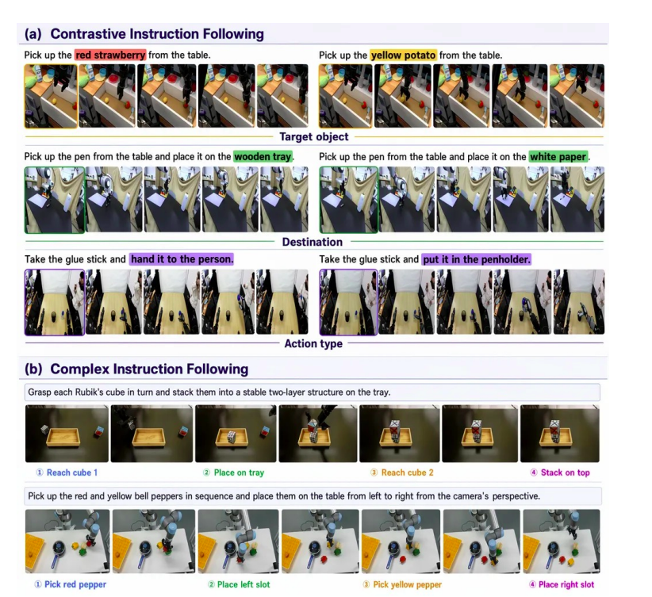
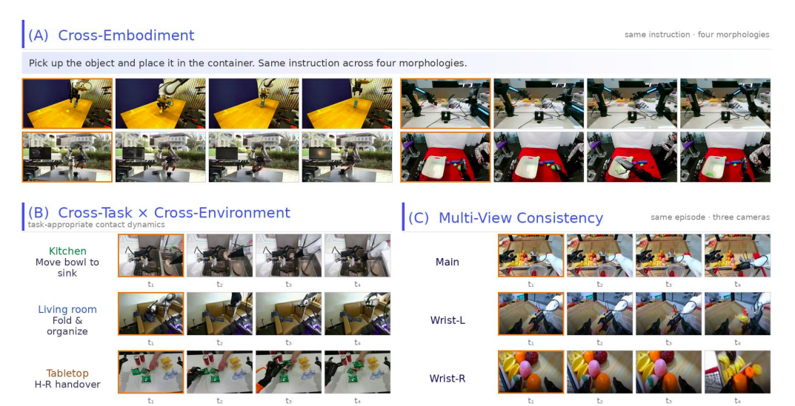
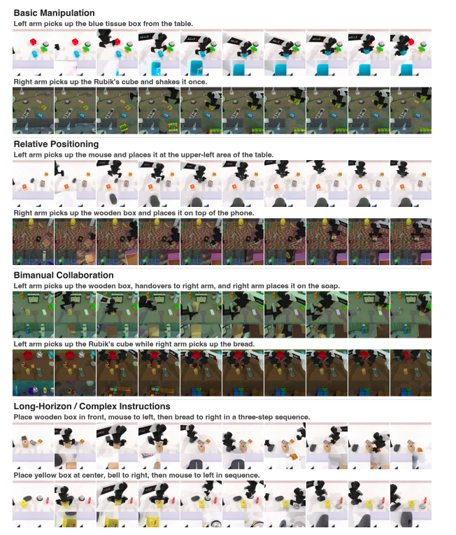
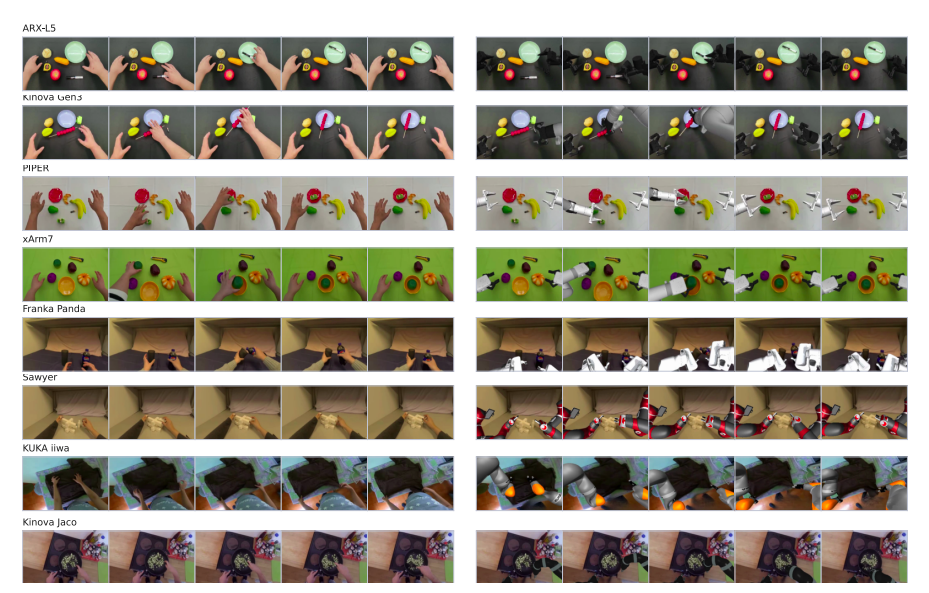
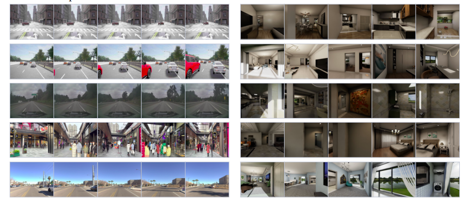

# Qwen-RobotWorld — Đánh giá

## 1. Các benchmark đo gì?

| Benchmark | Đo lường | Kết quả Qwen-RobotWorld |
|---|---|---:|
| EWMBench | Scene consistency, motion correctness, semantic alignment | Overall 4.60, hạng 1 |
| DreamGen Bench | Instruction following và physics alignment trên GR1 Env/Object/Behavior | Total 4.952, hạng 1 |
| PBench | Domain physical understanding + video quality | Overall 0.804, tốt nhất open-source |
| WorldModelBench | Instruction following, common sense, physics adherence | Total 8.99, hạng 3 overall |
| RoboTwin-IF | Zero-shot instruction following trên task manipulation mới | Qualitative/zero-shot evidence |

## 2. EWMBench

EWMBench có 21 samples, 7 tasks, action-ordering constraints. Nhóm metric:

- **SceneC:** tính nhất quán của cảnh.
- **HSD, Dyn, nDTW:** độ trung thực/chính xác của chuyển động.
- **Diversity, BLEU, CLIP, Logics:** semantic alignment và action-logic consistency.

Qwen-RobotWorld đạt 4.60, cao hơn LVP 4.05; HSD 0.566, SceneC 0.914 và Logics 1.00.



## 3. DreamGen Bench

Đánh giá ba subset GR1:

- GR1-Env: khái quát hóa môi trường;
- GR1-Object: khái quát hóa cấu trúc đối tượng;
- GR1-Behavior: khái quát hóa hành vi/chân trời dài.

Mỗi subset đo physics alignment (PA) và instruction following (IF). Tổng Qwen-RobotWorld là 4.952. Điểm GR1-Object IF là 0.878; GR1-Behavior IF là 0.832, vẫn thấp hơn một số baseline.



## 4. PBench

PBench kết hợp:

```text
Domain Score: physical behavior QA
       +
Quality Score: VBench video metrics
       ↓
Overall Score
```

Domain gồm AV, Robot, Industry, Physics, Human và Common Sense. Qwen đạt Domain 0.857, Quality 0.751 và Overall 0.804. Motion smoothness 0.990; pixel/aesthetic metrics thấp hơn general video models do output resolution thấp hơn.

## 5. WorldModelBench

Đánh giá 350 instances, 7 domains, 56 subdomains:

- instruction following trên thang 0–3;
- common sense: frame và temporal quality;
- physics adherence: Newton, mass conservation, fluid, penetration và gravity.

Qwen đạt instruction following 2.33/3.0, physics adherence 1.00 ở các nhóm báo cáo, overall 8.99; đứng thứ 3 overall và tốt nhất trong open-source models.

## 6. Định tính/khái quát hóa

- Fine-grained language grounding: đổi keyword target/action/destination làm output thay đổi tương ứng.
- Cross-embodiment: một instruction cho nhiều morphology.
- Liên nhiệm/liên môi trường: lấy đồ, lấy bát, gấp vải, bàn giao.
- Tính nhất quán của nhiều góc nhìn: chính, cổ tay trái, cổ tay phải.
- Chuyển giao từ người sang robot.
- Autonomous driving và indoor navigation.
- RoboTwin-IF zero-shot trên task mới.






## 10. Benchmark metrics — các chỉ số đánh giá model

| Benchmark metric | Benchmark | Đo lường |
|---|---|---|
| SceneC | EWMBench | Scene, object identity và visual appearance có nhất quán qua video không |
| HSD | EWMBench | Motion/trajectory fidelity của embodied action |
| Dyn | EWMBench | Mức độ đúng của dynamics |
| nDTW | EWMBench | Độ tương đồng trajectory với reference sau khi căn chỉnh thời gian |
| Diversity | EWMBench | Độ đa dạng giữa các output |
| BLEU | EWMBench | Tương đồng n-gram giữa caption/output và reference |
| CLIP | EWMBench | Tương đồng semantic giữa video/image và prompt |
| Logics | EWMBench | Action ordering và action-logic consistency |
| PA — Physics Alignment | DreamGen Bench | Mức độ output phù hợp với physical behavior |
| IF — Instruction Following | DreamGen Bench | Mức độ video thực hiện đúng language instruction |
| Domain Score | PBench | Physical-behavior QA trên AV, robotics, industry, physics, human và common sense |
| Quality Score | PBench | Video quality như smoothness, temporal consistency và visual quality |
| Overall Score | PBench/WorldModelBench | Điểm tổng hợp theo protocol của benchmark |
| Instruction Following | WorldModelBench | Điểm làm đúng instruction, thang 0–3 trong protocol báo cáo |
| Common Sense | WorldModelBench | Frame quality và temporal quality theo physical/common-sense judgment |
| Physics Adherence | WorldModelBench | Tuân thủ Newton, gravity, fluid, mass conservation và penetration criteria |
| Zero-shot transfer | RoboTwin-IF | Khả năng xử lý task/instruction mới chưa được fine-tune trực tiếp |

Các benchmark metrics trả lời câu hỏi **“model sinh trajectory tốt đến mức nào?”**. Không nên dùng dataset metric như 8.6M pairs để kết luận model đạt chất lượng cao, cũng không nên dùng một benchmark score như Overall 4.60 để suy ra dataset có bao nhiêu sample.

## 11. So sánh với các model khác trong paper

Các bảng dưới đây bổ sung score của các baseline được paper dùng. `General` là general video generator; `Embodied` là embodied world model. Tên `Ours` trong paper tương ứng với Qwen-RobotWorld.

### Overall score trên các benchmark

| Người mẫu | EWBench Tổng thể | Tổng số DreamGen | PBench Tổng thể | WorldModelBench Tổng cộng |
|---|---:|---:|---:|---:|
| Veo3 | 3,49 | — | 0,827 | 9:25 |
| Wan2.6 | 3,22 | — | 0,778 | 9,27 |
| Kling26 | 3,85 | — | 0,821 | 8,55 |
| LTX-2 | 3.01 | — | 0,796 | 7,61 |
| Sora2 | 3,89 | — | 0,805 | 8,93 |
| Vũ trụ | 3,29 | 4.129 | 0,802 | 8,94 |
| GigaWorld | 3,56 | 4.216 | 0,794 | 7.31 |
| LVP | 4.05 | 4.758 | 0,792 | 8,67 |
| Vidar | 3h30 | 3.341 | 0,768 | 7.01 |
| Ôi | 3,52 | 4.728 | 0,774 | 7,91 |
| **Qwen-RobotWorld** | **4,60** | **4.952** | **0,804** | **8,99** |

Score DreamGen và WorldModelBench trong bảng trên là hai cột độc lập; score chi tiết DreamGen được trình bày ở bảng tiếp theo.

### DreamGen Bench — PA/IF đầy đủ

| Người mẫu | GR1-Env PA | GR1-Env IF | GR1-Đối tượng PA | GR1-Đối tượng NẾU | GR1-Hành vi PA | GR1-Hành vi IF | Tổng cộng |
|---|---:|---:|---:|---:|---:|---:|---:|
| Cosmos-sft | 0,709 | 0,655 | 0,775 | 0,720 | 0,649 | 0,621 | 4.129 |
| LVP | 0,810 | 0,772 | 0,745 | 0,829 | 0,713 | 0,889 | 4.758 |
| Vidar | 0,445 | 0,647 | 0,478 | 0,726 | 0,394 | 0,651 | 3.341 |
| GigaWorld | 0,621 | 0,933 | 0,500 | 0,852 | 0,426 | 0,884 | 4.216 |
| Ôi | 0,793 | 0,826 | 0,755 | 0,849 | 0,809 | 0,696 | 4.728 |
| **Qwen-RobotWorld** | **0,828** | **0,793** | **0,840** | **0,878** | **0,781** | **0,832** | **4.952** |

### EWMBench — metric đầy đủ của các model

| Người mẫu | CảnhC | HSD | Dyn | nDTW | Đa dạng | BLEU | CLIP | Logic | Nhìn chung |
|---|---:|---:|---:|---:|---:|---:|---:|---:|---:|
| Veo3 | .8415 | .2130 | .1932 | .1613 | .0221 | .2139 | .8965 | .9474 | 3,49 |
| Wan2.6 | .6712 | .2034 | .0900 | .1715 | .0502 | .1616 | .8743 | 1,0000 | 3,22 |
| Kling26 | .8211 | .3272 | .1822 | .3423 | .0173 | .2591 | .9014 | 1,0000 | 3,85 |
| LTX-2 | .7850 | .2076 | .1283 | .2443 | .0120 | .1425 | .8869 | .5000 | 3.01 |
| Sora2 | .8526 | .2807 | .3494 | .2754 | .0314 | .2466 | .9100 | .9474 | 3,89 |
| Vũ trụ | .7963 | .2500 | .2052 | .2533 | .0803 | .1230 | .8458 | .7333 | 3,29 |
| GigaWorld | .8707 | .3050 | .0849 | .2783 | .0278 | .2048 | .8873 | .9000 | 3,56 |
| LVP | .8795 | .4248 | .0433 | .6226 | .0093 | .2179 | .8995 | .9524 | 4.05 |
| Vidar | .7341 | .1877 | .1520 | .1769 | .0653 | .1607 | .8821 | .9411 | 3h30 |
| Ôi | .8866 | .2494 | .0529 | .2566 | .0266 | .1932 | .9001 | .9524 | 3,52 |
| **Qwen-RobotWorld** | **.9142** | **.5660** | **.3429** | **.6708** | **.0114** | **.2079** | **.8834** | **1,0000** | **4,60** |

### Cách diễn giải bảng so sánh

Qwen-RobotWorld không đứng đầu mọi metric riêng lẻ. Điểm nổi bật là đứng đầu EWMBench overall, có SceneC/HSD/nDTW/Logics mạnh và đứng đầu DreamGen overall. Trên WorldModelBench, model đạt 8.99, đứng thứ ba overall nhưng tốt nhất trong nhóm open-source. Trên PBench, model đạt 0.804, tốt nhất trong nhóm open-source; Domain Score 0.857 và Motion smoothness 0.990 là hai điểm mạnh.

Do các benchmark có thang điểm và protocol khác nhau, không được cộng hoặc xếp hạng trực tiếp score giữa EWMBench, DreamGen, PBench và WorldModelBench. Các score baseline là kết quả do paper báo cáo trong cùng evaluation setup, không phải independent reproduction.


## 7. Chi tiết protocol và cách đọc kết quả

### 7.1 Nhóm baseline

Paper so sánh Qwen-RobotWorld với hai nhóm:

| Nhóm | Baseline tiêu biểu |
|---|---|
| Trình tạo video chung | Sora2, Veo3, Wan2.6, Kling, LTX-2 |
| Người mẫu thế giới hiện thân | Cosmos, WoW, LVP, Vidar, GigaWorld |

Các benchmark chủ yếu đánh giá generated video sau khi đưa vào model một initial observation và language instruction. Vì vậy score phản ánh chất lượng world-model generation trong protocol cụ thể, không phải trực tiếp là robot control success.

### 7.2 EWMBench chi tiết

EWMBench gồm 21 samples, 7 tasks và có action-ordering constraints. Các metric được chia thành ba nhóm:

| Nhóm | Metric | Ý nghĩa |
|---|---|---|
| Scene consistency | SceneC | Cảnh, object identity và visual appearance có ổn định qua video không |
| Motion correctness | HSD | Độ trung thực của motion/trajectory liên quan đến embodied action |
| Motion correctness | Dyn | Mức độ đúng của dynamics |
| Motion correctness | nDTW | Normalized Dynamic Time Warping, so sánh trajectory với reference và cho phép lệch temporal |
| Semantics | Diversity | Độ đa dạng của output |
| Semantics | BLEU | Mức tương đồng n-gram với caption/reference |
| Semantics | CLIP | Tương đồng giữa hình ảnh và semantic prompt |
| Semantics | Logics | Action-ordering và action-logic consistency |

| Số liệu | Qwen-RobotWorld |
|---|---:|
| CảnhC | 0,9142 |
| HSD | 0,5660 |
| Dyn | 0,3429 |
| nDTW | 0,6708 |
| Đa dạng | 0,0114 |
| BLEU | 0,2079 |
| CLIP | 0,8834 |
| Logic | 1,0000 |
| Nhìn chung | 4,60 |

Qwen-RobotWorld đứng đầu overall. Điểm mạnh rõ nhất là scene consistency, motion fidelity, nDTW và action logic; HSD cao hơn LVP khoảng 33%. Tuy nhiên model không đứng đầu mọi semantic metric: BLEU và Diversity không nhất thiết cao nhất. Vì vậy kết luận chính là model mạnh ở structural/motion consistency hơn là tối ưu đồng thời mọi tiêu chí text similarity và visual diversity.

### 7.3 DreamGen Bench chi tiết

DreamGen Bench đánh giá ba loại generalization trên GR1 embodiment:

| Subset | Đánh giá |
|---|---|
| GR1-Env | Khái quát hóa môi trường |
| Đối tượng GR1 | Khái quát hóa thành phần đối tượng |
| GR1-Behavior | Behavior và long-horizon generalization |

Hai metric chính:

- **PA — Physics Alignment:** output có phù hợp với physical behavior không.
- **IF — Instruction Following:** video có thực hiện đúng instruction không.

| Tập hợp con | PA | NẾU |
|---|---:|---:|
| GR1-Env | 0,828 | 0,793 |
| Đối tượng GR1 | 0,840 | 0,878 |
| GR1-Hành vi | 0,781 | 0,832 |
| Tổng cộng | 4.952 | — |

Model mạnh ở object compositional generalization và physics alignment khá ổn định. GR1-Behavior IF chỉ đạt 0.832, thấp hơn một số baseline, cho thấy behavior phức tạp và long-horizon vẫn là điểm khó. IF được chấm bằng Qwen2.5-VL, cũng là thành phần được dùng trong hệ thống, nên cần lưu ý khả năng evaluator-family bias; paper không chứng minh bias này nhưng đây là một caveat cần nêu.

### 7.4 WorldModelBench chi tiết

WorldModelBench gồm 350 instances, 7 domains và 56 subdomains. Nó đánh giá:

- instruction following trên thang 0–3;
- common sense qua frame quality và temporal quality;
- physics adherence qua Newtonian law, mass conservation, fluid dynamics, object penetration và gravity.

Kết quả:

- Hướng dẫn sau: 2.33/3.0.
- Physics adherence: 1.00 ở các nhóm được báo cáo.
- Tổng điểm: 8,99.
- Hạng 3 overall và đứng đầu trong nhóm open-source.

“Perfect” physics adherence trong một benchmark không đồng nghĩa với một physics simulator chính xác. Protocol chủ yếu dùng generated video, VLM-based judgment, finite prompt set và tiêu chí vật lý ở mức coarse. Nó chưa trực tiếp đo exact force, torque, continuous conservation error, contact impulse hoặc stable rollout hàng trăm bước.

### 7.5 PBench chi tiết

PBench tách thành hai điểm:

```text
Domain Score: physical-behavior QA
        +
Quality Score: video-quality metrics
        ↓
Overall Score
```

Domain gồm autonomous vehicles, robotics, industry, physics, humans và common sense. Quality sử dụng VBench-style metrics như motion smoothness, temporal consistency và visual quality.

Kết quả:

- Tổng điểm: 0,804.
- Độ hiểu miền: 0.857.
- Điểm chất lượng: 0,751.
- Độ mượt chuyển động: 0,990.
- Tốt nhất trong nhóm open-source theo báo cáo.

PBench không chỉ đo robot manipulation; nó đánh giá broader physical behavior và video quality. Pixel/aesthetic metrics thấp hơn một số general video model có thể liên quan đến output resolution và mục tiêu embodied generation.

### 7.6 RoboTwin-IF và qualitative generalization

RoboTwin-IF kiểm tra complex unseen instruction, synchronized multi-view generation và zero-shot transfer. Paper mô tả chủ yếu bằng qualitative comparison, vì vậy không nên đặt ngang mức bằng chứng định lượng với EWMBench, DreamGen, PBench hoặc WorldModelBench nếu không có bảng score tương ứng.

Các phân tích qualitative gồm:

- fine-grained language grounding: đổi target, action hoặc destination làm output thay đổi tương ứng;
- cross-embodiment: một instruction trên nhiều robot morphology;
- cross-task/cross-environment: pick-place, bowl retrieval, cloth folding và handover;
- multi-view consistency giữa main và wrist view;
- chuyển từ người sang robot;
- autonomous driving và indoor navigation.

## 8. Benchmark có chứng minh closed-loop world modeling không?

Chưa hoàn toàn. Các protocol hiện tại chủ yếu là:

```text
Initial observation + instruction
              ↓
       Generated video clip
              ↓
       Video metric / VLM judge
```

Một world model dùng cho policy evaluation cần thêm closed-loop rollout:

```text
state₀ → action₀ → predicted state₁
       → action₁ → predicted state₂
       → action₂ → ...
```

Các câu hỏi còn mở gồm:

- error có tích lũy qua nhiều bước không;
- model phản ứng thế nào với action ngoài training distribution;
- generated state có ổn định để làm input cho bước tiếp theo không;
- có hỗ trợ interactive replanning không;
- policy ranking trong model có tương quan với real-world success không;
- latency có đủ cho online control không.

Vì vậy, paper chứng minh mạnh hơn cho **action-conditioned video generation** so với **fully interactive closed-loop simulator**.

## 9. Novelty nên trình bày như thế nào?

Không nên nói Qwen-RobotWorld phát minh ra một Transformer architecture hoàn toàn mới. Các primitive như Qwen2.5-VL, Wan-VAE, MMDiT, flow matching, RoPE, 3D RoPE, patchify/unpatchify, first-frame conditioning, Megatron-LM và activation recomputation đều kế thừa hoặc đã tồn tại.

Novelty chính xác hơn nằm ở system composition và data/training formulation:

- unified natural-language action interface cho manipulation, driving, navigation và human-to-robot transfer;
- EWK dataset với general + embodied, multi-embodiment, multi-task, multi-scenario và multi-view;
- chú thích nhận biết quan điểm/hành động/phản hồi vật lý năm lớp;
- human-to-robot paired pipeline với MANO retargeting, inpainting và multi-render supervision;
- progressive general-to-embodied curriculum với bốn phase SFT;
- T2I dùng làm morphology anchor cho video generation;
- Scene2Robot với multi-segment conditioning và condition masking.

Điểm cần giữ khi kết luận: Qwen-RobotWorld học **implicit statistical physics** từ video-action data; nó không học physics bằng explicit equations và không được xem là symbolic physics simulator hay low-level robot controller.
