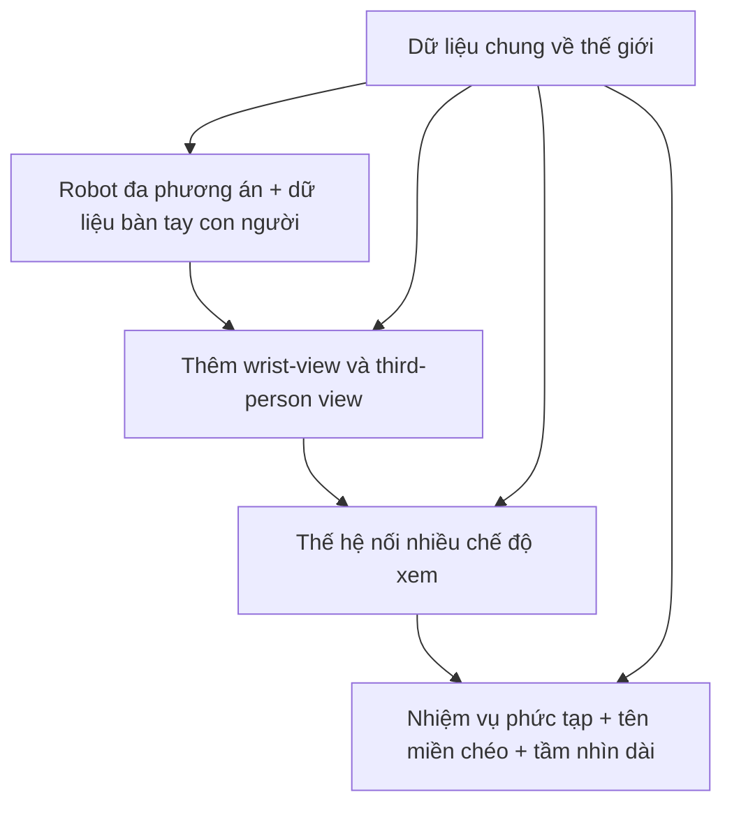

# Qwen-RobotWorld — Các giai đoạn huấn luyện

## 1. Chiến lược huấn luyện

Paper công bố hai stage chính:

```text
General world foundation pretraining
                 ↓
Embodied specialization SFT
```

Điểm đặc biệt là general data vẫn xuất hiện trong mọi batch ở SFT, nên model vừa học embodied physics vừa giữ general visual prior.

## 2. Giai đoạn 1 — Huấn luyện trước nền tảng chung

Mục tiêu là học appearance, geometry, object motion, lighting, collision dynamics và human manipulation priors.

```text
General images/videos + human hand videos
                    ↓
             T2I + T2V + TI2V joint training
                    ↓
          General visual/world foundation
```

- Hơn 200M real-world observation samples từ 14 video platforms.
- General data không dùng AIGC images/videos theo mô tả paper.
- T2I làm visual quality anchor cho object morphology.
- T2V học video dynamics.
- TI2V học continuation từ first-frame observation.
- Task ratio chuyển dần từ T2I sang joint T2I/T2V/TI2V.

## 3. Giai đoạn 2 - SFT chuyên biệt cho embodiment

Embodied data được đưa vào theo progressive four-phase schedule:



Trong phần thể hiện:

- khoảng 70% tổng SFT data là embodied, 30% general;
- manipulation khoảng 90% embodied sampling weight;
- multi-view concatenation khoảng 5%;
- navigation/driving khoảng 5%.

General data tiếp tục có mặt trong mọi batch.

## 4. Các công đoạn xử lý dữ liệu

```text
1. Raw collection
        ↓
2. Video preprocessing
        ↓
3. Hierarchical annotation
        ↓
4. Caption quality filtering
        ↺ re-annotation nếu không đạt
```

Video preprocessing gồm frame extraction, frame interpolation, sub-task splitting, main-view selection và multi-view concatenation.

## 5. Mục tiêu/cơ sở hạ tầng huấn luyện

- Flow matching trên VAE latent.
- Noise lấy từ standard normal.
- Dấu thời gian log-bình thường, thích ứng thay đổi theo độ dài video.
- TI2V first-frame timestep cố định ở 0.
- Megatron-LM với hybrid parallelism.
- Selective activation recomputation trên một phần double-stream blocks.

Paper không mô tả RL stage; không nên tự thêm RL vào pipeline chính của Qwen-RobotWorld.

## 6. Chi tiết về training procedure

### 6.1 Giai đoạn 1: luyện tập trước nền tảng thế giới chung

Stage 1 không chỉ học video robot. General-world data cung cấp các prior về appearance, lighting, object identity, generic motion, collision-like visual patterns, background và scene dynamics. Human manipulation video bổ sung grasping, tool use, object affordance, hand-object interaction và quan hệ nhân quả giữa action với outcome.

Ba task được huấn luyện chung là:

| Task | Input → output                      | Vai trò                                                     |
| ---- | ------------------------------------ | ------------------------------------------------------------ |
| T2I  | Text → image                        | Object morphology, texture, sharp appearance và composition |
| T2V  | Text → video                        | Temporal motion, dynamics và text-conditioned generation    |
| TI2V | Text + initial image → future video | Tiền thân gần nhất của world modeling                   |

Task mixture chuyển dần từ chủ yếu T2I ở đầu pretraining sang joint T2I/T2V/TI2V ở các giai đoạn sau. Paper không công bố tỷ lệ cụ thể theo step.

T2I đóng vai trò **morphology anchor** cho video generation. Nếu chỉ huấn luyện video, model có thể học motion nhưng gặp object deformation, robot-arm shape drift, object-identity drift hoặc texture không ổn định. Shared backbone cho phép visual prior từ T2I regularize task động T2V/TI2V.

### 6.2 Giai đoạn 2: SFT chuyên biệt cho embodiment

Tỷ lệ tổng thể được báo cáo là khoảng **70% embodied data và 30% general data**. Trong embodied sampling, manipulation chiếm khoảng 90%, multi-view concatenation khoảng 5% và navigation/driving khoảng 5%. Đây là approximate sampling weights, không nhất thiết là raw dataset proportions.

SFT có bốn phase nhỏ:

#### Giai đoạn 1 — Nền tảng một góc nhìn, đa phương án

Kết hợp human hand, single-arm robot, dual-arm robot và nhiều morphology trong main view. Mục tiêu là học basic robot appearance, manipulation và action semantics, đồng thời chuyển human action prior sang robot execution.

```text
Human action priors + robot execution examples
                    ↓
        Embodiment-invariant task semantics
```

#### Giai đoạn 2 — Mở rộng quan điểm

Dần thêm wrist-view, third-person external view và camera placement đa dạng. Main view hỗ trợ global context; wrist view hỗ trợ contact, grasp và fine manipulation. Mục tiêu là giảm phụ thuộc vào một camera hoặc một viewpoint.

#### Giai đoạn 3 - Tạo kết nối nhiều chế độ xem

Input và target có thể ghép nhiều camera theo chiều ngang:

```text
Initial: [main₀ | wrist₀]
Target:  [main₁...F | wrist₁...F]
```

Model phải sinh các view đồng thời, từ đó học object correspondence, synchronized motion, viewpoint-dependent appearance và consistent action outcome. Đây là thay đổi ở data representation và curriculum, không phải architectural modification.

#### Phase 4 — Complex tasks và cross-domain

Ở phase cuối, training bổ sung pouring, folding, bimanual coordination, multiple materials, deformable objects, long-horizon tasks, driving, navigation và human-to-robot editing. Các task khó được đưa vào sau khi model đã có visual foundation, basic motion, robot morphology và contact prior.

### 6.3 Dữ liệu được mix hay train lần lượt?

Câu trả lời là **cả hai nhưng ở hai cấp khác nhau**.

Ở cấp curriculum, trọng tâm thay đổi theo thứ tự:

```text
General foundation
        → basic embodied
        → more viewpoints
        → synchronized multi-view
        → complex/cross-domain
```

Ở cấp batch optimization, nhiều domain vẫn được trộn và cùng cập nhật một backbone:

```text
Batch 1: general T2V
Batch 2: single-view manipulation
Batch 3: T2I
Batch 4: human manipulation
Batch 5: robot manipulation
```

General data tiếp tục xuất hiện trong SFT để giảm catastrophic forgetting. Vì vậy pipeline không phải `train general → discard → train manipulation → discard`; chính xác hơn là sampling distribution được thay đổi dần nhưng vẫn giữ general/earlier data.

Paper không công bố batch assembly chính xác, batch ordering, task ratio theo từng step hoặc registry sampling rate.

### 6.4 Mục tiêu điều chỉnh luồng

Video (x) được encode thành clean latent:

```text
z₀ = E(x)
```

Mẫu nhiễu Gaussian:

```text
ε ~ N(0, I)
```

Tạo intermediate latent bằng linear interpolation:

```text
zₜ = (1 − t) z₀ + t ε
```

Vận tốc mục tiêu:

```text
v* = ε − z₀
```

MMDiT dự đoán:

```text
vθ(zₜ, t, h)
```

Phù hợp với dòng tổn thất:

```text
LFM = E[ ||vθ(zₜ, t, h) − v*||² ]
```

Ý nghĩa là model học vector field đưa noisy latent về data distribution, không dự đoán pixel trực tiếp và không nhất thiết sử dụng noise-prediction objective như DDPM. Timestep được sample từ log-normal distribution và có adaptive shifting theo video length.

Với TI2V, first-frame latent được đặt ở `t = 0` và loại khỏi denoising loss; các future-frame latent được noise và đưa vào loss. Nhờ đó first frame giữ vai trò visual anchor nhưng vẫn cung cấp context cho phần video tương lai.

### 6.5 Training infrastructure và giới hạn tái lập

Paper công bố sử dụng:

- Megatron-LM;
- song song lai;
- selective activation recomputation trên một phần Double-stream MMDiT blocks.

Hybrid parallelism có thể bao gồm data, tensor, pipeline và sequence/context parallelism, nhưng paper không nêu cấu hình cụ thể. Selective activation recomputation chỉ recompute một số block để cân bằng GPU memory và throughput:

```text
More recomputation → lower memory, slower training
Less recomputation → higher memory, faster training
```

Các thông tin chưa được công bố đầy đủ gồm optimizer, learning rate, batch size, training steps, số và loại GPU, total compute, resolution schedule, checkpoint initialization và exact task ratios. Đây là những giới hạn quan trọng nếu muốn reproduce training của Qwen-RobotWorld.
