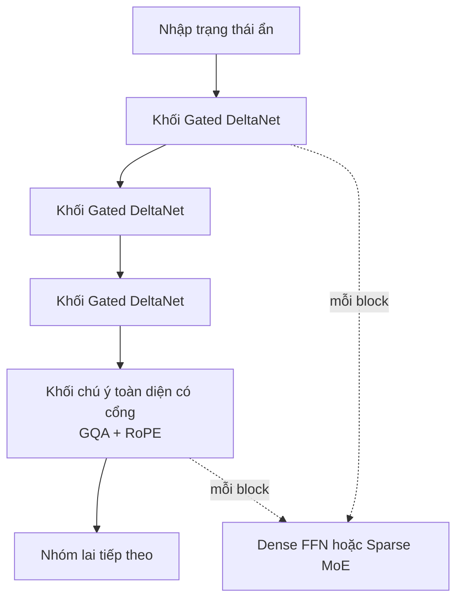
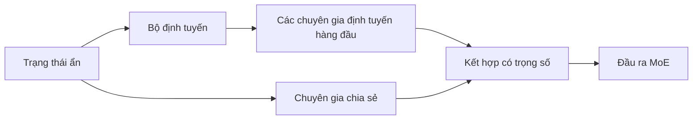
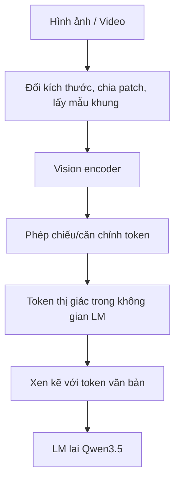

# Qwen3.5 — Kiến trúc

> **Phạm vi.** Tài liệu này dùng thông tin công khai trong blog, model card và config của Qwen. Các con số có thể khác theo checkpoint; khi thuyết trình cần ghi rõ mô hình cụ thể. Qwen3.5 là **mô hình ngôn ngữ nhân quả đa phương thức bản địa**, không chỉ là LLM văn bản được gắn thêm thị giác ở cuối.

## 1. Luồng dữ liệu tổng thể

```text
Ảnh / Video ──> Đổi kích thước, lấy mẫu patch/frame ──> Vision encoder
                                                        │
                                                        v
                                             Đặc trưng / token thị giác
                                                        │
Văn bản ────────────> Tokenizer ────────────────────────┤
                                                        v
                                      Chuỗi token đa phương thức thống nhất
                                                        │
                                                        v
                             Mô hình ngôn ngữ lai Qwen3.5 (nhân quả)
                              │  Các khối DeltaNet + attention có gate
                              │  FFN dày đặc hoặc MoE FFN thưa
                              v
                   Logit token kế tiếp / suy luận / câu trả lời / lệnh gọi công cụ
```

**Hợp nhất sớm** nghĩa là token văn bản và token thị giác được đưa vào cùng một chuỗi để backbone tối ưu chung bằng mục tiêu mô hình hóa ngôn ngữ nhân quả. Đây là khác biệt quan trọng so với pipeline “vision encoder đóng băng → projector → LLM văn bản” theo kiểu hợp nhất muộn.

## 2. Một nhóm tầng lai

Qwen3.5 xen kẽ nhiều tầng Gated DeltaNet với một tầng Gated Full-Attention định kỳ:

```text
Các trạng thái ẩn đầu vào
        │
        v
┌─────────────────────────────────────┐
│ Gated DeltaNet + Dense/MoE FFN       │  (1)
└─────────────────────────────────────┘
        │
        v
┌─────────────────────────────────────┐
│ Gated DeltaNet + Dense/MoE FFN       │  (2)
└─────────────────────────────────────┘
        │
        v
┌─────────────────────────────────────┐
│ Gated DeltaNet + Dense/MoE FFN       │  (3)
└─────────────────────────────────────┘
        │
        v
┌─────────────────────────────────────┐
│ Gated Full Attention + Dense/MoE FFN │  (4)
└─────────────────────────────────────┘
        │
        v
Nhóm kế tiếp
```

Ví dụ được công bố cho **Qwen3.5-9B**: 32 tầng, kích thước ẩn 4096, bố cục `8 × [3 × (Gated DeltaNet → FFN) + 1 × (Gated Attention → FFN)]`. Đây là ví dụ của một checkpoint, không nên áp dụng nguyên xi cho mọi mô hình.

## 3. Khối Gated DeltaNet

```text
Đầu vào x
  │
  ├──> RMSNorm ──> Q/K/V projections ──> gated recurrent update ──> DeltaNet output ──┐
  │                                                                                   │
  └────────────────────────────────────────────────────────────────────────────── (+) ┘
                                      Residual 1
                                           │
                                           v
                              RMSNorm ──> Dense FFN / MoE ──┐
                                                            │
                              Residual 1 ───────────────── (+)
                                                            │
                                                            v
                                                         Đầu ra y
```

Trực giác: DeltaNet duy trì một **trạng thái/bộ nhớ nén** thay vì lưu và so sánh trực tiếp toàn bộ key-value của chuỗi. Query đọc trạng thái; key xác định thông tin; value là nội dung; gate điều khiển việc ghi, giữ, quên và mức đóng góp vào đầu ra. Cơ chế này hướng tới chi phí gần tuyến tính theo độ dài chuỗi ở phần trộn token chính, nhưng có thể yếu hơn full attention khi cần truy xuất chính xác giữa các token xa.

## 4. Khối chú ý đầy đủ có cổng

```text
Đầu vào x
  │
  ├──> RMSNorm ──> Q/K/V ──> RoPE ──> Gated GQA ──┐
  │                                                │
  └──────────────────────────────────────────── (+)┘  Residual 1
                                      │
                                      v
                          RMSNorm ──> Dense FFN / MoE ──┐
                                                        │
                          Residual 1 ───────────────── (+)  Residual 2
                                                        │
                                                        v
                                                     Đầu ra y
```

GQA dùng nhiều query head hơn KV head, vì vậy giảm kích thước KV cache và băng thông bộ nhớ. RoPE mã hóa thông tin vị trí. Full attention được đặt định kỳ để trộn thông tin toàn cục mà DeltaNet có thể bỏ sót.

## 5. FFN dày đặc và MoE thưa

Biến thể dày đặc:

```text
Trạng thái ẩn ──> FFN dùng chung ──> đầu ra
```

Biến thể MoE:

```text
Trạng thái ẩn ──┬──> Router ──> top-k expert được định tuyến ──┐
               └──> Expert dùng chung ────────────────────────┤
                                                     v
                                           kết hợp có trọng số → đầu ra
```

Tên `35B-A3B` có nghĩa gần đúng là khoảng 35B tổng tham số nhưng khoảng 3B tham số được kích hoạt cho mỗi token. MoE tăng dung lượng mô hình với chi phí tính toán trên mỗi token thấp hơn mô hình dày đặc có cùng tổng số trọng số, đổi lại việc định tuyến, cân bằng tải, giao tiếp và phục vụ trở nên phức tạp hơn.

## 6. Vision encoder và ngữ cảnh

```text
Ảnh/video → tiền xử lý → các tầng thị giác → chiếu/căn chỉnh
          → token thị giác → xen kẽ với token văn bản → backbone LM
```

Kích thước patch, số tầng thị giác, cách chia patch theo thời gian và các kích thước thị giác khác phải lấy từ `vision_config` của checkpoint cụ thể; không nên suy ra từ model card tổng quát.

Qwen3.6-35B-A3B (đại diện cùng họ kiến trúc) công bố ngữ cảnh gốc 262.144 token và khả năng mở rộng tới khoảng 1.010.000 token. “Hỗ trợ 1M” chỉ nói về độ dài đầu vào/phục vụ; không đảm bảo khả năng suy luận và truy xuất không suy giảm ở độ dài đó.

## 7. Qwen3.6-35B-A3B — ví dụ so sánh

| Thuộc tính                 | Giá trị công bố                                     |
| ---------------------------- | ------------------------------------------------------- |
| Tổng / tham số được kích hoạt | 35B / 3B                                                |
| Lớp, kích thước ẩn | 40, 2048 |
| Bố cục | `10 × [3 DeltaNet + 1 Gated Attention]` |
| MoE | 256 expert được định tuyến; top-8 định tuyến + 1 dùng chung |
| DeltaNet | 32 value head; 16 query/key head; kích thước head 128 |
| Attention có gate | 16 query head; 2 KV head; kích thước head 256; kích thước rotary 64 |
| Ngữ cảnh                     | 262K gốc; mở rộng tới khoảng 1,01M                    |
| Khác                         | MTP nhiều bước; duy trì suy luận                       |

MTP (Multi-Token Prediction) tạo tín hiệu huấn luyện cho nhiều token tương lai và có thể hỗ trợ giải mã suy đoán. `preserve_thinking` cho phép các lượt sau tiếp tục dùng ngữ cảnh suy luận lịch sử; đây là tính năng hành vi/API, không phải một backbone mới.

## 8. Thông số chính thức của Qwen3.5-35B-A3B

| Thuộc tính                      |                                                      Giá trị |
| --------------------------------- | -------------------------------------------------------------: |
| Loại mô hình                     |          Mô hình ngôn ngữ nhân quả có Vision encoder |
| Tổng / tham số được kích hoạt    |                                                       35B / 3B |
| Kích thước ẩn |                                                           2048 |
| Token embedding và LM output     |                                               248,320 (padded) |
| Lớp |                                                             40 |
| Bố cục tầng                       | `10 × [3 DeltaNet + 1 Gated Attention]`, mỗi tầng có MoE |
| Đầu / kích thước DeltaNet |                                              32V; 16 QK / 128 |
| Gated Đầu chú ý / kích thước |                                               16Q; 2KV/256 |
| Kích thước vị trí quay |                                                             64 |
| MoE |                     256 expert; kích hoạt 8 expert định tuyến + 1 dùng chung |
| Kích thước trung gian expert |                                                   512 |
| MTP |                                    Được huấn luyện với nhiều bước |
| Ngữ cảnh                          |                   262.144 gốc; mở rộng tới khoảng 1.010.000 |

Model card ghi Qwen3.5 mặc định sinh **nội dung suy luận** trong `<think>...</think>` trước phản hồi cuối. Qwen3.5-Flash là phiên bản hosted/API tương ứng với 35B-A3B nhưng có thêm các tính năng production như ngữ cảnh 1M mặc định và công cụ tích hợp; không nên coi đó là cùng một cấu hình phục vụ với checkpoint mở trọng số.

## 9. Giải thích ngắn gọn

- **Vision Encoder:** biến ảnh/video thành biểu diễn mà LM có thể đọc.
- **Hợp nhất sớm:** token thị giác và văn bản cùng tham gia vào chuỗi thống nhất.
- **DeltaNet:** xử lý phần lớn chuỗi bằng trạng thái tuần tự, tiết kiệm bộ nhớ/tính toán.
- **Gated Attention:** thỉnh thoảng truy cập toàn cục chính xác hơn.
- **FFN/MoE:** biến đổi từng token; MoE chọn một số expert thay vì chạy tất cả.
- **Residual + RMSNorm:** giữ dòng gradient/ổn định hóa việc huấn luyện.
- **Head nhân quả:** dự đoán token tiếp theo, sinh câu trả lời, suy luận hoặc lệnh gọi công cụ.







