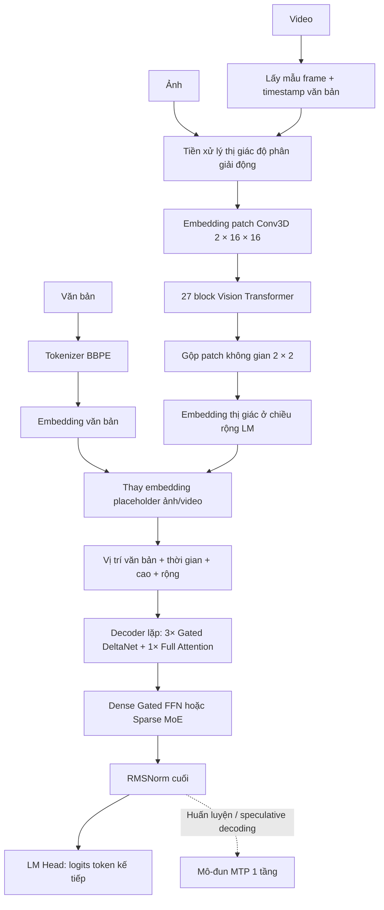

# Qwen3.5: Kiến trúc, luồng dữ liệu, tiền huấn luyện và hậu huấn luyện

> **Câu hỏi nghiên cứu:** Những gì có thể kiểm chứng công khai về các mô-đun
> nội bộ, luồng dữ liệu đa phương thức, tiền huấn luyện và hậu huấn luyện của
> họ mô hình Qwen3.5 cốt lõi?
>
> **Phạm vi:** Họ Qwen3.5 thị giác-ngôn ngữ nguyên bản được phát hành năm 2026.
> Đây không phải báo cáo về Qwen3.5-Omni, Qwen-VLA hay Qwen3.6.
>
> **Ngày nghiên cứu:** 2026-07-20. Nguồn chính gồm tài liệu phát hành của Qwen,
> các artifact Qwen chính thức trên Hugging Face, mã triển khai Transformers do Qwen
> đồng tác giả, và bài báo Qwen3.5-Omni chỉ ở những chỗ mô tả rõ một thành phần
> được tái sử dụng từ Qwen3.5.

## Tóm tắt ngắn

Qwen3.5 là **mô hình tự hồi quy từ ảnh/video sang văn bản**, không phải mô hình
văn bản được gắn thêm năng lực thị giác sau khi đã hoàn tất tiền huấn luyện ngôn
ngữ. Mô hình được huấn luyện đồng thời trên đầu vào văn bản và thị giác ngay từ
giai đoạn tiền huấn luyện. Luồng tính toán chính kết hợp:

1. tokenizer byte-level BPE khoảng 250K token;
2. Vision Transformer gồm 27 block, chuyển patch ảnh/video ở độ phân giải thay đổi
   thành embedding có chiều rộng bằng mô hình ngôn ngữ;
3. decoder với mỗi cụm lặp gồm ba tầng **Gated DeltaNet** hồi quy, tiếp theo là
   một tầng full-attention có gate;
4. FFN có gate dạng dense hoặc MoE thưa sau mỗi tầng trộn token;
5. RoPE đa phương thức, đầu ra mô hình ngôn ngữ nhân quả và một mô-đun
   multi-token prediction được huấn luyện riêng.

Kiến trúc và luồng dữ liệu khi suy luận được công khai khá rõ qua config và mã
tham chiếu. Công thức huấn luyện kém minh bạch hơn. Qwen công bố việc hợp nhất
văn bản–thị giác sớm, dữ liệu đa dạng hơn và được lọc nghiêm ngặt hơn, 201 ngôn
ngữ/phương ngữ, multi-token prediction, hạ tầng FP8 và RL trên các môi trường
agent quy mô lớn với độ khó tăng dần. Qwen **không** công bố tổng số token chính xác,
tỷ lệ dữ liệu theo phương thức, nguồn dữ liệu, lịch optimizer, các giai đoạn
instruction tuning, thuật toán RL, cách xây dựng reward hay quy trình an toàn.

## Ranh giới phạm vi: Qwen3.5 không phải Qwen3.5-Omni

| Họ mô hình | Đầu vào | Đầu ra | Luồng đặc trưng |
| --- | --- | --- | --- |
| **Qwen3.5 core** | Văn bản, ảnh, video không âm thanh | Token văn bản, gồm cả tool call tuần tự hóa | Vision encoder -> chuỗi embedding hợp nhất -> decoder lai Gated DeltaNet/full-attention |
| **Qwen3.5-Omni** | Văn bản, ảnh, video, âm thanh | Văn bản và tiếng nói streaming | Audio encoder AuT -> Thinker -> Talker -> mã tiếng nói RVQ -> Code2Wav; ARIA căn chỉnh tốc độ văn bản và tiếng nói |

Báo cáo kỹ thuật Qwen3.5-Omni mô tả một kiến trúc riêng. Không nên áp dụng các
khẳng định về hơn 100 triệu giờ dữ liệu audio-visual, huấn luyện Thinker-Talker,
ARIA, codebook tiếng nói và hậu huấn luyện sinh tiếng nói cho họ Qwen3.5 core.
Mô hình core không có audio encoder, Talker, codec hay bộ kết xuất tiếng nói.
[Báo cáo kỹ thuật Qwen3.5-Omni, §§1-3][qwen35-omni]

## Tổng quan kiến trúc



Đây là **early fusion ở đầu vào decoder**, sau khi dữ liệu thị giác đã được mã
hóa bằng bộ mã hóa chuyên biệt. “Nền tảng vision-language hợp nhất” không có
nghĩa là điểm ảnh thô và văn bản dùng chung tầng đầu tiên. Nó có nghĩa là vision
encoder và language decoder được huấn luyện chung trên các chuỗi trộn văn
bản–ảnh–video ngay từ tiền huấn luyện, thay vì chỉ căn chỉnh một mô hình ngôn
ngữ đã hoàn tất huấn luyện và bị đóng băng ở giai đoạn sau.
[Qwen3.5 release, Pretraining][qwen35-release]
[Triển khai tham chiếu Qwen3.5][qwen35-code]

## Các mô-đun đầu vào và hợp nhất

### Tokenizer văn bản và token đặc biệt

**Đã kiểm chứng.** Qwen mô tả tokenizer byte-level BPE có vốn từ khoảng 250K,
tăng từ khoảng 150K, và cho biết hiệu quả mã hóa/giải mã tốt hơn 10–60% ở hầu
khắp các ngôn ngữ. Trong checkpoint phát hành, embedding đầu vào/đầu ra của
vocabulary được đệm đến chính xác **248.320** mục. Một số ID đặc biệt gồm `vision_start=248053`,
`vision_end=248054`, `image=248056`, `video=248057`. Embedding đầu vào và trọng
số đầu ra LM không dùng chung.
[Qwen3.5 release, Pretraining][qwen35-release]
[Config Qwen3.5-27B][qwen35-27b-config]

250K là cách mô tả được làm tròn; 248.320 là kích thước thực tế trong
checkpoint. Bài báo Qwen3.5-Omni cũng xác nhận tokenizer Qwen3.5 được tái sử
dụng là byte-level BPE. [Qwen3.5-Omni, §2.3][qwen35-omni]

### Tiền xử lý ảnh và video

**Đã kiểm chứng từ checkpoint 27B và mã triển khai:**

- patch embedder thị giác là một lớp tích chập 3D có kernel và stride
  `(temporal=2, height=16, width=16)`;
- vision tower có 27 block, hidden width 1.152, 16 head attention và MLP có
  intermediate width 4.304 với GELU-tanh;
- spatial merger gộp từng nhóm patch thị giác `2 x 2`, giảm số token thị giác
  xuống bốn lần, rồi chiếu kết quả về hidden width của language model;
- ảnh và video dùng cùng vision tower;
- mỗi patch thời gian được lấy mẫu từ video đi kèm một mốc thời gian dạng văn
  bản như `<1.5 seconds>` đứng trước trong prompt tuần tự hóa, sau đó là token
  biên thị giác và token placeholder video.

Với visual grid `(T, H, W)`, số placeholder thị giác ở cấp decoder xấp xỉ:

```text
N_visual = T * H * W / spatial_merge_size^2
         = T * H * W / 4
```

Ở đây `T`, `H`, `W` là grid sau khi chia patch, không phải kích thước pixel
thô. [Config Qwen3.5-27B][qwen35-27b-config]
[Mã processor Qwen3.5/Qwen3-VL][qwen35-processor]
[Mã vision Qwen3.5][qwen35-code]

### Vision encoder và việc không có DeepStack

Vision tower kế thừa các khối cơ sở ViT của Qwen3-VL: patch embedding,
embedding vị trí học được có nội suy, visual rotary embedding, vision block
full-attention và patch merger. Điểm khác quan trọng của Qwen3.5 là `Qwen3_5VisionModel` loại bỏ
rõ ràng `deepstack_visual_indexes` và `deepstack_merger_list`; config phát hành
đặt `deepstack_visual_indexes` thành danh sách rỗng. Vì vậy Qwen3.5 chỉ chèn
**embedding thị giác cuối cùng sau khi gộp một lần ở đầu vào decoder**. Mô hình
không đưa đặc trưng ViT trung gian vào các tầng đầu của decoder qua DeepStack
của Qwen3-VL. [Mã vision Qwen3.5][qwen35-code]
[Config Qwen3.5-27B][qwen35-27b-config]

### Early fusion và vị trí đa phương thức

Processor tạo đủ số vị trí `<|image_pad|>` hoặc `<|video_pad|>` cho chuỗi thị
giác đã gộp. Khi mô hình chạy:

1. ID token thông thường trở thành embedding văn bản;
2. pixel đi qua vision tower và patch merger;
3. `masked_scatter` thay embedding placeholder bằng embedding thị giác;
4. mô hình tính position ID cho văn bản, thời gian, chiều cao và chiều rộng;
5. chuỗi embedding hợp nhất đi vào language decoder.

Qwen3.5 dùng RoPE đa phương thức ba trục cho các tọa độ thời gian, chiều cao và
chiều rộng, đồng thời duy trì một luồng vị trí văn bản một chiều riêng để tạo
causal mask và quản lý cache. Trong config phát hành, chỉ 64 chiều đầu của mỗi full-attention head
có RoPE, chia theo `mrope_section=[11, 11, 10]`, với `rope_theta=10,000,000`.
[Config Qwen3.5-27B][qwen35-27b-config]
[Luồng forward đa phương thức Qwen3.5][qwen35-code]

## Language decoder lai

### Mẫu bộ trộn token 3:1 lặp lại

Tất cả các checkpoint lớn được phát hành đều theo mẫu Qwen3-Next:

```text
3 x Gated DeltaNet -> 1 x gated full attention -> lặp lại
```

Tỷ lệ này là thuộc tính kiến trúc, không phải tùy chọn khi suy luận. Các tầng
tuyến tính/hồi quy đảm nhiệm phần lớn việc trộn chuỗi với chi phí thấp; mỗi tầng
thứ tư khôi phục softmax attention toàn cục và cải thiện khả năng ghi nhớ. Thử nghiệm
Qwen3-Next cho thấy linear attention thuần nhanh nhưng nhớ kém hơn, còn hybrid
3:1 tốt hơn cả biến thể chỉ dùng linear attention lẫn biến thể chỉ dùng
attention tiêu chuẩn trong các phép thử của họ. [Bài viết kiến trúc Qwen3-Next][qwen3-next]

Mỗi decoder block là:

```text
x -> RMSNorm zero-centered -> token mixer -> cộng residual
  -> RMSNorm zero-centered -> dense FFN hoặc sparse MoE -> cộng residual
```

Các khái niệm attention/FFN/RoPE tiêu chuẩn được trình bày chi tiết hơn trong
[ghi chú mô-đun](../../module_details/LLM_modules/README.md) kế bên.

### Gated DeltaNet

Gated DeltaNet là bộ trộn token hồi quy dựa trên linear attention. Mã Qwen3.5 thực hiện:

1. chiếu hidden state đã chuẩn hóa thành `Q`, `K`, `V`, output gate `z`, cường
   độ cập nhật `beta` và suy giảm `g`;
2. áp dụng tích chập depth-wise nhân quả với kernel rộng bốn lên `Q/K/V`;
3. L2-normalize `Q` và `K` trong kernel delta-rule;
4. cập nhật trạng thái key-value hồi quy có kích thước cố định bằng hệ số suy giảm học
   được và hiệu chỉnh delta;
5. đọc trạng thái bằng `Q`;
6. chuẩn hóa, dùng `z` làm gate cho kết quả, rồi áp dụng output projection.

Khi prefill, triển khai dùng kernel delta-rule chạy song song theo từng chunk.
Khi giải mã từng token, nó cập nhật cache tích chập và trạng thái hồi quy. Nhờ
vậy, các tầng Gated DeltaNet không cần KV cache tăng theo chiều dài chuỗi; chỉ
các tầng full-attention định kỳ mới lưu lịch sử key/value thông thường. Đây là
lý do chính khiến việc giải mã ngữ cảnh dài ít tốn kém hơn ở decoder chỉ dùng full-attention.
[Mã Gated DeltaNet Qwen3.5][qwen35-code]
[Bài viết kiến trúc Qwen3-Next][qwen3-next]

Giải thích toán học chi tiết hơn xem [Gated DeltaNet](../../module_details/LLM_modules/Gated_DeltaNet.md).

### Full attention có gate

Mỗi tầng thứ tư dùng grouped-query attention nhân quả. Ngoài các projection
`Q/K/V` thông thường, query projection tạo một vector gate đầu ra. Kết quả
softmax attention được nhân với `sigmoid(gate)` trước khi qua output projection.
Qwen cho rằng gate cải thiện đặc tính về hạng, đồng thời giảm attention sink và
activation quá lớn. Chiều rộng mỗi head là 256, trong đó chỉ 64 chiều dùng RoPE.
[Bài viết Qwen3-Next][qwen3-next]
[Mã attention Qwen3.5][qwen35-code]

Số query head và KV head phụ thuộc kích thước mô hình. Ví dụ, 27B dùng 24 query
head và 4 KV head; 35B-A3B dùng 16 và 2; 397B-A17B dùng 32 và 2. Đây là GQA,
không phải MHA thông thường có số query head và KV head bằng nhau.
[Model card 27B][qwen35-27b] [Model card 35B-A3B][qwen35-35b]
[Model card 397B-A17B][qwen35-397b]

### FFN dense và MoE thưa

Các mô hình dense 0.8B, 2B, 4B, 9B và 27B đặt FFN SiLU-gated sau mỗi token
mixer. Các mô hình MoE 35B-A3B, 122B-A10B và 397B-A17B thay FFN bằng khối
expert thưa. Chẳng hạn, hậu tố `A3B` nghĩa là khoảng 3B tham số language model
được kích hoạt trên mỗi token, không phải toàn bộ checkpoint chỉ có 3B tham số.

Với 35B-A3B và 122B-A10B, router đã học chọn tám trong 256 routed expert cho
mỗi token và đồng thời chạy một shared expert. Với 397B-A17B, router chọn mười
trong 512 routed expert cùng một shared expert. Đầu ra của các expert được gán
trọng số rồi kết hợp; nhánh shared luôn hoạt động và không đi qua định tuyến.
[Model card 35B-A3B][qwen35-35b] [Model card 122B-A10B][qwen35-122b]
[Model card 397B-A17B][qwen35-397b]

Xem [MoE](../../module_details/LLM_modules/MoE.md) và [SwiGLU](../../module_details/LLM_modules/SwiGLU.md) để biết cơ chế tổng quát.

### Chuẩn hóa, logits và MTP

Qwen3.5 kế thừa thiết kế RMSNorm zero-centered và bố cục residual pre-norm của
Qwen3-Next. Đầu ra của RMSNorm cuối được đưa vào output head tuyến tính, không
chia sẻ trọng số, trên vocabulary gồm 248.320 mục. Quá trình sinh văn bản mang
tính tự hồi quy: logits chọn token văn bản kế tiếp, rồi token được chọn được nối vào cùng chuỗi cho bước tiếp theo.

Checkpoint cũng có mô-đun `mtp` riêng, gồm fusion projection, một tầng decoder
và bước normalization. Qwen cho biết MTP được huấn luyện để dự đoán nhiều bước
tương lai và có thể dùng làm draft model cho speculative decoding. MTP không
thay đổi không gian đầu ra ngữ nghĩa: các đề xuất được chấp nhận vẫn là token
thông thường trong vocabulary và được mô hình chính kiểm chứng.
[Model card 27B][qwen35-27b] [Weight index checkpoint 27B][qwen35-27b-index]
[Mô tả MTP Qwen3-Next][qwen3-next]

## Luồng dữ liệu thực thi đầu cuối

### Yêu cầu chỉ có văn bản

```text
prompt/chat template -> ID BBPE -> embedding token
  -> 64 hybrid decoder layer trong 27B, chẳng hạn
  -> RMSNorm cuối -> logits 248.320 chiều
  -> chọn token tự hồi quy -> văn bản giải mã
```

Vision tower không tham gia tính toán; tuy vậy, nó vẫn nằm trong checkpoint đa phương thức.

### Yêu cầu có ảnh

```text
ảnh + prompt văn bản -> resize/normalize và grid patch động
  -> embedding patch Conv3D -> visual position + visual RoPE học được
  -> 27 ViT block -> merger không gian 2 x 2 và chiếu về LM width
  -> thay embedding placeholder ảnh trong dòng token
  -> RoPE đa phương thức + decoder lai -> logits văn bản
```

### Yêu cầu có video

```text
video + prompt văn bản -> lấy mẫu frame -> cặp frame tạo temporal patch
  -> một timestamp văn bản quanh mỗi nhóm thị giác theo thời gian
  -> cùng ViT và patch merger như ảnh
  -> xen kẽ token timestamp và embedding thị giác
  -> RoPE đa phương thức + decoder lai -> logits văn bản
```

Timestamp tường minh cung cấp mốc thời gian có ý nghĩa ngữ nghĩa, còn RoPE đa
phương thức biểu diễn tọa độ thời gian và không gian của patch thị giác. Hai cơ
chế này bổ trợ cho nhau chứ không trùng lặp.

### Vòng lặp agent sử dụng công cụ

Công cụ không phải là mô-đun neural bên trong Qwen3.5. Mô hình phát ra một tool
call đã tuần tự hóa; hệ thống agent bên ngoài thực thi rồi nối kết quả công cụ
vào ngữ cảnh:

```text
token người dùng -> Qwen3.5 -> token tool-call
                              |
                              v
                        executor bên ngoài
                              |
                              v
token tool-result -> Qwen3.5 -> câu trả lời cuối hoặc công cụ tiếp theo
```

Vì vậy, “năng lực agent” đến từ hậu huấn luyện kết hợp với runtime bên ngoài bao
quanh mô hình. Trọng số mô hình không tự chứa WebSearch, shell hay MCP server.

## Một số cấu hình được phát hành

| Model | Số tầng LM và width | Block lặp | Số attention head Q/KV | FFN hoặc expert | Ngữ cảnh nguyên bản |
| --- | ---: | --- | --- | --- | ---: |
| Qwen3.5-27B | 64 x 5.120 | `16 x (3 GDN + 1 full)` | 24 / 4 | Dense FFN, intermediate 17.408 | 262.144 |
| Qwen3.5-35B-A3B | 40 x 2.048 | `10 x (3 GDN + 1 full)` | 16 / 2 | 256 expert; 8 routed + 1 shared; intermediate 512 | 262.144 |
| Qwen3.5-122B-A10B | 48 x 3.072 | `12 x (3 GDN + 1 full)` | 32 / 2 | 256 expert; 8 routed + 1 shared; intermediate 1.024 | 262.144 |
| Qwen3.5-397B-A17B | 60 x 4.096 | `15 x (3 GDN + 1 full)` | 32 / 2 | 512 expert; 10 routed + 1 shared; intermediate 1.024 | 262.144 |

Cả bốn đều là checkpoint thị giác-ngôn ngữ nguyên bản và được quảng bá là có thể mở rộng
đến khoảng 1.010.000 token. Collection chính thức còn có các biến thể dense
0.8B, 2B, 4B, 9B và các checkpoint Base ở nhiều kích thước.
[Collection Qwen3.5 chính thức][qwen35-collection]

Tên `397B-A17B` và các tên tương tự mô tả quy mô mô hình ngôn ngữ. Artifact đầy
đủ trên Hugging Face còn gồm vision tower, nên metadata của repository có thể
hiển thị tổng số tham số lớn hơn đôi chút.

## Tiền huấn luyện

### Những gì đã kiểm chứng

Qwen mô tả tiền huấn luyện theo ba trục:

1. **Năng lực:** nhiều token thị giác-văn bản hơn Qwen3; nội dung tiếng Trung, tiếng
   Anh, đa ngôn ngữ, STEM và suy luận phong phú hơn; lọc nghiêm ngặt hơn.
2. **Hiệu quả:** decoder lai kế thừa Qwen3-Next, MoE thưa hơn, thay đổi ổn định
   hóa và multi-token prediction.
3. **Tính đa dụng:** hợp nhất văn bản–thị giác sớm, mở rộng dữ liệu thị
   giác/STEM/video và bao phủ 201 ngôn ngữ/phương ngữ.

Model card của bản Base xác nhận checkpoint **mới chỉ trải qua tiền huấn luyện**
nhưng vẫn nhận đầu vào ảnh-văn bản và sinh văn bản. Model card cũng cho biết
token điều khiển chat được đưa vào từ giai đoạn tiền huấn luyện để các bước tinh
chỉnh tiết kiệm tham số sau này không phải resize embedding ở quy mô lớn bất thường.
[Qwen3.5 release, Pretraining][qwen35-release]
[Model card 35B-A3B-Base][qwen35-35b-base]

Mô hình thực thi là một causal language model được điều kiện hóa bởi embedding
văn bản và thị giác. Checkpoint công khai và model card cũng xác nhận các trọng
số MTP. Do đó, luồng huấn luyện có thể diễn giải như sau:

```text
ví dụ văn bản/ảnh/video đã lọc
  -> token văn bản BBPE + patch thị giác đã mã hóa
  -> chuỗi đa phương thức hợp nhất sớm
  -> dự đoán token tương lai nhân quả qua LM head chính
  + dự đoán token tương lai nhiều bước qua MTP
  -> Base checkpoint
```

**Ranh giới suy luận:** triển khai công khai xác định các mục tiêu nhân quả và
MTP có thể dùng để huấn luyện mạng, nhưng Qwen chưa công bố phương trình loss
hay lịch trọng số loss cho lần chạy tiền huấn luyện thực tế của Qwen3.5.

### Hạ tầng huấn luyện

**Đã kiểm chứng.** Qwen báo cáo một hệ thống huấn luyện dị thể, sử dụng các
chiến lược song song riêng cho thành phần thị giác và ngôn ngữ, đồng thời chồng
lấp khối lượng tính toán nhờ sparse activation. Trên các batch trộn văn
bản–ảnh–video, họ báo cáo throughput gần với baseline chỉ có văn bản.

Luồng FP8 nguyên bản dùng độ chính xác thấp cho activation, MoE routing và GEMM,
trong khi cơ chế giám sát runtime giữ BF16 cho các tầng nhạy cảm. Qwen báo cáo
giảm khoảng 50% bộ nhớ activation, tăng tốc hơn 10% và scaling ổn định đến hàng
chục nghìn tỷ token. Đây là năng lực hạ tầng, **không** phải con số công bố chính xác về token cuối cùng của Qwen3.5.
[Qwen3.5 release, Infrastructure][qwen35-release]

### Những gì vẫn chưa biết

- tổng số token tiền huấn luyện chính xác;
- số lượng và tỷ lệ văn bản, ảnh-văn bản, tài liệu xen kẽ và video;
- dataset nguồn, giấy phép, khử trùng lặp, kiểm tra nhiễm dữ liệu và phân bố ngôn ngữ;
- mọi kích thước mô hình có dùng cùng curriculum hay không;
- curriculum về độ dài ngữ cảnh và phương pháp mở rộng lên 1,01M token;
- optimizer, batch size, lịch learning rate, khởi tạo checkpoint và ngân sách tính toán;
- trọng số causal loss chính so với MTP loss và số offset được dự đoán;
- loss căn chỉnh vision-language, nếu có ngoài loss token tự hồi quy;
- ablation tách riêng tác động của early fusion, mở rộng tokenizer, scaling dữ liệu
  và thay đổi kiến trúc.

Không nên lấp các khoảng trống này bằng quy trình ba giai đoạn trên 36T token đã
được công bố của Qwen3 hay thí nghiệm 15T token của Qwen3-Next. Qwen3.5 kế thừa
ý tưởng kiến trúc; không có xác nhận công khai rằng kho dữ liệu hay lịch huấn
luyện của nó giống hệt các mô hình đó.

## Hậu huấn luyện

### Những gì đã kiểm chứng

Checkpoint hậu huấn luyện chính thức khác với checkpoint Base. Qwen cho biết phần
lớn mức cải thiện so với Qwen3 đến từ việc mở rộng RL trên gần như mọi tác vụ và
môi trường có thể xây dựng, đồng thời tăng độ khó và tính khái quát của môi trường
thay vì tối ưu cho một benchmark hẹp.
[Qwen3.5 release, thảo luận hậu huấn luyện][qwen35-release]

Model card tóm tắt đây là RL trên **các môi trường agent quy mô hàng triệu, với
phân bố tác vụ ngày càng phức tạp**. Hạ tầng huấn luyện và suy luận là một hệ
thống bất đồng bộ, tách biệt, gồm:

- cân bằng tải động và khôi phục lỗi ở mức chi tiết;
- huấn luyện FP8 đầu cuối;
- rollout-router replay;
- speculative decoding;
- cơ chế khóa rollout đa lượt;
- kiểm soát gradient staleness và data skew;
- tương tác agent đa lượt nguyên bản mà không làm gián đoạn vòng lặp huấn luyện.

Qwen cho biết có thể điều phối các scaffold và môi trường agent ở quy mô hàng
triệu, đồng thời báo cáo mức tăng tốc 3–5 lần cho toàn hệ thống đầu cuối. Đây là
kết quả do nhà cung cấp báo cáo và chưa được đo lặp độc lập.
[Qwen3.5 release, Infrastructure][qwen35-release]
[Model card 35B-A3B][qwen35-35b]

Mô hình hậu huấn luyện có các chế độ hành vi quan sát được. Checkpoint mở mặc
định bật chế độ suy nghĩ và tuần tự hóa suy luận trong `<think>...</think>`;
giao diện serving có thể tắt chế độ này. Sản phẩm hosted còn có `Auto`,
`Thinking` để suy nghĩ sâu hơn và `Fast` để trả lời trực tiếp. Những hành vi này
đến từ hậu huấn luyện/prompting trên cùng decoder chính, không phải từ các attention module bổ sung.
[Model card 397B-A17B][qwen35-397b]
[Qwen3.5 release, phần sử dụng][qwen35-release]

### Suy luận và điều chưa biết

**Suy luận:** phải có một giai đoạn căn chỉnh theo chỉ dẫn nào đó để tạo ra
checkpoint hội thoại hậu huấn luyện khác với bản Base. Nguồn công khai không nêu
tên hay thứ tự các giai đoạn, nên không nên mặc nhiên gọi đó là “thinking-mode
fusion” của Qwen3 hoặc sao chép pipeline bốn giai đoạn của Qwen3.

**Chưa biết:** Qwen chưa công bố:

- chuỗi giai đoạn hoàn chỉnh như CPT -> SFT -> preference tuning -> RL;
- kích thước, nguồn, cân bằng phương thức hay chính sách lấy mẫu của SFT dataset;
- thuật toán RL (ví dụ PPO, GRPO hay phương pháp khác);
- reward model, verifier dựa trên luật, nhãn ưu tiên của con người hay thành phần reward;
- cách trộn suy luận văn bản, suy luận thị giác, coding, search, GUI và tool-use;
- số rollout, số lượt tối đa, curriculum hay lọc dữ liệu;
- tinh chỉnh riêng cho an toàn, dữ liệu red-team, mục tiêu từ chối hay đánh đổi alignment;
- các mô hình dense nhỏ được hậu huấn luyện độc lập hay chưng cất từ teacher Qwen3.5 lớn hơn.

Thông báo phát hành cho biết các chi tiết huấn luyện đầy đủ hơn sẽ xuất hiện
trong technical report sắp tới. Tính đến 2026-07-20, chưa tìm thấy technical
report độc lập cho Qwen3.5 core trong nguồn Qwen chính thức hoặc arXiv. Báo cáo
**Qwen3.5-Omni** hiện có không phải báo cáo còn thiếu đó.

## Kết luận thực tiễn

1. **Trung tâm kiến trúc là decoder lai.** Ba tầng Gated DeltaNet hồi quy giúp
   xử lý ngữ cảnh dài hiệu quả; full attention có gate định kỳ khôi phục khả
   năng nhớ toàn cục.
2. **MoE và attention lai giải quyết hai loại chi phí khác nhau.** MoE giảm số
   tham số FFN được kích hoạt mỗi token; Gated DeltaNet giảm chi phí trộn chuỗi
   và cache.
3. **Đa phương thức nguyên bản là một tuyên bố huấn luyện đi kèm cơ chế fusion cụ
   thể.** Vision tower vẫn đặc thù theo phương thức, nhưng embedding của nó tham
   gia vào cùng luồng decoder ngay từ tiền huấn luyện.
4. **Qwen3.5 đơn giản hơn Qwen3-VL tại điểm chèn đặc trưng.** Nó tái sử dụng họ
   ViT nhưng bỏ DeepStack và chỉ chèn đặc trưng thị giác cuối cùng đã gộp ở đầu
   vào decoder.
5. **Cơ chế agent dùng công cụ vẫn nằm ngoài mô hình.** RL dạy hành vi tool-call;
   runtime bên ngoài thực thi hành động và trả kết quả quan sát.
6. **Mức độ minh bạch huấn luyện không đồng đều.** Kiến trúc, kích thước
   checkpoint, luồng suy luận và hạ tầng có thể kiểm chứng; thành phần kho dữ
   liệu và thuật toán hậu huấn luyện phần lớn chưa được công bố.

## Nguồn

Tất cả nguồn trực tuyến dưới đây được truy cập ngày 2026-07-20.

- Qwen Team. *Qwen3.5: Accelerating Productivity with Native Multimodal
  Agents*, tháng 2/2026. [Trang Qwen chính thức][qwen35-blog] và
  [bản hiển thị Alibaba Cloud có các mục nội dung dễ truy cập][qwen35-release].
- Qwen. [Collection Qwen3.5 chính thức trên Hugging Face][qwen35-collection] và
  model card [27B][qwen35-27b], [35B-A3B][qwen35-35b],
  [122B-A10B][qwen35-122b], [397B-A17B][qwen35-397b], và
  [35B-A3B-Base][qwen35-35b-base].
- Hugging Face Transformers, Qwen Team và các cộng tác viên Hugging Face.
  [Triển khai Qwen3.5 tham chiếu đã ghim][qwen35-code],
  [processor Qwen3-VL được Qwen3.5 dùng][qwen35-processor], và
  [tài liệu Qwen3.5][qwen35-hf-docs].
- Qwen Team. *Qwen3-Next: Towards Ultimate Training & Inference Efficiency*,
  2025. [Bài viết kiến trúc chính thức][qwen3-next].
- Qwen Team. *Qwen3.5-Omni Technical Report*, arXiv:2604.15804v2, 2026.
  [arXiv][qwen35-omni]. Chỉ dùng để xác định ranh giới họ mô hình và mô tả
  tokenizer được tái sử dụng.

[qwen35-blog]: https://qwen.ai/blog?id=qwen3.5
[qwen35-release]: https://www.alibabacloud.com/blog/602894
[qwen35-collection]: https://huggingface.co/collections/Qwen/qwen35
[qwen35-27b]: https://huggingface.co/Qwen/Qwen3.5-27B
[qwen35-35b]: https://huggingface.co/Qwen/Qwen3.5-35B-A3B
[qwen35-122b]: https://huggingface.co/Qwen/Qwen3.5-122B-A10B
[qwen35-397b]: https://huggingface.co/Qwen/Qwen3.5-397B-A17B
[qwen35-35b-base]: https://huggingface.co/Qwen/Qwen3.5-35B-A3B-Base
[qwen35-27b-config]: https://huggingface.co/Qwen/Qwen3.5-27B/blob/fc05daec18b0a78c049392ed2e771dde82bdf654/config.json
[qwen35-27b-index]: https://huggingface.co/Qwen/Qwen3.5-27B/blob/fc05daec18b0a78c049392ed2e771dde82bdf654/model.safetensors.index.json
[qwen35-code]: https://github.com/huggingface/transformers/blob/7ea2320c76117e6742364808a666ef6f2fb40a67/src/transformers/models/qwen3_5/modular_qwen3_5.py
[qwen35-processor]: https://github.com/huggingface/transformers/blob/7ea2320c76117e6742364808a666ef6f2fb40a67/src/transformers/models/qwen3_vl/processing_qwen3_vl.py
[qwen35-hf-docs]: https://huggingface.co/docs/transformers/model_doc/qwen3_5
[qwen3-next]: https://qwen.ai/blog?id=e34c4305036ce60d55a0791b170337c2b70ae51d
[qwen35-omni]: https://arxiv.org/abs/2604.15804v2
