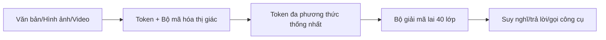
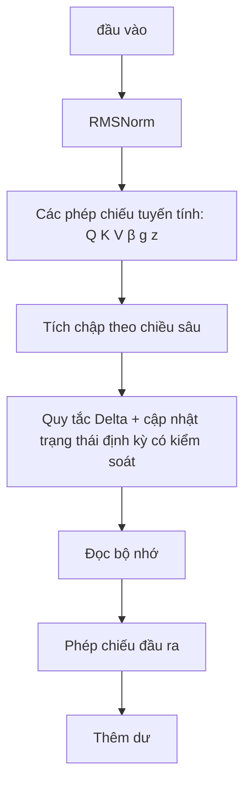
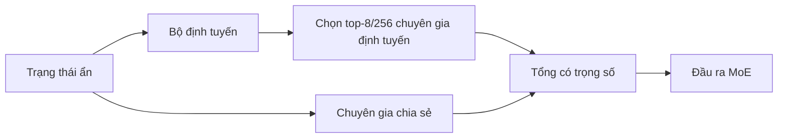
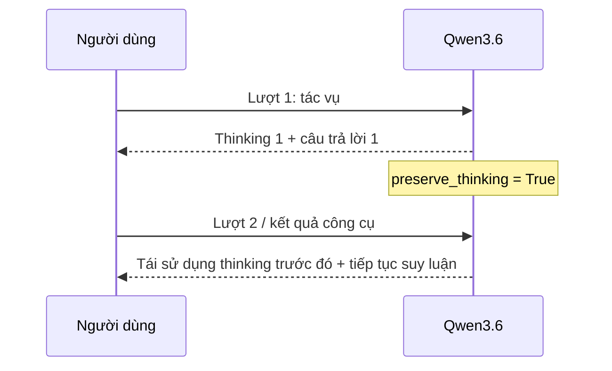

# Qwen3.6-35B-A3B — Kiến trúc

> **Mức độ công khai:** thông tin chính lấy từ model card/config trên Hugging Face. Bài phân tích bên ngoài dùng để diễn giải và phê bình benchmark, không phải báo cáo kỹ thuật đã qua bình duyệt.

## 1. Kết luận kiến trúc

Qwen3.6-35B-A3B là mô hình ngôn ngữ nhân quả đa phương thức có vision encoder. Điểm quan trọng là model card vẫn dùng lớp kiến trúc `qwen3_5_moe`: Qwen3.6 **không thay backbone**, mà chủ yếu cải thiện hậu huấn luyện và năng lực agent.



## 2. Thông số chính thức

| Thuộc tính                 |                                                      Qwen3.6-35B-A3B |
| ---------------------------- | -------------------------------------------------------------------: |
| Tổng tham số / tham số kích hoạt |                                                             35B / 3B |
| Lớp / chiều ẩn |                                                            40/2048 |
| Lớp kiến ​​trúc |                                                      `qwen3_5_moe` |
| Bố cục lớp                 | `10 × [3 Gated DeltaNet + 1 Gated Attention]`, mỗi lớp có MoE |
| Chuyên gia |                                   256; 8 định tuyến + 1 chia sẻ được kích hoạt |
| DeltaNet |                                32 head V, 16 head QK, head dimension 128 |
| Gated attention |                                 16 head Q, 2 head KV, head dimension 256 |
| Kích thước RoPE |                                                                   64 |
| Ngữ cảnh gốc |                                                       262.144 token |
| Ngữ cảnh mở rộng             |                                   khoảng 1.010.000 token với YaRN |
| MTP |                                             được huấn luyện với nhiều bước |
| Giấy phép |                                                           Apache 2.0 |

## 3. Bộ giải mã lai

### Gated DeltaNet + MoE

```text
Đầu vào
  ↓
RMSNorm
  ↓
Gated DeltaNet (linear/recurrent token mixer)
  ↓
Kết nối dư 1
  ↓
RMSNorm
  ↓
MoE thưa: router → top-8 chuyên gia được định tuyến + chuyên gia dùng chung
  ↓
Kết nối dư 2
  ↓
Đầu ra
```

### Attention có kiểm soát + MoE

```text
Đầu vào
  ↓
RMSNorm
  ↓
Gated GQA + RoPE (trộn token toàn cục)
  ↓
Kết nối dư 1
  ↓
RMSNorm
  ↓
MoE thưa
  ↓
Kết nối dư 2
  ↓
Đầu ra
```

Ba lớp DeltaNet xử lý phần lớn chuỗi với chi phí gần tuyến tính theo độ dài; lớp full attention định kỳ giữ khả năng truy xuất chính xác giữa các token xa. Trong 40 lớp, có 30 lớp DeltaNet và 10 lớp Gated Attention.

## 4. Gated DeltaNet



DeltaNet duy trì trạng thái hồi quy thay vì lưu toàn bộ ma trận attention. `β` điều khiển cường độ cập nhật, `g` điều khiển độ suy giảm bộ nhớ và `z` là cổng đầu ra theo mô tả cấu hình/triển khai. Đánh đổi: tiết kiệm bộ nhớ/KV cache hơn full attention, còn khả năng truy xuất toàn cục được bổ sung bằng các lớp attention định kỳ.

## 5. Gated Full Attention và GQA

Qwen3.6 dùng 16 query head nhưng chỉ 2 KV head. GQA cho phép nhiều query cùng chia sẻ key/value, giảm KV cache và băng thông. RoPE có 64 chiều; cổng đầu ra điều tiết mức đóng góp của attention trước kết nối dư.

## 6. MoE thưa thớt



Qwen3.6 giữ nguyên cấu hình MoE chính so với Qwen3.5: 256 chuyên gia, 8 chuyên gia được định tuyến và 1 chuyên gia dùng chung. `A3B` chỉ lượng tham số được kích hoạt cho mỗi token, không phải tổng số tham số.

## 7. MTP và context

MTP được huấn luyện nhiều bước để dự đoán nhiều token tương lai, có thể hỗ trợ speculative decoding. Ngữ cảnh gốc là 262K; mở rộng tới khoảng 1,01M bằng YaRN. YaRN thay đổi cấu hình co giãn vị trí khi serving, không phải kiến trúc backbone mới.

## 8. Duy trì thinking — điểm mới nổi bật



Mặc định chỉ thinking của message gần nhất được giữ. `preserve_thinking` cho phép giữ và sử dụng dấu vết thinking trong lịch sử, phù hợp với lập trình nhiều vòng, suy luận trên repository và vòng lặp công cụ. Qwen3.5 không công bố tùy chọn tương đương như một tính năng chính thức.

## 9. Qwen3.5 so với Qwen3.6

| Thành phần       | Qwen3.5-35B-A3B                         | Qwen3.6-35B-A3B              | Thay đổi                |
| ------------------ | --------------------------------------- | ---------------------------- | ------------------------- |
| Backbone           | DeltaNet lai + Gated Attention + MoE | Gần như giữ nguyên       | Không đổi đáng kể   |
| Tham số         | 35B / 3B kích hoạt                         | 35B / 3B kích hoạt              | Không đổi              |
| Ngữ cảnh            | 262K gốc, ~1,01M mở rộng            | 262K gốc, ~1,01M mở rộng | Không đổi chính       |
| MTP                | Nhiều bước                              | Nhiều bước                   | Không đổi chính       |
| Lập trình bằng agent       | Có                                     | Tập trung mạnh hơn        | Cải thiện hậu huấn luyện |
| Lịch sử thinking   | Chưa có tùy chọn tương đương       | `preserve_thinking`        | Điểm mới chính        |
| Lớp kiến trúc | `qwen3_5_moe`                         | `qwen3_5_moe`              | Xác nhận backbone chung |
