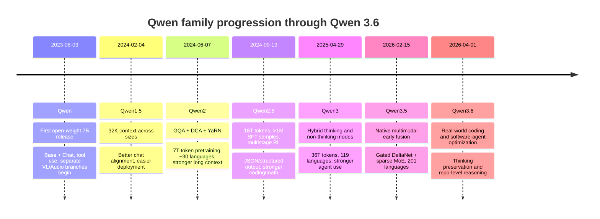
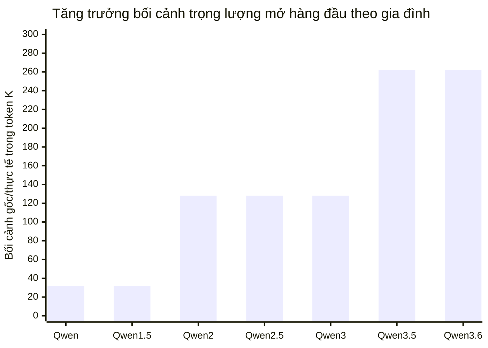

# Họ mô hình Qwen đến Qwen 3.6

## Tóm tắt

Quá trình phát triển dòng Qwen công khai lên đến **Qwen 3.6** được hiểu rõ nhất là bảy dòng phiên bản chính: **Qwen**, **Qwen1.5**, **Qwen2**, **Qwen2.5**, **Qwen3**, **Qwen3.5** và **Qwen3.6**. Trong các họ đó, các vòng cung quan trọng nhất là: chuyển từ LLM ban đầu chỉ dành cho bộ giải mã với các nhánh đa phương thức riêng biệt sang các mô hình văn bản đa ngôn ngữ rộng hơn và có ngữ cảnh dài hơn; sau đó chuyển sang các nhánh mã hóa/toán học/tầm nhìn/âm thanh chuyên sâu; rồi thành các agent lai “tư duy/không suy nghĩ”; và cuối cùng là **các mô hình agent, đa phương thức, định hướng hiệu quả** gốc với huấn luyện sau mã hóa đầu tiên rõ ràng trong 3.6. Các bước thay đổi lớn nhất là **Qwen1.5 → Qwen2**, **Qwen2 → Qwen2.5**, **Qwen2.5 → Qwen3** và **Qwen3 → Qwen3.5**. Những bước nhảy vọt đó được thúc đẩy bởi tập đoàn huấn luyện trước lớn hơn và sạch hơn, huấn luyện sau tích cực hơn, phương pháp ngữ cảnh dài tốt hơn, kiến ​​trúc hiệu quả hơn về tham số, học tăng cường mạnh mẽ hơn và—bằng 3,5—huấn luyện kết hợp sớm đa phương thức bản địa và thiết kế chú ý tuyến tính/MoE kết hợp. citeturn18view0turn28view0turn39view0turn40view0turn42view0turn44view0

Nếu mục tiêu là xác định các điểm biến đổi “phiên bản này sang phiên bản” rõ ràng nhất,

- **Qwen2** là nơi Qwen rõ ràng trở thành một gia đình trọng lượng mở hiện đại mạnh mẽ hơn;
- **Qwen2.5** là nơi Qwen trở thành một nền tảng đa năng rất mạnh mẽ với các nhánh chuyên môn mạnh mẽ;
- **Qwen3** là nơi lý luận kết hợp và việc sử dụng agent/công cụ trở thành đặc điểm nhận dạng sản phẩm cốt lõi;
- **Qwen3.5** là nơi dòng sản phẩm thực hiện bước nhảy vọt về mặt kiến trúc mang lại kết quả lớn nhất đối với các agent đa phương thức gốc và hiệu quả tham số tốt hơn nhiều
- **Qwen3.6** là nơi quá trình huấn luyện sau sẽ tối ưu hóa lại dòng sản phẩm một cách rõ ràng cho công việc mã hóa và agent phần mềm trong thế giới thực thay vì chỉ đơn thuần là các benchmark chung thô.

Điểm mấu chốt ngắn gọn: **Qwen2** là bản phát hành “thiết lập lại nền tảng” lớn, **Qwen2.5** bản phát hành “sự trưởng thành và chuyên môn hóa”, **Qwen3** bản phát hành “agent và lý luận kết hợp”, **Qwen3.5** bản phát hành “hiệu quả đa phương thức gốc” và **Qwen3.6** bản phát hành “coding agent sản xuất”. citeturn28view0turn39view0turn40view0turn42view0turn44view0

## Phạm vi và phương pháp

Báo cáo này coi “các phiên bản” là **các bản phát hành dòng Qwen được đặt tên công khai** xuất hiện trong các tài liệu phát hành chính thức của Qwen cho đến giới hạn **Qwen 3.6** của người dùng: **Qwen, Qwen1.5, Qwen2, Qwen2.5, Qwen3, Qwen3.5, Qwen3.6**. Tôi **không** coi mọi mô hình nhánh—chẳng hạn như Qwen-VL, Qwen-Audio, Qwen2.5-Coder, Qwen2.5-Math, Qwen3-VL hoặc Qwen3-Omni—là một “phiên bản chính” riêng biệt, nhưng tôi phân tích chúng dưới dạng **các nhánh theo nhiệm vụ cụ thể hoặc đa phương thức trong dòng cha mẹ**, vì đó là cách các tài liệu chính thức trình bày chúng. Trong trường hợp tài liệu phát hành chính thức không cung cấp tổng số token huấn luyện, ngày phát hành chính xác cho toàn bộ nhóm hoặc điểm có thể so sánh trực tiếp, tôi đánh dấu mục **không xác định** và lưu ý những gì nguồn được truy xuất cung cấp. citeturn38view0turn38view1turn12search0turn12search1

Tôi ưu tiên **nguồn chính chính thức**: kho lưu trữ Qwen GitHub, bài đăng trên blog chính thức của Qwen, thẻ mô hình Hugging Face chính thức và báo cáo kỹ thuật Qwen trên arXiv. Tôi đã sử dụng số benchmark từ thẻ mô hình Qwen chính thức và báo cáo kỹ thuật khi có thể, vì đó là những nguồn cung cấp đủ chi tiết để so sánh các phiên bản. citeturn18view0turn27view0turn39view0turn40view0turn42view0turn44view0

## Phân tích theo từng phiên bản

### Qwen

**Bản phát hành và kích thước.** Bản phát hành Qwen lõi trọng lượng mở đầu tiên xuất hiện vào **2023-08-03** với **Qwen-7B / Qwen-7B-Chat**. Sau đó, nhóm này đã mở rộng thành **14B** vào **2023-09-25** và **1.8B** và **72B** vào **2023-11-30**. Do đó, đến cuối năm 2023, nhóm công cộng chính đã trải dài **1.8B, 7B, 14B và 72B**, mỗi nhóm có các biến thể cơ sở và trò chuyện. Mẫu 72B hàng đầu đã được huấn luyện trước trên token **3.0T**; 7B tại thời điểm đó có token **2,4T**. citeturn18view0

**Kiến trúc, huấn luyện và điều chỉnh.** Qwen được giới thiệu là phần đầu tiên của gia đình Qwen, với các mô hình được huấn luyện trước cơ sở và mô hình trò chuyện phù hợp với các phương pháp tùy chọn của con người. Báo cáo chính thức cho biết các mô hình trò chuyện đã được tinh chỉnh bằng kỹ thuật căn chỉnh con người và ghi chú rõ ràng việc sử dụng **RLHF** làm thành phần chính cho hiệu suất trò chuyện cạnh tranh. Kho lưu trữ mô tả quá trình huấn luyện trước đa ngôn ngữ “lên tới 3 nghìn tỷ token”, phạm vi phủ sóng miền rộng và căn chỉnh thông qua **SFT và RLHF**. Mục tiêu huấn luyện cho các mô hình cơ sở là dự đoán token tiếp theo; đối với các mô hình trò chuyện, hướng dẫn tuân theo và căn chỉnh được xếp lên trên cùng. citeturn34view0turn18view0

**Đa phương thức, hiệu quả và các tính năng.** Bản thân dòng Qwen ban đầu không phải là đa phương thức nhưng nó đã nhanh chóng sinh ra **các nhánh đa phương thức riêng biệt**: **Qwen-VL** được phát hành vào **2023-08-22** và các điểm kiểm tra **Qwen-Audio** vào **2023-11-30**. Qwen-VL đã sử dụng **Qwen-7B** cộng với bộ mã hóa hình ảnh **OpenCLIP ViT-bigG** và attention chéo, trong khi Qwen-Audio sử dụng **Qwen-7B** cộng với bộ mã hóa âm thanh **Whisper-large-v2**. Dòng trò chuyện cốt lõi của Qwen đã nhấn mạnh **các tình huống sử dụng công cụ, hành vi agent và trình thông dịch mã** và kho lưu trữ bao gồm benchmark sử dụng công cụ của Trung Quốc trong đó **Qwen-72B-Chat** đạt **98,2% độ chính xác của việc lựa chọn công cụ** và **lỗi dương tính giả 1,1%**, nhỉnh hơn một chút so với GPT-4 về độ chính xác của lựa chọn trong benchmark đó. Các biến thể **Int4** và **Int8** được lượng tử hóa cũng được phát hành để sử dụng ít bộ nhớ hơn và suy luận nhanh hơn. citeturn46view0turn46view1turn45search3turn18view0

**Qwen1.5 đã cải tiến nó như thế nào.** Tài liệu Qwen1.5 chính thức mô tả dòng tiếp theo như bổ sung thang kích thước rộng hơn, hỗ trợ đa ngôn ngữ mạnh mẽ hơn, hỗ trợ ngữ cảnh ổn định đồng đều **32K**, căn chỉnh trò chuyện được cải thiện và hỗ trợ gốc trong `transformers` không có `trust_remote_code`. Các nguồn chính thức công cộng **không** cung cấp một bảng so sánh benchmark Qwen-vs-Qwen1.5 rõ ràng, giống như đối với Qwen-vs-Qwen1.5, do đó, các vùng đồng bằng được định lượng có thể bảo vệ được nhất là có liên quan đến cấu trúc và triển khai thay vì các vùng đồng bằng chuẩn. citeturn24view0turn35view0

### Qwen1.5

**Bản phát hành và kích cỡ.** **Qwen1.5** được giới thiệu vào **2024-02-04**. Các tài liệu chính thức mô tả một dòng sản phẩm dày đặc bao gồm **0,5B, 1,8B, 4B, 7B, 14B, 32B và 72B**, cùng với một mẫu **MoE** với tổng **14B / 2,7B được kích hoạt**; sau này trong vòng đời rộng hơn của dòng sản phẩm, **Qwen1.5-110B** đã được thêm vào **2024-04-25**. Thẻ mô hình kích thước 72B mô tả Qwen1.5 là “phiên bản beta của Qwen2”. citeturn35view0turn24view0turn38view0

**Kiến trúc, huấn luyện và điều chỉnh.** Thẻ mô hình chính thức cho biết Qwen1.5 vẫn là dòng Transformer chỉ có bộ giải mã, nhưng với ngăn xếp được hiện đại hóa hơn: **SwiGLU**, **attention QKV thiên vị**, **chú ý truy vấn nhóm**, **sự kết hợp giữa attention của cửa sổ trượt và attention hoàn toàn** và một token cải tiến. Thẻ mô hình tương tự cũng cảnh báo rằng, trong bản phát hành beta, một số tính năng đó chưa được tích hợp ở mọi kích thước, điều này quan trọng vì Qwen1.5 hoạt động như một lớp chuyển tiếp sang kiến ​​trúc Qwen2 được hiện thực hóa đầy đủ hơn. Hỗ trợ sau huấn luyện vẫn tập trung vào **SFT, RLHF và tiếp tục huấn luyện trước**, đồng thời bản phát hành nhấn mạnh rõ ràng đến việc cải thiện sự liên kết giữa sở thích của con người trong các mô hình trò chuyện. citeturn24view0turn35view0

**Dữ liệu huấn luyện, mục tiêu, đa phương thức và tính năng.** Các tài liệu Qwen1.5 chính thức được truy xuất **không** cung cấp số lượng token đầy đủ cho toàn bộ gia đình trực tiếp trong blog ra mắt, nhưng báo cáo kỹ thuật Qwen2 sau đó cho biết rằng Qwen2 đã mở rộng huấn luyện trước từ **3T token trong Qwen1.5** đến **7T token trong Qwen2**, ngụ ý thang huấn luyện gần như **3T-token** Qwen1.5. Qwen1.5 cũng giới thiệu khả năng hỗ trợ đa ngôn ngữ rộng hơn cho cả mô hình cơ sở và mô hình trò chuyện, bối cảnh **32K** thống nhất trên các mô hình, hỗ trợ mạnh mẽ hơn trên các khung triển khai và sử dụng trực tiếp thông qua `transformers` hiện đại. Đa phương thức vẫn tồn tại trong các nhánh Qwen-VL và Qwen-Audio riêng biệt chứ không phải là dòng cốt lõi. citeturn28view0turn35view0turn24view0

**Benchmark và tính đặc hiệu của nhiệm vụ.** Qwen1.5-72B đã đăng **77,5 MMLU**, **79,5 GSM8K**, **41,5 HumanEval** và **65,5 BBH** trong bảng benchmark mô hình cơ sở của blog ra mắt chính thức. Đối với trò chuyện, **Qwen1.5-72B-Chat** đã ghi điểm **8,61 MT-Bench** và **tỷ lệ thắng 27,18 AlpacaEval 2.0**. Blog ra mắt tương tự cũng cho thấy hiệu suất đa ngôn ngữ mạnh mẽ và hiệu suất theo ngữ cảnh dài, với **Qwen1.5-72B-Chat** đạt mức trung bình **78,12** trên bộ L-Eval được báo cáo của blog. Ở cấp độ nhiệm vụ cụ thể, Qwen đã có các phân nhóm mã hóa và toán học, nhưng Qwen1.5 khiến các nhánh đó dễ triển khai và mở rộng hơn nhiều. citeturn35view0

**Qwen2 đã cải tiến nó như thế nào.** Đây là một trong những bước nhảy vọt được đo lường rõ ràng nhất trong dòng sản phẩm này. Báo cáo kỹ thuật Qwen2 cho biết sản phẩm hàng đầu **Qwen2-72B** đạt **84,2 MMLU**, **37,9 GPQA**, **64,6 HumanEval**, **89,5 GSM8K** và **82,4 BBH**, so với **77,5 MMLU**, **41,5 HumanEval**, **79,5 GSM8K** và **65,5 của Qwen1.5-72B BBH**. Đó là mức tăng khoảng **+6,7 MMLU**, **+23,1 HumanEval**, **+10,0 GSM8K** và **+16,9 BBH** trên các ảnh chụp nhanh chính thức đó. Về mặt kiến ​​trúc, Qwen2 đã chính thức hóa **GQA**, **Dual Chunk Chú ý** và **YaRN**, cắt giảm chi phí bộ đệm KV cho mỗi token và mở rộng việc huấn luyện trước từ khoảng **3T lên 7T token**. citeturn35view0turn28view0

### Qwen2

**Bản phát hành và kích cỡ.** **Qwen2** được công bố chính thức vào **2024-06-07**. Nhóm này bao gồm các mô hình dày đặc ở **0,5B, 1,5B, 7B và 72B**, cùng với một mô hình MoE ở **tổng cộng 57B / 14B được kích hoạt**. Các tài liệu chính thức nhấn mạnh rằng các mẫu 0,5B và 1,5B nhằm mục đích triển khai dễ dàng trên các thiết bị di động, trong khi các mẫu lớn hơn nhắm mục tiêu triển khai GPU. citeturn38view0turn27view0

**Thay đổi về kiến ​​trúc.** Qwen2 là một thiết kế được thiết kế lại đáng kể so với Qwen1.5. Báo cáo kỹ thuật xác định rõ ràng **Grouped Query Attention** là giải pháp thay thế cho MHA thông thường để giảm mức sử dụng bộ đệm KV và cải thiện thông lượng, đồng thời bổ sung **Dual Chunk Attention** cùng với **YaRN** để xử lý ngữ cảnh dài. Báo cáo này giữ **SwiGLU**, **RoPE**, **QKV Bias**, **RMSNorm** và tiền chuẩn hóa, đồng thời báo cáo nêu bật **kích thước KV trên mỗi token thấp hơn đáng kể so với Qwen1.5**, điều này trực tiếp làm giảm dung lượng bộ nhớ suy luận—đặc biệt quan trọng trong bối cảnh dài. citeturn28view0

**Dữ liệu, mục tiêu và sau huấn luyện.** Qwen2 đã được huấn luyện trước trên **hơn 7 nghìn tỷ token**, tăng từ **3T** trong Qwen1.5, với nhiều dữ liệu toán học, mã và đa ngôn ngữ hơn. Báo cáo cho biết Qwen2 hỗ trợ khoảng **30 ngôn ngữ** và giai đoạn ngữ cảnh dài đã nâng ngữ cảnh từ **4.096** lên **32.768** trong quá trình huấn luyện trước muộn, trong khi DCA và YaRN cho phép xử lý tới **131.072** token. Quá trình huấn luyện sau đã sử dụng **tinh chỉnh có giám sát** và **DPO**, đồng thời báo cáo trình bày rõ ràng mục tiêu điều chỉnh là tạo ra kết quả đầu ra **hữu ích, trung thực và vô hại**. citeturn28view0turn27view0

**Đa phương thức và các tính năng mới.** Bản thân Qwen2 vẫn là dòng văn bản ưu tiên nhưng hệ sinh thái chính thức xung quanh nó đã mở rộng về mặt vật chất. Chỉ mục blog Qwen hiển thị **Qwen2-Audio** được phát hành vào **2024-08-09** và **Qwen2-VL** vào **2024-08-29**, cả hai đều được đóng khung dưới dạng các nhánh đa phương thức thế hệ tiếp theo được xây dựng trên dòng Qwen2. Qwen2-VL đã bổ sung khả năng hiểu hình ảnh tiên tiến, hiểu video dài và các ý tưởng kiến ​​trúc như **độ phân giải động** và **M-ROPE**; Qwen2-Audio đã bổ sung thêm hiểu biết về âm thanh được cập nhật. Điều đó có nghĩa là Qwen2 đánh dấu lần đầu tiên dòng Qwen có lõi văn bản hiện đại, rõ ràng với các nhánh đa phương thức hiện đại song song được gắn nhãn hiệu rõ ràng thuộc cùng một thế hệ. citeturn38view1turn47search0turn47search8turn22search9

**Benchmark và mức độ cụ thể của nhiệm vụ.** Chính thức, **Qwen2-72B** đạt **84,2 MMLU**, **37,9 GPQA**, **64,6 HumanEval**, **89,5 GSM8K** và **82,4 BBH**. **Qwen2-72B-Instruct** đạt **9,1 MT-Bench**, **48,1 Arena-Hard** và **35,7 LiveCodeBench**. Những kết quả đó đã giúp Qwen2 trở thành một họ mô hình có mục đích chung mạnh mẽ chứ không chỉ đơn thuần là một giải pháp thay thế mang tính cạnh tranh lấy Trung Quốc làm trung tâm. Các mô hình dày đặc nhỏ hơn được định hướng triển khai rõ ràng, trong khi các nhánh **Qwen2-VL**, **Qwen2-Audio** và **Qwen2-Math** riêng biệt khiến 2.x trở nên chuyên biệt hơn về nhiệm vụ so với các thế hệ trước. citeturn27view0turn38view0

**Qwen2.5 đã cải thiện nó như thế nào.** Qwen2.5 đã mở rộng quy mô huấn luyện trước chất lượng cao từ **token 7T lên 18T**, tăng cường huấn luyện sau với **hơn 1 triệu mẫu SFT** và **học tăng cường nhiều giai đoạn**, đồng thời tập trung chủ yếu vào việc tạo văn bản dài, hiểu dữ liệu có cấu trúc, đầu ra có cấu trúc như JSON, mã hóa và toán học. Tài liệu ra mắt chính thức tóm tắt cải tiến hàng đầu như **MMLU 85+**, **HumanEval 85+** và **MATH 80+**, trong khi Qwen2-72B đứng ở **84,2 MMLU** và **64,6 HumanEval** trong báo cáo kỹ thuật trước đó. Ngay cả khi tính đến sự khác biệt trong báo cáo benchmark, bước nhảy mã hóa vẫn đặc biệt lớn. citeturn30search0turn39view0turn27view0

### Qwen2.5

**Bản phát hành và kích cỡ.** **Qwen2.5** được công bố vào **2024-09-19**. Tài liệu ra mắt chính thức liệt kê dòng LLM đa năng ở **0,5B, 1,5B, 3B, 7B, 14B, 32B và 72B**. Chuỗi bản phát hành tương tự cũng bao gồm các dòng dành riêng cho **Qwen2.5-Coder** và **Qwen2.5-Math**, trong khi các bản phát hành dòng 2.5 sau này đã thêm **Qwen2.5-1M** cho ngữ cảnh triệu token, **Qwen2.5-VL** cho ngôn ngữ thị giác, **Qwen2.5-Omni** cho đầu vào/đầu ra đa phương thức từ đầu đến cuối và **QwQ** là nhánh định hướng lý luận có tên trong báo cáo kỹ thuật. citeturn39view0turn30search0turn48search0turn48search2turn48search4

**Kiến trúc, dữ liệu huấn luyện và mục tiêu.** Các nguồn chính thức có thể truy cập giữ cho mô tả kiến trúc cơ sở khá thận trọng—Transformer + RoPE + SwiGLU + RMSNorm + QKV thiên vị—nhưng câu chuyện chính không phải là một sự thay thế kiến trúc ấn tượng; nó **huấn luyện trước lớn hơn nhiều và tốt hơn cộng với huấn luyện sau mạnh mẽ hơn**. Bản tóm tắt báo cáo kỹ thuật nêu rõ rằng Qwen2.5 mở rộng quy mô huấn luyện trước chất lượng cao từ **token 7T đến 18T** và bổ sung **tinh chỉnh có giám sát phức tạp với hơn 1 triệu mẫu** cùng với **học tăng cường nhiều giai đoạn**. Họ mô hình hướng thẳng đến kiến ​​thức thông thường, kiến ​​thức chuyên môn, lý luận, tạo ra cấu trúc dài hơn và tuân theo hướng dẫn. citeturn30search0turn26view0turn26view1

**Tinh chỉnh, đa phương thức và các tính năng.** Qwen2.5 vẫn duy trì hỗ trợ ngữ cảnh dài ở mức **128K** và thêm **tạo tới 8K token**, trong khi các tài liệu chính thức nhấn mạnh việc theo dõi hướng dẫn tốt hơn, tạo văn bản dài hơn, hiểu bảng/dữ liệu có cấu trúc tốt hơn, đầu ra JSON mạnh mẽ và hành vi tốt hơn dưới các prompt hệ thống đa dạng. Dễ dàng truy cập hỗ trợ sử dụng công cụ hơn thông qua **vLLM**, **Ollama** và `transformers`, trong khi vẫn duy trì khả năng tương thích với mẫu Qwen-Agent cũ hơn. Trong dòng 2.5, câu chuyện về từng nhiệm vụ cụ thể trở nên đặc biệt mạnh mẽ: **Qwen2.5-Coder** tiếp tục huấn luyện trước về **5,5T token liên quan đến mã**; **Qwen2.5-Math** đã thêm CoT, PoT và TIR; **Qwen2.5-1M** đã mở rộng ngữ cảnh thành **1 triệu token** và cung cấp **tăng tốc độ điền trước gấp 3 đến 7 lần** ở ngữ cảnh 1 triệu trong khung suy luận của nó; **Qwen2.5-VL** được coi là bước nhảy vọt đáng kể so với Qwen2-VL; và **Qwen2.5-Omni** đã trở thành mô hình xử lý toàn diện đầu tiên **văn bản, hình ảnh, âm thanh và video** với **đầu ra văn bản và giọng nói trực tuyến**. citeturn39view0turn26view1turn30search8turn48search14turn48search17turn48search0turn48search4turn48search13

**Benchmark và tính đặc thù của nhiệm vụ.** Blog ra mắt phiên bản 2.5 coi dòng sản phẩm này đang bước sang một cấp độ mới: **MMLU 85+**, **HumanEval 85+**, **MATH 80+** dành cho dòng sản phẩm hàng đầu, đồng thời nhấn mạnh rằng ngay cả các mẫu chuyên dụng nhỏ hơn cũng có khả năng cạnh tranh với các mẫu chung lớn hơn. Báo cáo kỹ thuật cho biết **Qwen2.5-72B-Instruct** cạnh tranh với **Llama-3-405B-Instruct**, một mẫu lớn hơn **5×**. Đây cũng là dòng mà tính đặc thù của nhiệm vụ trở nên không thể nhầm lẫn: mã hóa, toán học, ngữ cảnh dài, lý luận, thị giác-ngôn ngữ và tương tác đa phương thức đầy đủ, tất cả đều trở thành các nhánh chính thức hạng nhất thay vì các thử nghiệm phụ. citeturn39view0turn30search0

**Qwen3 đã cải thiện nó như thế nào.** Qwen3 lại tăng gần gấp đôi số lượng huấn luyện trước, chuyển từ **18T lên khoảng 36T token** và mở rộng phạm vi ngôn ngữ từ **29+ ngôn ngữ** sang **119 ngôn ngữ và phương ngữ**. Quan trọng hơn, Qwen3 đã thay đổi mô hình tương tác: nó hợp nhất **chế độ tư duy** và **chế độ không suy nghĩ** trong một mô hình, bổ sung **kiểm soát ngân sách tư duy** rõ ràng hơn, nâng cao khả năng của agent/công cụ và đạt được **lợi ích lớn về hiệu quả tham số**. Về mặt chính thức, **Qwen3-4B có thể cạnh tranh với Qwen2.5-72B-Instruct** và thang mô hình cơ sở dày đặc có các dòng tương ứng là **Qwen3-1.7B/4B/8B/14B/32B ≈ Qwen2.5-3B/7B/14B/32B/72B**. Đó là một trong những tuyên bố về hiệu quả mạnh mẽ nhất trong lịch sử gia đình. citeturn40view0turn31search1

### Qwen3

**Bản phát hành và kích cỡ.** **Qwen3** được công bố chính thức vào **2025-04-29**. Bản phát hành công khai đầu tiên bao gồm các mô hình dày đặc ở **0,6B, 1,7B, 4B, 8B, 14B và 32B**, cùng với hai mô hình MoE: **tổng 30B / 3B đã kích hoạt** và **tổng 235B / 22B đã kích hoạt**. Bản phát hành có phiên bản **Apache 2.0**. citeturn40view0turn37view0

**Kiến trúc và huấn luyện.** Qwen3 vẫn là họ LLM văn bản với các dạng MoE và dày đặc, nhưng điểm mới lớn không chỉ là danh sách kích thước—đó là **giao diện lý luận kết hợp** và chế độ huấn luyện tích cực hơn. Các tài liệu chính thức cho biết Qwen3 đã được huấn luyện trước về **36T token** trên **119 ngôn ngữ và phương ngữ**. Blog mô tả quy trình huấn luyện trước gồm ba giai đoạn: **30T+ token** trong giai đoạn một ở bối cảnh **4K**, sau đó thêm **5T** token nữa với tỷ lệ chia sẻ kiến ​​thức/STEM/mã/dữ liệu lý luận cao hơn và sau đó là giai đoạn ngữ cảnh dài cuối cùng lên **32K**. Qwen2.5-VL và Qwen2.5 được sử dụng để trích xuất và xóa văn bản từ các tài liệu giống PDF và Qwen2.5-Math/Qwen2.5-Coder được sử dụng để tổng hợp dữ liệu toán học và mã. citeturn40view0turn31search1

**Sau huấn luyện, sử dụng công cụ và hiệu quả.** Blog chính thức cung cấp **quy trình sau huấn luyện gồm bốn giai đoạn**: khởi đầu nguội CoT dài hạn, RL lý luận, kết hợp chế độ tư duy và RL chung. Ngăn xếp đó củng cố tính năng xác định Qwen3: **một mô hình có thể chuyển đổi giữa hành vi suy nghĩ và không suy nghĩ** thay vì buộc các nhà phát triển phải chọn các nhóm mô hình riêng biệt. Các tài liệu chính thức cũng nêu rõ **khả năng của agent** mạnh hơn và **hỗ trợ MCP** tốt hơn. Hiệu suất tham số được cải thiện đáng kể: Qwen cho biết **Các mô hình cơ sở Qwen3 MoE của họ đạt được hiệu suất tương tự như các mô hình cơ sở dày đặc Qwen2.5 trong khi chỉ sử dụng khoảng 10% tham số hoạt động**, tiết kiệm cả chi phí huấn luyện và suy luận. citeturn40view0turn37view0

**Đa phương thức.** Bản phát hành Qwen3 ban đầu chủ yếu là dòng văn bản; tính đa phương thức vẫn chưa được mô tả là có nguồn gốc từ Qwen3 LLM cốt lõi trong tài liệu phát hành chính thức vào tháng 4 năm 2025 được lấy tại đây. Nói cách khác, so với các nhánh Omni/VL thuộc dòng cuối của Qwen2.5, bước tiến vượt trội của Qwen3 là **thiết kế lý luận/agent**, chưa thống nhất tính đa phương thức trong bản phát hành cơ sở. citeturn40view0turn37view0

**Benchmark và tính đặc thù của nhiệm vụ.** Các nguồn chính thức cho biết **Qwen3-235B-A22B** có khả năng cạnh tranh với các mẫu hàng đầu bao gồm DeepSeek-R1, o1, o3-mini, Grok-3 và Gemini-2.5-Pro. Blog đưa ra hai tuyên bố so sánh đặc biệt mạnh mẽ: **Qwen3-30B-A3B vượt trội hơn QwQ-32B với số tham số kích hoạt ít hơn 10×** và **Qwen3-4B là đối thủ của Qwen2.5-72B-Instruct**. Điều đó làm cho Qwen3 trở thành trụ cột “có mục đích chung nhưng nặng về lý luận” rõ ràng nhất trong dòng sản phẩm này. Các nhiệm vụ mã hóa, toán học và agent đã chuyển từ các nhánh phụ sang các tính năng nhận dạng cốt lõi. citeturn40view0turn36search6turn37view0

**Qwen3.5 đã cải tiến nó như thế nào.** Qwen3.5 đã thay đổi không chỉ phạm vi hiệu suất mà cả các ưu tiên thiết kế cơ bản. Thẻ mô hình Qwen3.5 chính thức nhấn mạnh **huấn luyện đa phương thức kết hợp sớm**, **Mạng Delta có cổng cộng với MoE thưa thớt**, **201 ngôn ngữ và phương ngữ**, **RL hàng triệu agent trên quy mô** và **hiệu quả huấn luyện đa phương thức gần 100% so với huấn luyện chỉ có văn bản**. Về mặt định lượng, **Qwen3.5-122B-A10B** đánh bại **Qwen3-235B-A22B** trong nhiều thử nghiệm được báo cáo chính thức mặc dù sử dụng thông số **10B kích hoạt so với 22B kích hoạt**—ví dụ **MMLU-Pro 86.7 so với 84.4**, **GPQA Diamond 86.6 so với 81.1**, **HLE w/ CoT 25.3 so với 18,2** và **BFCL-V4 72,2 so với 54,8**. Đó là một bước nhảy vọt về hiệu quả và năng lực, chứ không chỉ là một bản cập nhật gia tăng. citeturn42view0

### Qwen3.5

**Bản phát hành và kích thước.** Kết quả tìm kiếm blog Qwen AI chính thức hiển thị **Qwen3.5** vào **2026-02-15**. Bộ sưu tập Hugging Face công khai hiển thị dòng sản phẩm có trọng lượng mở bao gồm các mô hình dày đặc ở **0,8B, 2B, 4B, 9B và 27B** và các mô hình MoE ở **35B-A3B, 122B-A10B và 397B-A17B**. Các mô hình dày đặc 27B và nhỏ hơn lần đầu tiên xuất hiện trên thẻ mô hình ngày **2026-03-02**, với các biến thể MoE lớn hơn bổ sung trong bộ sưu tập dòng vào tháng 3 và tháng 4 năm 2026. citeturn12search0turn14search7turn15view2

**Thay đổi kiến trúc.** Qwen3.5 là sự khởi đầu kiến trúc ấn tượng nhất trong dòng sản phẩm lên tới 3.6. Thẻ mô hình chính thức mô tả **Mô hình ngôn ngữ nhân quả với Bộ mã hóa thị giác** và bố cục ẩn xen kẽ các khối **Gated DeltaNet** với các khối **Gated Chú ý**, kết hợp với **Hỗn hợp chuyên gia** thưa thớt trong các biến thể MoE. Ví dụ: thẻ 122B-A10B sử dụng **12 × (3 × (Gated DeltaNet → MoE) → 1 × (Gated Chú ý → MoE))**, **256 chuyên gia** và **8 định tuyến + 1 chuyên gia đã kích hoạt được chia sẻ**. Nhóm này cũng sử dụng **MTP** và hỗ trợ **262.144 bối cảnh gốc**, có thể mở rộng tới khoảng **1,01 triệu token**. citeturn42view0turn16view0

**Dữ liệu, mục tiêu và đa phương thức huấn luyện.** Trong các nguồn chính thức có thể truy cập mà tôi đã truy xuất, tổng số token huấn luyện trước trên toàn gia đình cho Qwen3.5 là **không xác định**. Những gì được chỉ định quan trọng hơn về mặt khái niệm: **huấn luyện đa phương thức kết hợp sớm về token đa phương thức**, **môi trường RL có hàng triệu agent với các nhiệm vụ phức tạp dần dần** và hỗ trợ mở rộng sang **201 ngôn ngữ và phương ngữ**. Qwen3.5 cũng được trình bày rõ ràng dưới dạng **nền tảng ngôn ngữ thị giác thống nhất**, không phải là mô hình văn bản có nhánh VL đính kèm sau này. Đó là một thay đổi lớn trong mục tiêu huấn luyện: thay vì dòng văn bản đầu tiên với các nhánh đa phương thức anh chị em, Qwen3.5 được huấn luyện như một **nền tảng agent đa phương thức gốc**. citeturn42view0turn16view0

**Tinh chỉnh, hiệu quả và các tính năng.** Nhóm nhấn mạnh **việc sử dụng agent**, **mã hóa**, **quy trình làm việc của agent tìm kiếm** và **văn bản cực dài**. Các thẻ mô hình nêu **suy luận thông lượng cao với độ trễ/chi phí chung tối thiểu** do kết quả của kiến ​​trúc Gated DeltaNet + MoE thưa thớt và họ khẳng định **hiệu quả huấn luyện đa phương thức gần 100%** so với huấn luyện chỉ có văn bản. Công cụ được tích hợp thông qua phần sử dụng Qwen-Agent và Qwen Code trong các thẻ chính thức. citeturn42view0

**Benchmark và tính đặc thù của nhiệm vụ.** Qwen3.5 rõ ràng mang tính agent và đa phương thức hơn Qwen3. Kiến thức và lý luận được cải thiện khi so sánh hàng đầu: **MMLU-Pro 86.7 so với 84.4**, **GPQA Diamond 86.6 so với 81.1**, **HLE w/ CoT 25.3 so với 18.2** cho **Qwen3.5-122B-A10B so với Qwen3-235B-A22B**. Nó cũng dỡ bỏ các biện pháp mã hóa và agent: **SWE-bench Added 72.0** cho 122B-A10B, **Terminal Bench 2 = 49.4**, **BFCL-V4 = 72.2** và **TAU2-Bench = 79.5**. Trong số các mô hình mở nhỏ hơn, **Qwen3.5-27B** đặc biệt đáng chú ý vì nó đạt gần hoặc đánh bại MoE 35B-A3B trên một số chỉ số, bao gồm **LiveCodeBench v6 = 80.7** và **HLE with tool = 48.5** trong bảng chính thức. Bằng chứng ủng hộ mạnh mẽ việc mô tả Qwen3.5 như một **mô hình chung đa phương thức, hướng đến agent với hiệu suất mã hóa mạnh mẽ bất thường**. citeturn42view0

**Qwen3.6 đã cải tiến nó như thế nào.** Qwen3.6 không thay thế rõ ràng dòng xương sống 3.5 bằng một kiến trúc hoàn toàn mới. Thay vào đó, nó thắt chặt thiết kế 3.5 xung quanh **quy trình mã hóa trong thế giới thực**, **lý luận ở cấp độ kho lưu trữ**, **nhiệm vụ giao diện người dùng** và **bảo tồn tư duy** theo từng lượt. So sánh định lượng đáng tin cậy nhất là 27B-to-27B: **Qwen3.6-27B** so với **Qwen3.5-27B** cải thiện **SWE-bench Added 77.2 so với 75.0**, **SWE-bench Pro 53.5 so với 51.2**, **SWE-bench Multilingual 71.3 so với 69.3**, **Terminal-Bench 2.0 59,3 so với 41,6**, **SkillsBench Avg5 48,2 so với 27,2**, **NL2Repo 36,2 so với 27,3** và **Claw-Eval Pass^3 60,6 so với 46,2**. Trên nhiều số liệu về “agent phần mềm” nhất, bước nhảy là rất lớn. citeturn16view1

### Qwen3.6

**Bản phát hành và kích thước.** Kết quả tìm kiếm Qwen AI chính thức hiển thị thông báo **Qwen3.6-Plus** vào **2026-04-01**. Biến thể tập trung vào mã hóa trọng lượng mở đầu tiên, **Qwen3.6-35B-A3B**, xuất hiện trong kết quả Qwen AI chính thức vào **2026-04-14** và thẻ mô hình Hugging Face của nó đã được xuất bản vào **2026-04-22**. Một thẻ **Qwen3.6-27B** dày đặc bổ sung cũng xuất hiện vào **2026-04-22**. Trong các nguồn chính thức được truy xuất, đây là các biến thể họ 3.6 hiển thị công khai mà tôi có thể xác nhận; thông tin chi tiết về quy mô/danh mục rộng hơn ngoài các biến thể đó **không được chỉ định** trong thẻ mô hình mở được truy xuất. citeturn12search1turn43search3turn44view0turn14search4

**Kiến trúc và huấn luyện.** Qwen3.6 giữ lại dòng **Qwen3.5 xương sống** thay vì giới thiệu một kiến ​​trúc cấp cao nhất công khai mới. Thẻ 35B-A3B hiển thị mẫu tổng thể giống nhau: **bộ mã hóa tầm nhìn**, **Gated DeltaNet**, **Gated Chú ý**, thưa thớt **MoE**, **MTP** và **262.144 gốc / ~1,01M ngữ cảnh mở rộng**. Các nguồn chính thức có thể truy cập **không** tiết lộ tổng số token huấn luyện trước cho toàn nhóm mới, vì vậy cách đọc an toàn nhất là 3.6 chủ yếu là bước **sau huấn luyện và sản xuất** trên dòng 3.5. citeturn44view0turn16view1

**Tinh chỉnh mục tiêu, tính năng và hiệu quả.** Về mặt chính thức, 3.6 là về **mã hóa agent** và **bảo toàn tư duy**. Các thẻ mô hình cho biết mô hình hiện xử lý **quy trình làm việc ở giao diện người dùng** và **lý luận cấp kho lưu trữ** trôi chảy hơn, đồng thời thêm tùy chọn mới để **giữ lại bối cảnh lý luận từ các thông báo lịch sử**, giảm chi phí phát triển lặp lại. Hướng dẫn triển khai vLLM cũng cung cấp các cờ riêng cho **gọi công cụ**, **MTP** và **chỉ phân phát văn bản**, điều này củng cố rằng phiên bản 3.6 được xây dựng như một mô hình sản xuất dành cho kỹ sư thay vì chỉ là bản demo benchmark. citeturn44view0turn16view1

**Đa phương thức và chuyên môn hóa nhiệm vụ.** Giống như 3.5, thẻ mô hình chính thức phân loại các mô hình được phát hành là **Mô hình ngôn ngữ nhân quả với Bộ mã hóa thị giác**. Nhưng không giống như 3.5, bằng chứng mạnh mẽ nhất trong các tài liệu công khai chỉ ra rằng 3.6 **có tính chất cụ thể hơn** về nhiệm vụ, đặc biệt đối với các coding agent và công nghệ phần mềm. Bộ benchmark trong các thẻ chủ yếu tập trung vào **SWE-bench**, **Terminal-Bench**, **SkillsBench**, **NL2Repo**, **Claw-Eval** và **QwenWebBench**, tất cả đều nặng về agent phần mềm hoặc coding agent. Điều đó khác với cách định vị “lý luận kết hợp” rộng rãi của Qwen3 và thậm chí khác với định vị “agent đa phương thức bản địa” rộng hơn của Qwen3.5. citeturn44view0turn16view1

**Benchmark và bằng chứng về sự cải thiện.** So với **Qwen3.5-27B**, báo cáo thẻ **Qwen3.6-27B** chính thức: **SWE-bench Added 77.2 so với 75.0**, **Terminal-Bench 2.0 59.3 so với 41.6**, **SkillsBench Avg5 48.2 so với 27.2**, **QwenWebBench 1487 so với 1068**, **NL2Repo 36,2 so với 27,3** và **Claw-Eval Trung bình 72,4 so với 64,3**. Đối với **Qwen3.5-35B-A3B**, thẻ 35B-A3B hiển thị **Terminal-Bench 2.0 51.5 so với 40.5**, **QwenClawBench 52.6 so với 47.7** và **Claw-Eval Avg 68.7 so với 65.4**. Những mô hình đó biện minh cho việc gọi Qwen3.6 là **bước nhảy vọt về chuyên môn hóa/agent lớn nhất** kể từ Qwen2.5-Coder. citeturn16view1turn44view0

## Nơi diễn ra bước nhảy vọt lớn nhất

Bước nhảy lớn đầu tiên là **Qwen1.5 → Qwen2**. Đây là nơi Qwen chuyển từ một dòng mạnh mẽ ban đầu sang một nhóm trọng lượng mở hoàn toàn hiện đại: **GQA**, **DCA**, **YaRN**, khả năng xử lý ngữ cảnh dài tốt hơn nhiều, chi phí KV thấp hơn nhiều và kho ngữ liệu nặng về đa ngôn ngữ/mã hóa/toán học lớn hơn nhiều. Các vùng đồng bằng benchmark đủ lớn để có thể thấy rõ: **MMLU +6.7**, **HumanEval +23.1**, **GSM8K +10.0** và **BBH +16.9** trên các mẫu cơ sở hàng đầu được báo cáo bởi các nguồn chính thức. Sự kết hợp giữa kiến ​​trúc tốt hơn, nhiều dữ liệu hơn và quá trình huấn luyện sau mạnh mẽ hơn khiến Qwen2 trở thành bản phát hành mang tính biến đổi rõ ràng đầu tiên. citeturn35view0turn28view0

Bước nhảy lớn thứ hai là **Qwen2 → Qwen2.5**. Ở đây, động lực chính không phải là sự thay đổi kiến ​​trúc cấp tiến mà là **bước nhảy vọt về quy mô và sau huấn luyện**: **7T → 18T** token huấn luyện trước chất lượng cao, **>1 triệu mẫu SFT** và **RL nhiều tầng**. Kết quả là mã hóa, toán học, đầu ra có cấu trúc mạnh mẽ hơn, tạo lâu dài và tuân theo hướng dẫn. Qwen2.5 cũng trở thành lớp nền tảng cho các mô hình chuyên dụng: **Coder, Math, 1M, VL, Omni và QwQ**. Về mặt thực tế, đây không chỉ là nơi Qwen trở thành “một gia đình LLM” mà còn là một **nền tảng mô hình rộng**. citeturn30search0turn39view0

Bước nhảy thứ ba và có lẽ là quan trọng nhất về mặt chiến lược là **Qwen2.5 → Qwen3**. Qwen3 gần như tăng gấp đôi số lượng huấn luyện trước lên **36T token**, mở rộng sang **119 ngôn ngữ** và giới thiệu mô hình kết hợp **suy nghĩ / không suy nghĩ**. Các tuyên bố chính thức về hiệu quả của tham số rất mạnh mẽ: **Qwen3-4B cạnh tranh với Qwen2.5-72B-Instruct** và thang cơ sở dày đặc phù hợp với kích thước Qwen2.5 lớn hơn một bậc. Đây là dấu hiệu rõ ràng nhất cho thấy các nhà phát triển của Qwen không còn chỉ là những mô hình mở rộng quy mô; họ đang tối ưu hóa dòng sản phẩm này để có **hiệu quả suy luận và tiện ích triển khai**. citeturn40view0turn31search1

Bước nhảy thứ tư và mang tính kiến trúc nhất là **Qwen3 → Qwen3.5**. Qwen3.5 đã giới thiệu **huấn luyện kết hợp sớm đa phương thức bản địa**, **Gated DeltaNet**, **MoE thưa thớt**, **201 ngôn ngữ**, **262K ngữ cảnh gốc** và **million-agent RL**. Bằng chứng so sánh hàng đầu rất đáng chú ý vì **Qwen3.5-122B-A10B**, với ít hơn một nửa số tham số được kích hoạt của **Qwen3-235B-A22B**, vẫn đánh bại nó về nhiều benchmark kiến ​​thức, lý luận và agent chính. Đây là bước đi rõ ràng nhất của gia đình từ “LLM tốt hơn” sang **hệ thống đại lý đa phương thức hiệu quả hơn về thông số**. citeturn42view0

Cuối cùng, **Qwen3.5 → Qwen3.6** là một bước nhảy vọt lớn theo nghĩa hẹp hơn: không phải tính tổng quát của biên giới rộng mà là **hiệu suất mã hóa sản xuất**. Những lợi ích to lớn trên **Terminal-Bench**, **SkillsBench**, **NL2Repo** và **Claw-Eval** cho thấy rằng giá trị tăng thêm của 3.6 đến từ việc lặp lại sản phẩm và huấn luyện sau có mục tiêu rõ ràng hơn là một đợt thiết lập lại quy mô lớn trước khi huấn luyện. Nói cách khác: Qwen3.5 là bước nhảy vọt trong nghiên cứu lớn hơn, trong khi Qwen3.6 là bước nhảy vọt về **trải nghiệm nhà phát triển** và **agent phần mềm** lớn hơn. citeturn16view1turn44view0

## Bảng so sánh và biểu đồ

### Bảng so sánh

| Phiên bản | Ngày phát hành | Kích cỡ | Những thay đổi lớn | Benchmark nổi bật | Ghi chú cụ thể về nhiệm vụ |
| ----------------- | ------------------------------------------------------------------------------------------------------------------------------------------------------------------------------------------------------------------------------ | ------------------------------------------------------------------------------------------------------------------------------------------------------------------------------------------------- | ---------------------------------------------------------------------------------------------------------------------------------------------------------------------------------------------------------------------------------------------------------------------- | ------------------------------------------------------------------------------------------------------------------------------------------------------------------------------------------------------------------------------------------------------------------------------------------- | -------------------------------------------------------------------------------------------------------------------------------------------------------------------------------------------------------------------------------------- |
| **Qwen** | **2023-08-03** tạ mở đầu tiên; sau đó là 14B vào ngày 25-09-2023 và 1.8B/72B vào ngày 30-11-2023. citeturn18view0 | 1.8B, 7B, 14B, 72B. citeturn18view0 | Chia cơ sở + trò chuyện; huấn luyện trước đa ngôn ngữ lên tới 3 nghìn tỷ token trên hạm; Căn chỉnh trò chuyện SFT/RLHF; tập trung sử dụng công cụ sớm; bắt đầu phân nhánh VL và Audio riêng biệt. citeturn18view0turn34view0turn46view0turn46view1 | Đủ mạnh để Qwen-72B-Chat đạt**98,2%** độ chính xác của việc lựa chọn công cụ trên benchmark công cụ Trung Quốc của Qwen. citeturn45search3 | Lõi đa năng; các nhánh chuyên biệt bao gồm**Code-Qwen**, **Math-Qwen-Chat**, **Qwen-VL**, **Qwen-Audio**. citeturn34view0turn46view0turn46view1 |
| **Qwen1.5** | **2024-02-04**; 110B sau đó được thêm vào ngày 25-04-2024. citeturn35view0turn38view0 | 0,5B, 1,8B, 4B, 7B, 14B, 32B, 72B; 14B-A2,7B MoE; sau đó là 110B. citeturn24view0turn35view0turn38view0 | Ngăn xếp Transformer hiện đại hơn, bộ token cải tiến, căn chỉnh trò chuyện tốt hơn nhiều, bối cảnh**32K** trên nhiều kích cỡ, triển khai dễ dàng hơn trong `transformers`. citeturn24view0turn35view0 | **Qwen1.5-72B:** 77,5 MMLU, 79,5 GSM8K, 41,5 HumanEval, 65,5 BBH. **72B-Chat:** 8.61 MT-Băng ghế. citeturn35view0 | Trò chuyện theo ngữ cảnh dài và đa ngôn ngữ mạnh mẽ hơn; các nhánh mã hóa/toán học vẫn còn hiện diện nhưng chưa phải là trọng tâm của gia đình. citeturn35view0 |
| **Qwen2** | **2024-06-07**. citeturn38view0turn27view0 | 0,5B, 1,5B, 7B, 72B, 57B-A14B. citeturn27view0 | Làm mới kiến ​​trúc lớn:**GQA**, **DCA**, **YaRN**, giảm KV-cache cho mỗi token, ~30 ngôn ngữ, **7T** token, SFT + DPO, suy luận ngữ cảnh dài có khả năng 128K. citeturn28view0 | **Qwen2-72B:** 84,2 MMLU, 37,9 GPQA, 64,6 HumanEval, 89,5 GSM8K, 82,4 BBH. **72B-Instruct:** 9.1 MT-Bench, 48.1 Arena-Hard, 35.7 LiveCodeBench. citeturn27view0 | Đa mục đích hơn và đa ngôn ngữ trên toàn cầu; Các nhánh riêng biệt**Qwen2-VL**, **Qwen2-Audio**, **Qwen2-Math** bắt đầu hiện đại hóa các dòng sản phẩm đa phương thức/chuyên dụng. citeturn38view1turn47search0turn22search9 |
| **Qwen2.5** | **2024-09-19**. citeturn39view0 | 0,5B, 1,5B, 3B, 7B, 14B, 32B, 72B. citeturn39view0turn26view0 | **18T** token, >1 triệu mẫu SFT, RL nhiều tầng, tuân theo hướng dẫn mạnh mẽ hơn, tạo dài, bảng/JSON, ngữ cảnh 128K và tạo 8K; trở thành cơ sở cho 1M/VL/Omni/Coder/Math/QwQ. citeturn30search0turn39view0turn48search14turn48search4 | Tóm tắt ra mắt chính thức: sản phẩm hàng đầu đạt khoảng**MMLU 85+**, **HumanEval 85+**, **MATH 80+**; báo cáo kỹ thuật cho biết **72B-Instruct** có khả năng cạnh tranh với **Llama-3-405B-Instruct** mặc dù nhỏ hơn ~5×. citeturn39view0turn30search0 | Hệ sinh thái chuyên gia mạnh nhất tính đến thời điểm đó:**Coder**, **Math**, **1M**, **VL**, **Omni**, **QwQ**. citeturn39view0turn30search8turn48search2turn48search0turn48search4 |
| **Qwen3** | **2025-04-29**. citeturn40view0 | Dày đặc: 0,6B, 1,7B, 4B, 8B, 14B, 32B. MoE: 30B-A3B, 235B-A22B. citeturn40view0turn37view0 | Chế độ kết hợp**có suy nghĩ/không suy nghĩ**, token ~**36T**, **119 ngôn ngữ**, hỗ trợ agent/MCP mạnh hơn, huấn luyện sau bốn giai đoạn, hiệu quả tham số tốt hơn. citeturn40view0turn31search1 | Chính thức:**Qwen3-4B đối thủ của Qwen2.5-72B-Instruct**; **Qwen3-30B-A3B** vượt trội hơn **QwQ-32B** với **tham số kích hoạt ít hơn 10×**. citeturn40view0 | Mục đích chung, thiên về lý luận, lấy agent làm trung tâm; đây là lúc “ngân sách tư duy” trở thành một tính năng cốt lõi của sản phẩm. citeturn40view0turn37view0 |
| **Qwen3.5** | **2026-02-15** kết quả blog chính thức; thẻ mô hình trọng lượng mở xuất hiện vào tháng 3 năm 2026. citeturn12search0turn15view2 | Dày đặc: 0,8B, 2B, 4B, 9B, 27B. MoE: 35B-A3B, 122B-A10B, 397B-A17B. citeturn14search7turn42view0 | Kết hợp sớm đa phương thức bản địa,**Gated DeltaNet + Gated Chú ý + MoE thưa**, **201 ngôn ngữ**, ngữ cảnh gốc 262K, RL hàng triệu agent, hiệu quả huấn luyện đa phương thức gần 100%. citeturn42view0 | **122B-A10B so với Qwen3-235B-A22B:** MMLU-Pro **86,7 so với 84,4**, GPQA Diamond **86,6 so với 81,1**, HLE w/ CoT **25,3 so với 18,2**, BFCL-V4 **72,2 so với 54,8**. citeturn42view0 | Nền tảng đại lý đa phương thức bản địa; mạnh mẽ bất thường về mã hóa + agent + hiểu biết trực quan cùng một lúc. citeturn42view0 |
| **Qwen3.6** | **2026-04-01** Thông báo dành cho gia đình dành cho 3.6-Plus; blog 35B-A3B có trọng lượng mở đầu tiên vào **2026-04-14**; Thẻ mẫu 27B/35B vào **2026-04-22**. citeturn12search1turn43search3turn44view0turn14search4 | Kích thước trọng lượng mở được xác nhận công khai trong các nguồn được truy xuất:**27B** và **35B-A3B**; độc quyền **3.6-Plus** cũng được công bố. citeturn12search1turn44view0turn14search4 | Cùng một dòng 3,5, nhưng được huấn luyện sau về **mã hóa agent**, **quy trình làm việc của giao diện người dùng**, **lý luận ở cấp độ repo** và **bảo tồn tư duy**. citeturn44view0turn16view1 | **27B so với 3,5-27B:** Đã xác minh băng ghế dự bị SWE **77,2 so với 75,0**, Terminal-Bench **59,3 so với 41,6**, SkillsBench **48,2 so với 27,2**, NL2Repo **36,2 so với 27,3**. **35B-A3B so với 3,5-35B-A3B:** Bàn đầu cuối **51,5 so với 40,5**. citeturn16view1turn44view0 | Mã hóa cụ thể hơn các bản phát hành chung trước đó; bằng chứng mạnh mẽ nhất là mức tăng benchmark của agent phần mềm. citeturn44view0turn16view1 |

### Dòng thời gian



Ngày tháng và nhãn ở trên được rút ra từ kho lưu trữ chính thức của Qwen, thẻ mô hình và kết quả phát hành/blog. Đối với Qwen3.6, thông báo nhóm, thông báo trọng lượng mở đầu tiên và thẻ trọng lượng mở đầu tiên xuất hiện vào các ngày khác nhau trong tháng 4 năm 2026, do đó, dòng thời gian sử dụng ngày thông báo nhóm đầu tiên trong khi bảng ghi chú riêng các ngày trọng lượng mở. citeturn18view0turn35view0turn38view0turn39view0turn40view0turn12search0turn12search1turn43search3turn44view0

### Biểu đồ tăng trưởng độ dài ngữ cảnh



Biểu đồ này phản ánh bối cảnh hàng đầu tiêu chuẩn gốc hoặc tiêu chuẩn dành cho gia đình được báo cáo trong các tài liệu chính thức: **32K** cho Qwen/Qwen1.5 muộn, **128K** cho các sản phẩm hàng đầu Qwen2/Qwen2.5/Qwen3 và **262K gốc** cho Qwen3.5/Qwen3.6, với Qwen3.5 và Qwen3.6 cũng được mô tả là có thể mở rộng đến khoảng **1,01M token**. citeturn18view0turn24view0turn26view1turn40view0turn42view0turn44view0

### Xu hướng benchmark của coding agent

```mermaid
xychart-beta
    title "Nâng coding agent từ Qwen3.5 lên Qwen3.6"
    x-axis ["SWE-Đã được xác minh","SWE-Pro","Thiết bị đầu cuối2","Kỹ năngBench","NL2Repo"]
    y-axis "Điểm" 0 --> 80
    bar [75.0,51.2,41.6,27.2,27.3]
    bar [77.2,53.5,59.3,48.2,36.2]
```



Trong biểu đồ trên, chuỗi thanh đầu tiên là **Qwen3.5-27B** và chuỗi thanh thứ hai là **Qwen3.6-27B**. Mức tăng đặc biệt lớn trên **Terminal-Bench 2.0**, **SkillsBench Avg5** và **NL2Repo** giúp giải thích lý do tại sao nên xem Qwen3.6 dưới dạng **bản phát hành chuyên môn về mã hóa/đại lý**, không chỉ “Qwen3.5 mà còn sau này”. citeturn16view1

## URL của các nguồn chính

```text
https://github.com/QwenLM/Qwen
https://arxiv.org/abs/2309.16609
https://qwenlm.github.io/blog/qwen1.5/
https://huggingface.co/Qwen/Qwen1.5-72B
https://arxiv.org/abs/2407.10671
https://qwenlm.github.io/blog/qwen2.5/
https://huggingface.co/Qwen/Qwen2.5-72B
https://arxiv.org/abs/2412.15115
https://qwenlm.github.io/blog/qwen3/
https://arxiv.org/abs/2505.09388
https://huggingface.co/Qwen/Qwen3-235B-A22B
https://qwen.ai/blog?id=qwen3.5
https://huggingface.co/Qwen/Qwen3.5-122B-A10B
https://qwen.ai/blog?id=qwen3.6
https://huggingface.co/Qwen/Qwen3.6-27B
https://huggingface.co/Qwen/Qwen3.6-35B-A3B
https://github.com/QwenLM/Qwen-VL
https://github.com/QwenLM/Qwen-Audio
https://qwenlm.github.io/blog/qwen2.5-1m/
https://qwenlm.github.io/blog/qwen2.5-omni/
```
