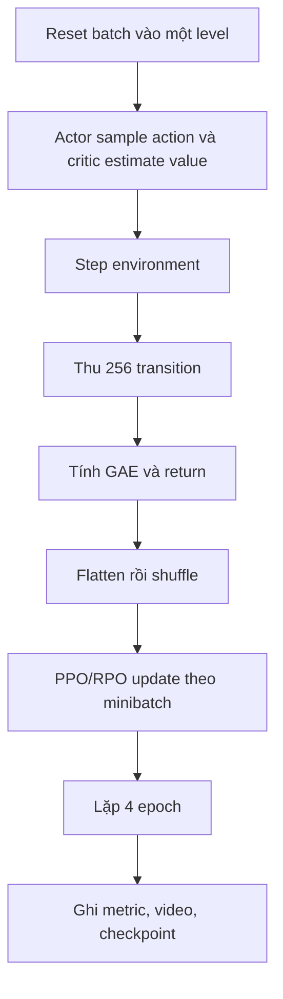

# Module `src/train_expert.py`

## Vai trò

Module train một expert actor-critic riêng cho mỗi cặp level/seed bằng PPO có RPO
perturbation. Expert chỉ dùng để sinh demonstration; flow policy cuối không load trực tiếp
network expert.

Mặc định có 12 level, 8 seed, 1.000 update, 256 environment, 256 rollout step và bốn
optimization epoch. Do đó mỗi expert nhìn `1000 × 256 × 256 = 65,536,000` environment
step
([`train_expert.py:25-57`](https://github.com/Physical-Intelligence/real-time-chunking-kinetix/blob/9296f31d62d5bfeb5779dcb2f9bcf71ca37f448b/src/train_expert.py#L25-L57)).

## Wrapper stack

```text
Kinetix-Symbolic-Continuous-v1
-> NoisyActionWrapper
-> ObsHistoryWrapper(history=4)
-> ActionHistoryWrapper
-> AutoReplayWrapper
-> DenseRewardWrapper
-> LogWrapper
-> BatchEnvWrapper(num_envs)
```

- `BatchEnvWrapper` dùng `jax.vmap` cho reset/step của nhiều environment cùng level.
- `NoisyActionWrapper` thêm Gaussian noise `std=0.1` trước physics step.
- `ObsHistoryWrapper` trả bốn observation gần nhất dưới dạng vector phẳng.
- `ActionHistoryWrapper` nối action hiện tại vào observation.
- `AutoReplayWrapper` reset về cùng level sau `done`.
- `DenseRewardWrapper` trừ distance penalty cho tới khi reward dương.
- `LogWrapper` thêm return, length và solved của episode vừa kết thúc.

Code wrapper nằm tại
[`train_expert.py:78-220`](https://github.com/Physical-Intelligence/real-time-chunking-kinetix/blob/9296f31d62d5bfeb5779dcb2f9bcf71ca37f448b/src/train_expert.py#L78-L220).

`StickyActionWrapper` cũng được định nghĩa nhưng không được gắn vào bất kỳ flow runtime nào.

## Action semantics

`Agent` có hai MLP độc lập:

- critic: `obs -> width -> width -> scalar value`;
- actor: `obs -> width -> width -> mean`, cộng một vector `logstd` học được.

Distribution được squash theo block:

- bốn motor binding qua `tanh`, miền `[-1, 1]`;
- hai thruster binding còn lại qua `sigmoid`, miền `[0, 1]`.

Điều này đến từ `make_squashed_normal_diag` và static config `4 + 2` binding
([`train_expert.py:61-75`](https://github.com/Physical-Intelligence/real-time-chunking-kinetix/blob/9296f31d62d5bfeb5779dcb2f9bcf71ca37f448b/src/train_expert.py#L61-L75),
[`train_expert.py:222-256`](https://github.com/Physical-Intelligence/real-time-chunking-kinetix/blob/9296f31d62d5bfeb5779dcb2f9bcf71ca37f448b/src/train_expert.py#L222-L256)).

## Luồng train



Actor loss là clipped PPO surrogate. Trước khi tính log probability mới, RPO cộng uniform
noise `[-rpo_alpha, rpo_alpha]` vào mean. Value loss cũng dùng clipped alternative; tổng
loss không có entropy bonus
([`train_expert.py:409-469`](https://github.com/Physical-Intelligence/real-time-chunking-kinetix/blob/9296f31d62d5bfeb5779dcb2f9bcf71ca37f448b/src/train_expert.py#L409-L469)).

Hai trục level và seed được `vmap`; output còn nhận một `NamedSharding` một chiều. Chưa chạy
JAX runtime nên báo cáo không kết luận dimension vật lý nào được shard trong module này.
Sau mỗi `log_interval=20` update, script kiểm NaN rồi ghi output
([`train_expert.py:504-550`](https://github.com/Physical-Intelligence/real-time-chunking-kinetix/blob/9296f31d62d5bfeb5779dcb2f9bcf71ca37f448b/src/train_expert.py#L504-L550)).

## Output contract

```text
logs-expert/<wandb-run-name>/
└── seed_<seed>/<update_idx>/
    ├── stats/worlds_l_<level>.json
    ├── videos/worlds_l_<level>.mp4
    └── policies/worlds_l_<level>.pkl
```

Stats chứa ít nhất loss, gradient norm, PPO diagnostics, reward trung bình và
`returned_episode_{returns,lengths,solved}`. Checkpoint chỉ chứa pure NNX state dict của
`Agent`.

## Giới hạn và bẫy

- `num_updates` phải chia hết cho `log_interval`; nếu không, vòng lặp cuối vẫn scan đủ
  `log_interval` và vượt số update yêu cầu.
- Trung bình episode chia cho số `returned_episode`; nếu batch không kết thúc episode nào,
  metric có thể NaN và làm dừng train.
- Video lấy environment đầu tiên của rollout, không phải rollout tốt nhất hay đại diện.
- `load_levels` assert static/dynamic params trong mọi JSON khớp config code; khác biệt nhỏ
  làm dừng trước train
  ([`train_expert.py:307-316`](https://github.com/Physical-Intelligence/real-time-chunking-kinetix/blob/9296f31d62d5bfeb5779dcb2f9bcf71ca37f448b/src/train_expert.py#L307-L316)).
