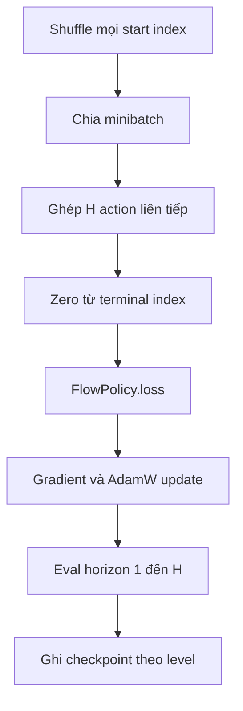

# Module `src/train_flow.py`

## Vai trò

Module biến demonstration thành action chunk liên tiếp, train một `FlowPolicy` riêng cho
mỗi level bằng behavior cloning và đánh giá policy sau mỗi epoch.

## Load và chuẩn hóa data

Module load song song một NPZ/level, stack thành `[level, step, env, ...]`, rồi đổi thành
`[level, env*step, ...]`. Dữ liệu được cắt để số start index hợp lệ chia hết cho batch size,
sau đó shard theo level lên local devices
([`train_flow.py:69-113`](https://github.com/Physical-Intelligence/real-time-chunking-kinetix/blob/9296f31d62d5bfeb5779dcb2f9bcf71ca37f448b/src/train_flow.py#L69-L113)).

Một training item tại index `i` là:

```text
input:  obs[i]
target: action[i : i + H]
```

Nếu `done` xuất hiện trong chunk, code zero action tại chính vị trí `done` và mọi vị trí
sau nó. Đây là hành vi `>= done_idx`, dù comment viết “after done”
([`train_flow.py:166-181`](https://github.com/Physical-Intelligence/real-time-chunking-kinetix/blob/9296f31d62d5bfeb5779dcb2f9bcf71ca37f448b/src/train_flow.py#L166-L181)).

**Inferred limitation:** phép flatten `l s e -> l (e s)` đặt toàn bộ step của từng
environment cạnh nhau. Các start index ở cuối trajectory của env `e` có thể tạo chunk nối
sang đầu env `e+1` mà không có `done` tại ranh giới nhân tạo. Code không loại các start
index này.

## Khởi tạo và optimizer

Mỗi level có một `FlowPolicy`, mặc định khởi tạo mới hoặc load state dict từ:

```text
<load-dir>/policies/worlds_l_<level>.pkl
```

Optimizer:

```text
global gradient clipping, norm=10
-> AdamW, learning_rate=3e-4, weight_decay=1e-2
-> linear warmup từ 0 trong 1000 step, sau đó constant
```

Graph được `vmap` theo level và shard theo cùng trục
([`train_flow.py:115-155`](https://github.com/Physical-Intelligence/real-time-chunking-kinetix/blob/9296f31d62d5bfeb5779dcb2f9bcf71ca37f448b/src/train_flow.py#L115-L155)).

## Một epoch



Sau train, module gọi `eval_flow.eval` tám lần cho execute horizon `1..H` với delay/method
trong `config.eval`. Mặc định đó là naive, delay 0 và 2048 rollout. Vì evaluation nằm trong
JIT/vmap của mỗi epoch, chi phí mặc định đáng kể
([`train_flow.py:157-208`](https://github.com/Physical-Intelligence/real-time-chunking-kinetix/blob/9296f31d62d5bfeb5779dcb2f9bcf71ca37f448b/src/train_flow.py#L157-L208)).

## Output

Metric train/eval được gửi đến WandB. Mỗi epoch ghi:

```text
logs-bc/<wandb-run-name>/<epoch>/policies/worlds_l_<level>.pkl
```

`eval_flow.eval` có trả video, nhưng `train_epoch` đặt `video=None`; nhánh ghi MP4 vì vậy
không chạy trong code hiện tại
([`train_flow.py:199-233`](https://github.com/Physical-Intelligence/real-time-chunking-kinetix/blob/9296f31d62d5bfeb5779dcb2f9bcf71ca37f448b/src/train_flow.py#L199-L233)).

## Training-time RTC

Không có trainer riêng. Khi `config.eval.model.simulated_delay` khác `None`, cùng
`FlowPolicy.loss` chuyển sang prefix-conditioned loss. `load_dir` cho phép fine-tune từ
checkpoint chuẩn. Vì config model nằm lồng dưới `eval`, control surface CLI cũng là
`--config.eval.model.simulated-delay`.

## Giới hạn

- Data và checkpoint không mang schema/config manifest; dimension được suy từ data/env.
- Toàn bộ NPZ của tất cả level được load vào host memory trước khi đưa lên device.
- Không có validation split; evaluation dùng simulator level giống tập demonstration.
- `valid_steps` được tính trước truncate nhưng string log dùng giá trị này cùng batch count;
  đây chỉ là diagnostic, không phải manifest.
