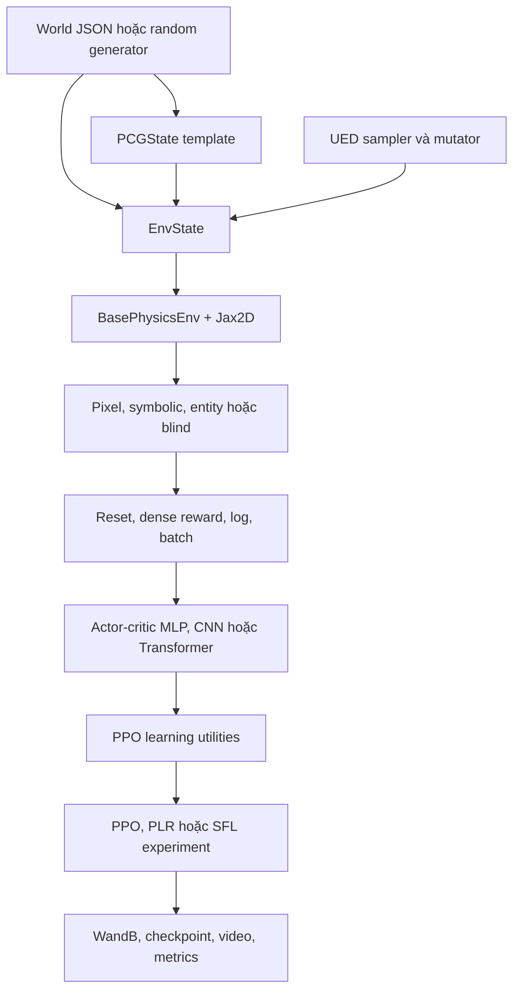

# Tổng quan code Kinetix

## Ý tưởng chính

Kinetix là framework reinforcement learning cho các bài toán điều khiển vật lý 2D, viết trên JAX. 

Một task là `EnvState` có số slot tĩnh cho polygon, circle, joint và thruster;
level xác định slot nào active, thuộc role nào và các tham số vật lý. Agent điều khiển motor và thruster để làm vật thể xanh chạm vật thể xanh dương, đồng thời tránh vật thể đỏ.

Dependency được đọc tại:

```text
third_party/01_real-time-chunking-kinetix/third_party/kinetix
```

**Verified:** báo cáo đối chiếu source tại commit
`cf7453ea103fa0b77348af1a39f689c658161613` ngày 2026-07-23. Không chạy training hoặc
editor; dependency CUDA chưa được cài hoàn chỉnh trong workspace.

## Kiến trúc



## Bản đồ subsystem

| Subsystem                                | Trách nhiệm                                              | Báo cáo                                                                        |
| ---------------------------------------- | ---------------------------------------------------------- | -------------------------------------------------------------------------------- |
| `environment`                          | State, action conversion, reward, physics step và wrapper | [Environment và state](details/03_environment_and_state.md)                      |
| `render`                               | Pixel, symbolic-flat và symbolic-entity observation       | [Action, observation và rendering](details/04_actions_observations_rendering.md) |
| `environment/ued`, `pcg`, `worlds` | Sinh, biến đổi, lấy mẫu và lưu level                | [UED, PCG và worlds](details/05_ued_pcg_worlds.md)                               |
| `models`                               | Actor-critic recurrent, CNN, Transformer và distribution  | [Model](details/06_models.md)                                                     |
| `util/learning`, `experiments`       | Rollout, PPO, evaluation, PLR và SFL                      | [Learning và experiments](details/07_learning_and_experiments.md)                |
| `configs`, `editor`, `examples`    | Hydra control surface, level editor và usage sample       | [Config, editor và examples](details/08_config_editor_examples.md)               |
| Toàn bộ file Python                    | Index vai trò và quan hệ import                         | [Module index](details/09_module_index.md)                                        |

## Environment contract

```text
reset/reset_to_level(rng, level, EnvParams)
    -> observation, state

step(rng, state, action, EnvParams)
    -> observation, next_state, reward, done, info
```

`StaticEnvParams` quyết định shape tĩnh và do đó ảnh hưởng JIT compilation: số polygon,
circle, joint, thruster, binding, screen size và `frame_skip`. `EnvParams` chứa giá trị có
thể thay đổi mà không đổi tensor shape như `max_timesteps`, timestep vật lý, motor power và
dense-reward scale. `EnvState` mở rộng Jax2D `SimState` bằng role, binding, density,
highlight và timestep
([`env_state.py`](../../../../third_party/01_real-time-chunking-kinetix/third_party/kinetix/kinetix/environment/env_state.py)).

## Ba luồng dùng chính

### Chạy level có sẵn

```text
JSON -> load_from_json_file -> EnvState
     -> make_kinetix_env_from_args(reset_type=replay)
     -> reset_to_level -> step
```

### Train trên level ngẫu nhiên

```text
UEDParams -> sample_kinetix_level
          -> AutoResetWrapper
          -> batched PPO rollout
```

### UED curriculum

```text
random/mutated levels
-> rollout và tính score/learnability
-> PLR replay buffer hoặc SFL top-learnable buffer
-> PPO update
```

## Quan hệ với repo RTC cha

`real-time-chunking-kinetix/src` chỉ dùng một lát nhỏ:

- `Kinetix-Symbolic-Continuous-v1`;
- `EnvState`, `EnvParams`, `StaticEnvParams`;
- `AutoReplayWrapper`, `LogWrapper` và wrapper base;
- JSON loader và pixel renderer.

Nó không dùng model, PPO/PLR/SFL, Hydra config, editor hoặc random UED pipeline của Kinetix.
Vì vậy code tồn tại trong submodule không đồng nghĩa nó tham gia RTC runtime.

## Các điểm cần thận trọng

- `AutoReplayWrapper` được định nghĩa hai lần; định nghĩa thứ hai shadow định nghĩa đầu.
- Continuous action space công bố toàn bộ dimension trong `[-1, 1]`, nhưng thruster bị clip
  về `[0, 1]` khi xử lý.
- `HybridActionDistribution` có trong model layer nhưng không có environment Hybrid trong
  factory hiện tại.
- `create_random_starting_distribution` gọi `create_empty_env` với signature cũ; đây là
  đường code có dấu hiệu lỗi nếu được gọi.
- World size `s`, `m`, `l` phải khớp static capacity; level lớn không load vào environment
  nhỏ.

## Cách đọc tiếp

- [Cách cài và chạy](02_usage.md)
- [Environment và state](details/03_environment_and_state.md)
- [Action, observation và rendering](details/04_actions_observations_rendering.md)
- [UED, PCG và world](details/05_ued_pcg_worlds.md)
- [Model](details/06_models.md)
- [Learning và experiments](details/07_learning_and_experiments.md)
- [Config, editor và examples](details/08_config_editor_examples.md)
- [Index toàn bộ module](details/09_module_index.md)
