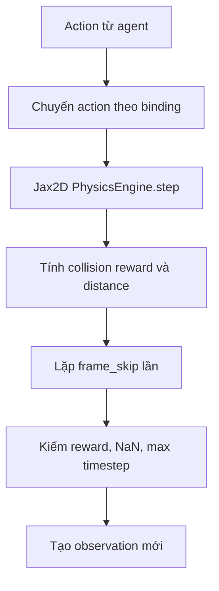

# Environment, state và wrapper

## State contract

`EnvState` kế thừa Jax2D `SimState` và thêm:

- binding motor/thruster;
- auto-motor flag;
- role cho polygon/circle;
- highlight và density;
- timestep.

`EnvParams` kế thừa physics `SimParams`, mặc định `max_timesteps=256`,
`pixels_per_unit=100`, `dense_reward_scale=0.1`. `StaticEnvParams` chứa capacity và các
giá trị shape-static như `screen_dim`, `downscale`, `frame_skip`, binding count
([`env_state.py`](../../../../../third_party/01_real-time-chunking-kinetix/third_party/kinetix/kinetix/environment/env_state.py)).

## Tạo environment

`make_kinetix_env_from_name` ánh xạ 11 tên đã đăng ký:

| Observation | Discrete | Continuous | Multi-discrete |
|---|---:|---:|---:|
| Pixels | có | có | có |
| Symbolic-flat | có | có | có |
| Entity | có | có | có |
| Blind | có | có | không |

`make_kinetix_env_from_args` còn gắn reset wrapper, chuyển interface UnderspecifiedEnv sang
Gymnax, thêm dense reward và log
([`env.py:148`](../../../../../third_party/01_real-time-chunking-kinetix/third_party/kinetix/kinetix/environment/env.py)).

## Physics step



Role convention:

```text
0 = normal
1 = green/agent target body
2 = blue/goal body
3 = red/death body
```

Code dùng tích role để nhận dạng va chạm: `1*2=2` là success, `1*3=3` là failure.
Nếu cả positive và negative collision cùng xuất hiện, negative thắng. Reward sparse là
`+1`, `-1` hoặc `0`; `GoalR=True` chỉ cho success. Episode kết thúc khi reward khác zero,
state có NaN hoặc đạt `max_timesteps`
([`env.py:487`](../../../../../third_party/01_real-time-chunking-kinetix/third_party/kinetix/kinetix/environment/env.py)).

## Wrapper

| Wrapper | Hành vi |
|---|---|
| `AutoResetWrapper` | Khi done, sample level mới bằng callback |
| `AutoReplayWrapper` | Khi done, reset về đúng level ban đầu |
| `UnderspecifiedToGymnaxWrapper` | Adapter interface JaxUED sang Gymnax |
| `BatchEnvWrapper` | `vmap` reset/step qua nhiều environment |
| `DenseRewardWrapper` | Thêm reward theo giảm khoảng cách goal |
| `LogWrapper` | Theo dõi return, length, solved và episode boundary |

`DenseRewardWrapper` dùng thay đổi distance giữa hai step; step đầu sau reset không thêm
dense reward. `LogWrapper` giữ metric episode vừa return trong `info`
([`wrappers.py`](../../../../../third_party/01_real-time-chunking-kinetix/third_party/kinetix/kinetix/environment/wrappers.py)).

## Utility permutation

`environment/utils.py` hoán vị slot polygon, circle, joint và binding liên quan trong state
hoặc PCG state. Mục đích là giảm phụ thuộc vào thứ tự slot khi training; mọi index joint,
thruster và collision matrix phải được remap đồng bộ
([`utils.py`](../../../../../third_party/01_real-time-chunking-kinetix/third_party/kinetix/kinetix/environment/utils.py)).

## Code quirks

- `AutoReplayWrapper` có hai định nghĩa cùng tên; Python chỉ giữ định nghĩa thứ hai.
- `BasePhysicsEnv.step` được khai báo nhưng raise `NotImplementedError`; runtime thường dựa
  vào wrapper Gymnax gọi `step_env`.
- Dense reward dùng cả `params.dense_reward_scale` và `self.dense_reward_scale`, nên khi
  cả hai khác 1, scale hiệu dụng là tích hai giá trị.
- `done = dones.sum() > 0 | ...` phụ thuộc precedence toán tử; cần test nếu sửa termination.

