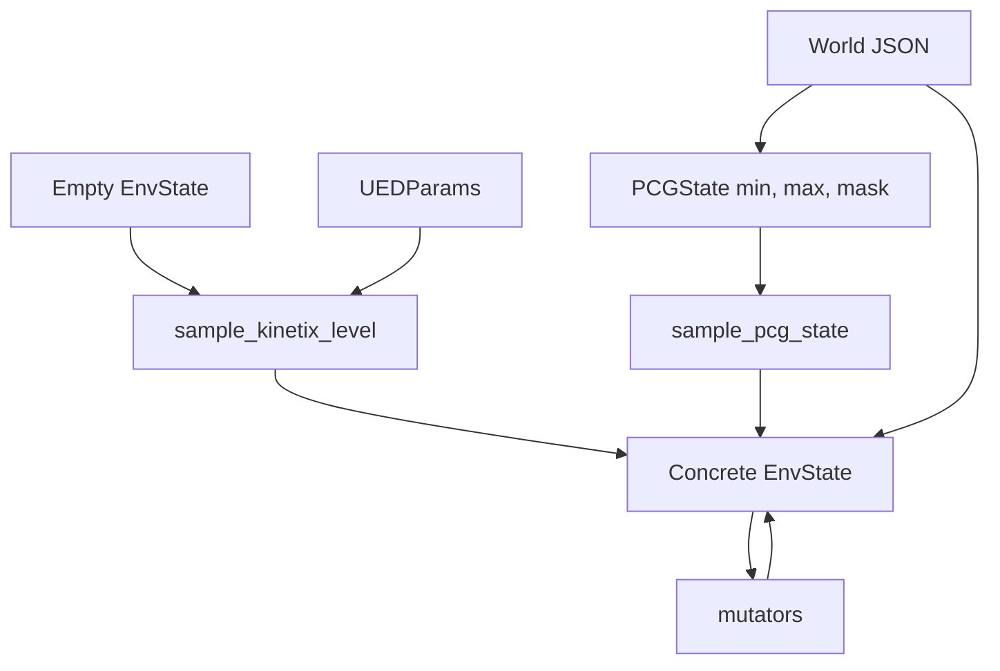

# UED, PCG và world representation

## Hai cơ chế tạo biến thể level

Kinetix có hai khái niệm liên quan nhưng khác nhau:

- **UED generation/mutation:** tạo hoặc sửa trực tiếp `EnvState` bằng quy tắc cấu trúc;
- **PCG template sampling:** lấy mẫu từng leaf trong khoảng min/max theo mask của
  `PCGState`.



## UED sampler

`UEDParams` điều khiển kích thước, joint/motor, fixture, thruster, role và xác suất thêm
shape. `sample_kinetix_level`:

1. tạo state rỗng và chọn role của floor;
2. thêm green và blue body;
3. ép level có motor, thruster hoặc cả hai;
4. thêm các shape/joint/thruster còn lại;
5. chọn proposal ít collision;
6. có thể hoán đổi green/blue rồi permute slot.

([`distributions.py:118`](../../../../../third_party/01_real-time-chunking-kinetix/third_party/kinetix/kinetix/environment/ued/distributions.py),
[`ued_state.py`](../../../../../third_party/01_real-time-chunking-kinetix/third_party/kinetix/kinetix/environment/ued/ued_state.py)).

`create_vmapped_filtered_distribution` oversample level và hạ xác suất chọn level giải được
bằng no-op. Nó không chứng minh level solvable; chỉ lọc một failure mode dễ.

## Mutator

`mutators.py` cung cấp:

- thêm/xóa shape hoặc connected shape;
- thêm/xóa joint;
- đổi role hoặc fixture;
- thêm/xóa thruster;
- đổi gravity;
- đổi size, location và rotation.

`make_mutate_env` chọn mutation theo capacity còn trống và trạng thái level. Một số mutation
trong danh sách có probability zero ở implementation hiện tại, nên “có function” không đồng
nghĩa luôn được curriculum gọi
([`ued.py:51`](../../../../../third_party/01_real-time-chunking-kinetix/third_party/kinetix/kinetix/environment/ued/ued.py)).

`util.py` chứa primitive để sample geometry, role, vị trí trên shape, thêm rigid body,
thruster và zero velocity.

## PCG state

`PCGState` gồm:

```text
env_state          = giá trị min/base
env_state_max      = giá trị max
env_state_pcg_mask = leaf nào được sample
tied_together      = shape nào giữ cùng delta vị trí
```

`sample_pcg_state` split RNG theo pytree leaf, sample uniform giữa min/max tại leaf được
mask, làm tròn int/bool, áp quan hệ tied position, recompute joint position, mass và inertia
([`pcg_state.py`](../../../../../third_party/01_real-time-chunking-kinetix/third_party/kinetix/kinetix/pcg/pcg_state.py),
[`pcg.py`](../../../../../third_party/01_real-time-chunking-kinetix/third_party/kinetix/kinetix/pcg/pcg.py)).

`env_state_to_pcg_state` tạo template degenerate: mask false và min=max, nghĩa là replay
đúng một concrete level.

## World JSON và serialization

Vendored repo có:

```text
worlds/s: 10 level
worlds/m: 24 level
worlds/l: 40 level
```

Mỗi JSON có `env_state`, `env_params`, `static_env_params`. `saving.py` import JSON về typed
state, expand state cũ sang capacity mới, serialize checkpoint và tích hợp WandB artifact
([`saving.py`](../../../../../third_party/01_real-time-chunking-kinetix/third_party/kinetix/kinetix/util/saving.py)).

Size letter là capacity, không phải difficulty guarantee. Loader/training config phải dùng
`env_size` tương thích.

## Code quirks và unknown

- `create_random_starting_distribution` gọi `create_empty_env(env_params,
  static_env_params)`, trong khi signature hiện tại nhận một `static_env_params`. Đây là
  **inferred bug** ở path được `plr.py` import.
- `make_create_eval_env` tham chiếu các path `worlds/eval/...` không có trong checkout và
  chứa return thứ hai unreachable. Có vẻ là legacy path.
- JSON import chuẩn hóa một số field về default (`downscale`, `screen_dim`), nên không phải
  mọi field render round-trip nguyên xi.
- Random generation đảm bảo có control mechanism, không đảm bảo task thực sự solvable.

