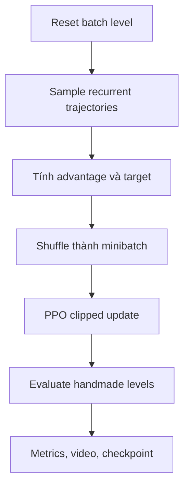

# Learning utilities và experiments

## `util/learning.py`

Module gom primitive dùng chung:

- load/group evaluation levels;
- recurrent evaluation và render video;
- GAE;
- rollout trajectory;
- PPO actor-critic minibatch update;
- rollout + learn orchestration;
- no-op/random rollout để filter/score level.

Luồng chung:



([`learning.py`](../../../../../third_party/01_real-time-chunking-kinetix/third_party/kinetix/kinetix/util/learning.py)).

## PPO experiment

`experiments/ppo.py` là baseline:

1. normalize Hydra config và tạo params;
2. tạo random-level reset hoặc list-level reset;
3. gắn AutoReset cho train, AutoReplay cho eval;
4. gắn dense reward, log và batch wrapper;
5. tạo network/optimizer;
6. rollout, GAE, PPO update;
7. định kỳ eval, WandB và checkpoint.

Đây là đường đơn giản nhất để hiểu training stack
([`ppo.py`](../../../../../third_party/01_real-time-chunking-kinetix/third_party/kinetix/experiments/ppo.py)).

## PLR experiment

`experiments/plr.py` dùng JaxUED `LevelSampler` và ba update state:

```text
DR       = sample level mới
REPLAY   = lấy level từ replay buffer
MUTATE   = biến đổi level đã có
```

Nó tính score theo config, cập nhật buffer, log complexity/UED metrics rồi học policy bằng
shared learning utility. Script hỗ trợ các biến thể PLR/DR/ACCEL thông qua Hydra config
([`plr.py`](../../../../../third_party/01_real-time-chunking-kinetix/third_party/kinetix/experiments/plr.py)).

## SFL experiment

`experiments/sfl.py`:

1. sample nhiều candidate level;
2. rollout policy để ước lượng learnability;
3. giữ level có score phù hợp trong buffer;
4. trộn sampled-buffer level với random level;
5. PPO update và định kỳ resample buffer.

SFL có implementation rollout/evaluation riêng và dùng safetensors helper ngoài shared
checkpoint path
([`sfl.py`](../../../../../third_party/01_real-time-chunking-kinetix/third_party/kinetix/experiments/sfl.py)).

## Output

Tùy `misc` config, experiment có thể:

- log metric/video lên WandB;
- save checkpoint cục bộ;
- restore WandB artifact;
- nén log sau run.

`util/config.py` normalize Hydra config, tạo `EnvParams/StaticEnvParams/UEDParams`, đặt
WandB group/tags và chọn video frequency
([`config.py`](../../../../../third_party/01_real-time-chunking-kinetix/third_party/kinetix/kinetix/util/config.py)).
`util/saving.py` xử lý checkpoint/artefact.

## Giới hạn

- Ba experiment là script nghiên cứu lớn, không phải library API ổn định.
- PPO, PLR và SFL lặp lại một phần rollout/checkpoint logic; behavior không hoàn toàn đồng
  nhất.
- Runtime truth về throughput, memory, metric và checkpoint chưa được kiểm tra trong
  workspace.
- PLR import `create_random_starting_distribution`, path có signature mismatch đã nêu ở
  báo cáo UED.

