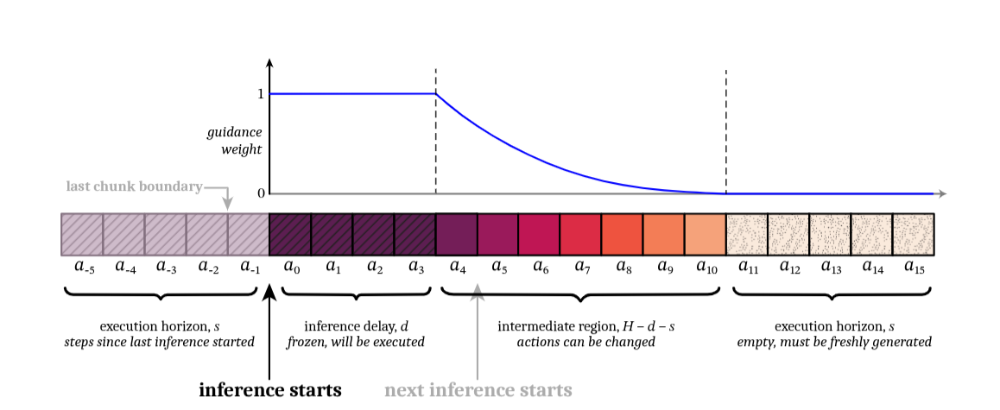
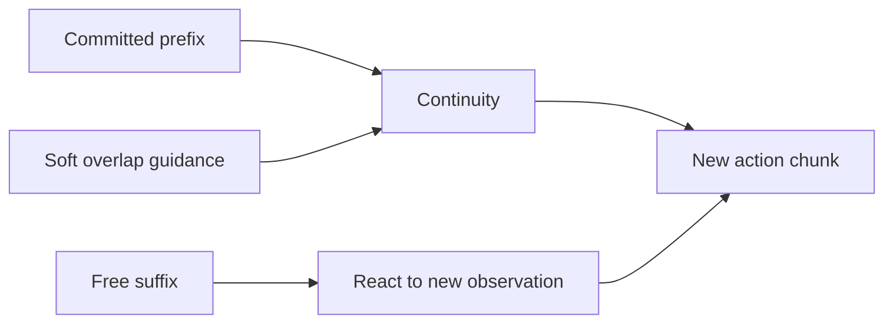

# Soft masking và độ ổn định khi lấy mẫu

## Mục đích

Ràng buộc cứng chỉ trên `d` action đã cam kết có thể quá yếu khi `d` nhỏ: chunk mới vẫn có
thể khớp với prefix ngắn nhưng chuyển sang một chiến lược khác ngay phía sau.

Soft masking mở rộng guidance sang toàn bộ phần chồng lấn giữa hai chunk liên tiếp, với
trọng số giảm dần theo thời gian để giữ quỹ đạo liên tục nhưng vẫn cho phép thích nghi với
quan sát mới.

Mỗi chunk mới có ba vùng:

| Vùng          |               Trọng số | Ý nghĩa                                                       |
| -------------- | -----------------------: | --------------------------------------------------------------- |
| `i < d`      |                    `1` | Action đã cam kết, phải giữ nguyên.                       |
| `d <= i < e` | giảm dần từ`1 → 0` | Khuyến khích giữ kế hoạch cũ nhưng cho phép thay đổi. |
| `i >= e`     |                    `0` | Không còn guidance, sinh hoàn toàn tự do.                  |

Paper sử dụng lịch suy giảm theo hàm mũ (exponential) làm mặc định và so sánh với linear,
hard-prefix (`zeros`) và all-ones (`ones`) trong ablation.



---

## Công thức

Code trước hết giới hạn

$$
d \leftarrow \min(d,e).
$$

Linear weight được tính bởi

$$
\bar w_i=
\operatorname{clip}
\left(
\frac{d-1-i}{e-d+1}+1,\ 0,\ 1
\right).
$$

Sau đó:

### Linear

$$
w_i^{\text{linear}}=
\begin{cases}
\bar w_i,&i<e,\\
0,&i\ge e.
\end{cases}
$$

### Exponential

$$
w_i^{\text{exp}}=
\begin{cases}
\displaystyle
\bar w_i
\frac{\exp(\bar w_i)-1}
{\mathrm e-1},
&i<e,\\
0,&i\ge e.
\end{cases}
$$

### Hard prefix

$$
w_i^{\text{zeros}}
=\mathbf1[i<d].
$$

### All ones

$$
w_i^{\text{ones}}
=\mathbf1[i<e].
$$

Trong công thức exponential, mẫu số $\mathrm e-1$ là hằng số Euler (`jnp.e-1`), không phải `end`.

---

## Ví dụ

Giả sử

- Chunk horizon: `H = 8`
- Inference delay: `d = 2`
- Prefix horizon: `e = 6`

Chunk trước:

```text
C₁ = [a₀ a₁ a₂ a₃ a₄ a₅ a₆ a₇]
```

Sau khi thực thi `a₀,a₁`, chunk mới được sinh:

```text
C₂ = [b₀ b₁ b₂ b₃ b₄ b₅ b₆ b₇]
```

Trong đó

```text
b₀ ↔ a₂
b₁ ↔ a₃
b₂ ↔ a₄
b₃ ↔ a₅
b₄ ↔ a₆
b₅ ↔ a₇
```

### Linear

```text
Weight:
[1, 1, 0.8, 0.6, 0.4, 0.2, 0, 0]
```

### Exponential

```text
Weight:
[1, 1, 0.571, 0.287, 0.115, 0.026, 0, 0]
```

### Hard prefix (`zeros`)

```text
Weight:
[1, 1, 0, 0, 0, 0, 0, 0]
```

### All ones (`ones`)

```text
Weight:
[1, 1, 1, 1, 1, 1, 0, 0]
```

Có thể hình dung như sau:

```text
Chunk 1

a0  a1 | a2  a3  a4  a5  a6  a7
^^^^^^
Đã thực thi


Chunk 2

        b0  b1  b2  b3  b4  b5  b6  b7
        │   │   │   │   │   │
        │   │   └────── overlap ──────┘
        └── hard prefix ──┘      free
```

Exponential giảm mạnh hơn linear nên giữ rất chắc các action gần hiện tại nhưng gần như bỏ
hoàn toàn guidance ở cuối vùng overlap.

---

## Vì sao clipping giúp ổn định

Hệ số pseudoinverse guidance có điểm kỳ dị tại `τ=0`. Robot chỉ thực hiện khoảng năm bước
flow nên nếu không giới hạn guidance, hiệu chỉnh đầu tiên có thể rất lớn và làm trajectory
bị giật hoặc phân kỳ.

Paper giới hạn guidance bởi một giá trị cực đại `β`. Ablation trong mô phỏng cho thấy tăng
`β` lớn hơn `5` không đem lại thêm lợi ích đáng kể nên các thí nghiệm sử dụng

$$
\beta = 5.
$$

Đây là một lựa chọn thực nghiệm của paper, không phải hằng số phổ quát.

---

## Tương tác với khả năng phản ứng



- Hard prefix đảm bảo các action đã cam kết không thay đổi.
- Soft guidance giữ quỹ đạo chuyển tiếp mượt.
- Free suffix cho phép policy phản ứng với quan sát mới.

Ablation cho thấy:

- Exponential tốt nhất.
- Linear rất gần.
- Hard masking (`zeros`) kém nhất khi execution horizon ngắn.

---

## Giới hạn

- **Đã xác minh:** Soft masking chỉ được dùng trong inference.
- **Đã xác minh:** Training vẫn chỉ condition trên hard prefix.
- **Đã xác minh:** Paper chỉ so sánh các lịch trong mô phỏng.
- **Suy luận:** Khi thay đổi số bước flow hoặc policy, có thể cần tinh chỉnh lại `β`, lịch và độ dài overlap.
- **Chưa biết:** Chưa có lịch adaptive theo độ bất định hoặc thay đổi của cảnh.

---

## Bằng chứng

- *Real-Time Execution of Action Chunking Flow Policies*, Section 3.2, Eq. (5), Appendix A.2 và A.4.
- `model.py`, dòng 40–63 của implementation chính thức.
