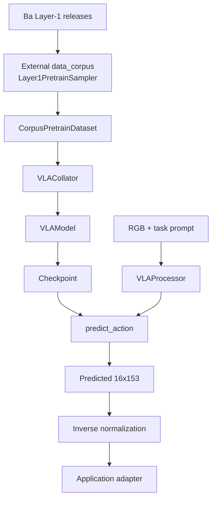

# Setup và runtime guide cho `vla-core`

## Mục tiêu và trạng thái

Guide này mô tả cách nối Layer-1 corpus với
[`third_party/02_vla_core`](../../../third_party/02_vla_core), kiểm môi trường,
chạy smoke test, pretraining và đánh giá khả năng inference.

Đọc trước:

- [phân tích ba dataset](01_dataset_analysis.md);
- [ingestion và runtime contract](02_ingestion_runtime.md);
- [runtime audit của `vla-core`](../03-vla-core/runtime_status.md).

Kết luận tại snapshot 2026-07-27:

| Capability                            | Trạng thái                                                  |
| ------------------------------------- | ------------------------------------------------------------- |
| Action-head CPU unit tests            | Có test, nhưng môi trường hiện tại thiếu Torch        |
| Layer-1 dataset adapter               | Có wrapper, phụ thuộc external`data_corpus`              |
| Single-process training loop          | Có code                                                      |
| Multi-GPU DDP                         | **Chưa có**, dù docstring nói hỗ trợ `torchrun` |
| Checkpoint save                       | Có model state + step                                        |
| Resume optimizer/training             | Chưa có                                                     |
| Inference core API                    | Có`predict_action()` và flow sampler                      |
| Inference CLI/service                 | Chưa có                                                     |
| Action normalization/de-normalization | Chưa được wire                                            |
| Robot command/execution adapter       | Chưa có                                                     |

Training chỉ có thể bắt đầu sau khi cung cấp đúng `data_corpus`, production
releases, dependency environment và normalization contract. Research inference
có thể xây trên model API, nhưng robot inference/deployment chưa khả dụng.

## 1. Kiến trúc kết nối



Ba khối cuối `inverse normalization → application adapter → execution` chưa có
implementation trong repository.

## 2. Trạng thái máy local hiện tại

Đã kiểm trực tiếp:

```text
System Python : 3.14.4
Workspace venv: Python 3.12.13
GPU           : NVIDIA GeForce MX350, 2.048 MiB
Driver        : 580.173.02
Disk free     : 116 GiB
FFmpeg        : 8.0.1
```

Root `.venv` hiện có NumPy 2.5.1, PyArrow 25.0.0 và HDF5 3.14.0, nhưng thiếu:

```text
torch
transformers
Pillow
opencv-python
corpus / data_corpus
```

Ba path hard-code trong
[`configs/releases.json`](../../../third_party/02_vla_core/configs/releases.json)
đều không tồn tại trên máy:

```text
/mnt/SSD4/dataset/releases/egodex_v06
/mnt/SSD4/dataset/releases/egoverse_v06
/mnt/SSD4/dataset/releases/xp10m_v06
```

Qwen `Qwen/Qwen3.5-0.8B` chưa có trong local Hugging Face cache và không có
checkpoint `vla-core` `.pt/.ckpt` trong workspace.

MX350 2 GB không đủ ngân sách an toàn cho full Qwen backbone, 24-block action
head, activations và optimizer state. Chỉ nên dùng máy này cho static checks,
dataset inspection và CPU-sized unit tests; full smoke/training cần host GPU
khác sau khi đo memory.

## 3. Remote training server `tho2@100.89.98.89`

### Kết nối

Thông tin trong `notes/server_connection.txt`:

```bash
ssh tho2@100.89.98.89
cd /home/tho2/Dung_Workspace
```

Không ghi password, private key hoặc token vào report/repository. SSH key hoặc
credential phải được quản lý ngoài workspace.

SSH preflight read-only đã thành công:

| Thuộc tính                   | Giá trị đã xác minh      |
| ------------------------------ | ----------------------------- |
| Hostname                       | `neuweb5090`                |
| User/home                      | `tho2`, `/home/tho2`      |
| Code workspace                 | `/home/tho2/Dung_Workspace` |
| Python                         | 3.12.3                        |
| GPU                            | 2 × NVIDIA GeForce RTX 5090  |
| VRAM                           | 32.607 MiB/GPU                |
| Driver                         | 595.71.05                     |
| FFmpeg/Git                     | có                           |
| `uv`, Conda, `nvcc`, Torch | chưa có trong default shell |

`/home/tho2/Dung_Workspace` đang trống tại thời điểm kiểm tra. Default Python
chưa có Torch, Transformers, NumPy, OpenCV, PyArrow, HDF5 hoặc `corpus`.
External `data_corpus` cũng chưa tìm thấy trên SSD4.

### GPU availability

Tại thời điểm preflight, cả hai GPU đang 100% utilization và chỉ còn khoảng
1,7–2,0 GB VRAM trống. Đây là snapshot dễ thay đổi, không phải quota cố định.
Không bắt đầu job trước khi xác nhận GPU rảnh và quyền sử dụng:

```bash
ssh tho2@100.89.98.89
nvidia-smi
nvidia-smi \
  --query-gpu=index,name,memory.total,memory.free,utilization.gpu,temperature.gpu \
  --format=csv
```

Training loop hiện chỉ chạy single process. Khi GPU được cấp:

```bash
export CUDA_VISIBLE_DEVICES=<physical_gpu_index>
python -m train.pretrain ... --device cuda:0
```

Sau `CUDA_VISIBLE_DEVICES`, `cuda:0` là GPU đầu tiên trong tập visible, không
nhất thiết là physical GPU 0. Không dùng đồng thời hai GPU vì DDP chưa có.

### Storage và production releases

Filesystem root/home còn khoảng 138 GB và đã dùng 93%; không copy corpus hoặc
đặt Hugging Face cache/checkpoint lớn ở home.

Các mount đã xác minh:

| Mount                        |      Available | Quyền của`tho2` |
| ---------------------------- | -------------: | ------------------- |
| `/mnt/SSD4`                | khoảng 1,2 TB | read/write          |
| `/mnt/SSD3`                | khoảng 1,8 TB | read-only           |
| `/mnt/HDD1`                |  khoảng 13 TB | read/write          |
| `/mnt/SSD1`, `/mnt/SSD2` |             — | không đọc/ghi    |

Ba production release đã tồn tại đúng path mà `vla-core` config dùng:

```text
/mnt/SSD4/dataset/releases/egodex_v06    245 GB
/mnt/SSD4/dataset/releases/egoverse_v06   76 GB
/mnt/SSD4/dataset/releases/xp10m_v06      47 GB
```

Cả ba có `manifest.parquet`. Vì vậy trên server có thể giữ nguyên
`configs/releases.json`; không cần copy 368 GB release vào
`Dung_Workspace`.

Chọn một thư mục riêng của `tho2` trên SSD4 cho environment, model cache và
fast checkpoints sau khi xác nhận convention của shared storage:

```bash
export VLA_STORAGE=/mnt/SSD4/<tho2-owned-dir>
export HF_HOME="$VLA_STORAGE/huggingface"
export TORCH_HOME="$VLA_STORAGE/torch"
export VLA_RUNS="$VLA_STORAGE/vla-runs"
```

Checkpoint/archive dài hạn có thể chuyển sang thư mục riêng trên HDD1. Không
ghi trực tiếp vào root của mount hoặc thư mục dataset release.

### Đưa code lên server

Ưu tiên Git nếu repository remote đã được cấu hình:

```bash
ssh tho2@100.89.98.89
cd ~/Dung_Workspace
git clone <authorized-repository-url> VinRobotics
```

Nếu cần chuyển đúng working tree local chưa commit, dùng `rsync` không kèm dataset/artifact và không dùng `--delete`:

```bash
rsync -az \
  --exclude '.git/' \
  --exclude '.venv/' \
  --exclude 'dataset/' \
  --exclude 'output/' \
  /home/dung/Workspace/VinRobotics/ \
  tho2@100.89.98.89:/home/tho2/Dung_Workspace/VinRobotics/
```

`data_corpus` phải được clone/sync riêng và pin revision, ví dụ:

```text
/home/tho2/Dung_Workspace/data_corpus
/home/tho2/Dung_Workspace/VinRobotics/third_party/02_vla_core
```

Các lệnh clone/rsync ở trên là setup hướng dẫn; chưa được thực thi trong lần
audit này.

### Environment trên server

Server có Python 3.12.3 nên có thể dùng `venv` trực tiếp:

```bash
ssh tho2@100.89.98.89

export VLA_STORAGE=/mnt/SSD4/<tho2-owned-dir>
python3 -m venv "$VLA_STORAGE/envs/vla-core"
source "$VLA_STORAGE/envs/vla-core/bin/activate"
python -m pip install --upgrade pip

cd ~/Dung_Workspace/VinRobotics/third_party/02_vla_core
```

Tiếp tục cài dependency và chạy preflight theo mục 4. Không cần system `nvcc`
nếu dùng PyTorch wheel đã đóng gói CUDA runtime phù hợp, nhưng vẫn phải xác
minh `torch.cuda.is_available()` và một CUDA tensor operation trước model run.

## 4. Chuẩn bị dependency

Repository `vla-core` không có `pyproject.toml`, `requirements.txt` hay lockfile.
Do đó chưa có một lệnh install tái lập chính thức.

Nên dùng Python 3.12 và environment riêng trong nested repository:

```bash
cd /home/dung/Workspace/VinRobotics/third_party/02_vla_core
python3.12 -m venv .venv
source .venv/bin/activate
python -m pip install --upgrade pip
```

Sau đó:

1. Cài PyTorch build phù hợp CUDA/driver của training host.
2. Cài một Transformers revision thực sự export
   `Qwen3_5ForConditionalGeneration`.
3. Cài minimum direct imports: Pillow, NumPy, OpenCV và pytest.
4. Cài external `data_corpus` ở đúng revision:

```bash
python -m pip install -e /absolute/path/to/data_corpus
```

Danh sách trên được suy ra từ import graph, **không phải lockfile đã xác minh**.
Trước real run phải tạo dependency lock và ghi:

- Python/PyTorch/CUDA/Transformers versions;
- Qwen model revision;
- `data_corpus` commit;
- `vla-core` commit và dirty state.

Preflight import:

```bash
python - <<'PY'
import cv2
import torch
import transformers
from PIL import Image
from transformers import Qwen3_5ForConditionalGeneration
from corpus.labels.pretrain_loader import Layer1PretrainSampler

print("torch", torch.__version__)
print("transformers", transformers.__version__)
print("cuda", torch.cuda.is_available())
print("gpu", torch.cuda.get_device_name(0) if torch.cuda.is_available() else "none")
PY
```

Nếu import `Qwen3_5ForConditionalGeneration` lỗi, không đổi model class một cách
đoán mò; pin đúng Transformers revision mà checkpoint/model code được tạo với.

## 5. Kết nối Layer-1 releases

`CorpusPretrainDataset` nhận map:

```json
{
  "egodex": "/absolute/path/to/egodex_v06",
  "egoverse": "/absolute/path/to/egoverse_v06",
  "xp10m": "/absolute/path/to/xp10m_v06"
}
```

Nên lưu local config dưới `runs/<run>/releases.json`, vì `runs/` đã được
gitignore. Không sửa `configs/releases.json` thành path chỉ tồn tại trên một máy
rồi commit.

Mỗi release root phải chứa layout mà external
`Layer1PretrainSampler` mong đợi, gồm ít nhất manifest, annotations,
narratives, media references và optional streams.

Không mặc định map cả ba key vào cùng
`dataset/corpus_sample_bundle/corpus`. Bundle là mixed-source integration
fixture, còn interface chính xác của external sampler chưa có trong workspace.
Chỉ dùng bundle cho training smoke sau khi `data_corpus` xác nhận hỗ trợ một
mixed release root.

### Preflight release

```bash
export VLA_CORE_ROOT=/home/dung/Workspace/VinRobotics/third_party/02_vla_core
export DATA_CORPUS_SRC=/absolute/path/to/data_corpus/src
export PYTHONPATH="$DATA_CORPUS_SRC:$VLA_CORE_ROOT"

cd "$VLA_CORE_ROOT"
python - <<'PY'
import json
from pathlib import Path
from corpus.labels.pretrain_loader import Layer1PretrainSampler

cfg = json.loads(Path("runs/local/releases.json").read_text())
for source, root in cfg.items():
    path = Path(root)
    assert path.is_dir(), (source, path)
    assert (path / "manifest.parquet").is_file(), (source, path)

sampler = Layer1PretrainSampler(cfg, n_steps=16, action_hz=10.0, part="train")
print("clips", len(sampler.clips))
print("first", sampler.clips[0])
PY
```

Exact release-root contract vẫn phải lấy từ revision `data_corpus` được pin;
assert trên chỉ là kiểm tra tối thiểu.

## 6. Thứ tự smoke test

### 6.1 Static và config

```bash
cd /home/dung/Workspace/VinRobotics
python3 -m compileall -q third_party/02_vla_core
python3 -m json.tool third_party/02_vla_core/configs/releases.json >/dev/null
```

Hai lệnh này đã pass trên snapshot hiện tại. Chúng không chứng minh dependency
hoặc model runtime hoạt động.

### 6.2 Unit tests không tải Qwen

```bash
cd third_party/02_vla_core
python -m pytest -q tests/test_action_head.py tests/test_utils_extract.py
```

Test kiểm action-head forward, gradient, optional proprio và padding-mask
isolation. Hiện test collection dừng ở `ModuleNotFoundError: torch`.

### 6.3 Dataset item

```bash
cd third_party/02_vla_core
export PYTHONPATH="/absolute/path/to/data_corpus/src:$PWD"

python - <<'PY'
import json
from data.corpus_dataset import CorpusPretrainDataset

releases = json.load(open("runs/local/releases.json"))
ds = CorpusPretrainDataset(
    releases,
    part="train",
    n_steps=16,
    action_hz=10.0,
    window_stride_s=2.0,
)
print("windows", len(ds))
item = ds[0]
print(item["image"].shape, item["image"].dtype)
print(item["actions"].shape, item["action_mask"].shape)
print(item["source"], item["clip_id"], item["text"])
PY
```

Expected:

```text
image       H×W×3 uint8 RGB
actions     16×153 float32
action_mask 16×153 float32
```

EgoDex decode gọi FFmpeg subprocess vì production media là AV1.

### 6.4 Overfit smoke

Chỉ chạy trên GPU đủ memory:

```bash
cd third_party/02_vla_core
export PYTHONPATH="/absolute/path/to/data_corpus/src:$PWD"

python -m train.pretrain \
  --releases-json runs/local/releases.json \
  --steps 20 \
  --overfit 4 \
  --batch 1 \
  --accum 1 \
  --workers 0 \
  --log-every 1 \
  --save-every 20 \
  --out runs/smoke \
  --device cuda:0
```

Success criteria:

- Qwen/model/processor load;
- dataset decode và collate không lỗi;
- `total_loss`, `action_loss`, `narrative_loss` finite;
- loss giảm rõ trên bốn window cố định;
- `runs/smoke/ckpt_final.pt` sinh ra và load lại strict được.

`--workers 0`, batch 1 và overfit nhỏ giúp tách lỗi data/model trước khi thêm
parallel I/O.

## 7. Training

Sau khi overfit smoke pass:

```bash
python -m train.pretrain \
  --releases-json runs/run1/releases.json \
  --steps 100000 \
  --batch 8 \
  --accum 4 \
  --workers 8 \
  --lr 1e-4 \
  --tau 0.5 \
  --log-every 20 \
  --save-every 2000 \
  --out runs/run1 \
  --device cuda:0
```

Effective batch của loop single-process là `batch × accum = 32`.

### Blocker trước real training

Action head ghi rõ target phải được normalize, nhưng repository không có
`data/norm.py`, action-normalization config hoặc transform được gọi trong
`CorpusPretrainDataset`/training loop. `pack_actions()` hiện copy giá trị
metric/rotation trực tiếp.

Không nên chạy 100k-step job cho đến khi:

1. xác định normalization có nằm trong external sampler hay không;
2. nếu không, fit train-only statistics và wire normalize trước loss;
3. lưu artifact cùng manifest hash/source revisions;
4. implement inverse transform cho inference.

### Giới hạn training loop hiện tại

- Không có validation/eval loop.
- Không có LR scheduler hoặc early stopping.
- Không có resume optimizer/step/RNG/dataloader state.
- Checkpoint chỉ chứa `model` và `step`.
- `config.json` chỉ lưu CLI args, không lưu full `VLAConfig`, dependency/model
  revision hoặc normalization.
- Không có checkpoint retention policy.

### Không dùng `torchrun`

Docstring nói single/multi-GPU DDP, nhưng code không gọi
`torch.distributed.init_process_group`, không wrap
`DistributedDataParallel` và không dùng distributed sampler.

`torchrun` hiện sẽ launch nhiều training process độc lập, cùng ghi vào một
output directory. Chỉ dùng single process cho đến khi DDP được implement và
test.

## 8. Checkpoint và reproducibility

Checkpoint hiện có:

```python
{
    "model": model.state_dict(),
    "step": step,
}
```

Để load strict, phải dựng lại:

- exact `VLAConfig` (`153` dimensions, `16` steps, `proprio_dim=None`);
- exact Qwen model/revision;
- cùng code shape/action-head architecture;
- cùng Transformers behavior.

Một production checkpoint nên bổ sung:

- optimizer/scheduler/scaler;
- full model/training config;
- normalization artifact + hash;
- release manifests/checksums;
- code/dependency/model revisions;
- RNG states;
- current epoch/sampler state.

Không có checkpoint nào trong workspace để test load/resume.

## 9. Inference: phần nào khả thi?

### Có trong model API

`VLAModel.predict_action()` thực hiện:

1. Qwen generate narrative;
2. re-encode prompt + generated narrative;
3. lấy vision/narrative hidden states;
4. Euler-integrate flow field qua 4 step;
5. trả tensor `(B,16,153)`.

`VLAProcessor.build_inference_inputs()` nhận 1–3 PIL images, task và optional
history.

### Chưa có

- inference CLI/service;
- image/video observation adapter;
- checkpoint discovery/versioning;
- action de-normalization;
- deterministic seed plumbing qua `predict_action`;
- conversion từ 153-D human head/hand representation sang robot joints/EEF;
- safety constraint, receding-horizon executor hoặc robot interface;
- evaluation benchmark/metric.

Vì vậy “inference” hiện chỉ có nghĩa là tạo một research tensor, không phải
điều khiển robot.

### API sketch sau khi normalization được wire

Đây là integration sketch, chưa phải command đã chạy:

```python
from pathlib import Path

import torch
from PIL import Image

from data.processing import VLAProcessor
from model.config import VLAConfig
from model.vla_model import VLAModel

device = torch.device("cuda:0")
cfg = VLAConfig(action_dim=153, num_actions_chunk=16, proprio_dim=None)

model = VLAModel(cfg)
payload = torch.load("runs/run1/ckpt_final.pt", map_location="cpu")
model.load_state_dict(payload["model"], strict=True)
model.to(device).eval()

processor = VLAProcessor(cfg.qwen_model_id)
inputs = processor.build_inference_inputs(
    images=[Image.open("/path/to/anchor.jpg").convert("RGB")],
    task="place the lid on the cup",
    history="",
    device=device,
)

with torch.inference_mode():
    action_model_space = model.predict_action(
        input_ids=inputs["input_ids"],
        attention_mask=inputs["attention_mask"],
        pixel_values=inputs["pixel_values"],
        image_grid_thw=inputs["image_grid_thw"],
        proprio=None,
    )

# Planned, not implemented in vla-core:
# action_153 = inverse_normalize(action_model_space, norm_artifact)
# command = application_adapter(action_153)
```

Ngay cả khi snippet trả `(1,16,153)`, output chưa có operational meaning nếu
thiếu exact normalization và application adapter.

## 10. Run readiness checklist

### Training

- [ ] Python/Torch/CUDA/Transformers environment được pin.
- [ ] Qwen revision tải được và model init thành công.
- [ ] `data_corpus` revision + `ACTION_SPEC.md` được pin.
- [ ] Ba release paths resolve; media paths đọc được từ training host.
- [ ] License policy loại/cho phép XP10M rõ ràng.
- [ ] Action normalization được xác minh và lưu artifact.
- [ ] Unit tests pass.
- [ ] Dataset item smoke pass cho cả ba source.
- [ ] Overfit loss collapse.
- [ ] GPU memory/throughput được đo trước full run.
- [ ] Không dùng DDP trước khi implement.

### Inference

- [ ] Checkpoint strict-load với exact config/revisions.
- [ ] Normalization artifact khớp checkpoint và được inverse đúng.
- [ ] Observation preprocessing khớp training.
- [ ] Output semantics/mask được decode đúng.
- [ ] Có application/robot adapter và safety layer.
- [ ] Có offline evaluation trước deployment.

## 11. Evidence và giới hạn

### Verified

- Static compile và releases JSON parse pass.
- Local và remote environment/GPU/storage/release trạng thái như mục 2–3.
- Tests và training CLI hiện dừng vì thiếu Torch.
- Single-process train loop, checkpoint schema và inference methods tồn tại
  trong code.
- Không có DDP, resume, normalization wiring, inference entry point hoặc
  checkpoint artifact trong repository.

### Unknown/planned

- Exact install versions chưa có lockfile.
- External `data_corpus` behavior và sample-bundle compatibility chưa xác minh.
- GPU memory/throughput chưa benchmark.
- Training convergence và checkpoint quality chưa có evidence.
- Inference sketch chưa chạy do thiếu dependencies, weights, checkpoint và normalization.

## 12. Lệnh đã dùng để audit

```bash
python3 --version
.venv/bin/python --version
nvidia-smi --query-gpu=name,memory.total,driver_version --format=csv,noheader
ffmpeg -version

python3 -m compileall -q third_party/02_vla_core
python3 -m json.tool third_party/02_vla_core/configs/releases.json

.venv/bin/python -m pytest -q third_party/02_vla_core/tests

cd third_party/02_vla_core
/home/dung/Workspace/VinRobotics/.venv/bin/python \
  -m train.pretrain --help

ssh -o BatchMode=yes -o ConnectTimeout=8 \
  -o StrictHostKeyChecking=no -o UserKnownHostsFile=/dev/null \
  tho2@100.89.98.89 '<read-only preflight commands>'
```
