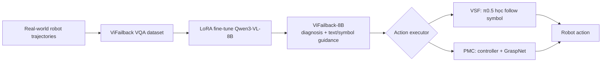
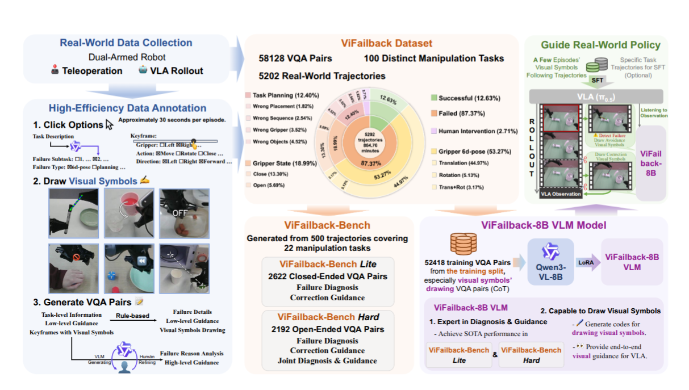
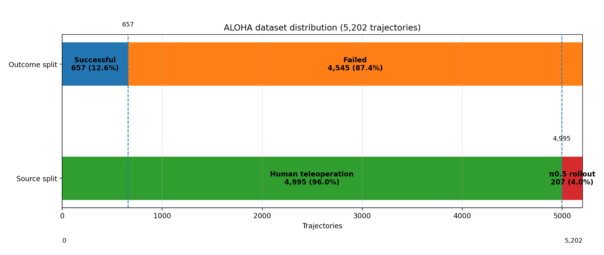
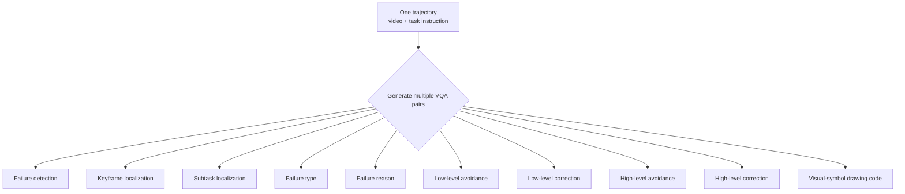
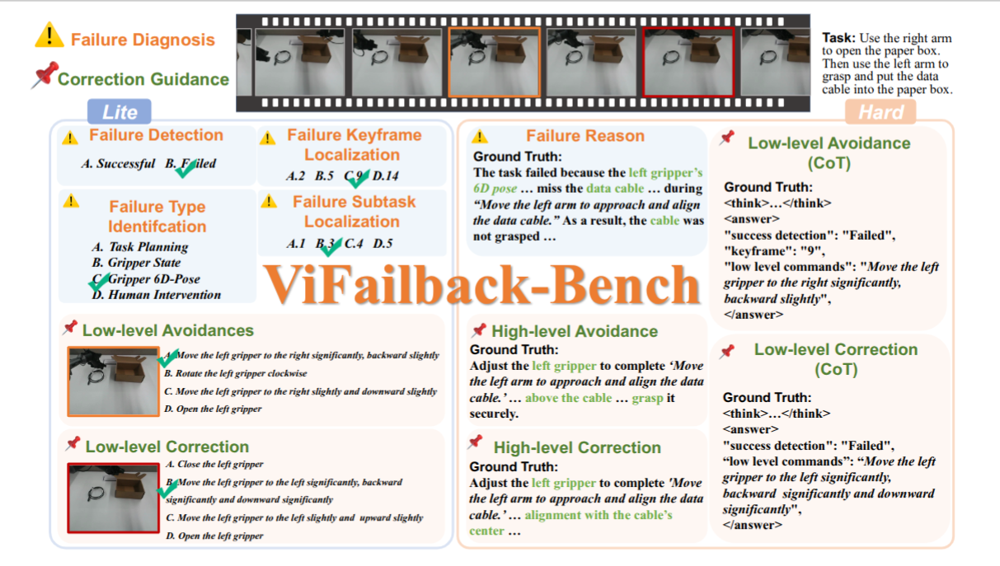
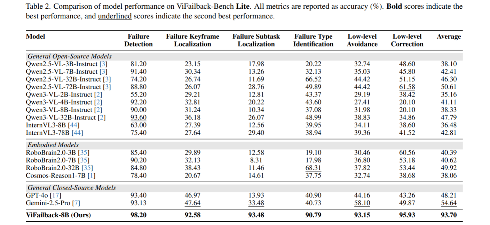
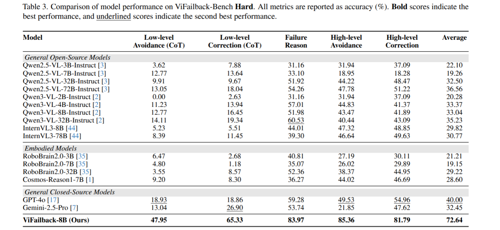
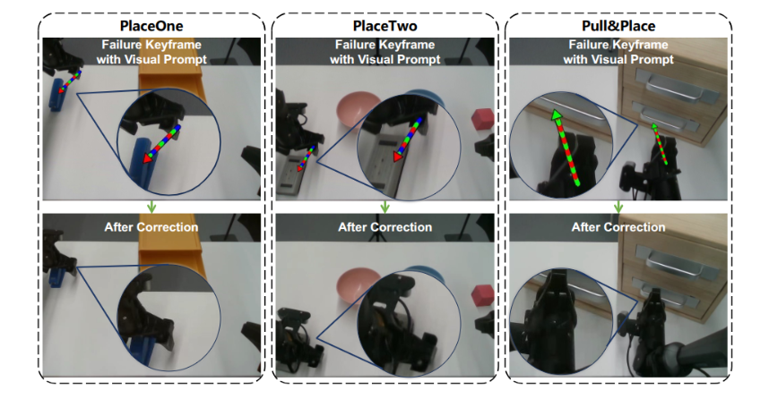
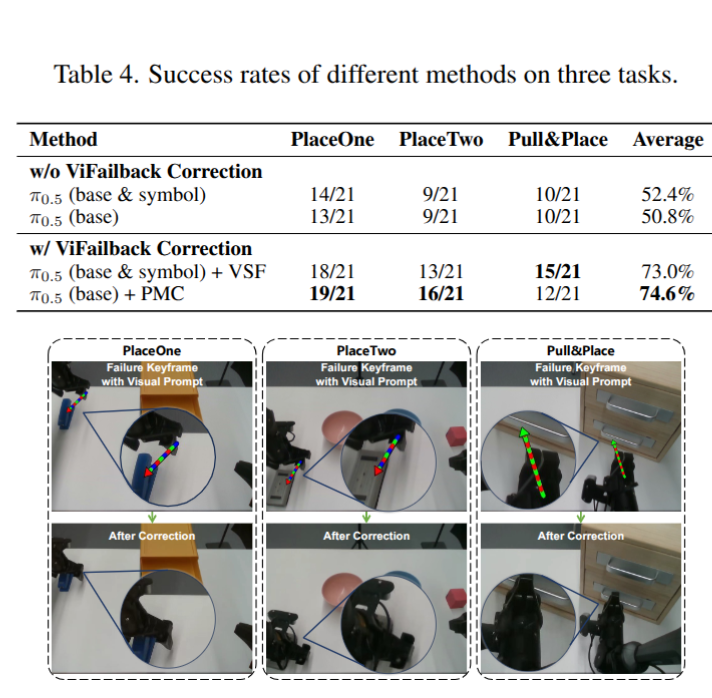
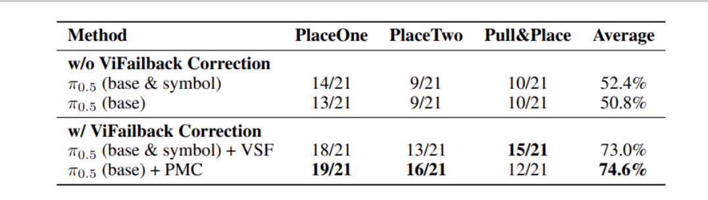

# ViFailback — dataset và VLM supervisor cho chẩn đoán/correction failure

## 1. Nguồn và định vị chính

- Paper: *Diagnose, Correct, and Learn from Manipulation Failures via Visual Symbols*,
  Xianchao Zeng và cộng sự, CVPR 2026, pp. 42386–42395.
- [CVF Open Access](https://openaccess.thecvf.com/content/CVPR2026/html/Zeng_Diagnose_Correct_and_Learn_from_Manipulation_Failures_via_Visual_Symbols_CVPR_2026_paper.html)
- [Project page](https://x1nyuzhou.github.io/vifailback.github.io/)
- [Code](https://github.com/x1nyuzhou/ViFailback)

> **Định vị quan trọng:** đây chủ yếu là paper về **real-world failure dataset,
> VLM benchmark và domain fine-tuning**. ViFailback-8B chỉ là
> **Qwen3-VL-8B được LoRA fine-tune**, không có kiến trúc VLA mới, action head mới
> hoặc objective trực tiếp học robot action từ failure trajectory.

Câu hỏi nghiên cứu chính là:

> Có thể biến failure video ngoài đời thành supervision đủ chi tiết để một VLM
> chẩn đoán failure, giải thích nguyên nhân và sinh correction guidance grounded
> trên ảnh hay không?

Phần robot recovery là downstream system integration: ViFailback-8B sinh guidance,
sau đó một policy/controller riêng phải chuyển guidance thành robot action.


*Hình 1 — Tổng quan ViFailback: dataset/benchmark cung cấp failure supervision;
ViFailback-8B phát hiện, định vị và sinh code để vẽ correction guidance. Nguồn:
Figure 1 của paper.*



## 2. Why — khoảng trống mà paper xử lý

VLA thường được train chủ yếu trên successful demonstrations. Dữ liệu đó dạy
policy cách hoàn thành task trong nominal state, nhưng không cung cấp supervision
cho các câu hỏi:

1. failure có xảy ra không;
2. failure bắt đầu tại frame hoặc subtask nào;
3. failure thuộc loại gì và nguyên nhân là gì;
4. cần tránh hoặc sửa failure như thế nào.

Các failure dataset trước thường sinh perturbation trong simulator. Paper cho
rằng cách này bị giới hạn bởi sim-to-real gap và không đại diện đầy đủ cho failure
khi policy chạy trên robot thật.

Text-only correction cũng có hai hạn chế:

- tốn công để mô tả chính xác chuyển động không gian;
- câu như “dịch gripper sang phải một chút” không ground rõ điểm bắt đầu, đích,
  hướng quay hoặc vùng cần align trên ảnh.

ViFailback giải quyết hai khoảng trống bằng real-world failure trajectories và
visual symbols được vẽ trực tiếp lên keyframe.

## 3. Bốn artifact cần tách biệt

| Artifact                     | Input → output                                                                 |      Có robot action label trực tiếp? | Vai trò                                   |
| ---------------------------- | ------------------------------------------------------------------------------- | ---------------------------------------: | ------------------------------------------ |
| **ViFailback Dataset** | Video/keyframe + task/question → diagnosis, textual guidance hoặc symbol code |                         **Không** | Supervision cho VLM                        |
| **ViFailback-Bench**   | Failure VQA → score Lite/Hard                                                  |                         **Không** | Đánh giá failure-oriented VLM reasoning |
| **ViFailback-8B**      | Observation + query → text/structured symbol code                              |                         **Không** | External VLM supervisor                    |
| **Recovery system**    | VLM guidance → VSF policy hoặc PMC controller → action                       | **Có ở executor/auxiliary data** | Thực thi correction trên robot           |

Điểm dễ nhầm nhất là core ViFailback dataset **không phải VLA action dataset**.
Nó không cung cấp target dạng:

```text
[x, y, z, roll, pitch, yaw, gripper]
```

hoặc action token/chunk tại từng timestep. Low-level output của dataset vẫn là
ngôn ngữ hoặc visual-symbol serialization, ví dụ:

```json
{
  "success_detection": "Failed",
  "keyframe": 9,
  "failure_type": "gripper_6d_pose",
  "low_level_commands": "Move the left gripper right significantly and backward slightly",
  "visual_symbol": {
    "type": "straight_arrow",
    "start_point": [159, 560],
    "end_point": [339, 442],
    "color": ["green", "red"]
  }
}
```

JSON trên minh họa contract khái niệm; paper không công bố exact on-disk schema
trong main PDF.

## 4. ViFailback Dataset



*Hình 2 — Pipeline tổng thể: thu trajectory thật, annotate visual symbol và VQA,
tạo ViFailback-Bench, fine-tune ViFailback-8B rồi nối guidance với policy robot.
Nguồn: Figure 2 của paper.*

### 4.1 Thu trajectory thật

**Failure mode được xử lý:** simulated perturbation có thể tạo distribution khác
failure khi triển khai trên robot thật.

Nhóm tác giả thu **5,202 trajectories** trên ALOHA dual-arm, bao phủ **100 tasks**:

- 657 successful trajectories;
- 4,545 failed trajectories;
- 4,995 trajectories từ human teleoperation;
- phần còn lại từ rollout của π0.5 đã fine-tune trên successful teleoperated data.



Failure taxonomy gồm bốn nhóm:

1. **Task planning:** chọn sai object/location, sai thứ tự hoặc bỏ sót subtask.
2. **Gripper 6D-pose:** gripper sai position hoặc orientation.
3. **Gripper state:** open/close sai hoặc chưa đủ.
4. **Human intervention:** external disturbance ngăn task tiếp tục.

Dữ liệu thật giảm phụ thuộc vào simulated failure, nhưng bằng chứng chỉ đến từ
một robot family và taxonomy curated. Paper chưa kiểm tra cross-embodiment
transfer.

### 4.2 Visual-symbol annotation

**Failure mode được xử lý:** low-level correction bằng text khó ground chính xác
trên ảnh và high-level annotation thủ công tốn thời gian.

Paper định nghĩa bảy symbol:

1. colored straight arrow — translation;
2. semi-circular arrow — rotation;
3. dual crosshairs — alignment giữa hai target;
4. single crosshair — target object/region;
5. ON/OFF label — gripper state;
6. prohibition icon — stop;
7. rewind icon — quay lại trạng thái trước.

Colored arrow dùng màu để mã hóa trục chuyển động:

- red: forward/backward;
- green: left/right;
- blue: up/down.

Pipeline lưu symbol category và geometry như start point, end point, center hoặc
direction. Vì vậy VLM được dạy sinh **drawing code**, không chỉ mô tả bằng text.

Annotation có ba stage:

1. annotator chọn detection, keyframe, subtask và failure type bằng UI;
   Qwen2.5-Max hỗ trợ decomposition task thành subtasks;
2. annotator chọn correction category và vẽ symbol lên keyframe;
3. Qwen3-VL-235B sinh failure reason/high-level guidance; con người kiểm tra và
   chỉnh sửa.

Paper không báo text-only annotation baseline, inter-annotator agreement hoặc
breakdown chi phí kiểm định. Do đó claim “high-efficiency annotation” hợp lý về
cơ chế nhưng chưa được đối chứng đầy đủ.

<video controls width="720">
  <source src="image/03_vifailback/Task1.mp4" type="video/mp4">
</video>

### 4.3 Data structure

ViFailback gồm **58,128 VQA pairs** gắn với **5,202 trajectories**. Một trajectory
có thể sinh nhiều pair; không nên hiểu một sample duy nhất chứa toàn bộ field.



Core dataset output là diagnosis/guidance target cho VLM. Paper thừa nhận action
distribution trong failure trajectories còn chưa được khai thác và để lại cho
future work (Discussion, p.8).

### 4.4 Split và threat

Training split dùng:

- **4,702 trajectories**;
- **95 tasks**;
- **52,418 VQA pairs**.

Benchmark dùng:

- **500 trajectories**;
- **22 tasks**.

Nếu 95 train tasks và 22 benchmark tasks đều là subset của cùng tổng 100 tasks,
thì intersection tối thiểu là:

```text
95 + 22 - 100 = 17 tasks
```

Do đó split **không thể hoàn toàn task-disjoint** theo các con số paper công bố.
Benchmark chủ yếu đo held-out trajectory/configuration trong task families có
overlap, không phải strict unseen-task generalization. Ba robot tasks ở downstream
recovery experiment mới được paper nói rõ là unseen đối với ViFailback dataset.

## 5. ViFailback-Bench

### 5.1 Benchmark đo gì?

ViFailback-Bench đo **failure-oriented embodied reasoning** của VLM:

```text
observe rollout
→ detect failure
→ localize keyframe/subtask
→ identify type/reason
→ propose avoidance or correction
```

Nó không đánh giá robot action generation trực tiếp và cũng không chứng minh
internal chain-of-thought là causally faithful.



*Hình 3 — Một trajectory được chuyển thành các câu hỏi Lite dạng closed-ended và
Hard dạng open-ended về diagnosis, avoidance và correction. Nguồn: Figure 3 của
paper.*

### 5.2 Lite

Lite có sáu closed-ended VQA tasks:

1. failure detection;
2. failure keyframe localization;
3. failure subtask localization;
4. failure type identification;
5. low-level avoidance;
6. low-level correction.

Metric là exact accuracy. Đây chủ yếu là recognition, temporal/spatial grounding
và structured diagnosis hơn là open-ended reasoning.

ViFailback-8B đạt average **93.70%**; baseline mạnh nhất trong Table 2 là
Gemini-2.5-Pro với **54.64%**.



*Bảng 2 — Accuracy (%) trên sáu task Lite. ViFailback-8B đạt average 93.70%.
Nguồn: Table 2 của paper.*

### 5.3 Hard

Hard có năm open-ended tasks:

1. low-level avoidance với multi-step/CoT output;
2. low-level correction với multi-step/CoT output;
3. failure reason;
4. high-level avoidance;
5. high-level correction.

Hard yêu cầu model nối detection/localization với guidance. Output được GPT-4o
judge theo:

- semantic similarity;
- content completeness;
- functional equivalence.

ViFailback-8B đạt average **72.64%**; GPT-4o baseline đạt **40.00%**.



*Bảng 3 — Accuracy (%) trên năm task Hard. ViFailback-8B đạt average 72.64%.
Nguồn: Table 3 của paper.*

Threat chính:

- GPT-4o judge không có human-agreement study;
- score đo chất lượng final answer, không trực tiếp kiểm tra reasoning trace;
- train/benchmark task overlap làm suy yếu claim generalization.

### 5.4 Visual-symbol generation không nên gộp nhầm vào 11 benchmark tasks

Paper dùng Figure 4 để đánh giá thêm khả năng sinh visual-symbol code khi tăng
training data và báo accuracy **38.73%** ở full subset.

Tuy nhiên, 11 task của ViFailback-Bench được cấu thành bởi **6 Lite + 5 Hard**.
Visual-symbol code generation là training/evaluation capability bổ sung, không
nên liệt kê như task thứ 12 trong benchmark.

## 6. ViFailback-8B

### 6.1 Kiến trúc

ViFailback-8B là:

```text
Qwen3-VL-8B + LoRA fine-tuning on ViFailback VQA
```

Paper không mô tả:

- backbone mới;
- attention block mới;
- action head;
- diffusion/flow action decoder;
- robot action tokenizer;
- RL objective;
- direct action loss.

Do đó improvement đến từ **domain-specific supervision**, không phải một kiến
trúc VLM/VLA mới.

### 6.2 Training

- Base model: Qwen3-VL-8B.
- Method: LoRA.
- Duration: 1 epoch.
- Data: 52,418 VQA pairs từ 4,702 trajectories.
- Target: closed-ended diagnosis, open-ended reason/guidance và visual-symbol code.

Main paper không báo đầy đủ LoRA rank, optimizer, learning rate, batch size hoặc
compute. Exact training recipe vì vậy vẫn **Unknown**.

### 6.3 Output contract

ViFailback-8B sinh:

- failure detection/localization;
- failure type và reason;
- low/high-level avoidance/correction text;
- code để render **visual symbols**.

Nó **không trực tiếp xuất actuator command**. Vì vậy nên gọi model là:

> external failure-diagnosis and correction-guidance VLM

không nên gọi là:

> end-to-end self-correcting VLA.

## 7. Từ VLM guidance tới robot action

### 7.1 Online workflow

Trong deployment:

1. π0.5 chạy task bình thường;
2. ViFailback-8B quan sát head-camera stream theo một interval;
3. nếu phát hiện failure, model sinh diagnosis, textual guidance và symbol code;
4. symbol được overlay lên observation;
5. VSF policy hoặc PMC controller chuyển guidance thành robot motion.

Điểm quan trọng là recovery phụ thuộc vào **hai hệ**:

```text
ViFailback-8B: reasoning/guidance
executor: action generation/control
```



### 7.2 Visual Symbols-Following (VSF)

Nhóm tác giả xây dựng **auxiliary visual-symbol-following dataset** bằng cách thu
low-level motion trajectories, gắn symbol và fine-tune π0.5 cùng task-specific
expert demonstrations.

**Visual Symbols-Following Dataset (VSF)** là một bộ dữ liệu phụ do nhóm tác giả tự thu thập, gồm các low-level motion của robot, chẳng hạn “di chuyển gripper trái sang trái”, sau đó được gắn thêm các ký hiệu trực quan tương ứng trên ảnh. Dữ liệu này được trộn với các demonstration theo từng task để fine-tune π0.5, giúp policy học trực tiếp ánh xạ từ ảnh có visual symbol sang action phục hồi. Paper không công bố rõ quy mô, schema, action representation hay tỉ lệ trộn của bộ dữ liệu này.

Auxiliary dataset này có robot trajectory/action supervision, nhưng nó **khác**
core ViFailback dataset 58,128 VQA pairs.

VSF học mapping:

```text
observation + symbol overlay + text guidance → robot action
```

### 7.3 Point-based Motion Control (PMC)

PMC không yêu cầu π0.5 học follow symbol end-to-end. Controller đọc target point
từ symbol rồi điều khiển end-effector. Khi cần grasp, hệ dùng GraspNet để ước
lượng grasp pose.

PMC tách reasoning khỏi control nhưng phụ thuộc thêm perception/controller module.

## 8. Kết quả robot thật

Ba task downstream đều unseen đối với ViFailback dataset; mỗi task chạy 21 trials.

| Setup                                       | Average success |
| ------------------------------------------- | --------------: |
| π0.5 base + symbol data, không correction |           52.4% |
| ViFailback + VSF                            |           73.0% |
| π0.5 base, không correction               |           50.8% |
| ViFailback + PMC                            |           74.6% |



*Bảng 4 — Kết quả recovery trên ba task robot thật, mỗi task có 21 trials; phần
dưới minh họa failure keyframe với visual prompt và trạng thái sau correction.
Nguồn: Table 4 của paper.*

Gain được báo cáo:

- VSF: **+20.6 percentage points**;
- PMC: **+23.8 percentage points**.



Đây là **system-level evidence**. Nó chứng minh ViFailback guidance có thể hữu ích
khi được nối với executor, nhưng chưa cô lập:

- visual symbol tốt hơn text-only bao nhiêu;
- diagnosis model đóng góp bao nhiêu so với executor;
- correction có generalize sang embodiment khác không;
- latency có đáp ứng control loop thực tế không.

## 9. Paper thực sự “learn from failure” ở đâu?

Tên paper có thể tạo cảm giác policy học trực tiếp từ failed robot actions. Thực tế có ba mức học khác nhau:

1. **Core contribution:** VLM học từ failure video/VQA để diagnosis và guidance.
2. **Optional VSF branch:** π0.5 học follow visual symbols từ auxiliary motion trajectories.
3. **Không có:** direct policy training từ action distribution của core failed
   trajectories.

Chính paper nói action distribution trong failed trajectories là nguồn thông tin
chưa được khai thác. Vì vậy claim chính xác hơn là:

> ViFailback dạy VLM học cách **phân tích và hướng dẫn sửa failure**; robot policy
> chỉ học correction action trong auxiliary VSF setup hoặc được thay bằng PMC.

## 10. Claim → evidence

| Claim                                                    | Evidence                                              | Cách diễn giải đúng                                 |
| -------------------------------------------------------- | ----------------------------------------------------- | -------------------------------------------------------- |
| Real failure supervision cải thiện VLM                 | ViFailback-8B vượt các general VLM trên Lite/Hard | Domain fine-tuning gain, không phải architecture gain  |
| Model có failure reasoning tốt hơn                    | Hard average 72.64%, reason/high-level guidance mạnh | Final-answer reasoning quality dưới GPT-4o judge       |
| Symbol generation scale theo data                        | đạt 38.73% ở full subset                           | Khả năng còn khó; chưa có geometry-specific metric |
| Guidance tăng robot success                             | 52.4→73.0 và 50.8→74.6                             | System-level recovery với VSF/PMC                       |
| Dataset giúp policy học trực tiếp từ failed actions | Không có evidence                                   | Core dataset không chứa direct action targets          |

## 11. Giới hạn và Unknown

- Chỉ một embodiment: ALOHA dual-arm.
- Bốn failure categories được curated trước.
- Train và benchmark không task-disjoint theo số task công bố.
- Hard dùng GPT-4o judge nhưng không báo human agreement.
- Không báo latency/trigger interval end-to-end.
- Không báo annotation text-only baseline hoặc inter-annotator agreement.
- Không báo confidence interval/significance cho 21 trials/task.
- Main PDF thiếu nhiều LoRA hyperparameters.
- Core dataset chưa dùng action distribution của failure trajectories.
- Recovery experiment thay cả supervisor/guidance và executor, nên chưa cô lập
  contribution của từng thành phần.

## 12. Kết luận

ViFailback không phải một VLA architecture mới. Contribution chính là:

```text
real failure trajectories
+ visual-symbol annotation
+ failure-oriented VQA benchmark
+ LoRA-fine-tuned Qwen3-VL-8B supervisor
+ downstream VSF/PMC recovery demonstration
```

Cách phân loại chính xác:

> **Real-world robot failure dataset + VLM benchmark/fine-tuning paper, có
> downstream integration với VLA/controller để thực hiện recovery.**
