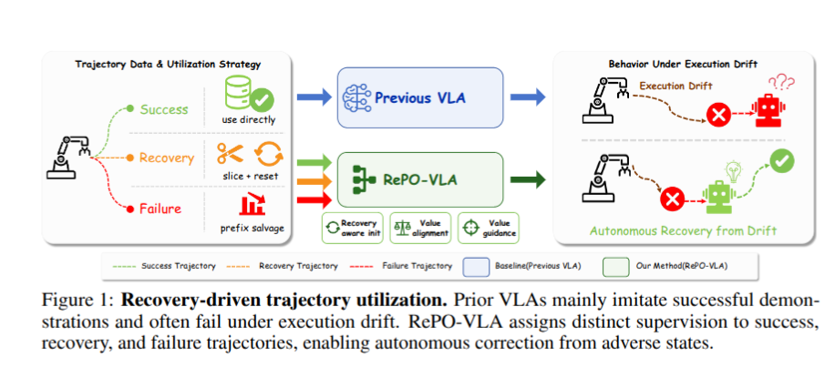
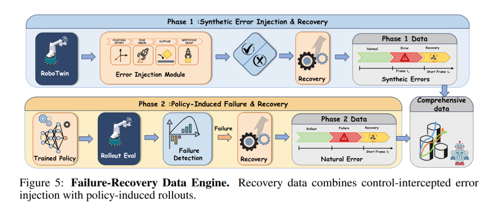
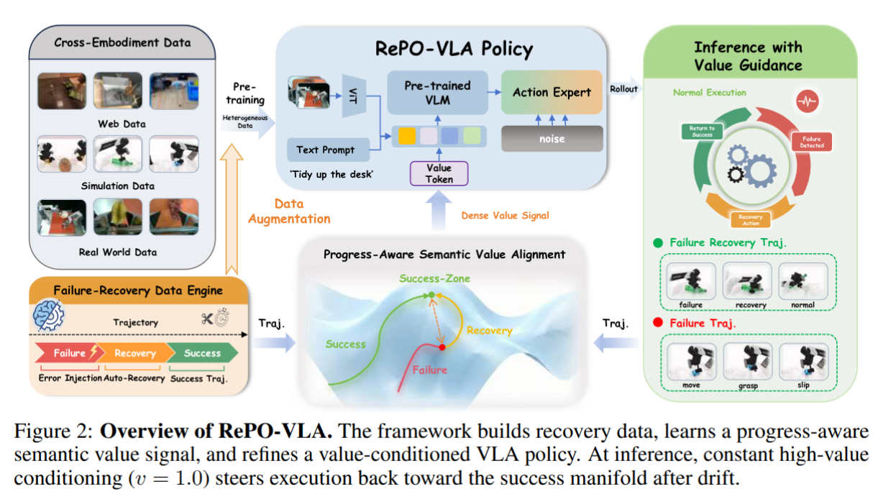
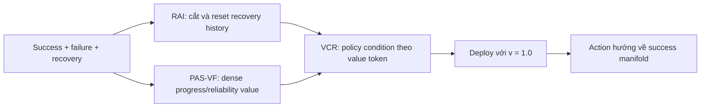
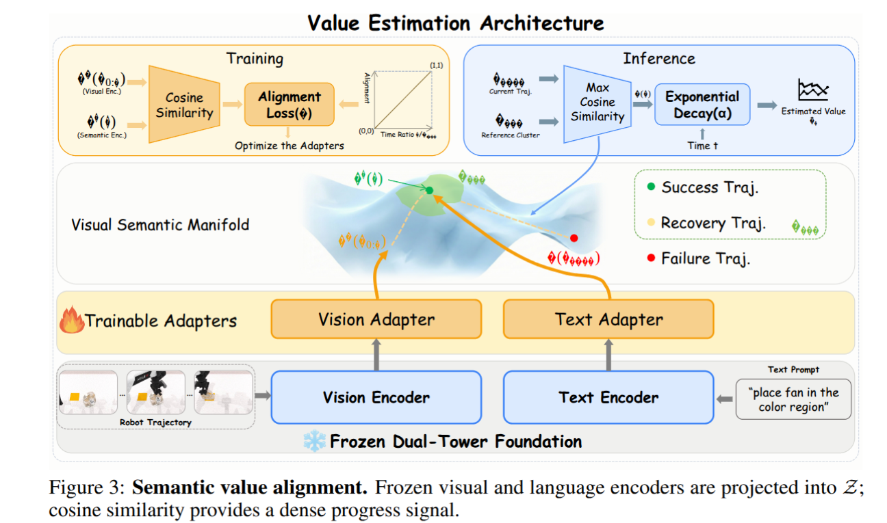
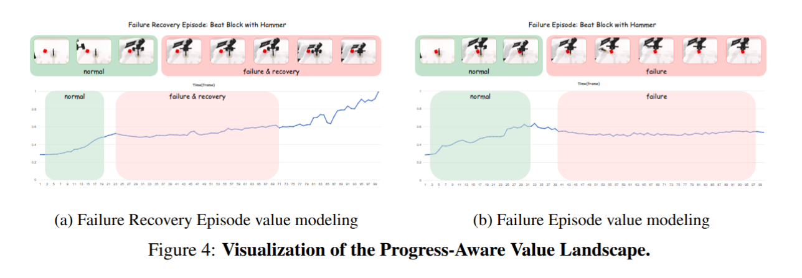

# RePO-VLA — tối ưu policy bằng success, failure và recovery trajectory

## 1. Nguồn và câu hỏi nghiên cứu

- Paper: *RePO-VLA: Recovery-Driven Policy Optimization for Vision-Language-Action
  Models*, Weijia Liufu và cộng sự.
- Trạng thái: arXiv `2605.09410v1`, preprint, 10 May 2026; PDF không ghi venue,
  project page hay repository.
- [PDF trong repo](../../../papers/06-retry-handle/08_repo_vla_recovery_driven_policy_optimization.pdf), [arXiv](https://arxiv.org/abs/2605.09410).
- Phân loại: **training**. Lúc deploy policy luôn condition vào `v=1.0`; không có
  online failure detector hoặc heuristic retry.

**Câu hỏi:** có thể biến rollout thất bại và recovery thành supervision có cấu
trúc để một policy tự chọn action quay về success manifold, thay vì bỏ failure
data hoặc gọi một planner ngoài lúc chạy hay không?

## 2. Why — vì sao success-only imitation chưa đủ?

Trong manipulation bimanual dài và contact-rich, grasp, contact và timing giữa
hai tay tạo drift. Nhiều trạng thái lỗi vẫn cứu được, nhưng success-only SFT chưa
từng thấy corrective action. Hai cách dùng failure data ngây thơ cũng hỏng:

- gán cả rollout là failure sẽ bỏ phí prefix còn đúng;
- giữ nguyên history trước recovery khiến policy trộn action gây lỗi với action
  sửa lỗi và học trigger giả.

Binary reward quá thưa để phân biệt nominal progress, recoverable drift và
terminal breakdown. Success criterion vì vậy không chỉ là task success: policy
phải phục hồi từ **verified adverse state**, giữ prefix hữu ích, suppress drift
cuối rollout và không cần monitor lúc deploy.

## 3. Đóng góp

1. Recovery-Aware Initialization tách corrective suffix khỏi lịch sử gây lỗi.
2. PAS-VF biến success/failure trajectory thành dense progress-reliability value
   thay cho binary reward.
3. Value-Conditioned Refinement dạy π0.5 phân biệt nominal, drift và recovery
   action; lúc deploy không cần external failure detector.
4. FRBench tách nominal competence khỏi recovery competence bằng adverse-state
   injection đã xác minh.

## 4. FRBench

### 4.1 Benchmark giải quyết failure nào?

**Failure mode được xử lý:** benchmark task success thông thường trộn hai năng
lực khác nhau: làm task đúng từ trạng thái nominal và phục hồi sau khi đã bị đẩy
vào adverse state. Một policy nominal mạnh có thể che giấu việc hoàn toàn không
biết recovery.

FRBench tách riêng adverse-state construction và recovery evaluation. Nhờ đó,
recovery success chỉ được tính sau khi failure đã thực sự được tạo và xác minh,
thay vì suy ra từ một rollout task success duy nhất.

### 4.2 Protocol ba pha

Một episode FRBench gồm:

1. **Phase I — Nominal execution:** đo policy có làm task bình thường hay không.
2. **Phase II — Verified error projection:** inject hoặc quan sát một failure,
   rồi xác nhận robot đã đi vào adverse state mục tiêu.
3. **Phase III — Recovery:** khởi chạy policy từ adverse state và đo nó có quay
   lại success manifold rồi hoàn thành task hay không.

Protocol này tránh credit recovery cho một rollout chưa từng thật sự gặp lỗi.
Nó cũng cho phép báo riêng nominal success và recovery success.

### 4.3 Error taxonomy và failure-recovery data engine

**Failure coverage được xử lý:** perturbation đơn giản có thể khác drift do
policy thật tạo ra, nên benchmark dùng cả lỗi kiểm soát được và lỗi tự nhiên.

Bốn error chuẩn là premature close, slip, position offset và orientation
mismatch. Data engine có hai nguồn:

- **control-intercepted error injection:** chèn lỗi E1–E4 rồi dùng planner tạo
  recovery;
- **policy-induced failure:** chạy chính policy đến failure rồi dùng planner
  trong simulator hoặc người teleoperate trên robot thật để recovery.

### 4.4 Quy mô và evaluation settings

FRBench-Sim có 23,453 episode trên 46 task, gồm 17,061 nominal và 6,392
failure-recovery episode (Table 2, p.8). Simulation dùng 50 rollout/task. Real
evaluation dùng bốn bimanual task với 10 trial/task; setting `standard` đo rollout
thông thường, còn `adversarial` chủ động tạo disturbance.

Recovery data thật vẫn phụ thuộc teleoperation, còn simulator không mô phỏng tốt
fluid và highly deformable object. Main simulation headline chủ yếu dùng Dynamic
Grasp Failure/open-gripper proxy, nên chưa phải một aggregate cân bằng của toàn bộ
bốn error E1–E4.

### 4.5 Benchmark metrics và threat

FRBench báo nominal success cho Phase I và recovery/task success sau adverse
state cho Phase III. Cách tách này đúng với câu hỏi recovery, nhưng real benchmark
chỉ có bốn task và 10 trial/task. Paper không báo confidence interval, significance
hoặc kết quả seen-vs-unseen error taxonomy. Vì vậy FRBench là protocol hữu ích,
nhưng evidence hiện tại chưa đủ để kết luận general recovery.

### 4.6 Kết quả chính trên FRBench

- **FRBench-Sim, injected failure:** π0.5 đạt clean/random `15.0/15.4`, còn
  RePO-VLA đạt `37.0/43.0` (Table 3, p.9), tăng 22.0/27.6 điểm phần trăm.
- **Nominal Phase I:** RePO-VLA đạt clean/random `44.6/44.0`, so với π0.5
  `27.4/33.6`; improvement không chỉ đến từ recovery phase.
- **Robot thật, 1× recovery data:** full RePO đạt standard/adversarial
  `40.0/30.0`, còn Phase I đạt `42.5/37.5`. Khi data còn thưa, thêm PAS-VF/VCR
  chưa tốt hơn initialization.
- **Robot thật, 4× data, chỉ Pour + Fold:** full RePO đạt `80/75`, so với π0.5
  `35/20` và Phase I `50/40` (Table 5, p.10).

Headline “adversarial success `20 → 75%`” chỉ đúng cho cấu hình 4× trên hai task
được chọn. Nó không phải average của toàn bộ bốn real task và bị confound giữa
phương pháp với lượng recovery data.

## 5. RePO-VLA Method

### 5.1 Tổng quan pipeline

RePO-VLA dùng success, pure failure và failure-recovery trajectory với vai trò
khác nhau. Recovery trajectory được cắt/reset để khởi tạo policy; toàn bộ corpus
được PAS-VF gán dense value; cuối cùng π0.5 học sinh action condition theo value.
Khi deploy, hệ thống luôn yêu cầu value cao `v=1.0`, tức chọn behavior gần success
manifold mà không chạy monitor online.

### 5.2 Recovery-Aware Initialization (RAI/TSHR)

**Failure mode được xử lý:** nếu giữ nguyên history, recovery action bị đặt sau
chuỗi action vừa gây lỗi. Policy có thể học causal trigger giả hoặc average giữa
“tiếp tục gây lỗi” và “bắt đầu sửa lỗi”.

RAI xác định recovery start $t_{rec}$, cắt lấy corrective suffix và reset history
tại adverse state. Policy sau đó được SFT trên expert trajectory cùng các recovery
suffix đã reset. Như vậy corrective action phụ thuộc trạng thái xấu hiện tại,
không phụ thuộc con đường đã dẫn tới failure.

Fig.7a (p.10) cho thấy dùng raw failure-recovery history chỉ đạt khoảng `10/0%`
trên Pour/Fold; history reset tăng lên khoảng `40/40%`; thêm value model đạt
khoảng `90/70%`. Đây là evidence trực tiếp cho history reset, nhưng paper chưa
mô tả đủ cách tìm $t_{rec}$ và mức annotation/oracle cần thiết.

### 5.3 Progress-Aware Semantic Value Function (PAS-VF)

**Failure mode được xử lý:** gán toàn rollout thất bại bằng 0 làm mất prefix còn
hữu ích, còn binary terminal reward không chỉ ra timestep nào bắt đầu drift.

PAS-VF dùng frozen V-JEPA cho spatiotemporal visual feature và text encoder cho
instruction, chỉ train adapter. Trên success trajectory, cosine similarity được
fit với normalized temporal progress. Với failure trajectory, mỗi frame lấy độ
tương đồng lớn nhất với success reference, rồi nhân reliability decay:

$$
r_t = \left(1 - \frac{t}{T}\right)^\alpha, \qquad \alpha = 3.
$$

Cách này giữ value cho prefix còn đáng tin nhưng hạ thấp late drift/terminal
breakdown. Fig.7c (p.10) cho thấy $\alpha=3$ tốt hơn `1` và `10` trên Pour/Fold.
Failure còn lại là giả định progress đơn điệu theo thời gian: loop, valid detour
hoặc nhiều success mode có thể làm similarity/value sai dù action hợp lệ.

### 5.4 Value-Conditioned Refinement (VCR)

**Failure mode được xử lý:** cùng observation/history có thể xuất hiện với
low-value drift action hoặc high-value recovery action; SFT không có biến nào để
phân biệt hai mode.

VCR thêm value token vào transformer của π0.5. Success và recovery suffix nhận
value `1`; error prefix nhận `0`; pure failure rollout nhận dense decayed label
từ PAS-VF. Policy vì vậy học cả action và “mức progress/reliability” gắn với
action đó. Tại inference, value được cố định `v=1.0` để bias action về mode có
progress cao.

Trong 30 trial của Fig.7b (p.10), đổi `v=0 → 1` tăng Pour `50.0 → 76.7` và Fold
`46.7 → 73.3`, cho thấy token thực sự điều khiển behavior. Tuy vậy fixed high
value không tự ước lượng adverse state có recoverable hay nằm ngoài training
support.

### 5.5 Deployment không cần monitor

**Failure mode được xử lý:** external VLM replanner có thể hiểu lỗi ở mức semantic
nhưng tách khỏi low-level dynamics và tăng runtime dependency.

Deploy chỉ chạy policy với `v=1.0`; không có online detector, retry heuristic
hoặc planner ngoài. Ưu điểm là runtime gọn, nhưng recovery bị giới hạn bởi
failure distribution đã xuất hiện trong data và chất lượng value label offline.

## 6. Training

Training diễn ra theo ba stage có vai trò khác nhau.

### 6.1 Recovery-Aware Initialization

π0.5 được SFT trên hai nguồn: expert success trajectory và recovery suffix đã
cắt/reset history tại $t_{rec}$. Stage này dạy low-level corrective action từ
adverse state mà không để model nhìn thấy failure-causing prefix ngay trước đó.
Nó tạo policy Phase I dùng làm initialization cho value-conditioned refinement.

### 6.2 Huấn luyện PAS-VF và sinh value label

V-JEPA và text encoder được freeze; chỉ adapter được cập nhật. Trên success
trajectory, target là normalized temporal progress. Sau khi fit, PAS-VF so từng
failure frame với cụm success reference, rồi kết hợp semantic similarity với
reliability decay $\alpha=3$ để sinh dense value label.

Stage này không cập nhật action policy. Nó bổ sung supervision còn thiếu giữa
binary success/failure, nhưng phụ thuộc giả định trajectory có progress gần đơn
điệu. Paper không báo calibration/AUROC độc lập cho value function.

### 6.3 Value-Conditioned Refinement

Policy Phase I tiếp tục được train trên raw intact histories đã gắn value token:
success và recovery suffix dùng `1`, error prefix dùng `0`, pure failure dùng
label suy ra từ PAS-VF. Khác RAI, stage này cố ý giữ intact history để policy học
phân biệt drift và correction thông qua value condition thay vì xóa toàn bộ ngữ
cảnh.

Main PDF không công bố đầy đủ optimizer, learning rate, batch size, số update hay
compute cho từng stage. Nó cũng không cho số recovery episode tuyệt đối ở cấu
hình 2×/4×. Do đó có thể mô tả objective/data flow, nhưng chi phí tái lập vẫn là
**Unknown**.

## 7. Claim → evidence

| Protocol                      | Kết quả được báo cáo                                                                       | Cách đọc đúng                                                                               |
| ----------------------------- | ------------------------------------------------------------------------------------------------- | ------------------------------------------------------------------------------------------------ |
| FRBench-Sim, injected failure | π0.5 clean/random`15.0/15.4`; RePO `37.0/43.0` (Table 3, p.9)                                | +22.0/+27.6 điểm phần trăm trên recovery protocol                                           |
| Nominal Phase I               | RePO clean/random`44.6/44.0`; π0.5 `27.4/33.6` (Table 3, p.9)                                | phương pháp không chỉ tăng recovery                                                        |
| Robot thật, 4 task, 1x data  | π0.5 standard/adversarial`25.0/20.0`; Phase I `42.5/37.5`; Full `40.0/30.0` (Table 4, p.9) | Full 1x còn kém Phase I; value landscape nhiễu khi recovery data thưa                        |
| 4x data, chỉ Pour + Fold     | Full standard/adversarial`80/75`; π0.5 `35/20`; Phase I `50/40` (Table 5, p.10)            | headline`20 → 75%` là 2 task được chọn và có thêm data, không phải toàn bộ 4 task |

Tất cả là **reported result**, chưa có independent reproduction. Kết quả 4x
không cô lập architecture gain khỏi data volume; component ablation chỉ có hai
task và không báo confidence interval.

## 8. Giới hạn và câu hỏi mở

- Phụ thuộc failure taxonomy đã quan sát; out-of-taxonomy recovery còn yếu.
- Teleoperated recovery đắt, simulator chưa mô phỏng tốt fluid/deformable object.
- Không báo số recovery episode tuyệt đối ở 2x/4x, cost annotation, calibration
  hoặc AUROC của PAS-VF.
- Không rõ recovery boundary trong real data là tự động hay do người chỉ định.
- PAS-VF dùng progress theo thời gian; valid detour, loop hoặc nhiều success mode
  có thể phá giả định monotonicity.

## 9. Liên hệ với workspace

**Inferred:** output của [`scripts/run_vla_inference.py`](../../../../scripts/run_vla_inference.py)  và [`src/inspect_vla_output.py`](../../../../src/inspect_vla_output.py) có thể mở
rộng sidecar `trajectory_type`, `failure_phase`, `recovery_start`, `value_label`.
Nhưng checkout hiện là inference trên ego video, không có environment transition,
task reward, verified adverse state hay recovery rollout. Metric trajectory-match
không được gọi là task completion/recovery success.

## 10. Thử nghiệm tiếp theo

1. Kiểm tra monotonicity: fit PAS-VF trên trajectory có detour/loop và đo rank
   correlation giữa value với progress thật.
2. Ablate cùng **một lượng data** giữa Phase I, RAI-only, PAS-VF và VCR để tách
   architecture gain khỏi recovery-data scaling.
3. Công bố/đo performance theo seen vs unseen error taxonomy; đây là phép thử
   trực tiếp nhất cho claim recovery tổng quát.

**Mức tin cậy:** cao cho pipeline và protocol; trung bình cho claim recovery tổng
quát vì paper còn là preprint, real trial ít và kết quả mạnh nhất bị confound bởi
data scaling.
