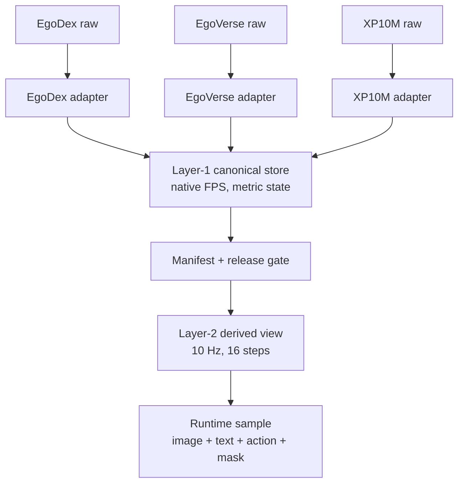

# Thiết kế data ingestion và trạng thái runtime

## Câu hỏi và phạm vi

Báo cáo này trả lời:

1. Mỗi source có cần preprocessing riêng không?
2. Unified dataset ở Layer-1 và training input ở Layer-2 trông như thế nào?
3. Pipeline ingestion, validation và runtime hiện có hoặc còn thiếu gì?

Chi tiết về quy mô, raw modality và sample thật của từng source nằm tại
[phân tích ba dataset](dataset_analysis.md), không lặp lại ở đây.
Các lệnh cài môi trường, nối release, smoke test, training và inference nằm tại
[setup/runtime guide cho `vla-core`](setup_runtime_guide.md).

Nguồn runtime:

- [schema bundle](../../../dataset/corpus_sample_bundle/corpus/SCHEMA.md);
- [reference loader](../../../dataset/corpus_sample_bundle/load_example.py);
- [`vla_core` corpus dataset](../../../third_party/02_vla_core/data/corpus_dataset.py);
- [companion data-flow](corpus-data-flow.html).

## Kết luận ngắn

**Mỗi source bắt buộc có preprocessing riêng ở adapter boundary.** EgoDex cần resolve packed LeRobot/AV1 và ARKit transforms; EgoVerse cần phân biệt hai coordinate family; XP10M cần sync clock, compose calibration, xử lý mirrored left hand và license.

**Sau adapter chỉ nên có một pipeline chung.** Layer-1 giữ raw metric world-frame state ở native FPS. Layer-2 mới resample, tạo action chunk, đổi rotation/finger representation, normalize và mix source.



Bundle self-contained đã chạy được đến loader/projection. Tuy nhiên external
package `data_corpus`, production releases và `Layer1PretrainSampler` không có
trong workspace, nên chưa chạy được Layer-1 → `(16,153)` end-to-end.

## 1. Preprocessing riêng theo source

| Source   | Preprocessing bắt buộc                                                                            | Không được hard-code                   |
| -------- | --------------------------------------------------------------------------------------------------- | ------------------------------------------ |
| EgoDex   | episode span, packed media, ARKit head/wrist/joint transform, AV1 decode                            | video-local offset, kp21 trực tiếp       |
| EgoVerse | Zarr feature family, world/head-fixed detection, axis/extrinsic, media intrinsics                   | một coordinate branch hoặc resolution    |
| XP10M    | multi-clock sync, SLAM body→camera calibration, mirrored-left handling, caption hierarchy, license | 30 FPS, full hand validity, commercial use |

### EgoDex adapter

1. Resolve episode bằng data/video file index, timestamp và dataset row range.
2. Giữ provenance về packed source video và episode span.
3. Đổi head/wrist/ARKit joint transform sang fixed canonical convention.
4. Giữ 24-joint SE(3) ở Layer-1.
5. Dùng FFmpeg/PyAV cho production AV1.

Chuyển ARKit thành `kp21` là model-view transform vì nó bỏ per-joint rotation.

### EgoVerse adapter

1. Đọc Zarr schema/attrs theo episode.
2. Xác định hand đang ở world frame hay head-fixed frame.
3. Chỉ áp axis permutation/extrinsic cho đúng branch.
4. Chuẩn hóa quaternion direction và intrinsics theo media family.
5. Đưa narration về cùng frame axis với geometry.

Shape `[63]` không đủ để quyết định branch; cần provenance về transform đã áp.

### XP10M adapter

1. Join video, SLAM, hand, body pose và caption trên device clock.
2. Compose world→body với body→camera calibration.
3. Đổi source/calibration convention sang OpenCV camera và clip world.
4. Xử lý mirrored-left orientation và kiểm lại với joints.
5. Giữ body pose như registered stream, không nhét mọi sensor vào core.
6. Giữ caption hierarchy/provenance trong sidecar.
7. Propagate non-commercial license đến sampler, run và model lineage.

## 2. Unified Layer-1

### Đơn vị lưu trữ

Đơn vị là clip, không phải training sample:

```text
manifest row
  ├── annotation parquet: 1 row / native video frame
  ├── source video reference
  ├── narrative parquet: interval sidecar
  └── streams/*: optional sensor sidecars
```

World frame được neo trong từng clip. Không so sánh trực tiếp world coordinate
giữa hai clip; cross-clip model view phải dùng camera-relative hoặc
anchor-relative quantities.

### Core geometry

| Field             | Shape/row  | Dtype/scale      | Semantics                         |
| ----------------- | ---------- | ---------------- | --------------------------------- |
| `frame`         | scalar     | int32            | video frame axis                  |
| `timestamp`     | scalar     | float64 seconds  | `frame / fps`                   |
| `cam_R`         | 9          | float32 rotation | world→camera, row-major          |
| `cam_t`         | 3          | float32 meters   | world→camera translation         |
| `trans_l/r`     | 3 mỗi tay | float32 meters   | wrist trong clip world            |
| `wrist_rot_l/r` | 9 mỗi tay | float32 rotation | hand→world                       |
| `fingers_l/r`   | variable   | float32          | source-native, dispatch bằng tag |
| `valid_l/r`     | scalar     | float32`[0,1]` | mask bắt buộc                   |

Camera dùng OpenCV `+X` phải, `+Y` xuống, `+Z` trước. Position dùng mét;
rotation dùng matrix. Core pose thống nhất nhưng finger representation vẫn
source-native:

- EgoDex: 288 float/tay, scalar-equivalent 616 value/frame;
- EgoVerse/XP10M: 63 float/tay, scalar-equivalent 166 value/frame.

Đây không phải fixed dense tensor để concatenate source.

### Validity

Schema mô tả validity bằng finite pose, wrist–head distance `0,05–1,20 m`,
velocity gate mặc định `3 m/s` và handedness. Invalid row có thể chứa filler
hoặc NaN. Phải select/mask trước normalization hoặc loss vì `NaN × 0` vẫn là
`NaN`.

### Metadata và sidecar

Clip metadata cần giữ:

- identity và schema version;
- media, FPS, frame span và source offset;
- intrinsics, gravity, world scale và conventions;
- hand presence/format và embodiment;
- split group, license và QA flags;
- extraction config, code revision và checksum;
- stream/calibration registry;
- narrative provenance.

Language dùng interval `[start_f,end_f)` trên cùng frame axis với geometry.
Sensor khác rate đi vào self-describing sidecar với rate, unit, clock, frame of
reference và calibration.

Layer-1 **không có action column**. Nó lưu human state/geometry; action target là
derived view.

## 3. Unified Layer-2 và runtime sample

`vla_core` kỳ vọng:

```python
{
    "image":       uint8[H, W, 3],
    "text":        str,
    "actions":     float32[16, 153],
    "action_mask": float32[16, 153],
    "source":      str,
    "clip_id":     str,
}
```

30 FPS dùng stride 3 và 20 FPS dùng stride 2 để tạo 10 Hz. Chunk 16 target step
có horizon danh nghĩa 1,6 s.

Một action row 153-D:

| Slice      | Dim | Feature              | Frame/scale                    |
| ---------- | --: | -------------------- | ------------------------------ |
| `0:3`    |   3 | head delta position  | meter, anchor-relative heading |
| `3:9`    |   6 | head delta rotation  | rotation 6D                    |
| `9:12`   |   3 | left wrist position  | meter, same-step camera        |
| `12:18`  |   6 | left wrist rotation  | rotation 6D                    |
| `18:81`  |  63 | left`kp21`         | meter, wrist-relative camera   |
| `81:84`  |   3 | right wrist position | meter, same-step camera        |
| `84:90`  |   6 | right wrist rotation | rotation 6D                    |
| `90:153` |  63 | right`kp21`        | meter, wrist-relative camera   |

Head block luôn valid; mỗi hand block 72-D dùng `valid_l/r`. EgoDex cần remap
ARKit 24-joint thành `kp21`; EgoVerse và XP10M gần pass-through sau coordinate
normalization.

Normalization phải fit trên training partition, pin bằng release/manifest
identity và áp sau mask. Không bake target Hz, horizon hoặc normalization vào
Layer-1.

### Feature không đi vào active model path

Current dataset chỉ đưa một RGB frame, tối đa hai narrative, joystick text và
153-D action. Nó không đưa:

- audio, depth, point cloud hoặc segmentation;
- XP10M IMU/full-body pose làm proprioception;
- camera intrinsics/calibration;
- task/caption hierarchy đầy đủ;
- timestamp tensor, reward, terminal hoặc success;
- ARKit finger rotations sau conversion sang `kp21`.

Đây là training-view omission, không có nghĩa raw/canonical source không có
feature.

## 4. Pipeline ingestion đề xuất

### Stage 0 — register source và policy

- pin release/revision, license và checksum;
- inventory container, clock, FPS, codec, calibration và grouping;
- quarantine source không phù hợp target license.

### Stage 1 — source-native indexing

- EgoDex: episode index từ LeRobot metadata và packed media;
- EgoVerse: Zarr episode và storage-family detection;
- XP10M: HDF5 episode, sensor clocks, calibration và caption levels.

### Stage 2 — media và temporal alignment

- probe media bằng FFmpeg;
- lấy extraction FPS từ metadata đã xác minh;
- map pose/language/sensor lên một frame axis;
- giữ raw timestamp và alignment provenance.

### Stage 3 — geometry normalization

- compose/invert đúng pose direction;
- đổi camera convention về OpenCV;
- neo world tại camera frame đầu;
- đưa translation về mét và giữ `world_scale`;
- nhập/tính gravity và QA flags;
- áp source-specific hand transform đúng một lần.

### Stage 4 — canonical hand representation

- tạo wrist translation/rotation chung;
- giữ source-native fingers và versioned `hand_format`;
- tính validity sau transform;
- chưa ép về 63-D tại rest.

### Stage 5 — sidecars

- language: normalize interval, giữ hierarchy/generator provenance;
- vector sensor: rate, unit, clock, frame và calibration;
- blob modality: native container + index, không decode hết vào Parquet.

### Stage 6 — immutable Layer-1 và manifest

- một geometry Parquet mỗi clip;
- atomic write, checksum và schema assertion;
- build manifest từ artifact;
- split theo leakage-safe `split_group`;
- propagate license và source lineage.

### Stage 7 — release gate

Kiểm path resolution, row/frame/time alignment, rotations, scale/convention,
hand projection, validity, language interval, stream calibration, split,
license, checksum và provenance.

### Stage 8 — model-specific Layer-2

- filter license/QA/source;
- tạo deterministic train/validation partition;
- resample về target Hz;
- build head/hand chunks;
- dispatch finger representation;
- attach RGB/text/optional stream;
- fit/apply train-only normalization;
- mix source theo trainable window count.

## 5. Runtime đã xác minh

`load_example.py` đã chạy end-to-end trên bundle:

1. đọc manifest 6 clip;
2. mở XP10M annotation;
3. reconstruct right-hand `kp21` trong camera frame;
4. decode frame 129;
5. chiếu keypoint bằng intrinsics `[200,200,256,256]`;
6. query language tại frame;
7. đọc `head_body_pose` 258 row ở 20 Hz.

Quan sát overlay cho thấy 21 điểm nằm dọc bàn tay phải. Artifact overlay tạm
được xóa sau kiểm tra.

Các kiểm tra metadata khác:

- annotation row count khớp manifest;
- frame liên tục `0..n_frames-1`;
- timestamp bằng `frame/fps`;
- không null ở frame/timestamp/valid;
- manifest validity count khớp canonical rows.

Runtime chưa xác minh:

- projection EgoDex/EgoVerse;
- production release/gate/checksum;
- external `Layer1PretrainSampler`;
- Layer-1 → `(16,153)` end-to-end;
- claim khoảng 4,48 triệu training window;
- dataloader throughput và memory ở production scale.

## 6. Contract drift và rủi ro

1. Release/clip metadata dùng schema `0.6.0`, nhưng tiêu đề `SCHEMA.md` ghi
   `v0.5.0`.
2. XP10M stream metadata vẫn ghi `0.5.0`; compatibility chưa được công bố rõ.
3. Schema text gọi frame index là absolute source-video frame, trong khi sample
   migration và EgoDex note mô tả video-local frame 0.
4. Mỗi video sample có một frame dư ngoài annotation span.
5. Manifest `media_codec` null dù media đã probe là H.264.
6. Workspace có consumer code nhưng thiếu external `data_corpus` package.
7. Production scale `≈3.000 h` và `2.699,48 h` chưa được reconcile.

## 7. Bước tiếp theo

1. Biến bundle thành automated contract test, một clip mỗi source.
2. Assert schema/version và frame-axis semantics.
3. Đo projection pixel error thay vì chỉ xem overlay.
4. Test narrative overlap và optional stream join.
5. Pin đúng `data_corpus` revision.
6. Derive một `(16,153)` sample, kiểm mask/finite và normalization.
7. Sau smoke test mới benchmark production I/O/RAM/throughput.

## Lệnh runtime

```bash
uv run --no-project --with numpy --with pyarrow \
  --with opencv-python-headless \
  python3 dataset/corpus_sample_bundle/load_example.py

ffprobe -v error -select_streams v:0 \
  -show_entries format=filename,duration,size:stream=codec_name,width,height,r_frame_rate,avg_frame_rate,nb_frames \
  -of json dataset/corpus_sample_bundle/videos/<source>/<clip>.mp4

python3 .agents/scripts/01_validate_workspace.py --full
```

Loader chỉ decode một XP10M frame, không decode toàn bộ corpus.
