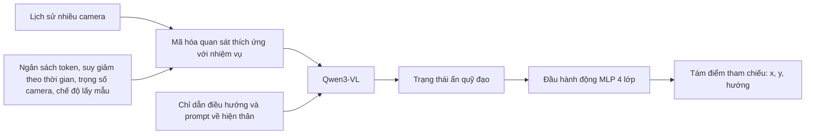
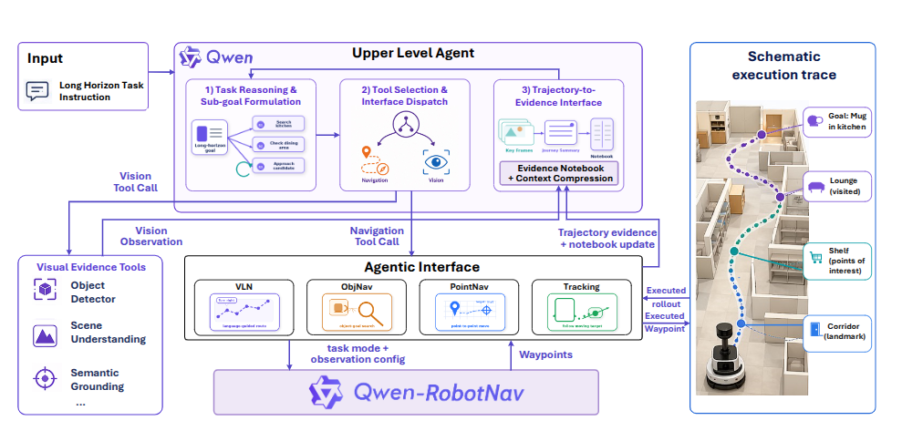
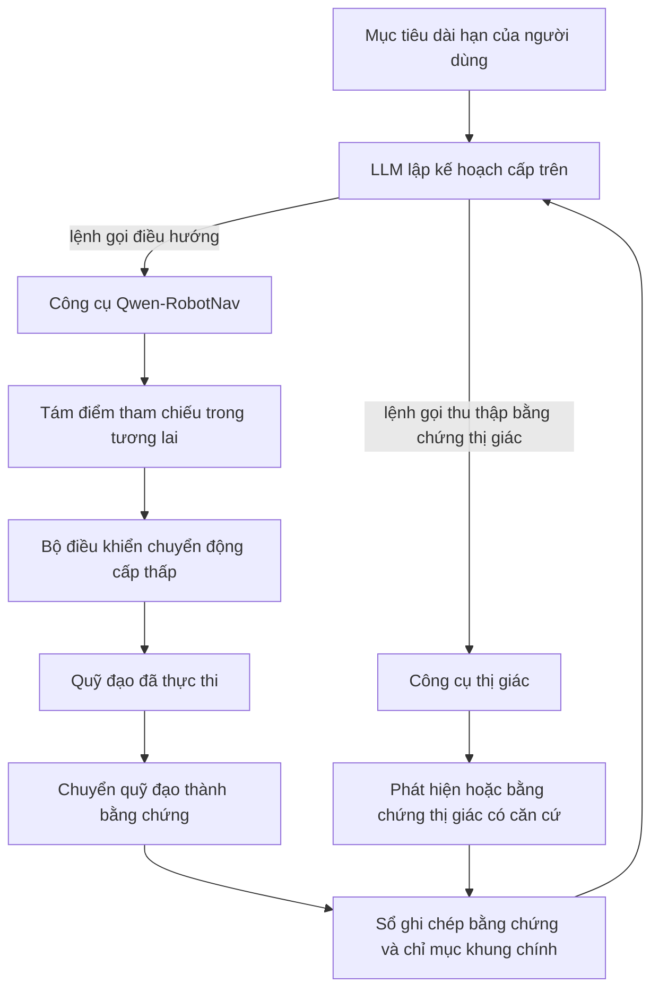

# Qwen-RobotNav: Kiến trúc, Dữ liệu huấn luyện và Đánh giá

## Phạm vi

Báo cáo này trình bày **Qwen-RobotNav**, mô hình chuyên gia điều hướng trong bộ Qwen-Robot.
Nội dung tập trung vào chính sách dự đoán điểm tham chiếu, giao diện quan sát có thể định cấu hình, dữ liệu huấn luyện,
cách lấy mẫu nhiệm vụ ở cấp lô, cách ngẫu nhiên hóa quan sát, quy trình đánh giá và các hạn chế. Về
mô hình chuyên gia thao tác, xem [Qwen-RobotManip](../Qwen-RobotManip/qwen_robotmanip_details.md).
Về mô hình tổng quát, xem [Qwen-VLA](../Qwen-VLA/qwen_vla_details.md).

> **Ngày nghiên cứu:** 22-07-2026. Nguồn chính được kiểm tra là Qwen-RobotNav v3
> (2026-06-29). Tập dữ liệu và số lượng đánh giá là do tác giả báo cáo và chưa được
> tái lập trong workspace này. Kho lưu trữ chính thức hiện cho biết chưa có
> kế hoạch phát hành trọng số mô hình.

## Ý tưởng cốt lõi

Qwen-RobotNav chủ ý giữ đầu hành động ở mức đơn giản: Qwen3-VL mã hóa lịch sử nhiều camera
theo cấu hình quan sát có thể điều chỉnh, còn MLP bốn lớp trực tiếp hồi quy tám điểm tham chiếu
trong tương lai. Cơ chế huấn luyện cốt lõi không phải là một chính sách phổ quát, mà là quá trình
thích ứng đa nhiệm dùng chung trên hỗn hợp dữ liệu quỹ đạo và VL theo tỷ lệ 85:15; tập dữ liệu
được chọn ở cấp lô, còn cấu hình quan sát được ngẫu nhiên hóa độc lập cho từng mẫu quỹ đạo.

## 1. Tổng quan về mô hình

### 1.1 Nhiệm vụ chính

Qwen-RobotNav hỗ trợ năm nhóm nhiệm vụ điều hướng:

- Đi theo chỉ dẫn ngôn ngữ-thị giác
- Điều hướng đến mục tiêu điểm
- Tìm kiếm đối tượng mục tiêu
- Theo dõi mục tiêu
- Lái xe tự động

Nó cũng có thể đóng vai trò là người thực thi điều hướng phản ứng bên dưới trình lập kế hoạch LLM cấp cao hơn.

### 1.2 Kiến trúc



Đầu ra của mô hình:

$$
W=\{(x_k,y_k,\theta_k)\__{k=1}^{8}
$$

Đây là mục tiêu hồi quy trực tiếp có 24 chiều.

Khác với Qwen-VLA và RobotManip, vốn dùng DiT để khớp dòng hành động, đầu hành động của RobotNav dùng MLP 4 lớp để xuất các điểm tham chiếu điều hướng.


## 2. Mã hóa đầu vào và quan sát

### 2.1 Đầu vào mô hình, góc camera và ví dụ prompt

Mỗi lần gọi RobotNav kết hợp luồng quan sát, ngôn ngữ, định danh nhiệm vụ và chính sách
ngữ cảnh có thể định cấu hình. Có thể biểu diễn đầu vào như sau:

$$
\left(I_{1:T}^{1:N},\;L,\;\tau,\;\Phi\right),
\qquad
\Phi=(B,\gamma,\{w_c\},m,b_{min},b_{max}),
$$

trong đó \(I_{1:T}^{1:N}\) là lịch sử ảnh RGB từ \(N\) camera qua \(T\) mốc thời gian, \(L\) là
chỉ dẫn điều hướng kèm lời mở đầu về hiện thân, \(\tau\) là chế độ nhiệm vụ và \(\Phi\) quyết định
ảnh nào được giữ lại và ở độ phân giải nào. Mô hình cơ sở trả về tám điểm tham chiếu \((x,y,\theta)\); một
bộ điều khiển cấp thấp bên ngoài thực hiện chúng.

| Nhóm đầu vào | Nội dung | Bắt buộc hoặc tùy chọn |
| --------------------------- | ------------------------------------------------------------------------------------------- | ---------------------------------------------------------------------------------------------------------------------- |
| Quan sát RGB | Khung hình hiện tại và lịch sử từ một hoặc nhiều camera | Bắt buộc; số lượng camera thay đổi tùy theo nền tảng/nhiệm vụ |
| Lời mở đầu về hiện thân | Định danh bằng ngôn ngữ tự nhiên, chẳng hạn robot hay ô tô | Bắt buộc theo thiết kế prompt được mô tả |
| Mục tiêu phụ/hướng dẫn | Yêu cầu về tuyến đường, điểm, đối tượng, theo dõi hoặc lái xe | Bắt buộc, nhưng các trường dành riêng cho nhiệm vụ của nó khác nhau |
| Chế độ nhiệm vụ | `VLN`, `PointNav`, `ObjNav` hoặc `Tracking` trong giao diện dành cho agent | Bắt buộc đối với các lệnh gọi agent có thể định cấu hình; lái xe tự động có trong huấn luyện nhưng không được liệt kê là một trong bốn chế độ công cụ này |
| Cấu hình quan sát | Ngân sách token, mức giảm gần đây, trọng lượng máy ảnh, chế độ lấy mẫu khung, giới hạn token trên mỗi hình ảnh | Cấu hình bên ngoài; một số giá trị thường sử dụng giá trị mặc định của nền tảng |
| Thông tin điều kiện điều hướng phụ trợ | Tọa độ/hướng, mô tả mục tiêu, trạng thái ego hoặc quỹ đạo trước đó tùy theo nhiệm vụ | Tùy chọn/phụ thuộc vào nhiệm vụ |

[RobotNav paper v3, §§2.1-2.5 và 3.1-3.2](https://arxiv.org/abs/2606.18112v3)

#### Bố cục camera và thông tin góc được công bố

RobotNav hỗ trợ số lượng camera \(N\) phụ thuộc vào nền tảng tùy ý thay vì một giàn cố định.
Bài viết ghi lại các bố cục quan sát này:

| Bố cục | Các góc nhìn được công bố | Phạm vi bao phủ và cách sử dụng |
| ----------------------------- | --------------------------------------------------------------------------------------------------------- | -------------------------------------------------------------------------------------------------------------- |
| Đơn camera | Chỉ nhìn phía trước | Dùng trong triển khai và đánh giá hướng về phía trước; giao diện mô hình không cố định trường nhìn bằng một giá trị số |
| Toàn cảnh bốn góc nhìn | Các mẫu suy luận hiện tại dùng trước, phải, sau, trái; dữ liệu R2R/RxR liệt kê trước, trái, phải, sau | Được mô tả là bao phủ đủ 360 độ; bài báo không gán góc phương vị bằng số cho mọi góc nhìn |
| Ví dụ sáu camera | Nhãn bắt đầu bằng `Front`, `Front Right`, tiếp tục qua các góc nhìn trung gian và kết thúc bằng `Front Left` | Cho thấy tên camera theo ngữ nghĩa có thể mở rộng ngoài bốn góc nhìn; bài báo không liệt kê góc phương vị hiệu chuẩn chính xác |
| Lái xe tự động đa góc nhìn | Nhiều camera trên xe | Số lượng, thứ tự và góc lắp chính xác phụ thuộc vào tập dữ liệu/nền tảng, không được cố định trong phần mô tả mô hình |

Bài báo đã thử nghiệm các nhãn bằng số như **`right 90 degrees`**, nhưng nhãn mô tả cho kết quả
nhỉnh hơn một chút. Đây là ví dụ duy nhất nêu rõ góc phương vị; việc gán các giá trị quen thuộc như
0/90/180/270 độ cho cụm bốn camera chỉ là suy luận, không phải đặc tả đầu vào được báo cáo.

Bài báo cũng không công bố một thứ tự camera dùng chung. Bản ghi dữ liệu theo thứ tự `front, left, right, rear`;
dữ liệu suy luận tuần tự hóa ảnh toàn cảnh hiện tại theo thứ tự `front, right, back, left`; còn ví dụ sáu góc nhìn
bắt đầu bằng `Front, Front Right, ...`. Đây chỉ là thứ tự trong từng tập dữ liệu hoặc ví dụ, không phải đặc tả API chuẩn.

Đối với trường hợp bốn góc nhìn thông thường, trọng lượng của máy ảnh mẫu là:

```text
front = 2.0, right = 1.0, back = 0.5, left = 1.0
```

Trọng số điều khiển cách phân bổ token thị giác, không biểu thị góc camera vật lý. Góc nhìn phía trước nhận
tỷ trọng lớn nhất vì thường chứa lối đi, chướng ngại vật và mốc mục tiêu; góc nhìn phía sau nhận tỷ trọng
nhỏ nhất. Mỗi ảnh được chọn sẽ được đổi kích thước động theo ngân sách token/pixel được cấp, đồng thời giữ
nguyên tỷ lệ khung hình. Trong huấn luyện, chiều cao camera mô phỏng cũng được tăng cường trong khoảng 0,5-1,5 m,
trường nhìn ngang trong khoảng 90-120 độ và tỷ lệ khung hình từ 2:1 đến 4:3; đây là các phép tăng cường dữ liệu,
không phải cấu hình suy luận bắt buộc. [RobotNav paper v3, §§2.2-2.3 và 4.2.1](https://arxiv.org/abs/2606.18112v3)

#### Ví dụ về tuần tự hóa hình ảnh và thời gian chính xác

Sau khi chọn khung, mô hình sẽ xen kẽ các thẻ văn bản thông thường bằng token hình ảnh. Bài báo đưa ra mẫu hai dấu thời gian, sáu camera này:

```text
Time step 0 Front View <image> Front Right View <image> ... Front Left View <image>
Time step 1 Front View <image> ...
```

Các nhóm được sắp theo thời gian và mỗi ảnh đều có nhãn ngữ nghĩa chỉ góc nhìn đứng trước. Không cần
embedding ID camera đã học hay thay đổi kiến trúc. Báo cáo không công bố mẫu hội thoại hoàn chỉnh,
dấu phân cách, ID token hoặc danh sách chính xác của sáu camera bị lược đi bằng dấu chấm lửng.
[RobotNav paper v3, §2.3](https://arxiv.org/abs/2606.18112v3)

#### Lời mở đầu chính xác về hiện thân

Bài viết xuất bản hai phần mở đầu bằng ngôn ngữ tự nhiên:

```text
Imagine you are a robot programmed for navigation tasks
```

```text
Imagine you are a car programmed for autonomous driving
```

Đây là các prompt tiền tố về hiện thân, không phải ID hiện thân đã học. Các tác giả cho rằng một nền tảng mới như
drone, robot bánh xe hoặc robot bốn chân có thể dùng lời mở đầu văn bản mới mà không cần thêm tham số, nhưng
không công bố mẫu đã được kiểm chứng cho các nền tảng đó. [RobotNav paper v3, §2.4](https://arxiv.org/abs/2606.18112v3)

#### Nội dung hướng dẫn cho mỗi nhiệm vụ

| Nhóm nhiệm vụ | Ngôn ngữ/đầu vào phụ trợ được mô tả trong bài báo | Lịch sử hình ảnh điển hình |
| ------------------ | ------------------------------------------------------------------------------------------------------------------------------------------------------------------------------------- | ---------------------------------------------------------------------------------------------- |
| VLN | Chỉ dẫn lộ trình bằng ngôn ngữ tự nhiên | Bao phủ toàn bộ lịch sử để đối chiếu lại các mốc với những bước đã nêu trước đó trong chỉ dẫn |
| PointNav | Tọa độ mục tiêu tương đối cùng tư thế, khoảng cách và hướng hiện tại; hoặc các lệnh nguyên thủy như `Move forward 2.0 meters`, `Turn left 90 degrees`, `Move forward` và `Turn left` | Góc nhìn hiện tại cùng lịch sử điều hướng được lấy mẫu đồng đều |
| ObjNav | Các mẫu gồm `navigate to the {goal_object}` và `find and reach the {goal_object}` | Lấy mẫu rộng trên toàn lịch sử để ghi nhớ các khu vực đã khám phá và việc quay lại |
| Tracking | Mô tả mục tiêu bằng văn bản; truy vấn đại diện trong bài báo là `Follow the man in the blue t-shirt` | Ảnh ego-centric hiện tại cùng phần lịch sử ngắn, gần đây và có độ phân giải cao |
| Lái xe tự động | Ảnh đa góc nhìn trong mọi biến thể; có thể bổ sung chỉ dẫn điều hướng, trạng thái ego của phương tiện và/hoặc lịch sử ngắn của quỹ đạo ground-truth | Lịch sử lái xe ngắn; đánh giá NAVSIM cung cấp ba quỹ đạo ground-truth trước đó |

Đây là các kết xuất đầu vào khác nhau cho một mô hình được chia sẻ. Trong giao diện agent, người lập kế hoạch cấp trên có thể
thay đổi \(L\), \(\tau\) và \(\Phi\) giữa các cuộc gọi mà không thay đổi trọng số.
[RobotNav paper v3, §§3.1-3.2, 4.1 và 5.4](https://arxiv.org/abs/2606.18112v3)

Phần đồng huấn luyện suy luận điều hướng dùng một định dạng riêng, cụ thể hơn: tối đa tám khung lịch sử
**nhìn về phía trước** được lấy mẫu đồng đều, ảnh toàn cảnh hiện tại theo thứ tự `front, right, back, left`,
chỉ dẫn và phần chú thích tóm tắt hành động/quỹ đạo theo thời gian. Các mục `History`, `Scene Analysis`,
`Instruction Progress` và `Action Reasoning` cung cấp tín hiệu giám sát bằng văn bản; chính sách điểm tham chiếu
liên tục không yêu cầu tất cả các mục này khi chạy. Sự phân biệt đó giúp tránh nhầm nhãn chỉ dùng trong huấn luyện
với đầu vào cảm biến có thể triển khai. [RobotNav paper v3, §4.3](https://arxiv.org/abs/2606.18112v3)

#### Ví dụ minh họa về một lệnh gọi điều hướng hoàn chỉnh

Bài báo định nghĩa lệnh gọi trừu tượng \(W_i=\operatorname{nav\_qwennav}(L_i,\tau_i,\Phi_i)\), nhưng
không phát hành một API JSON cụ thể. Sau đây là **bản dựng lại** từ các trường đã công bố:

```yaml
system_preamble: Imagine you are a robot programmed for navigation tasks
task_mode: ObjNav
instruction: Search the kitchen area for a mug.

observation_config:
  token_budget_B: 4096
  temporal_decay_gamma: 1.0
  frame_sample_mode: random
  camera_weights:
    front: 2.0
    right: 1.0
    back: 0.5
    left: 1.0
  min_tokens_per_image: 4
  max_tokens_per_image: 256

observations:
  - time_step: 0
    views:
      front: <image>
      right: <image>
      back: <image>
      left: <image>
  - time_step: 1
    views:
      front: <image>
      right: <image>
      back: <image>
      left: <image>
```

Ở lần gọi sau, bộ lập kế hoạch cấp trên có thể chuyển cùng mô hình sang `Tracking` hoặc `PointNav` cục bộ,
chọn cách lấy mẫu `latest`, tăng \(\gamma\) và giảm \(B\) để phản ứng nhanh hơn. Tên và thứ tự trường YAML
ở trên chỉ nhằm giải thích, không phải giao diện chính thức.

Đầu hành động ánh xạ trạng thái ẩn quỹ đạo cuối cùng \(E_A\) thành 24 số, nhưng bài báo không nêu rõ
vị trí chính xác nào trong chuỗi/token hội thoại tạo ra \(E_A\), có dùng token truy vấn chuyên biệt hay
dấu phân cách prompt trong hệ thống thực tế hay không. Khi chưa có mã nguồn được phát hành, các chi tiết này vẫn **chưa xác định**.

### 2.2 Mã hóa quan sát thích ứng với nhiệm vụ

Lịch sử điều hướng có thể phát triển vô tận nên mô hình không thể duy trì mọi khung hình ở độ phân giải đầy đủ.

RobotNav hiển thị các tham số quan sát có thể định cấu hình:

- Tổng ngân sách token trực quan \(B\)
- Hệ số suy giảm theo thời gian \(\gamma\)
- Trọng số của từng camera \(w_c\)
- Phân bổ tối thiểu và tối đa cho mỗi khung
- Chế độ lấy mẫu khung
- Chế độ nhiệm vụ

Các biện pháp kiểm soát này xác định:

- Những bước thời gian nào được giữ lại
- Camera nào nhận được nhiều token hơn
- Những khung hình nào được mã hóa ở độ phân giải cao hơn
- Ưu tiên quan sát gần đây hay độ bao phủ rộng trên toàn episode

Ví dụ:

```text
Target tracking:
- high resolution
- short recent window
- strong front-camera weight

Object search:
- longer history
- broader temporal coverage
- more balanced camera allocation
```

Nhận dạng camera và thứ tự thời gian được truyền đạt bằng thẻ ngôn ngữ tự nhiên thay vì các mô-đun kiến trúc mới.

## 3. Hệ thống điều hướng agentic

Đề xuất rộng hơn của bài báo là một **robot agentic**, không chỉ là một chính sách điều hướng độc lập.
Một LLM cấp trên đa dụng tiếp nhận mục tiêu dài hạn của người dùng, suy luận về tiến độ, chọn công cụ
cần gọi và duy trì bộ nhớ cô đọng. Qwen-RobotNav là một trong các công cụ đó: đây là bộ thực thi
chuyển động, biến mục tiêu phụ điều hướng cục bộ thành tám điểm tham chiếu.

Sự phân biệt này cũng làm rõ hai thành phần khác nhau:

- **LLM lập kế hoạch cấp cao**—chẳng hạn Qwen3.6-Plus trong hệ thống QA hiện thân được báo cáo—là một
  thành phần suy luận riêng, có nhiệm vụ phân rã nhiệm vụ và điều phối công cụ.
- **Đầu hành động MLP bốn lớp** nằm bên trong Qwen-RobotNav. Nó chỉ lập bản đồ cuối cùng của RobotNav
  từ trạng thái ẩn sang tọa độ điểm tham chiếu; nó không phải bộ lập kế hoạch hay thành phần gọi công cụ của agent.

[RobotNav paper v3, §§3.1-3.3 và 5.3](https://arxiv.org/abs/2606.18112v3)





### 3.1 Qwen-RobotNav là công cụ di chuyển

Đối với mỗi cuộc gọi điều hướng, người lập kế hoạch cung cấp:

$$
(L_i,\tau_i,\Phi_i),
$$

trong đó \(L_i\) là mục tiêu phụ cục bộ, \(\tau_i\) chọn hành vi điều hướng và \(\Phi_i\) điều khiển
chiến lược quan sát. Công cụ chuyển động cung cấp bốn chế độ có tên, tất cả đều dùng chung trọng số RobotNav.

#### Tất cả các giá trị `task_mode` dành cho agent

| Trường YAML minh họa | Hành vi đã chọn | Mục tiêu hoặc hướng dẫn do người lập kế hoạch cung cấp | Chiến lược quan sát điển hình | Mẫu đầu vào đại diện |
| --- | --- | --- | --- | --- |
| `task_mode: VLN` | Đi theo lộ trình được mô tả bằng ngôn ngữ và đối chiếu các mốc theo đúng thứ tự trong chỉ dẫn | Chỉ dẫn lộ trình tuần tự bằng ngôn ngữ tự nhiên | Giữ lại lịch sử rộng trên toàn episode để có thể đối chiếu các mốc trước đó với những bước chỉ dẫn về sau | `Go to the living room, turn left, and stop near the kitchen.` |
| `task_mode: PointNav` | Di chuyển tới một mục tiêu không gian, tọa độ hoặc mục tiêu cục bộ dạng điểm tham chiếu | Tọa độ mục tiêu tương đối, tư thế/khoảng cách/hướng hoặc lệnh chuyển động nguyên thủy bằng văn bản | Dùng lịch sử được lấy mẫu cục bộ hoặc đồng đều; ưu tiên khung gần đây hơn khi tới gần mục tiêu để tiếp cận mượt hơn | `Go to (2.2, 2.4).` hoặc `Move forward 2.0 meters.` |
| `task_mode: ObjNav` | Tìm kiếm một danh mục đối tượng hoặc một trường hợp cụ thể bằng cách sử dụng bằng chứng trực quan tích lũy | Tên đối tượng, danh mục hoặc biểu thức giới thiệu | Sử dụng ngân sách token lớn hơn với lịch sử rộng/ngẫu nhiên trong quá trình khám phá; chuyển sang các khung hình gần đây khi tiếp cận một ứng viên rõ ràng | `Search the kitchen area for a mug.` |
| `task_mode: Tracking` | Tiếp tục bám mục tiêu đang di chuyển hoặc vừa được quan sát | Mô tả mục tiêu bằng văn bản | Ưu tiên lấy mẫu khung mới nhất, thiên lệch mạnh về thời điểm gần đây và độ phân giải cao cho các quan sát mới | `Follow the man in the blue t-shirt.` |

Bốn giá trị chế độ này được nêu tên rõ ràng trong bài báo. Cách tuần tự hóa `task_mode: <value>` và
các chuỗi đầu vào ở cột cuối là ví dụ tiêu biểu trong bài báo hoặc bản dựng trung thực từ các mẫu đã công bố;
chúng không phải lược đồ API được phát hành. Cụ thể, `task_mode: ObjNav` chọn **hành vi tìm kiếm**.
Sau đó, bộ lập kế hoạch có thể chuyển lần gọi cùng mô hình sang `PointNav` để tiếp cận cục bộ ở chặng cuối,
hoặc sang `Tracking` nếu mục tiêu di chuyển.

Qwen-RobotNav được huấn luyện trên **năm nhóm nhiệm vụ**: đi theo chỉ dẫn, điều hướng đến mục tiêu điểm,
điều hướng đến đối tượng mục tiêu, theo dõi mục tiêu và lái xe tự động. Tuy nhiên, giao diện dành cho agent
trong §§3.1-3.2 chỉ nêu tên bốn giá trị `task_mode` ở trên. **Vì vậy, lái xe tự động là một nhóm nhiệm vụ
huấn luyện và đánh giá, không phải giá trị lệnh gọi công cụ `task_mode: Driving` đã được tài liệu hóa.**

RobotNav trả về quỹ đạo điểm tham chiếu, không phải mô-men xoắn động cơ hay kế hoạch bằng ngôn ngữ tự nhiên.
Bộ điều khiển cấp thấp thực thi các điểm tham chiếu. Bộ lập kế hoạch có thể thay đổi chế độ, mục tiêu phụ và cấu hình quan sát
giữa các cuộc gọi mà không tải chính sách điều hướng khác.
[Bài báo RobotNav v3, §§3.1-3.2](https://arxiv.org/abs/2606.18112v3)

### 3.2 Các công cụ khác xung quanh RobotNav

Bài viết nêu tên rõ ràng ba **công cụ bằng chứng trực quan phụ trợ**:

| Công cụ | Vai trò trong vòng lặp agent | Chức năng không đảm nhiệm |
| ------------------- | --------------------------------------------------------------------- | --------------------------------------------------- |
| Phát hiện đối tượng | Xác định vị trí đối tượng ứng viên trong quan sát hiện tại hoặc các khung chính đã lưu | Không tạo ra điểm tham chiếu chuyển động |
| Hiểu cảnh | Tóm tắt các phòng, cách bố trí, địa danh và các bằng chứng cấp cảnh khác | Không thay thế người lập kế hoạch hoặc người thực thi điều hướng |
| Định vị ngữ nghĩa | Liên kết mục tiêu văn bản hoặc biểu thức quy chiếu với bằng chứng thị giác | Không trực tiếp sinh chuyển động tới mục tiêu đã định vị |

Các công cụ này trả lời câu hỏi về nhận thức khi bộ lập kế hoạch cần thêm bằng chứng trước khi chọn mục tiêu phụ
tiếp theo. Bài báo không công bố backbone mô hình, API, prompt, dữ liệu huấn luyện hay độ chính xác độc lập của
chúng. Vì vậy, nên hiểu đây là các thành phần được nêu tên trong giao diện đề xuất, không phải công cụ đã phát hành
với đặc tả đầy đủ. Đây cũng là những loại công cụ phụ trợ duy nhất được nêu rõ trong Phần 3; bài báo không xác định
một danh mục công cụ rộng hơn dành cho thao tác, cầm nắm, lời nói, lập bản đồ hay các kỹ năng robot khác.

Hệ thống còn cung cấp 2 khả năng hỗ trợ không phải là chính sách chuyển động mới:

- **Truy xuất ảnh khung chính:** sau khi thực thi xong, hệ thống giữ lại các khung có chỉ mục nguồn để bộ lập kế hoạch
  truy xuất về sau nếu phần tóm tắt bằng văn bản chưa đủ.
- **Chuyển quỹ đạo thành bằng chứng:** một bộ chuyển đổi biến các đối số của bộ lập kế hoạch thành lệnh gọi RobotNav,
  rồi nén chuỗi quan sát dày đặc, dấu vết của bộ điều khiển và các điểm tham chiếu thành bằng chứng cho lượt
  lập kế hoạch tiếp theo.

[RobotNav paper v3, §§3.1 và 3.3](https://arxiv.org/abs/2606.18112v3)

### 3.3 Sổ ghi chép chứng cứ và nén ngữ cảnh

Việc trả lại mọi hình ảnh và dấu vết điều khiển cấp thấp cho bộ lập kế hoạch sẽ nhanh chóng làm cạn
cửa sổ ngữ cảnh, còn việc chỉ trả về `success/failure` sẽ loại bỏ bằng chứng hữu ích. Thay vào đó,
hệ thống điều phối tạo một bản ghi cô đọng. Bài báo đưa ra lược đồ đại diện sau:

```text
{
  subgoal: "Search the kitchen area for a mug",
  task_mode: ObjNav,
  config: Phi_i (main controls: B, gamma, m),
  progress: "entered kitchen, checked countertop and dining table",
  salient: ["sink", "countertop", "round table", "no mug observed"],
  outcome: "target not found",
  key_frames: [#18, #31]
}
```

Sổ bằng chứng lưu lại các khu vực đã tìm kiếm, vị trí ứng viên, giả thuyết bị bác bỏ, tín hiệu mốc và giả định
về bố cục sau khi ngữ cảnh lập kế hoạch được nén. Một mục ghi sau có thể sửa lại niềm tin trước đó mà vẫn giữ
lịch sử cập nhật có thể kiểm tra. ID khung chính duy trì đường dẫn quay lại ảnh thô, nên việc nén thành văn bản
không xóa vĩnh viễn bằng chứng thị giác gốc.

Mục ghi minh họa trong bài báo là:

```text
[step 47] Kitchen entered and searched; countertop and dining table checked. No mug observed.
Corridor shelf remains a possible candidate region from key frame #12.
```

### 3.4 Ví dụ về vòng lặp công cụ dài hạn

Trình tự sau đây **mang tính minh họa nhưng bám sát ví dụ tìm kiếm cốc trong bài báo**:

1. LLM lập kế hoạch phân rã mục tiêu “tìm chiếc cốc” thành mục tiêu phụ “tìm kiếm trong bếp”.
2. Nó gọi Qwen-RobotNav ở chế độ `ObjNav` với ngân sách token lớn và lấy mẫu bao gồm lịch sử.
3. RobotNav dự đoán tám điểm tham chiếu ở mỗi bước điều hướng; bộ điều khiển cấp thấp thực thi chúng.
4. Hệ thống điều phối báo cáo rằng bàn ăn và mặt bếp đã được kiểm tra nhưng không tìm thấy chiếc cốc nào, đồng thời
   lưu trữ các khung chính.
5. Bộ lập kế hoạch có thể gọi công cụ phát hiện đối tượng hoặc định vị ngữ nghĩa trên khung hiện tại/đã lưu để xác minh
   đối tượng ứng viên.
6. Nó cập nhật sổ ghi chép bằng chứng, chọn một khu vực khác và gọi lại RobotNav.
7. Khi một cốc ứng cử viên hiển thị, nó có thể chuyển mô hình RobotNav tương tự sang `PointNav` cục bộ hoặc
   `Tracking` với cấu hình quan sát tập trung vào lần gần đây.

Vì vậy, cách mô tả chính xác nhất về Qwen-RobotNav là **một công cụ trong hệ thống agent được đề xuất**,
cụ thể là công cụ đảm nhiệm di chuyển. Bộ lập kế hoạch cấp trên thực hiện suy luận dài hạn và chọn công cụ;
các công cụ thị giác phụ trợ thu thập bằng chứng; hệ thống điều phối quản lý bộ nhớ; còn bộ điều khiển biến
điểm tham chiếu thành chuyển động ở cấp cơ cấu chấp hành. Bài báo đánh giá một cấu hình cấp hệ thống cho
bài toán hỏi đáp hiện thân, nhưng không phát hành một bộ phần mềm agent-robot tổng quát và hoàn chỉnh.
[RobotNav paper v3, §§3 và 5.3](https://arxiv.org/abs/2606.18112v3)

## 4. Dữ liệu huấn luyện

### 4.1 Thành phần ngữ liệu

Tập huấn luyện được báo cáo chứa khoảng **15,6 triệu mẫu**:


```text
85% navigation trajectory-planning data
15% navigation-related vision-language reasoning data
```

Phần phân rã chi tiết hơn cho tỷ lệ tổng hợp như sau:

| Nhóm dữ liệu huấn luyện | Số mẫu báo cáo | Cách xây dựng hoặc nguồn |
| ----------------------------- | ---------------: | ---------------------------------------------------------------------------------------------------------------------------- |
| Đi theo chỉ dẫn |           5,631M | VLN-CE R2R 1.491M và RxR 4.140M, được triển khai bằng teacher forcing và mở rộng qua các biến thể góc nhìn/phép tăng cường |
| PointNav |             984K | Matterport3D và HM3D trong Habitat: tiếp cận trực tiếp 348K, tầm ngắn 174K, tầm xa 400K, lệnh nguyên thủy 62K |
| ObjectNav |           2.000M | Matterport3D, HM3D và HM3D-OVON; khám phá dựa trên skeleton với chú thích mục tiêu từ vựng mở |
| Theo dõi mục tiêu |           1,486M | Phân tách theo dõi một mục tiêu của EVT-Bench, không có đối tượng gây nhiễu |
| Lái xe tự động |           3.216M | Các biến thể giám sát từ nuScenes 78K và OpenScene 3.138M |
| VL tổng quát |       khoảng 1,0 triệu | VQA, tạo chú thích, định vị, làm theo chỉ dẫn, suy luận đa ảnh, nhận dạng mốc và STEM |
| Suy luận chuyên biệt cho điều hướng |             873K | QA dạng tự do tại điểm ra quyết định và suy luận có cấu trúc về lịch sử/cảnh/tiến độ/hành động, bắt nguồn từ quỹ đạo VLN |
| Hội thoại VLN rời rạc |             362K | CVDN, SOON, REVERIE, SRDF và dữ liệu VLN dựa trên đồ thị khác, được định dạng lại thành các câu hỏi hành động nhiều lượt với bốn góc nhìn |
| Điều hướng do T2V tạo |              40K | Các video theo dõi và làm theo hướng dẫn tổng hợp được chuyển đổi thành quỹ đạo 2-D và được lọc để đảm bảo tính hợp lệ về mặt hình ảnh/động học |

Số lượng phù hợp với tiêu đề được làm tròn:

- **Danh mục quỹ đạo:** khoảng 13.357M mẫu.
- **VL/danh mục lý luận:** khoảng 2.235M mẫu.
- **Kết hợp:** khoảng 15,592M mẫu, được báo cáo là 15,6M.

Đây là các mẫu huấn luyện, không phải 15,6 triệu tập thô độc lập:

- Số lượng R2R/RxR bao gồm các phép tăng cường về ngôn ngữ và góc nhìn camera.
- Số lượng lái xe bao gồm nhiều biến thể điều kiện hóa từ cùng một quỹ đạo.
- Quỹ đạo lái xe có thể được đưa vào cùng hoặc không cùng chỉ dẫn, trạng thái ego hay quỹ đạo trước đó làm
  bối cảnh.

[RobotNav paper v3, §4 và Hình 5](https://arxiv.org/abs/2606.18112v3)

### 4.2 Cách xây dựng mỗi bộ dữ liệu điều hướng

#### Hướng dẫn sau: R2R và RxR

- Triển khai các quỹ đạo ground-truth bằng **teacher forcing**.
- Chuyển từng lộ trình thành các mẫu huấn luyện ở cấp bước.
- Loại bỏ chỉ dẫn trùng lặp theo ID quỹ đạo.
- Tạo ba bản diễn đạt lại cho mỗi chỉ dẫn duy nhất.
- Huấn luyện cả cấu hình chế độ xem chỉ phía trước và nhiều camera.
- Áp dụng sàng lọc chất lượng hình ảnh cho các quan sát được hiển thị.

#### ĐiểmNav

- Nhấn mạnh các tuyến đường **6-10 m** khó hơn, thay vì để các tuyến ngắn và dễ chiếm ưu thế.
- Giữ lại các bước tiến về phía trước với **tỷ lệ 45%** để giảm mất cân bằng hành động.
- Luôn giữ nguyên các thao tác quay và dừng.
- Bao gồm các mục tiêu tọa độ, các tuyến đường ngắn/tầm xa và lệnh nguyên thủy.

#### ObjectNav

- Tổ chức không gian có thể điều hướng thành đồ thị khám phá.
- Chọn ngẫu nhiên các nhánh và quay lại ở ngõ cụt thay vì chỉ đi theo những con đường ngắn nhất.
- Làm mượt đường đi thu được bằng các đường spline.
- Các điểm tham chiếu quỹ đạo mẫu mỗi **0,25 m**.
- Đính kèm các mục tiêu đối tượng từ vựng mở và các mẫu ngôn ngữ đa dạng.

#### Theo dõi mục tiêu

- Sử dụng phân tách theo dõi một mục tiêu của EVT-Bench, không có đối tượng gây nhiễu.
- Ghép ảnh ego-centric hiện tại và phần lịch sử ngắn gần đây với mô tả mục tiêu bằng văn bản.
- Giám sát định dạng quỹ đạo tương lai tám điểm tương tự được sử dụng bởi các nhiệm vụ điều hướng khác.

#### Lái xe tự động

- Sử dụng quỹ đạo lái xe đa góc nhìn của nuScenes và OpenScene.
- Tạo các biến thể đầu vào khác nhau từ cùng một đường dẫn bằng cách thêm tùy ý:
  - hướng dẫn điều hướng;
  - trạng thái ego hiện tại của phương tiện;
  - bối cảnh quỹ đạo ground-truth trước đó.

#### Dữ liệu điều hướng chuyển văn bản thành video

Đường ống tổng hợp 40K là:

1. Dùng LLM tạo prompt cảnh ở góc nhìn thứ nhất và chỉ dẫn điều hướng.
2. Kết xuất một video ngắn chân thực bằng mô hình chuyển văn bản thành video.
3. Dùng VLM lọc theo tính nhất quán giữa hình ảnh và chỉ dẫn.
4. Khôi phục chuyển động của máy ảnh bằng cách sử dụng độ sâu một mắt và ước tính tư thế.
5. Chuyển đổi đường đi của camera thành quỹ đạo điều hướng 2-D.
6. Loại bỏ các mẫu không hợp lý về mặt vật lý bằng bộ lọc động học.

#### Chia sẻ camera và tăng cường chuyển động

- Chiều cao camera: lấy mẫu đồng đều từ **0,5-1,5 m**.
- Trường nhìn ngang: lấy mẫu từ **90-120 độ**.
- Tỷ lệ khung hình: lấy mẫu trong khoảng từ **2:1 đến 4:3**.
- PointNav cũng biến thiên hướng ban đầu, trường nhìn và chuyển động tốc độ thấp.

[Bài báo RobotNav v3, §§4.1-4.2](https://arxiv.org/abs/2606.18112v3)

### 4.3 Dữ liệu lưu giữ ngôn ngữ thị giác

Phần VL bảo toàn:

- Hiểu ngôn ngữ tự nhiên
- Nhận thức về thế giới mở
- Lý luận không gian
- Giải thích các thẻ máy ảnh và thời gian
- Khái quát hóa sang chỉ dẫn và môi trường chưa từng thấy

Ba nhóm chính của nó là:

- **VL tổng quát, khoảng 1,0M:** VQA, tạo chú thích, định vị, làm theo chỉ dẫn, suy luận
  đa ảnh, nhận dạng mốc và STEM.
- **Lý luận điều hướng, 873K:** tóm tắt lịch sử, phân tích cảnh, theo dõi tiến trình và hành động
  suy luận bắt nguồn từ quỹ đạo điều hướng.
- **Hội thoại VLN rời rạc, 362K:** CVDN, SOON, REVERIE, SRDF và dữ liệu điều hướng liên quan
  dựa trên đồ thị, được định dạng lại thành các câu hỏi hành động nhiều lượt với bốn góc nhìn.

### 4.4 Diễn giải và lưu ý về các phép chia dữ liệu

Các bộ đánh giá dùng lại một số **họ dữ liệu** xuất hiện trong huấn luyện—R2R/RxR, EVT-Bench,
Matterport3D/HM3D và HM3D-OVON—nhưng trên các phép chia được giữ lại như Val-Unseen, test hoặc
unseen-object. Bài báo không công bố phép kiểm tra trùng lặp hay ô nhiễm ở cấp mẫu giữa các phép chia.
Điều này không chứng minh có rò rỉ, nhưng cho thấy yêu cầu khái quát hóa phụ thuộc vào định nghĩa phép chia,
không chỉ vào tên tập dữ liệu. AlpaSim là ngoại lệ rõ ràng: bài báo nêu cụ thể đây là đánh giá zero-shot
trên 920 kịch bản PhysicalAI-AV NuRec không được dùng trong huấn luyện.

## 5. Quy trình huấn luyện

### 5.1 Mục tiêu huấn luyện

RobotNav sử dụng tổn thất tổng hợp:

$$
\mathcal{L}
=
\mathcal{L__{traj}
+
\lambda\mathcal{L__{VL}
$$

trong đó:

$$
\mathcal{L__{traj}
=
\left\|
W-\hat{W}
\right\|_2^2
$$

là MSE điểm tham chiếu và \(\mathcal{L__{VL}\) là dự đoán token tiếp theo trên các mẫu lý luận liên quan đến điều hướng.

Giá trị được báo cáo là:

$$
\lambda=1,0
$$

Khác với flow matching, đây là phép hồi quy trực tiếp mang tính xác định: một lượt truyền xuôi dự đoán cả tám điểm tham chiếu.

### 5.2 Cấu hình ngẫu nhiên

Không có cấu hình quan sát nào được cố định trong quá trình huấn luyện.

Đối với mỗi mẫu, mô hình ngẫu nhiên hóa:

- Ngân sách token
- Phân rã theo thời gian
- Trọng số của từng camera
- Giới hạn phân bổ mỗi khung
- Lấy mẫu lịch sử ngẫu nhiên so với khung hình mới nhất

Điều này ngăn mạng overfit vào một bố cục camera hoặc một chiến lược ngữ cảnh duy nhất.

Chính sách sau huấn luyện có thể chuyển đổi chiến lược quan sát khi suy luận mà không cần đổi kiến trúc hay huấn luyện lại cho từng nhiệm vụ.

### 5.3 Cách luân phiên các nhiệm vụ trong quá trình đồng huấn luyện

RobotNav có hai nguồn biến thể riêng biệt không nên gộp chung:

```text
Batch level:
choose one dataset from a registry -> load that dataset's batch/objective

Sample level inside navigation data:
independently randomize token budget, temporal decay, camera weights,
per-frame bounds, and random/latest history mode
```

Hành vi hỗn hợp nhiệm vụ là:

- **Tỷ lệ trộn cấp cao nhất:** 85% dữ liệu quỹ đạo và 15% dữ liệu VL/suy luận.
- **Đơn vị lấy mẫu:** chọn tập dữ liệu từ registry ở cấp lô.
- **Mục tiêu cân bằng:** duy trì sự hiện diện của cả năm nhóm điều hướng, thay vì để nguồn RxR lớn hoặc dữ liệu
  lái xe chi phối.
- **Không được công bố:** tỷ lệ lấy mẫu của từng tập dữ liệu trong registry và thứ tự lô chính xác.
- **Không suy ra:** một chuỗi lặp lại theo nghĩa đen, chẳng hạn như `85 trajectory batches -> 15 VL batches`.

Khi mẫu quỹ đạo được chọn, cấu hình quan sát được chọn ngẫu nhiên một cách độc lập:

| Tham số | Phân phối huấn luyện |
| ----------------------------------- | --------------------------------------------------- |
| Ngân sách token thị giác \(B\) | Phân phối đều từ 2.048 đến 4.096 |
| Suy giảm theo thời gian \(\gamma\) | Phân phối đều từ 1 đến 3 |
| Trọng số camera \(w_c\) | Khoảng phân phối đều riêng cho từng camera |
| Token tối thiểu trên mỗi khung \(b_{min}\) | Phân phối đều rời rạc từ 1 đến 8 |
| Token tối đa trên mỗi khung hình \(b_{max}\) | Phân phối đều rời rạc từ 128 đến 256 |
| Chế độ lịch sử khung | `random` hoặc `latest`, mỗi loại có xác suất 50% |

Sự thay đổi mục tiêu cũng đơn giản không kém:

- **Lô quỹ đạo:** kích hoạt điểm tham chiếu MSE.
- **Lô VL:** kích hoạt dự đoán token tiếp theo.
- **Tham số chung:** cả hai đều sử dụng cùng một mạng chính sách VLM.
- **Trọng số loss:** \(\lambda=1\).
- **Lý do đồng huấn luyện:** việc tinh chỉnh chỉ trên quỹ đạo có xu hướng biến mô hình thành ánh xạ phản ứng
  từ quan sát sang chuỗi hành động, đồng thời làm suy giảm khả năng suy luận không gian/ngôn ngữ tổng quát.

[RobotNav paper v3, §§2.2 và 2.6](https://arxiv.org/abs/2606.18112v3)

### 5.4 Tinh chỉnh từ đầu đến cuối

RobotNav được khởi tạo từ Qwen3-VL và được tinh chỉnh từ đầu đến cuối:

- Bộ mã hóa thị giác có thể huấn luyện được
- Backbone ngôn ngữ có thể huấn luyện được
- Đầu hành động MLP có thể huấn luyện được
- Đầu hành động dùng tốc độ học lớn hơn backbone đã được huấn luyện trước
- Sử dụng AdamW, khởi động, phân rã cosine và cắt gradient

Cài đặt ví dụ được báo cáo bao gồm:

```text
Backbone peak learning rate: 2 × 10^-5
Action-head peak learning rate: 1 × 10^-4
Warm-up: first 3% of steps
Gradient clipping: 1.0
```

## 6. Đánh giá

### 6.1 Ma trận benchmark

RobotNav được đánh giá trên cả năm nhóm nhiệm vụ huấn luyện, cùng một hệ thống QA hiện thân có agent.
Đây không phải một benchmark thống nhất: metric, cảm biến, ngữ nghĩa phép chia, giả định về bộ điều khiển
và quyền truy cập lịch sử đều khác nhau, nên chỉ so sánh điểm số trong cùng một hàng.

| Đánh giá | Giao thức và số liệu |                      Kết quả Qwen-RobotNav chính | Giải thích quan trọng |
| --------------------- | ------------------------------------------------------------------------------------------------- | ---------------------------------------------: | ------------------------------------------------------------------------------------------------ |
| VLN-CE R2R Val-Unseen | Đơn camera và toàn cảnh; NE, OSR, nDTW, SR, SPL |               Toàn cảnh 8B: 72,1 SR / 66,6 SPL | Họ dữ liệu đi theo chỉ dẫn cũng được dùng để huấn luyện; phép chia unseen là ranh giới đánh giá |
| VLN-CE RxR Val-Unseen | Cùng các metric, chỉ dẫn đa ngôn ngữ |               Toàn cảnh 8B: 76,5 SR / 65,7 SPL | Bài báo nêu mức tăng +12,1 SR so với NavFoM trong phép so sánh này |
| VLNVerse test | Chỉ dẫn fine-grained và coarse-grained; SR/SPL |  8B fine-grained: 63,75/57,93; coarse-grained: 46,59 / 41,54 | Chỉ dẫn coarse-grained khó hơn đáng kể |
| VLN-PE R2R Val-Unseen | Bộ điều khiển flash cấp thấp; SR/SPL và Fall Rate |          8B: 65,50 SR / 61,19 SPL / 4,05 Fall Rate | Fall Rate cao hơn mức 0,45 của InternVLA-N1, cho thấy đánh đổi giữa bộ điều khiển và độ an toàn |
| MP3D / HM3D ObjectNav | Từ vựng đóng; SR/SPL | 4B chỉ dùng RGB: MP3D 52.2/16.0; HM3D-v2 75.6/30.6 | Một số baseline dùng HM3D-v1, nên khó xếp hạng trực tiếp |
| HM3D-OVON | Các phép chia Seen, Synonyms, Unseen; SR/SPL; một camera phía trước |                      4B SR: 57,7 / 60,1 / 53,1 | Huấn luyện hành vi tìm kiếm cải thiện khả năng tiếp cận nhưng tạo đường đi dài và kém hiệu quả hơn |
| EVT-Bench STT | Một mục tiêu, một góc nhìn; TR, CR và SR |               4B: 90,0 TR / 77,4 SR | TR tốt nhất không chuyển thành SR tốt nhất trên episode; phương pháp chuyên biệt đạt SR trên 86 |
| NAVSIM navtest | Metric lái xe vòng kín; prompt chứa quỹ đạo ground-truth của ba khung trước |       4B PDMS 91.4; 79,5 khi không có lịch sử trước đó | Lịch sử ground-truth trước đó là thành phần quan trọng của giao thức |
| AlpaSim trên NuRec | 920 kịch bản zero-shot; Close Encounter Rate, Off-Road Rate và AlpaSim Score |                             8B: 22/27/0,17 | Vẫn kém Alpamayo-R1-10B ở mức 4/16/0,72; phép đo này đánh giá chuyển miền OOD, không chứng minh đạt mức chuyên gia |

[RobotNav paper v3, Bảng 1-6 và 8-9](https://arxiv.org/abs/2606.18112v3)

### 6.2 Kết quả EQA hệ thống agent

Đây là kết quả **cấp hệ thống**, không phải điểm chính sách RobotNav độc lập:

- **Công cụ lập kế hoạch:** Qwen3.6-Plus.
- **Người thực hiện chuyển động:** Qwen-RobotNav-8B.
- **HM-EQA:** Độ chính xác 76,7 và 0,15 bước chuẩn hóa.
- **Benchmark MT:** độ chính xác 54,4 và 0,19 bước chuẩn hóa.
  - Văn xuôi gọi benchmark này là `MT-HM3D`.
  - Bảng 7 gọi là `MT-EQA`.
- **EXPRESS-Bench:** 79,27 điểm LLM và 33,96 Epath.

Sự đóng góp của người lập kế hoạch và sự không nhất quán trong việc đặt tên phải được giữ nguyên khi trích dẫn các giá trị này.
[RobotNav paper v3, §5.2.4 và Bảng 7](https://arxiv.org/abs/2606.18112v3)

### 6.3 Loại bỏ tỷ lệ và ngữ cảnh

Sự cắt bỏ đánh giá cho thấy một số hiệu ứng không đơn điệu:

- Tăng dữ liệu điều hướng từ 12,5% lên 100% cải thiện mạnh mẽ R2R, RxR, lái xe và
  OVON-Unseen (37,1 đến 53,1 SR), nhưng quá trình theo dõi bão hòa sớm và đạt đỉnh ở mức 25% dữ liệu.
- Trên 500 tập R2R Val-Unseen có \(\gamma=2\), tăng ngân sách token từ 2.048 lên 4.608
  tăng SR từ 70,8 lên 74,6, trong khi OSR đạt đỉnh sớm hơn với ngân sách 3.584 token.
- Với \(B=3072\), SR đạt đỉnh \(\gamma=3.0\) rồi giảm nhẹ; xu hướng khung gần đây hơn là
  chỉ hữu ích ở một mức độ nào đó.
- Loại bỏ lịch sử lái xe thực tế cơ bản ba khung trước đó làm giảm hơn 11 NAVSIM PDMS
  điểm cho cả hai kích thước mô hình được báo cáo.

### 6.4 Bằng chứng thực tế và những cảnh báo

- Các minh họa bao gồm Unittree Go2, phòng triển lãm, căn hộ và quán cà phê.
- Độ trễ được báo cáo:
  - suy luận từ xa: khoảng **196 ms** hoặc **5,1 Hz**;
  - Jetson Thor: khoảng **204 ms**, hoặc **4,9 Hz**.
- Bài viết không báo cáo tỷ lệ thành công khi thử nghiệm lặp lại các triển khai này.
- Do đó, “khái quát hóa thế giới thực bằng không” là bằng chứng định tính, không phải là một thế giới thực thống kê
  giao thức đánh giá.

[RobotNav paper v3, §§5.5-5.6 và Hình 14-15](https://arxiv.org/abs/2606.18112v3)

## 7. So sánh và kết luận

### 7.1 RobotNav khác với Qwen-VLA như thế nào

| Khía cạnh | Qwen-VLA | Qwen-RobotNav |
| ------------------------- | ------------------------------------------------- | ------------------------------------------------------------ |
| Phạm vi | Hành động thể hiện chung và tạo quỹ đạo | Chỉ điều hướng |
| Xương sống | Qwen3.5-4B | Họ Qwen3-VL, được đánh giá từ 2B đến 8B |
| Người đứng đầu chính sách | DiT phù hợp với dòng chảy lớn | MLP 4 lớp nhẹ |
| Đầu ra | Đoạn hành động cụ thể theo nhiệm vụ có thể thay đổi | Đã sửa lỗi quỹ đạo tám điểm |
| Thế hệ | Tích hợp dòng lặp | Hồi quy một lần |
| Trạng thái robot | Có thể được đưa trực tiếp vào mô hình hành động | Chủ yếu là lịch sử trực quan, prompt và bối cảnh điều hướng |
| Giao diện hiện thân | Mô tả robot/điều khiển cộng với mặt nạ hành động | Thẻ nhắc nhở và mã hóa quan sát có thể định cấu hình |
| Xử lý lịch sử | Bối cảnh đa phương thức chung | Phân bổ tạm thời và nhiều camera theo ngân sách token rõ ràng |
| Lịch trình huấn luyện | Chương trình giảng dạy bốn giai đoạn bao gồm RL | Quy trình tinh chỉnh đa tác vụ từ đầu đến cuối |
| Mất hành động | Dự đoán vận tốc phù hợp với dòng chảy | Điểm tham chiếu MSE |
| Kỹ thuật bền vững chính | Các giai đoạn đồng huấn luyện trước và tiến bộ rộng rãi | Ngẫu nhiên hóa cấu hình quan sát |
| Tích hợp đại lý | Chính sách chung | Được thiết kế như một mô-đun phản ứng theo kế hoạch cấp trên |

### 7.2 Triết lý huấn luyện cốt lõi

> **Giữ đầu hành động đơn giản và huấn luyện VLM trở thành người điều hướng.**

RobotNav giả định rằng việc lập kế hoạch điều hướng có thể được thể hiện một cách cô đọng dưới dạng các điểm tham chiếu trong tương lai. Hầu hết lý luận về không gian vẫn nằm trong VLM được huấn luyện trước, trong khi MLP nhỏ chỉ chuyển trạng thái ẩn của nó thành tọa độ.

---

## Nguồn chính

1. Zhang và cộng sự. *Báo cáo kỹ thuật Qwen-RobotNav: Mô hình điều hướng có thể mở rộng được thiết kế cho
   Hệ thống định vị agent*, v3, 2026-06-29.
   [arXiv](https://arxiv.org/abs/2606.18112v3) ·
   [PDF cục bộ](../../../../papers/gwen/vla-specific/qwen_robotnav_2606.18112.pdf) ·
   [kho lưu trữ chính thức](https://github.com/QwenLM/Qwen-RobotNav)
2. Wang và cộng sự. *Qwen-VLA: Mô hình Hành động-Ngôn ngữ-Tầm nhìn cho Trí tuệ Thể hiện Chung*.
   [arXiv](https://arxiv.org/abs/2605.30280v2) ·
   [PDF cục bộ](../../../../papers/gwen/vla-specific/qwen_vla_2605.30280.pdf)
