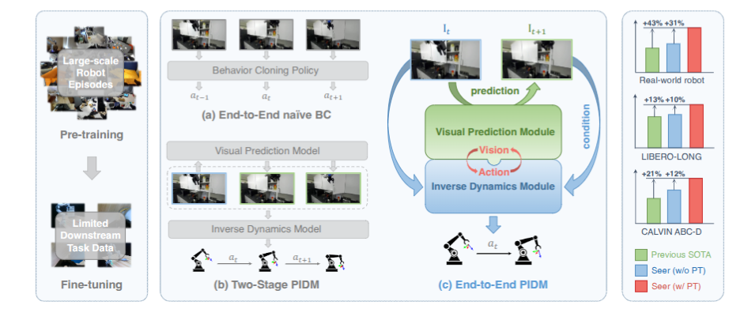
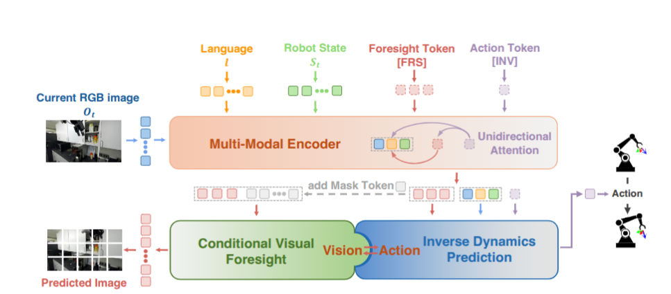

# Seer — Predictive Inverse Dynamics Model end-to-end

> **[SOTA-CODE]** Paper thuộc danh sách [sota_with_code.txt](../sota_with_code.txt) —
> nhóm có mã nguồn công khai. Code: https://github.com/InternRobotics/Seer
> (danh sách dùng org `InternRobotics`; bản PDF ghi `OpenRobotLab/Seer`) ·
> Chỉ mục nhóm: [../sota_co_code.md](../sota_co_code.md)

## 1. Nguồn

- Tiêu đề: *Predictive Inverse Dynamics Models are Scalable Learners for Robotic Manipulation*
- Tác giả: Yang Tian, Sizhe Yang (đồng tác giả chính), Jia Zeng, Ping Wang,
  Dahua Lin, Hao Dong, Jiangmiao Pang (Shanghai AI Lab / PKU / CUHK)
- arXiv: [2412.15109v1](https://arxiv.org/abs/2412.15109), 19 Dec 2024
- Venue: ICLR 2025
- Code: https://github.com/OpenRobotLab/Seer/
- PDF trong repo: [docs/papers/long-horizon/seer_predictive_inverse_dynamics.pdf](../../../paper/long-horizon/seer_predictive_inverse_dynamics.pdf)
- Phân loại: **future prediction** (dự đoán trạng thái thị giác tương lai để dẫn
  hướng action).

## 2. Câu hỏi nghiên cứu

Hai hướng scale policy đang tách rời: hướng "action" (behavior cloning trên dữ liệu robot lớn) và hướng "vision" (pretrain biểu diễn hoặc world model rồi ghép hai giai đoạn).

Nếu **khép vòng vision-action ngay trong training và inference** thì có được policy scale tốt hơn cả hai không?

## 3. Đóng góp

1. **PIDM end-to-end**: dự đoán action bằng inverse dynamics **có điều kiện trên
   trạng thái thị giác tương lai do chính model dự đoán**, tối ưu đồng thời một
   lượt — khác với PIDM hai giai đoạn (video model sinh subgoal → goal-conditioned
   policy riêng).
2. Cơ chế kiến trúc cụ thể: hai readout token `[FRS]` (foresight) và `[INV]`
   (inverse dynamics) với **unidirectional attention mask**.
3. Thiết kế cho phép pretrain trên dữ liệu robot **thiếu nhãn ngôn ngữ và chứa
   hành vi vô nghĩa** (play data, random exploration).

## 4. Method

### 4.1 Hai mục tiêu

Conditional visual foresight — dự đoán ảnh RGB tại $t+n$ từ goal $g$ (ngôn ngữ hoặc robot state) và lịch sử $h_t$ (ảnh + state $m$ bước gần nhất):

$$
\hat{o}_{t+n} = f_{fore}(g, h_t), \qquad
L_{fore} = \lVert f_{fore}(g,h_t) - o_{t+n} \rVert_2^2
$$

Inverse dynamics prediction — mở rộng IDM để dự đoán **chuỗi** action, với $o_{t+n}$ thật được thay bằng biểu diễn **latent dự đoán** $\hat{o}^l_{t+n}$:

$$
\hat{a}_{t:t+n-1} = f_{inv}(g, h_t, \hat{o}^l_{t+n})
$$

$$
L_{inv} = L_{arm} + \lambda L_{gripper}, \qquad \lambda = 0.01
$$

($L_{arm}$ = Smooth-L1, $L_{gripper}$ = BCE.)

Tổng: $L = \alpha L_{fore} + L_{inv}$, $\alpha = 0.5$.

Chi tiết quyết định: fusion xảy ra **trong latent space**, không phải trên ảnh đã decode. Đó là điều cho phép gradient chảy end-to-end.

### 4.2 Unidirectional attention mask

- `[FRS]` attend tới language, ảnh và state trong lịch sử.
- `[INV]` attend tới cùng các token đó **và thêm `[FRS]`**; `[FRS]` không attend ngược lại `[INV]`.

Hai lợi ích tác giả nêu: `[INV]` tích hợp sâu thông tin quá khứ **và** tương lai
qua nhiều layer; và training end-to-end trở nên khả thi nhờ fusion latent.

### 4.3 Kiến trúc và quy mô

| Thành phần   | Lựa chọn                                                             |
| -------------- | ---------------------------------------------------------------------- |
| Text           | CLIP text encoder → linear                                            |
| Image          | ViT (MAE-style) →**perceiver resampler** để giảm số token  |
| State          | MLP                                                                    |
| Backbone       | GPT-2 style transformer + learnable positional embedding theo timestep |
| Image decoder  | ViT với mask token, mỗi output = một patch                          |
| Action decoder | MLP                                                                    |

Encoder pretrained bị **đóng băng**: 251M tham số không train. Seer: 65M trainable
(tổng 316M). Seer-Large: 315M trainable.

### 4.4 Hai mẹo cho pretraining trên dữ liệu bẩn

1. **Thiếu nhãn ngôn ngữ**: dùng robot state tại $t+n+1$ làm goal thay cho
   language token, để `[FRS]` luôn có tín hiệu rõ ràng.
2. **Hành vi vô nghĩa**: trong pretraining, `[INV]` và `[FRS]` **không** attend
   tới ảnh và state ở các bước trước, để tránh overfit vào hành vi cụ thể.

Đây là hai chi tiết dễ bỏ qua nhưng chính là thứ làm cho pretrain trên CALVIN
play data (không nhãn) và DROID có tác dụng.

## 5. Claim → Evidence

### 5.1 LIBERO-LONG (pretrain LIBERO-90 → finetune LIBERO-LONG, 10 task)

| Method         | Avg Success (%) |
| -------------- | --------------- |
| MTACT          | 41.0            |
| OpenVLA (7B)   | 54.0            |
| MVP            | 68.2            |
| MPI            | 77.3            |
| Seer (scratch) | 78.7            |
| **Seer** | **87.7**  |

Seer có 65M tham số trainable — 4% của OpenVLA — nhưng hơn 62% tương đối.

### 5.2 CALVIN ABC-D (train A/B/C, eval D)

| Method                           | Avg Len ↑     |
| -------------------------------- | -------------- |
| RoboFlamingo                     | 2.47           |
| Susie (PIDM 2 giai đoạn)       | 2.69           |
| GR-1 (video generative pretrain) | 3.06           |
| 3D Diffuser Actor                | 3.27           |
| CLOVER                           | 3.53           |
| Seer (scratch)                   | 3.64           |
| Seer                             | 3.98           |
| Seer-Large (scratch)             | 3.83           |
| **Seer-Large**             | **4.28** |

Pretrain ở đây dùng **play data không có nhãn ngôn ngữ**, chứa hành vi ngẫu
nhiên — vẫn cho +0.34 Avg Len.

### 5.3 Data efficiency và scaling

- Với **10% dữ liệu downstream**: +187% tương đối trên LIBERO-LONG success rate,
  +150% tương đối trên CALVIN Avg Len so với train from scratch.
- Chỉ cần **70%** dữ liệu để vượt SOTA trước đó trên cả hai benchmark.
- Scaling: 65M → 107M → 316M trainable, Avg Len tăng đơn điệu ở cả hai chế độ
  (có và không pretrain).

### 5.4 Ablation mục tiêu (CALVIN ABC-D, Avg Len)

| $L_{fore}$ | $L_{inv}$ | Fine-tuning    | Pre-training   |
| ------------ | ----------- | -------------- | -------------- |
| ✗           | ✗          | 3.31           | 3.64           |
| ✓           | ✗          | 3.41           | 3.73           |
| ✓           | ✓          | **3.64** | **3.98** |

Đọc bảng: chỉ thêm dự đoán ảnh tương lai cho +0.10; **ghép** nó vào đường dẫn
action cho thêm +0.23. Tức là giá trị nằm ở việc *dùng* foresight để điều kiện
action, không phải ở việc *có* foresight như auxiliary task.

### 5.5 Real world (Franka Research 3 + Robotiq-2f-85, pretrain DROID)

100 demo/task, 15 Hz, 2 camera D435i (eye-on-hand + eye-on-base). Mỗi cặp
method-task có 15 trial; mỗi trial cho tối đa 3 execution (45 execution cho mỗi
method-task). Không dùng `>900` như một con số per-task vì đó chỉ có thể là phép
cộng qua nhiều method và task trong bảng.

| Method         | Avg SR (%) / Score    |
| -------------- | --------------------- |
| OpenVLA        | 16.7 / 11.0           |
| MPI            | 48.4 / 29.3           |
| MVP            | 55.0 / 29.8           |
| Seer (scratch) | 60.0 / 32.8           |
| **Seer** | **78.4 / 39.5** |

Robustness (SR không pretrain → có pretrain): nhiều vật gây nhiễu 33.3 → 60.0;
đổi background 6.67 → 33.3; vật thể mới 46.7 → 60.0; thêm nguồn sáng 46.7 → 66.7.

## 6. Giới hạn và điểm chưa rõ

- **Không có giới hạn nào được tác giả nêu tường minh** trong phần chính — đây tự
  nó là một điểm yếu của paper.
- $L_{fore}$ là **MSE pixel-level**. Với cảnh nhiều chi tiết hoặc nhiều mode hợp
  lệ, MSE tạo ảnh mờ; paper không đo chất lượng dự đoán ảnh (không có FID/PSNR),
  cũng không kiểm tra xem chất lượng ảnh có tương quan với hiệu năng action không.
- Siêu tham số $n$ (khoảng nhìn trước) không được quét. Đây là tham số then chốt:
  $n$ nhỏ thì foresight vô nghĩa, $n$ lớn thì khó dự đoán.
- Chỉ dùng RGB làm biểu diễn tương lai; không so với dự đoán trong latent space
  của một encoder đông lạnh (rẻ hơn nhiều).
- OpenVLA trong so sánh real-world chỉ dùng eye-on-base camera trong khi Seer
  dùng cả eye-on-hand — tác giả có nêu, nhưng đây là **so sánh không công bằng
  về input**.
- "Long-horizon" ở đây là LIBERO-LONG và CALVIN 5 task liên tiếp (~chục giây tới
  một phút), không phải 10–15 phút như π0.5. Đừng so trực tiếp thang thời gian.

## 7. Liên hệ với workspace

- Seer là **đối cực rẻ** của cả tập paper này: 65M tham số trainable, không cần
  VLM 7B, không cần nhãn subtask, chạy được với dữ liệu play không nhãn. Nếu
  workspace cần một baseline long-horizon có thể tự train, đây là ứng viên số 1.
- Có code công khai (OpenRobotLab/Seer) — là paper duy nhất trong tập này có repo
  được nêu rõ trong bản trích. Phù hợp với yêu cầu "kết luận truy vết được tới
  code" ở [.agents/overview.md](../../../../.agents/01_overview.md).
- Hai mẹo pretraining (state làm goal thay language; chặn attention tới lịch sử)
  áp dụng trực tiếp cho bất kỳ dataset nào mà `vla-data-tools` đọc vào có nhãn
  ngôn ngữ thiếu hoặc rời rạc — đúng tình huống RLDS/OXE.
- Liên hệ với các hướng dự báo khác trong thư mục này: Seer tưởng tượng ở
  **latent, mỗi bước, để sinh action**.

## 8. Thử nghiệm tiếp theo

1. **Quét $n$**: đây là ablation thiếu rõ ràng nhất. Nếu hiệu năng phẳng theo $n$
   thì foresight đang hoạt động như regularizer chứ không phải như "goal", và
   toàn bộ diễn giải của paper cần xem lại.
2. **Thay pixel MSE bằng latent loss** (dự đoán feature của encoder đông lạnh).
   Nếu kết quả giữ nguyên thì bỏ được ViT decoder — giảm đáng kể chi phí.
3. **Ghép Seer với memory**: Seer nhìn $m$ bước lịch sử cố định. Thử thay bằng
   PCMB của [MemoryVLA](../memory_modules/memoryvla.md) trên
   Mikasa-Robo/Push-Buttons — task mà foresight thuần không giải được vì ảnh
   trước và sau giống nhau.
