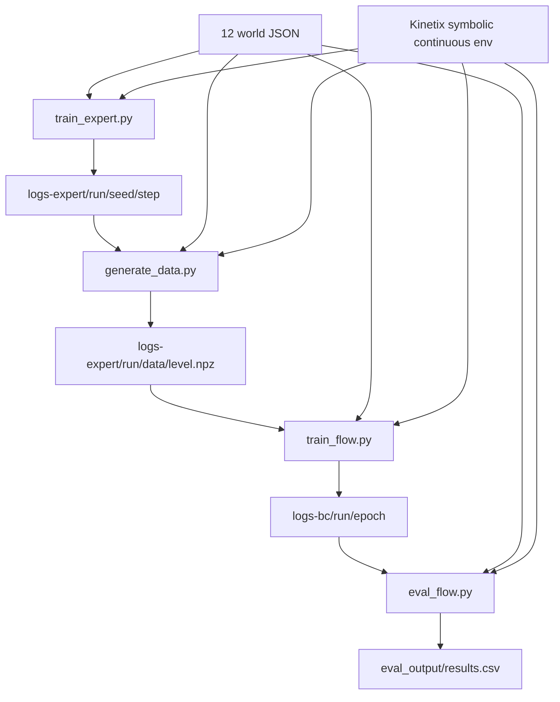

# Tổng quan code `real-time-chunking-kinetix`

## Ý tưởng chính

Repo này là pipeline thí nghiệm mô phỏng cho RTC, không phải runtime robot thật. Sáu module
Python tạo thành hai nhánh:

1. `train_expert.py -> generate_data.py` tạo demonstration từ các expert RL;
2. `model.py -> train_flow.py -> eval_flow.py` huấn luyện và so sánh các policy action
   chunking.

`render_levels.py` là tiện ích độc lập để kiểm tra trực quan 12 level. Kinetix được vendored
như submodule và cung cấp environment, wrapper cơ sở, serializer level và renderer.

**Trạng thái bằng chứng:** cấu trúc và hành vi dưới đây đã được kiểm tra tĩnh tại commit`9296f31d62d5bfeb5779dcb2f9bcf71ca37f448b` ngày 2026-07-23. Training, data generation và evaluation chưa được chạy lại trong workspace.

## Bản đồ module

| Module                                                      | Trách nhiệm                                            | Input chính                               | Output chính                                   |
| ----------------------------------------------------------- | -------------------------------------------------------- | ------------------------------------------ | ----------------------------------------------- |
| [`model.py`](details/model.md)                          | MLP-Mixer flow policy, flow-matching loss và ba sampler | observation, noise/action chunk, flow time | velocity hoặc action chunk`H=8`              |
| [`train_expert.py`](details/train_expert.md)            | Train expert actor-critic bằng PPO/RPO                  | 12 level Kinetix                           | expert`.pkl`, stats `.json`, video `.mp4` |
| [`generate_data.py`](details/generate_data.md)          | Chọn mixture expert và rollout demonstration           | expert checkpoint + stats                  | một`.npz` cho mỗi level                     |
| [`train_flow.py`](details/train_flow.md)                | Behavior cloning bằng conditional flow matching         | demonstration`.npz`                      | flow-policy`.pkl` theo epoch                  |
| [`eval_flow.py`](details/eval_flow.md)                  | Quét delay/horizon cho naive, RTC, BID và hard masking | flow checkpoint                            | `results.csv`                                 |
| [`render_levels.py`](details/render_levels.md)          | Render trạng thái ban đầu của level                 | `worlds/l/*.json`                        | 12 ảnh JPEG                                    |
| [`worlds/l` và Kinetix](details/kinetix_and_worlds.md) | Định nghĩa task và backend vật lý 2D               | JSON level                                 | `EnvState`, observation, transition, pixels   |

## Luồng end-to-end



Các artifact nối nhau bằng convention đường dẫn, không có manifest hay schema version:

```text
logs-expert/<run>/
├── seed_<seed>/<update>/
│   ├── policies/worlds_l_<level>.pkl
│   ├── stats/worlds_l_<level>.json
│   └── videos/worlds_l_<level>.mp4
└── data/worlds_l_<level>.npz

logs-bc/<run>/<epoch>/
└── policies/worlds_l_<level>.pkl

eval_output/
└── results.csv
```

## Call graph giữa các module

```text
train_expert
├── Kinetix env/wrappers/saving/renderer
└── tạo Agent + expert artifacts

generate_data
├── train_expert.{constants, wrappers, Agent, load_levels}
└── đọc expert artifacts -> Data -> NPZ

train_flow
├── generate_data.Data
├── model.FlowPolicy
├── eval_flow.eval
└── train_expert.{constants, load_levels}

eval_flow
├── model.FlowPolicy.{action,realtime_action,bid_action}
└── train_expert.{BatchEnvWrapper, NoisyActionWrapper, render helper, load_levels}

render_levels
└── Kinetix saving/env/renderer trực tiếp
```

## Ranh giới đã xác minh

- Repo dùng observation symbolic và action continuous; camera/VLM/language không xuất hiện
  trong code mô phỏng.
- “Real-time” ở đây được mô phỏng bằng căn chỉnh index action chunk trong một `jax.lax.scan`;
  không có thread inference, clock, deadline hay giao tiếp robot.
- Checkpoint là Python pickle chứa Flax NNX state dict. Khả năng tương thích phụ thuộc đúng
  graph/config code; repo không ghi config kèm checkpoint.
- README yêu cầu số GPU chia hết cho số level
  ([README:19-21](https://github.com/Physical-Intelligence/real-time-chunking-kinetix/blob/9296f31d62d5bfeb5779dcb2f9bcf71ca37f448b/README.md#L19-L21)).
  Điều này rõ trong `train_flow.py` và `eval_flow.py`. Với `train_expert.py`, thứ tự `vmap`
  level/seed kết hợp một `NamedSharding` một chiều chưa đủ để kết luận trục vật lý nếu chưa
  inspect runtime JAX.

## Đọc tiếp

- [Cài đặt và cách dùng](usage.md)
- [Mô hình và các sampler](details/model.md)
- [Train expert](details/train_expert.md)
- [Sinh demonstration](details/generate_data.md)
- [Train flow policy](details/train_flow.md)
- [Đánh giá RTC](details/eval_flow.md)
- [Render level](details/render_levels.md)
- [Kinetix và world JSON](details/kinetix_and_worlds.md)
