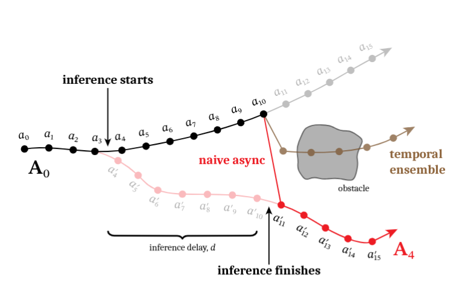
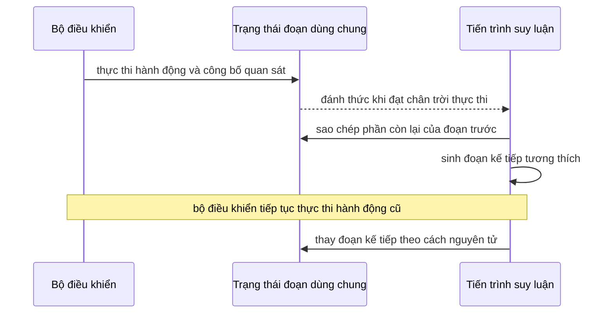

# Runtime bất đồng bộ cho đoạn hành động

## Mục đích

Mô-đun này che giấu độ trễ mô hình bằng cách chạy suy luận đồng thời với thực thi hành động. Đây là hợp đồng runtime chung của cả RTC tại thời điểm suy luận và RTC tại thời điểm huấn luyện; hai phương pháp chỉ khác nhau ở cách sinh đoạn hành động tương thích với đoạn trước đó.

Giả sử chính sách hiện tại dự đoán

$$
A_t=[a_t,\ldots,a_{t+H-1}],
$$

với chân trời dự đoán `H`. Bộ điều khiển thực thi `s` hành động trước khi thay đoạn. Nếu một lần gọi suy luận mất `δ` giây và chu kỳ bộ điều khiển là `Δt`, bài báo định nghĩa độ trễ nguyên

$$
d=\left\lfloor \delta/\Delta t\right\rfloor.
$$

Suy luận phải bắt đầu trước thời điểm chuyển đổi mong muốn `d` bước điều khiển. Trong các bước đó, bộ điều khiển tiếp tục sử dụng đoạn cũ. Miền vận hành hợp lệ là `d <= s <= H - d`.

## Đầu vào và đầu ra

| Mục                         | Ý nghĩa                                                                                              |
| ---------------------------- | ------------------------------------------------------------------------------------------------------ |
| Quan sát mới nhất`o`    | Quan sát được ghi nhận khi suy luận nền bắt đầu                                              |
| Đoạn trước               | Các hành động đã lập kế hoạch còn lại, được dịch sang khung thời gian của đoạn mới |
| Ước lượng độ trễ`d` | Số hành động thuộc đoạn cũ sẽ được thực thi trước khi suy luận hoàn tất              |
| Chân trời thực thi`s`   | Số hành động được sử dụng giữa hai lần bắt đầu sinh đoạn                               |
| Đầu ra                     | Đoạn mới có`d` vị trí đầu khớp với các hành động đã cam kết                         |

## Luồng runtime

Thuật toán 1 của bài báo về RTC tại thời điểm suy luận sử dụng trạng thái dùng chung được mutex bảo vệ, một biến điều kiện và vòng lặp suy luận nền.

Thuật toán ước lượng thận trọng độ trễ kế tiếp bằng giá trịlớn nhất trong một bộ đệm ngắn chứa các độ trễ quan sát được, rồi chọn chân trời thực thi hiệu dụng là
`max(d, s_min)`.

Bộ đánh giá Kinetix được phát hành triển khai cùng cách căn chỉnh thời gian dưới dạng mô phỏng theo lô:
nó thực thi `d` hành động đầu từ đoạn trước, sau đó thực thi các hành động `d:s` từ đoạn mới sinh. Trước
vòng lặp kế tiếp, nó loại bỏ `s` vị trí đầu của đoạn mới
([`eval_flow.py`, lines 119–139](https://github.com/Physical-Intelligence/real-time-chunking-kinetix/blob/9296f31d62d5bfeb5779dcb2f9bcf71ca37f448b/src/eval_flow.py#L119-L139)).

## Giả định và giới hạn về thời gian

- **Đã xác minh:** bài báo giả định việc ghi nhận quan sát và sử dụng hành động được đồng bộ tại ranh giới  bước điều khiển; bài báo không mô hình hóa độ trễ dưới một bước hoặc độ dao động thời gian.
- **Đã xác minh:** bộ lập lịch robot đầy đủ được mô tả trong bài báo nhưng không có trong mã Kinetix công khai. Bộ đánh giá công khai sử dụng `inference_delay` và `execute_horizon` mô phỏng, cố định.
- **Yêu cầu kỹ thuật suy ra:** một triển khai thực tế cần quan sát có dấu thời gian, độ trễ đầu-cuối được đo, phương án dự phòng an toàn khi `d > H - s` và thao tác thay đoạn nguyên tử. Các yêu cầu này bắt nguồn từ hợp đồng thời gian nhưng chưa được runtime phát hành đặc tả đầy đủ.
- **Chưa rõ:** hành vi khi trễ hạn, phản hồi mạng bị đảo thứ tự, mất gói tin của bộ điều khiển hoặc độ
  trễ thay đổi nhanh hơn bộ đệm của bộ ước lượng.

## Bằng chứng

- *Real-Time Execution of Action Chunking Flow Policies*, Mục 2 và 3.3, Thuật toán 1, trang
  2–6: [PDF cục bộ](<../../../../papers/realtime-chunking/Real-Time Execution of Action Chunking Flow Policies.pdf>).
- *Training-Time Action Conditioning for Efficient Real-Time Chunking*, Mục III và Hình 1,
  trang 2: [PDF cục bộ](<../../../../papers/realtime-chunking/Training-Time Action Conditioning for Efficient Real-Time Chunking.pdf>).
